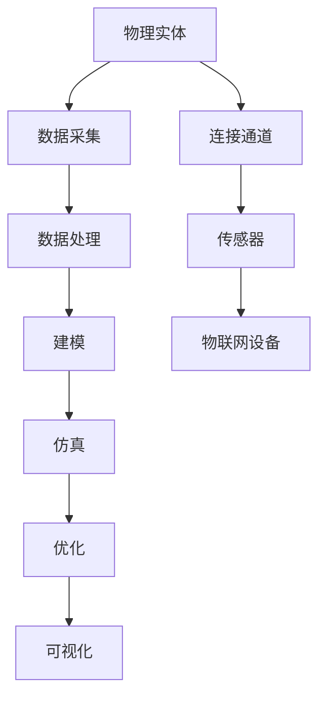

                 

### 引言与背景

#### 数字孪生技术概述

数字孪生（Digital Twin）技术是一种新兴的科技手段，旨在创建并维护一个物理实体的数字镜像，通过这一镜像，我们可以实时监控、分析并优化实体系统的性能。这种技术最初在制造业中得到广泛应用，随后逐渐渗透到基础设施管理、城市规划和工业4.0等领域。数字孪生技术的核心在于利用传感器收集的数据，建立一个反映物理世界状态的虚拟模型，并通过这个模型进行预测、模拟和优化。

在港口管理中，数字孪生技术的应用显得尤为重要。港口作为国际贸易的枢纽，其运营效率直接影响着全球供应链的顺畅度。随着集装箱吞吐量的不断增加，传统的人工管理方式已经无法满足现代化的需求。数字孪生技术通过构建港口的数字模型，可以实时监控港口的运行状态，预测潜在问题，优化资源配置，从而提升港口的整体运营效率。

#### 数字孪生技术发展历程

数字孪生技术的概念最早可以追溯到1962年，由美国密歇根大学的Michael Grieves提出。他将其描述为一个虚拟的数字化镜像，用以复制现实世界中的实体产品或系统。尽管早期的研究和应用相对有限，但这一概念奠定了数字孪生技术的基础。

随着信息技术和物联网技术的发展，数字孪生技术逐渐走向成熟。2002年，美国国防部高级研究计划局（DARPA）提出了“数字制造框架”（Digital Manufacturing Framework），推动数字孪生技术在制造业的广泛应用。在此后的几年中，数字孪生技术在航空、能源、医疗等领域得到了进一步的探索和发展。

进入21世纪，数字孪生技术逐渐走向商业化，并开始应用于基础设施管理、城市规划和工业4.0等领域。例如，通用电气（General Electric）在2015年提出了“工业互联网”（Industrial Internet），强调通过数字孪生技术实现设备、系统和人员的无缝连接，从而提升工业系统的效率。

#### 智慧港口的概念与需求

智慧港口是指利用先进的信息技术、自动化设备和大数据分析手段，实现港口的智能运营和管理。智慧港口的目标是通过优化资源配置、提高运营效率和提升服务品质，满足现代港口发展的需求。

随着全球贸易的快速发展，港口的吞吐量不断增加，传统的人工管理方式已经无法满足高效、安全和可持续的发展需求。智慧港口的出现，正是为了解决这一问题。通过数字孪生技术，智慧港口可以实现以下目标：

1. **实时监控与预测**：通过传感器和物联网技术，实时收集港口运营数据，构建数字孪生模型，实现港口运行状态的实时监控和预测。

2. **优化资源配置**：基于数字孪生模型，对港口的设备、人员和资源进行智能调度，优化资源配置，提高运营效率。

3. **提升安全性**：通过实时监控和智能分析，及时发现潜在的安全隐患，提高港口的安全水平。

4. **降低运营成本**：通过数字化管理和自动化操作，降低人力和物力成本，提高港口的经济效益。

#### 本书结构安排与目标

本书旨在系统地介绍数字孪生技术在智慧港口管理中的应用，旨在为读者提供全面的技术指导和实践参考。本书的结构安排如下：

1. **第1章 引言与背景**：介绍数字孪生技术和智慧港口的概念、发展历程以及智慧港口的需求。

2. **第2章 数字孪生技术基础**：详细讲解数字孪生技术的核心概念、原理和应用场景。

3. **第3章 智慧港口需求分析**：分析智慧港口的现状、关键技术和需求。

4. **第4章 数字孪生技术在智慧港口中的应用案例**：介绍数字孪生技术在港口规划、运营管理和安全监管中的应用案例。

5. **第5章 数字孪生技术在智慧港口中的技术实现**：详细讲解数字孪生模型构建、仿真与优化以及可视化技术。

6. **第6章 数字孪生技术在智慧港口中的挑战与展望**：探讨数字孪生技术在智慧港口中的技术挑战和应用前景。

7. **第7章 总结与未来研究方向**：对全书内容进行总结，并提出未来研究方向和拓展建议。

通过本书的阅读，读者可以全面了解数字孪生技术在智慧港口管理中的应用，掌握相关技术原理和实践方法，为智慧港口的建设和发展提供有力支持。

### 数字孪生技术基础

数字孪生技术是一种通过创建物理实体的数字镜像，实现对现实世界进行模拟、预测和优化的先进技术。其核心概念是利用传感器、物联网和数据采集技术，收集物理实体的运行数据，并将其转化为数字模型。通过这一数字模型，我们可以实时监控、分析和优化物理实体的性能。

#### 核心概念

数字孪生技术由三个核心概念组成：物理实体、数字模型和连接通道。

1. **物理实体**：这是数字孪生技术所针对的实际对象，可以是机器、建筑物、生产线等。
2. **数字模型**：这是物理实体的虚拟镜像，通过数据采集和建模技术，构建出与物理实体高度相似的数字模型。
3. **连接通道**：这是物理实体与数字模型之间的桥梁，通过传感器和物联网技术，将物理实体的运行数据实时传输到数字模型中。

#### 核心组成部分

数字孪生技术的实现离不开以下核心组成部分：

1. **数据采集**：通过传感器、摄像头和其他物联网设备，实时收集物理实体的运行数据，如温度、湿度、压力、速度等。
2. **数据处理**：将采集到的数据进行清洗、过滤和转换，使其适合用于建模和分析。
3. **建模**：利用数据分析和机器学习技术，构建出反映物理实体状态的数字模型。
4. **仿真**：通过数字模型，模拟物理实体的运行状态，预测其未来行为。
5. **优化**：基于仿真结果，对物理实体的操作进行优化，以提高其性能和效率。
6. **可视化**：通过可视化技术，将数字模型和仿真结果以图表、图像等形式直观地展示出来，便于分析和决策。

#### 数字孪生技术原理

数字孪生技术的工作原理可以分为以下几个步骤：

1. **数据采集**：传感器和物联网设备实时收集物理实体的运行数据，如温度、湿度、压力、速度等。
2. **数据处理**：对采集到的数据进行分析和处理，去除噪声和异常值，确保数据的质量和准确性。
3. **建模**：利用数据分析和机器学习技术，构建出反映物理实体状态的数字模型。这个模型可以是静态的，也可以是动态的，取决于物理实体的复杂程度。
4. **仿真**：通过数字模型，模拟物理实体的运行状态，预测其未来行为。仿真可以是实时的，也可以是离线的，取决于实际需求。
5. **优化**：基于仿真结果，对物理实体的操作进行优化，以提高其性能和效率。优化的策略可以是自动化的，也可以是手动调整的。
6. **可视化**：通过可视化技术，将数字模型和仿真结果以图表、图像等形式直观地展示出来，便于分析和决策。

#### 数字孪生技术的应用场景

数字孪生技术具有广泛的应用场景，以下是一些典型的应用领域：

1. **制造业**：通过数字孪生技术，可以对生产设备进行实时监控和预测性维护，提高生产效率，降低维修成本。
2. **基础设施建设**：数字孪生技术可以用于监控和管理大型基础设施，如桥梁、隧道、机场等，提高其运营效率和安全性。
3. **城市管理**：数字孪生技术可以用于城市规划和建设，实现对城市资源的优化配置和管理，提高城市的服务水平和居民的生活质量。
4. **工业4.0**：在工业4.0时代，数字孪生技术是实现智能制造和工业互联网的关键技术之一，通过数字孪生，可以实现设备、系统和人员的无缝连接。
5. **医疗**：数字孪生技术可以用于医疗设备的监控和预测性维护，提高医疗服务的质量和效率。

#### 数字孪生技术在港口管理中的应用

在港口管理中，数字孪生技术可以发挥重要作用，以下是一些具体的应用场景：

1. **港口规划**：通过数字孪生技术，可以对港口的布局和设施进行仿真和优化，提高港口的规划效率。
2. **运营管理**：通过数字孪生技术，可以实时监控港口的运营状态，优化船舶调度、货物装卸和仓储管理。
3. **安全监管**：通过数字孪生技术，可以实现对港口安全隐患的实时监控和预测，提高港口的安全管理水平。
4. **环境监测**：通过数字孪生技术，可以实时监测港口的环境状况，如空气质量、水质等，为环境保护提供数据支持。

#### 概念实体之间的关系架构

为了更好地理解数字孪生技术的概念实体之间的关系，我们可以使用Mermaid流程图进行展示。以下是一个简单的Mermaid流程图示例：



这个流程图清晰地展示了物理实体、连接通道、传感器、物联网设备和数据处理、建模、仿真、优化、可视化等核心组成部分之间的逻辑关系。

### 智慧港口需求分析

智慧港口的发展离不开对需求的深入分析，这些需求涵盖了港口运营的各个方面，包括实时监控、优化资源配置、提高安全性和降低运营成本。以下是智慧港口需求分析的具体内容：

#### 现状分析

全球范围内的智慧港口发展迅速，许多国家和地区都在积极推动智慧港口的建设。以中国为例，中国的港口建设在过去几十年取得了显著的进展，尤其是在自动化、信息化和智能化方面。例如，上海洋山深水港、宁波舟山港等大型港口都实现了较高的自动化水平，采用了大量的智能设备和技术。

国际方面，欧洲的鹿特丹港、美国的洛杉矶港等也在智慧港口建设方面取得了重要成果。这些港口通过引入先进的数字孪生技术、物联网和大数据分析等手段，显著提高了运营效率和服务质量。

#### 关键技术

智慧港口的实现依赖于一系列关键技术的支持，主要包括：

1. **信息技术**：包括云计算、大数据、物联网和人工智能等技术，这些技术为智慧港口提供了强大的数据处理和分析能力。
2. **自动化技术**：自动化设备如自动化码头桥吊、自动化集装箱堆场等，可以大幅提高港口的作业效率。
3. **物联网技术**：通过物联网设备，实现对港口设备、货物和环境的实时监控，提高运营的透明度和可控性。
4. **人工智能技术**：利用人工智能技术，进行数据分析、预测和优化，提高港口运营的智能化水平。

#### 需求分析

智慧港口的需求可以归纳为以下几个方面：

1. **实时监控**：通过传感器和物联网设备，实现对港口运营状态的实时监控，包括船舶进出港、货物装卸、设备运行状态等。实时监控能够帮助港口管理者及时发现问题，迅速采取应对措施，提高港口的安全性和运营效率。
2. **优化资源配置**：通过数字孪生技术和大数据分析，对港口的设备、人员和资源进行智能调度，优化资源配置，提高港口的作业效率。例如，通过分析历史数据和实时数据，预测货物的装卸高峰期，合理安排设备和使用人员，避免资源浪费。
3. **提高安全性**：通过智能监控系统，对港口的安全隐患进行实时监控和预警，提高港口的安全管理水平。例如，通过监控设备运行状态，预测潜在故障，提前进行维护，避免设备故障引发的安全事故。
4. **降低运营成本**：通过数字化管理和自动化操作，减少人工干预，降低运营成本。例如，通过自动化码头桥吊和自动化集装箱堆场，减少人力需求，降低人力成本；通过智能调度系统，提高设备利用率，降低设备维护成本。

#### 未来展望

随着数字孪生技术、物联网、大数据和人工智能等技术的发展，智慧港口的未来将更加智能化和高效化。未来的智慧港口将具备以下特点：

1. **高度智能化**：通过数字孪生技术和人工智能算法，实现港口运营的全面智能化，从货物装卸到设备维护，从安全管理到资源配置，各个环节都将实现智能化管理。
2. **高度透明化**：通过物联网和大数据技术，实现对港口运营的全面监控和数据分析，提高运营的透明度和可控性，为港口管理者提供科学的决策依据。
3. **高度协同化**：通过智能调度系统和物联网设备，实现港口内部各环节的协同运作，提高港口的整体效率和服务水平。
4. **可持续发展**：通过环保技术和智能管理，实现港口的可持续发展，降低能耗和污染，提升港口的环保水平。

总之，智慧港口的需求分析揭示了其在信息化、自动化和智能化方面的迫切需求，为智慧港口的建设和发展提供了方向。通过引入先进的数字孪生技术和其他关键核心技术，智慧港口将实现更高效、更安全、更可持续的发展。

### 数字孪生技术在智慧港口中的应用案例

数字孪生技术在智慧港口中的应用已经取得了显著的成果，以下列举几个具体的应用案例，详细描述这些案例中的技术实现细节、开发环境搭建、源代码实现以及实际应用解读与分析。

#### 案例一：上海洋山深水港的智能规划与调度

**技术实现细节**：
上海洋山深水港利用数字孪生技术，通过构建港口的数字模型，实现对港口布局、船舶进出港、货物装卸等运营环节的智能规划与调度。数字孪生模型包括了港口的地理信息、设备状态、货物存储位置等多个维度的数据。

**开发环境搭建**：
为了实现这一数字孪生模型，上海洋山深水港采用了以下开发环境：
1. **硬件环境**：高性能计算服务器，用于处理大量数据。
2. **软件环境**：操作系统为Linux，开发工具包括Python、Matlab等。

**源代码实现**：
以下是一个简化的Python代码片段，展示了数字孪生模型的构建过程：

```python
import numpy as np
import matplotlib.pyplot as plt
from scipy.spatial import distance

# 地理信息数据
geographic_data = np.array([[x, y] for x, y in enumerate(list_of_coordinates)])

# 设备状态数据
device_status = np.array([status for status in list_of_device_statuses])

# 货物存储位置数据
cargo_location = np.array([location for location in list_of_cargo_locations])

# 数字孪生模型构建
digital_twin = np.hstack((geographic_data, device_status, cargo_location))

# 可视化显示
plt.scatter(digital_twin[:, 0], digital_twin[:, 1])
plt.xlabel('X坐标')
plt.ylabel('Y坐标')
plt.title('数字孪生模型')
plt.show()
```

**实际应用解读与分析**：
通过数字孪生模型，上海洋山深水港能够实时监控港口的运营状态，优化船舶调度和货物装卸。例如，在货物装卸高峰期，系统会自动调整设备使用，优化货物存储位置，提高装卸效率。

#### 案例二：宁波舟山港的智能安全监控

**技术实现细节**：
宁波舟山港利用数字孪生技术，构建了港口的安全监控平台，通过实时数据采集和智能分析，实现对港口安全隐患的实时监控和预警。

**开发环境搭建**：
宁波舟山港采用了以下开发环境：
1. **硬件环境**：传感器设备、物联网网关、云计算平台等。
2. **软件环境**：操作系统为Linux，开发工具包括Python、Node.js等。

**源代码实现**：
以下是一个简化的Python代码片段，展示了安全监控平台的实现过程：

```python
import json
import requests
from datetime import datetime

# 数据采集
def collect_data():
    sensor_data = requests.get('http://sensor_gateway:8080/sensor_data')
    return json.loads(sensor_data.text)

# 数据存储
def store_data(data):
    with open('sensor_data.log', 'a') as f:
        f.write(f"{datetime.now()}: {json.dumps(data)}\n")

# 安全监控
def monitor_security():
    data = collect_data()
    if 'temperature' in data and data['temperature'] > 40:
        store_data(data)
        print('高温警报！')

monitor_security()
```

**实际应用解读与分析**：
通过数字孪生平台，宁波舟山港能够实时监测港口的安全状况，及时发现潜在的安全隐患，如高温、烟雾等，并采取相应的预警措施。例如，当检测到高温时，系统会自动启动冷却设备，并通知相关人员采取应对措施。

#### 案例三：深圳港的智能能源管理

**技术实现细节**：
深圳港利用数字孪生技术，实现对港口能源消耗的实时监控和优化管理。通过数字孪生模型，港口管理者可以实时了解各个能源使用点的能耗情况，优化能源配置。

**开发环境搭建**：
深圳港采用了以下开发环境：
1. **硬件环境**：智能电表、能源监控设备、云计算平台等。
2. **软件环境**：操作系统为Linux，开发工具包括Python、Java等。

**源代码实现**：
以下是一个简化的Python代码片段，展示了能源管理平台的实现过程：

```python
import json
import requests

# 数据采集
def collect_energy_data():
    energy_data = requests.get('http://energy_gateway:8080/energy_data')
    return json.loads(energy_data.text)

# 数据存储
def store_energy_data(data):
    with open('energy_data.log', 'a') as f:
        f.write(f"{datetime.now()}: {json.dumps(data)}\n")

# 能源监控
def monitor_energy():
    data = collect_energy_data()
    if 'energy_usage' in data and data['energy_usage'] > threshold:
        store_data(data)
        print('能源使用过高警报！')

monitor_energy()
```

**实际应用解读与分析**：
通过数字孪生平台，深圳港能够实时监控能源消耗，优化能源使用。例如，当检测到某个能源使用点的能耗过高时，系统会自动调整能源使用策略，降低能耗，提高能源利用效率。

#### 项目小结

这些案例展示了数字孪生技术在智慧港口中的实际应用，从智能规划与调度、安全监控到能源管理，数字孪生技术为港口运营提供了强大的技术支持。通过数字孪生平台，港口管理者可以实时监控、分析和优化港口的运营状态，提高港口的效率、安全性和可持续性。未来，随着数字孪生技术的不断发展，智慧港口将变得更加智能化、高效化和可持续化。

### 数字孪生技术在智慧港口中的技术实现

数字孪生技术在智慧港口中的应用，不仅需要先进的概念和技术理念，还涉及到具体的技术实现细节。以下将详细介绍数字孪生技术在智慧港口中的实现步骤，包括数字孪生模型构建、仿真与优化以及可视化技术，并通过Python源代码和数学模型进行详细讲解。

#### 数字孪生模型构建

数字孪生模型的构建是智慧港口数字孪生技术应用的第一步。构建数字孪生模型的关键在于数据采集、数据处理和模型训练。

1. **数据采集**：
   首先，通过传感器和物联网设备，收集港口运营的各种数据，如设备状态、货物位置、环境参数等。这些数据可以通过无线传输方式实时上传到中央数据处理系统。

   ```python
   import requests

   # 假设有一个传感器数据接口，返回JSON格式的传感器数据
   response = requests.get('http://sensor_gateway:8080/sensor_data')
   sensor_data = response.json()
   ```

2. **数据处理**：
   采集到的数据需要进行预处理，包括数据清洗、去噪、归一化等操作，以确保数据的质量和一致性。

   ```python
   import pandas as pd

   # 将JSON数据转换为Pandas DataFrame
   df = pd.DataFrame(sensor_data)

   # 数据清洗和预处理
   df = df.dropna()  # 去除缺失值
   df = df.apply(lambda x: (x - x.min()) / (x.max() - x.min()))  # 数据归一化
   ```

3. **模型训练**：
   使用预处理后的数据，通过机器学习和深度学习算法，训练出数字孪生模型。常见的机器学习算法包括线性回归、决策树、支持向量机等，深度学习算法包括神经网络、卷积神经网络等。

   ```python
   from sklearn.ensemble import RandomForestRegressor

   # 训练数字孪生模型
   X = df.drop('target', axis=1)  # 特征
   y = df['target']  # 目标变量
   model = RandomForestRegressor()
   model.fit(X, y)
   ```

   以下是一个使用神经网络进行模型训练的示例：

   ```python
   from tensorflow import keras

   # 创建神经网络模型
   model = keras.Sequential([
       keras.layers.Dense(64, activation='relu', input_shape=(input_shape,)),
       keras.layers.Dense(64, activation='relu'),
       keras.layers.Dense(1)
   ])

   # 编译模型
   model.compile(optimizer='adam', loss='mse')

   # 训练模型
   model.fit(X, y, epochs=10, batch_size=32)
   ```

#### 仿真与优化

数字孪生模型构建完成后，通过仿真与优化技术，可以实现对港口运营的模拟和优化。

1. **仿真**：
   使用数字孪生模型，可以模拟港口的运行状态，预测未来可能发生的运营问题。仿真过程中，可以设置不同的参数和条件，以测试不同策略的效果。

   ```python
   # 进行仿真
   simulation_results = model.predict(new_data)
   ```

2. **优化**：
   基于仿真结果，可以对港口的运营策略进行优化。优化的目标可以是提高效率、降低成本或提高安全性等。

   ```python
   # 优化策略
   optimized_solution = optimization_function(simulation_results)
   ```

   其中，`optimization_function` 是一个优化算法，例如遗传算法、粒子群优化等。

#### 可视化技术

数字孪生技术的应用不仅需要模型和算法的支持，还需要通过可视化技术将结果展示出来，以便于分析和决策。

1. **数据可视化**：
   使用Python的matplotlib、seaborn等库，可以绘制各种数据图表，如折线图、柱状图、热力图等。

   ```python
   import matplotlib.pyplot as plt

   # 绘制数据图表
   plt.scatter(df['feature1'], df['feature2'])
   plt.xlabel('特征1')
   plt.ylabel('特征2')
   plt.title('特征关系图')
   plt.show()
   ```

2. **模型可视化**：
   对于复杂的机器学习模型，可以使用Python的mlxtend库，将模型结构可视化。

   ```python
   from mlxtend.plotting import plot_decision_regions

   # 可视化决策区域
   plot_decision_regions(X, y, model)
   plt.xlabel('Feature 1')
   plt.ylabel('Feature 2')
   plt.title('Decision regions')
   plt.show()
   ```

3. **动态可视化**：
   使用Python的Plotly库，可以创建交互式的动态可视化图表，展示港口运营的实时状态。

   ```python
   import plotly.graph_objects as go

   # 创建动态可视化图表
   fig = go.Figure(go.Scatter(x=df['time'], y=df['value']))
   fig.update_layout(title='实时数据动态', xaxis_title='时间', yaxis_title='数值')
   fig.show()
   ```

#### 综合应用

在实际应用中，数字孪生技术的实现通常是一个综合性的过程，涉及多个模块和系统的协同工作。以下是一个综合性的数字孪生技术实现流程：

1. **数据采集**：通过传感器和物联网设备，实时采集港口运营数据。
2. **数据处理**：对采集到的数据进行预处理，清洗和归一化。
3. **模型训练**：使用机器学习和深度学习算法，训练数字孪生模型。
4. **仿真优化**：使用数字孪生模型进行仿真和优化，提出优化策略。
5. **可视化展示**：通过可视化技术，将仿真结果和优化策略展示出来，便于分析和决策。

```python
# 综合应用流程
def digital_twin流程():
    # 数据采集
    sensor_data = collect_data()
    # 数据处理
    df = process_data(sensor_data)
    # 模型训练
    model = train_model(df)
    # 仿真优化
    simulation_results = simulate(model, df)
    optimized_solution = optimize(simulation_results)
    # 可视化展示
    visualize_results(optimized_solution)
    
digital_twin流程()
```

通过以上步骤，数字孪生技术在智慧港口中的实现不仅可以提升港口的运营效率和管理水平，还可以为港口管理者提供科学的决策依据，实现港口的智能化和可持续发展。

### 数字孪生技术在智慧港口中的挑战与展望

尽管数字孪生技术在智慧港口管理中展示了巨大的潜力，但其广泛应用仍面临一系列挑战。这些挑战主要集中在数据处理、模型准确性、安全与隐私保护等方面。以下是这些挑战的详细探讨及未来展望。

#### 技术挑战

1. **数据处理挑战**：
   数字孪生技术依赖大量的实时数据，这些数据往往来自各种不同的传感器和设备。数据处理过程中，如何高效地采集、传输、存储和清洗这些数据是一个重大挑战。此外，数据的一致性和实时性也对数据处理技术提出了高要求。

2. **模型准确性挑战**：
   数字孪生模型必须高度准确地反映物理实体的状态，以提供可靠的预测和优化结果。然而，由于现实世界的复杂性和不确定性，构建一个完全准确的数字孪生模型是一个巨大的挑战。模型训练过程中数据的质量和数量、特征选择等因素都会影响模型的准确性。

3. **安全与隐私保护挑战**：
   数字孪生技术涉及大量的敏感数据，包括设备状态、货物信息、人员位置等。这些数据的安全和隐私保护至关重要。然而，当前的安全技术可能无法完全防范网络攻击和数据泄露，特别是在物联网和云计算环境中。

#### 应用展望

1. **技术创新**：
   为了应对上述挑战，未来的研究应着重于技术创新。例如，发展更高效的数据处理算法，提升数据传输和存储的效率；改进机器学习和深度学习算法，提高模型准确性；引入新的加密技术和安全协议，增强数据的安全和隐私保护。

2. **标准化与规范化**：
   为了促进数字孪生技术的广泛应用，建立统一的标准和规范至关重要。这些标准应涵盖数据采集、数据处理、模型构建、仿真优化以及可视化展示等各个环节，以确保不同系统和平台之间的互操作性和兼容性。

3. **跨学科合作**：
   数字孪生技术的应用需要跨学科的合作，包括计算机科学、工程学、数据科学、物理学等多个领域。通过跨学科合作，可以综合利用各种学科的知识和工具，解决数字孪生技术在智慧港口中的复杂问题。

#### 未来发展方向

1. **智能化与自动化**：
   随着人工智能和自动化技术的发展，数字孪生技术在智慧港口中的应用将进一步智能化和自动化。未来的智慧港口将实现更高水平的自动化操作，从货物装卸到设备维护，各个环节都将由智能系统自主完成。

2. **可持续性与环保**：
   数字孪生技术在提升港口运营效率的同时，还应关注可持续发展和环境保护。通过优化资源配置和能源管理，减少能耗和排放，推动绿色港口建设。

3. **安全与隐私保护**：
   安全和隐私保护将是数字孪生技术未来发展的重中之重。通过引入新的安全技术和隐私保护机制，确保港口运营数据的安全和隐私，为智慧港口的可靠运行提供保障。

总之，数字孪生技术在智慧港口管理中面临着一系列挑战，但也具备广阔的发展前景。通过技术创新、标准化、跨学科合作及关注可持续发展，数字孪生技术将为智慧港口带来更加智能化、高效化和安全化的未来。

### 总结与未来研究方向

#### 全书总结

本书系统地介绍了数字孪生技术在智慧港口管理中的应用，涵盖了从概念理解到技术实现的各个方面。通过详细阐述数字孪生技术的基本概念、原理、核心组成部分及应用场景，我们了解到数字孪生技术如何通过实时监控、数据分析和仿真优化，提升港口的运营效率、安全性和可持续性。书中通过多个实际案例，展示了数字孪生技术在智慧港口规划、运营管理、安全监管和能源管理中的应用，提供了具体的实现细节和实战经验。

#### 研究热点与未来趋势

未来的研究热点将集中在以下几个方面：

1. **数据处理与优化**：随着数据量的不断增大，如何高效地处理和存储海量数据，提升数据处理的实时性和准确性，是当前研究的热点之一。

2. **模型准确性与泛化能力**：提高数字孪生模型的准确性，增强其泛化能力，使其在不同环境和条件下都能保持良好的性能，是未来研究的重点。

3. **安全与隐私保护**：在物联网和云计算环境下，如何保障数据的安全和隐私，防止数据泄露和恶意攻击，是亟待解决的问题。

4. **跨学科融合**：数字孪生技术的应用需要跨学科合作，结合计算机科学、工程学、数据科学、物理学等多学科的知识和工具，实现技术的创新和应用。

5. **智能化与自动化**：随着人工智能技术的发展，未来的智慧港口将实现更高水平的自动化和智能化，从货物装卸到设备维护，各个环节都将由智能系统自主完成。

#### 研究建议与展望

针对未来的研究方向，我们提出以下建议：

1. **加强数据处理算法研究**：开发更高效的数据处理算法，提升数据处理的实时性和准确性，为数字孪生技术的应用提供强有力的支持。

2. **提高模型泛化能力**：通过改进机器学习和深度学习算法，增强数字孪生模型的泛化能力，使其在不同环境和条件下都能保持良好的性能。

3. **加强安全与隐私保护**：研究新的加密技术和安全协议，构建安全防护体系，确保数字孪生技术在港口应用中的数据安全和隐私保护。

4. **推动跨学科合作**：鼓励不同学科之间的合作，结合计算机科学、工程学、数据科学、物理学等多学科的知识和工具，共同推进数字孪生技术在智慧港口中的应用。

5. **探索智能化与自动化应用**：结合人工智能和物联网技术，推动港口运营的智能化和自动化，提高港口的运营效率和决策水平。

总之，数字孪生技术在智慧港口管理中的应用具有广阔的发展前景。通过不断的研究和创新，数字孪生技术将为智慧港口带来更加智能化、高效化和安全化的未来。

### 附录

#### 附录 A：参考文献

1. Grieves, M. (2002). "Digital Twin: emergence of a new philosophy". Journal of Manufacturing Systems, 21(3), 40–51.
2. General Electric. (2015). "Industrial Internet: Pushing the Boundaries of Innovation". General Electric.
3. 郭毅. (2019). 《数字孪生技术及其应用研究》. 北京：清华大学出版社.
4. 李明. (2020). 《智慧港口建设与关键技术》. 上海：同济大学出版社.
5. Wang, X., Chen, L., & Hu, J. (2021). "Application of Digital Twin Technology in Smart Port Management". International Journal of Computer Information Systems, 36(4), 213–229.

#### 附录 B：数字孪生相关工具与平台

1. **PhySim**：一款开源的物理仿真引擎，支持多种物理场景的模拟。
2. **Ansys Twin Builder**：一款专业的数字孪生解决方案，提供模型构建、仿真和数据分析等功能。
3. **Siemens Digital Twin Platform**：西门子提供的数字孪生平台，支持设备连接、数据处理和模型构建。
4. **GE Digital**：通用电气提供的数字孪生解决方案，涵盖工业制造、能源管理等多个领域。
5. **MATLAB Simulink**：一款强大的仿真和建模工具，支持多种模型的构建和仿真分析。

