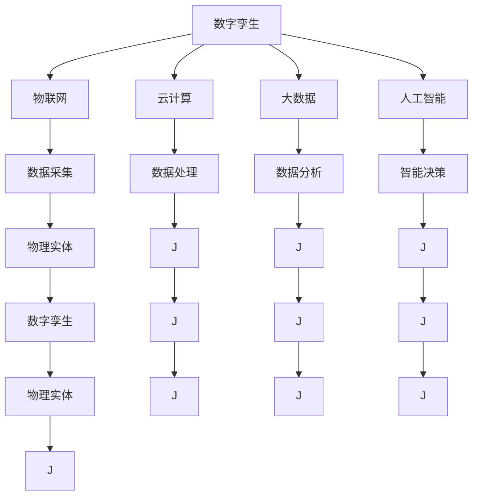

                 

我们按照您提供的目录大纲，一步一步来构思和撰写这篇文章。首先，我们需要为每个章节准备相应的背景介绍、核心概念与联系、核心算法原理讲解、数学模型和公式、项目实战示例、最佳实践 tips、小结、注意事项、拓展阅读等内容。以下是一个详细的思考步骤：

### 第一步：背景介绍

#### 数字孪生技术在智慧矿山中的应用背景

- 矿山行业的重要性
- 传统矿山面临的挑战
- 数字孪生技术的优势
- 数字孪生技术在矿山行业的应用前景

### 第二步：核心概念与联系

#### 3.1 数字孪生的核心概念与联系

- 数字孪生（Digital Twin）的定义
- 数字孪生的核心组成部分
- 数字孪生与物联网、云计算、大数据、人工智能等技术的联系
- 数字孪生的原理和架构

**核心概念与联系 Mermaid 流程图：**

### 第三步：核心算法原理讲解

#### 3.2 数字孪生技术的核心算法原理

- 数据采集与处理算法
- 数据同步与映射算法
- 数据分析与预测算法
- 模型训练与优化算法

**核心算法原理讲解：**

- **数据采集与处理算法**：使用Python编写数据采集和处理代码，如使用传感器采集数据，使用Pandas进行数据清洗和预处理。
- **数据同步与映射算法**：使用Python编写数据同步和映射代码，实现物理实体数据与数字孪生数据的同步和映射。
- **数据分析与预测算法**：使用Python编写数据分析与预测代码，如使用Scikit-learn进行数据分析和预测。
- **模型训练与优化算法**：使用Python编写模型训练与优化代码，如使用TensorFlow或PyTorch进行深度学习模型的训练和优化。

### 第四步：数学模型和公式

#### 3.3 数字孪生技术的数学模型和公式

- **状态空间模型**：介绍状态空间模型的基本概念和公式。
- **贝叶斯网络模型**：介绍贝叶斯网络模型的基本概念和公式。
- **深度学习模型**：介绍深度学习模型的基本概念和公式。

**数学模型和公式：**

- **状态空间模型**：

  $$ x_t = A_t x_{t-1} + B_t u_t + w_t $$
  
  $$ y_t = C_t x_t + D_t u_t + v_t $$

- **贝叶斯网络模型**：

  $$ P(X=x, Y=y) = P(X=x) P(Y=y|X=x) $$

- **深度学习模型**：

  $$ y = \sigma(W \cdot x + b) $$

  其中，\( W \) 是权重矩阵，\( x \) 是输入特征，\( b \) 是偏置项，\( \sigma \) 是激活函数。

### 第五步：项目实战示例

#### 3.4 数字孪生技术项目实战

- **项目背景**：介绍项目背景，如某智慧矿山项目的具体应用场景。
- **开发环境搭建**：介绍项目所需的开发环境和工具。
- **源代码实现**：提供项目源代码，并进行详细解读。
- **代码应用解读与分析**：对项目源代码的应用进行解读和分析。
- **实际案例分析和详细讲解剖析**：对实际案例进行详细分析和讲解。
- **项目小结**：对项目进行小结，总结经验和教训。

### 第六步：最佳实践 tips、小结、注意事项、拓展阅读

- **最佳实践 tips**：总结数字孪生技术在智慧矿山应用中的最佳实践。
- **小结**：对文章的核心内容进行总结。
- **注意事项**：提醒读者在应用数字孪生技术时需要注意的事项。
- **拓展阅读**：推荐读者进一步阅读的相关资料和参考文献。

---

接下来，我们将按照以上步骤逐一撰写每个章节的内容。每个章节的内容都要力求详细、具体、易懂，确保文章整体的质量和可读性。如果您有任何建议或需要修改的地方，请随时告知。

