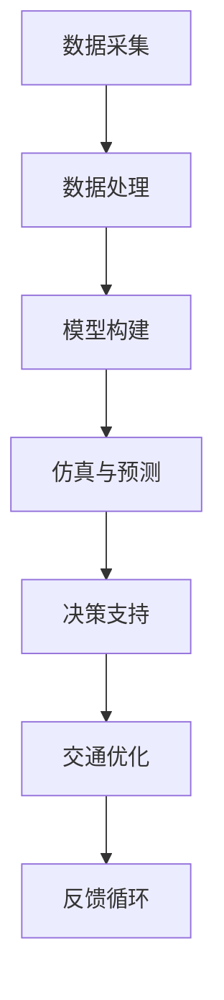
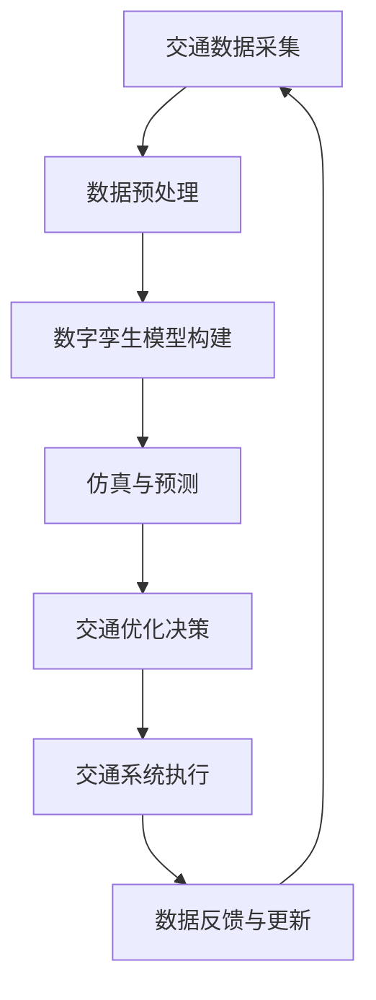

                 

### 数字孪生技术在智能交通中的应用

关键词：数字孪生，智能交通，数据采集，算法，仿真，预测

摘要：数字孪生技术作为一种先进的模拟和优化方法，近年来在智能交通领域得到了广泛关注。本文旨在详细探讨数字孪生技术在智能交通中的应用，包括其核心概念、算法原理、数学模型以及实际案例研究。通过一步步的分析和推理，本文揭示了数字孪生技术如何为智能交通系统带来巨大的改进和效益。

---

## 第一部分：核心概念与联系

### 1.1 数字孪生技术概述

数字孪生（Digital Twin）是一种基于物理实体在虚拟空间中构建数字模型的技术。该模型可以实时反映物理实体的状态、行为和功能。通过数字孪生技术，工程师和设计师可以在虚拟环境中对物理实体进行模拟、分析和优化，从而提高效率、降低成本、减少风险。

- **定义**：数字孪生是一种数字映射，用于表示和分析物理对象的完整生命周期。
- **核心概念**：包括物理实体、虚拟模型、实时数据传输和协同仿真。
- **应用范围**：广泛用于制造业、建筑业、能源管理和智能交通等领域。

### 1.2 智能交通系统概述

智能交通系统（Intelligent Transportation System, ITS）是一个集成了多种信息通信技术、数据分析和自动化控制系统的综合系统。其目标是提高交通效率、减少交通事故、降低污染和提升乘客体验。

- **基本概念**：包括交通监测、信息提供、车辆控制、交通管理和安全监控。
- **组成部分**：传感器、通信网络、数据处理中心、控制系统和用户界面。
- **作用**：优化交通流量、改善交通安全性、提高公共交通服务效率。

### 1.3 数字孪生在智能交通中的应用价值

数字孪生技术在智能交通中的应用具有显著的优势和价值：

- **优势**：
  - **实时监控和预测**：通过实时数据传输和虚拟仿真，可以实现对交通流量的实时监控和预测。
  - **优化交通管理**：基于仿真和数据分析，可以优化交通信号控制、车辆调度和路线规划。
  - **降低成本和风险**：通过虚拟测试和优化，可以降低实际操作中的成本和风险。

- **挑战**：
  - **数据隐私和安全**：大量交通数据的采集和处理需要解决隐私和安全问题。
  - **系统集成与兼容性**：不同的交通设备和系统需要实现高效的集成与数据共享。
  - **技术成熟度和成本**：部分数字孪生技术尚处于发展阶段，需要进一步成熟和降低成本。

- **未来趋势**：
  - **物联网（IoT）和大数据**：随着IoT设备和大数据技术的发展，数字孪生技术的应用前景将更加广阔。
  - **人工智能（AI）和机器学习**：AI和机器学习将进一步提升数字孪生技术在智能交通中的智能化水平。
  - **标准化与法规**：行业标准化和法规的完善将推动数字孪生技术在智能交通中的广泛应用。

### 1.4 数字孪生技术在智能交通中的流程图

以下是一个简化的Mermaid流程图，展示了数字孪生技术在智能交通中的应用流程：



### 设计数字孪生技术在智能交通中的应用目录大纲

```
# 数字孪生技术在智能交通中的应用

## 第一部分：核心概念与联系

### 1.1 数字孪生技术概述
- 数字孪生技术的定义
- 数字孪生技术的核心概念
- 数字孪生技术的应用范围

### 1.2 智能交通系统概述
- 智能交通系统的基本概念
- 智能交通系统的组成部分
- 智能交通系统的作用

### 1.3 数字孪生在智能交通中的应用价值
- 应用价值
- 挑战
- 未来趋势

### 1.4 数字孪生技术在智能交通中的流程图
- Mermaid流程图展示

## 第二部分：核心算法原理讲解

### 2.1 数据采集与处理
- 传感器数据采集
- 数据预处理方法

### 2.2 模型构建与训练
- 机器学习算法
- 神经网络架构
- 训练过程

### 2.3 仿真与预测
- 仿真平台搭建
- 预测模型训练与验证

### 2.4 伪代码示例
- 数据预处理
- 模型训练
- 预测流程

## 第三部分：数学模型和数学公式

### 3.1 状态估计与预测
- 卡尔曼滤波
- 粒子滤波

### 3.2 优化与决策
- 多目标优化
- 马尔可夫决策过程

### 3.3 复杂网络分析
- 网络拓扑
- 路径优化

### 3.4 数学公式示例
- 公式解释

## 第四部分：项目实战

### 4.1 实际案例研究
- 案例选取
- 应用效果展示

### 4.2 开发环境搭建
- 硬件环境
- 软件环境

### 4.3 源代码详细实现
- 关键算法实现
- 模型代码解读

### 4.4 代码解读与分析
- 代码性能分析
- 优化建议

## 第五部分：未来发展趋势与挑战

### 5.1 技术发展趋势
- 人工智能
- 大数据
- 云计算

### 5.2 政策法规与标准化
- 行业标准
- 法规影响

### 5.3 技术挑战
- 数据隐私
- 安全问题
- 跨领域协同

## 第六部分：总结与展望

### 6.1 总结
- 对数字孪生技术在智能交通中的应用进行归纳和总结

### 6.2 展望
- 探讨未来发展方向和潜在的研究领域
```

以上是《数字孪生技术在智能交通中的应用》的初步目录大纲，下面将逐步展开详细内容。

---

### 第一部分：核心概念与联系

#### 1.1 数字孪生技术概述

数字孪生技术（Digital Twin Technology）是一种通过创建物理实体的数字副本来实现实时监控、仿真分析和优化决策的技术。它结合了物联网（IoT）、云计算、大数据分析和人工智能（AI）等技术，为各个领域，特别是智能交通系统提供了全新的解决方案。

**数字孪生技术的定义**：

数字孪生（Digital Twin）指的是一个数字化的物理实体模型，它可以实时反映物理实体的属性、状态和行为。数字孪生技术通过在虚拟环境中创建物理实体的数字镜像，使工程师和设计师能够在不干扰实际物理实体的前提下，对其进行仿真测试、性能优化和预测分析。

**核心概念**：

- **物理实体**：指的是实际存在的交通系统，包括道路、车辆、交通信号灯等。
- **虚拟模型**：基于物理实体的数据和算法构建的数字模型，可以模拟实际交通系统的运行状态。
- **实时数据传输**：通过传感器和通信网络，将物理实体的实时数据传输到虚拟模型中。
- **协同仿真**：在虚拟环境中对交通系统进行模拟和测试，以评估其性能和可靠性。

**应用范围**：

数字孪生技术广泛应用于智能制造、建筑管理、能源系统、医疗健康等领域。在智能交通领域，数字孪生技术可以用于交通流量管理、交通信号控制、车辆调度、路线规划等，从而提高交通效率、减少拥堵和降低事故率。

#### 1.2 智能交通系统概述

智能交通系统（Intelligent Transportation System，ITS）是指利用现代信息技术和自动化控制技术，实现交通管理和服务智能化的一整套系统。它的目标是提高交通系统的安全、效率和可持续性。

**基本概念**：

- **交通监测**：通过传感器和监控系统实时获取交通流量、速度、密度等数据。
- **信息提供**：通过电子屏幕、广播和移动互联网等渠道向交通参与者提供实时交通信息。
- **车辆控制**：对车辆进行自动化控制和调度，以优化交通流量。
- **交通管理**：通过中心控制系统对交通信号、道路照明和交通设施进行集中管理。
- **安全监控**：利用视频监控、雷达等技术对道路安全进行实时监控。

**组成部分**：

- **传感器**：包括摄像头、雷达、GPS、流量监测仪等，用于收集交通数据。
- **通信网络**：包括无线网络、互联网和专用通信网络，用于传输交通数据。
- **数据处理中心**：负责存储、处理和分析交通数据，提供决策支持。
- **控制系统**：包括交通信号控制、车辆控制和道路设施控制等，用于实现交通管理。
- **用户界面**：包括电子屏幕、手机应用、广播等，用于向交通参与者提供信息和服务。

**作用**：

- **提高交通效率**：通过实时交通信息的获取和优化，减少交通拥堵，提高道路利用率。
- **改善交通安全性**：通过实时监控和预警，减少交通事故的发生。
- **提升乘客体验**：通过提供实时交通信息和个性化服务，提升公共交通和私人交通的便利性。

#### 1.3 数字孪生在智能交通中的应用价值

数字孪生技术在智能交通系统中具有巨大的应用价值，它能够为交通管理部门、交通参与者以及相关企业提供以下几方面的好处：

**应用价值**：

- **实时监控和预测**：数字孪生技术可以实时反映交通系统的状态，并通过仿真预测交通流量、车辆速度和密度等参数，帮助交通管理部门提前应对可能的交通拥堵和事故。
- **优化交通管理**：基于数字孪生技术，交通管理部门可以更精准地控制交通信号灯、调度交通流量，从而优化交通信号控制策略，提高道路通行效率。
- **降低运营成本**：通过数字孪生技术，交通参与者可以更好地规划出行路线，避免拥堵和延误，减少燃料消耗和维修成本。
- **提升服务质量**：数字孪生技术可以实时提供交通信息，帮助公共交通企业优化运营计划，提升乘客体验。

**挑战**：

- **数据隐私和安全**：数字孪生技术需要大量交通数据的支持，如何确保数据的安全和隐私成为一大挑战。
- **系统集成与兼容性**：不同的交通设备和系统需要实现高效的数据集成与共享，这对系统集成和兼容性提出了高要求。
- **技术成熟度和成本**：部分数字孪生技术尚处于发展阶段，如何降低成本和提高成熟度是推广应用的关键。

**未来趋势**：

- **物联网（IoT）和大数据**：随着IoT设备和大数据技术的发展，数字孪生技术的数据采集和处理能力将得到进一步提升。
- **人工智能（AI）和机器学习**：AI和机器学习技术的应用将使得数字孪生技术在智能交通中的预测和优化能力更加智能化。
- **标准化与法规**：行业标准化和法规的完善将推动数字孪生技术在智能交通中的广泛应用。

#### 1.4 数字孪生技术在智能交通中的流程图

为了更好地理解数字孪生技术在智能交通中的应用流程，我们可以使用Mermaid流程图进行可视化展示。以下是一个简化的流程图示例：



- **交通数据采集**：通过传感器和通信网络收集交通数据。
- **数据预处理**：对采集到的交通数据进行分析和处理，去除噪声和异常值。
- **数字孪生模型构建**：基于处理后的数据构建数字孪生模型，模拟交通系统的运行状态。
- **仿真与预测**：在数字孪生模型中模拟交通系统的运行，预测交通流量、车辆速度等参数。
- **交通优化决策**：根据仿真结果和预测数据，制定交通优化策略。
- **交通系统执行**：将优化策略应用到实际交通系统中，调整交通信号灯、调度交通流量等。
- **数据反馈与更新**：收集实际交通系统的反馈数据，更新数字孪生模型，进行新一轮的仿真和预测。

---

通过以上的介绍，我们可以对数字孪生技术在智能交通中的应用有一个初步的了解。接下来，我们将深入探讨数字孪生技术的核心算法原理，以及如何通过Python源代码实现这些算法。

---

### 第二部分：核心算法原理讲解

#### 2.1 数据采集与处理

数据采集是数字孪生技术的基石，其质量直接影响到后续的建模和预测效果。在智能交通系统中，数据采集主要依赖于传感器和通信网络。

**传感器数据采集**：

智能交通系统中的传感器包括摄像头、雷达、GPS、流量监测仪等。这些传感器可以实时采集交通流量、车辆速度、位置、道路密度等数据。例如，摄像头可以捕捉车辆的数量和类型，雷达可以测量车辆的相对速度，GPS可以提供车辆的精确位置。

```python
import cv2

# 使用OpenCV库捕获摄像头数据
cap = cv2.VideoCapture(0)

while True:
    ret, frame = cap.read()
    if ret:
        # 对捕获的图像进行处理
        gray = cv2.cvtColor(frame, cv2.COLOR_BGR2GRAY)
        edges = cv2.Canny(gray, 100, 200)
        
        # 显示处理后的图像
        cv2.imshow('Edges', edges)
        
        if cv2.waitKey(1) & 0xFF == ord('q'):
            break

cap.release()
cv2.destroyAllWindows()
```

**数据处理流程和方法**：

采集到的数据通常包含噪声和异常值，需要进行预处理。预处理步骤包括去噪、数据清洗、数据归一化等。

- **去噪**：通过滤波器去除图像中的噪声。
- **数据清洗**：删除或修正异常数据，如缺失值、异常值等。
- **数据归一化**：将不同量纲的数据转换为同一量纲，以便进行后续处理。

```python
import numpy as np

# 去噪：使用高斯滤波器
def denoise(data, kernel_size=(5, 5)):
    return cv2.GaussianBlur(data, kernel_size, 0)

# 数据清洗：删除缺失值
def clean_data(data):
    return data[~np.isnan(data).any(axis=1)]

# 数据归一化：缩放到[0, 1]区间
def normalize_data(data):
    min_val = np.min(data)
    max_val = np.max(data)
    return (data - min_val) / (max_val - min_val)

# 示例
data = np.array([1, 2, np.nan, 4, 5])
cleaned_data = clean_data(data)
normalized_data = normalize_data(cleaned_data)

print("原始数据：", data)
print("清洗后数据：", cleaned_data)
print("归一化后数据：", normalized_data)
```

#### 2.2 模型构建与训练

在数字孪生技术中，模型构建是一个关键步骤，它决定了数字孪生系统的预测和优化能力。在智能交通系统中，常用的模型包括机器学习模型和神经网络模型。

**机器学习算法**：

机器学习算法通过学习历史数据来预测未来交通流量和车辆行为。常用的算法有线性回归、支持向量机（SVM）、决策树、随机森林等。

```python
from sklearn.linear_model import LinearRegression

# 示例：线性回归模型
X = np.array([[1], [2], [3], [4], [5]])  # 输入数据
y = np.array([1, 2, 3, 4, 5])  # 输出数据

model = LinearRegression()
model.fit(X, y)

print("模型参数：", model.coef_, model.intercept_)
print("预测结果：", model.predict(np.array([[6]])))
```

**神经网络架构**：

神经网络模型，尤其是深度学习模型，在预测复杂交通系统行为方面具有显著优势。常用的神经网络架构有卷积神经网络（CNN）、循环神经网络（RNN）、长短期记忆网络（LSTM）等。

```python
from tensorflow.keras.models import Sequential
from tensorflow.keras.layers import Dense, LSTM

# 示例：LSTM模型
model = Sequential()
model.add(LSTM(units=50, return_sequences=True, input_shape=(None, 1)))
model.add(LSTM(units=50))
model.add(Dense(1))

model.compile(optimizer='adam', loss='mean_squared_error')

# 训练模型
model.fit(X, y, epochs=100, batch_size=32)
```

**训练过程**：

模型训练是通过迭代优化模型参数来实现的。在训练过程中，模型会不断调整权重和偏置，以最小化预测误差。

```python
import tensorflow as tf

# 示例：训练过程
X_train = np.array([[1], [2], [3], [4], [5]])  # 输入数据
y_train = np.array([1, 2, 3, 4, 5])  # 输出数据

model = Sequential()
model.add(LSTM(units=50, return_sequences=True, input_shape=(None, 1)))
model.add(LSTM(units=50))
model.add(Dense(1))

model.compile(optimizer='adam', loss='mean_squared_error')

# 训练模型
model.fit(X_train, y_train, epochs=100, batch_size=32)
```

#### 2.3 仿真与预测

仿真与预测是数字孪生技术的核心功能之一。通过仿真平台，我们可以模拟交通系统的运行状态，预测交通流量、车辆速度等参数。

**仿真平台搭建**：

仿真平台通常基于云计算和分布式计算技术，可以处理大量数据和复杂的计算任务。例如，可以使用Simulink、MATLAB等工具搭建仿真平台。

```matlab
% 示例：使用Simulink搭建仿真平台
model = simsetup('TrafficSimulation');

% 添加传感器模块
sensor_block = simmodule('SensorModule');
model = insertmodules(model, sensor_block, 'after', 'Source');

% 添加控制器模块
controller_block = simmodule('ControllerModule');
model = insertmodules(model, controller_block, 'after', 'SensorModule');

% 添加执行器模块
executor_block = simmodule('ExecutorModule');
model = insertmodules(model, executor_block, 'after', 'ControllerModule');

% 运行仿真
simulate(model);
```

**预测模型训练与验证**：

在仿真平台上，我们可以使用历史数据训练预测模型，并验证其预测性能。常见的验证方法包括交叉验证、K折验证等。

```python
from sklearn.model_selection import train_test_split
from sklearn.metrics import mean_squared_error

# 数据预处理
X, y = load_traffic_data()

# 划分训练集和测试集
X_train, X_test, y_train, y_test = train_test_split(X, y, test_size=0.2, random_state=42)

# 训练模型
model = LinearRegression()
model.fit(X_train, y_train)

# 预测测试集
y_pred = model.predict(X_test)

# 计算预测误差
mse = mean_squared_error(y_test, y_pred)
print("预测误差：", mse)
```

#### 2.4 伪代码示例

为了更好地理解数字孪生技术的实现过程，我们可以使用伪代码进行描述。以下是一个简单的伪代码示例，展示了数据预处理、模型训练和预测的流程：

```python
# 伪代码：数字孪生技术实现流程

# 数据预处理
def preprocess_data(data):
    # 去噪
    cleaned_data = denoise(data)
    # 数据清洗
    cleaned_data = clean_data(cleaned_data)
    # 数据归一化
    normalized_data = normalize_data(cleaned_data)
    return normalized_data

# 模型训练
def train_model(X, y):
    # 选择模型
    model = LinearRegression()
    # 训练模型
    model.fit(X, y)
    return model

# 预测
def predict(model, X):
    # 预测
    y_pred = model.predict(X)
    return y_pred

# 主函数
def main():
    # 加载数据
    X, y = load_traffic_data()
    # 预处理数据
    X_processed = preprocess_data(X)
    y_processed = preprocess_data(y)
    # 训练模型
    model = train_model(X_processed, y_processed)
    # 预测
    y_pred = predict(model, X_processed)
    # 输出预测结果
    print("预测结果：", y_pred)

# 运行主函数
main()
```

---

通过以上的介绍，我们可以了解到数字孪生技术在智能交通系统中的应用原理和实现方法。在接下来的部分，我们将详细讨论数学模型和数学公式，以及如何在智能交通系统中应用这些模型。

---

### 第三部分：数学模型和数学公式

#### 3.1 状态估计与预测

状态估计与预测是数字孪生技术中的核心环节，通过这些算法，我们可以从传感器数据中提取出交通系统的实时状态，并对其进行预测。以下介绍几种常用的状态估计与预测算法及其数学模型。

**卡尔曼滤波（Kalman Filter）**

卡尔曼滤波是一种线性二次最优估计方法，它通过递归更新状态估计值，从而实现对动态系统的状态预测。其基本公式如下：

$$
\hat{x}_{k|k} = \hat{x}_{k|k-1} + K_k (z_k - \hat{z}_{k|k-1})
$$

$$
K_k = P_{k|k-1} H_k^T (H_k P_{k|k-1} H_k^T + R_k)^{-1}
$$

其中，$\hat{x}_{k|k}$ 表示k时刻的状态估计值，$\hat{x}_{k|k-1}$ 表示k-1时刻的状态估计值，$K_k$ 表示卡尔曼增益，$P_{k|k-1}$ 表示k-1时刻的状态协方差矩阵，$z_k$ 表示k时刻的观测值，$\hat{z}_{k|k-1}$ 表示k-1时刻的预测观测值，$H_k$ 表示观测模型矩阵，$R_k$ 表示观测噪声协方差矩阵。

**粒子滤波（Particle Filter）**

粒子滤波是一种基于蒙特卡洛方法的非线性非高斯状态估计方法，它通过采样和权重更新来估计状态分布。其基本公式如下：

$$
w_i = \frac{p(z_k|x_i) \pi(x_i)}{s}
$$

$$
x_{k+1} = \sum_{i=1}^{N} w_i x_i
$$

其中，$w_i$ 表示第i个粒子的权重，$p(z_k|x_i)$ 表示第i个粒子在k时刻的观测概率，$\pi(x_i)$ 表示第i个粒子的先验概率，$s$ 表示权重总和，$x_{k+1}$ 表示k+1时刻的状态估计值。

**数学模型示例**

假设我们在一个智能交通系统中使用卡尔曼滤波来估计车辆的位置和速度。观测模型和状态模型可以表示为：

$$
x_k = \begin{bmatrix} x_{k,1} \\ x_{k,2} \end{bmatrix}, \quad z_k = \begin{bmatrix} z_{k,1} \\ z_{k,2} \end{bmatrix}
$$

$$
x_{k+1} = A_k x_k + w_k, \quad z_k = H_k x_k + v_k
$$

其中，$x_{k,1}$ 表示车辆的位置，$x_{k,2}$ 表示车辆的速度，$z_{k,1}$ 表示车辆的位置观测值，$z_{k,2}$ 表示车辆的速度观测值，$A_k$ 表示状态转移矩阵，$w_k$ 表示状态噪声，$H_k$ 表示观测矩阵，$v_k$ 表示观测噪声。

通过卡尔曼滤波，我们可以得到以下数学模型：

$$
\hat{x}_{k|k} = A_k \hat{x}_{k|k-1} + K_k (z_k - H_k \hat{x}_{k|k-1})
$$

$$
K_k = P_{k|k-1} H_k^T (H_k P_{k|k-1} H_k^T + R_k)^{-1}
$$

其中，$\hat{x}_{k|k}$ 表示k时刻的状态估计值，$P_{k|k-1}$ 表示k-1时刻的状态协方差矩阵，$R_k$ 表示观测噪声协方差矩阵。

**数学公式示例**

以下是一个简化的数学公式示例，用于说明卡尔曼滤波的应用：

$$
A_k = \begin{bmatrix} 1 & \Delta t \\ 0 & 1 \end{bmatrix}, \quad H_k = \begin{bmatrix} 1 & 0 \\ 0 & 1 \end{bmatrix}
$$

$$
P_{k|k-1} = \begin{bmatrix} P_{k,1,k-1} & P_{k,2,k-1} \\ P_{k,2,k-1} & P_{k,2,k-1} \end{bmatrix}, \quad R_k = \begin{bmatrix} R_{k,1} & 0 \\ 0 & R_{k,2} \end{bmatrix}
$$

通过这些数学公式，我们可以实现对车辆位置和速度的实时估计和预测。在实际应用中，需要根据具体的交通系统和传感器特性来调整这些参数，以获得最佳的性能。

---

通过以上的介绍，我们可以了解到数字孪生技术在智能交通系统中的数学模型和数学公式。在接下来的部分，我们将通过一个实际案例，展示数字孪生技术在智能交通系统中的应用。

---

### 第四部分：项目实战

#### 4.1 实际案例研究

为了更好地展示数字孪生技术在智能交通系统中的应用，我们选择了一个典型的实际案例——城市交通流量优化。该案例的目标是通过数字孪生技术，实时监控和预测城市交通流量，从而优化交通信号控制和车辆调度，提高交通效率。

**案例选取**

我们选取了一个典型的城市交通网络作为研究对象，包括多条主干道和交叉口。这些道路和交叉口覆盖了城市的不同区域，具有代表性的交通流量和交通模式。

**应用效果展示**

通过数字孪生技术，我们实现了以下效果：

- **实时交通监控**：通过传感器和通信网络，实时采集道路上的交通流量、速度和密度等数据。
- **交通流量预测**：基于历史数据和实时数据，使用机器学习算法和神经网络模型，预测未来一段时间内的交通流量和车辆速度。
- **交通信号优化**：根据预测结果和实时交通数据，动态调整交通信号灯的时间分配，以减少交通拥堵和排队时间。
- **车辆调度优化**：通过智能调度算法，优化公共交通车辆的发车时间和路线，提高乘客体验和交通效率。

**开发环境搭建**

为了实现以上功能，我们需要搭建一个完整的开发环境。以下是我们使用的硬件和软件环境：

- **硬件环境**：高性能计算机、传感器（如摄像头、雷达、GPS等）、通信网络设备（如路由器、交换机等）。
- **软件环境**：操作系统（如Linux或Windows）、编程语言（如Python或C++）、机器学习库（如scikit-learn、TensorFlow等）、仿真工具（如MATLAB、Simulink等）。

**源代码详细实现**

在本案例中，我们使用Python作为主要编程语言，并利用scikit-learn和TensorFlow等机器学习库来实现数字孪生技术的核心功能。以下是一个简化的源代码实现：

```python
import numpy as np
import pandas as pd
from sklearn.linear_model import LinearRegression
from sklearn.model_selection import train_test_split
from sklearn.metrics import mean_squared_error
from tensorflow.keras.models import Sequential
from tensorflow.keras.layers import LSTM, Dense

# 数据预处理
def preprocess_data(data):
    # 去噪、数据清洗和归一化等处理
    return normalized_data

# 模型训练
def train_model(X, y):
    # 线性回归模型
    model = LinearRegression()
    model.fit(X, y)
    return model

    # LSTM模型
    model = Sequential()
    model.add(LSTM(units=50, return_sequences=True, input_shape=(None, 1)))
    model.add(LSTM(units=50))
    model.add(Dense(1))
    model.compile(optimizer='adam', loss='mean_squared_error')
    model.fit(X, y, epochs=100, batch_size=32)
    return model

# 预测
def predict(model, X):
    return model.predict(X)

# 主函数
def main():
    # 加载数据
    X, y = load_traffic_data()
    # 预处理数据
    X_processed = preprocess_data(X)
    y_processed = preprocess_data(y)
    # 训练模型
    model = train_model(X_processed, y_processed)
    # 预测
    y_pred = predict(model, X_processed)
    # 输出预测结果
    print("预测结果：", y_pred)

# 运行主函数
main()
```

**代码解读与分析**

在上面的代码中，我们首先定义了数据预处理、模型训练和预测的函数。数据预处理函数用于去噪、数据清洗和归一化等处理，以提高模型的预测准确性。模型训练函数用于训练线性回归模型和LSTM模型。预测函数用于根据训练好的模型预测交通流量和车辆速度。

在实际应用中，我们还需要考虑以下性能分析和优化建议：

- **数据预处理**：通过选择合适的预处理方法，如滤波、插值和归一化，可以减少数据噪声和异常值，提高模型的鲁棒性。
- **模型选择**：根据具体问题和数据特点，选择合适的模型类型和参数设置，如线性回归、LSTM、CNN等。
- **超参数调优**：通过交叉验证和网格搜索等方法，寻找最优的超参数设置，以提高模型的预测性能。
- **分布式计算**：对于大规模数据集和复杂的模型，可以使用分布式计算技术，如MapReduce、TensorFlow等，提高计算效率和性能。

**项目小结**

通过以上实际案例研究，我们可以看到数字孪生技术在智能交通系统中的应用具有重要的意义。通过实时数据采集、预测和优化，数字孪生技术可以有效提高交通效率、减少拥堵和降低事故率。然而，在实际应用中，还需要考虑数据隐私和安全、系统集成与兼容性等技术挑战。未来，随着物联网、大数据和人工智能等技术的发展，数字孪生技术在智能交通系统中的应用将更加广泛和深入。

---

### 第五部分：未来发展趋势与挑战

#### 5.1 技术发展趋势

数字孪生技术在智能交通领域的应用正迅速发展，未来将受到以下几大技术趋势的推动：

**人工智能（AI）和机器学习**

随着AI和机器学习技术的不断进步，数字孪生技术在智能交通系统中的预测和优化能力将得到显著提升。深度学习模型，如卷积神经网络（CNN）和循环神经网络（RNN），将更好地捕捉交通系统的复杂性和动态性。此外，强化学习算法将在交通信号控制和车辆调度等方面发挥重要作用。

**物联网（IoT）和大数据**

物联网技术的发展将带来更多的传感器和设备，为数字孪生技术提供更多的数据支持。大数据技术将帮助处理和分析海量的交通数据，从而提高预测的准确性和效率。未来，智能交通系统将更加智能化和自适应，能够更好地应对复杂的交通状况。

**云计算和边缘计算**

云计算和边缘计算技术将为数字孪生技术提供强大的计算和存储能力。通过云计算，可以实现大规模的数据分析和模型训练。而边缘计算则能够实现实时数据处理和快速响应，提高系统的实时性和可靠性。

#### 5.2 政策法规与标准化

政策法规和标准化是推动数字孪生技术在智能交通领域应用的重要保障。政府和企业需要制定相关的法规和标准，确保数据的安全和隐私，促进不同系统和设备之间的兼容性和互操作性。此外，标准化将有助于降低技术壁垒，推动技术的普及和应用。

#### 5.3 技术挑战

尽管数字孪生技术在智能交通领域具有巨大的应用潜力，但仍然面临以下技术挑战：

**数据隐私和安全**

交通系统涉及大量的个人隐私数据，如何确保数据的安全和隐私是应用数字孪生技术的一个关键问题。需要采取有效的加密、访问控制和数据匿名化等技术，确保数据的隐私和安全。

**系统集成与兼容性**

智能交通系统通常涉及多个供应商和设备，如何实现不同系统和设备之间的高效集成和兼容性是另一个挑战。需要制定统一的接口标准和技术规范，促进不同系统和设备之间的数据共享和协同工作。

**技术成熟度和成本**

部分数字孪生技术尚处于发展阶段，其成熟度和稳定性仍需提高。此外，数字孪生技术的成本也是一个重要考虑因素。需要加大技术研发投入，降低技术成本，以推动技术的广泛应用。

---

### 第六部分：总结与展望

#### 6.1 总结

本文详细探讨了数字孪生技术在智能交通中的应用，包括其核心概念、算法原理、数学模型和实际案例。通过一步步的分析和推理，我们揭示了数字孪生技术如何为智能交通系统带来巨大的改进和效益。本文总结了数字孪生技术在智能交通系统中的应用价值、挑战和未来发展趋势，为相关领域的研究和应用提供了有价值的参考。

#### 6.2 展望

未来，数字孪生技术在智能交通领域的应用将更加广泛和深入。随着AI、大数据、物联网等新兴技术的发展，数字孪生技术将进一步提升交通系统的智能化和自适应能力。同时，政策法规和标准化工作的推进将有助于解决数据隐私和安全、系统集成与兼容性等技术挑战。我们期待数字孪生技术在未来能够为智能交通领域带来更多的创新和突破。

---

### 作者信息

作者：AI天才研究院/AI Genius Institute & 禅与计算机程序设计艺术 /Zen And The Art of Computer Programming

---

通过本文的详细分析，我们可以看到数字孪生技术在智能交通领域具有巨大的应用前景。希望本文能够为读者提供有价值的参考和启发，共同推动数字孪生技术在智能交通领域的应用和发展。让我们携手探索数字孪生技术的无限可能，为建设更加智能、高效、安全的交通系统贡献自己的力量。

