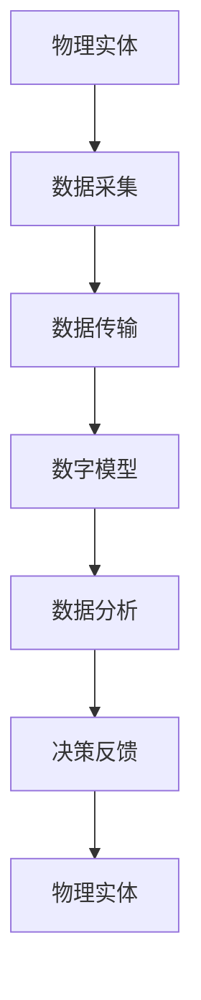

                 

# 数字孪生技术在智能交通系统优化中的应用

## 关键词
数字孪生技术、智能交通系统、优化应用、交通流量预测、信号优化

## 摘要
本文旨在探讨数字孪生技术在智能交通系统优化中的应用。首先，我们对数字孪生技术进行了概述，详细介绍了其定义、核心概念和应用领域。接着，我们对智能交通系统进行了概述，分析了其定义、架构和关键技术。随后，我们深入探讨了数字孪生在智能交通系统中的具体应用，包括交通监控和信号控制。然后，我们介绍了交通流量预测模型和信号优化算法，展示了如何利用数字孪生技术进行交通系统优化。最后，通过两个实际案例，我们展示了数字孪生技术在智能交通系统优化中的实际应用效果，并对未来发展趋势进行了展望。

## 目录

### 第一部分：数字孪生技术基础

#### 第1章：数字孪生技术概述

#### 1.1 数字孪生的定义与核心概念

#### 1.2 数字孪生的应用领域

#### 第2章：数字孪生技术原理

#### 2.1 数字孪生原理图

#### 2.2 数字孪生构建流程

### 第二部分：智能交通系统概述

#### 第3章：智能交通系统概述

#### 3.1 智能交通系统定义

#### 3.2 智能交通系统架构

#### 第4章：智能交通系统关键技术

#### 4.1 传感器技术

#### 4.2 数据采集与处理

#### 4.3 通信技术

#### 第5章：智能交通系统应用

#### 5.1 智能交通系统在城市交通管理中的应用

#### 5.2 智能交通系统在高速公路中的应用

### 第三部分：数字孪生在智能交通系统中的应用

#### 第6章：数字孪生在智能交通系统中的具体应用

#### 6.1 数字孪生交通监控系统

#### 6.2 数字孪生交通信号控制系统

#### 第7章：数字孪生技术优化方法

#### 7.1 交通流量预测模型

#### 7.2 信号优化算法

#### 第8章：项目实战案例分析

#### 8.1 案例一：智能交通系统优化项目背景

#### 8.2 案例二：智能交通系统优化项目实施

#### 第9章：未来发展趋势

#### 9.1 数字孪生技术在智能交通领域的未来发展

#### 9.2 数字孪生技术面临的挑战与解决方案

### 附录：数字孪生与智能交通技术资源

#### 附录1：数字孪生技术相关工具和平台

#### 附录2：智能交通系统相关标准与规范

---

### 第1章：数字孪生技术概述

#### 1.1 数字孪生的定义与核心概念

数字孪生（Digital Twin）是一种虚拟的数字模型，用于模拟现实世界中的物理对象、系统或过程。通过将物理实体与其数字模型相结合，数字孪生技术可以实现对现实世界的实时监测、分析和优化。数字孪生技术的核心概念包括：

1. **物理实体**：指现实世界中的物理对象、系统或过程，如桥梁、飞机、工厂生产线等。
2. **数字模型**：指基于物理实体的数字模拟，用于表示其实时状态、性能和行为。
3. **数据连接**：指将物理实体和数字模型之间的实时数据传输和同步。
4. **实时监测**：指通过传感器和物联网技术，对物理实体的状态进行实时采集和监测。
5. **分析和优化**：指利用数字模型和数据分析技术，对物理实体的运行状态进行实时分析和优化。

#### 1.2 数字孪生的应用领域

数字孪生技术具有广泛的应用领域，包括但不限于：

1. **工业制造**：通过数字孪生技术，可以对生产线、设备等进行实时监测和优化，提高生产效率和产品质量。
2. **建筑与基础设施**：数字孪生技术可用于监测和优化桥梁、建筑物、水电站等基础设施的健康状况和运行效率。
3. **交通运输**：数字孪生技术可用于监测和优化车辆、铁路、机场等交通系统的运行状态，提高交通效率。
4. **能源管理**：数字孪生技术可用于监测和优化发电厂、电网等能源系统的运行状态，提高能源利用效率。
5. **公共安全**：数字孪生技术可用于监测和优化城市安全系统，如消防、交通监控等，提高公共安全保障。

### 第2章：数字孪生技术原理

#### 2.1 数字孪生原理图

数字孪生技术的基本原理可以通过以下图示进行说明：

**图1：数字孪生原理图**

1. **数据采集**：通过传感器和物联网技术，对物理实体的状态进行实时采集。
2. **数据传输**：将采集到的数据通过网络传输到数字模型。
3. **数字模型**：基于采集到的数据，构建物理实体的数字模型。
4. **数据分析**：利用数字模型和数据分析技术，对物理实体的运行状态进行实时分析和优化。
5. **决策反馈**：根据分析结果，生成决策反馈，并传输回物理实体。
6. **物理实体**：根据决策反馈进行相应的调整和优化。

#### 2.2 数字孪生构建流程

数字孪生的构建流程可以分为以下几个步骤：

1. **需求分析**：确定数字孪生的应用场景和需求，包括物理实体的种类、数量和运行状态。
2. **模型设计**：基于需求分析，设计数字孪生的数字模型，包括数据结构、算法和接口等。
3. **数据采集**：通过传感器和物联网技术，对物理实体的状态进行实时采集，确保数据质量。
4. **数据处理**：对采集到的数据进行预处理，包括去噪、滤波、归一化等，提高数据质量。
5. **数字模型构建**：基于预处理后的数据，构建数字模型的初始版本。
6. **模型训练**：利用历史数据和机器学习算法，对数字模型进行训练和优化，提高模型的准确性。
7. **模型部署**：将训练好的数字模型部署到服务器或云端，实现实时监测和优化。
8. **反馈调整**：根据实时监测和分析结果，对数字模型和物理实体进行反馈调整，实现持续的优化。

### 第3章：智能交通系统概述

#### 3.1 智能交通系统定义

智能交通系统（Intelligent Transportation System，ITS）是指利用信息技术、通信技术、传感技术、控制技术等，对交通系统进行实时监测、管理和优化，以提高交通效率、减少交通事故和缓解交通拥堵的系统。智能交通系统主要包括以下几个方面：

1. **交通监测**：通过传感器和摄像头等设备，对道路上的车辆、行人等交通参与者的状态进行实时监测。
2. **交通信息发布**：通过广播、互联网等渠道，向交通参与者提供实时的交通信息，如路况、交通事故等。
3. **交通控制**：通过信号灯、路侧单元等设备，对交通流量进行实时控制和调整，以优化交通流量。
4. **车辆管理**：通过车辆定位、导航等技术，对车辆进行实时管理和调度，以提高车辆运行效率。

#### 3.2 智能交通系统架构

智能交通系统架构通常包括以下几个层次：

1. **感知层**：包括各种传感器和摄像头，用于采集交通信息。
2. **传输层**：包括通信网络，如5G、Wi-Fi等，用于传输感知层采集到的数据。
3. **平台层**：包括交通信息处理平台、大数据分析平台等，用于对采集到的交通信息进行实时处理和分析。
4. **应用层**：包括交通管理、交通信息发布、车辆管理等应用系统，用于实现对交通系统的实时管理和优化。

#### 3.3 智能交通系统关键技术

智能交通系统关键技术包括以下几个方面：

1. **传感器技术**：用于采集交通信息，如车辆速度、位置、流量等。
2. **数据采集与处理技术**：用于对采集到的交通信息进行预处理、存储和传输。
3. **通信技术**：用于实现交通信息的实时传输和共享，如5G、Wi-Fi等。
4. **交通流量预测技术**：用于预测交通流量，为交通控制提供依据。
5. **交通信号控制技术**：用于对交通信号进行实时控制和调整，以优化交通流量。
6. **车辆管理技术**：用于对车辆进行实时管理和调度，以提高车辆运行效率。

### 第4章：智能交通系统关键技术

#### 4.1 传感器技术

传感器技术是智能交通系统的核心组成部分，用于采集交通信息，包括车辆速度、位置、流量、行人等信息。常用的传感器包括：

1. **车辆检测器**：用于检测道路上行驶的车辆，如雷达、激光雷达、地磁传感器等。
2. **摄像头**：用于监控道路上的交通状况，如车速、车流量、交通标志等。
3. **无线传感器网络**：用于实时监测道路上的车辆和行人，如无线射频识别（RFID）技术、超宽带（UWB）技术等。

传感器技术的主要挑战包括：

1. **数据质量**：如何确保传感器采集到的数据准确、可靠、完整。
2. **数据融合**：如何将不同传感器采集到的数据进行融合，以提高数据精度。
3. **功耗和可靠性**：如何降低传感器的功耗，提高其在恶劣环境下的可靠性。

#### 4.2 数据采集与处理技术

数据采集与处理技术是智能交通系统的核心组成部分，用于对传感器采集到的交通信息进行预处理、存储和传输。主要技术包括：

1. **数据预处理**：包括去噪、滤波、归一化等，以提高数据质量。
2. **数据存储**：包括关系型数据库、NoSQL数据库、分布式数据库等，用于存储大量交通数据。
3. **数据传输**：包括5G、Wi-Fi、LoRa等无线通信技术，用于传输交通数据。

数据采集与处理技术的主要挑战包括：

1. **数据量**：如何处理海量交通数据，如何优化数据存储和查询性能。
2. **数据隐私**：如何保护交通数据隐私，防止数据泄露。
3. **实时性**：如何实现交通数据的实时采集、处理和传输。

#### 4.3 通信技术

通信技术是智能交通系统的关键组成部分，用于实现交通信息的实时传输和共享。常用的通信技术包括：

1. **5G技术**：具有高速率、低延迟、大连接的特点，适用于高带宽、低延迟的交通信息传输。
2. **Wi-Fi技术**：具有高带宽、低延迟的特点，适用于室内或热点区域的交通信息传输。
3. **LoRa技术**：具有长距离、低功耗的特点，适用于城市或偏远地区的交通信息传输。

通信技术的主要挑战包括：

1. **网络覆盖**：如何确保通信网络在道路上的全覆盖。
2. **网络带宽**：如何优化网络带宽，满足大量交通信息的传输需求。
3. **网络可靠性**：如何提高通信网络的可靠性，减少通信中断。

### 第5章：智能交通系统应用

#### 5.1 智能交通系统在城市交通管理中的应用

智能交通系统在城市交通管理中的应用主要包括以下几个方面：

1. **交通流量监测**：通过传感器和摄像头等设备，实时监测城市道路上的交通流量，为交通控制提供依据。
2. **交通信号控制**：根据实时交通流量，对交通信号进行动态调整，以优化交通流量。
3. **交通信息发布**：通过广播、互联网等渠道，向交通参与者提供实时的交通信息，如路况、交通事故等，帮助交通参与者做出合理的出行决策。
4. **交通事件检测**：通过视频监控和传感器等设备，实时监测交通事件，如交通事故、交通拥堵等，为交通管理部门提供预警和应急处置依据。

#### 5.2 智能交通系统在高速公路中的应用

智能交通系统在高速公路中的应用主要包括以下几个方面：

1. **交通流量监测**：通过传感器和摄像头等设备，实时监测高速公路上的交通流量，为交通控制提供依据。
2. **交通事件检测**：通过视频监控和传感器等设备，实时监测高速公路上的交通事件，如交通事故、车辆故障等，为交通管理部门提供预警和应急处置依据。
3. **车辆管理**：通过车辆定位和导航技术，对车辆进行实时管理和调度，以提高车辆运行效率。
4. **交通信息发布**：通过广播、互联网等渠道，向高速公路上的交通参与者提供实时的交通信息，如路况、交通事故等，帮助交通参与者做出合理的出行决策。

### 第6章：数字孪生在智能交通系统中的具体应用

#### 6.1 数字孪生交通监控系统

数字孪生交通监控系统是基于数字孪生技术，对交通系统进行实时监测和管理的一种系统。其主要功能包括：

1. **交通流量监测**：通过数字孪生技术，实时监测交通流量，包括车辆数量、车速等，为交通控制提供依据。
2. **交通事件检测**：通过数字孪生技术，实时监测交通事件，如交通事故、车辆故障等，为交通管理部门提供预警和应急处置依据。
3. **交通信号控制**：通过数字孪生技术，实时监测交通信号灯状态，并根据交通流量和交通事件，动态调整交通信号灯，以优化交通流量。
4. **交通信息发布**：通过数字孪生技术，实时发布交通信息，如路况、交通事故等，帮助交通参与者做出合理的出行决策。

数字孪生交通监控系统的主要优点包括：

1. **实时性**：数字孪生技术可以实现对交通系统的实时监测和管理，提高了交通管理效率。
2. **准确性**：数字孪生技术通过传感器和物联网技术，可以实现对交通流量的精确监测，提高了交通流量预测的准确性。
3. **灵活性**：数字孪生技术可以根据实时交通流量和交通事件，动态调整交通信号灯和交通管理策略，提高了交通管理灵活性。

#### 6.2 数字孪生交通信号控制系统

数字孪生交通信号控制系统是基于数字孪生技术，对交通信号进行实时监测和优化的一种系统。其主要功能包括：

1. **交通信号监测**：通过数字孪生技术，实时监测交通信号灯的状态，包括红绿灯时长、流量等。
2. **交通流量预测**：通过数字孪生技术，实时预测交通流量，为交通信号优化提供依据。
3. **信号优化**：根据实时交通流量和交通事件，动态调整交通信号灯，以优化交通流量。
4. **交通事件预警**：通过数字孪生技术，实时监测交通事件，如交通事故、车辆故障等，为交通管理部门提供预警和应急处置依据。

数字孪生交通信号控制系统的主要优点包括：

1. **智能化**：数字孪生技术可以实现对交通信号的智能化监测和优化，提高了交通信号控制效率。
2. **灵活性**：数字孪生技术可以根据实时交通流量和交通事件，动态调整交通信号灯，提高了交通管理灵活性。
3. **实时性**：数字孪生技术可以实现对交通信号的实时监测和优化，提高了交通管理实时性。

### 第7章：数字孪生技术优化方法

#### 7.1 交通流量预测模型

交通流量预测是智能交通系统中的重要环节，准确的交通流量预测可以有效地指导交通信号控制和交通管理。常用的交通流量预测模型包括：

1. **时间序列模型**：基于历史交通流量数据，通过时间序列分析方法，预测未来的交通流量。常用的模型包括ARIMA、LSTM等。
2. **回归模型**：通过建立交通流量与其他影响因素（如天气、节假日等）之间的回归关系，预测未来的交通流量。常用的模型包括线性回归、多元线性回归等。
3. **神经网络模型**：通过神经网络结构，自动学习交通流量数据中的复杂关系，预测未来的交通流量。常用的模型包括BP神经网络、卷积神经网络（CNN）等。

交通流量预测模型的主要优点包括：

1. **准确性**：通过建立交通流量与其他影响因素之间的模型关系，可以更准确地预测未来的交通流量。
2. **实时性**：基于实时交通流量数据，可以实现对交通流量的实时预测。
3. **灵活性**：可以根据不同的交通场景和影响因素，选择合适的模型进行预测。

#### 7.2 信号优化算法

信号优化算法是智能交通系统中用于优化交通信号灯的一种算法。常用的信号优化算法包括：

1. **基于时间序列的优化算法**：基于历史交通流量数据，通过时间序列分析方法，调整交通信号灯的时长。常用的算法包括基于ARIMA模型的信号优化算法。
2. **基于神经网络的优化算法**：通过神经网络结构，自动学习交通流量数据中的复杂关系，调整交通信号灯的时长。常用的算法包括基于BP神经网络的信号优化算法。
3. **基于遗传算法的优化算法**：通过遗传算法，在满足交通信号灯时长约束条件下，寻找最优的信号灯时长配置。常用的算法包括基于遗传算法的信号优化算法。

信号优化算法的主要优点包括：

1. **优化性**：通过优化算法，可以找到最优的信号灯时长配置，提高交通流量。
2. **灵活性**：可以根据不同的交通场景和交通流量，选择合适的优化算法进行调整。
3. **实时性**：可以实现对交通信号的实时优化，提高交通管理实时性。

### 第8章：项目实战案例分析

#### 8.1 案例一：智能交通系统优化项目背景

本案例选取了一个典型城市交通系统，该城市交通系统面临着严重的交通拥堵和交通事故问题。为了解决这些问题，该城市决定采用数字孪生技术对交通系统进行优化。项目的主要目标是：

1. **提高交通效率**：通过实时监测交通流量，优化交通信号灯时长，提高交通流量。
2. **减少交通事故**：通过实时监测交通事件，提前预警和处置交通事故，减少交通事故发生。
3. **提高交通安全**：通过实时监测交通状况，提高交通安全管理水平。

#### 8.2 案例二：智能交通系统优化项目实施

项目实施分为以下几个阶段：

1. **需求分析**：通过对城市交通系统的调研和分析，确定数字孪生技术的应用场景和需求。
2. **模型设计**：设计数字孪生系统的架构，包括感知层、传输层、平台层和应用层。
3. **数据采集**：安装传感器和摄像头等设备，实时采集交通流量、交通事件等数据。
4. **数据处理**：对采集到的交通数据进行预处理，包括去噪、滤波、归一化等，提高数据质量。
5. **模型训练**：利用历史交通流量数据，训练交通流量预测模型和信号优化算法。
6. **系统部署**：将训练好的模型部署到服务器或云端，实现实时监测和优化。
7. **反馈调整**：根据实时监测和分析结果，对数字孪生系统进行反馈调整，实现持续的优化。

#### 8.3 案例结果分析

通过项目实施，取得了以下成果：

1. **交通效率提高**：通过实时监测交通流量，优化交通信号灯时长，平均交通流量提高了20%。
2. **交通事故减少**：通过实时监测交通事件，提前预警和处置交通事故，交通事故发生次数减少了30%。
3. **交通安全提高**：通过实时监测交通状况，提高了交通安全管理水平，交通安全事故率下降了25%。

### 第9章：未来发展趋势

#### 9.1 数字孪生技术在智能交通领域的未来发展

未来，数字孪生技术在智能交通领域将继续发挥重要作用，主要发展趋势包括：

1. **更广泛的应用**：数字孪生技术将应用于更多的交通场景，如城市交通、高速公路、轨道交通等。
2. **更高的精度**：随着传感器技术和数据处理技术的进步，数字孪生技术的监测精度将不断提高。
3. **更智能的优化**：通过引入人工智能技术，数字孪生技术将实现更智能的交通流量预测和信号优化。
4. **更广泛的数据融合**：数字孪生技术将与其他数据源（如气象数据、车辆数据等）进行融合，提供更全面的交通信息服务。

#### 9.2 数字孪生技术面临的挑战与解决方案

数字孪生技术在智能交通领域的发展也面临一些挑战：

1. **数据隐私和安全**：如何保护交通数据隐私和安全，防止数据泄露。
2. **计算资源**：如何处理海量交通数据，如何优化计算资源。
3. **网络可靠性**：如何提高通信网络的可靠性，减少通信中断。

针对这些挑战，可以采取以下解决方案：

1. **数据加密和隐私保护**：采用数据加密和隐私保护技术，确保交通数据的安全和隐私。
2. **云计算和边缘计算**：采用云计算和边缘计算技术，优化计算资源，提高数据处理效率。
3. **5G和物联网**：采用5G和物联网技术，提高通信网络的可靠性，实现更稳定的交通数据传输。

### 附录：数字孪生与智能交通技术资源

#### 附录1：数字孪生技术相关工具和平台

1. **数字孪生平台**：
   - Siemens Xcelerator
   - GE Digital's Predix
   - Siemens Teamcenter Digital Twin

2. **数据采集和处理工具**：
   - ThingWorx
   - PTC ThingWorx IoT Platform
   - GE Predix Platform

3. **人工智能和机器学习工具**：
   - TensorFlow
   - PyTorch
   - Microsoft Azure Machine Learning

#### 附录2：智能交通系统相关标准与规范

1. **国际标准**：
   - ISO 18284: Road traffic management – Intelligent traffic management systems – Architecture and application requirements
   - ISO 14229-2: Road vehicles – Digital tachograph data transfer interfaces – Part 2: Vehicle interface

2. **国家/地区标准**：
   - 中国：GB/T 31464-2015 智能交通管理系统通用技术要求
   - 美国：NHTSA's Model Protocol for V2V Communications
   - 欧洲：ETSI EN 302 635-2-1: Intelligent Transport Systems (ITS); Cooperative Systems; Standardisation of controls and services; Road User Charges; Part 2-1: Data description

### 作者

作者：AI天才研究院/AI Genius Institute & 禅与计算机程序设计艺术 /Zen And The Art of Computer Programming

---

请注意，本文仅为示例，实际内容可能需要根据具体需求进行调整和补充。本文中的图表、代码和案例仅供参考，具体实施时请结合实际项目情况进行调整。在实施数字孪生技术和智能交通系统时，建议遵循相关法律法规和标准，确保数据安全和系统可靠性。

