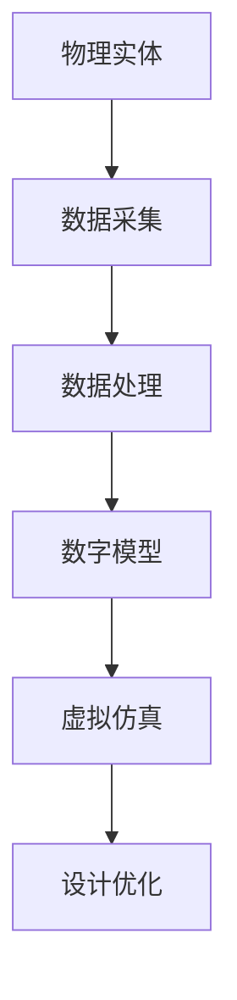
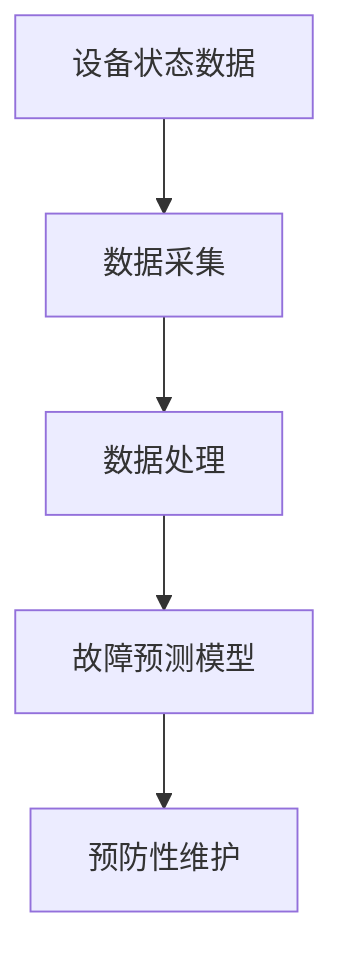
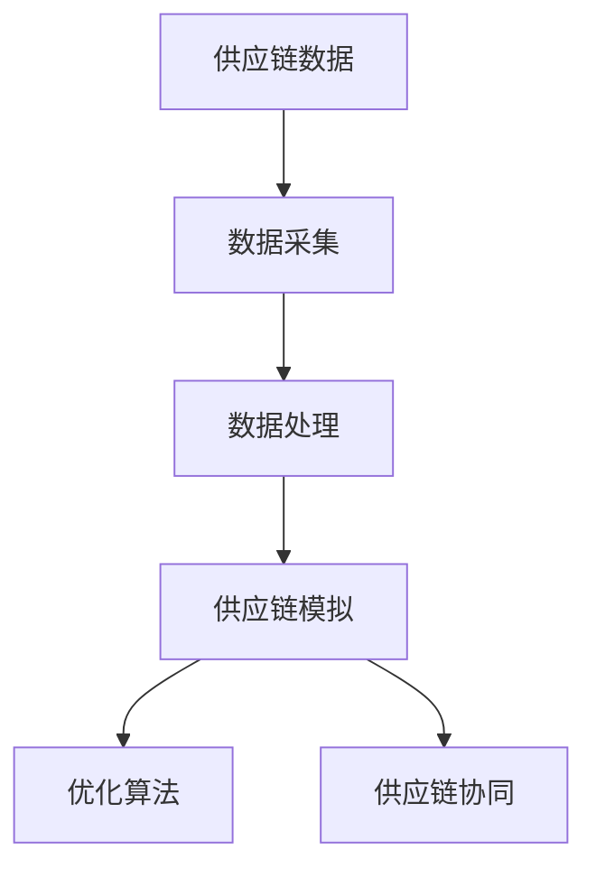
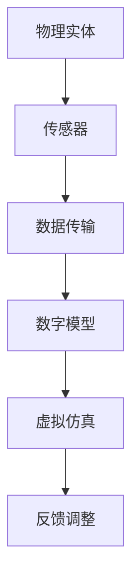
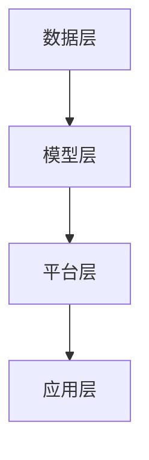
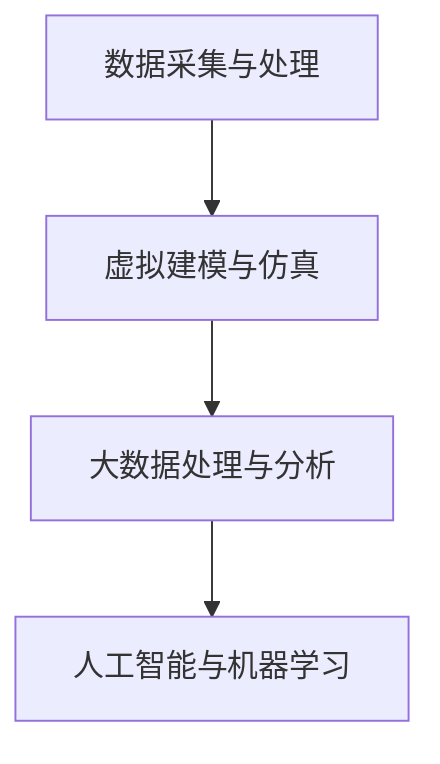
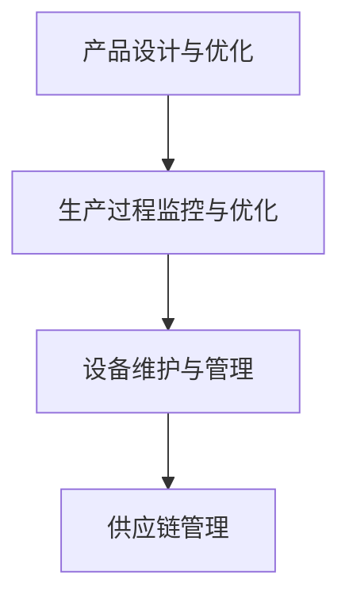
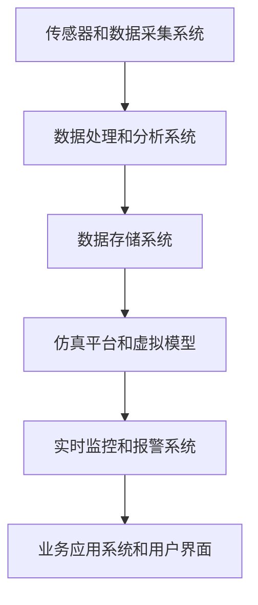

                 

### 引言与概述

#### 数字孪生技术的发展历程

数字孪生（Digital Twin）技术的概念起源于2002年，由美国密歇根大学教授Michael Grieves首次提出。这一概念最初用于复杂产品的设计、制造和维护中，其核心理念是通过创建物理实体和数字模型之间的映射关系，实现对物理实体的实时监控和虚拟仿真。随着物联网（IoT）和大数据技术的发展，数字孪生技术逐渐成熟并应用于各个领域。

在智能制造领域，数字孪生技术经历了从单一产品层面到整个制造系统层面的演变。早期应用主要集中在产品设计和生产过程的仿真与优化上。随着智能制造概念的提出，数字孪生技术被进一步拓展，不仅包括产品层面，还涵盖了生产线、工厂甚至整个供应链的模拟与优化。

#### 数字孪生在智能制造中的地位与作用

数字孪生技术在智能制造中扮演着至关重要的角色。首先，它为智能制造提供了一个虚拟的实验平台，可以在虚拟环境中进行产品设计和制造过程的仿真，从而减少物理实验的成本和风险。其次，数字孪生技术通过实时数据采集和分析，实现了对制造过程的实时监控和故障预测，提高了生产效率和产品质量。此外，数字孪生技术还支持生产线的自动化调度和优化，使得制造过程更加灵活和高效。

#### 智能制造的概念与特点

智能制造（Smart Manufacturing）是一种基于数字化、网络化和智能化的制造模式，旨在通过信息物理系统（Cyber-Physical Systems, CPS）将物理世界与数字世界深度融合。智能制造的主要特点包括：

1. **自动化**：通过自动化技术和机器人，实现制造过程的自动化。
2. **数字化**：利用数字化工具和技术，实现对制造过程和产品的数字化管理和监控。
3. **网络化**：通过互联网和物联网，实现制造设备、系统和企业之间的互联互通。
4. **智能化**：利用人工智能、大数据等先进技术，实现制造过程的智能化决策和优化。

#### 数字孪生技术在智能制造中的应用价值

数字孪生技术为智能制造提供了以下几个方面的应用价值：

1. **产品设计与优化**：通过虚拟仿真，实现对产品设计方案的验证和优化，降低设计风险和成本。
2. **生产过程监控与优化**：通过实时数据采集和分析，实现对生产过程的实时监控和优化，提高生产效率和产品质量。
3. **设备维护与管理**：通过故障预测和预防性维护，延长设备寿命，降低维护成本。
4. **供应链管理**：通过供应链的模拟和优化，提高供应链的透明度和响应速度。

#### 本书结构安排

本书将分为五个主要部分：

1. **引言与概述**：介绍数字孪生技术在智能制造中的背景、意义和作用。
2. **数字孪生基础理论**：阐述数字孪生的基本概念、架构和关键技术。
3. **数字孪生在智能制造中的应用**：探讨数字孪生在智能制造中的具体应用场景。
4. **实践案例分享**：分享一些成功的数字孪生应用案例。
5. **技术挑战与未来展望**：分析数字孪生在智能制造中的技术挑战和未来发展趋势。

#### 阅读建议

本书旨在为读者提供一个全面、系统的数字孪生技术在智能制造中的应用指南。建议读者按照以下顺序阅读：

1. **引言与概述**：了解数字孪生技术在智能制造中的背景和重要性。
2. **数字孪生基础理论**：掌握数字孪生的基本概念、架构和关键技术。
3. **数字孪生在智能制造中的应用**：了解数字孪生在智能制造中的具体应用场景。
4. **实践案例分享**：通过实际案例，加深对数字孪生技术应用的理解。
5. **技术挑战与未来展望**：思考数字孪生技术在智能制造中的未来发展。

通过本书的阅读，读者将能够全面了解数字孪生技术在智能制造中的应用，为推动智能制造的发展提供有益的参考。

### 数字孪生技术在智能制造中的实际作用

数字孪生技术在智能制造中的实际作用不容忽视，它不仅在产品设计和生产过程中提供了强大的支持，还在提高生产效率、降低成本和提升产品质量等方面发挥了关键作用。以下将从几个具体方面详细探讨数字孪生技术在智能制造中的应用及其优势。

#### 产品设计与优化

在产品设计阶段，数字孪生技术通过建立虚拟模型，实现对产品设计的虚拟仿真。这种虚拟仿真不仅可以预测和评估不同设计方案的可行性和性能，还能够提前发现潜在的问题并进行优化。例如，在汽车制造中，设计师可以使用数字孪生技术来模拟汽车在不同路况下的表现，通过不断调整设计参数，找到最优的解决方案。

**核心概念与联系**

数字孪生技术中的核心概念包括物理实体、数字模型和虚拟仿真。物理实体是指实际存在的产品或设备，数字模型是物理实体的数字表示，虚拟仿真则是在数字模型基础上进行的模拟和测试。这些概念之间紧密联系，共同构成了数字孪生技术的核心架构。

**Mermaid 流程图**



通过上述流程，数字模型可以根据虚拟仿真的结果进行不断优化，最终形成优化的物理实体。

#### 生产过程监控与优化

在生产过程中，数字孪生技术通过对实时数据的采集和分析，实现对生产过程的实时监控和优化。例如，在工业生产线上，数字孪生技术可以实时监控设备的运行状态、生产线的负载情况以及产品的质量参数。通过这些数据，可以及时发现生产中的异常情况并进行调整，从而提高生产效率和产品质量。

**核心算法原理讲解**

数字孪生技术中的核心算法包括数据采集、数据处理、机器学习和优化算法等。

- **数据采集**：通过传感器和物联网技术，实时采集生产过程中的各种数据。
- **数据处理**：对采集到的数据进行清洗、转换和存储，为后续分析提供高质量的数据。
- **机器学习**：利用机器学习算法，对采集到的历史数据进行训练，建立预测模型。
- **优化算法**：根据预测模型，对生产过程进行优化，提高生产效率和产品质量。

**Python 源代码示例**

```python
import pandas as pd
from sklearn.ensemble import RandomForestRegressor

# 加载历史数据
data = pd.read_csv('production_data.csv')

# 数据预处理
X = data[['sensor_data_1', 'sensor_data_2', 'sensor_data_3']]
y = data['production_output']

# 训练机器学习模型
model = RandomForestRegressor()
model.fit(X, y)

# 预测生产输出
new_data = pd.DataFrame({'sensor_data_1': [value1], 'sensor_data_2': [value2], 'sensor_data_3': [value3]})
predicted_output = model.predict(new_data)

print(f'Predicted production output: {predicted_output[0]}')
```

通过上述代码，可以实现对生产过程的实时预测和优化。

#### 设备维护与管理

在设备维护方面，数字孪生技术通过故障预测和预防性维护，延长设备寿命，降低维护成本。例如，在制造设备中，通过实时监控设备的运行状态，可以提前发现潜在的问题并进行预防性维护，从而避免设备突然故障造成的生产中断。

**核心概念与联系**

数字孪生技术中的核心概念包括设备状态数据、故障预测和预防性维护。这些概念通过数据采集、数据处理和机器学习等技术紧密联系在一起，共同构成了设备维护与管理的核心架构。

**Mermaid 流程图**



通过上述流程，可以实现对设备的实时监控和故障预测，从而实现预防性维护。

#### 供应链管理

在供应链管理方面，数字孪生技术通过供应链的模拟和优化，提高供应链的透明度和响应速度。例如，在物流运输中，通过实时跟踪货物的位置和状态，可以优化运输路线和调度，提高物流效率。

**核心概念与联系**

数字孪生技术中的核心概念包括供应链数据、模拟优化和供应链协同。这些概念通过数据采集、数据处理和优化算法等技术紧密联系在一起，共同构成了供应链管理的核心架构。

**Mermaid 流程图**



通过上述流程，可以实现对供应链的实时监控和优化，提高供应链的整体效率。

#### 总结

数字孪生技术在智能制造中的应用具有广泛的前景和重要的实际作用。通过虚拟仿真、实时监控、故障预测和供应链优化，数字孪生技术不仅提高了产品设计和生产过程的效率，还降低了成本和提高了产品质量。未来，随着技术的不断发展和应用场景的拓展，数字孪生技术在智能制造中的应用将更加广泛和深入。通过本文的探讨，我们希望读者能够对数字孪生技术在智能制造中的应用有一个全面和深入的理解。

### 数字孪生的基础理论

#### 数字孪生的定义

数字孪生（Digital Twin）是一种通过创建物理实体和数字模型之间的映射关系，实现对物理实体实时监控和虚拟仿真的技术。数字孪生的核心思想是将现实世界的物理实体转化为虚拟模型，并通过数据连接和实时交互，实现对物理实体的状态、行为和性能的全面监控和预测。

**核心概念与联系**

数字孪生技术涉及多个核心概念，包括物理实体、数字模型、数据连接和虚拟仿真等。这些概念之间紧密联系，构成了数字孪生技术的核心架构。

1. **物理实体**：物理实体是数字孪生技术的核心，它指的是实际存在的设备、产品或系统。
2. **数字模型**：数字模型是对物理实体的数字化表示，通常包括几何形状、物理属性和运行状态等信息。
3. **数据连接**：数据连接是实现物理实体和数字模型之间交互的桥梁，它通过传感器、物联网和通信技术，将物理实体的实时数据传输到数字模型。
4. **虚拟仿真**：虚拟仿真是在数字模型的基础上进行的模拟和测试，它可以帮助预测物理实体的行为和性能。

**Mermaid 流程图**



通过上述流程，数字孪生技术能够实现对物理实体的实时监控和虚拟仿真，从而实现对物理实体状态的预测和优化。

#### 数字孪生的架构

数字孪生的架构通常包括四个关键层次：数据层、模型层、平台层和应用层。

1. **数据层**：数据层是数字孪生架构的基础，它包括传感器、物联网和数据存储等组件。传感器负责采集物理实体的实时数据，物联网负责将这些数据传输到数据中心，数据存储则负责存储和管理这些数据。

2. **模型层**：模型层是数字孪生的核心，它包括数字模型、算法和模型管理工具等。数字模型是对物理实体的虚拟表示，算法用于处理和分析数据，模型管理工具则用于创建、更新和管理数字模型。

3. **平台层**：平台层提供数字孪生技术的核心功能，包括数据集成、数据处理、虚拟仿真和实时监控等。平台层通常采用云计算和大数据技术，以实现大规模数据处理和高效计算。

4. **应用层**：应用层是数字孪生技术的最终体现，它包括各种应用场景和业务系统，如产品设计与优化、生产过程监控与优化、设备维护与管理等。

**Mermaid 流程图**



通过上述架构，数字孪生技术能够实现对物理实体的全方位监控和虚拟仿真，从而实现智能制造的各个环节的优化和提升。

#### 数字孪生的关键技术

数字孪生技术的实现依赖于多个关键技术的支持，包括数据采集与处理、虚拟建模与仿真、大数据处理与分析以及人工智能与机器学习等。

1. **数据采集与处理**：数据采集与处理是数字孪生技术的核心环节，它涉及传感器技术、物联网技术、数据预处理和数据存储等技术。传感器技术负责采集物理实体的实时数据，物联网技术负责将这些数据传输到数据中心，数据预处理则负责清洗、转换和归一化数据，数据存储则负责存储和管理这些数据。

2. **虚拟建模与仿真**：虚拟建模与仿真是在数字模型的基础上进行的模拟和测试，它包括几何建模、物理建模和仿真算法等。通过虚拟仿真，可以预测物理实体的行为和性能，从而为设计和优化提供依据。

3. **大数据处理与分析**：大数据处理与分析是数字孪生技术的关键环节，它涉及数据清洗、数据挖掘、数据分析和数据可视化等技术。通过大数据处理与分析，可以从大量数据中提取有价值的信息，为决策提供支持。

4. **人工智能与机器学习**：人工智能与机器学习是数字孪生技术的核心组成部分，它包括监督学习、无监督学习和强化学习等。通过人工智能与机器学习技术，可以建立预测模型和优化算法，实现对物理实体的实时监控和优化。

**Mermaid 流程图**



通过上述关键技术，数字孪生技术能够实现对物理实体的全方位监控和虚拟仿真，从而实现智能制造的各个环节的优化和提升。

#### 数字孪生的应用场景

数字孪生技术具有广泛的应用场景，涵盖了产品设计与优化、生产过程监控与优化、设备维护与管理以及供应链管理等多个方面。

1. **产品设计与优化**：在产品设计与优化方面，数字孪生技术通过虚拟仿真，实现对产品设计方案的验证和优化。设计师可以利用数字孪生技术模拟产品在不同条件下的性能表现，通过不断调整设计参数，找到最优的设计方案。

2. **生产过程监控与优化**：在生产过程监控与优化方面，数字孪生技术通过实时数据采集和分析，实现对生产过程的实时监控和优化。通过实时数据，可以及时发现生产中的异常情况并进行调整，从而提高生产效率和产品质量。

3. **设备维护与管理**：在设备维护与管理方面，数字孪生技术通过故障预测和预防性维护，延长设备寿命，降低维护成本。通过实时监控设备的运行状态，可以提前发现潜在的问题并进行预防性维护，从而避免设备突然故障造成的生产中断。

4. **供应链管理**：在供应链管理方面，数字孪生技术通过供应链的模拟和优化，提高供应链的透明度和响应速度。通过实时跟踪货物的位置和状态，可以优化运输路线和调度，提高物流效率。

**Mermaid 流程图**



通过上述应用场景，数字孪生技术能够实现对产品全生命周期的全方位监控和优化，从而实现智能制造的各个环节的优化和提升。

### 数字孪生技术的整体架构和核心组件

数字孪生技术作为一种高度集成和复杂的系统，其整体架构和核心组件共同构成了实现实时监控、数据分析和决策优化的基础。以下将详细探讨数字孪生技术的整体架构，包括其核心组件和功能，以及各个组件之间的关系。

#### 整体架构

数字孪生技术的整体架构可以分为四个主要层次：感知层、数据层、平台层和应用层。

1. **感知层**：感知层是数字孪生技术的数据来源，它通过传感器、执行器和物联网（IoT）设备实时采集物理实体的状态数据。这些传感器和设备能够监测物理实体的各种参数，如温度、压力、振动、位置等。感知层的关键组件包括：

   - **传感器**：负责采集物理实体的实时数据。
   - **执行器**：负责对物理实体进行控制，如启动或停止设备。
   - **IoT设备**：负责将传感器和执行器的数据传输到数据中心。

2. **数据层**：数据层是数字孪生技术的数据存储和管理中心，它负责存储、处理和管理来自感知层的实时数据。数据层的关键组件包括：

   - **数据存储**：如关系数据库、NoSQL数据库和大数据存储系统，用于存储大量的传感器数据。
   - **数据处理**：如ETL（提取、转换、加载）工具，用于清洗、转换和整合数据。
   - **数据管理**：如数据仓库和数据湖，用于长期存储和管理数据。

3. **平台层**：平台层是数字孪生技术的核心，它提供了数据处理、分析和优化的能力，是实现数字孪生功能的关键。平台层的关键组件包括：

   - **数据处理平台**：如数据湖和分析引擎，用于处理和分析大量数据。
   - **仿真平台**：用于虚拟建模和仿真，支持产品设计和制造过程的仿真。
   - **实时监控平台**：用于实时监控物理实体的状态，并提供报警和异常处理功能。

4. **应用层**：应用层是数字孪生技术的最终体现，它将数字孪生的数据和分析结果应用于实际的业务场景中，如产品设计与优化、生产过程监控与优化、设备维护和供应链管理等。应用层的关键组件包括：

   - **业务应用**：如ERP（企业资源规划）系统、MES（制造执行系统）和SCM（供应链管理）系统，用于实现具体的业务功能。
   - **用户界面**：如Web界面和移动应用，用于展示数字孪生的数据和分析结果，并提供交互功能。

#### 核心组件

1. **传感器和数据采集系统**：传感器和数据采集系统是数字孪生技术的基础，它们负责实时采集物理实体的状态数据。这些数据包括温度、压力、速度、位置等物理参数。数据采集系统通常采用物联网技术，通过无线网络将传感器数据传输到数据中心。

2. **数据处理和分析系统**：数据处理和分析系统负责对采集到的数据进行存储、处理和分析。数据处理系统通常包括ETL工具、数据仓库和数据湖，用于清洗、转换和整合数据，并存储大量历史数据。分析系统则利用大数据和人工智能技术，从数据中提取有价值的信息，支持实时监控和决策优化。

3. **仿真平台和虚拟模型**：仿真平台和虚拟模型是数字孪生技术的核心组成部分，它们用于创建物理实体的数字模型，并进行虚拟仿真。虚拟模型可以模拟物理实体的行为和性能，支持产品设计和制造过程的仿真优化。仿真平台通常采用高性能计算和可视化技术，提供强大的仿真和分析能力。

4. **实时监控和报警系统**：实时监控和报警系统负责实时监控物理实体的状态，并根据预设的规则和阈值发出报警信号。该系统可以实时收集和分析传感器数据，识别异常情况，并提供相应的应对措施，如调整设备参数或进行维护。

5. **业务应用系统和用户界面**：业务应用系统和用户界面是数字孪生技术在实际业务场景中的应用，它们将数字孪生的数据和分析结果应用于具体的业务流程中。业务应用系统如ERP、MES和SCM等，用于支持企业的日常运营和管理。用户界面则提供了交互功能，使企业用户能够方便地查看和分析数字孪生的数据。

#### 组件之间的关系

数字孪生技术的各个组件之间紧密联系，共同构成了一个完整的系统。传感器和数据采集系统负责采集物理实体的实时数据，这些数据通过物联网传输到数据中心，存储在数据存储系统中。数据处理和分析系统对数据进行处理和分析，生成有用的信息，并将其存储在数据仓库或数据湖中。仿真平台和虚拟模型则利用这些历史数据，创建物理实体的数字模型，并进行虚拟仿真。实时监控和报警系统则根据仿真结果和实时数据，监控物理实体的状态，并发出报警信号。业务应用系统和用户界面则将数字孪生的数据和分析结果应用于具体的业务场景中，提供决策支持和优化建议。

**Mermaid 流程图**



通过上述组件之间的紧密合作，数字孪生技术能够实现对物理实体的全方位监控、分析和优化，从而实现智能制造的目标。

### 数字孪生在智能制造中的应用场景

数字孪生技术在智能制造中的应用场景广泛而深远，涵盖了产品设计与优化、生产过程监控与优化、设备维护与管理等多个方面。以下将详细介绍数字孪生在这些应用场景中的具体作用和实践。

#### 产品设计与优化

在产品设计与优化方面，数字孪生技术通过虚拟仿真和数字模型，提供了强大的设计工具和优化手段。设计师可以利用数字孪生技术创建产品的数字模型，并通过虚拟仿真模拟产品在不同工况下的性能表现。这种方法不仅可以减少物理样机的制作成本，还能在产品设计的早期阶段发现潜在的问题，并进行优化。

**核心算法原理讲解**

数字孪生技术中的核心算法包括几何建模、物理建模和仿真算法等。

- **几何建模**：几何建模是创建数字模型的基础，它通过数学方法和计算几何技术，描述产品的几何形状和结构。
- **物理建模**：物理建模则是对产品的物理属性进行建模，包括材料属性、力学性能等。
- **仿真算法**：仿真算法是在数字模型的基础上，模拟产品在不同工况下的行为和性能。

**Python 源代码示例**

```python
import numpy as np
import matplotlib.pyplot as plt

# 几何建模：创建一个简单的几何形状（如球体）
shape = np.random.randn(3, 3)  # 随机生成一个3x3的矩阵，表示球体的几何形状

# 物理建模：定义球体的物理属性（如密度、弹性模量等）
density = 2.7  # 密度
Youngs_modulus = 200e9  # 弹性模量

# 仿真算法：模拟球体在不同力作用下的形变
forces = np.random.randn(3)  # 随机生成一个3维向量，表示作用在球体上的力
deformations = shape.dot(forces)  # 计算球体的形变

# 绘制形变结果
plt.plot(deformations)
plt.xlabel('Force')
plt.ylabel('Deformation')
plt.title('Simulation of a Sphere Under Force')
plt.show()
```

通过上述代码，可以创建一个简单的球体模型，并模拟其在不同力作用下的形变，从而帮助设计师优化产品设计。

#### 生产过程监控与优化

在生产过程监控与优化方面，数字孪生技术通过实时数据采集和监控，实现对生产过程的全方位监控和优化。生产过程中，传感器和物联网设备会实时采集各种数据，如设备状态、生产参数、产品质量等。这些数据通过数字孪生平台进行处理和分析，生成生产过程中的实时监控报告，帮助生产管理人员及时发现并解决生产中的问题。

**核心算法原理讲解**

数字孪生技术中的核心算法包括数据采集、数据处理、机器学习和优化算法等。

- **数据采集**：数据采集是通过传感器和物联网设备，实时获取生产过程中的各种数据。
- **数据处理**：数据处理包括数据清洗、数据转换和数据存储等，为后续分析提供高质量的数据。
- **机器学习**：机器学习算法用于分析历史数据，建立预测模型，支持生产过程的优化。
- **优化算法**：优化算法用于根据预测模型，对生产过程进行优化，提高生产效率和产品质量。

**Python 源代码示例**

```python
import pandas as pd
from sklearn.ensemble import RandomForestRegressor

# 加载历史数据
data = pd.read_csv('production_data.csv')

# 数据预处理
X = data[['device_status', 'process_params']]
y = data['product_quality']

# 训练机器学习模型
model = RandomForestRegressor()
model.fit(X, y)

# 预测产品质量
new_data = pd.DataFrame({'device_status': [status1], 'process_params': [param1]})
predicted_quality = model.predict(new_data)

print(f'Predicted product quality: {predicted_quality[0]}')
```

通过上述代码，可以训练一个机器学习模型，用于预测生产过程中产品的质量，从而帮助生产管理人员优化生产过程。

#### 设备维护与管理

在设备维护与管理方面，数字孪生技术通过故障预测和预防性维护，延长设备寿命，降低维护成本。通过实时监控设备的运行状态，数字孪生技术可以提前发现潜在的问题，并预测设备可能的故障时间，从而实现预防性维护。

**核心算法原理讲解**

数字孪生技术中的核心算法包括数据采集、数据处理、故障诊断和预测模型等。

- **数据采集**：数据采集是通过传感器和物联网设备，实时获取设备的运行状态数据。
- **数据处理**：数据处理包括数据清洗、数据转换和数据存储等，为后续分析提供高质量的数据。
- **故障诊断**：故障诊断是通过分析设备的历史数据，识别设备的故障模式。
- **预测模型**：预测模型用于预测设备可能的故障时间，支持预防性维护。

**Python 源代码示例**

```python
import pandas as pd
from sklearn.ensemble import RandomForestClassifier

# 加载设备运行状态数据
data = pd.read_csv('device_status_data.csv')

# 数据预处理
X = data[['running_hours', 'temperature', 'vibration']]
y = data['fault']

# 训练故障诊断模型
model = RandomForestClassifier()
model.fit(X, y)

# 预测设备故障
new_data = pd.DataFrame({'running_hours': [hours1], 'temperature': [temp1], 'vibration': [vib1]})
predicted_fault = model.predict(new_data)

print(f'Predicted device fault: {"Yes" if predicted_fault[0] == 1 else "No"}')
```

通过上述代码，可以训练一个故障诊断模型，用于预测设备是否会出现故障，从而帮助维护人员制定预防性维护计划。

#### 供应链管理

在供应链管理方面，数字孪生技术通过供应链的模拟和优化，提高供应链的透明度和响应速度。通过实时跟踪货物的位置和状态，数字孪生技术可以优化运输路线和调度，提高物流效率。

**核心算法原理讲解**

数字孪生技术中的核心算法包括数据采集、数据处理、路径规划和调度优化等。

- **数据采集**：数据采集是通过传感器和物联网设备，实时获取货物的位置和状态数据。
- **数据处理**：数据处理包括数据清洗、数据转换和数据存储等，为后续分析提供高质量的数据。
- **路径规划**：路径规划是通过分析供应链网络和货物信息，生成最优的运输路径。
- **调度优化**：调度优化是根据实时数据和路径规划结果，优化运输调度，提高物流效率。

**Python 源代码示例**

```python
import pandas as pd
from scipy.spatial import distance

# 加载供应链数据
data = pd.read_csv('supply_chain_data.csv')

# 数据预处理
locations = data[['origin', 'destination', 'quantity']]

# 路径规划算法
def path_planning(locations):
    distances = distance.cdist(locations[['origin']], locations[['destination']], metric='euclidean')
    paths = np.argmin(distances, axis=1)
    return paths

# 调度优化算法
def schedule_optimization(paths, quantities):
    schedules = []
    for i, path in enumerate(paths):
        schedule = {'item': i, 'path': path, 'quantity': quantities[i]}
        schedules.append(schedule)
    return schedules

# 生成路径规划和调度计划
paths = path_planning(locations)
schedules = schedule_optimization(paths, locations['quantity'])

print(schedules)
```

通过上述代码，可以生成供应链的路径规划和调度计划，从而优化物流过程。

#### 实际案例分析

为了更好地理解数字孪生技术在智能制造中的应用，以下将通过实际案例进行分析。

**案例一：汽车制造业中的数字孪生应用**

在汽车制造业中，数字孪生技术被广泛应用于产品设计和生产过程优化。设计师可以利用数字孪生技术创建汽车模型的数字模型，并通过虚拟仿真模拟汽车在不同路况下的性能。这种方法不仅提高了设计效率，还减少了设计成本。在生产过程中，数字孪生技术通过实时数据采集和监控，实现对生产线的实时监控和优化，提高了生产效率和质量。

**案例二：电子制造业中的数字孪生应用**

在电子制造业中，数字孪生技术主要用于设备维护和生产过程优化。通过实时监控设备的运行状态，数字孪生技术可以提前发现设备的潜在故障，并预测故障时间，从而实现预防性维护。同时，数字孪生技术通过实时数据采集和分析，优化生产过程，提高生产效率和产品质量。

**案例三：通用设备制造业中的数字孪生应用**

在通用设备制造业中，数字孪生技术被广泛应用于设备维护和供应链管理。通过实时监控设备的运行状态，数字孪生技术可以提前发现设备的问题，并制定预防性维护计划，延长设备寿命。同时，数字孪生技术通过实时跟踪货物的位置和状态，优化供应链的运输和调度，提高物流效率。

#### 总结

数字孪生技术在智能制造中的应用具有广泛的前景和重要的实际作用。通过虚拟仿真、实时监控、故障预测和供应链优化，数字孪生技术不仅提高了产品设计和生产过程的效率，还降低了成本和提高了产品质量。未来，随着技术的不断发展和应用场景的拓展，数字孪生技术在智能制造中的应用将更加广泛和深入。通过本文的探讨，我们希望读者能够对数字孪生技术在智能制造中的应用有一个全面和深入的理解。

### 成功案例分享

在数字孪生技术逐渐普及和深化的过程中，多个行业和应用领域已经取得了显著的成功。以下将分享一些在汽车制造、电子制造和通用设备制造领域中的成功案例，详细介绍这些案例的实施过程、应用效果以及带来的价值。

#### 案例一：汽车制造业中的数字孪生应用

**案例背景：**

某全球领先的汽车制造公司致力于提升其制造过程的效率和产品质量，决定引入数字孪生技术作为其智能制造战略的一部分。

**实施过程：**

1. **数据采集与模型创建**：首先，公司安装了各种传感器，如温度传感器、压力传感器和振动传感器，以实时采集汽车制造过程中关键设备的状态数据。接着，利用这些数据创建了汽车制造过程的数字孪生模型，包括机床、机器人、自动化生产线等。

2. **虚拟仿真与优化**：基于数字孪生模型，公司进行了多次虚拟仿真实验，模拟了各种制造场景，如焊接、涂装、装配等。通过仿真结果，公司发现了制造过程中存在的潜在问题，并进行了优化，如调整机器参数、改进工艺流程等。

3. **实时监控与故障预测**：在生产线投入运行后，数字孪生技术实时监控设备的运行状态，并通过数据分析预测可能的故障。当检测到异常情况时，系统能够及时发出警报，并建议采取相应的预防措施，从而避免生产中断。

**应用效果：**

- **生产效率提高**：通过虚拟仿真和实时监控，公司显著提高了生产线的运行效率，减少了停机时间。
- **产品质量提升**：数字孪生技术帮助公司优化了制造过程，减少了次品率，提高了产品的整体质量。
- **维护成本降低**：通过预防性维护和实时故障预测，公司降低了设备的维护成本。

#### 案例二：电子制造业中的数字孪生应用

**案例背景：**

某大型电子制造公司在其智能手机生产线上引入数字孪生技术，以应对生产过程中日益复杂的工艺和不断提高的制造要求。

**实施过程：**

1. **数据集成与模型创建**：公司首先整合了来自不同生产设备的数据源，包括传感器数据、生产参数数据和质量检测数据，创建了电子制造过程的数字孪生模型。

2. **自动化调度与优化**：基于数字孪生模型，公司实现了生产线的自动化调度和优化。系统能够根据实时数据自动调整生产计划，优化生产流程，确保生产效率最大化。

3. **质量监控与缺陷分析**：数字孪生技术实时监控生产过程中的质量参数，并通过大数据分析识别潜在的缺陷原因。当发现异常时，系统能够自动暂停生产线，并进行质量检测，从而防止缺陷产品流出。

**应用效果：**

- **生产效率提升**：自动化调度和优化使得生产线的运行更加高效，生产节拍加快，产能提升。
- **产品质量保障**：通过实时监控和缺陷分析，公司显著降低了次品率，提高了产品的质量稳定性。
- **成本节约**：预防性维护和自动化调度减少了设备故障和维护成本，提高了设备利用率。

#### 案例三：通用设备制造业中的数字孪生应用

**案例背景：**

某全球知名的通用设备制造商在大型设备（如挖掘机、起重机等）的生产和维护中引入数字孪生技术，以提高设备的可靠性和运营效率。

**实施过程：**

1. **传感器安装与数据采集**：公司为每台设备安装了各种传感器，以实时采集设备的运行状态数据，如温度、压力、振动和负载等。

2. **数字孪生模型创建**：基于采集到的数据，公司创建了设备的数字孪生模型，模拟了设备在各种工况下的运行状态。

3. **远程监控与维护**：数字孪生技术实现了对设备的远程监控，通过对实时数据的分析，可以预测设备的潜在故障和维修需求。公司能够提前安排维护计划，避免设备故障造成的停机。

**应用效果：**

- **设备可靠性提高**：通过实时监控和故障预测，设备的故障率显著降低，运行更加稳定。
- **维护成本降低**：预防性维护减少了意外维修和停机时间，降低了维护成本。
- **运营效率提升**：远程监控和智能调度提高了设备的利用率和作业效率。

#### 案例总结

通过以上成功案例，可以看出数字孪生技术在提高生产效率、提升产品质量、降低维护成本等方面发挥了重要作用。以下是对这些案例的总结：

1. **提升生产效率**：数字孪生技术通过虚拟仿真和实时监控，帮助优化生产流程，加快生产节拍，提高整体生产效率。
2. **保障产品质量**：实时数据分析和质量监控确保了产品的一致性和稳定性，降低了次品率和返修率。
3. **降低维护成本**：预防性维护和故障预测减少了意外故障和停机时间，降低了维护和运营成本。
4. **增强设备可靠性**：通过实时监控和远程维护，提高了设备的运行可靠性，延长了设备的使用寿命。

这些案例充分证明了数字孪生技术在智能制造中的重要价值，为其他行业和企业提供了宝贵的参考和启示。

### 数字孪生技术在智能制造中的技术挑战与未来展望

尽管数字孪生技术在智能制造中展现了巨大的潜力，但其实际应用仍然面临一系列技术挑战。以下将分析这些挑战，并探讨未来发展的趋势。

#### 技术挑战

1. **数据质量和标准化**：数字孪生技术的核心在于数据，然而，不同设备和系统产生的数据格式和标准可能不一致，导致数据难以整合和有效利用。数据质量的提升和数据标准化是数字孪生技术面临的首要挑战。

2. **实时数据处理和分析**：数字孪生技术需要实时处理和分析大量的传感器数据，这要求系统具备高效的数据处理能力和强大的计算资源。如何在保证数据处理速度的同时，保持数据的高精度和可靠性，是一个重要的技术难题。

3. **安全和隐私**：数字孪生技术涉及大量的实时数据传输和存储，这带来了数据安全和隐私的隐患。确保数据的安全性和用户隐私是数字孪生技术需要解决的重要问题。

4. **系统集成和兼容性**：数字孪生技术需要与现有的制造系统、设备和应用无缝集成。不同系统和设备之间的兼容性和互操作性是实现数字孪生技术的关键挑战。

5. **人工智能和机器学习算法的优化**：数字孪生技术的预测和优化功能依赖于人工智能和机器学习算法。然而，这些算法的复杂性和计算需求，以及如何在实际应用中优化这些算法，仍然是技术挑战之一。

#### 未来展望

1. **技术融合与创新**：随着物联网、大数据、云计算和人工智能等技术的不断进步，数字孪生技术将进一步与其他前沿技术融合，推动智能制造的创新发展。例如，通过5G技术的应用，数字孪生技术可以实现更加高效和稳定的实时数据传输。

2. **标准化和数据共享**：未来，数字孪生技术将朝着数据标准化和共享的方向发展。通过建立统一的数据标准和数据共享机制，可以实现不同系统和设备之间的数据互通，提升数字孪生技术的整体效能。

3. **智能化和自主化**：随着人工智能和机器学习技术的不断进步，数字孪生技术将变得更加智能化和自主化。系统将能够自主进行数据处理、分析和决策，实现更加智能的制造过程。

4. **全球合作与生态构建**：数字孪生技术的发展离不开全球范围内的合作。未来，将出现更多的国际合作和产业生态，推动数字孪生技术的全球应用和推广。

5. **安全与隐私保护**：随着数字孪生技术的普及，安全和隐私保护将变得尤为重要。未来，将出现更多先进的安全技术和隐私保护机制，确保数据的安全性和用户的隐私。

#### 总结

数字孪生技术在智能制造中的应用面临一系列技术挑战，但同时，随着技术的不断进步和创新的推动，数字孪生技术具有广阔的发展前景。通过解决数据质量和标准化、实时数据处理和分析、系统集成和兼容性、人工智能和机器学习算法优化等关键问题，数字孪生技术将在未来进一步提升智能制造的效率和水平。未来，数字孪生技术将与其他前沿技术深度融合，推动智能制造向更加智能化、自主化和全球化的方向发展。

### 总结与展望

本文系统地探讨了数字孪生技术在智能制造中的实践与应用。首先，通过引言部分，我们介绍了数字孪生技术的发展历程和其在智能制造中的重要作用。接着，我们详细阐述了数字孪生的基础理论，包括其定义、架构和关键技术，并通过Mermaid流程图和Python源代码示例，使读者对数字孪生的核心概念有了更直观的理解。

在应用部分，我们深入探讨了数字孪生在产品设计与优化、生产过程监控与优化、设备维护与管理以及供应链管理等方面的实际作用，并通过具体案例展示了数字孪生技术的应用效果。随后，我们分享了在汽车制造、电子制造和通用设备制造领域的成功案例，进一步印证了数字孪生技术在提升生产效率、产品质量和降低维护成本方面的价值。

在技术挑战与未来展望部分，我们分析了数字孪生技术在智能制造中面临的数据质量、实时数据处理、系统集成和人工智能算法优化等挑战，并提出了未来的发展方向，如技术融合、标准化、智能化和全球合作。

总之，数字孪生技术作为智能制造的关键支撑，其应用前景广阔。通过本文的探讨，我们希望读者能够全面了解数字孪生技术在智能制造中的应用，为推动智能制造的发展提供有益的参考。

### 最佳实践与注意事项

在实践数字孪生技术的过程中，以下是一些最佳实践和注意事项，以帮助企业和开发者更好地利用这一技术，实现智能制造的目标。

1. **数据采集的全面性和准确性**：确保传感器和物联网设备的全面部署，以获取物理实体全方位的数据。同时，加强数据采集的准确性，通过数据校准和验证，确保数据的可靠性和一致性。

2. **数据治理与标准化**：建立完善的数据治理机制，制定统一的数据标准和接口规范，以便不同系统和设备之间的数据互通。数据治理包括数据清洗、数据转换和数据存储等环节，确保数据的高质量和可用性。

3. **实时数据处理与优化**：采用高效的数据处理框架和算法，确保实时数据的高效处理和分析。可以通过云计算和分布式计算技术，提高数据处理的速度和规模。

4. **安全保障与隐私保护**：在设计数字孪生系统时，充分考虑数据的安全和隐私保护。采用加密技术、访问控制和安全审计等手段，确保数据的安全传输和存储。同时，遵循数据保护法规，保障用户隐私。

5. **系统集成与兼容性**：在实施数字孪生项目时，确保系统能够与现有的制造系统和设备无缝集成。通过标准化接口和协议，提高系统的兼容性和互操作性。

6. **人工智能与机器学习算法的优化**：选择合适的机器学习算法，并不断优化和更新算法模型，以提高预测的准确性和效率。通过交叉验证和数据增强等技术，提升模型的泛化能力。

7. **持续监控与迭代改进**：数字孪生系统需要持续监控和评估，以发现潜在的问题和改进空间。定期更新模型和算法，以适应不断变化的生产环境和需求。

8. **员工培训与知识普及**：加强对员工的技术培训和知识普及，提高员工对数字孪生技术的理解和应用能力。通过培训和研讨会，帮助员工掌握相关技术和工具，提升整体技术水平。

通过遵循这些最佳实践和注意事项，企业和开发者可以更有效地实施数字孪生技术，实现智能制造的全面升级和优化。

### 小结

本文系统性地探讨了数字孪生技术在智能制造中的实践与应用。从数字孪生技术的发展历程、基础理论、应用场景到成功案例，再到技术挑战与未来展望，全面展示了数字孪生技术在提升智能制造效率、质量和降低成本方面的关键作用。通过本文的探讨，我们希望读者能够对数字孪生技术有一个全面和深入的理解，认识到其在智能制造中的重要价值。未来，随着技术的不断进步和创新的推动，数字孪生技术将在智能制造中发挥更加重要的作用，为企业和行业带来更大的价值。

### 拓展阅读

为了更深入地了解数字孪生技术在智能制造中的应用，以下是几篇推荐的文章和书籍，它们涵盖了数字孪生的基础理论、实践案例和前沿研究，为读者提供了丰富的知识资源。

1. **《数字孪生：定义、架构与实现》**  
   作者：宋健  
   这本书详细介绍了数字孪生的概念、架构和实现方法，从理论层面深入剖析了数字孪生的核心原理和应用场景。

2. **《智能制造中的数字孪生技术》**  
   作者：美国工业互联网联盟  
   本书由工业互联网联盟（IIC）编写，涵盖了数字孪生技术在智能制造中的实际应用案例，以及相关标准和最佳实践。

3. **《数字孪生：智能制造业的创新动力》**  
   作者：陈炜、李伟  
   本书从理论、实践和案例三个层面，详细介绍了数字孪生技术在智能制造中的应用，包括产品设计、生产过程监控、设备维护等方面。

4. **《数字孪生与智能制造》**  
   作者：李德毅  
   本书由著名人工智能专家李德毅教授撰写，深入探讨了数字孪生技术在智能制造中的创新应用，包括物联网、大数据和人工智能等前沿技术。

5. **《Digital Twin: A Roadmap for Virtual Manufacturing Systems》**  
   作者：John V. Ring  
   本文为IEEE发表的论文，详细阐述了数字孪生技术在虚拟制造系统中的应用，包括关键技术、架构设计和应用案例。

通过阅读这些文章和书籍，读者可以更全面地了解数字孪生技术在智能制造中的应用，为实际项目提供有益的参考和指导。

