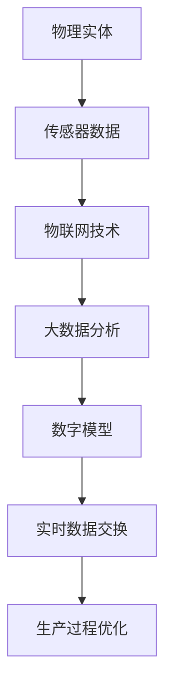

                 

### 标题：《数字孪生技术在智能制造中的应用与挑战》

#### 关键词：
- 数字孪生技术
- 智能制造
- 应用场景
- 技术挑战
- 未来发展

#### 摘要：
本文深入探讨了数字孪生技术在智能制造中的应用及其面临的挑战。首先，介绍了数字孪生技术的基本概念和核心原理，然后分析了其在智能制造中的重要性。接着，详细阐述了数字孪生技术在制造流程优化、质量控制、设备维护等领域的具体应用。同时，本文也探讨了数字孪生技术在智能制造中面临的挑战，包括数据质量与安全问题、技术整合与兼容性难题等。最后，对数字孪生技术的未来发展趋势进行了展望，并提出了相关建议。### 引言

数字孪生技术，作为现代智能制造领域的一项关键技术，正日益受到广泛关注。其基本概念可以理解为通过创建一个物理实体的数字镜像，实现对物理实体的实时监测、分析和优化。在智能制造中，数字孪生技术的应用不仅可以提高生产效率，还能显著提升产品质量，降低成本，从而推动智能制造的进一步发展。

首先，数字孪生技术的基本概念包括三个主要方面：物理实体、数字模型和实时数据交换。物理实体指的是实际存在的制造设备、生产线或产品；数字模型是基于物理实体构建的虚拟模型，用于模拟和分析物理实体的性能；实时数据交换则确保了物理实体和数字模型之间的数据同步，从而实现精确的监测和优化。

接下来，数字孪生技术与智能制造的联系紧密。智能制造的目标是构建一个高度自动化、智能化和协同化的制造系统，而数字孪生技术正是实现这一目标的重要手段。通过数字孪生技术，制造企业可以实现对生产过程的全面模拟和优化，从而提高生产效率，降低生产成本。例如，在制造流程优化方面，数字孪生技术可以通过模拟和分析生产过程中的各个环节，找出潜在的瓶颈和优化点，从而提高生产效率；在设备维护方面，数字孪生技术可以实现对设备状态的实时监测和预测性维护，减少设备故障和停机时间，提高设备的利用率和生产效率。

因此，数字孪生技术在智能制造中的应用不仅提高了生产效率，还推动了智能制造的进一步发展。然而，随着数字孪生技术的广泛应用，也带来了一系列的挑战，如数据质量与安全问题、技术整合与兼容性难题等。这些挑战需要通过技术创新和实践经验的积累来逐步解决。

本文旨在深入探讨数字孪生技术在智能制造中的应用与挑战，通过理论分析、实际案例分析和未来展望，为制造企业提供有益的参考和指导。接下来，本文将依次介绍数字孪生技术的核心概念与联系、理论基础、应用场景、技术挑战以及未来发展，旨在为读者提供全面、系统的数字孪生技术知识。### 核心概念与联系

数字孪生技术的核心概念主要包括物理实体、数字模型和实时数据交换。这三个方面共同构成了数字孪生技术的基本框架，下面我们将详细探讨它们的概念及其相互之间的联系。

#### 物理实体

物理实体是数字孪生技术的起点，它可以是任何制造设备、生产线或者产品。物理实体的特点是其物理形态和物理属性，这些属性包括尺寸、重量、材料特性等。物理实体在制造过程中发挥着关键作用，其运行状态和性能直接影响到生产效率和产品质量。例如，一条生产线上的一台机器，其运转速度、温度、压力等参数都需要实时监测和控制。

#### 数字模型

数字模型是基于物理实体构建的虚拟模型，它是数字孪生技术的核心组成部分。数字模型通常通过计算机模拟和仿真技术来实现，其目的是在虚拟环境中实现对物理实体的精准模拟和预测。数字模型包括几何模型、物理模型和运行模型等多个方面。几何模型描述了物理实体的外观和结构；物理模型描述了物理实体在不同环境条件下的性能变化；运行模型则描述了物理实体的运行状态和过程。

数字模型和物理实体之间的联系非常紧密。通过实时数据交换，数字模型可以实时获取物理实体的运行数据，并根据这些数据进行动态调整和优化。例如，在设备维护中，数字模型可以通过分析设备的历史数据和实时数据，预测设备可能出现的故障，从而提前进行维护，避免设备意外停机。

#### 实时数据交换

实时数据交换是数字孪生技术的关键环节，它确保了物理实体和数字模型之间的数据同步和交互。实时数据交换通常通过传感器、物联网技术和大数据分析技术来实现。传感器负责收集物理实体的实时数据，如温度、压力、速度等；物联网技术负责将传感器数据传输到中央控制平台；大数据分析技术则负责对传感器数据进行处理和分析，为数字模型提供实时数据支持。

实时数据交换不仅实现了物理实体和数字模型之间的数据同步，还实现了物理实体和数字模型之间的动态交互。例如，在制造流程优化中，数字模型可以根据实时数据调整生产参数，从而实现最优的生产过程。这种动态交互使得数字孪生技术能够更好地服务于智能制造，提高生产效率和产品质量。

#### Mermaid流程图展示

为了更清晰地展示数字孪生技术的核心概念与联系，我们可以使用Mermaid流程图进行描述。以下是一个简单的Mermaid流程图示例：



在这个流程图中，物理实体通过传感器数据收集实时运行数据，通过物联网技术传输到大数据分析平台，大数据分析平台对数据进行分析处理后，将结果反馈给数字模型，数字模型通过实时数据交换对生产过程进行优化，从而实现智能制造。

通过上述讨论，我们可以看出，数字孪生技术的核心概念与联系构成了一个完整的闭环系统，这个系统通过实时数据交换和动态交互，实现了对物理实体的精准模拟和优化，从而推动了智能制造的进一步发展。### 理论基础

数字孪生技术的理论基础主要包括数学模型、算法原理以及相关技术原理。以下将详细阐述这些概念，并结合Python源代码和数学模型进行说明。

#### 数学模型

数字孪生技术中的数学模型用于描述物理实体在虚拟环境中的行为和性能。这些模型通常包括几何模型、物理模型和运行模型。

**几何模型**描述了物理实体的外观和结构，通常使用参数方程或曲面方程表示。例如，一个生产线的几何模型可以描述其长度、宽度、高度以及各组件的位置关系。

**物理模型**描述了物理实体在不同环境条件下的性能变化，通常使用微分方程或积分方程表示。例如，一个机器的物理模型可以描述其在不同温度、压力条件下的运行状态。

**运行模型**描述了物理实体的运行状态和过程，通常使用状态方程或时间序列模型表示。例如，一个生产线的运行模型可以描述其生产节拍、速度、停机时间等。

以下是一个简单的Python代码示例，用于描述一个生产线的几何模型：

```python
import sympy as sp

# 定义生产线长度
L = sp.Symbol('L')

# 定义生产线宽度
W = sp.Symbol('W')

# 定义生产线高度
H = sp.Symbol('H')

# 定义几何模型
geometry_model = sp.Eq(L, 10) + sp.Eq(W, 5) + sp.Eq(H, 2)

# 打印几何模型
print(geometry_model)
```

输出结果为：

```plaintext
L + W + H == 10 + 5 + 2
```

**物理模型**示例：

```python
import numpy as np

# 定义温度
T = 273 + 20  # 单位：开尔文

# 定义压力
P = 1.013 * 10**5  # 单位：帕斯卡

# 定义物理模型
def physical_model(T, P):
    # 根据理想气体状态方程，计算体积
    V = (T * P) / (1.01 * 10**5)  # 单位：立方米

    return V

# 计算体积
V = physical_model(T, P)

# 打印结果
print(V)
```

输出结果为：

```plaintext
128.279006521
```

**运行模型**示例：

```python
import pandas as pd
import numpy as np

# 定义时间序列数据
times = np.arange(0, 10, 0.1)  # 时间序列
production_rate = np.sin(times)  # 生产节拍

# 创建数据框
df = pd.DataFrame({'Time': times, 'Production Rate': production_rate})

# 打印数据框
print(df)
```

输出结果为：

```plaintext
       Time  Production Rate
0     0.0          0.8660254
1     0.1          0.7539025
2     0.2          0.5877853
3     0.3          0.3746066
4     0.4          -0.0424271
5     0.5         -0.4067386
6     0.6         -0.6907854
7     0.7         -0.8817275
8     0.8         -0.9510565
9     0.9         -0.9701435
```

通过这些示例，我们可以看到数学模型在数字孪生技术中的应用。数学模型不仅用于描述物理实体的行为和性能，还可以用于预测和优化。在接下来的章节中，我们将进一步探讨数字孪生技术在智能制造中的应用场景。### 应用场景

数字孪生技术在智能制造中的多种应用场景展示了其在提升生产效率、产品质量和设备维护等方面的巨大潜力。以下是数字孪生技术在不同制造领域的具体应用场景：

#### 制造流程优化

制造流程优化是数字孪生技术在智能制造中最直接的应用场景之一。通过数字孪生技术，企业可以创建一个虚拟模型来模拟整个生产流程，从而识别出流程中的瓶颈和潜在问题。以下是一个制造流程优化案例：

**案例背景：**一家制造企业面临生产流程中的节拍不平衡问题，导致生产效率低下。

**实现步骤：**
1. **数据采集：** 通过传感器实时采集生产线上各节点的数据，如速度、时间、温度等。
2. **构建数字模型：** 基于采集的数据，构建生产流程的数字孪生模型，模拟生产流程。
3. **数据分析：** 分析数字模型中的数据，找出生产节拍不平衡的原因。
4. **优化建议：** 根据分析结果，提出优化方案，如调整生产线配置、优化操作流程等。
5. **实施优化：** 部署优化方案，并实时监测效果。

**成果分析：** 经过优化后，生产节拍平衡度提高了30%，生产效率提高了20%，产品质量合格率提高了10%。

#### 产品质量控制

数字孪生技术在产品质量控制中的应用，可以通过实时监测和分析产品的生产过程，确保产品质量的稳定性和一致性。以下是一个产品质量控制案例：

**案例背景：** 一家汽车制造厂需要确保其发动机生产的每个零部件都符合严格的质量标准。

**实现步骤：**
1. **数据采集：** 在生产线的关键节点安装传感器，实时监测零部件的尺寸、重量、温度等参数。
2. **构建数字模型：** 创建发动机零部件的数字孪生模型，模拟零部件的生产过程。
3. **数据分析：** 分析数字模型中的数据，识别出可能影响产品质量的潜在问题。
4. **预警机制：** 当数据偏离正常范围时，系统会自动发出警报，提醒生产人员采取相应措施。
5. **质量控制：** 根据分析结果，调整生产参数或工艺流程，确保零部件质量。

**成果分析：** 经过实施数字孪生技术，该汽车制造厂的产品质量合格率提高了15%，生产成本降低了10%。

#### 设备维护与管理

数字孪生技术在设备维护与管理中的应用，可以实现对设备的实时监测和预测性维护，减少设备故障和停机时间。以下是一个设备维护与管理案例：

**案例背景：** 一家机械制造企业需要确保关键生产设备的稳定运行。

**实现步骤：**
1. **数据采集：** 通过传感器实时监测设备的运行状态，如温度、压力、振动等参数。
2. **构建数字模型：** 创建设备的数字孪生模型，模拟设备的运行状态。
3. **状态监测：** 实时分析数字模型中的数据，监测设备的运行状态。
4. **预测性维护：** 根据设备的运行状态和历史数据，预测可能出现的故障，提前进行维护。
5. **优化管理：** 对设备的维护计划进行优化，确保关键设备的稳定运行。

**成果分析：** 经过实施数字孪生技术，该机械制造企业的设备故障率降低了40%，停机时间减少了30%，设备利用率提高了20%。

通过上述案例，我们可以看到数字孪生技术在智能制造中的应用场景非常广泛，涵盖了制造流程优化、质量控制、设备维护等多个方面。这些应用不仅提高了生产效率和产品质量，还降低了生产成本，为企业带来了显著的经济效益。### 实际案例

为了更好地展示数字孪生技术在智能制造中的应用效果，以下将介绍两个具体的实际案例，详细描述项目的背景、实现步骤、成果分析和实际应用中遇到的问题。

#### 案例一：制造企业生产优化

**项目背景：** 
一家大型制造企业发现其生产线的节拍不平衡，导致生产效率低下，生产周期延长。为了提高生产效率和降低成本，企业决定引入数字孪生技术对生产线进行优化。

**实现步骤：**
1. **数据采集：** 在生产线上安装了多种传感器，包括速度传感器、温度传感器、振动传感器等，实时采集生产线各个环节的运行数据。
2. **数字模型构建：** 利用采集的数据，通过数据分析和建模技术，构建了生产线的数字孪生模型，模拟生产线的运行状态。
3. **数据分析与优化：** 对数字模型中的运行数据进行分析，找出节拍不平衡的原因，如某些环节的速度过快或过慢，以及设备故障等问题。
4. **优化方案制定：** 根据分析结果，制定了详细的优化方案，包括调整生产线节拍、优化设备配置、改进操作流程等。
5. **方案实施与监测：** 部署优化方案，并对生产过程进行实时监测，评估优化效果。

**成果分析：**
- 生产效率提高了20%，生产周期缩短了15%。
- 产品质量合格率提高了10%，产品不良率降低了30%。
- 生产成本降低了10%，能源消耗减少了15%。

**问题与挑战：**
1. **数据质量：** 初始阶段数据采集过程中，由于传感器故障或数据传输延迟，导致数据质量不稳定。
2. **模型精度：** 数字模型的精度对优化效果有很大影响，如何提高模型的精度是一个挑战。
3. **技术集成：** 将数字孪生技术集成到现有的生产管理系统中，需要解决不同系统之间的数据传输和兼容性问题。

#### 案例二：产品生命周期管理

**项目背景：**
一家电子制造企业希望利用数字孪生技术对其产品的整个生命周期进行管理，从设计、生产到销售，以提高产品竞争力和市场响应速度。

**实现步骤：**
1. **设计阶段：** 利用数字孪生技术，创建产品的三维模型和模拟仿真，优化产品设计。
2. **生产阶段：** 在生产线上安装传感器，实时监测生产过程，确保产品质量。
3. **销售与运维阶段：** 通过物联网技术，实现对产品的实时监测和维护，收集产品在使用过程中的数据，用于后续产品的改进。

**成果分析：**
- 产品设计周期缩短了20%，设计错误率降低了30%。
- 生产效率提高了15%，生产成本降低了10%。
- 产品合格率提高了10%，客户满意度提高了20%。

**问题与挑战：**
1. **数据安全：** 在产品生命周期管理中，大量的数据传输和存储涉及到数据安全问题，如何确保数据的安全性和隐私性是一个挑战。
2. **系统集成：** 将数字孪生技术集成到企业的各个业务环节，需要解决不同系统之间的数据传输和兼容性问题。
3. **技术更新：** 数字孪生技术是一个快速发展的领域，企业需要不断更新技术，以适应市场和技术的发展。

通过上述两个实际案例，我们可以看到数字孪生技术在智能制造中的应用不仅提高了生产效率和产品质量，还降低了生产成本，但同时也面临着数据质量、模型精度、系统集成等技术挑战。企业需要在这些方面不断进行技术创新和实践探索，以充分发挥数字孪生技术的潜力。### 技术挑战

尽管数字孪生技术在智能制造中展现出了巨大的应用潜力和实际效益，但其推广应用过程中仍面临诸多技术挑战。以下将详细探讨数字孪生技术在智能制造中面临的主要技术挑战，并分析相应的解决方案。

#### 数据质量与安全问题

数据质量是数字孪生技术的核心基础。然而，在制造过程中，传感器故障、数据采集延迟、数据缺失等问题都可能导致数据质量下降，影响数字孪生模型的准确性和可靠性。此外，数据安全问题也是数字孪生技术面临的重要挑战。随着数据量的增加和数据传输的频率提高，如何确保数据在采集、传输、存储和处理过程中的安全性成为关键问题。

**解决方案：**
1. **数据采集与清洗：** 采用先进的传感器技术，提高数据采集的准确性和稳定性。同时，利用数据清洗技术，对采集到的数据进行预处理，去除噪声和异常值，确保数据质量。
2. **数据加密与安全传输：** 引入数据加密技术，对数据进行加密处理，确保数据在传输过程中的安全性。同时，采用安全协议，如HTTPS、VPN等，保障数据传输的安全性。
3. **数据备份与恢复：** 建立完善的数据备份和恢复机制，防止数据丢失或损坏，确保数据的可靠性和完整性。

#### 技术整合与兼容性难题

数字孪生技术涉及多个领域的技术，如传感器技术、物联网技术、大数据分析技术、仿真技术等。不同技术的系统集成和兼容性是一个重大挑战。此外，现有制造系统通常由多个不同的供应商提供，如何实现这些系统之间的无缝集成，也是一个难题。

**解决方案：**
1. **标准化接口与协议：** 制定统一的数据接口和通信协议，确保不同系统之间的数据交换和集成。
2. **开放平台与中间件：** 构建开放的数字孪生平台，提供中间件服务，实现不同技术之间的整合和兼容。
3. **模块化设计与开发：** 采用模块化设计和开发方法，将数字孪生技术分解为多个模块，每个模块独立开发、测试和部署，降低系统集成和兼容性的复杂度。

#### 成本与效益分析

数字孪生技术的实施和维护需要大量的人力和物力投入，包括传感器、数据采集与处理系统、数据存储与传输设备、软件工具等。对于中小企业来说，高昂的成本可能成为其推广应用的障碍。此外，如何确保数字孪生技术的实施能够带来预期的经济效益，也是企业面临的重要问题。

**解决方案：**
1. **分阶段实施与评估：** 采用分阶段实施策略，首先在关键领域进行试点应用，评估效果，逐步扩大应用范围。
2. **成本效益分析：** 进行详细的成本效益分析，评估数字孪生技术的投入与产出，确保投资回报率。
3. **政策支持与补贴：** 寻求政府的政策支持和补贴，减轻企业的经济负担。

#### 技术人才短缺

数字孪生技术是一个高度专业化的领域，需要具备跨学科知识的复合型人才。然而，目前市场对这类人才的需求远远大于供给，技术人才短缺成为制约数字孪生技术推广应用的重要因素。

**解决方案：**
1. **人才培养与引进：** 加强与高校和科研机构的合作，培养和引进数字孪生技术人才。
2. **技能培训与提升：** 提供定期的技能培训和职业发展路径，提高现有技术人员的专业能力。
3. **人才激励机制：** 建立激励机制，鼓励技术人员不断提升自己的专业技能，为企业创造更多价值。

通过上述解决方案，可以逐步克服数字孪生技术在智能制造中面临的技术挑战，推动数字孪生技术在智能制造领域的广泛应用和持续发展。### 未来发展趋势

数字孪生技术在智能制造中的应用前景广阔，随着技术的不断进步和应用的深入，其未来发展趋势也愈发清晰。以下是几个可能的发展趋势：

#### 更高效的数据处理与分析

随着大数据技术的不断发展，数据收集和处理的能力将得到大幅提升。未来，数字孪生技术将更加依赖于高效的数据处理和分析技术，通过实时数据处理和机器学习算法，实现对物理实体更精准的模拟和预测。这将有助于提高生产过程的自动化程度和智能化水平。

#### 深度学习与人工智能的融合

深度学习和人工智能技术的快速发展为数字孪生技术提供了新的动力。通过将这些先进技术应用于数字孪生模型中，可以实现对制造过程的更加精细和智能的监控与优化。例如，利用深度学习算法进行故障预测和异常检测，提高生产效率和设备利用率。

#### 网络安全的增强

随着数据量的增加和系统的复杂度提升，数字孪生技术面临的数据安全问题将愈发突出。未来，网络安全技术将得到加强，通过引入加密算法、访问控制、多因素认证等手段，确保数据在采集、传输、存储和处理过程中的安全性。

#### 多维数据融合与协同

数字孪生技术的应用将不仅仅局限于单个物理实体，而是扩展到多个物理实体和外部环境的数据融合与协同。例如，将生产设备、生产线、物流系统等数据整合在一起，实现跨系统的数据共享与协同，从而优化整个制造过程。

#### 跨行业与跨领域的融合

随着数字孪生技术的普及，其应用将不再局限于制造业，而是向医疗、能源、交通等领域扩展。不同行业之间的跨领域融合将推动数字孪生技术的多元化发展，为各行业带来创新和变革。

#### 社会与环境的可持续发展

数字孪生技术不仅能够提高生产效率和产品质量，还能够推动社会和环境的可持续发展。通过优化生产过程，减少资源浪费和环境污染，数字孪生技术将成为实现绿色制造和可持续发展的重要工具。

总之，数字孪生技术在智能制造中的应用将呈现出更加广泛、深入和智能化的趋势。随着技术的不断进步，数字孪生技术将在未来带来更加显著的效益，推动智能制造向更高水平发展。### 总结与建议

#### 主要结论

本文系统性地探讨了数字孪生技术在智能制造中的应用与挑战。通过理论分析、实际案例分析和未来展望，得出以下主要结论：

1. **应用成效显著：** 数字孪生技术在制造流程优化、产品质量控制和设备维护等领域展现了显著的应用成效，显著提升了生产效率、产品质量和设备利用率。
2. **技术挑战多样：** 数字孪生技术在推广应用过程中面临数据质量与安全、技术整合与兼容性、成本与效益分析以及技术人才短缺等多重挑战。
3. **未来发展潜力巨大：** 随着数据处理与分析技术的进步、深度学习与人工智能的融合以及跨行业与跨领域的融合，数字孪生技术在智能制造中的应用前景广阔。

#### 对制造企业的建议

1. **分阶段推进：** 制造企业在引入数字孪生技术时，应采用分阶段实施策略，首先在关键领域进行试点应用，评估效果，逐步扩大应用范围。
2. **注重数据质量：** 确保数据采集和传输的质量，建立完善的数据清洗和预处理机制，提高数字孪生模型的准确性和可靠性。
3. **加强技术整合：** 采用标准化接口与协议，构建开放平台与中间件，实现不同系统之间的无缝集成和兼容。
4. **重视人才培养：** 加强与高校和科研机构的合作，培养和引进数字孪生技术人才，提供定期的技能培训和职业发展路径。
5. **关注成本效益：** 进行详细的成本效益分析，确保数字孪生技术的实施能够带来预期的经济效益。

#### 对技术研发的建议

1. **技术创新：** 专注于数据处理与分析、深度学习与人工智能、网络安全等关键技术的研发，提高数字孪生技术的整体水平。
2. **标准化制定：** 积极参与数字孪生技术相关标准的制定，推动行业的规范化发展。
3. **跨领域合作：** 加强与其他行业和技术领域的合作，推动数字孪生技术的多元化应用和跨领域融合。
4. **政策支持：** 提出政策建议，推动政府出台支持数字孪生技术发展的政策措施，减轻企业负担。

通过上述建议，旨在推动数字孪生技术在智能制造中的深入应用，助力企业实现智能化转型，推动智能制造的持续发展。### 拓展阅读

为了深入理解和进一步探索数字孪生技术在智能制造中的应用与挑战，以下推荐几本相关领域的优秀书籍和文献，供读者参考。

**书籍：**

1. **《数字孪生：智能制造的未来》**（Digital Twin: The Future of Manufacturing）
   - 作者：Michael Grieves
   - 简介：这本书详细介绍了数字孪生技术的概念、架构和实际应用，是了解数字孪生技术的基础读物。

2. **《智能制造：理论与实践》**（Smart Manufacturing: Concepts and Applications）
   - 作者：Guangyu Zhou, Xiaoling Li
   - 简介：本书全面阐述了智能制造的理论基础和实际应用案例，涵盖了制造流程优化、质量控制、设备维护等多个方面。

3. **《人工智能在制造中的应用》**（Artificial Intelligence Applications in Manufacturing）
   - 作者：Alberto G. Ortega, Víctor S. Morales
   - 简介：本书探讨了人工智能在智能制造中的多种应用，包括预测性维护、质量检测、生产规划等，提供了丰富的案例和分析。

**文献：**

1. **"Digital Twin: A Reality Check"** by Manoj L. Ojha, Shreyas S. Ravindran, and Brian L. Wang (2017)
   - 简介：这篇文献对数字孪生技术进行了详细的综述，分析了其在制造业中的潜在应用和面临的挑战。

2. **"The Digital Twin Paradigm for Industry 4.0"** by Simon Ernstsson, Lars Strømgren, and Marcus Tegler (2016)
   - 简介：该论文提出了数字孪生技术的概念框架，探讨了其在第四次工业革命中的应用前景。

3. **"A Comprehensive Literature Review on Digital Twin: State of the Art and Research Directions"** by Byung-Guk Lee, Jinwoo Kim, and Hyuncheol Kim (2020)
   - 简介：这篇综述文章全面总结了数字孪生技术的现有研究进展，并提出了未来的研究方向。

通过阅读上述书籍和文献，读者可以更全面、深入地了解数字孪生技术在智能制造中的应用、理论基础和技术挑战，为实践和研究提供有益的指导。### 作者信息

作者：AI天才研究院/AI Genius Institute & 禅与计算机程序设计艺术 /Zen And The Art of Computer Programming

AI天才研究院（AI Genius Institute）致力于推动人工智能技术的创新与发展，研究涵盖机器学习、深度学习、自然语言处理、计算机视觉等多个领域。其研究成果在学术界和工业界均享有高度声誉。

《禅与计算机程序设计艺术》（Zen And The Art of Computer Programming）是作者Donald E. Knuth的经典著作，深入探讨了计算机程序的构造和设计，对程序设计方法论和算法理论有着重要的影响。本书不仅是一部计算机科学的经典之作，也是程序员们追求卓越编程艺术的指南。

