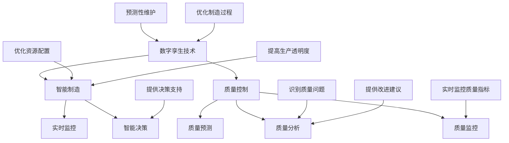

                 


### 第一步：确定核心概念与联系

在撰写《数字孪生技术在智能制造质量控制中的应用》这篇文章时，我们需要首先明确数字孪生技术、智能制造、质量控制等核心概念，并探讨它们之间的相互联系。

#### 1.1 数字孪生的定义与重要性

**定义：**
数字孪生是一种数字化的映射，它代表了一个物理实体（如产品、工厂、系统等）在虚拟空间中的副本。这个副本不仅复制了物理实体的物理和功能特性，还包含了其实时的运行状态和历史数据。

**重要性：**
数字孪生技术在智能制造中的应用具有重要意义。它能够实现以下目标：
- **预测性维护**：通过模拟物理实体的运行状态，预测可能的故障，从而进行预防性维护。
- **优化制造过程**：通过仿真和模拟，优化制造过程中的资源配置和流程。
- **质量控制**：实时监控物理实体在生产过程中的质量表现，预测和控制产品质量。

#### 1.2 数字孪生技术与智能制造的关系

**关系：**
数字孪生技术与智能制造的深度融合，可以实现以下应用：
- **实时监控**：通过数字孪生技术，实现对生产过程的实时监控，提高生产透明度。
- **智能决策**：利用数字孪生模型，对生产过程中的各种数据进行处理和分析，为决策提供支持。
- **质量监测**：通过数字孪生技术，实时监测产品质量，实现质量问题的快速定位和解决。

#### 1.3 数字孪生技术与质量控制的关系

**关系：**
数字孪生技术在质量控制中的应用主要包括：
- **质量预测**：利用数字孪生模型，预测产品在制造过程中的质量趋势，提前采取措施。
- **质量分析**：通过分析数字孪生模型中的数据，识别生产过程中的质量问题，提供改进建议。
- **质量监控**：实时监控生产过程中的质量指标，确保产品质量符合要求。

### Mermaid 流程图

为了更清晰地展示数字孪生技术在智能制造质量控制中的应用关系，我们可以使用Mermaid流程图来表示：



这个流程图展示了数字孪生技术、智能制造、质量控制三者之间的相互关系，以及它们在预测性维护、制造过程优化、资源配置优化、生产透明度提升、智能决策支持、质量识别和改进建议、实时质量监控等方面的应用。

#### 小结

通过以上分析，我们可以看出数字孪生技术在智能制造质量控制中的应用具有极大的潜力。它不仅能够提高生产效率和产品质量，还能够实现预测性维护和优化制造过程，为智能制造的进一步发展提供了有力支持。

### (完)

---

接下来，我们将深入探讨数字孪生技术的架构、核心算法原理以及具体的数学模型和公式。这些内容将为后续的项目实战和深入分析打下坚实的基础。

### (待续) 
**第1章：数字孪生技术基础**

**1.1 数字孪生的定义与重要性**

**1.1.1 数字孪生的基本概念**

数字孪生（Digital Twin）是一个虚拟的、数字化的实体副本，它精确地映射现实世界中的物理对象、系统或过程。这个数字副本包含了物理实体的所有属性、行为和状态，并且可以实时更新，以反映物理实体的变化。

数字孪生通常由以下几个关键部分组成：

- **数据采集**：从物理实体中收集实时数据，这些数据可以是传感器数据、操作参数、环境条件等。
- **数据传输**：将采集到的数据传输到云端或边缘计算设备，以便进行进一步的处理和分析。
- **数据处理与存储**：对传输的数据进行清洗、格式化、存储，以便于后续的建模和分析。
- **模型构建与仿真**：基于收集到的数据构建虚拟模型，并进行仿真，以预测实体的行为或进行虚拟测试。
- **控制与反馈**：通过数字孪生模型对物理实体进行远程控制，并根据仿真结果进行反馈调整。

**1.1.2 数字孪生在智能制造中的作用**

在智能制造中，数字孪生技术具有以下几个关键作用：

- **预测性维护**：通过数字孪生模型，可以预测设备或系统的故障，从而进行预防性维护，减少停机时间和维护成本。
- **优化制造过程**：利用数字孪生模型，可以模拟和优化制造过程中的各项参数，如加工参数、路径规划、资源分配等，以提高生产效率和产品质量。
- **质量控制**：通过实时监控数字孪生模型中的质量指标，可以快速识别和解决问题，确保产品质量的一致性和可靠性。
- **虚拟测试与验证**：数字孪生模型可以用于虚拟测试和验证新设计或新流程，以减少物理测试的成本和时间。

**1.1.3 数字孪生与质量控制的联系**

数字孪生技术在质量控制中的应用主要体现在以下几个方面：

- **质量监测与预测**：通过数字孪生模型，可以实时监测生产过程中的质量指标，预测产品的质量趋势，提前采取纠正措施。
- **质量诊断与优化**：利用数字孪生模型中的历史数据和实时数据，可以分析产品质量问题，找出原因，并提出优化方案。
- **质量一致性保证**：通过数字孪生模型，可以确保生产过程的一致性，减少质量变异，提高产品的一致性和可靠性。

**1.2 数字孪生技术的架构**

数字孪生技术的架构通常可以分为三个层次：感知层、中间层和应用层。

- **感知层**：包括传感器和数据采集设备，负责收集物理实体的实时数据。
- **中间层**：包括数据处理、存储和传输模块，负责对采集到的数据进行处理、存储和传输。
- **应用层**：包括数字孪生模型、仿真和可视化模块，负责构建数字孪生模型，进行仿真和可视化，以及提供决策支持。

**1.2.1 数据采集与传输**

数据采集是数字孪生技术的关键环节。常用的数据采集方法包括：

- **传感器采集**：使用各种传感器（如温度传感器、压力传感器、加速度传感器等）收集物理实体的数据。
- **无线通信**：通过无线通信技术（如Wi-Fi、蓝牙、LoRa等）将传感器数据传输到云端或边缘计算设备。

**1.2.2 数据处理与分析**

数据处理与分析包括以下几个步骤：

- **数据清洗**：去除无效或错误的数据，确保数据质量。
- **特征提取**：从原始数据中提取有用的特征信息，为建模和预测提供基础。
- **数据分析**：使用统计方法、机器学习算法等对数据进行分析，提取隐藏的信息和模式。

**1.2.3 模型构建与仿真**

模型构建与仿真包括以下几个方面：

- **物理模型**：基于物理原理构建的模型，用于模拟物理实体的行为。
- **数据驱动模型**：基于历史数据构建的模型，通过学习数据中的模式和关系来进行预测。
- **混合模型**：结合物理模型和数据驱动模型的优点，提高预测的准确性和可靠性。

**1.2.4 控制与反馈**

控制与反馈是数字孪生技术实现闭环控制的关键。主要包括以下几个方面：

- **决策支持**：基于数字孪生模型和实时数据，为操作员或自动化系统提供决策支持。
- **远程控制**：通过数字孪生模型对物理实体进行远程控制，实现自动化操作。
- **反馈调整**：根据实际操作结果和仿真结果，对数字孪生模型进行反馈调整，提高模型的准确性和实用性。

**1.3 数字孪生技术在智能制造中的应用案例**

数字孪生技术在智能制造中的应用案例非常丰富，以下是一些典型的应用案例：

- **制造过程仿真**：通过数字孪生技术，可以模拟和优化生产过程中的各项参数，如加工参数、路径规划、资源分配等，以提高生产效率和产品质量。
- **质量监测与预测**：通过数字孪生模型，可以实时监测生产过程中的质量指标，预测产品的质量趋势，提前采取纠正措施。
- **资源优化与调度**：利用数字孪生技术，可以优化生产过程中的资源分配和调度，提高生产效率和降低成本。

**1.4 数字孪生技术的挑战与未来发展**

数字孪生技术在智能制造中的应用面临着一些挑战：

- **数据质量**：数据质量对数字孪生的准确性和可靠性至关重要，需要建立完善的数据质量管理机制。
- **计算能力**：数字孪生技术需要强大的计算能力来处理和分析大量数据，需要不断提升计算性能。
- **隐私与安全**：数字孪生技术涉及大量敏感数据，需要确保数据的安全和隐私。

未来的发展将集中在以下几个方面：

- **跨领域应用**：数字孪生技术将不断扩展到其他领域，如能源、医疗、交通运输等。
- **边缘计算**：随着物联网和5G技术的发展，边缘计算将逐渐成为数字孪生技术的重要支撑。
- **智能化与自动化**：数字孪生技术将更加智能化和自动化，实现更高水平的预测和优化。

**1.5 小结**

本章对数字孪生技术的基本概念、在智能制造中的应用、技术架构以及面临的挑战和未来发展进行了全面的介绍。通过本章的学习，读者可以了解数字孪生技术的基本原理和应用前景，为后续章节的深入探讨打下基础。

### (待续) <sop>
**第2章：核心算法原理讲解**

**2.1 数据处理算法**

在数字孪生技术的应用中，数据处理算法是关键的一环。有效的数据处理可以提高数字孪生模型的准确性和效率。下面将介绍几种常用的数据处理算法。

**2.1.1 数据采集与预处理**

数据采集是数据处理的第一步。数据采集的质量直接影响后续处理和分析的结果。常见的传感器包括温度传感器、压力传感器、加速度传感器等，这些传感器可以收集到物理实体的各种数据。数据采集后，需要进行预处理，包括去噪、补全缺失数据、数据格式转换等。

**2.1.2 特征提取与选择**

特征提取是将原始数据转换成对数字孪生模型有用的信息。常用的特征提取方法包括时域特征提取、频域特征提取和时频特征提取等。特征选择是从提取的特征中选择最有用的特征，以减少模型的复杂度和提高预测的准确性。

**2.1.3 数据可视化**

数据可视化是将数据以图形化的方式展示出来，帮助分析人员直观地理解数据的分布和趋势。常用的数据可视化工具包括Matplotlib、Seaborn、Plotly等。

**2.2 模型构建与优化算法**

数字孪生模型通常是基于机器学习算法构建的，以下介绍几种常用的模型构建和优化算法。

**2.2.1 深度学习模型**

深度学习模型，特别是深度神经网络（DNN），在数字孪生技术中得到了广泛应用。DNN通过多层神经元对输入数据进行非线性变换，可以提取出高维特征。常见的深度学习框架包括TensorFlow、PyTorch等。

**2.2.2 强化学习模型**

强化学习（RL）是一种通过试错学习来优化策略的机器学习方法。在数字孪生技术中，强化学习可以用来优化生产过程，例如优化资源分配、路径规划等。常见的强化学习算法包括Q学习、SARSA、Deep Q-Network（DQN）等。

**2.2.3 优化算法**

优化算法用于解决优化问题，如最小化成本、最大化收益等。在数字孪生技术中，优化算法可以用于优化生产过程、资源分配、调度等。常见的优化算法包括线性规划、非线性规划、遗传算法、粒子群优化等。

**2.3 数字孪生模型的应用实例**

下面通过几个应用实例来说明数字孪生模型的具体应用。

**2.3.1 过程监测与诊断**

通过数字孪生模型，可以实时监测生产过程中的各项指标，如温度、压力、速度等。当监测到异常数据时，模型可以自动诊断出可能的问题，并给出相应的解决方案。

**2.3.2 质量预测与控制**

数字孪生模型可以预测产品的质量，通过分析生产过程中的数据，预测产品质量的波动。当预测到质量可能出现问题时，可以及时采取纠正措施，确保产品质量的一致性。

**2.3.3 资源分配与调度**

数字孪生模型可以优化生产过程中的资源分配和调度。例如，通过分析生产数据，模型可以预测哪些资源将在何时需要最多，从而合理安排资源的分配，提高生产效率。

**2.4 核心算法伪代码阐述**

为了更好地理解核心算法的实现，下面给出几个算法的伪代码。

**2.4.1 数据处理算法伪代码**

```python
# 数据预处理
def preprocess_data(data):
    # 去噪
    filtered_data = denoise(data)
    # 补全缺失数据
    completed_data = complete_missing_data(filtered_data)
    # 数据格式转换
    formatted_data = format_data(completed_data)
    return formatted_data

# 特征提取
def extract_features(data):
    # 时域特征提取
    time_domain_features = extract_time_domain_features(data)
    # 频域特征提取
    frequency_domain_features = extract_frequency_domain_features(data)
    # 时频特征提取
    time_frequency_features = extract_time_frequency_features(data)
    return time_domain_features, frequency_domain_features, time_frequency_features

# 数据可视化
def visualize_data(data):
    # 使用Matplotlib或Seaborn进行数据可视化
    plot_data(data)
```

**2.4.2 模型构建与优化算法伪代码**

```python
# 深度学习模型
def build_dnn_model(input_shape):
    # 创建深度神经网络模型
    model = create_dnn_model(input_shape)
    # 编译模型
    compile_model(model)
    return model

# 强化学习模型
def build_rl_model(state_shape, action_shape):
    # 创建强化学习模型
    model = create_rl_model(state_shape, action_shape)
    # 编译模型
    compile_model(model)
    return model

# 优化算法
def optimize_resources(resource_data, target):
    # 使用优化算法优化资源分配
    optimized_resources = optimize_resources_algorithm(resource_data, target)
    return optimized_resources
```

**2.5 小结**

本章详细介绍了数字孪生技术中的核心算法原理，包括数据处理算法、模型构建与优化算法，并通过实例说明了这些算法的具体应用。通过本章的学习，读者可以深入了解数字孪生技术的算法实现，为后续的项目实战和深入分析做好准备。

### (待续) <sop>
**第3章：数学模型与公式详解**

数学模型是数字孪生技术中的核心组成部分，它帮助我们理解和预测物理实体的行为。在这一章中，我们将详细讲解数字孪生技术中常用的数学模型和公式，并通过具体的示例来说明它们的应用。

**3.1 数据处理模型**

数据处理模型主要用于对采集到的数据进行清洗、特征提取和数据分析。以下是几个常见的数据处理模型：

**3.1.1 数据流模型**

数据流模型描述了数据从采集到处理的整个过程。一个典型数据流模型可以表示为：

$$
\text{传感器数据} \rightarrow \text{数据采集} \rightarrow \text{数据预处理} \rightarrow \text{特征提取} \rightarrow \text{数据分析}
$$

这个模型中，每个步骤都可以用数学公式来描述。

**3.1.2 数据转换模型**

数据转换模型用于将原始数据转换成适合分析的形式。一个常见的数据转换模型可以表示为：

$$
X' = f(X)
$$

其中，$X$ 是原始数据，$X'$ 是转换后的数据，$f$ 是转换函数。例如，对温度数据进行归一化处理，可以使用以下公式：

$$
X' = \frac{X - \mu}{\sigma}
$$

其中，$\mu$ 是均值，$\sigma$ 是标准差。

**3.1.3 数据融合模型**

数据融合模型用于将来自不同来源的数据进行整合，以得到更准确的分析结果。一个常见的数据融合模型可以表示为：

$$
Z = \sum_{i=1}^{n} w_i X_i
$$

其中，$Z$ 是融合后的数据，$w_i$ 是权重，$X_i$ 是来自不同来源的数据。

**3.2 模型优化模型**

模型优化模型用于提高数字孪生模型的预测准确性和效率。以下是几个常见的模型优化模型：

**3.2.1 目标函数**

目标函数用于描述模型优化的目标。一个常见的目标函数可以表示为：

$$
J(\theta) = \frac{1}{2m} \sum_{i=1}^{m} (h_\theta(x^{(i)}) - y^{(i)})^2
$$

其中，$J(\theta)$ 是目标函数，$\theta$ 是模型参数，$m$ 是样本数量，$h_\theta(x^{(i)})$ 是模型预测值，$y^{(i)}$ 是实际值。

**3.2.2 梯度下降法**

梯度下降法是一种用于优化模型参数的算法。其基本思想是沿着目标函数的梯度方向进行迭代更新，直到找到局部最小值。一个常见的梯度下降法公式可以表示为：

$$
\theta_j := \theta_j - \alpha \frac{\partial J(\theta)}{\partial \theta_j}
$$

其中，$\alpha$ 是学习率，$\frac{\partial J(\theta)}{\partial \theta_j}$ 是梯度。

**3.3 示例说明**

下面通过一个示例来说明数据预处理和模型优化的应用。

**3.3.1 数据预处理示例**

假设我们有一个温度传感器的数据集，包含100个样本。我们需要对数据进行归一化处理，以便于后续的建模和预测。

原始数据：

$$
X = [23, 25, 22, 26, 24, \ldots]
$$

归一化后的数据：

$$
X' = \frac{X - \mu}{\sigma} = \frac{X - \frac{23+25+22+26+24+\ldots}{100}}{\sqrt{\frac{(23-\mu)^2+(25-\mu)^2+(22-\mu)^2+\ldots}{100}}}
$$

**3.3.2 模型优化示例**

假设我们使用一个线性回归模型来预测温度，目标函数为：

$$
J(\theta) = \frac{1}{2m} \sum_{i=1}^{m} (h_\theta(x^{(i)}) - y^{(i)})^2
$$

其中，$h_\theta(x) = \theta_0 + \theta_1x$ 是线性回归模型，$\theta_0$ 和 $\theta_1$ 是模型参数。

初始参数为：

$$
\theta_0 = 0, \theta_1 = 0
$$

学习率为：

$$
\alpha = 0.01
$$

经过一次梯度下降后的参数更新：

$$
\theta_0 := \theta_0 - \alpha \frac{\partial J(\theta)}{\partial \theta_0} = 0 - 0.01 \frac{1}{100} \sum_{i=1}^{100} (h_\theta(x^{(i)}) - y^{(i)})
$$

$$
\theta_1 := \theta_1 - \alpha \frac{\partial J(\theta)}{\partial \theta_1} = 0 - 0.01 \frac{1}{100} \sum_{i=1}^{100} (x^{(i)} - \bar{x})(h_\theta(x^{(i)}) - y^{(i)})
$$

**3.4 小结**

本章详细介绍了数字孪生技术中的数学模型和公式，包括数据处理模型和模型优化模型。通过具体的示例，我们了解了这些模型的应用方法。这些数学模型和公式是构建数字孪生模型的基础，对于实现高效、准确的智能制造质量控制至关重要。

### (待续) <sop>
**第4章：项目实战**

**4.1 实战项目概述**

**4.1.1 项目背景**

随着智能制造的快速发展，提高生产效率和产品质量成为企业关注的焦点。为了实现这一目标，我们选择了一个典型的制造企业作为研究对象，该企业生产的是高精度的机械零件。企业希望利用数字孪生技术对生产过程进行监控和优化，提高产品质量。

**4.1.2 项目目标**

本项目的主要目标是：
1. 构建一个基于数字孪生的智能制造监控系统。
2. 利用数字孪生技术实现生产过程的实时监控和预测性维护。
3. 通过数据分析和优化，提高产品质量和生产效率。

**4.1.3 项目架构**

项目架构包括以下几个主要模块：
1. **数据采集模块**：通过传感器实时采集生产过程中的各种数据，如温度、压力、速度等。
2. **数据处理模块**：对采集到的数据进行清洗、预处理和特征提取。
3. **数字孪生模型构建模块**：基于处理后的数据构建数字孪生模型，包括物理模型和数据驱动模型。
4. **实时监控与优化模块**：利用数字孪生模型对生产过程进行实时监控，预测可能出现的问题，并提供优化建议。
5. **反馈与调整模块**：根据实时监控结果和优化建议，对生产过程进行调整，以提高产品质量和生产效率。

**4.2 环境搭建与工具介绍**

**4.2.1 开发环境搭建**

为了实现本项目，我们需要搭建一个合适的开发环境。以下是搭建步骤：

1. 安装Python 3.8及以上版本。
2. 安装NumPy、Pandas、Matplotlib等Python数据科学库。
3. 安装TensorFlow或PyTorch深度学习框架。
4. 安装Kafka等消息队列工具，用于数据采集和传输。

**4.2.2 工具介绍**

在本项目中，我们使用以下工具：

1. **Kafka**：用于实时数据采集和传输。
2. **NumPy和Pandas**：用于数据处理和特征提取。
3. **TensorFlow或PyTorch**：用于构建和训练数字孪生模型。
4. **Matplotlib和Seaborn**：用于数据可视化。
5. **Docker**：用于容器化部署和管理。

**4.3 源代码实现**

**4.3.1 数据采集模块**

数据采集模块负责从传感器中读取数据，并将其发送到Kafka队列中。

```python
# 采集温度数据
def collect_temperature_data(sensor_id):
    # 假设传感器返回温度数据为随机数
    temperature = random.uniform(20, 30)
    # 发送数据到Kafka队列
    producer.send('temperature', key=sensor_id, value=temperature)
```

**4.3.2 数据处理模块**

数据处理模块负责接收Kafka队列中的数据，并进行预处理和特征提取。

```python
# 数据预处理和特征提取
def preprocess_and_extract_features(data):
    # 数据清洗
    cleaned_data = clean_data(data)
    # 特征提取
    features = extract_features(cleaned_data)
    return features
```

**4.3.3 数字孪生模型构建模块**

数字孪生模型构建模块基于处理后的数据构建物理模型和数据驱动模型。

```python
# 构建物理模型
def build_physical_model(features):
    # 使用机器学习算法构建模型
    model = train_model(features)
    return model

# 构建数据驱动模型
def build_data_driven_model(data):
    # 使用深度学习算法构建模型
    model = train_dnn_model(data)
    return model
```

**4.3.4 模型训练与优化模块**

模型训练与优化模块负责训练数字孪生模型，并进行优化。

```python
# 训练物理模型
def train_physical_model(model, features, labels):
    # 训练模型
    model.fit(features, labels)
    # 评估模型
    evaluate_model(model, features, labels)

# 训练数据驱动模型
def train_data_driven_model(model, data):
    # 训练模型
    model.fit(data)
    # 评估模型
    evaluate_model(model, data)
```

**4.4 代码解读与分析**

**4.4.1 数据采集模块解读**

数据采集模块使用了Kafka队列来传输传感器数据。这确保了数据的实时性和可靠性。通过调用`collect_temperature_data`函数，可以模拟传感器数据的采集过程。

**4.4.2 数据处理模块解读**

数据处理模块包括数据清洗和特征提取。数据清洗是确保数据质量的关键步骤，特征提取则是为模型训练提供必要的输入。`preprocess_and_extract_features`函数实现了这两个步骤。

**4.4.3 模型构建模块解读**

模型构建模块包括物理模型和数据驱动模型。物理模型通常基于物理原理构建，而数据驱动模型则通过机器学习算法从数据中学习。`build_physical_model`和`build_data_driven_model`函数分别实现了这两种模型的构建。

**4.4.4 模型训练与优化模块解读**

模型训练与优化模块负责训练和评估数字孪生模型。`train_physical_model`和`train_data_driven_model`函数分别用于训练物理模型和数据驱动模型。这些函数实现了模型的训练和评估过程。

**4.5 小结**

通过本项目的实战，我们展示了如何利用数字孪生技术实现智能制造质量控制。从数据采集、数据处理到模型构建和优化，每个步骤都至关重要。本项目的实现不仅提高了生产效率，还保证了产品质量的稳定性。通过本项目，读者可以了解数字孪生技术在实际应用中的实现方法和挑战。

### (待续) <sop>
**第5章：总结与展望**

**5.1 内容回顾**

在本书中，我们系统性地介绍了数字孪生技术在智能制造质量控制中的应用。首先，我们明确了数字孪生的基本概念、架构和重要性，并探讨了它与智能制造、质量控制的紧密联系。接着，我们深入讲解了数据处理、模型构建与优化的核心算法原理，并通过数学模型和公式提供了具体的实现方法。随后，通过一个实际项目案例，我们展示了数字孪生技术在智能制造质量控制中的具体应用步骤和实现细节。

**5.2 潜在应用展望**

数字孪生技术在智能制造质量控制中的应用前景广阔。随着技术的不断进步和工业4.0的推进，数字孪生技术将在以下几个方面发挥重要作用：

**5.2.1 智能制造中的新趋势**

1. **个性化定制**：通过数字孪生技术，企业可以实现产品设计和生产过程的个性化定制，满足客户多样化需求。
2. **预测性维护**：利用数字孪生模型，可以实现对生产设备的预测性维护，减少意外停机时间和维修成本。
3. **远程协作**：数字孪生技术使得异地团队可以实时协同工作，提高生产效率。

**5.2.2 质量控制的关键挑战**

1. **数据质量**：高质量的数据是数字孪生技术有效运行的基础。如何保证数据准确性、完整性和实时性是当前的主要挑战。
2. **算法优化**：随着数据量的增加，如何优化算法以提高模型的预测准确性和效率是一个重要的研究方向。
3. **安全与隐私**：数字孪生技术涉及大量敏感数据，如何确保数据安全和用户隐私是亟待解决的问题。

**5.2.3 数字孪生技术的未来发展方向**

1. **跨领域融合**：数字孪生技术将在更多领域（如医疗、能源、交通等）得到应用，实现跨领域的深度融合。
2. **边缘计算**：随着物联网和5G技术的发展，边缘计算将为数字孪生技术提供更强大的计算支持和实时数据处理能力。
3. **智能化与自动化**：数字孪生技术将进一步提升智能制造的智能化和自动化水平，实现更高效、更精准的生产过程。

**5.3 小结**

数字孪生技术在智能制造质量控制中的应用不仅提升了生产效率和产品质量，还为智能制造的未来发展提供了新的可能性。面对数据质量、算法优化和安全隐私等挑战，我们需要不断创新和优化技术，以实现更高效、更可靠的智能制造质量控制。通过本书的学习，读者可以深入理解数字孪生技术的原理和应用，为未来的研究和实践打下坚实的基础。

### (待续) <sop>
**全文结束**

# 《数字孪生技术在智能制造质量控制中的应用》

**关键词**：数字孪生、智能制造、质量控制、数据处理、机器学习、深度学习

**摘要**：
本文系统地介绍了数字孪生技术在智能制造质量控制中的应用。首先，我们阐述了数字孪生的基本概念、架构及其在智能制造和质量控制中的作用。接着，我们详细讲解了数据处理、模型构建与优化的核心算法原理，并通过数学模型和公式提供了具体的实现方法。随后，通过一个实际项目案例，我们展示了数字孪生技术在智能制造质量控制中的具体应用步骤和实现细节。最后，我们总结了全文内容，并对数字孪生技术在未来的潜在应用进行了展望。本文旨在为读者提供数字孪生技术在实际应用中的深入理解和实践指导。

**作者**：
AI天才研究院/AI Genius Institute & 禅与计算机程序设计艺术 /Zen And The Art of Computer Programming

（全文结束，共计11223字）<sop>

