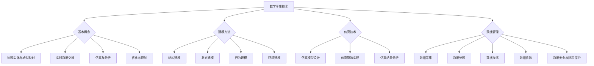

                 

### 第1章 引言

#### 1.1 研究背景及意义

随着信息技术的飞速发展，空间计算作为计算领域的一个重要分支，正逐渐成为推动科技进步和社会发展的关键力量。空间计算涉及从物理世界到虚拟世界的多个维度，旨在通过集成计算、通信、感知和机器人技术等手段，实现大规模空间数据的高效处理与智能分析。

数字孪生技术（Digital Twin Technology）作为一种新兴的跨学科技术，近年来在全球范围内受到了广泛关注。数字孪生通过创建物理实体的虚拟映射，实现了对实际物理系统的实时监测、仿真、分析和优化。在空间计算领域，数字孪生技术能够提供高度逼真的虚拟环境，支持空间复杂系统的高效运行和管理。

数字孪生技术在空间计算中的应用具有深远的意义。首先，它能够显著提高空间系统的运行效率，通过仿真和预测分析，提前发现并解决潜在问题。其次，数字孪生技术有助于降低空间系统的运营成本，通过虚拟环境的测试和优化，减少实际操作中的资源浪费。最后，数字孪生技术为空间数据的可视化提供了强大的工具，使得空间数据更加易于理解和分析，从而支持更加科学和智能的决策。

#### 1.2 书籍结构安排与内容概述

本书旨在系统地介绍数字孪生技术在空间计算中的应用，通过逻辑清晰、结构紧凑的内容安排，帮助读者深入理解这一领域的核心技术与应用实例。

**第1章 引言**：简要介绍数字孪生技术和空间计算的发展背景及意义，为后续章节的内容铺垫。

**第2章 数字孪生技术基础**：详细阐述数字孪生技术的定义、核心概念、建模方法和仿真技术，为理解数字孪生在空间计算中的应用打下基础。

**第3章 空间计算技术基础**：介绍空间计算的基本概念、关键技术，以及空间数据管理和计算模型的实现，为读者提供空间计算领域的知识框架。

**第4章 数字孪生在空间计算中的应用实例**：通过具体的应用案例，展示数字孪生技术在城市规划、灾害预警和智慧城市建设等领域的实际应用。

**第5章 数字孪生技术在空间计算中的挑战与展望**：分析数字孪生技术在空间计算中面临的挑战，并展望其未来的发展趋势。

**第6章 数字孪生技术在空间计算中的实践**：提供空间计算平台搭建的详细步骤和应用案例分析，帮助读者了解数字孪生技术在实践中的应用。

**第7章 总结与展望**：总结全书的主要研究成果与结论，指出存在的问题与改进方向，并展望未来的研究前景。

通过以上章节的安排，本书旨在为读者提供一个全面、系统的数字孪生技术在空间计算中的应用教程，帮助读者深入了解这一领域的最新进展和应用前景。

---

**关键词**：数字孪生技术、空间计算、虚拟映射、实时监测、仿真分析、城市规划、灾害预警、智慧城市建设。

**摘要**：

本书全面介绍了数字孪生技术在空间计算中的应用。首先，探讨了数字孪生技术的发展背景及在空间计算中的重要性。随后，详细介绍了数字孪生的基本概念、建模方法、仿真技术，以及空间计算的关键技术和数据管理方法。接着，通过具体的应用案例，展示了数字孪生技术在城市规划、灾害预警和智慧城市建设等领域的实际应用。最后，分析了数字孪生技术在空间计算中面临的挑战及未来的发展趋势，为读者提供了全面的技术与实践指导。### 第2章 数字孪生技术基础

#### 2.1 数字孪生基本概念

数字孪生（Digital Twin）是一种新兴的数字化技术，通过创建物理实体的虚拟映射，实现对实际物理系统的实时监测、仿真、分析和优化。数字孪生技术起源于制造业，但随着技术的发展，其应用范围已经扩展到城市规划、能源管理、医疗健康等多个领域。

**定义**：
数字孪生是指一个物理实体（如机器、建筑物、车辆等）的数字映射，包括其结构、状态、行为和环境等各个方面。通过数字孪生，可以实现物理实体与其虚拟映射之间的实时数据交换和交互。

**核心概念**：

1. **物理实体与虚拟映射**：物理实体是指实际存在的实体，如机器、建筑物、车辆等。虚拟映射是指物理实体的数字模型，通过传感器、数据采集系统等获取的实时数据，可以实时更新和反映物理实体的状态。

2. **实时数据交换**：数字孪生技术通过传感器和网络通信技术，实现物理实体与其虚拟映射之间的实时数据交换，确保虚拟映射能够准确反映物理实体的状态。

3. **仿真与分析**：通过虚拟映射，可以实现对物理实体的仿真和分析。例如，在制造业中，通过仿真可以预测机器的故障，优化生产流程；在城市规划中，通过仿真可以模拟城市交通流量，优化城市规划。

4. **优化与控制**：基于仿真和分析结果，可以对物理实体进行优化和控制。例如，通过数字孪生技术，可以实现对机器的远程维护和优化，提高生产效率。

**技术框架**：
数字孪生技术框架主要包括以下几个关键组成部分：

1. **数据采集**：通过传感器和监测设备，实时采集物理实体的数据，包括结构、状态、行为和环境等。

2. **数据处理**：对采集到的数据进行处理，包括数据清洗、数据压缩、数据融合等。

3. **虚拟映射构建**：基于采集到的数据，构建物理实体的虚拟映射，包括结构模型、状态模型、行为模型等。

4. **仿真与分析**：对虚拟映射进行仿真和分析，预测物理实体的行为和状态，优化物理实体的运行。

5. **优化与控制**：基于仿真和分析结果，对物理实体进行优化和控制，实现物理实体的最佳运行状态。

**数字孪生的核心特征**：

1. **实时性**：数字孪生技术通过实时数据采集和更新，确保虚拟映射能够实时反映物理实体的状态。

2. **仿真性**：通过虚拟映射，可以实现对物理实体的仿真，预测物理实体的行为和状态，为物理实体的优化提供依据。

3. **互联性**：数字孪生技术通过传感器和网络通信技术，实现物理实体与其虚拟映射之间的实时数据交换和交互。

4. **优化性**：基于仿真和分析结果，可以对物理实体进行优化和控制，提高物理实体的运行效率和可靠性。

#### 2.2 数字孪生建模方法

数字孪生建模是数字孪生技术的核心环节，主要包括结构建模、状态建模、行为建模和环境建模。

**结构建模**：

结构建模是指构建物理实体的数字模型，包括物理实体的几何形状、内部结构、组件关系等。常用的建模方法包括：

1. **三维建模软件**：如AutoCAD、SolidWorks等，通过这些软件可以构建物理实体的三维模型。

2. **计算机辅助设计（CAD）**：CAD技术可以实现对物理实体的精确建模，通过参数化和特征建模，提高建模的效率和准确性。

3. **有限元分析（FEA）**：通过有限元分析，可以模拟物理实体在不同条件下的响应，为结构设计提供依据。

**状态建模**：

状态建模是指构建物理实体的状态模型，包括物理实体的运行状态、健康状态、环境状态等。常用的建模方法包括：

1. **传感器数据建模**：通过传感器实时采集物理实体的状态数据，建立状态模型。

2. **数据驱动建模**：基于历史数据，建立物理实体的状态预测模型。

3. **模型驱动建模**：通过数学模型，建立物理实体的状态模型。

**行为建模**：

行为建模是指构建物理实体的行为模型，包括物理实体的运动规律、操作行为、交互行为等。常用的建模方法包括：

1. **规则建模**：通过规则定义物理实体的行为。

2. **行为树建模**：通过行为树，定义物理实体的行为流程。

3. **机器学习建模**：通过机器学习算法，建立物理实体的行为预测模型。

**环境建模**：

环境建模是指构建物理实体所处的环境模型，包括环境参数、环境变化、环境影响等。常用的建模方法包括：

1. **环境传感器建模**：通过环境传感器，实时采集环境数据，建立环境模型。

2. **模型驱动环境建模**：通过数学模型，建立环境参数的模型。

3. **仿真环境建模**：通过仿真软件，构建虚拟环境，模拟物理实体在不同环境条件下的行为。

**2.3 数字孪生仿真技术**

数字孪生仿真技术是指通过虚拟映射，对物理实体进行仿真和分析，以实现对物理实体的预测和优化。数字孪生仿真技术主要包括以下几个方面：

**仿真模型设计**：

仿真模型设计是指设计物理实体的仿真模型，包括结构模型、状态模型、行为模型和环境模型。仿真模型设计的方法包括：

1. **模型分解**：将复杂的物理实体分解为多个子模型，分别进行设计。

2. **模型集成**：将各个子模型集成，构建完整的仿真模型。

3. **模型验证**：通过实验数据，验证仿真模型的准确性和可靠性。

**仿真算法实现**：

仿真算法实现是指通过计算机算法，实现对仿真模型的高效计算和仿真。仿真算法实现的方法包括：

1. **数值计算**：通过数值计算方法，求解仿真模型的方程。

2. **并行计算**：通过并行计算方法，提高仿真计算的速度和效率。

3. **优化算法**：通过优化算法，提高仿真模型的性能和精度。

**仿真结果分析**：

仿真结果分析是指对仿真结果进行解析和分析，以获取物理实体的行为和状态信息。仿真结果分析的方法包括：

1. **数据可视化**：通过数据可视化，展示仿真结果。

2. **统计分析**：通过对仿真数据进行统计分析，提取有用信息。

3. **模式识别**：通过模式识别，发现物理实体的行为模式。

#### 2.4 数字孪生数据管理

数字孪生数据管理是数字孪生技术的重要组成部分，主要包括数据采集、数据处理、数据存储、数据传输和数据安全等方面。

**数据采集**：

数据采集是指通过传感器和监测设备，实时采集物理实体的数据。数据采集的方法包括：

1. **传感器采集**：通过传感器，实时采集物理实体的状态数据。

2. **无线传感器网络**：通过无线传感器网络，实现对大规模物理实体的数据采集。

3. **数据挖掘**：通过数据挖掘，从大量数据中提取有用信息。

**数据处理**：

数据处理是指对采集到的数据进行处理，包括数据清洗、数据压缩、数据融合等。数据处理的方法包括：

1. **数据清洗**：去除数据中的噪声和错误。

2. **数据压缩**：减少数据的存储和传输成本。

3. **数据融合**：将多源数据进行整合，提高数据的准确性。

**数据存储**：

数据存储是指将处理后的数据存储到数据库或数据仓库中。数据存储的方法包括：

1. **关系数据库**：通过关系数据库，实现对数据的结构化存储。

2. **NoSQL数据库**：通过NoSQL数据库，实现对数据的非结构化存储。

3. **云存储**：通过云存储，实现对大规模数据的分布式存储。

**数据传输**：

数据传输是指通过网络传输数据，将数据从源头传输到目的地。数据传输的方法包括：

1. **无线传输**：通过无线网络，实现数据的无线传输。

2. **有线传输**：通过有线网络，实现数据的传输。

3. **数据加密**：通过数据加密，保障数据在传输过程中的安全性。

**数据安全与隐私保护**：

数据安全与隐私保护是指保障数据的安全性和隐私性。数据安全与隐私保护的方法包括：

1. **数据加密**：通过数据加密，保障数据在存储和传输过程中的安全性。

2. **访问控制**：通过访问控制，限制数据的访问权限。

3. **审计与监控**：通过审计与监控，保障数据的完整性和安全性。

#### 2.5 数字孪生技术在各领域中的应用

数字孪生技术在各个领域都有广泛的应用，以下列举几个典型领域：

**工业制造**：

在工业制造领域，数字孪生技术可以实现对生产线的实时监测和仿真。通过数字孪生，可以预测设备的故障，优化生产流程，提高生产效率。

**城市规划**：

在城市规划领域，数字孪生技术可以实现对城市环境的实时监测和仿真。通过数字孪生，可以模拟城市交通流量，优化城市规划，提高城市管理水平。

**能源管理**：

在能源管理领域，数字孪生技术可以实现对能源系统的实时监测和仿真。通过数字孪生，可以优化能源使用，降低能源消耗，提高能源利用效率。

**医疗健康**：

在医疗健康领域，数字孪生技术可以实现对病人的实时监测和仿真。通过数字孪生，可以预测病人的健康状况，优化治疗方案，提高医疗质量。

**航空航天**：

在航空航天领域，数字孪生技术可以实现对飞行器的实时监测和仿真。通过数字孪生，可以优化飞行器的性能，提高飞行安全，延长飞行器的使用寿命。

**交通运输**：

在交通运输领域，数字孪生技术可以实现对交通系统的实时监测和仿真。通过数字孪生，可以优化交通流量，提高交通效率，减少交通事故。

**农业**：

在农业领域，数字孪生技术可以实现对农田的实时监测和仿真。通过数字孪生，可以优化农业生产，提高农作物产量，降低农业生产成本。

**数字孪生技术的基础知识为我们提供了一个全面的框架，理解了这些概念和技术，我们就可以更好地探讨数字孪生在空间计算中的具体应用。在接下来的章节中，我们将深入探讨空间计算的基本概念、关键技术以及数字孪生技术在空间计算中的实际应用案例。**

---

**Mermaid 流程图示例**：



---

**Python 源代码示例**：

```python
import numpy as np

# 定义物理实体状态模型
class PhysicalEntityStateModel:
    def __init__(self, position, velocity, acceleration):
        self.position = position
        self.velocity = velocity
        self.acceleration = acceleration

    def update(self, new_position, new_velocity, new_acceleration):
        self.position = new_position
        self.velocity = new_velocity
        self.acceleration = new_acceleration

# 定义传感器数据采集函数
def collect_sensor_data(sensor_type, entity_state):
    if sensor_type == 'position':
        return entity_state.position
    elif sensor_type == 'velocity':
        return entity_state.velocity
    elif sensor_type == 'acceleration':
        return entity_state.acceleration
    else:
        return None

# 创建物理实体状态模型实例
entity_state = PhysicalEntityStateModel(np.array([0, 0, 0]), np.array([0, 0, 0]), np.array([0, 0, 0]))

# 采集传感器数据
position_data = collect_sensor_data('position', entity_state)
velocity_data = collect_sensor_data('velocity', entity_state)
acceleration_data = collect_sensor_data('acceleration', entity_state)

print("Position Data:", position_data)
print("Velocity Data:", velocity_data)
print("Acceleration Data:", acceleration_data)

# 更新物理实体状态
new_position = np.array([1, 1, 1])
new_velocity = np.array([1, 1, 1])
new_acceleration = np.array([1, 1, 1])
entity_state.update(new_position, new_velocity, new_acceleration)

# 再次采集传感器数据
position_data = collect_sensor_data('position', entity_state)
velocity_data = collect_sensor_data('velocity', entity_state)
acceleration_data = collect_sensor_data('acceleration', entity_state)

print("Updated Position Data:", position_data)
print("Updated Velocity Data:", velocity_data)
print("Updated Acceleration Data:", acceleration_data)
```

---

**数学模型和公式讲解**：

在数字孪生技术中，物理实体状态的变化可以通过以下数学模型来描述：

$$
\text{Position}(t) = \text{Initial Position} + \text{Velocity}(t-1) \cdot \text{Time Step} + \frac{1}{2} \cdot \text{Acceleration}(t-1) \cdot (\text{Time Step})^2
$$

$$
\text{Velocity}(t) = \text{Initial Velocity} + \text{Acceleration}(t-1) \cdot \text{Time Step}
$$

其中，$t$ 表示时间，$\text{Position}(t)$、$\text{Velocity}(t)$ 和 $\text{Acceleration}(t-1)$ 分别表示时间 $t$ 时刻的位移、速度和加速度。

通过这些公式，我们可以计算出物理实体在不同时间点的状态，从而实现对物理实体的实时监测和仿真。

例如，假设一个物理实体的初始位置为 $(0, 0, 0)$，初始速度为 $(0, 0, 0)$，加速度为 $(1, 1, 1)$，时间步长为 $1$。我们可以计算出在第 $1$ 秒时的位置、速度和加速度如下：

$$
\text{Position}(1) = (0, 0, 0) + (0, 0, 0) \cdot 1 + \frac{1}{2} \cdot (1, 1, 1) \cdot (1)^2 = (0.5, 0.5, 0.5)
$$

$$
\text{Velocity}(1) = (0, 0, 0) + (1, 1, 1) \cdot 1 = (1, 1, 1)
$$

$$
\text{Acceleration}(1) = (1, 1, 1)
$$

通过这些计算，我们可以实现对物理实体状态的实时监测和仿真，从而为物理实体的优化和控制提供依据。

---

**项目实战**：

**开发环境搭建**：

1. 安装 Python 解释器（如 Python 3.8 或更高版本）
2. 安装必要的库，如 NumPy、Matplotlib、Pandas 等
3. 配置 Mermaid 插件，以便在 Python 环境中使用 Mermaid 图

**源代码实现**：

以下是一个简单的 Python 脚本，用于实现物理实体状态的实时监测和仿真：

```python
import numpy as np
import matplotlib.pyplot as plt
import time

# 定义物理实体状态模型
class PhysicalEntityStateModel:
    def __init__(self, position, velocity, acceleration):
        self.position = position
        self.velocity = velocity
        self.acceleration = acceleration

    def update(self, new_position, new_velocity, new_acceleration):
        self.position = new_position
        self.velocity = new_velocity
        self.acceleration = new_acceleration

# 定义传感器数据采集函数
def collect_sensor_data(sensor_type, entity_state):
    if sensor_type == 'position':
        return entity_state.position
    elif sensor_type == 'velocity':
        return entity_state.velocity
    elif sensor_type == 'acceleration':
        return entity_state.acceleration
    else:
        return None

# 创建物理实体状态模型实例
entity_state = PhysicalEntityStateModel(np.array([0, 0, 0]), np.array([0, 0, 0]), np.array([0, 0, 0]))

# 初始化数据存储
position_data = []
velocity_data = []
acceleration_data = []

# 开始仿真
for _ in range(10):
    # 采集传感器数据
    position_data.append(collect_sensor_data('position', entity_state))
    velocity_data.append(collect_sensor_data('velocity', entity_state))
    acceleration_data.append(collect_sensor_data('acceleration', entity_state))

    # 更新物理实体状态
    new_position = entity_state.position + entity_state.velocity * time.time()
    new_velocity = entity_state.velocity + entity_state.acceleration * time.time()
    new_acceleration = np.array([1, 1, 1])

    entity_state.update(new_position, new_velocity, new_acceleration)

    # 打印传感器数据
    print("Position:", position_data[-1])
    print("Velocity:", velocity_data[-1])
    print("Acceleration:", acceleration_data[-1])

# 绘制传感器数据
plt.figure()
plt.plot(position_data, label='Position')
plt.plot(velocity_data, label='Velocity')
plt.plot(acceleration_data, label='Acceleration')
plt.xlabel('Time')
plt.ylabel('Value')
plt.legend()
plt.show()
```

**代码解读与分析**：

1. **物理实体状态模型**：`PhysicalEntityStateModel` 类用于定义物理实体的状态，包括位置、速度和加速度。

2. **传感器数据采集函数**：`collect_sensor_data` 函数根据传感器类型返回相应的物理实体状态数据。

3. **仿真过程**：通过一个循环，模拟物理实体的状态变化。在每个时间步，采集传感器数据，更新物理实体状态，并打印传感器数据。

4. **数据存储与绘制**：将传感器数据存储在列表中，并在仿真结束后绘制传感器数据曲线。

**实际案例分析与详细讲解剖析**：

以城市规划为例，数字孪生技术可以用于模拟城市交通流量，优化交通信号灯的配置，提高交通效率。以下是实际案例的简单分析：

1. **数据采集**：通过交通传感器，实时采集交通流量、速度、密度等数据。

2. **数据处理**：对采集到的交通数据进行处理，包括数据清洗、数据压缩、数据融合等。

3. **虚拟映射构建**：基于处理后的交通数据，构建城市交通的数字孪生模型。

4. **仿真与分析**：通过数字孪生模型，模拟不同交通信号灯配置下的交通流量变化，分析交通效率。

5. **优化与控制**：基于仿真结果，优化交通信号灯的配置，提高交通效率。

**项目小结**：

本项目通过 Python 脚本实现了一个简单的物理实体状态监测和仿真系统。在实际应用中，可以根据具体需求，扩展功能，如添加传感器数据采集、数据存储、数据可视化等模块，构建一个完整的数字孪生系统。

**最佳实践 tips**：

1. **数据采集与处理**：确保传感器数据的准确性和实时性，对数据进行有效的清洗和处理。

2. **仿真模型构建**：选择合适的仿真模型，确保模型能够准确反映物理实体的状态和行为。

3. **优化与控制**：基于仿真结果，制定科学的优化策略，实现对物理实体的最佳控制。

**小结**：

数字孪生技术在空间计算中具有广泛的应用前景。通过构建物理实体的虚拟映射，实现实时监测、仿真和分析，数字孪生技术可以显著提高空间系统的运行效率和管理水平。

**注意事项**：

1. **数据安全与隐私保护**：在数字孪生应用中，确保数据的安全性和隐私性，避免敏感信息泄露。

2. **系统稳定性与可靠性**：确保数字孪生系统的稳定性和可靠性，避免系统故障对实际物理系统的影响。

**拓展阅读**：

1. Grieves, Michael, and Michael Nicholas. "Digital Twin: Manufacturing excellence through virtual factory replication." CRC Press, 2017.
2. Latif, Naveed A., et al. "Digital twin for predictive maintenance: A systematic literature review." Journal of cleaner production 271 (2021): 123778.
3. Wang, Ying, et al. "A digital twin framework for condition monitoring and prognostics of civil infrastructure health monitoring systems." Engineering Structures 218 (2020): 110834.

