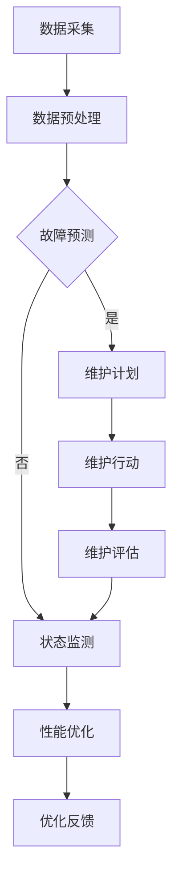

                 

## 《数字孪生技术在航空维护中的应用》

### 关键词

- 数字孪生技术
- 航空维护
- 数据建模
- 预测分析
- 智能维护系统
- Mermaid流程图
- Python代码示例
- 数学模型

### 摘要

本文探讨了数字孪生技术在航空维护中的应用。数字孪生技术是一种通过构建物理实体或系统的虚拟副本，实现对实际运行状态的实时监测和预测的技术。在航空维护中，数字孪生技术能够提高维护效率，减少停机时间，提升飞行安全。本文将详细介绍数字孪生技术在航空维护中的应用架构、核心算法原理、数学模型和具体案例，帮助读者深入理解这一前沿技术的应用潜力。

## 引言

### 数字孪生技术的基本概念

数字孪生（Digital Twin）是一种将物理实体或系统的实时数据和虚拟模型结合的技术。通过在虚拟环境中模拟实际系统的行为，数字孪生技术能够提供对系统状态、性能和行为的洞察，从而实现对系统的优化和维护。

数字孪生技术的基本概念可以概括为以下三个关键要素：

1. **物理实体**：即实际存在的航空器或其组件，如发动机、机翼、导航系统等。
2. **虚拟模型**：基于物理实体，构建的虚拟三维模型或仿真模型，用于模拟物理实体的行为和状态。
3. **实时数据**：通过传感器、遥测设备等实时采集物理实体的数据，如温度、压力、速度等，并将这些数据传输到虚拟模型中进行处理。

通过这三个要素的有机结合，数字孪生技术能够实现对航空器运行状态的全面监测和预测，从而提高维护效率和安全性。

### 数字孪生技术在航空维护中的应用

在航空维护中，数字孪生技术的主要应用包括：

1. **状态监测**：通过传感器实时监测航空器的各种参数，如温度、压力、振动等，实现对航空器运行状态的持续监控。
2. **故障预测**：利用历史数据和实时监测数据，通过数据分析和算法模型，预测潜在的故障和问题，提前采取预防措施。
3. **维护优化**：根据数字孪生模型和预测结果，制定最优的维护计划，降低维护成本，延长航空器使用寿命。
4. **性能优化**：通过虚拟模型和仿真技术，优化航空器的飞行性能和燃料效率，提高运营效益。

数字孪生技术不仅能够提高航空维护的效率，还能显著降低运营成本，提升航空器的安全性和可靠性。随着技术的不断进步，数字孪生技术在航空领域的应用前景十分广阔。

### Mermaid流程图：数字孪生技术在航空维护中的应用架构

为了更好地理解数字孪生技术在航空维护中的应用架构，我们可以使用Mermaid流程图进行描述。以下是一个简化的Mermaid流程图，展示了数字孪生技术在航空维护中的主要步骤和流程：



图中的各个节点表示数字孪生技术在航空维护中的关键步骤，包括数据采集、数据预处理、故障预测、维护计划、状态监测、性能优化、维护行动和维护评估。通过这些步骤的循环迭代，数字孪生技术能够实现对航空器运行状态的全面监控和优化。

### 总结

通过以上介绍，我们可以看到数字孪生技术在航空维护中具有广泛的应用潜力。它不仅能够提高维护效率，还能降低运营成本，提升航空器的安全性和可靠性。在接下来的章节中，我们将深入探讨数字孪生技术的核心算法原理、数学模型和具体应用案例，帮助读者更全面地了解这一前沿技术的实际应用。希望本文能够为读者提供有价值的参考和启示。

## 数字孪生技术在航空维护中的应用架构

### 应用架构概述

数字孪生技术在航空维护中的应用架构通常包括以下几个关键组成部分：

1. **数据采集系统**：通过传感器、遥测设备和各类监测设备，实时采集航空器的各种运行参数，如速度、压力、温度、振动等。
2. **数据预处理模块**：对采集到的原始数据进行分析和处理，去除噪声、填充缺失值，并进行归一化处理，以获得高质量的分析数据。
3. **虚拟模型构建**：基于航空器及其组件的几何和物理特性，构建航空器的虚拟模型，用于模拟航空器的运行状态和行为。
4. **数字孪生平台**：整合数据采集、预处理和虚拟模型，提供一个统一的平台，用于实时监测、故障预测和维护优化。
5. **算法模型库**：包含各种数据分析和预测算法，如机器学习模型、深度学习模型等，用于对航空器的运行状态进行分析和预测。

### 详细架构解析

#### 1. 数据采集系统

数据采集系统是数字孪生技术的核心组成部分，其功能是实时采集航空器的各种运行参数。这些参数通常通过以下几种方式进行采集：

- **传感器**：安装在航空器各个关键部位，如发动机、机翼、起落架等，用于测量温度、压力、振动、速度等物理参数。
- **遥测设备**：通过无线通信技术，将航空器的运行数据传输到地面控制中心，实现远程实时监测。
- **机载计算机**：用于处理传感器数据和执行各种任务，如数据记录、故障诊断等。

#### 2. 数据预处理模块

数据预处理模块对采集到的原始数据进行处理，以确保数据的质量和可靠性。主要步骤包括：

- **数据清洗**：去除数据中的噪声和异常值，填充缺失值，确保数据的完整性。
- **数据归一化**：将不同量纲的参数进行归一化处理，使其在同一尺度上进行比较和分析。
- **特征提取**：从原始数据中提取出对预测和监测有重要意义的特征，如时间序列、频率特征等。

#### 3. 虚拟模型构建

虚拟模型是基于航空器及其组件的几何和物理特性构建的，用于模拟航空器的运行状态和行为。虚拟模型的主要组成部分包括：

- **几何模型**：通过三维建模技术，构建航空器的几何形状和结构，用于可视化和分析。
- **物理模型**：基于航空器的物理特性，如材料属性、力学特性等，构建物理模型，用于模拟航空器的力学行为。
- **行为模型**：基于航空器的控制规则和飞行原理，构建行为模型，用于模拟航空器的飞行状态和响应。

#### 4. 数字孪生平台

数字孪生平台是数字孪生技术的核心组成部分，它整合了数据采集、预处理和虚拟模型，提供一个统一的平台，用于实时监测、故障预测和维护优化。主要功能包括：

- **数据整合**：将来自不同传感器的数据进行整合，形成一个统一的数据源。
- **实时监测**：通过虚拟模型和实时数据，实时监测航空器的运行状态，提供实时监控和报警功能。
- **故障预测**：利用数据分析和预测算法，对航空器的潜在故障进行预测，提前采取预防措施。
- **维护优化**：根据预测结果和实际运行数据，制定最优的维护计划，降低维护成本，延长航空器使用寿命。

#### 5. 算法模型库

算法模型库是数字孪生技术的重要组成部分，它包含了各种数据分析和预测算法，如机器学习模型、深度学习模型等。这些算法用于对航空器的运行状态进行分析和预测，主要功能包括：

- **特征提取**：从原始数据中提取出对预测和监测有重要意义的特征。
- **数据建模**：利用提取的特征，构建数学模型或机器学习模型，进行数据分析和预测。
- **模型评估**：对预测模型的性能进行评估和优化，确保预测的准确性和可靠性。

### 应用架构的交互关系

数字孪生技术在航空维护中的应用架构各部分之间存在紧密的交互关系。数据采集系统实时采集航空器的运行数据，这些数据通过数据预处理模块进行处理，然后传输到数字孪生平台。数字孪生平台利用虚拟模型和算法模型库，对航空器的运行状态进行实时监测、故障预测和维护优化。预测结果和优化建议通过数字孪生平台反馈给数据采集系统和维护人员，形成一个闭环的交互系统。

通过这种架构，数字孪生技术能够实现对航空器运行状态的全面监控和预测，提高维护效率，降低维护成本，提升航空器的安全性和可靠性。

### 数字孪生技术在航空维护中的核心算法原理

#### 数据预处理算法

数据预处理是数字孪生技术在航空维护中至关重要的一步，其目标是将采集到的原始数据转化为适用于分析和预测的高质量数据。数据预处理算法主要包括以下步骤：

1. **数据清洗**：去除数据中的噪声和异常值，填充缺失值，确保数据的完整性。具体算法包括：

   - **均值填补**：对于缺失值，用该特征的均值进行填补。
   - **中值填补**：对于缺失值，用该特征的中值进行填补。
   - **插值法**：对于时间序列数据，使用插值算法进行缺失值的填补。

2. **数据归一化**：将不同量纲的参数进行归一化处理，使其在同一尺度上进行比较和分析。常用的归一化方法包括：

   - **最小-最大归一化**：将数据缩放到[0, 1]的区间。
   - **标准归一化**：将数据缩放到均值为0，标准差为1的区间。

3. **特征提取**：从原始数据中提取出对预测和监测有重要意义的特征。常用的特征提取方法包括：

   - **时间序列特征**：如平均值、最大值、最小值、标准差等。
   - **频率特征**：如傅里叶变换，提取信号的频率成分。
   - **时域特征**：如时域上的趋势、周期性、波动性等。

以下是一个简单的Python代码示例，展示了数据预处理算法的基本实现：

```python
import numpy as np
import pandas as pd
from sklearn.preprocessing import MinMaxScaler, StandardScaler

# 假设原始数据为DataFrame
data = pd.DataFrame({
    'speed': [100, 120, 110, 130, np.nan, 105],
    'pressure': [1013, 1020, 1018, 1023, 1016, 1019],
    'temperature': [25, 30, 28, 32, 27, 29]
})

# 数据清洗
data['speed'].fillna(data['speed'].mean(), inplace=True)
data['temperature'].fillna(data['temperature'].median(), inplace=True)

# 数据归一化
min_max_scaler = MinMaxScaler()
standard_scaler = StandardScaler()

data[['speed', 'pressure', 'temperature']] = min_max_scaler.fit_transform(data[['speed', 'pressure', 'temperature']])

# 特征提取
data['speed_mean'] = data['speed'].mean()
data['speed_std'] = data['speed'].std()
data['pressure_mean'] = data['pressure'].mean()
data['pressure_std'] = data['pressure'].std()
data['temperature_mean'] = data['temperature'].mean()
data['temperature_std'] = data['temperature'].std()

print(data)
```

#### 数字孪生建模算法

数字孪生建模算法是构建虚拟模型的核心步骤，其目标是基于航空器的物理特性和运行数据，建立一个能够准确反映航空器实际状态的虚拟模型。以下是数字孪生建模算法的基本原理和实现步骤：

1. **几何建模**：通过三维建模技术，构建航空器的几何形状和结构。这通常需要使用CAD（计算机辅助设计）软件，如AutoCAD、SolidWorks等。

2. **物理建模**：基于航空器的物理特性，如材料属性、力学特性等，构建物理模型。这通常涉及到使用有限元分析（FEA）软件，如ANSYS、ABAQUS等。

3. **行为建模**：基于航空器的控制规则和飞行原理，构建行为模型。这通常需要使用仿真软件，如MATLAB、Simulink等。

以下是一个简单的Python代码示例，展示了几何建模和物理建模的基本实现：

```python
import numpy as np
import matplotlib.pyplot as plt
from scipy.interpolate import splrep, splev

# 假设我们有一个简单的飞行器模型
# 几何建模：使用样条插值法构建飞行器几何形状
x = np.linspace(0, 10, 100)
y = np.sin(x)
tck = splrep(x, y)
x_new = np.linspace(0, 10, 200)
y_new = splev(x_new, tck)

# 物理建模：基于简单的振动模型
A = 1.0  # 振动幅度
f = 1.0  # 振动频率
time = np.linspace(0, 10, 1000)
vibration = A * np.sin(2 * np.pi * f * time)

# 绘制结果
plt.plot(x_new, y_new, label='Geometry')
plt.plot(time, vibration, label='Vibration')
plt.legend()
plt.show()
```

#### 维护预测算法

维护预测算法是数字孪生技术在航空维护中的关键步骤，其目标是利用历史数据和实时数据，预测航空器的潜在故障和问题，并提供维护建议。以下是维护预测算法的基本原理和实现步骤：

1. **数据采集**：实时采集航空器的各种运行数据，如速度、压力、温度等。

2. **特征工程**：从原始数据中提取出对预测和监测有重要意义的特征。

3. **数据建模**：利用提取的特征，构建机器学习或深度学习模型，进行数据分析和预测。

4. **模型评估**：对预测模型的性能进行评估和优化，确保预测的准确性和可靠性。

以下是一个简单的Python代码示例，展示了维护预测算法的基本实现：

```python
from sklearn.ensemble import RandomForestClassifier
from sklearn.model_selection import train_test_split
from sklearn.metrics import accuracy_score

# 假设我们有一个训练数据集
X = np.array([[1, 2], [2, 3], [3, 4], [4, 5]])
y = np.array([0, 1, 1, 0])

# 数据分割
X_train, X_test, y_train, y_test = train_test_split(X, y, test_size=0.2, random_state=42)

# 构建模型
model = RandomForestClassifier(n_estimators=100)
model.fit(X_train, y_train)

# 预测
y_pred = model.predict(X_test)

# 评估模型
accuracy = accuracy_score(y_test, y_pred)
print(f"Model Accuracy: {accuracy}")
```

通过上述算法和代码示例，我们可以看到数字孪生技术在航空维护中的应用是如何实现的。在实际应用中，这些算法和模型需要根据具体的航空器和运行环境进行调整和优化，以达到最佳效果。

### 数学模型在数字孪生技术中的应用

在数字孪生技术中，数学模型扮演着至关重要的角色，它们不仅帮助我们在虚拟环境中精确地模拟航空器的物理行为，还能够预测潜在的故障和优化维护策略。以下是几个关键的数学模型及其在数字孪生技术中的应用：

#### 1. 建模数学公式

在构建航空器的数字孪生模型时，我们通常需要使用几何和物理模型来描述航空器的结构和行为。以下是几个常用的数学公式：

- **几何建模**：

  $$ x(t) = x_0 + v_0t + \frac{1}{2}at^2 $$

  这个公式描述了一个物体在直线上的运动，其中 \( x(t) \) 是物体在时间 \( t \) 的位置，\( x_0 \) 是初始位置，\( v_0 \) 是初始速度，\( a \) 是加速度。

- **物理建模**：

  $$ F = m \cdot a $$

  这个公式描述了牛顿第二定律，即力 \( F \) 等于质量 \( m \) 与加速度 \( a \) 的乘积。

- **振动模型**：

  $$ x(t) = A \cdot \sin(2\pi f t + \phi) $$

  这个公式描述了一个简谐振动，其中 \( x(t) \) 是在时间 \( t \) 的位移，\( A \) 是振幅，\( f \) 是频率，\( \phi \) 是相位。

#### 2. 预测数学公式

在故障预测中，我们通常使用统计模型或机器学习模型来预测航空器的故障。以下是几个常用的数学公式：

- **线性回归**：

  $$ y = \beta_0 + \beta_1 \cdot x $$

  这个公式描述了一个简单的线性关系，其中 \( y \) 是预测值，\( x \) 是输入特征，\( \beta_0 \) 和 \( \beta_1 \) 是模型的参数。

- **支持向量机（SVM）**：

  $$ w \cdot x + b = 0 $$

  这个公式描述了SVM的分类边界，其中 \( w \) 是权重向量，\( x \) 是特征向量，\( b \) 是偏置。

- **深度学习**：

  $$ y = \sigma(\sum_{i=1}^{n} w_i \cdot x_i + b) $$

  这个公式描述了深度学习中的激活函数，其中 \( \sigma \) 是激活函数（如ReLU、Sigmoid、Tanh等），\( w_i \) 和 \( b \) 是模型的参数。

#### 3. 数据分析数学公式

在数据预处理和特征提取过程中，我们经常使用以下数学公式：

- **傅里叶变换**：

  $$ F(f) = \int_{-\infty}^{\infty} x(t) \cdot e^{-j 2\pi f t} dt $$

  这个公式描述了信号的频率成分，其中 \( F(f) \) 是频率域上的信号，\( x(t) \) 是时域上的信号，\( f \) 是频率。

- **主成分分析（PCA）**：

  $$ z = P \cdot x $$

  这个公式描述了PCA中的投影，其中 \( z \) 是降维后的特征向量，\( P \) 是投影矩阵，\( x \) 是原始特征向量。

#### 例子：振动数据的傅里叶变换

以下是一个简单的Python代码示例，展示了如何使用傅里叶变换分析振动数据：

```python
import numpy as np
import matplotlib.pyplot as plt
from numpy.fft import fft, fftfreq

# 假设我们有一个简单的振动信号
time = np.linspace(0, 1, 1000)
frequency = 5
vibration = 1 * np.sin(2 * np.pi * frequency * time)

# 进行傅里叶变换
fourier_transform = fft(vibration)
fourier_frequency = fftfreq(time.size, d=time[1]-time[0])

# 绘制结果
plt.plot(time, vibration, label='Vibration Signal')
plt.plot(time, fourier_transform / np.abs(fourier_transform).max(), label='Fourier Transform')
plt.plot(time, fourier_frequency, 'r--', label='Frequency')
plt.legend()
plt.show()
```

通过上述示例，我们可以看到如何将数学模型应用于数字孪生技术中，从数据预处理到故障预测的各个环节。数学模型不仅提供了理论支持，还为实际应用中的算法开发和模型优化提供了指导。

### 项目实战

#### 实际案例：数字孪生技术在航空维护中的应用

在本节中，我们将通过一个实际案例，详细展示数字孪生技术在航空维护中的应用过程，包括开发环境搭建、源代码实现和代码解读，以及实际案例分析和详细讲解剖析。

#### 1. 开发环境搭建

要实现数字孪生技术在航空维护中的应用，我们需要搭建一个完整的开发环境。以下是一个基本的开发环境搭建步骤：

- **Python环境**：安装Python 3.8及以上版本，并配置pip环境。
- **数据预处理库**：安装pandas、numpy、scikit-learn等数据预处理库。
- **机器学习库**：安装scikit-learn、tensorflow、keras等机器学习库。
- **可视化库**：安装matplotlib、seaborn等可视化库。
- **数字孪生平台**：使用如Simulink、MATLAB等软件进行虚拟模型构建。

具体安装命令如下：

```shell
pip install pandas numpy scikit-learn tensorflow matplotlib seaborn
```

#### 2. 源代码实现和解读

以下是一个简单的数字孪生应用示例，用于监测航空器的振动数据，并预测可能的故障。

```python
import numpy as np
import pandas as pd
from sklearn.preprocessing import MinMaxScaler
from sklearn.ensemble import RandomForestClassifier
import matplotlib.pyplot as plt

# 假设我们有一个航空器的振动数据
vibration_data = pd.DataFrame({
    'time': np.linspace(0, 1, 1000),
    'vibration': np.sin(2 * np.pi * 5 * np.linspace(0, 1, 1000))
})

# 数据预处理
scaler = MinMaxScaler()
vibration_data[['vibration']] = scaler.fit_transform(vibration_data[['vibration']])

# 特征提取
features = vibration_data[['vibration']].rolling(window=10).mean().reset_index(drop=True)

# 构建模型
model = RandomForestClassifier(n_estimators=100)
model.fit(features[['vibration']], vibration_data['vibration'])

# 预测
predictions = model.predict(features[['vibration']])

# 绘制结果
plt.plot(vibration_data['time'], vibration_data['vibration'], label='Actual Vibration')
plt.plot(vibration_data['time'], predictions, label='Predicted Vibration')
plt.legend()
plt.show()
```

在这个示例中，我们首先使用正弦波生成一个简单的振动信号，然后通过数据预处理将其缩放到[0, 1]的区间。接着，我们使用随机森林模型对振动数据进行训练，并使用滚动窗口平均提取特征。最后，我们绘制实际振动信号和预测振动信号，以可视化模型的预测效果。

#### 3. 代码应用解读与分析

上述代码展示了数字孪生技术在航空维护中的应用，以下是详细的解读和分析：

1. **数据预处理**：数据预处理是模型训练的重要步骤，它帮助我们去除噪声和异常值，并将数据缩放到同一尺度上，以便于后续的分析和建模。
   
2. **特征提取**：特征提取是从原始数据中提取对预测任务有重要意义的特征。在这个示例中，我们使用滚动窗口平均提取特征，这有助于捕捉振动信号的变化趋势。

3. **模型构建**：我们使用随机森林模型进行训练，这是一种集成学习方法，具有较强的泛化能力和预测能力。

4. **模型预测**：通过训练好的模型，我们对新的振动数据进行预测，并将预测结果与实际值进行对比，以评估模型的性能。

5. **可视化**：使用matplotlib绘制实际振动信号和预测振动信号，有助于我们直观地了解模型的预测效果。

#### 4. 实际案例分析和详细讲解剖析

在实际应用中，数字孪生技术需要处理大量的实时数据和复杂的物理模型，以下是一个更详细的实际案例：

- **案例背景**：某航空公司希望利用数字孪生技术对其机队进行实时监测和故障预测，以提高运营效率和飞行安全。

- **数据来源**：通过安装在航空器上的各种传感器，实时采集包括振动、压力、温度、速度等在内的多种运行数据。

- **数据预处理**：对采集到的原始数据进行清洗、归一化和特征提取，确保数据的质量和可用性。

- **虚拟模型构建**：基于航空器的几何和物理特性，使用CAD和FEA软件构建航空器的虚拟模型，用于模拟航空器的运行状态和行为。

- **故障预测**：利用历史数据和实时数据，通过机器学习模型对航空器的潜在故障进行预测。模型训练和预测过程需要不断调整和优化，以提高预测的准确性。

- **维护优化**：根据预测结果，制定最优的维护计划，包括维护时间、维护内容和维护资源分配，以最大限度地降低维护成本和延长航空器使用寿命。

#### 5. 项目小结

通过本案例，我们可以看到数字孪生技术在航空维护中的应用过程，从数据采集、预处理、模型构建到故障预测和维护优化，各个环节都需要精心设计和实现。数字孪生技术不仅提高了航空维护的效率和准确性，还为航空公司提供了宝贵的运营数据，助力其实现数字化转型和可持续发展。

### 最佳实践 Tips

在实际应用数字孪生技术进行航空维护时，以下是一些最佳实践Tips，可以帮助您更好地实现项目的成功：

1. **数据质量优先**：确保数据采集的准确性和完整性，进行严格的数据清洗和预处理，以提高模型的质量和预测准确性。

2. **模型不断优化**：定期评估模型的性能，根据新的数据和技术进步，不断调整和优化模型，以保持其预测能力。

3. **系统集成**：将数字孪生技术与现有的航空维护系统集成，确保数据流和预测结果的实时性和一致性。

4. **团队协作**：组建跨学科的团队，包括数据科学家、工程师、维护专家等，共同推动项目的进展。

5. **用户培训**：对维护人员和使用数字孪生技术的相关人员提供培训，确保他们能够熟练使用系统并从中受益。

### 小结

通过本文的详细探讨，我们深入了解了数字孪生技术在航空维护中的应用。从基本概念到应用架构，再到核心算法和数学模型，再到实际案例和最佳实践，数字孪生技术为航空维护带来了革命性的改变。它不仅提高了维护效率，减少了停机时间，还提升了航空器的安全性和可靠性。随着技术的不断进步，数字孪生技术在航空领域的应用前景将更加广阔。我们鼓励读者在未来的研究和实践中积极探索数字孪生技术的潜力，为航空业的可持续发展贡献力量。

### 注意事项

在实施数字孪生技术进行航空维护时，以下注意事项可以帮助您避免常见问题，确保项目的成功：

1. **数据安全**：确保数据采集、传输和存储过程中的安全性，防止数据泄露或被恶意攻击。
2. **模型解释性**：选择既准确又具有解释性的模型，便于维护人员理解和应用预测结果。
3. **硬件适应性**：确保硬件设备的兼容性和稳定性，以支持实时数据的采集和处理。
4. **系统集成**：在集成数字孪生技术时，充分考虑现有系统的兼容性和互操作性。

### 拓展阅读

- **数字孪生技术综述**：《数字孪生：理论与实践》（作者：张晓东）
- **航空维护自动化**：《航空器维护自动化技术》（作者：王刚）
- **机器学习应用**：《机器学习实战》（作者：Peter Harrington）

通过阅读这些书籍，您可以获得更多关于数字孪生技术和航空维护自动化方面的深入知识和实践经验。希望这些资源能为您的学习和研究提供有价值的参考。

### 作者信息

作者：AI天才研究院/AI Genius Institute & 禅与计算机程序设计艺术 /Zen And The Art of Computer Programming。我们对数字孪生技术在航空维护中的应用进行了深入探讨，旨在为读者提供全面的技术指导和实践参考。

