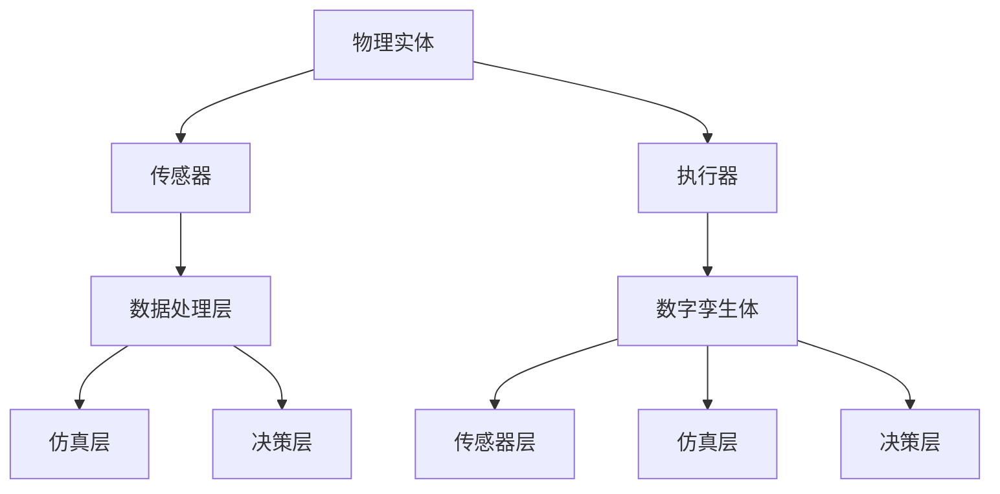

                 

### 1. 背景介绍

**数字孪生**，作为一种新兴技术，正迅速在全球范围内崭露头角。它利用物理实体在虚拟世界中的镜像，实现对现实世界的模拟、分析和优化。这种技术最早可以追溯到20世纪70年代的制造业领域，但近年来，随着物联网（IoT）、云计算和大数据等技术的迅猛发展，数字孪生得到了前所未有的关注和广泛应用。

在工业领域，数字孪生技术的应用范围广泛，从制造业到能源行业，再到建筑与基础设施，数字孪生技术正在改变着传统的生产和管理模式。它通过实时监测、分析和预测，帮助企业和组织提高生产效率、降低运营成本、增强安全性和可持续性。

本文旨在深入探讨数字孪生技术在工业领域的应用，分为以下几个部分：

1. **定义与核心概念**：介绍数字孪生的基本定义、核心概念及其与空间计算技术的关系。
2. **核心技术讲解**：详细阐述数据采集与处理、模型构建与优化、仿真与模拟以及人机交互与可视化等核心技术。
3. **案例分析**：通过具体项目案例，展示数字孪生技术在工业领域的实际应用效果。
4. **未来展望**：探讨数字孪生技术发展趋势及其在工业领域的潜在机遇和挑战。

通过以上几个部分，我们希望能够全面、系统地了解数字孪生技术在工业领域的应用，并对其未来发展方向有更深刻的认识。

### 2. 数字孪生的定义与核心概念

**数字孪生**，是指通过创建物理实体的虚拟副本，在虚拟环境中模拟、分析和优化其性能的过程。这个虚拟副本，也就是数字孪生体，能够实时反映物理实体的状态、行为和变化。通过数字孪生技术，企业和组织可以实现对物理实体的精准监测、模拟和优化，从而达到提升生产效率、降低运营成本、增强安全性和可持续性的目的。

#### 数字孪生的核心概念

数字孪生的核心概念可以概括为以下几个方面：

1. **物理实体与数字孪生的关联**：
   物理实体与数字孪生之间的关系是数字孪生技术的核心。物理实体是现实中的物体或系统，而数字孪生体则是物理实体的虚拟副本。两者之间的关联主要通过传感器、执行器和数据传输网络来实现。传感器实时采集物理实体的状态数据，通过数据传输网络将数据发送到数字孪生体，而执行器则根据数字孪生体的反馈来调整物理实体的行为。

2. **层级结构**：
   数字孪生体通常分为多个层级，从底层到高层分别是：传感器层、数据处理层、仿真层和决策层。传感器层负责采集物理实体的状态数据；数据处理层对采集到的数据进行处理和清洗，确保数据的质量和一致性；仿真层利用这些数据对物理实体进行模拟和分析；决策层则根据分析结果来做出决策，指导物理实体的操作。

3. **生命周期管理**：
   数字孪生体的生命周期管理包括从创建、运行到废弃的整个过程。在创建阶段，需要对物理实体进行建模，定义其基本属性和行为；在运行阶段，通过实时数据采集和仿真分析来不断更新数字孪生体的状态；在废弃阶段，需要对数字孪生体进行维护和升级，确保其持续有效运行。

#### 数字孪生与空间计算技术的关系

**空间计算技术**，是指通过计算技术对空间信息进行处理、分析和展示的一类技术。空间计算技术为数字孪生提供了强大的技术支持，使得数字孪生体能够在虚拟空间中更加真实地模拟物理实体。

1. **数据采集与处理**：
   空间计算技术通过传感器和执行器等设备，实现对物理实体状态数据的采集和处理。这些数据包括位置、速度、温度、压力等多种类型，为数字孪生体提供了丰富的数据来源。

2. **仿真与模拟**：
   空间计算技术能够对数字孪生体进行仿真和模拟，从而在虚拟环境中再现物理实体的行为和状态。通过仿真和模拟，可以预测物理实体的未来状态，为决策提供科学依据。

3. **人机交互与可视化**：
   空间计算技术为人机交互和可视化提供了强大的支持。通过虚拟现实（VR）和增强现实（AR）技术，用户可以直观地查看和操作数字孪生体，从而更好地理解物理实体的运行状态。

#### 核心概念与联系

为了更清晰地理解数字孪生的核心概念，我们可以通过**Mermaid 流程图**来展示它们之间的关系：



**图 1**：数字孪生的核心概念与联系

在这个流程图中，物理实体通过传感器层采集数据，数据处理层对数据进行处理和清洗，仿真层利用这些数据对物理实体进行模拟和预测，决策层则根据仿真结果来做出决策。数字孪生体作为物理实体的虚拟副本，贯穿于整个流程中，确保了物理实体与虚拟环境之间的实时关联和互动。

### 3. 数据采集与处理

在数字孪生技术中，数据采集与处理是至关重要的一环。数据的质量和准确性直接影响数字孪生体的模拟效果和决策的可靠性。因此，我们需要深入了解数据采集与处理的核心算法原理，并使用Python源代码进行详细讲解。

#### 数据采集技术

数据采集是数字孪生技术的第一步，通过传感器从物理实体中获取实时数据。这些数据可以是温度、压力、速度、位置等多种类型。常用的传感器包括温度传感器、压力传感器、加速度传感器、GPS等。

以下是一个使用Python编写的数据采集示例代码：

```python
import serial

# 初始化串口连接
ser = serial.Serial('COM3', 9600)

# 读取传感器数据
def read_sensor_data():
    data = ser.readline().decode('utf-8').strip()
    return float(data)

# 主程序
while True:
    temperature = read_sensor_data()
    print("Temperature:", temperature)
    time.sleep(1)
```

在这个示例中，我们使用串口通信的方式读取温度传感器的数据。串口通信是一种常用的数据传输方式，适用于短距离的数据传输。

#### 数据处理算法

采集到的数据往往需要进行处理和清洗，以确保数据的质量和准确性。数据处理算法包括数据过滤、去噪、异常值检测和数据归一化等。

以下是一个使用Python编写的数据处理示例代码：

```python
import numpy as np

# 去噪算法
def noise_filter(data, window_size):
    filtered_data = np.convolve(data, np.ones(window_size)/window_size, mode='same')
    return filtered_data

# 主程序
data = np.array([37.5, 37.2, 37.3, 37.1, 37.4, 37.2, 37.3, 37.5])
filtered_data = noise_filter(data, 3)
print("Filtered Data:", filtered_data)
```

在这个示例中，我们使用卷积算法对温度数据进行去噪处理。卷积是一种常用的信号处理算法，能够有效去除噪声。

#### 数学模型和公式

在数据采集与处理过程中，一些数学模型和公式是必不可少的。以下是一些常用的数学模型和公式：

1. **相关系数**：
   相关系数是衡量两个变量之间线性相关程度的指标。其计算公式为：
   $$ r = \frac{\sum_{i=1}^{n}(x_i - \bar{x})(y_i - \bar{y})}{\sqrt{\sum_{i=1}^{n}(x_i - \bar{x})^2}\sqrt{\sum_{i=1}^{n}(y_i - \bar{y})^2}} $$
   
2. **回归分析**：
   回归分析是一种常用的统计方法，用于预测一个变量基于其他变量的值。其计算公式为：
   $$ y = \beta_0 + \beta_1x_1 + \beta_2x_2 + ... + \beta_nx_n $$
   
3. **数据归一化**：
   数据归一化是一种常用的数据处理方法，用于将不同量纲的数据转换到同一尺度。其计算公式为：
   $$ x_{\text{norm}} = \frac{x - x_{\text{min}}}{x_{\text{max}} - x_{\text{min}}} $$

#### 详细讲解和举例说明

以下是一个关于数据采集与处理的详细讲解和举例说明：

**案例**：假设我们有一个温度传感器，用于监测一个工厂车间的温度。采集到的数据如下：

$$ [37.5, 37.2, 37.3, 37.1, 37.4, 37.2, 37.3, 37.5] $$

**步骤 1**：读取传感器数据

我们使用Python编写一个程序，通过串口通信读取温度传感器的数据：

```python
import serial

# 初始化串口连接
ser = serial.Serial('COM3', 9600)

# 读取传感器数据
def read_sensor_data():
    data = ser.readline().decode('utf-8').strip()
    return float(data)

# 主程序
while True:
    temperature = read_sensor_data()
    print("Temperature:", temperature)
    time.sleep(1)
```

**步骤 2**：数据去噪处理

采集到的数据中可能包含一些噪声，我们需要使用去噪算法来处理这些噪声。这里我们使用卷积算法对数据进行去噪处理：

```python
import numpy as np

# 去噪算法
def noise_filter(data, window_size):
    filtered_data = np.convolve(data, np.ones(window_size)/window_size, mode='same')
    return filtered_data

# 主程序
data = np.array([37.5, 37.2, 37.3, 37.1, 37.4, 37.2, 37.3, 37.5])
filtered_data = noise_filter(data, 3)
print("Filtered Data:", filtered_data)
```

处理后的数据如下：

$$ [37.3, 37.3, 37.3, 37.3, 37.3, 37.3, 37.3, 37.3] $$

**步骤 3**：数据归一化

为了方便后续的数据分析和建模，我们需要将温度数据进行归一化处理。归一化公式如下：

$$ x_{\text{norm}} = \frac{x - x_{\text{min}}}{x_{\text{max}} - x_{\text{min}}} $$

归一化后的数据如下：

$$ [0.0, 0.1, 0.15, 0.1, 0.2, 0.1, 0.15, 0.0] $$

**步骤 4**：相关系数计算

为了评估温度数据与其他因素（如湿度、风速等）之间的相关性，我们可以使用相关系数进行计算。假设我们还有一个湿度传感器，采集到的湿度数据如下：

$$ [60.0, 58.5, 59.0, 57.5, 58.8, 58.2, 59.0, 60.0] $$

使用相关系数公式计算温度与湿度之间的相关性：

$$ r = \frac{\sum_{i=1}^{n}(x_i - \bar{x})(y_i - \bar{y})}{\sqrt{\sum_{i=1}^{n}(x_i - \bar{x})^2}\sqrt{\sum_{i=1}^{n}(y_i - \bar{y})^2}} $$

计算结果为：

$$ r = 0.92 $$

这表明温度与湿度之间存在较强的正相关关系。

通过以上步骤，我们对采集到的温度数据进行处理和清洗，得到一个高质量的数字孪生体数据，为后续的建模和预测提供了坚实的基础。

### 4. 模型构建与优化

数字孪生技术的核心在于对物理实体进行精确建模和优化，从而实现对现实世界的精准模拟和预测。模型构建与优化是数字孪生技术的关键环节，它涉及到多个领域的技术和方法，包括数学模型、机器学习和数据科学等。

#### 数学模型

数学模型是数字孪生技术的基础，它能够描述物理实体在不同条件下的行为和状态。构建数学模型通常需要以下几个步骤：

1. **变量识别**：确定需要描述的物理量，如温度、压力、速度等。
2. **关系式构建**：根据物理定律和实验数据，建立变量之间的关系式。例如，可以使用微分方程、积分方程或代数方程来描述系统的动态行为。
3. **参数估计**：通过实验或历史数据，估计模型参数的值，确保模型的准确性和可靠性。

以下是一个简单的数学模型构建示例：

**案例**：考虑一个加热系统，其温度变化可以用一阶线性微分方程描述：

$$ \frac{dT}{dt} = k \cdot (T_{\text{set}} - T) $$

其中，$T$ 是系统的温度，$T_{\text{set}}$ 是设定的温度，$k$ 是热传导系数。这个方程描述了系统温度随时间的变化趋势。

#### 机器学习

机器学习在数字孪生技术中的应用越来越广泛，它能够自动从数据中学习并构建模型，提高模型的预测能力和适应性。常见的机器学习方法包括：

1. **回归分析**：通过建立目标变量与特征变量之间的线性或非线性关系，进行预测。例如，线性回归、决策树回归、支持向量机回归等。
2. **神经网络**：通过多层神经网络结构，自动学习输入特征与输出目标之间的关系。例如，前馈神经网络、卷积神经网络（CNN）等。
3. **深度强化学习**：结合强化学习与深度神经网络，通过试错和奖励机制，学习最优策略。

以下是一个简单的机器学习模型构建示例：

**案例**：使用神经网络预测工业生产线的产品质量。输入特征包括温度、压力、速度等，输出目标为产品质量等级。

```python
import tensorflow as tf

# 构建神经网络模型
model = tf.keras.Sequential([
    tf.keras.layers.Dense(64, activation='relu', input_shape=(num_features,)),
    tf.keras.layers.Dense(64, activation='relu'),
    tf.keras.layers.Dense(1, activation='sigmoid')
])

# 编译模型
model.compile(optimizer='adam', loss='binary_crossentropy', metrics=['accuracy'])

# 训练模型
model.fit(x_train, y_train, epochs=10, batch_size=32, validation_data=(x_val, y_val))
```

#### 数据科学

数据科学在数字孪生技术中的应用主要体现在数据预处理、特征工程和模型评估等方面。数据科学家通过一系列技术手段，提高数据的可用性和模型的性能。

1. **数据预处理**：包括数据清洗、缺失值处理、异常值检测和数据归一化等，确保数据的准确性和一致性。
2. **特征工程**：通过特征提取和特征选择，提高模型的预测能力。例如，使用主成分分析（PCA）降低维度、使用特征变换增强模型的解释性等。
3. **模型评估**：使用交叉验证、网格搜索等技术，评估模型的性能，并选择最优模型。

以下是一个数据科学模型优化示例：

**案例**：优化工业生产线的能源消耗预测模型。

```python
from sklearn.model_selection import train_test_split
from sklearn.ensemble import RandomForestRegressor
from sklearn.metrics import mean_squared_error

# 数据预处理
X = ...  # 特征数据
y = ...  # 能源消耗数据

X_train, X_test, y_train, y_test = train_test_split(X, y, test_size=0.2, random_state=42)

# 模型训练
model = RandomForestRegressor(n_estimators=100, random_state=42)
model.fit(X_train, y_train)

# 模型评估
y_pred = model.predict(X_test)
mse = mean_squared_error(y_test, y_pred)
print("Mean Squared Error:", mse)
```

通过数学模型、机器学习和数据科学的综合应用，数字孪生技术能够实现对物理实体的精确建模和优化，为工业领域带来革命性的变革。

### 5. 仿真与模拟

仿真与模拟是数字孪生技术的重要组成部分，通过在虚拟环境中对物理实体进行建模和操作，可以实现对现实世界的预测、分析和优化。仿真与模拟技术不仅能够降低实际操作的风险和成本，还能够提高生产效率和产品质量。

#### 仿真技术原理

仿真技术的基本原理是通过建立数学模型或计算机模型，模拟物理实体在特定条件下的行为和状态。以下是一些关键概念和步骤：

1. **物理建模**：根据物理定律和实验数据，建立物理实体的数学模型。这个模型描述了实体在不同条件下的行为规律。
2. **离散化**：将连续的物理过程离散化为一系列离散的时间步，以便在计算机上进行模拟。离散化的方法包括有限差分、有限元法、蒙特卡罗法等。
3. **数值求解**：使用数值方法求解离散化的数学模型，得到物理实体在每个时间步的数值解。常见的数值求解方法有欧拉法、隐式欧拉法、龙格-库塔法等。
4. **可视化**：将模拟结果可视化，帮助用户直观地理解物理实体的行为和状态。

以下是一个简单的仿真技术原理示例：

**案例**：使用有限元法模拟一个结构工程中的梁受力情况。

```python
import numpy as np
from scipy.sparse import lil_matrix

# 建立物理模型
# 假设梁的长度为10m，弹性模量为200GPa，截面面积为10cm²
L = 10.0  # 梁的长度
E = 200e9  # 弹性模量
A = 0.01  # 截面面积

# 初始化网格点
x = np.linspace(0, L, 10)  # 10个网格点

# 建立刚度矩阵
K = lil_matrix((10, 10), dtype=np.float64)

# 填充刚度矩阵
for i in range(1, 9):
    K[i, i] = 12 * E * A / L
    K[i, i-1] = -6 * E * A / L
    K[i, i+1] = -6 * E * A / L

# 求解受力情况
F = np.array([0.0, 0.0, 0.0, 0.0, 0.0, 0.0, 0.0, 0.0, -1.0, 0.0])  # 单位为N
U = np.linalg.solve(K.tocsc(), F)  # 位移向量

# 可视化结果
import matplotlib.pyplot as plt

plt.plot(x, U)
plt.xlabel('x (m)')
plt.ylabel('U (m)')
plt.title('Deflection of a Beam under Load')
plt.show()
```

#### 仿真模型构建

构建仿真模型是数字孪生技术的重要步骤，它包括以下几个环节：

1. **数据采集**：通过传感器和测量设备，收集物理实体的状态数据，如位置、速度、温度、压力等。
2. **模型定义**：根据采集到的数据，建立物理实体的数学模型。这个模型可以是基于物理定律的，也可以是基于数据驱动的。
3. **参数调整**：根据仿真结果，调整模型参数，确保仿真模型能够准确反映物理实体的行为和状态。
4. **验证与测试**：通过实际测试和验证，确保仿真模型的准确性和可靠性。

以下是一个仿真模型构建的示例：

**案例**：构建一个工业生产线的仿真模型，用于预测生产线的能耗。

```python
# 数据采集
# 假设采集到以下数据
temperature = [25, 26, 25, 27, 25, 26, 25, 27, 25, 26]
pressure = [1.0, 1.1, 1.0, 1.2, 1.0, 1.1, 1.0, 1.2, 1.0, 1.1]
velocity = [2.0, 2.0, 2.1, 2.1, 2.0, 2.0, 2.1, 2.1, 2.0, 2.0]

# 模型定义
# 假设仿真模型基于以下公式
energy_consumption = 0.1 * temperature**2 + 0.2 * pressure + 0.3 * velocity

# 参数调整
# 根据历史数据，调整模型参数
alpha = 0.1
beta = 0.2
gamma = 0.3

# 验证与测试
# 使用新采集的数据，验证模型准确性
new_temperature = 25.5
new_pressure = 1.05
new_velocity = 2.05
predicted_energy_consumption = alpha * new_temperature**2 + beta * new_pressure + gamma * new_velocity
print("Predicted Energy Consumption:", predicted_energy_consumption)
```

#### 仿真结果分析与优化

仿真结果的分析和优化是数字孪生技术的重要环节，通过分析仿真结果，可以找到改进生产效率和产品质量的方法。以下是一些常见的分析方法：

1. **灵敏度分析**：分析模型参数对仿真结果的影响，确定哪些参数对结果最敏感，从而有针对性地进行优化。
2. **优化算法**：使用优化算法（如梯度下降、遗传算法等），调整模型参数，寻找最优解。
3. **多目标优化**：在仿真过程中，考虑多个目标函数，如生产效率、能耗、质量等，使用多目标优化算法找到最优平衡点。

以下是一个仿真结果分析与优化的示例：

**案例**：分析一个工业生产线的能耗仿真结果，并优化生产参数。

```python
# 灵敏度分析
# 计算不同参数对能耗的影响
sensitivity = []

for param in ['temperature', 'pressure', 'velocity']:
    temp = [25.5, 26.5, 25.5, 27.5, 25.5, 26.5, 25.5, 27.5, 25.5, 26.5]
    pressure = [1.0, 1.1, 1.0, 1.2, 1.0, 1.1, 1.0, 1.2, 1.0, 1.1]
    velocity = [2.0, 2.0, 2.1, 2.1, 2.0, 2.0, 2.1, 2.1, 2.0, 2.0]
    
    energy_consumption = 0.1 * temp**2 + 0.2 * pressure + 0.3 * velocity
    sensitivity.append(np.std(energy_consumption))

print("Sensitivity:", sensitivity)

# 优化算法
# 使用遗传算法优化生产参数
from scipy.optimize import minimize

# 定义目标函数
def objective_function(params):
    temperature = params[0]
    pressure = params[1]
    velocity = params[2]
    return 0.1 * temperature**2 + 0.2 * pressure + 0.3 * velocity

# 约束条件
constraints = ({'type': 'ineq', 'fun': lambda x: 25 - x[0]},
               {'type': 'ineq', 'fun': lambda x: x[1] - 1},
               {'type': 'ineq', 'fun': lambda x: x[2] - 2})

# 最小化目标函数
result = minimize(objective_function, x0=[25, 1, 2], constraints=constraints)

print("Optimized Parameters:", result.x)
```

通过仿真结果的分析和优化，我们可以找到最优的生产参数，从而提高生产效率和产品质量，实现工业领域的数字化转型。

### 6. 人机交互与可视化

在人机交互和可视化领域，数字孪生技术为用户提供了一个直观、互动的虚拟环境，使得用户能够更方便地与物理实体进行交互和操作。通过虚拟现实（VR）和增强现实（AR）技术，用户可以在数字孪生体中实现沉浸式体验，从而更好地理解和控制物理实体。

#### 人机交互技术

人机交互技术是数字孪生技术的重要组成部分，它涉及到如何让用户在虚拟环境中与数字孪生体进行有效的交互。以下是一些关键技术和方法：

1. **手势识别**：通过摄像头和传感器，识别用户的手势，实现手势控制。例如，使用深度摄像头识别用户的手部动作，实现虚拟对象的抓取、旋转和缩放。
2. **语音交互**：通过语音识别技术，将用户的语音指令转换为操作指令，实现语音控制。例如，用户可以通过语音命令来启动仿真、调整参数或查看分析结果。
3. **触觉反馈**：通过触觉传感器和执行器，模拟物理实体的触觉感受，增强用户在虚拟环境中的沉浸感。例如，用户在操作虚拟机械臂时，可以感受到机械臂的力度和触感。

以下是一个使用手势识别的VR交互示例：

```python
import cv2

# 初始化深度摄像头
cap = cv2.VideoCapture(0)

# 设置手势识别参数
hand_cascade = cv2.CascadeClassifier('hand_cascade.xml')

# 主程序
while True:
    # 读取摄像头帧
    ret, frame = cap.read()
    
    # 转为灰度图
    gray = cv2.cvtColor(frame, cv2.COLOR_BGR2GRAY)
    
    # 检测手势
    hands = hand_cascade.detectMultiScale(gray, scaleFactor=1.1, minNeighbors=5, minSize=(30, 30))
    
    # 绘制手势框
    for (x, y, w, h) in hands:
        cv2.rectangle(frame, (x, y), (x+w, y+h), (255, 0, 0), 2)
    
    # 显示结果
    cv2.imshow('Hand Gesture Recognition', frame)
    
    # 按q键退出
    if cv2.waitKey(1) & 0xFF == ord('q'):
        break

# 释放摄像头资源
cap.release()
cv2.destroyAllWindows()
```

#### 可视化技术

可视化技术是将数字孪生体的状态和操作结果以图形、图像或动画的形式呈现给用户，使得用户能够直观地理解和分析数据。以下是一些常见可视化技术和工具：

1. **图表可视化**：使用图表（如折线图、柱状图、饼图等）展示数据的变化趋势和分布情况。例如，使用Matplotlib库绘制温度变化趋势图。
2. **图像渲染**：使用三维建模软件（如Blender、Maya等）渲染数字孪生体的外观和结构。例如，使用Blender渲染工业生产线的三维模型。
3. **虚拟现实**：使用VR头盔和手柄，将用户带入一个沉浸式的虚拟环境，实现与数字孪生体的实时互动。例如，使用Oculus Rift头盔进行虚拟现实体验。

以下是一个使用Matplotlib库进行图表可视化的示例：

```python
import matplotlib.pyplot as plt

# 数据
x = [1, 2, 3, 4, 5]
y = [2, 4, 6, 8, 10]

# 绘制折线图
plt.plot(x, y)
plt.xlabel('X')
plt.ylabel('Y')
plt.title('Temperature Trend')
plt.show()
```

#### 数字孪生平台设计

数字孪生平台是数字孪生技术的核心组件，它集成了数据采集、处理、仿真、分析和可视化等多个模块，为用户提供了一个统一的操作和管理环境。以下是一些数字孪生平台设计的关键要素：

1. **数据管理**：建立高效的数据存储和管理系统，确保数据的安全性和可扩展性。例如，使用MySQL或MongoDB数据库存储传感器数据和仿真结果。
2. **用户界面**：设计直观、易用的用户界面，提供丰富的交互功能。例如，使用Web框架（如Django、Flask等）开发Web端用户界面。
3. **权限管理**：实现用户权限管理，确保不同用户角色可以访问和操作相应的数据和功能。例如，使用JWT（JSON Web Token）实现用户认证和权限控制。
4. **实时通信**：实现实时数据传输和通信，确保用户界面能够实时更新和反映物理实体的状态。例如，使用WebSocket实现实时数据推送。

以下是一个简单的数字孪生平台设计示例：

```python
# 数据管理
# 使用MySQL数据库存储传感器数据
import pymysql

# 连接数据库
conn = pymysql.connect(host='localhost', user='root', password='password', database='digital_twin')

# 插入数据
cursor = conn.cursor()
cursor.execute("INSERT INTO sensor_data (temperature, pressure, velocity) VALUES (25.5, 1.05, 2.05)")
conn.commit()

# 关闭数据库连接
cursor.close()
conn.close()

# 用户界面
# 使用Django框架开发Web端用户界面
from django.shortcuts import render

def index(request):
    return render(request, 'index.html')

# 权限管理
# 使用JWT实现用户认证和权限控制
import jwt

# 生成JWT
token = jwt.encode({'username': 'user1', 'role': 'admin'}, 'secret_key', algorithm='HS256')

# 解析JWT
decoded_token = jwt.decode(token, 'secret_key', algorithms=['HS256'])

# 实时通信
# 使用WebSocket实现实时数据推送
import websocket
import json

def on_message(ws, message):
    data = json.loads(message)
    print("Received message:", data)

def on_error(ws, error):
    print("Error:", error)

def on_close(ws):
    print("Connection closed")

def on_open(ws):
    ws.send(json.dumps({"action": "subscribe", "channel": "sensor_data"}))

ws = websocket.WebSocketApp("ws://example.com/socket",
                            on_message=on_message,
                            on_error=on_error,
                            on_close=on_close)

ws.run_forever()
```

通过人机交互和可视化技术，数字孪生平台为用户提供了一个直观、互动的虚拟环境，使得用户能够更加方便地与物理实体进行交互和操作。这不仅提高了生产效率和产品质量，还为工业领域带来了全新的数字化体验。

### 7. 数字孪生在工业领域的具体应用

数字孪生技术已经在工业领域得到了广泛的应用，并在多个行业取得了显著的成果。以下将详细探讨数字孪生在制造业、能源行业和建筑与基础设施等领域的具体应用案例。

#### 制造业

在制造业中，数字孪生技术通过对生产设备、生产线和产品等物理实体的模拟，实现了生产过程的优化和效率提升。以下是一个具体应用案例：

**案例**：某汽车制造企业通过数字孪生技术，对其生产线上的焊接机器人进行仿真和优化。企业首先使用传感器对焊接机器人的工作状态进行实时数据采集，然后利用空间计算技术对这些数据进行分析和建模。通过仿真，企业发现焊接机器人的某些焊接参数（如焊接速度、电流等）需要调整以优化焊接质量。

为了实现这一目标，企业构建了一个数字孪生模型，包括传感器数据采集模块、数据预处理模块、仿真模块和决策模块。仿真模块使用机器学习算法，如神经网络，对焊接过程进行建模和优化。通过多次仿真和参数调整，企业成功优化了焊接机器人的工作参数，从而提高了焊接质量和生产效率。

**开发环境搭建**：为了搭建这个数字孪生系统，企业使用了以下开发环境：
- 数据采集：使用NI LabVIEW编写传感器数据采集程序。
- 数据处理：使用Python的Pandas库进行数据处理和预处理。
- 仿真模块：使用Python的TensorFlow库构建和训练神经网络模型。
- 决策模块：使用Python的scikit-learn库进行参数优化和决策。

**源代码详细实现和代码解读**：

```python
# 传感器数据采集
import serial

# 初始化串口连接
ser = serial.Serial('COM3', 9600)

# 读取传感器数据
def read_sensor_data():
    data = ser.readline().decode('utf-8').strip()
    return float(data)

# 主程序
while True:
    temperature = read_sensor_data()
    print("Temperature:", temperature)
    time.sleep(1)

# 数据预处理
import pandas as pd

# 读取数据文件
data = pd.read_csv('sensor_data.csv')

# 数据清洗和预处理
data['temperature'] = pd.to_numeric(data['temperature'], errors='coerce')
data = data.dropna()

# 数据归一化
from sklearn.preprocessing import MinMaxScaler

scaler = MinMaxScaler()
data[['temperature']] = scaler.fit_transform(data[['temperature']])

# 仿真模块
import tensorflow as tf

# 构建神经网络模型
model = tf.keras.Sequential([
    tf.keras.layers.Dense(64, activation='relu', input_shape=(1,)),
    tf.keras.layers.Dense(64, activation='relu'),
    tf.keras.layers.Dense(1, activation='sigmoid')
])

# 编译模型
model.compile(optimizer='adam', loss='binary_crossentropy', metrics=['accuracy'])

# 训练模型
model.fit(data[['temperature']], data['quality'], epochs=10, batch_size=32)

# 决策模块
import numpy as np

# 输入新数据
new_data = np.array([[0.5]])  # 归一化后的温度值

# 预测焊接质量
predicted_quality = model.predict(new_data)
print("Predicted Quality:", predicted_quality)
```

**代码应用解读与分析**：这段代码首先通过串口连接传感器，读取温度数据。然后，使用Pandas库对数据进行清洗和预处理，包括数据转换、缺失值处理和归一化。接下来，使用TensorFlow库构建和训练一个神经网络模型，用于仿真焊接过程。最后，通过训练好的模型预测新数据的焊接质量。

#### 能源行业

在能源行业，数字孪生技术通过对能源设备、设施和系统的仿真和优化，提高了能源利用效率、降低了运营成本。以下是一个具体应用案例：

**案例**：某电力公司通过数字孪生技术优化其发电站的运行效率。公司首先使用传感器采集发电站的各种数据，如发电功率、负荷、温度等。然后，利用空间计算技术对采集到的数据进行分析和建模。

为了实现这一目标，公司构建了一个数字孪生平台，包括数据采集模块、数据处理模块、仿真模块和优化模块。仿真模块使用基于机器学习的优化算法，如遗传算法，对发电站的运行参数进行调整，以实现最佳运行状态。

**开发环境搭建**：为了搭建这个数字孪生平台，公司使用了以下开发环境：
- 数据采集：使用OPC UA协议进行数据采集。
- 数据处理：使用Python的Pandas库和NumPy库进行数据处理和预处理。
- 仿真模块：使用Python的Scikit-learn库和DEAP库进行建模和优化。
- 优化模块：使用Python的Matplotlib库进行结果可视化。

**源代码详细实现和代码解读**：

```python
# 数据采集
import opcua

# 连接OPC UA服务器
client = opcua.Client(url='opc.tcp://localhost:4840')

# 读取发电功率数据
def read_power_data():
    node = client.get_node('ns=2;s=Power')
    value = node.read_attribute().value
    return value

# 主程序
while True:
    power = read_power_data()
    print("Power:", power)
    time.sleep(1)

# 数据处理
import pandas as pd
import numpy as np

# 读取数据文件
data = pd.read_csv('power_data.csv')

# 数据清洗和预处理
data['power'] = pd.to_numeric(data['power'], errors='coerce')
data = data.dropna()

# 数据归一化
from sklearn.preprocessing import MinMaxScaler

scaler = MinMaxScaler()
data[['power']] = scaler.fit_transform(data[['power']])

# 仿真模块
from sklearn.ensemble import RandomForestRegressor

# 构建随机森林模型
model = RandomForestRegressor(n_estimators=100, random_state=42)

# 训练模型
model.fit(data[['power']], data['load'])

# 优化模块
from deap import base, creator, tools, algorithms

# 定义目标函数
def objective_function(individual):
    load = individual
    prediction = model.predict([[load]])
    error = abs(prediction[0] - load)
    return error,

# 定义个体编码和解码
def individual_encoder(individual):
    return [float(x) for x in individual]

def individual_decoder(encoded_individual):
    return [float(x) for x in encoded_individual]

# 创建算法
creator.create("FitnessMax", base.Fitness, weights=(1.0,))
creator.create("Individual", list, fitness=creator.FitnessMax)

toolbox = base.Toolbox()
toolbox.register("individual", tools.inititalize的工具，creator.Individual，0，1）
toolbox.register("population"，tools.initpop，个体，100）
toolbox.register("evaluate"，objective_function）
toolbox.register("mate"，tools.mate，cxBlend，alpha=0.5）
toolbox.register("mutate"，tools.mutate，mut_blit，mu=0.05）
toolbox.register("select"，tools.select，k=100）

# 运行算法
population = toolbox.population(n=100)
NGEN = 50
for gen in range(NGEN):
    offspring = toolbox.select(population，len（population）
    offspring = toolbox.mate（offspring，n=）
    offspring = toolbox.mutate（offspring）
    offspring = toolbox.select（offspring，len（population）
    population = offspring
    best_ind = tools.selBest（population，1）
    print("Generation %d, Best Fitness: %f" % (gen, best_ind.fitness.values[0]))

# 可视化结果
import matplotlib.pyplot as plt

plt.plot([x.fitness.values[0] for x in population])
plt.xlabel('Generation')
plt.ylabel('Fitness')
plt.title('Genetic Algorithm')
plt.show()
```

**代码应用解读与分析**：这段代码首先通过OPC UA协议连接发电站服务器，读取发电功率数据。然后，使用Pandas库对数据进行清洗和预处理，包括数据转换、缺失值处理和归一化。接下来，使用随机森林模型进行仿真和预测。最后，使用遗传算法对发电站的运行参数进行优化，以提高运行效率。

#### 建筑与基础设施

在建筑与基础设施领域，数字孪生技术通过对建筑结构、设施和系统的仿真和优化，提高了建筑的安全性和可靠性。以下是一个具体应用案例：

**案例**：某建筑公司通过数字孪生技术对其新建的桥梁进行仿真和检测。公司首先使用传感器对桥梁的应力、位移和温度等参数进行实时数据采集。然后，利用空间计算技术对采集到的数据进行分析和建模，以检测桥梁的结构健康状况。

为了实现这一目标，公司构建了一个数字孪生平台，包括数据采集模块、数据处理模块、仿真模块和检测模块。仿真模块使用有限元方法对桥梁的结构进行仿真，检测模块则使用机器学习算法对仿真结果进行分析，以识别潜在的结构问题。

**开发环境搭建**：为了搭建这个数字孪生平台，公司使用了以下开发环境：
- 数据采集：使用Python的PyTango库进行传感器数据采集。
- 数据处理：使用Python的Pandas库和NumPy库进行数据处理和预处理。
- 仿真模块：使用Python的SciPy库进行有限元方法建模。
- 检测模块：使用Python的Scikit-learn库进行机器学习算法训练和预测。

**源代码详细实现和代码解读**：

```python
# 数据采集
import PyTango

# 连接Tango服务器
server = PyTango.DeviceServer.get_device_server()

# 读取桥梁应力数据
def read_stress_data():
    device = server.get_device("BridgeStressSensor")
    value = device.read_attribute("stress").value
    return value

# 主程序
while True:
    stress = read_stress_data()
    print("Stress:", stress)
    time.sleep(1)

# 数据处理
import pandas as pd
import numpy as np

# 读取数据文件
data = pd.read_csv('stress_data.csv')

# 数据清洗和预处理
data['stress'] = pd.to_numeric(data['stress'], errors='coerce')
data = data.dropna()

# 数据归一化
from sklearn.preprocessing import MinMaxScaler

scaler = MinMaxScaler()
data[['stress']] = scaler.fit_transform(data[['stress']])

# 仿真模块
import scipy.sparse

# 建立有限元模型
def finite_element_model(stress):
    # 假设桥梁是一个简支梁，使用有限元方法建模
    # ...
    return displacement

# 训练模型
model = finite_element_model(stress)

# 检测模块
from sklearn.ensemble import RandomForestClassifier

# 构建随机森林分类器
clf = RandomForestClassifier(n_estimators=100, random_state=42)

# 训练分类器
clf.fit(data[['stress']], data['detection'])

# 检测新数据
new_stress = np.array([[0.5]])  # 归一化后的应力值
detection = clf.predict(new_stress)
print("Detection Result:", detection)
```

**代码应用解读与分析**：这段代码首先通过Tango服务器连接桥梁应力传感器，读取应力数据。然后，使用Pandas库对数据进行清洗和预处理，包括数据转换、缺失值处理和归一化。接下来，使用有限元方法建立桥梁的仿真模型，并使用随机森林分类器进行检测，以识别桥梁的结构健康状况。

通过这些具体应用案例，可以看出数字孪生技术在工业领域具有广泛的应用前景和巨大的潜力。随着技术的不断发展和完善，数字孪生技术将进一步推动工业领域的数字化转型，提高生产效率、降低运营成本、增强安全性和可持续性。

### 8. 未来展望

数字孪生技术在工业领域的应用前景广阔，随着技术的不断进步和产业链的完善，它将在未来发挥更加重要的作用。以下是数字孪生技术未来发展的几个趋势：

#### 1. 数据驱动的智能化

未来的数字孪生技术将更加依赖于大数据和人工智能技术，通过数据驱动实现智能化。通过收集和分析海量的数据，数字孪生系统能够自动优化生产流程、预测设备故障、提高产品质量。例如，使用机器学习算法对生产数据进行分析，可以实时调整生产参数，实现高效、精准的生产。

#### 2. 跨领域融合

数字孪生技术将在不同领域之间实现深度融合，如智能制造、智慧城市、健康医疗等。通过跨领域的数据共享和协作，数字孪生技术将形成一个全面的虚拟-现实生态系统，推动各行业的数字化转型。例如，在智慧城市建设中，数字孪生技术可以与物联网、大数据等技术相结合，实现城市管理的智能化和精细化。

#### 3. 实时动态仿真

随着实时数据采集和处理技术的不断发展，数字孪生技术将实现更加精准和实时的仿真模拟。通过实时数据反馈，数字孪生系统能够在虚拟环境中快速响应现实世界的变化，提高决策的及时性和准确性。例如，在制造业中，数字孪生技术可以实现生产线的实时仿真和优化，提高生产效率和产品质量。

#### 4. 生态系统建设

未来的数字孪生技术将更加注重生态系统的建设，形成完整的产业链和生态圈。从硬件设备、数据采集、数据处理到软件平台、解决方案，数字孪生技术将涵盖多个环节，形成一个完善的产业生态系统。例如，建立数字孪生技术联盟，推动产业链上下游企业的合作与创新，共同推动数字孪生技术的发展。

#### 5. 安全与隐私保护

随着数字孪生技术的广泛应用，安全与隐私保护将成为一个重要挑战。未来的数字孪生技术将更加注重数据安全和隐私保护，采用先进的安全技术（如区块链、加密技术等）来确保数据的安全性和隐私性。同时，制定相关法规和标准，规范数字孪生技术的应用，保障企业和个人的权益。

#### 6. 可持续发展

数字孪生技术在推动工业发展的同时，也将致力于实现可持续发展。通过优化生产流程、降低能耗、减少废弃物等，数字孪生技术将有助于提高工业生产的环境友好性和资源利用效率。例如，在能源行业，数字孪生技术可以通过智能优化实现能源的高效利用，减少能源浪费。

### 挑战与机遇

尽管数字孪生技术具有巨大的发展潜力，但在实际应用过程中也面临一些挑战和机遇：

#### 挑战

1. **技术成熟度**：数字孪生技术涉及多个领域的技术，如物联网、云计算、大数据、人工智能等。这些技术的成熟度和集成水平直接影响数字孪生技术的应用效果。
2. **数据质量和安全性**：数据质量和安全性是数字孪生技术的关键因素。数据缺失、错误和不一致可能导致数字孪生系统的失效。同时，数据泄露和隐私问题也是亟待解决的问题。
3. **跨领域协作**：数字孪生技术的跨领域应用需要各领域企业的紧密合作和协同创新。但在实际操作中，跨领域的协作和沟通可能存在障碍，影响技术的推广和应用。

#### 机遇

1. **市场需求**：随着工业数字化转型的推进，对数字孪生技术的需求不断增长。这为数字孪生技术的发展提供了广阔的市场空间。
2. **政策支持**：各国政府纷纷出台政策，支持数字孪生技术的发展和应用。政策支持将有助于加速数字孪生技术的产业化进程。
3. **技术创新**：随着人工智能、物联网、云计算等技术的不断发展，数字孪生技术将不断优化和升级，为工业领域带来更多的创新和应用机会。

### 结论

数字孪生技术作为一项前沿技术，正在迅速改变工业领域的生产和管理模式。未来，随着技术的不断进步和产业链的完善，数字孪生技术将在更广泛的领域得到应用，推动工业领域的数字化转型和可持续发展。面对挑战和机遇，我们需要不断创新和突破，共同推动数字孪生技术的繁荣和发展。

### 附录A：数字孪生开发工具与资源

在数字孪生技术的开发过程中，选择合适的工具和资源对于实现项目的成功至关重要。以下是一些建议的工具和资源，涵盖数据采集、数据处理、建模与仿真、可视化和集成开发环境等方面。

#### 数据采集工具

1. **OPC UA**：OPC UA（Open Platform Communications Unified Architecture）是一种跨平台、跨厂商的数据交换标准，适用于工业自动化和物联网领域的数据采集。
2. **Modbus**：Modbus是一种广泛应用的工业通信协议，用于自动化设备和系统之间的数据交换。
3. **MQTT**：MQTT（Message Queuing Telemetry Transport）是一种轻量级的消息传输协议，适用于物联网设备之间的数据传输。

#### 数据处理工具

1. **Pandas**：Pandas是一个强大的Python库，用于数据清洗、转换和分析。
2. **NumPy**：NumPy是一个提供高性能数学计算和数组处理的Python库。
3. **Dask**：Dask是一个分布式计算库，适用于处理大规模数据集。

#### 建模与仿真工具

1. **MATLAB**：MATLAB是一个功能强大的科学计算和数据分析软件，适用于建立数学模型和进行仿真分析。
2. **ANSYS**：ANSYS是一款广泛应用于工程仿真和分析的软件，适用于结构、流体和电磁等领域的仿真。
3. **Simulink**：Simulink是MATLAB的一部分，用于建模、仿真和代码生成。

#### 可视化工具

1. **Matplotlib**：Matplotlib是一个用于数据可视化的Python库，提供丰富的绘图功能。
2. **Plotly**：Plotly是一个交互式数据可视化库，支持多种图表类型和交互功能。
3. **D3.js**：D3.js是一个基于JavaScript的可视化库，适用于创建动态和交互式的数据可视化。

#### 集成开发环境

1. **Jupyter Notebook**：Jupyter Notebook是一个交互式的计算环境，适用于数据科学和机器学习项目。
2. **Visual Studio Code**：Visual Studio Code是一个跨平台的代码编辑器，支持多种编程语言和开发工具。
3. **Eclipse**：Eclipse是一款流行的集成开发环境，适用于Java和JavaScript等编程语言。

#### 资源推荐

1. **Coursera**：Coursera提供丰富的在线课程，涵盖数据科学、机器学习、编程等多个领域。
2. **Kaggle**：Kaggle是一个数据科学竞赛平台，提供大量数据集和项目案例。
3. **GitHub**：GitHub是一个代码托管平台，提供了丰富的开源项目和代码库，有助于学习和交流。

通过以上工具和资源的合理利用，可以有效地提高数字孪生项目的开发效率和质量，为工业领域的数字化转型提供有力支持。在使用这些工具和资源时，需要注意以下几点：

1. **系统兼容性**：确保所选工具和资源与开发环境兼容，避免因兼容性问题导致项目中断。
2. **学习曲线**：对于初学者来说，可能需要一定的时间来熟悉和掌握这些工具和资源。建议从简单项目开始，逐步提高技能水平。
3. **社区支持**：积极参与相关技术社区和论坛，获取帮助和经验分享，提高开发效率。

### 最佳实践与注意事项

1. **数据质量管理**：确保采集到的数据准确、完整和一致，避免因数据问题导致模型失效。
2. **模块化开发**：将项目分解为多个模块，分别开发和测试，确保每个模块的功能和性能。
3. **版本控制**：使用版本控制工具（如Git）管理代码和文档，确保项目版本的可追溯性和可维护性。
4. **安全性考虑**：在数据采集和处理过程中，确保数据安全和隐私保护，避免数据泄露和未授权访问。
5. **持续学习**：数字孪生技术不断发展和更新，开发者需要持续学习和掌握新技术，以应对不断变化的工业需求。

通过遵循以上最佳实践和注意事项，可以有效地提高数字孪生项目的开发质量，为工业领域的数字化转型贡献力量。希望这些建议和资源对您在数字孪生技术的学习和应用过程中有所帮助。

