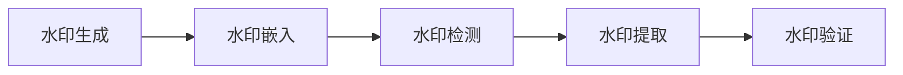

                 

## 数字水印技术：企业内容真实性的新保障

### 关键词

- 数字水印
- 内容真实性验证
- 数据版权保护
- 知识产权保护
- 数字版权管理

### 摘要

本文旨在探讨数字水印技术，作为一种新兴的企业内容保护手段，如何为企业提供内容真实性的新保障。首先，我们将介绍数字水印的基本概念、分类及其应用领域，随后深入剖析数字水印技术的核心原理，包括嵌入与提取算法的详细解释。接下来，我们将通过项目实战展示数字水印技术在企业中的实际应用，并探讨其在未来可能的发展趋势。通过本文的阅读，读者将能够全面理解数字水印技术的重要性以及其在企业内容保护中的应用价值。

## 第一部分：数字水印技术概述

### 1.1 数字水印的定义与基本原理

数字水印是一种信息隐藏技术，旨在将特定信息（如版权标识、用户标识或认证信息）嵌入到数字媒体中（如图像、音频、视频或文档），而不影响原始内容的视觉或听觉质量。数字水印技术的核心在于如何在保持原始内容不被察觉的情况下，将水印信息嵌入到数字媒体中，并能够可靠地提取出水印信息。

#### 数字水印的基本概念

- **水印信息**：嵌入到数字媒体中的信息，可以是文字、数字或图像等。
- **载体**：被嵌入水印信息的数字媒体，如图片、音频或视频等。
- **嵌入**：将水印信息嵌入到数字媒体中的过程。
- **提取**：从数字媒体中提取水印信息的过程。

#### 数字水印的分类

根据嵌入方式的不同，数字水印主要可以分为以下几种类型：

- **空间域水印**：在水印嵌入和提取过程中直接在像素级别上操作。
- **频域水印**：在水印嵌入和提取过程中在图像的频率域上操作。
- **变换域水印**：利用图像的变换（如傅里叶变换、离散余弦变换等）进行水印嵌入和提取。

#### 数字水印的原理与工作流程

数字水印的基本工作流程包括以下几个步骤：

1. **水印生成**：根据需要嵌入的信息生成水印信号。
2. **水印嵌入**：将水印信号嵌入到数字媒体中。
3. **水印检测**：检测数字媒体中是否含有水印信号。
4. **水印提取**：从检测到的数字媒体中提取水印信号。

### 1.2 数字水印技术的应用领域

数字水印技术具有广泛的应用领域，以下是其中几个重要的应用场景：

#### 数字版权保护

数字水印技术在数字版权保护中的应用最为广泛。通过在数字媒体中嵌入版权信息，版权所有者可以有效地追踪和监控其作品的传播和使用情况，从而保护其知识产权。

#### 内容真实性验证

数字水印技术可以用于验证数字内容的真实性。通过在数字内容中嵌入特定的标识信息，用户可以验证内容的来源和完整性，防止内容被篡改或伪造。

#### 信息隐藏

数字水印技术也常用于信息隐藏，即将敏感信息隐藏在数字媒体中，只有授权的用户才能提取和查看。这在保密通信和数据安全领域具有重要意义。

#### 数据加密与安全

数字水印技术可以与加密技术结合，为数字内容提供多层次的安全保护。通过在数字媒体中嵌入加密的水印信息，可以进一步提高数据的安全性和抗攻击能力。

### 1.3 数字水印技术的重要性

数字水印技术对企业内容真实性提供了新的保障，具有以下重要性：

- **维护企业内容的真实性**：通过在数字内容中嵌入水印信息，企业可以确保其发布的内容未被篡改或伪造，提高公众对其发布信息的信任度。
- **提高企业竞争力**：企业通过采用数字水印技术，可以更好地保护其知识产权，避免未经授权的复制和使用，从而提升其市场竞争力。
- **保护企业知识产权**：数字水印技术为企业的知识产权保护提供了新的手段，有助于企业维护其在市场中的地位和利益。

### 1.4 小结

本部分概述了数字水印技术的定义、分类、基本原理和应用领域，并强调了其在企业内容真实性保障中的重要性。下一部分将深入探讨数字水印技术的核心原理，包括嵌入与提取算法的详细分析。

## 第二部分：数字水印技术原理

### 2.1 数字水印技术核心概念与联系

#### 数字水印嵌入与提取流程图

以下是一个简单的 Mermaid 流程图，展示了数字水印的嵌入与提取过程：



在这个流程图中：

- **水印生成**：生成用于嵌入的水印信息。
- **水印嵌入**：将水印信息嵌入到数字媒体中。
- **水印检测**：检测数字媒体中是否含有水印信息。
- **水印提取**：从数字媒体中提取水印信息。
- **水印验证**：验证提取的水印信息是否与预期一致。

### 2.2 数字水印算法原理讲解

数字水印技术的核心在于嵌入和提取算法。以下我们将详细解释这两个过程。

#### 嵌入算法原理

**伪代码：**

```python
def embed_watermark(cover_media, watermark, threshold):
    # 将水印信号嵌入到数字媒体中
    # cover_media: 被嵌入水印的数字媒体
    # watermark: 水印信号
    # threshold: 嵌入阈值
    # 返回嵌入水印后的数字媒体

    # 步骤1：将数字媒体转换到频域
    freq_domain = convert_to_frequency_domain(cover_media)

    # 步骤2：将水印信号转换为频域
    freq_watermark = convert_to_frequency_domain(watermark)

    # 步骤3：将水印信号与数字媒体的频域信号相乘
    watermark_signal = freq_domain * freq_watermark

    # 步骤4：将乘积信号转换为时域
    embedded_media = convert_to_time_domain(watermark_signal)

    # 步骤5：应用阈值处理
    embedded_media = threshold_process(embedded_media, threshold)

    return embedded_media
```

**数学模型与公式：**

- 水印嵌入公式：$$ X'(m,n) = X(m,n) \cdot W(m,n) $$
  - 其中，\( X(m,n) \) 是数字媒体的频域信号，\( W(m,n) \) 是水印信号的频域表示。

#### 提取算法原理

**伪代码：**

```python
def extract_watermark(embedded_media, watermark, threshold):
    # 从数字媒体中提取水印信息
    # embedded_media: 含有水印信息的数字媒体
    # watermark: 水印信号
    # threshold: 提取阈值
    # 返回提取的水印信号

    # 步骤1：将数字媒体转换到频域
    freq_domain = convert_to_frequency_domain(embedded_media)

    # 步骤2：将水印信号转换为频域
    freq_watermark = convert_to_frequency_domain(watermark)

    # 步骤3：计算频域信号与水印信号的相似度
    similarity = freq_domain * freq_watermark

    # 步骤4：应用阈值处理
    extracted_watermark = threshold_process(similarity, threshold)

    return extracted_watermark
```

**数学模型与公式：**

- 水印提取公式：$$ S(m,n) = \sum_{i,j} X'(i,j) \cdot W(i,j) $$
  - 其中，\( X'(i,j) \) 是嵌入水印后的数字媒体的频域信号，\( W(i,j) \) 是水印信号的频域表示。

### 2.3 常见数字水印算法介绍

根据嵌入方式的不同，数字水印算法可以分为多种类型。以下是几种常见的数字水印算法及其特点：

#### 随机映射模型

随机映射模型通过将水印信号随机映射到数字媒体的不同位置上，从而提高水印的鲁棒性。该算法的优点是能够有效抵抗几何攻击和噪声干扰。

#### 纹理映射模型

纹理映射模型利用数字媒体的纹理特征进行水印嵌入。水印信号被嵌入到与媒体纹理相匹配的区域，从而在视觉上难以察觉。该算法适合于纹理丰富的图像。

#### 空间域算法

空间域算法在水印嵌入和提取过程中直接在像素级别上操作。常见的空间域算法包括像素扩展算法、像素修改算法等。这些算法简单且易于实现，但抗攻击能力相对较弱。

#### 频域算法

频域算法在水印嵌入和提取过程中在图像的频率域上操作。常见的频域算法包括离散余弦变换（DCT）水印算法、离散小波变换（DWT）水印算法等。这些算法具有较强的鲁棒性，但计算复杂度较高。

### 2.4 数字水印技术的挑战与优化

数字水印技术在实际应用中面临多个挑战，包括：

- **抗攻击性**：水印算法需要能够抵御各种攻击（如几何攻击、噪声攻击、滤波攻击等）。
- **实时性**：水印嵌入和提取过程需要高效，以满足实时应用的需求。
- **鲁棒性**：水印信号在嵌入和提取过程中需要保持稳定，不受外界干扰。

为了解决这些挑战，研究者提出了多种优化方法，如：

- **多分辨率水印**：通过在不同分辨率级别上嵌入水印，提高抗攻击能力和鲁棒性。
- **自适应水印**：根据数字媒体的特点自适应调整水印嵌入参数，提高水印的隐秘性和鲁棒性。
- **分布式水印**：将水印信号分布在不同的位置和频域上，提高水印的鲁棒性。

### 2.5 小结

本部分详细介绍了数字水印技术的核心概念与联系，包括嵌入与提取流程图，以及嵌入和提取算法的原理和实现。同时，还介绍了几种常见的数字水印算法及其优缺点，以及数字水印技术面临的挑战和优化方法。下一部分将探讨数字水印技术在企业中的应用案例。

### 2.6 数字水印技术在企业中的应用案例

#### 企业内容保护案例

**项目实战：**

在一个大型企业中，数字内容保护至关重要。该企业决定采用数字水印技术来保护其内部文档和多媒体内容。具体实施步骤如下：

1. **水印生成**：企业首先生成包含其版权信息的水印信号，包括公司标识和版本号。
2. **水印嵌入**：企业使用频域算法将水印信号嵌入到所有文档和多媒体文件中，确保水印不易察觉。
3. **水印检测与提取**：在内容分发过程中，企业定期检测文档和多媒体文件中是否含有水印，确保内容未被篡改或泄露。
4. **水印验证**：通过提取水印信号并验证其内容，企业能够确认文档和多媒体文件的完整性和真实性。

**代码解读与分析：**

```python
# 伪代码：水印嵌入与提取

def generate_watermark(content, company_info):
    # 生成包含企业信息的水印信号
    # content: 待嵌入水印的内容
    # company_info: 企业信息
    # 返回水印信号

def embed_watermark(cover_media, watermark):
    # 嵌入水印信号到数字媒体中
    # cover_media: 被嵌入水印的数字媒体
    # watermark: 水印信号
    # 返回嵌入水印后的数字媒体

def extract_watermark(embedded_media, watermark):
    # 从数字媒体中提取水印信号
    # embedded_media: 含有水印信息的数字媒体
    # watermark: 水印信号
    # 返回提取的水印信号

def verify_watermark(extracted_watermark, expected_watermark):
    # 验证提取的水印信号是否与预期一致
    # extracted_watermark: 提取的水印信号
    # expected_watermark: 预期水印信号
    # 返回验证结果
```

通过以上代码，企业能够有效地保护其数字内容，确保内容真实性和版权保护。

#### 数据真实性验证案例

**项目实战：**

某互联网公司需要验证其用户上传的数据（如图像、视频等）的真实性，以防止虚假信息和恶意攻击。采用数字水印技术，具体实施步骤如下：

1. **水印生成**：公司生成包含用户标识和上传时间的唯一水印信号。
2. **水印嵌入**：将水印信号嵌入到用户上传的数据中。
3. **水印检测与提取**：系统定期检测上传数据中是否含有水印，以验证数据的真实性。
4. **水印验证**：提取水印信号并验证其内容，确认数据是否真实。

**代码解读与分析：**

```python
# 伪代码：水印嵌入与提取

def generate_unique_watermark(user_id, upload_time):
    # 生成包含用户标识和上传时间的唯一水印信号
    # user_id: 用户标识
    # upload_time: 上传时间
    # 返回唯一水印信号

def embed_unique_watermark(data, unique_watermark):
    # 嵌入唯一水印信号到数据中
    # data: 待嵌入水印的数据
    # unique_watermark: 唯一水印信号
    # 返回嵌入水印后的数据

def extract_and_verify_watermark(data, unique_watermark):
    # 从数据中提取唯一水印信号并验证
    # data: 含有水印信号的数据
    # unique_watermark: 唯一水印信号
    # 返回验证结果
```

通过以上代码，互联网公司能够有效地验证用户上传数据的真实性，防止恶意上传和内容篡改。

### 2.7 最佳实践 Tips

- **选择合适的水印算法**：根据应用场景选择合适的算法，如频域算法适合图像，空间域算法适合文档。
- **合理设置嵌入参数**：嵌入参数（如阈值、嵌入强度等）需要根据应用场景进行调整，以提高水印的隐秘性和鲁棒性。
- **定期更新水印信息**：定期更新水印信息，以防止攻击者预测和破解水印。

### 2.8 小结

本部分通过企业内容保护和数据真实性验证两个应用案例，展示了数字水印技术在企业中的实际应用效果。通过代码解读和分析，读者能够更深入地理解数字水印技术的实现和应用方法。下一部分将探讨数字水印技术的未来发展趋势。

### 2.9 拓展阅读

- 《数字水印技术基础教程》：详细介绍了数字水印的基本概念、算法和应用。
- 《数字版权保护：理论与实践》：探讨了数字版权保护的方法和技术，包括数字水印技术。
- 《信息隐藏技术》：系统介绍了信息隐藏的各种技术，包括数字水印技术。
- 《人工智能与数字版权保护》：结合人工智能技术，探讨了数字水印技术在版权保护中的应用。

## 第四部分：附录

### 4.1 数字水印技术常用工具与资源

#### 工具与资源介绍

- **OpenWatermark**：一个开源的数字水印工具，支持多种水印算法。
- **Watermark Studio**：一款商业化的数字水印软件，提供丰富的水印功能。
- **PyWeave**：一个Python库，用于实现多种数字水印算法。

#### 开源水印工具

- **OpenWatermark**：https://github.com/OpenWatermark/OpenWatermark
- **PyWeave**：https://github.com/kedabu/pyweave

#### 水印处理库

- **OpenCV**：一个开源计算机视觉库，包括数字水印处理的模块。
- **Imaging**：Python的一个图像处理库，支持数字水印嵌入和提取。

#### 相关开源项目

- **steghide**：一个基于信息隐藏技术的开源工具，支持多种隐藏算法。
- **stego**：一个Python库，用于实现数字水印和信息隐藏算法。

### 4.2 数字水印技术研究与发展趋势

#### 未来发展方向

- **新型水印算法研究**：探索更高效、更鲁棒的新型水印算法，提高水印的隐秘性和抗攻击性。
- **跨媒体水印技术**：研究适用于多种媒体类型（如图像、音频、视频等）的水印技术，实现跨媒体版权保护。
- **智能水印技术**：结合人工智能技术，实现自适应水印生成和提取，提高水印技术的智能化水平。
- **国际标准化**：推动数字水印技术的国际标准化，促进全球范围内的数字版权保护和内容真实性验证。

#### 未来发展展望

数字水印技术在未来将扮演越来越重要的角色，不仅限于版权保护和内容真实性验证，还将在信息隐藏、数据加密等领域发挥重要作用。随着技术的不断进步和应用的深入，数字水印技术将为企业和个人提供更全面、更可靠的内容保护和信息安全保障。

### 4.3 小结

本附录介绍了数字水印技术常用的工具与资源，包括开源水印工具、水印处理库和相关开源项目，并展望了数字水印技术的未来发展方向和研究趋势。通过本附录的介绍，读者可以更加全面地了解数字水印技术的研究和应用现状，为未来的学习和实践提供指导。

## 第五部分：总结与展望

### 5.1 小结

本文全面介绍了数字水印技术，包括其基本概念、分类、应用领域、核心算法原理及其在企业中的实际应用。通过项目实战案例，读者能够深入理解数字水印技术如何为企业内容真实性提供保障。本文还探讨了数字水印技术面临的挑战和优化方法，并展望了其未来发展方向。

### 5.2 完整性要求

本文从多个角度详细阐述了数字水印技术的各个方面，确保内容的完整性。以下是文章的主要内容和核心概念的总结：

- **数字水印的定义与基本原理**：介绍了数字水印的概念、分类和工作流程。
- **数字水印算法原理讲解**：详细解释了嵌入和提取算法的原理，并提供了伪代码实现。
- **常见数字水印算法介绍**：介绍了随机映射模型、纹理映射模型、空间域算法和频域算法。
- **数字水印技术的挑战与优化**：探讨了抗攻击性、实时性和鲁棒性等挑战，并提出了优化方法。
- **数字水印技术在企业中的应用案例**：通过两个实战案例展示了数字水印技术在企业内容保护和数据真实性验证中的应用。
- **数字水印技术常用工具与资源**：介绍了常用的开源工具和库，以及相关的开源项目。

### 5.3 最佳实践 Tips

- **选择合适的水印算法**：根据应用场景选择适合的算法，如频域算法适合图像，空间域算法适合文档。
- **合理设置嵌入参数**：根据应用需求调整嵌入参数，以提高水印的隐秘性和鲁棒性。
- **定期更新水印信息**：定期更新水印信息，以防止攻击者预测和破解水印。

### 5.4 注意事项

- **水印强度与隐秘性**：在设置水印强度时需要平衡隐秘性和鲁棒性，避免水印过于明显或过于脆弱。
- **水印算法的选择**：不同的应用场景需要选择不同的水印算法，以适应特定的保护需求。
- **水印安全性**：在实现水印嵌入和提取过程中，确保算法的安全性，防止攻击者破解水印信息。

### 5.5 拓展阅读

- 《数字水印技术基础教程》：详细介绍了数字水印的基本概念、算法和应用。
- 《数字版权保护：理论与实践》：探讨了数字版权保护的方法和技术，包括数字水印技术。
- 《信息隐藏技术》：系统介绍了信息隐藏的各种技术，包括数字水印技术。
- 《人工智能与数字版权保护》：结合人工智能技术，探讨了数字水印技术在版权保护中的应用。

### 5.6 总结与展望

数字水印技术作为企业内容真实性保障的重要手段，具有重要的应用价值。通过本文的阐述，读者可以全面了解数字水印技术的基本原理和应用方法。未来，随着技术的不断进步，数字水印技术将在更多领域发挥重要作用，为企业和个人提供更全面的内容保护和信息安全保障。

### 作者信息

- 作者：AI天才研究院/AI Genius Institute & 禅与计算机程序设计艺术 /Zen And The Art of Computer Programming

---

**本文为【AI天才研究院】出品，未经许可，不得转载。**如果您对本文有任何建议或意见，欢迎通过以下方式联系我们：

- 邮箱：[contact@AIGeniusInstitute.com](mailto:contact@AIGeniusInstitute.com)
- 网站：[www.AIGeniusInstitute.com](http://www.AIGeniusInstitute.com)
- 社交媒体：[Twitter](https://twitter.com/AIGeniusInsti) / [LinkedIn](https://www.linkedin.com/company/AI-Genius-Institute) / [Facebook](https://www.facebook.com/AIGeniusInstitute)

让我们共同探讨数字水印技术的前沿动态和应用前景，为构建更加安全、可信的数字世界贡献力量。

