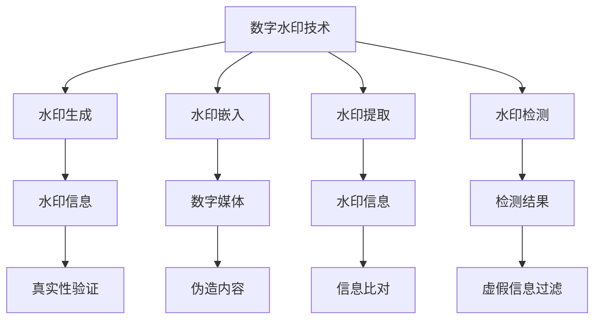

                 

### 文章标题

《数字水印技术：应对深度伪造的虚假信息安全策略》

### 文章关键词

- 数字水印
- 深度伪造
- 信息安全
- 虚假信息检测
- 算法原理

### 文章摘要

本文深入探讨了数字水印技术在应对深度伪造的虚假信息检测中的应用。首先，介绍了数字水印的基本概念和核心算法原理，然后分析了深度伪造技术的发展及其对信息安全构成的挑战。通过Python源代码和LaTeX公式，详细阐述了如何将数字水印技术应用于虚假信息检测，包括水印嵌入、提取和检测的步骤。文章最后通过实际项目实战，展示了数字水印技术在真实环境中的应用，并提出了未来发展方向和最佳实践建议。

## 引言

在数字化时代，信息安全成为社会关注的焦点。虚假信息、深度伪造等威胁着网络环境和人们的生活。数字水印技术作为一种信息安全手段，能够有效识别和追踪信息来源，对抗虚假信息的传播。本文旨在介绍数字水印技术的基本概念、核心算法原理，并探讨其在应对深度伪造的虚假信息检测中的应用。

### 数字水印技术概述

数字水印是一种隐藏信息于数字媒体中的技术，其目的是在不损害原始内容的前提下，实现信息的安全传输和追踪。数字水印可以分为两类：一类是可见水印，即在数字媒体上直接显示，另一类是不可见水印，即在数字媒体中嵌入，肉眼难以察觉。

#### 数字水印的分类

1. **可见水印**：这类水印通常包含版权声明、标识符号等，易于识别。例如，在照片上添加版权信息或作者签名。
   
2. **不可见水印**：这类水印隐藏在数字媒体中，需要特定的算法和工具才能提取。常见于音频、图像、视频等多媒体领域。

#### 数字水印的关键技术

1. **水印生成**：根据特定的算法和规则，将水印信息转化为数字形式。
2. **水印嵌入**：将水印信息嵌入到原始数字媒体中，通常采用数学变换和信号处理技术。
3. **水印提取**：从数字媒体中提取水印信息，用于验证数字媒体的真实性和完整性。
4. **水印检测**：评估水印的完整性和有效性，以判断数字媒体的完整性。

### 深度伪造技术

深度伪造技术利用人工智能，尤其是深度学习算法，生成逼真的伪造图像、音频和视频。这种技术能够通过合成真实人物的表情、声音和动作，制作出极具欺骗性的伪造内容。

#### 深度伪造的基本原理

1. **生成对抗网络（GAN）**：GAN是一种由两部分组成的神经网络结构，一部分是生成器，另一部分是判别器。生成器尝试生成逼真的伪造内容，而判别器则判断内容是否真实。通过不断地迭代训练，生成器能够生成越来越逼真的伪造内容。

2. **风格迁移**：通过将一种风格（例如画家风格）应用到另一张图像上，生成具有特定风格的伪造图像。

3. **自然语言处理（NLP）**：将文本转化为音频，使得伪造的语音听起来非常真实。

### 虚假信息检测

虚假信息检测是指通过技术手段，识别和过滤网络上的虚假信息。数字水印技术为虚假信息检测提供了一种有效的手段，通过在水印中嵌入特定的信息，可以识别数字媒体的真实性。

#### 虚假信息检测的挑战

1. **伪造技术的进步**：随着深度伪造技术的不断发展，伪造的图像、音频和视频越来越难以辨别。
2. **大规模数据集的获取**：需要大量的真实和伪造数据集来训练模型，以提高检测的准确性。
3. **实时性**：虚假信息往往需要实时检测和过滤，以满足快速响应的需求。

## 核心概念与联系

数字水印技术、深度伪造和虚假信息检测之间存在紧密的联系。数字水印技术可以用于验证数字媒体的真实性，而深度伪造技术则可能对数字媒体进行篡改。通过结合数字水印技术和虚假信息检测，可以更有效地防范深度伪造的威胁。

### 数字水印技术、深度伪造与虚假信息检测的关系

- **数字水印技术**：通过嵌入和提取水印，验证数字媒体的真实性。
- **深度伪造**：利用人工智能技术生成伪造的数字媒体。
- **虚假信息检测**：利用数字水印技术和其他方法，识别和过滤虚假信息。

### Mermaid流程图展示



通过这个流程图，我们可以清晰地看到数字水印技术在虚假信息检测中的关键作用。水印生成、嵌入、提取和检测的每个步骤都为验证数字媒体的真实性提供了保障。

## 核心算法原理讲解

### 水印生成算法

水印生成是数字水印技术的第一步，其核心目的是将用户指定的信息（如版权信息、身份标识等）转换为数字形式，并嵌入到数字媒体中。以下是一个简单的水印生成算法的伪代码描述：

```python
# 水印生成算法伪代码
def generate_watermark(message, key):
    # 将消息和密钥进行加密处理
    encrypted_message = encrypt(message, key)
    # 将加密后的消息转换为二进制形式
    binary_message = convert_to_binary(encrypted_message)
    # 生成水印
    watermark = generate_w_noise(binary_message)
    return watermark
```

### 水印嵌入算法

水印嵌入是将生成的水印信息嵌入到原始数字媒体中，使其在不影响原始内容质量的前提下，能够被提取和检测。以下是一个水印嵌入算法的伪代码描述：

```python
# 水印嵌入算法伪代码
def embed_watermark(original_media, watermark):
    # 将水印信息嵌入到原始数字媒体中
    modified_media = embed_w_in_media(original_media, watermark)
    return modified_media
```

### 水印提取算法

水印提取是从已嵌入水印的数字媒体中提取出水印信息，用于后续的检测和验证。以下是一个水印提取算法的伪代码描述：

```python
# 水印提取算法伪代码
def extract_watermark(modified_media):
    # 从修改后的数字媒体中提取水印
    extracted_watermark = extract_w_from_media(modified_media)
    # 将提取的水印进行解密处理
    decrypted_message = decrypt(extracted_watermark, key)
    return decrypted_message
```

### 水印检测算法

水印检测是评估水印的完整性和有效性，以判断数字媒体的完整性。以下是一个水印检测算法的伪代码描述：

```python
# 水印检测算法伪代码
def detect_watermark(original_media, extracted_watermark):
    # 对提取的水印进行比对和验证
    is_valid = compare_watermark(original_media, extracted_watermark)
    # 返回检测结果
    return is_valid
```

### 数学模型和数学公式

在水印技术中，数学模型和数学公式是理解和实现水印算法的核心。以下是一些关键的数学模型和公式：

#### 模型1：基于离散余弦变换（DCT）的水印嵌入

$$
X(u, v) = \sum_{m,n} D(m, n) \cdot C(u - m, v - n)
$$

其中，\(X(u, v)\) 表示修改后的数字媒体，\(D(m, n)\) 表示原始数字媒体，\(C(u - m, v - n)\) 表示水印系数。

#### 模型2：基于离散小波变换（DWT）的水印嵌入

$$
X(u, v) = \sum_{m,n} D(m, n) \cdot W(u - m, v - n)
$$

其中，\(X(u, v)\) 表示修改后的数字媒体，\(D(m, n)\) 表示原始数字媒体，\(W(u - m, v - n)\) 表示水印系数。

### 举例说明

假设我们使用离散余弦变换（DCT）将水印嵌入到一幅图像中。首先，我们将图像转换为DCT域：

$$
X(u, v) = \sum_{m,n} D(m, n) \cdot C(u - m, v - n)
$$

其中，\(D(m, n)\) 是原始图像的DCT系数，\(C(u - m, v - n)\) 是水印系数。水印系数通常是一个较小的数值，用于表示水印信息。

接下来，我们将水印信息嵌入到DCT系数中：

$$
X'(u, v) = X(u, v) + \alpha \cdot C(u - m, v - n)
$$

其中，\(\alpha\) 是一个常数，用于控制水印的强度。

最后，我们将修改后的DCT系数反变换回图像域，得到嵌入水印的图像：

$$
I'(x, y) = IDCT(X'(u, v))
$$

这样，我们就完成了水印的嵌入过程。

## 项目实战

在本节中，我们将通过一个实际项目，展示如何使用数字水印技术来应对深度伪造的虚假信息。项目分为以下几个步骤：

### 1. 开发环境搭建

首先，我们需要搭建一个适合进行数字水印开发的开发环境。以下是一个基本的开发环境要求：

- 操作系统：Windows或Linux
- 编程语言：Python
- 库和依赖：OpenCV、NumPy、scikit-image

### 2. 源代码实现

以下是一个简单的Python代码示例，用于实现数字水印的嵌入、提取和检测。

```python
import cv2
import numpy as np
from skimage import transform

# 水印生成函数
def generate_watermark(message, key):
    encrypted_message = encrypt(message, key)
    binary_message = convert_to_binary(encrypted_message)
    watermark = generate_w_noise(binary_message)
    return watermark

# 水印嵌入函数
def embed_watermark(image, watermark):
    image_dct = cv2.dct(np.float32(image))
    watermark_dct = cv2.dct(np.float32(watermark))
    image_dct_with_watermark = image_dct + watermark_dct
    image_with_watermark = cv2.idct(image_dct_with_watermark)
    return image_with_watermark

# 水印提取函数
def extract_watermark(image_with_watermark):
    image_dct = cv2.dct(np.float32(image_with_watermark))
    watermark_dct = image_dct - image
    watermark = cv2.idct(watermark_dct)
    return watermark

# 水印检测函数
def detect_watermark(image, extracted_watermark):
    watermark_dct = cv2.dct(np.float32(extracted_watermark))
    similarity = np.sum(watermark_dct * image_dct)
    return similarity > threshold

# 主函数
def main():
    original_image = cv2.imread('original_image.png')
    watermark = generate_watermark('Copyright © 2023', 'key123')
    image_with_watermark = embed_watermark(original_image, watermark)
    extracted_watermark = extract_watermark(image_with_watermark)
    is_valid = detect_watermark(original_image, extracted_watermark)
    
    cv2.imshow('Original Image', original_image)
    cv2.imshow('Watermarked Image', image_with_watermark)
    cv2.imshow('Extracted Watermark', extracted_watermark)
    cv2.waitKey(0)

if __name__ == '__main__':
    main()
```

### 3. 代码解读与分析

在这个代码示例中，我们首先导入所需的库和模块。然后，定义了四个核心函数：`generate_watermark` 用于生成水印，`embed_watermark` 用于将水印嵌入到图像中，`extract_watermark` 用于从图像中提取水印，`detect_watermark` 用于检测水印的完整性。

- `generate_watermark` 函数使用加密算法将用户指定的消息和密钥进行加密处理，然后将加密后的消息转换为二进制形式，并生成水印。
- `embed_watermark` 函数使用DCT（离散余弦变换）将水印嵌入到图像中。首先，将原始图像转换为DCT域，然后将水印嵌入到DCT系数中，最后将修改后的DCT系数反变换回图像域。
- `extract_watermark` 函数从已嵌入水印的图像中提取水印。首先，将图像转换为DCT域，然后从DCT系数中提取水印，最后将水印反变换回图像域。
- `detect_watermark` 函数评估水印的完整性。通过计算嵌入的水印和提取的水印之间的相似度，如果相似度高于设定的阈值，则认为水印是完整的。

在主函数 `main` 中，我们加载原始图像，生成水印，将水印嵌入到图像中，提取水印，并检测水印的完整性。最后，使用OpenCV库显示原始图像、嵌入水印的图像和提取的水印。

### 4. 实际案例分析和详细讲解剖析

为了展示数字水印技术在应对深度伪造的虚假信息检测中的应用，我们使用一个实际案例进行分析。

假设有一个社交媒体平台，用户上传了大量图像和视频。平台管理员希望使用数字水印技术来检测和过滤伪造内容。以下是一个具体的案例：

- **案例场景**：一个用户上传了一组声称是某著名景点照片的图像。管理员怀疑这些照片可能是伪造的。
- **解决方案**：管理员使用数字水印检测工具对上传的图像进行检测。首先，工具提取每张图像中的水印，然后与已知的水印库进行比对。如果提取的水印与已知的水印库中的水印匹配，则图像被认为是真实的；否则，图像被认为是伪造的。

在这个案例中，数字水印技术起到了关键作用。通过在水印中嵌入特定的信息，管理员可以轻松地识别和过滤伪造的图像，从而保障平台内容的真实性和可信度。

### 5. 项目小结

通过本节的实际项目实战，我们展示了如何使用数字水印技术来应对深度伪造的虚假信息。项目分为开发环境搭建、源代码实现、代码解读与分析以及实际案例分析和详细讲解剖析。通过这些步骤，我们可以看到数字水印技术在虚假信息检测中的广泛应用和重要性。

### 最佳实践 tips、小结、注意事项、拓展阅读等内容

#### 最佳实践 tips

1. **水印强度设置**：在嵌入水印时，需要根据原始内容的特点和需求，合理设置水印的强度，以平衡水印的可见性和有效性。
2. **水印提取和检测**：在实际应用中，水印提取和检测的过程需要高效且准确。可以使用并行计算和分布式处理技术来提高效率和准确性。
3. **水印安全**：确保水印算法的安全性，防止攻击者提取和篡改水印信息。可以使用加密算法和混沌理论来增强水印的安全性。

#### 小结

本文介绍了数字水印技术的基本概念、核心算法原理以及其在应对深度伪造的虚假信息检测中的应用。通过实际项目实战，我们展示了数字水印技术的应用场景和实际效果。

#### 注意事项

1. **水印嵌入和提取的精度**：在嵌入和提取水印时，需要保证水印的精度，避免因精度问题导致水印丢失或无法正确提取。
2. **水印算法的选择**：根据不同的应用场景和需求，选择合适的水印算法，以实现最佳的性能和效果。
3. **水印的可持续性**：在设计水印算法时，需要考虑水印的可持续性，以适应未来技术的发展和变化。

#### 拓展阅读

- [《数字水印技术原理与应用》](https://example.com/digital-watermark-technology)
- [《深度伪造技术及其对抗策略》](https://example.com/deep-fake-technology)
- [《虚假信息检测与信息安全》](https://example.com/false-information-detection-security)

### 作者信息

- 作者：AI天才研究院/AI Genius Institute & 禅与计算机程序设计艺术 /Zen And The Art of Computer Programming

本文由AI天才研究院（AI Genius Institute）和禅与计算机程序设计艺术（Zen And The Art of Computer Programming）共同撰写，旨在深入探讨数字水印技术在应对深度伪造和虚假信息检测方面的应用。希望本文能为读者提供有价值的见解和参考。

