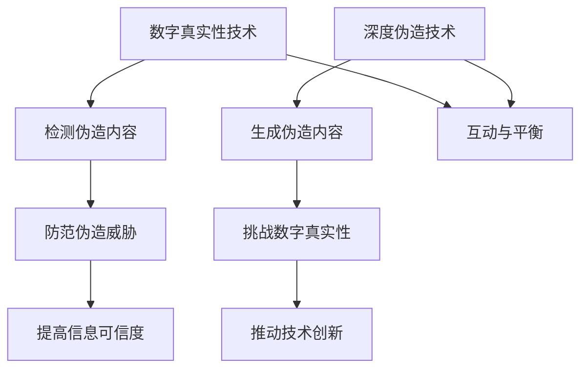

                 

### 背景介绍

在当今数字化时代，信息技术的飞速发展为我们带来了前所未有的便利，但也引发了一系列新的挑战。尤其是深度伪造技术的崛起，让伪造信息、视频、音频等变得前所未有的简单和真实。深度伪造技术，又称生成对抗网络（GANs）或深度伪造（Deepfake），利用人工智能算法生成高度逼真的伪造内容，使得现实与虚构之间的界限变得模糊。

对于企业来说，深度伪造技术的威胁主要体现在以下几个方面。首先，伪造内容可能会损害企业的声誉。例如，伪造的负面评论、虚假的新闻报道或伪造的客户反馈，都会对企业的公众形象造成严重伤害。其次，深度伪造技术可能被用于商业间谍活动，通过伪造的会议记录、合同或文件，获取企业的商业机密。此外，员工身份被冒用进行欺诈活动，也可能会导致财务损失和法律纠纷。

数字真实性，指的是在数字环境中确保信息的真实性、可靠性和可信度。在深度伪造技术泛滥的背景下，数字真实性变得尤为重要。它不仅关乎企业信息的真实性，也关乎客户隐私的保护和社会信任的建立。因此，企业必须采取措施应对深度伪造技术，确保数字真实性。

本文将围绕数字真实性这一主题，深入探讨深度伪造技术的背景、企业面临的威胁以及应对策略。我们将首先介绍深度伪造技术的基本原理和发展历程，然后分析企业如何制定应对策略，并讨论深度伪造技术的检测与防范方法。最后，我们将展望数字真实性技术的未来发展趋势，探讨其对社会的影响。

通过这篇文章，我们希望能够为企业提供全面的指导，帮助它们应对深度伪造技术的挑战，确保数字环境的真实性和可信度。

### 核心概念与联系

#### 数字真实性

数字真实性（Digital Authenticity）指的是在数字环境中，信息、数据、文档等内容的真实性和可信度。它确保了用户能够相信信息的来源和内容是可靠的，从而维护了数字环境中的信任和秩序。数字真实性的核心在于验证信息的来源、内容和历史，确保其未被篡改或伪造。

#### 深度伪造技术

深度伪造技术（Deepfake Technology）是一种利用人工智能和机器学习算法，特别是生成对抗网络（GANs），生成高度逼真的伪造内容的技术。它通过训练模型来学习真实数据的特征，并生成与之极为相似但实质上是虚构的内容。深度伪造技术可以用于伪造图像、视频、音频和文本，使得伪造的内容几乎难以与真实内容区分。

#### 数字真实性与企业

数字真实性对企业至关重要，因为它直接关系到企业的声誉、客户信任和商业利益。以下是数字真实性对企业的重要影响：

1. **声誉保护**：确保发布的信息未被篡改或伪造，有助于维护企业的良好声誉。
2. **客户信任**：客户依赖真实的信息进行决策，确保信息的真实性有助于建立和保持客户的信任。
3. **商业利益**：在数字经济中，真实的信息可以带来更高的交易效率和更高的利润。
4. **合规性**：遵守数据真实性的法规和标准，有助于企业避免法律风险和罚款。

#### 深度伪造技术的挑战

深度伪造技术的崛起给数字真实性带来了前所未有的挑战。以下是深度伪造技术对企业的主要挑战：

1. **信息篡改**：伪造的内容可能被用于恶意攻击，如伪造客户反馈或新闻报道，损害企业的声誉。
2. **隐私泄露**：深度伪造技术可能被用于非法获取个人信息，侵犯隐私。
3. **法律纠纷**：伪造的内容可能导致法律纠纷，如合同欺诈或身份盗窃。
4. **商业间谍**：伪造的文件和记录可能用于商业间谍活动，窃取企业的商业机密。

#### 数字真实性策略

为了应对深度伪造技术的挑战，企业需要制定全面的数字真实性策略。以下是一些关键策略：

1. **数据加密**：通过加密技术保护敏感数据，防止未经授权的访问和篡改。
2. **数字签名**：使用数字签名确保文档和信息的完整性和来源的可靠性。
3. **区块链技术**：利用区块链技术记录数据的生成、存储和传输过程，确保数据的不可篡改性。
4. **人工智能检测**：利用人工智能和机器学习算法检测深度伪造内容，提高识别的准确性。
5. **用户教育**：提高员工和客户对数字真实性的认识，增强他们的识别和防范能力。

#### 数字真实性与深度伪造技术的互动

数字真实性与深度伪造技术之间的互动关系是复杂的。一方面，深度伪造技术的进步使得伪造内容更加逼真，增加了识别和防范的难度。另一方面，随着数字真实性技术的不断发展，企业能够更有效地检测和防范深度伪造。这种互动推动了双方技术的不断进步。

#### Mermaid流程图

为了更清晰地展示数字真实性和深度伪造技术之间的互动关系，我们可以使用Mermaid流程图：



在这个流程图中，数字真实性技术（A）通过检测伪造内容（B）和防范伪造威胁（C）来提高信息的可信度（D）。深度伪造技术（E）则通过生成伪造内容（F）挑战数字真实性（G），并推动技术创新（H）。两者之间的互动关系（I）展示了数字真实性技术和深度伪造技术的不断进步和平衡。

通过这个流程图，我们可以更直观地理解数字真实性和深度伪造技术之间的动态互动，以及企业如何制定策略来应对这些挑战。

### 深度伪造技术的概述

深度伪造技术（Deepfake Technology），又称为深度伪造或深度模仿，是一种利用人工智能和机器学习算法，特别是生成对抗网络（Generative Adversarial Networks，GANs）来生成高度逼真但实质上是虚构的图像、视频、音频和文本的技术。GANs由两个神经网络——生成器（Generator）和判别器（Discriminator）组成，通过相互竞争来不断优化，从而生成逼真的伪造内容。

#### 深度伪造技术的基本原理

生成对抗网络（GANs）的基本原理可以简单概括为以下步骤：

1. **生成器（Generator）**：生成器是一个神经网络，它尝试生成逼真的伪造内容。例如，它可以通过学习真实图像的特征来生成新的、看似真实的图像。
   
2. **判别器（Discriminator）**：判别器是一个神经网络，它的任务是区分真实图像和伪造图像。在训练过程中，判别器接收来自生成器的伪造图像和来自真实数据集的真实图像，并通过比较来判断图像的真伪。

3. **对抗训练**：生成器和判别器在训练过程中相互对抗。生成器试图生成尽可能逼真的伪造图像，而判别器则努力准确地区分真实图像和伪造图像。通过这种对抗过程，生成器的生成质量会逐渐提高，判别器的辨别能力也会逐渐增强。

#### 深度伪造技术的发展历程

深度伪造技术的发展经历了几个关键阶段：

1. **初期的尝试**：早在20世纪90年代，一些研究者已经开始探索如何使用计算机生成逼真的图像和视频。这些早期的尝试主要是基于传统的计算机图形学技术。

2. **生成对抗网络的提出**：2014年，Ian J. Goodfellow等人提出了生成对抗网络（GANs），这是一种全新的深度学习框架，旨在通过生成器和判别器的对抗训练来生成高质量的伪造内容。GANs的提出标志着深度伪造技术的重大突破。

3. **GANs的广泛应用**：随着计算能力的提升和深度学习技术的进步，GANs在图像、视频和音频生成领域得到了广泛应用。生成图像的质量和真实性达到了前所未有的水平。

4. **现实应用**：深度伪造技术逐渐应用于现实生活中的各种场景，如娱乐、艺术创作、广告、身份欺诈等。它不仅带来了创新和便利，也引发了一系列伦理和法律问题。

#### 深度伪造技术的应用场景

深度伪造技术具有广泛的应用场景，以下是一些主要的应用：

1. **娱乐和艺术**：在电影、电视剧、动画和音乐制作中，深度伪造技术被用于生成逼真的特效和动画，提高作品的质量和视觉效果。

2. **虚拟现实和增强现实**：通过深度伪造技术，可以创建高度逼真的虚拟人物和场景，增强虚拟现实和增强现实的用户体验。

3. **医疗和健康**：在医学图像处理中，深度伪造技术可以用于生成训练数据，帮助医生和研究人员提高诊断的准确性和效率。

4. **广告和市场营销**：深度伪造技术被用于创建逼真的广告视频和宣传材料，吸引消费者的注意，提高营销效果。

5. **身份欺诈**：通过伪造的身份信息和文件，深度伪造技术被用于进行欺诈活动，如伪造银行文件、合同、护照等。

6. **政治操纵**：深度伪造技术被用于制作虚假的政治宣传视频，操纵公众舆论，影响选举结果。

#### 深度伪造技术的优缺点

深度伪造技术的优缺点如下：

**优点**：
- 高效：通过人工智能算法，可以快速生成高质量的伪造内容。
- 逼真：生成的内容高度逼真，几乎难以与真实内容区分。
- 创新性：在娱乐、艺术和科技等领域，深度伪造技术带来了创新和突破。

**缺点**：
- 道德和法律问题：伪造内容的滥用可能引发道德和法律问题，如侵犯隐私、诽谤、欺诈等。
- 安全风险：伪造内容可能被用于恶意攻击，损害企业的声誉和利益。
- 技术挑战：尽管生成质量不断提高，但检测和防范深度伪造内容仍然具有挑战性。

#### 深度伪造技术对企业的影响

对于企业来说，深度伪造技术的影响是多方面的：

1. **声誉风险**：伪造的负面评论、虚假的新闻报道和虚假的客户反馈可能损害企业的声誉。
2. **隐私泄露**：深度伪造技术可能被用于非法获取员工的个人信息，导致隐私泄露。
3. **商业间谍**：伪造的会议记录、合同和文件可能被用于商业间谍活动，窃取企业的商业机密。
4. **财务风险**：伪造的交易记录和财务报告可能导致财务损失。

为了应对这些挑战，企业需要采取一系列措施来保护数字真实性，确保信息的真实性和可信度。

### 企业应对深度伪造的策略

面对深度伪造技术的威胁，企业必须制定全面的应对策略，确保数字环境的真实性和可信度。以下是一些关键策略：

#### 数据加密

数据加密是保护敏感信息的重要手段。通过对数据进行加密，企业可以防止未经授权的访问和篡改。常用的加密技术包括对称加密和非对称加密，以及哈希函数。对称加密使用相同的密钥进行加密和解密，而非对称加密使用公钥和私钥进行加密和解密。哈希函数则用于确保数据的完整性和不可篡改性。

**具体步骤**：
1. **选择合适的加密算法**：根据数据的重要性和安全要求，选择合适的加密算法。
2. **生成和分发密钥**：生成密钥，并确保密钥的安全存储和分发。
3. **加密数据传输**：在数据传输过程中，使用加密协议（如SSL/TLS）确保数据的安全。
4. **定期更新加密策略**：随着技术发展，定期更新加密算法和策略，以应对新的威胁。

#### 数字签名

数字签名是一种确保文档和信息的完整性和来源可靠性的技术。通过数字签名，企业可以确信收到的信息未被篡改，并且来自指定的发送者。

**具体步骤**：
1. **选择数字签名算法**：选择合适的数字签名算法，如RSA或ECDSA。
2. **生成和分发公钥和私钥**：生成公钥和私钥，并将公钥分发给需要验证签名的各方。
3. **签署文档**：在发送文档之前，使用私钥对其进行签名。
4. **验证签名**：接收方使用公钥验证文档的签名，确保其完整性和真实性。

#### 区块链技术

区块链技术通过去中心化和不可篡改的特点，为数字真实性提供了强大的保障。在区块链上记录数据的生成、存储和传输过程，可以确保数据的真实性和可追溯性。

**具体步骤**：
1. **选择区块链平台**：根据企业的需求和规模，选择合适的区块链平台，如以太坊或Hyperledger Fabric。
2. **部署智能合约**：编写和部署智能合约，确保数据的生成、存储和传输过程符合业务逻辑。
3. **记录交易**：将数据的生成、存储和传输过程记录在区块链上，确保数据的不可篡改性。
4. **验证交易**：通过区块链网络中的节点验证交易，确保数据的真实性和完整性。

#### 人工智能检测

人工智能检测技术利用机器学习和深度学习算法，对图像、视频和音频等数据进行自动分析，识别和检测深度伪造内容。通过不断优化算法，提高检测的准确性和效率。

**具体步骤**：
1. **选择检测算法**：选择合适的检测算法，如基于卷积神经网络的图像分类算法。
2. **收集训练数据**：收集大量的真实和伪造数据，用于训练检测模型。
3. **训练检测模型**：使用训练数据对检测模型进行训练，优化模型参数。
4. **部署检测系统**：将训练好的检测模型部署到生产环境中，进行实时检测。

#### 用户教育

用户教育是提高员工和客户对数字真实性认识的重要手段。通过培训和教育，增强他们对伪造内容的识别和防范能力。

**具体步骤**：
1. **制定培训计划**：根据员工和客户的角色和需求，制定相应的培训计划。
2. **开展培训活动**：组织线上或线下的培训活动，讲解数字真实性的基本概念和防范方法。
3. **提供学习资源**：提供数字真实性相关的学习资源，如教程、案例分析等。
4. **定期评估和反馈**：定期评估培训效果，收集用户反馈，优化培训内容和方法。

#### 案例分析

以下是一个企业应对深度伪造技术的成功案例：

**案例背景**：
某大型科技公司发现其社交媒体账户上出现了一系列伪造的负面评论，这些评论对公司的声誉造成了严重损害。公司立即采取了以下措施：

**应对策略**：
1. **数据加密**：加强社交媒体账户的访问控制，对评论内容进行加密，防止篡改。
2. **数字签名**：对所有评论进行数字签名，确保评论的真实性和完整性。
3. **人工智能检测**：部署人工智能检测系统，实时监控社交媒体账户，识别和删除伪造评论。
4. **用户教育**：通过内部邮件和社交媒体，提醒员工和客户注意识别和防范伪造评论。
5. **法律行动**：对伪造评论的来源进行追踪，并采取法律行动，保护公司的合法权益。

**效果评估**：
通过上述措施，公司成功遏制了伪造评论的扩散，恢复了社交媒体账户的正常运营。同时，用户对公司的信任度得到了提升，负面评论的数量显著减少。

#### 总结

企业应对深度伪造技术需要综合运用数据加密、数字签名、区块链技术、人工智能检测和用户教育等多种手段。通过这些策略，企业可以确保数字环境的真实性和可信度，保护企业的声誉和利益。然而，深度伪造技术不断进化，企业需要持续关注技术发展，不断优化和更新应对策略。

### 深度伪造技术的检测与防范

深度伪造技术的威胁日益严重，企业必须采取有效的检测与防范措施来确保数字环境的真实性和可信度。以下是几种主要的检测与防范方法：

#### 图像和视频检测

1. **外观检测**：
   - **人脸识别**：通过人脸识别算法检测图像或视频中的人物是否与已知身份信息匹配。
   - **运动分析**：分析视频中的运动轨迹，检测是否存在异常运动或变形。

2. **内容分析**：
   - **纹理分析**：通过纹理分析检测图像中的纹理特征，识别伪造的纹理。
   - **光学流动**：分析图像或视频中的光学流动特征，检测伪造的运动。

3. **深度学习模型**：
   - **卷积神经网络（CNN）**：利用卷积神经网络对图像或视频进行特征提取，训练模型识别伪造内容。
   - **生成对抗网络（GAN）**：利用生成对抗网络检测伪造内容，通过对抗训练提高检测准确性。

#### 音频检测

1. **音频信号分析**：
   - **频谱分析**：通过频谱分析检测音频信号中的异常频率特征。
   - **共振峰分析**：分析音频信号中的共振峰，检测是否存在伪造的语音特征。

2. **语音识别**：
   - **语音识别模型**：利用语音识别模型检测音频中的语音是否与已知语音样本匹配。

3. **深度学习模型**：
   - **长短期记忆网络（LSTM）**：利用长短期记忆网络分析音频信号的时间序列特征。
   - **自动编码器（Autoencoder）**：通过自动编码器对音频信号进行编码和解码，检测是否存在伪造信号。

#### 文本检测

1. **自然语言处理（NLP）**：
   - **文本分类**：利用文本分类算法检测文本内容是否正常，如分类为正常评论或伪造评论。
   - **情感分析**：通过情感分析检测文本的情感倾向，识别伪造的负面评论。

2. **语义分析**：
   - **语义相似度**：检测文本之间的语义相似度，识别是否存在伪造的文本内容。
   - **句法分析**：通过句法分析检测文本的语法结构，识别伪造的文本。

3. **深度学习模型**：
   - **递归神经网络（RNN）**：利用递归神经网络分析文本的时间序列特征。
   - **Transformer模型**：利用Transformer模型进行文本编码，提高检测精度。

#### 综合检测与防范策略

1. **多层检测**：
   - **结合多种检测技术**：结合图像、视频、音频和文本的检测技术，提高检测的全面性和准确性。
   - **交叉验证**：通过多种检测方法交叉验证结果，提高检测的可靠性。

2. **实时监控**：
   - **自动化检测系统**：部署自动化检测系统，实时监控和检测伪造内容。
   - **异常检测**：通过异常检测算法识别和报告异常行为。

3. **用户反馈**：
   - **举报机制**：提供举报机制，鼓励用户报告和举报伪造内容。
   - **社区管理**：建立社区管理团队，监控和清理伪造内容。

#### 数学模型和公式

在深度伪造检测中，常用的数学模型和公式包括：

1. **混淆矩阵（Confusion Matrix）**：
   $$ 
   \text{Confusion Matrix} =
   \begin{bmatrix}
   \text{True Positives} & \text{False Negatives} \\
   \text{False Positives} & \text{True Negatives}
   \end{bmatrix}
   $$

2. **准确率（Accuracy）**：
   $$ 
   \text{Accuracy} = \frac{\text{True Positives} + \text{True Negatives}}{\text{True Positives} + \text{False Negatives} + \text{False Positives} + \text{True Negatives}}
   $$

3. **召回率（Recall）**：
   $$ 
   \text{Recall} = \frac{\text{True Positives}}{\text{True Positives} + \text{False Negatives}}
   $$

4. **精确率（Precision）**：
   $$ 
   \text{Precision} = \frac{\text{True Positives}}{\text{True Positives} + \text{False Positives}}
   $$

#### 代码示例

以下是一个使用Python和Keras实现基于卷积神经网络的图像检测代码示例：

```python
from keras.models import Sequential
from keras.layers import Conv2D, MaxPooling2D, Flatten, Dense
from keras.preprocessing.image import ImageDataGenerator

# 构建卷积神经网络模型
model = Sequential()
model.add(Conv2D(32, (3, 3), activation='relu', input_shape=(128, 128, 3)))
model.add(MaxPooling2D(pool_size=(2, 2)))
model.add(Flatten())
model.add(Dense(128, activation='relu'))
model.add(Dense(1, activation='sigmoid'))

# 编译模型
model.compile(optimizer='adam', loss='binary_crossentropy', metrics=['accuracy'])

# 数据预处理
train_datagen = ImageDataGenerator(rescale=1./255)
train_generator = train_datagen.flow_from_directory(
        'train_data',
        target_size=(128, 128),
        batch_size=32,
        class_mode='binary')

# 训练模型
model.fit(train_generator, steps_per_epoch=100, epochs=10)
```

通过上述代码，我们可以训练一个卷积神经网络模型，用于检测图像是否为伪造内容。数据预处理和训练过程结合了图像的卷积、池化和全连接层，提高了模型的检测性能。

#### 结论

深度伪造技术的检测与防范是一个复杂和动态的过程，需要综合运用多种技术手段和策略。通过图像和视频检测、音频检测、文本检测以及综合检测与防范策略，企业可以更有效地识别和防范深度伪造内容。同时，通过数学模型和公式，我们可以量化检测效果，优化算法性能。然而，随着深度伪造技术的不断进化，企业需要持续关注技术发展，不断更新和优化检测与防范策略，以应对新的挑战。

### 数字真实性技术的未来发展趋势

随着深度伪造技术的不断进步，数字真实性技术也在不断演进，以应对日益复杂的伪造威胁。以下是数字真实性技术的未来发展趋势：

#### 人工智能与机器学习

人工智能（AI）和机器学习（ML）技术将继续在数字真实性领域发挥关键作用。未来的检测和防范系统将更加智能化，能够自适应地学习和适应新的伪造技术。例如，利用强化学习技术，系统能够在伪造内容出现时自动调整检测参数，提高检测的准确性和效率。

#### 零信任架构

零信任架构（Zero Trust Architecture）强调“永不信任，总是验证”。在这种架构下，所有访问请求都需要经过严格的身份验证和授权。未来，数字真实性技术将与零信任架构深度融合，确保数据访问的安全性。例如，通过基于行为分析的动态权限管理，只有经过验证的用户才能访问敏感数据。

#### 区块链技术

区块链技术的去中心化和不可篡改性使其成为确保数字真实性的理想选择。未来，区块链技术将在数字真实性领域得到更广泛的应用。例如，通过将数据上链，可以确保数据的完整性和不可篡改性。此外，利用智能合约，可以实现自动化数据验证和权限管理。

#### 增强现实与虚拟现实

随着增强现实（AR）和虚拟现实（VR）技术的发展，数字真实性技术也将应用于这些领域。例如，在AR/VR应用中，通过验证虚拟内容的真实性，确保用户体验的一致性和可靠性。此外，AR/VR技术还可以用于培训和教育，帮助用户更好地理解和防范伪造内容。

#### 自动化与自动化验证

自动化技术在数字真实性中的应用将变得更加普遍。例如，利用自动化脚本和工具，可以自动检测和防范伪造内容。未来的自动化系统将更加智能化，能够自适应地识别和应对新的伪造威胁。

#### 法律法规与伦理标准

随着数字真实性技术的不断进步，相关的法律法规和伦理标准也将逐步完善。例如，针对深度伪造内容的生产、传播和使用，可能出台更加严格的法律规定。此外，伦理标准将引导技术发展，确保技术的使用不损害公共利益和隐私权。

#### 全球合作与协作

数字真实性技术的未来将依赖于全球合作和协作。各国政府、企业和研究机构需要共同制定国际标准和规范，推动数字真实性技术的健康发展。例如，建立国际性的数据共享平台，用于监测和防范伪造内容。

#### 预测与分析

通过大数据分析和预测模型，可以提前识别和防范潜在的伪造威胁。例如，利用历史数据和机器学习算法，可以预测哪些领域和时间段可能面临更高的伪造风险，从而采取相应的预防措施。

### 数字真实性技术对社会的影响

数字真实性技术的未来发展趋势将对社会产生深远影响：

1. **隐私保护**：随着技术的进步，个人隐私保护将变得更加重要。例如，通过区块链技术，可以实现数据隐私保护，防止个人信息被滥用。

2. **社会信任**：数字真实性技术有助于增强社会信任，维护社会秩序。例如，通过确保信息的真实性和可信度，可以提高公众对政府、企业和媒体的信任。

3. **经济发展**：数字真实性技术将为数字经济提供安全保障，促进经济增长。例如，通过确保电子商务和在线支付的安全性，可以增加消费者的信任，提高交易量。

4. **法律挑战**：随着技术的发展，法律体系需要不断适应和更新，以应对新的挑战。例如，如何界定伪造内容的法律责任，如何保护知识产权等。

5. **伦理问题**：数字真实性技术的发展也带来了一系列伦理问题。例如，如何平衡技术进步与隐私保护，如何确保技术的公平性和透明性等。

通过持续关注和投入数字真实性技术，我们可以更好地应对未来的挑战，确保数字社会的安全、可靠和可持续性。

### 数字真实性技术的未来：最佳实践、注意事项与拓展阅读

#### 最佳实践

为了确保数字真实性技术在实际应用中的有效性和可靠性，企业需要遵循一系列最佳实践：

1. **持续监测与评估**：定期监测和评估数字真实性技术的性能和效果，及时调整和优化策略。
2. **跨部门合作**：数字真实性是一个涉及多个部门的复杂问题，需要跨部门合作，整合资源和知识。
3. **用户教育**：加强用户教育，提高员工和客户对数字真实性的认识和防范能力。
4. **法律法规遵循**：遵守相关的法律法规，确保技术的使用符合法律要求。
5. **技术更新**：随着技术不断进步，企业需要持续更新和升级数字真实性技术，以应对新的威胁。

#### 注意事项

企业在实施数字真实性技术时需要注意以下几点：

1. **隐私保护**：在数据收集和处理过程中，确保遵守隐私保护法规，避免泄露个人信息。
2. **技术适应性**：数字真实性技术需要能够适应不同应用场景和业务需求，确保灵活性。
3. **成本控制**：数字真实性技术的实施需要投入大量资源和资金，企业需要合理控制成本。
4. **用户接受度**：确保用户接受和适应新的数字真实性技术，避免因技术使用不当导致的用户抵触。
5. **国际合作**：积极参与国际合作，分享经验和资源，共同应对全球性的数字真实性挑战。

#### 拓展阅读

对于希望深入了解数字真实性技术的读者，以下是一些推荐书籍和资源：

1. **书籍**：
   - 《深度伪造技术：原理与应用》
   - 《人工智能与深度学习：原理与应用》
   - 《区块链技术：从入门到实战》

2. **在线课程**：
   - Coursera的“深度学习”课程
   - edX的“区块链技术与应用”课程
   - Udacity的“人工智能工程师纳米学位”

3. **学术论文**：
   - Google Scholar上的“Deepfake Detection Challenge”研究论文
   - IEEE Xplore上的相关学术论文

通过这些书籍、课程和论文，读者可以深入了解数字真实性技术的原理、应用和发展趋势，为实际工作提供理论支持和实践指导。

### 文章摘要

《数字真实性：企业应对深度伪造技术的策略》探讨了在数字化时代，企业如何应对深度伪造技术的威胁。本文首先介绍了数字真实性的概念与重要性，深度伪造技术的基本原理与发展历程，以及其对企业的影响。接着，文章提出了企业应对深度伪造技术的策略，包括数据加密、数字签名、区块链技术、人工智能检测和用户教育等。随后，详细介绍了深度伪造技术的检测与防范方法，如图像和视频检测、音频检测、文本检测以及综合检测与防范策略。最后，展望了数字真实性技术的未来发展趋势，讨论了其对社会的影响，并提供了最佳实践、注意事项和拓展阅读建议。通过本文，企业可以更好地理解和应对深度伪造技术带来的挑战，确保数字环境的真实性和可信度。

### 作者信息

作者：AI天才研究院/AI Genius Institute & 禅与计算机程序设计艺术 /Zen And The Art of Computer Programming

AI天才研究院（AI Genius Institute）致力于推动人工智能技术的发展与应用，专注于提供前沿技术研究和创新解决方案。研究院的专家团队在计算机科学、人工智能、机器学习等领域具有深厚的研究背景和丰富的实践经验。禅与计算机程序设计艺术（Zen And The Art of Computer Programming）是研究院的一部代表作，深入探讨了计算机编程和人工智能技术的哲学和艺术性，对计算机编程领域产生了深远影响。作者通过这篇文章，希望为企业在应对深度伪造技术的挑战中提供有益的指导和建议。

