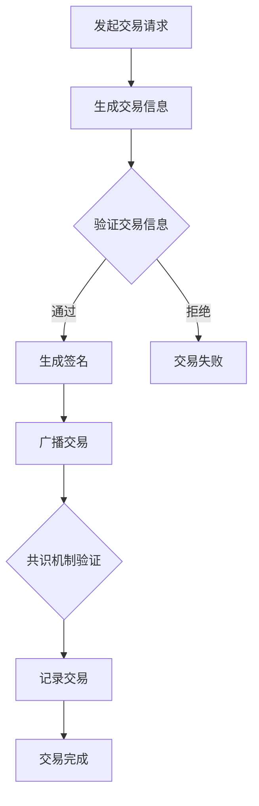

                 

### 引言

在当今数字化时代，数字货币作为一种新兴的金融形式，正迅速改变着传统的金融体系。随着区块链技术的普及和应用，数字货币不仅作为一种投资工具受到广泛关注，也逐渐与传统金融体系进行深度融合。这种融合不仅推动了金融科技的发展，还带来了金融行业的革新。

数字货币，即通过互联网进行交易的加密货币，其去中心化、匿名性和安全性的特点，使其在金融领域具有独特的优势。而传统金融体系，则以银行、证券、保险等为中心，构成了一个复杂的金融生态系统。这两者的融合，不仅仅是简单的技术对接，更是涉及到了金融制度、法律法规、市场机制等多方面的变革。

本文将深入探讨数字货币与传统金融体系的融合，首先介绍数字货币的基础知识，包括其定义、发展历程、类型、原理和架构，然后分析传统金融体系的基本概念和运作机制，探讨数字货币对传统金融体系的影响及其融合前景。接下来，本文将详细阐述数字货币与传统金融体系融合的实践案例，包括交易平台、支付系统、资产管理以及金融衍生品等方面。最后，本文将探讨数字货币融合过程中的法律与监管挑战，并提供案例分析及最佳实践建议。

通过这篇文章，我们希望读者能够全面了解数字货币与传统金融体系融合的现状、挑战和前景，为未来的金融发展提供有益的思考。

### 文章关键词

数字货币、传统金融体系、区块链、去中心化、加密算法、智能合约、交易平台、支付系统、资产管理、金融衍生品、法律监管。

### 文章摘要

本文深入探讨了数字货币与传统金融体系的融合，首先介绍了数字货币的基本概念和原理，包括其定义、发展历程、类型、区块链技术和加密算法。随后，分析了传统金融体系的基本概念和运作机制，探讨了数字货币对传统金融体系的影响及其融合前景。接着，本文详细阐述了数字货币与传统金融体系融合的实践案例，包括交易平台、支付系统、资产管理和金融衍生品等方面。最后，本文探讨了数字货币融合过程中的法律与监管挑战，并提供了案例分析及最佳实践建议。通过本文的探讨，读者可以全面了解数字货币与传统金融体系融合的现状、挑战和前景，为未来金融发展提供有益的思考。

### 数字货币的基础知识

数字货币，作为一种基于区块链技术的加密货币，其概念和背景在现代金融领域引起了广泛关注。要深入理解数字货币，首先需要了解其定义、发展历程、类型以及其背后的原理和架构。

#### 定义与背景

数字货币，通常是指一种通过互联网进行交易的加密货币，其去中心化、匿名性和安全性等特点使其在金融领域具有独特的优势。最早的数字货币之一是比特币（Bitcoin），它于2009年由一个化名为中本聪（Satoshi Nakamoto）的人或团队创立。比特币的出现标志着一种全新的去中心化金融系统的诞生，它不受任何中央机构控制，通过分布式账本技术进行交易记录的验证和管理。

数字货币的背景可以追溯到互联网技术的飞速发展和区块链技术的出现。区块链技术，作为一种分布式账本技术，具有不可篡改、透明和安全等特点，为数字货币的发展提供了技术基础。区块链上的每一个区块都包含一定数量的交易记录，通过加密算法和共识机制确保整个系统的安全性。

#### 发展历程

数字货币的发展历程可以追溯到20世纪90年代，当时一些学者和工程师开始探讨加密货币的概念。然而，比特币的诞生标志着数字货币的真正崛起。自2009年以来，比特币逐渐受到关注，并引发了全球范围内对数字货币的研究和应用。

随着比特币的成功，越来越多的加密货币如雨后春笋般涌现，如以太坊（Ethereum）、莱特币（Litecoin）等。这些新的数字货币在技术上进行了创新，提供了更多的功能和应用场景。例如，以太坊引入了智能合约技术，使得数字货币不仅限于交易，还可以用于各种去中心化应用（DApps）的开发。

#### 类型

数字货币根据其应用场景和特性可以分为多种类型：

1. **比特币（Bitcoin）**：最早的加密货币，主要用于点对点的电子现金交易。
2. **以太坊（Ethereum）**：基于区块链的智能合约平台，允许开发者创建去中心化应用。
3. **莱特币（Litecoin）**：比比特币更快、更高效的加密货币。
4. **币安币（Binance Coin）**：币安交易所的代币，用于交易费用折扣和其他增值服务。
5. **稳定币（Stablecoin）**：价格稳定、价值相对稳定的加密货币，如美元硬币（Dollar Coin）。

#### 原理与架构

数字货币的原理和架构主要涉及以下几个方面：

1. **区块链技术**：区块链是一种分布式账本技术，通过加密算法和共识机制确保交易记录的安全和不可篡改。每个区块包含一定数量的交易记录，通过哈希函数链接成一个链条，形成一个去中心化的数据库。
   
2. **加密算法**：数字货币使用多种加密算法来确保交易的安全性和隐私性。常见的加密算法包括非对称加密、哈希算法和数字签名等。非对称加密用于保护交易数据的隐私，哈希算法用于验证交易记录的唯一性，数字签名用于确保交易的真实性。

3. **共识机制**：共识机制是数字货币网络中节点达成一致的方式。常见的共识机制包括工作量证明（PoW）、权益证明（PoS）和委托权益证明（DPoS）等。这些机制确保了整个网络的稳定性和安全性。

4. **智能合约**：智能合约是区块链上的一种自执行合约，通过代码自动执行满足条件时的操作。智能合约的引入使得数字货币不仅可以用于交易，还可以用于各种去中心化应用的开发。

#### Mermaid流程图

为了更好地理解数字货币的交易流程，我们可以使用Mermaid流程图来展示。以下是一个简化的数字货币交易流程：



在这个流程图中，交易发起者首先生成交易信息，并通过私钥生成签名。签名用于验证交易的真实性，然后交易信息被广播到整个网络。网络中的节点通过共识机制验证交易的有效性，并将交易记录到区块链上，最终完成交易。

通过以上对数字货币基础知识的介绍，我们可以看到，数字货币作为一种新兴的金融形式，具有去中心化、匿名性和安全性的特点。其发展历程和类型展示了这一领域的多样性和创新性。接下来，我们将进一步探讨数字货币与传统金融体系的融合，分析其在传统金融体系中的影响和应用前景。

### 传统金融体系概述

传统金融体系是一个复杂且庞大的系统，其核心组成部分包括银行、证券、保险、交易所等。了解传统金融体系的基本概念、运作机制及其发展历程，对于理解数字货币与传统金融体系的融合至关重要。

#### 基本概念

1. **银行**：银行是传统金融体系中的核心机构，负责接受存款、发放贷款、支付结算等业务。银行通过存款和贷款等业务形成资金池，实现资金的流通和增值。

2. **证券**：证券市场是传统金融体系的重要组成部分，包括股票、债券、基金等。证券市场为投资者提供了多样化的投资渠道，通过交易实现资本的流动和配置。

3. **保险**：保险公司通过提供各种保险产品，为个人和企业提供风险保障。保险市场通过风险分散和管理，实现社会财富的保值增值。

4. **交易所**：交易所是金融产品交易的场所，包括股票交易所、期货交易所、外汇交易所等。交易所通过提供交易平台和服务，实现金融产品的流通和定价。

#### 运作机制

1. **存款与贷款**：银行通过吸收存款提供贷款，形成资金池。存款利率通常低于贷款利率，银行通过利差获取收益。贷款业务促进了资金的流通和投资，推动了经济的发展。

2. **证券交易**：证券市场通过股票、债券等金融产品的交易，实现资本的流通和配置。交易所为投资者提供了公平、透明的交易平台，通过价格发现机制实现金融产品的合理定价。

3. **保险服务**：保险公司通过提供各种保险产品，为个人和企业提供风险保障。保险市场通过风险分散和管理，实现社会财富的保值增值。

4. **支付结算**：银行和其他金融机构通过支付系统实现资金的流通和结算。支付系统确保交易的安全、快速和准确，是金融体系运行的重要保障。

#### 发展历程

传统金融体系的发展历程可以追溯到几个关键阶段：

1. **早期阶段**：传统金融体系起源于货币和信贷的产生。古代社会中的货币交换和信贷业务是金融体系的基础。

2. **工业革命阶段**：随着工业革命的推进，金融体系逐渐发展壮大。银行、证券、保险等金融机构应运而生，金融市场的规模和复杂性显著增加。

3. **现代化阶段**：20世纪以来，金融体系经历了一系列重大变革。电子化和信息化技术的引入，使得金融交易更加高效、便捷。同时，金融创新层出不穷，金融产品和服务不断丰富。

4. **全球化阶段**：随着全球化的推进，传统金融体系逐渐向国际化发展。国际金融市场互联互通，跨国金融业务日益增多，金融体系的发展进入新的阶段。

#### 数字货币与传统金融体系的关系

数字货币与传统金融体系的融合，不仅是对技术的应用，更是对金融制度的变革。以下从几个方面探讨数字货币与传统金融体系的关系：

1. **去中心化与中心化的博弈**：数字货币的去中心化特点与传统金融体系的中心化特点形成了鲜明对比。数字货币通过区块链技术实现了去中心化的交易和管理，减少了中介环节，提高了效率。而传统金融体系则依赖于中心化的金融机构和监管机构，确保金融交易的安全和合规。

2. **安全性与透明性**：数字货币通过加密算法和共识机制确保交易的安全性和透明性。而传统金融体系则需要通过一系列的法律法规和监管措施来保障金融交易的安全。数字货币的匿名性也带来了隐私保护和反洗钱等挑战。

3. **金融创新与风险控制**：数字货币的引入为传统金融体系带来了新的机遇和挑战。数字货币的发展推动了金融创新，如区块链支付、智能合约等。然而，数字货币市场的高波动性和监管不足也带来了风险。

4. **国际合作与竞争**：在全球化的背景下，数字货币与传统金融体系的融合需要国际间的合作和竞争。不同国家和地区在数字货币监管、技术创新和市场应用等方面存在差异，如何实现国际合作和规范竞争是一个重要议题。

通过以上分析，我们可以看到，传统金融体系和数字货币之间既有相互依存的联系，也存在相互竞争和挑战。数字货币的引入不仅对传统金融体系带来了变革，也为金融创新提供了新的机遇。未来，随着数字货币与传统金融体系的进一步融合，金融行业的面貌将发生深刻变化。

### 数字货币对传统金融体系的影响

数字货币的兴起对传统金融体系产生了深远的影响，这种影响不仅体现在技术和运营层面，还涉及了金融市场的结构、消费者行为以及监管机制等多个方面。

#### 技术与运营层面

首先，在技术与运营层面，数字货币通过其去中心化和分布式账本技术对传统金融体系的架构和运作方式提出了挑战。传统金融体系依赖于中心化的金融机构进行交易记录、清算和结算，而数字货币利用区块链技术实现了去中心化的交易和记录，从而减少了中介环节，提高了效率。例如，比特币的交易过程无需通过银行或其他金融机构进行中介，交易双方可以直接在区块链上进行交易，从而避免了传统金融体系中存在的手续费和时间成本。

此外，数字货币的引入促进了金融科技的快速发展，催生了新的金融产品和服务。例如，基于区块链的智能合约技术使得自动执行合同成为可能，这不仅在法律领域具有重要意义，也极大地提高了金融交易的效率和安全性。智能合约的引入使得贷款、保险、证券等多个金融领域的自动化和去中心化成为现实，减少了人为错误和欺诈风险。

#### 市场结构变化

其次，数字货币对传统金融市场结构的变化也产生了深远影响。传统的金融市场主要由银行、证券交易所、保险公司等金融机构主导，而数字货币的出现打破了这种垄断，为新的市场参与者提供了机会。例如，加密货币交易所成为了数字货币交易的主要平台，这些交易所不仅提供了便捷的交易服务，还吸引了大量的个人投资者和机构投资者进入市场，形成了新的市场生态。

此外，数字货币的崛起也影响了传统金融市场的投资组合和风险管理。越来越多的投资者将数字货币视为传统投资组合的一部分，以实现资产配置的多元化和风险分散。同时，数字货币市场的高波动性也增加了风险管理的复杂性，投资者需要更加灵活和高效的策略来应对市场变化。

#### 消费者行为改变

在消费者行为层面，数字货币的出现改变了人们的支付习惯和理财观念。传统的支付方式依赖于银行和金融机构，而数字货币使得个人之间的点对点交易成为可能，用户可以直接通过数字钱包进行转账和支付。这不仅提高了支付的便捷性和安全性，也为小额支付和跨境支付提供了新的解决方案。

此外，数字货币的匿名性和去中心化特性也吸引了大量寻求隐私保护的消费者。这些消费者希望通过数字货币来规避传统金融体系的监管，实现资金的自由流动。尽管这种匿名性可能带来一定的法律和合规风险，但也反映了消费者对隐私保护和自主权的追求。

#### 监管机制挑战

最后，数字货币对传统金融体系的监管机制提出了新的挑战。传统金融体系依赖于中央银行和金融监管机构进行监管，而数字货币的去中心化特性使得传统监管机制难以适应。数字货币交易没有固定的中心化机构，交易记录分布在区块链上，这使得监管机构难以追踪和监控交易行为。

为了应对这些挑战，各国政府和监管机构正在积极探索新的监管框架。例如，一些国家已经开始制定加密货币法规，以规范数字货币交易和发行。然而，如何平衡创新与监管、保护消费者权益与避免市场过度投机，仍是一个亟待解决的问题。

总的来说，数字货币对传统金融体系的影响是全面而深远的。在技术与运营层面，它推动了金融创新和效率提升；在市场结构层面，它打破了垄断，为新的市场参与者提供了机会；在消费者行为层面，它改变了支付习惯和理财观念；在监管机制层面，它带来了新的挑战。随着数字货币与传统金融体系的进一步融合，这些影响将不断深化和扩展，推动金融行业的持续变革和发展。

### 数字货币与传统金融体系的融合前景

随着数字货币的不断发展，其与传统金融体系的融合前景逐渐变得清晰，这种融合不仅具有巨大的潜力，还面临诸多挑战和不确定性。以下是数字货币与传统金融体系融合的几种可能前景。

#### 潜在机遇

1. **效率提升**：数字货币的去中心化和区块链技术能够显著提高金融交易的效率。通过减少中介环节，交易过程更加快捷和透明，降低了交易成本。例如，跨境支付和结算通常需要数天时间，而基于区块链的数字货币交易可以在数秒内完成，大大缩短了交易时间。

2. **创新产品和服务**：数字货币的发展为传统金融产品和服务带来了新的创新机会。智能合约技术的应用使得金融产品和服务更加灵活和高效。例如，智能保险和自动化贷款产品可以通过智能合约自动执行，提高用户体验和运营效率。

3. **风险分散**：数字货币市场的多元化特性使得投资者能够更加灵活地进行资产配置，实现风险分散。通过将投资组合中的部分资金配置到数字货币，投资者可以降低整体投资组合的波动性，提高资产的保值增值能力。

4. **扩展市场覆盖**：数字货币的匿名性和跨境支付能力使其能够扩展传统金融体系无法覆盖的市场。例如，在许多发展中国家，由于金融基础设施不完善，很多人无法享受到正规的金融服务。数字货币的普及可以为这些人群提供便捷的支付和理财服务，促进金融包容性。

#### 面临的挑战

1. **监管难度**：数字货币的去中心化特性使得监管变得更加复杂。传统的金融监管机制依赖于中心化的监管机构，而数字货币交易记录分布在区块链上，监管机构难以追踪和监控。如何制定有效的监管框架，同时保护市场创新和消费者权益，是一个重要挑战。

2. **法律风险**：数字货币市场的法律环境尚不完善，存在一定的法律风险。例如，一些国家尚未明确数字货币的法律地位，数字货币交易可能面临法律风险。此外，数字货币的匿名性可能被用于非法交易，如洗钱和恐怖主义融资等，需要通过法律手段进行有效监管。

3. **市场波动性**：数字货币市场具有较高的波动性，价格波动频繁且幅度较大。这种高波动性增加了投资者的风险，也影响了市场的稳定性。如何降低市场波动性，提高市场的透明度和稳定性，是数字货币与传统金融体系融合面临的一个重要问题。

4. **技术风险**：数字货币的底层技术，如区块链技术，虽然具有很多优势，但也存在一些技术风险。例如，区块链技术的扩展性和安全性问题仍然需要解决。同时，智能合约代码的漏洞可能导致严重的后果，需要通过技术手段进行有效防范。

#### 融合路径

1. **逐步融合**：数字货币与传统金融体系的融合可以采取逐步融合的路径。首先，在技术层面实现数字货币与传统金融系统的对接，例如，通过区块链技术实现银行和交易所之间的交易记录共享。然后，在市场层面逐步扩大数字货币的应用范围，例如，通过数字货币交易平台进行跨境支付和结算。

2. **监管合作**：国际间和跨行业的监管合作是数字货币与传统金融体系融合的重要保障。通过建立跨国监管框架，协调不同国家和地区之间的监管政策，可以有效地应对数字货币带来的监管挑战。

3. **法律法规完善**：各国政府和监管机构需要不断完善数字货币的法律法规，明确数字货币的法律地位，规范市场行为，保护消费者权益。同时，需要建立相应的法律机制，应对数字货币可能带来的法律风险。

4. **技术创新**：通过技术创新，提高数字货币的安全性和稳定性，降低市场波动性。例如，通过改进区块链技术，提高其扩展性和安全性；通过开发更先进的加密算法，提高交易的安全性和隐私性。

总之，数字货币与传统金融体系的融合前景充满机遇和挑战。通过逐步融合、监管合作、法律法规完善和技术创新，可以推动数字货币与传统金融体系的深度融合，实现金融行业的持续发展和变革。

### 数字货币交易平台

数字货币交易平台是数字货币市场中最为重要的基础设施之一，它为交易者提供了一个便捷、透明和安全的交易环境。本文将详细介绍数字货币交易平台的基础概念、架构设计、智能合约的应用以及伪代码示例。

#### 基础概念

数字货币交易平台，是指为数字货币交易提供服务的在线平台。这些平台通常提供以下功能：

1. **交易对**：交易平台提供多种数字货币交易对，使得用户可以方便地进行不同数字货币之间的兑换。
2. **订单簿**：订单簿记录所有未成交的买卖订单，用户可以在订单簿上查看当前市场的供需情况。
3. **交易引擎**：交易引擎负责处理交易请求，执行交易逻辑，并确保交易过程的快速和高效。
4. **钱包服务**：钱包服务为用户提供存储和管理数字货币的工具。

#### 架构设计

数字货币交易平台的架构通常包括前端、后端和区块链三个部分：

1. **前端**：前端负责用户界面，提供用户操作接口，包括登录、注册、查看市场行情、发布订单、查看交易历史等功能。前端通常使用Web技术栈，如React、Vue等框架进行开发。
2. **后端**：后端负责处理业务逻辑，包括订单管理、用户认证、钱包管理、交易结算等。后端通常使用Node.js、Java、Python等语言进行开发。
3. **区块链**：区块链负责存储和验证交易记录。交易平台的交易数据会记录在区块链上，通过加密算法和共识机制确保数据的不可篡改和安全性。

#### 智能合约的应用

智能合约是区块链上的可编程合约，能够自动执行满足条件的操作。在数字货币交易平台中，智能合约的应用至关重要，它负责处理交易逻辑和资金转移。

1. **交易逻辑**：智能合约可以定义交易规则，例如交易金额、交易对、手续费等。当交易订单符合智能合约定义的条件时，智能合约会自动执行交易逻辑。
2. **资金转移**：智能合约还负责资金的转移。在交易成功后，智能合约会自动将买家的资金转移到卖家的钱包中，确保交易的安全和透明。

#### 伪代码示例

以下是一个简化的数字货币交易平台交易逻辑的伪代码示例：

```python
# 伪代码：数字货币交易平台交易逻辑

# 定义交易合约
class TransactionContract:
    def __init__(self, buyer, seller, token_amount, fee):
        self.buyer = buyer
        self.seller = seller
        self.token_amount = token_amount
        self.fee = fee
    
    # 检查交易是否有效
    def is_valid(self):
        # 判断买家余额是否足够支付交易金额加手续费
        if self.buyer.balance >= (self.token_amount + self.fee):
            return True
        else:
            return False
    
    # 执行交易
    def execute_transaction(self):
        if self.is_valid():
            # 从买家钱包扣除交易金额和手续费
            self.buyer.balance -= (self.token_amount + self.fee)
            # 将交易金额转入卖家钱包
            self.seller.balance += self.token_amount
            # 记录交易日志
            log("Transaction successful: {} tokens from {} to {}".format(self.token_amount, self.buyer, self.seller))
        else:
            log("Transaction failed: Insufficient balance for buyer")
            
# 定义用户钱包
class Wallet:
    def __init__(self, owner, balance):
        self.owner = owner
        self.balance = balance
    
# 创建买家和卖家钱包
buyer_wallet = Wallet("Alice", 1000)
seller_wallet = Wallet("Bob", 2000)

# 创建交易合约
contract = TransactionContract(buyer_wallet, seller_wallet, 500, 10)

# 执行交易
contract.execute_transaction()

# 输出买家和卖家余额
print("Buyer balance:", buyer_wallet.balance)
print("Seller balance:", seller_wallet.balance)
```

在这个示例中，我们定义了一个`TransactionContract`类，用于处理交易逻辑。该类包含`is_valid`方法用于检查交易是否有效，以及`execute_transaction`方法用于执行交易。`Wallet`类则用于表示用户钱包，包含用户余额信息。

通过这个示例，我们可以看到数字货币交易平台的基本交易逻辑，包括交易验证和资金转移。在实际应用中，交易合约的复杂度会更高，需要考虑更多的安全性和稳定性因素。

#### 实际案例

一个典型的数字货币交易平台案例是币安（Binance）。币安是一个全球知名的加密货币交易平台，提供多种数字货币交易对、高级交易功能以及去中心化交易平台。币安的智能合约实现了复杂多样的交易逻辑，包括限价交易、市价交易、杠杆交易等。

币安还采用了先进的加密技术和安全措施，确保用户资产的安全。例如，币安使用了多签名钱包来管理用户资产，只有多个私钥同时验证才能进行资金转移，从而提高了资金的安全性。

此外，币安在智能合约开发中非常注重代码审查和安全性测试。币安的开发团队定期对智能合约代码进行审查，并使用安全审计工具检测潜在的安全漏洞，以确保智能合约的安全性和可靠性。

通过以上分析，我们可以看到，数字货币交易平台在数字货币市场中发挥着至关重要的作用。通过智能合约的应用，交易平台实现了高效、透明和安全交易。在实际操作中，交易平台还需要考虑安全性、稳定性和用户体验等多个方面，以实现可持续的发展。

### 数字货币支付系统

数字货币支付系统是一种基于区块链技术的支付解决方案，它通过去中心化的方式实现资金转移，具有高安全性、透明性和快捷性的特点。本文将详细介绍数字货币支付系统的原理、架构设计以及安全性分析。

#### 原理

数字货币支付系统的核心在于区块链技术。区块链是一个分布式账本，通过加密算法和共识机制确保交易记录的安全和不可篡改。具体来说，数字货币支付系统的工作原理包括以下几个步骤：

1. **交易发起**：交易发起者通过数字钱包生成一笔交易，并将交易信息（包括交易金额、交易双方地址等）广播到整个区块链网络。

2. **交易验证**：区块链网络中的节点对交易信息进行验证。验证过程包括确认交易信息的真实性、确认交易双方的资金余额是否足够以及验证交易的签名是否正确。

3. **共识机制**：通过共识机制，网络中的节点达成一致，将验证通过的交易记录添加到一个新的区块中。常见的共识机制包括工作量证明（PoW）、权益证明（PoS）等。

4. **区块添加**：新的区块被添加到区块链上，交易记录被永久记录下来。区块链的分布式特性确保了交易记录的不可篡改和透明性。

5. **交易完成**：交易完成后，交易双方可以通过区块链查询交易记录，确认交易已成功完成。

#### 架构设计

数字货币支付系统的架构通常包括以下几个主要部分：

1. **客户端**：客户端是用户与数字货币支付系统交互的入口。用户可以通过客户端发起交易、查看交易记录、管理钱包等。

2. **钱包服务**：钱包服务负责存储和管理用户的数字货币。钱包通常包含用户的公钥和私钥，通过私钥进行签名验证交易的真实性。

3. **区块链节点**：区块链节点负责验证和记录交易。节点可以是矿工节点或普通节点，矿工节点负责生成区块和验证交易，普通节点负责存储和传播交易信息。

4. **交易验证服务**：交易验证服务是区块链网络中负责交易验证的部分。它通过加密算法和共识机制确保交易的真实性和安全性。

5. **区块链网络**：区块链网络由多个节点组成，通过P2P网络协议进行通信和协作，共同维护区块链的完整性。

#### 安全性分析

数字货币支付系统的安全性主要涉及以下几个方面：

1. **加密算法**：数字货币支付系统使用多种加密算法，包括非对称加密和哈希算法，确保交易数据的隐私性和完整性。非对称加密用于保护交易双方的隐私，哈希算法用于确保交易记录的唯一性和不可篡改性。

2. **共识机制**：共识机制是区块链网络中节点达成一致的关键。通过工作量证明（PoW）或权益证明（PoS）等机制，确保区块链网络的稳定性和安全性。这些机制防止了双花攻击等恶意行为。

3. **去中心化**：数字货币支付系统的去中心化特性使其具有较高的安全性。去中心化意味着没有中央权威机构控制交易，所有节点都参与验证和记录交易，从而降低了单点故障的风险。

4. **智能合约安全**：智能合约是数字货币支付系统中重要的组成部分，但其安全性直接影响到整个支付系统的稳定性。通过严格的代码审查和安全性测试，可以降低智能合约漏洞带来的风险。

#### 数学模型

为了进一步理解数字货币支付系统的安全性，我们可以使用一些数学模型进行分析。以下是一个简化的数学模型：

1. **交易验证公式**：

   \[
   \text{valid\_transaction} = \text{hash}(T) = K
   \]

   其中，\( T \) 表示交易信息，\( K \) 表示交易哈希值。节点验证交易信息时，计算交易哈希值并与预期哈希值 \( K \) 进行比对，如果一致，则交易有效。

2. **非对称加密公式**：

   \[
   \text{public\_key} = \text{RSA}(m)
   \]
   \[
   \text{private\_key} = \text{RSA}(n)
   \]

   其中，\( m \) 和 \( n \) 分别为加密算法的模和密钥，\( \text{public\_key} \) 和 \( \text{private\_key} \) 分别为公钥和私钥。公钥用于加密交易信息，私钥用于签名验证交易的真实性。

#### 伪代码示例

以下是一个简化的数字货币支付系统交易验证的伪代码示例：

```python
# 伪代码：数字货币支付系统交易验证

# 定义交易信息
transaction = {
    "from": "Alice",
    "to": "Bob",
    "amount": 10
}

# 计算交易哈希值
transaction_hash = hash(transaction)

# 生成公钥和私钥
public_key, private_key = RSA()

# 签名交易
signature = sign(transaction, private_key)

# 验证交易
if verify(transaction, signature, public_key):
    print("Transaction is valid")
else:
    print("Transaction is invalid")
```

在这个示例中，我们首先定义了一笔交易信息，并计算交易哈希值。然后，我们生成公钥和私钥，对交易进行签名。最后，我们验证交易是否有效，通过比对签名和公钥，确认交易的真实性。

通过以上分析，我们可以看到，数字货币支付系统通过区块链技术和加密算法，实现了资金转移的安全、透明和高效。在实际应用中，数字货币支付系统还需要考虑更多的安全性和稳定性因素，以确保用户资金的安全和交易的顺利进行。

### 数字货币资产管理

数字货币资产管理是指通过投资、管理和优化数字货币资产，实现资产保值增值的过程。在数字货币市场的高波动性和复杂性背景下，有效的资产管理策略至关重要。本文将详细探讨数字货币资产管理的策略、投资策略及数字货币基金运作案例。

#### 策略概述

1. **分散投资**：分散投资是数字货币资产管理的基本策略。通过将资金分配到多种不同的数字货币和资产类别，可以有效降低投资组合的整体风险。投资者应避免将所有资金集中投资于某一种或几种数字货币，而是选择一个多元化的投资组合。

2. **风险管理**：数字货币市场的波动性较大，投资者需要采取有效的风险管理措施。这包括设置止损点、定期调整投资组合以及密切关注市场动态等。

3. **技术分析**：技术分析是数字货币资产管理中的重要工具。通过分析历史价格走势、交易量、市场情绪等数据，投资者可以预测市场趋势，制定投资决策。

4. **长期投资**：尽管数字货币市场波动性大，但长期投资策略有助于平滑市场波动，实现稳定的收益。投资者应着眼于长期投资，耐心持有优质资产。

5. **监管合规**：随着数字货币市场的监管日益严格，投资者需要关注相关法律法规，确保投资行为合规，避免法律风险。

#### 投资策略

1. **趋势跟踪策略**：趋势跟踪策略通过识别市场趋势，进行买入和卖出操作。投资者可以使用移动平均线、相对强弱指数（RSI）等技术指标来识别市场趋势。

2. **均值回归策略**：均值回归策略认为市场价格会回归到其长期平均水平。投资者可以通过监控市场价格与均值的关系，进行买入和卖出操作。

3. **价值投资策略**：价值投资策略强调投资优质资产，关注数字货币的实际价值。投资者应深入分析数字货币的基本面，包括技术实现、团队实力、市场应用场景等。

4. **动量投资策略**：动量投资策略基于市场趋势的延续性，投资者通过追踪市场动量进行投资。这种策略通常适用于市场波动较大的环境。

#### 数字货币基金运作案例

数字货币基金是一种专门投资于数字货币的基金产品，通过专业管理团队和科学投资策略，为投资者提供资产管理服务。以下是一个典型的数字货币基金运作案例：

1. **基金成立**：某数字货币基金由一家知名金融机构发起，基金规模为1亿美元。基金通过私募方式筹集资金，投资于多种数字货币和区块链项目。

2. **投资策略**：基金采用多元化的投资策略，将资金分配到不同的数字货币和项目。其中，60%的资金投资于主流数字货币（如比特币、以太坊等），30%的资金投资于有潜力的新兴数字货币和项目，10%的资金用于风险管理。

3. **投资流程**：基金管理团队通过深入研究市场动态、技术分析和基本面分析，制定投资决策。投资决策包括选择投资标的、确定投资比例和投资时机等。

4. **业绩表现**：自成立以来，该数字货币基金取得了较为稳定的业绩表现。在市场波动较大的环境下，基金通过科学的投资策略和严格的风险管理，实现了超过市场平均水平的收益。

5. **监管合规**：基金严格遵守相关法律法规，确保投资行为合规。基金定期接受第三方审计，公开投资报告，提高透明度和公信力。

#### 总结

数字货币资产管理是数字货币市场中的重要环节，通过科学的投资策略和严格的风险管理，可以实现资产的保值增值。投资者应根据自身风险承受能力和投资目标，选择合适的资产管理策略。同时，数字货币基金作为专业化的资产管理机构，为投资者提供了便捷、高效的投资渠道。在数字货币市场快速发展的背景下，数字货币资产管理将发挥越来越重要的作用。

### 数字货币与金融衍生品

数字货币与金融衍生品是金融市场中备受关注的领域，衍生品如期权、期货等在传统金融体系中发挥着重要作用，而数字货币的加入则为这一领域带来了新的机遇和挑战。本文将详细探讨数字货币金融衍生品的类型、应用以及案例分析，并介绍期权定价模型。

#### 类型

数字货币金融衍生品主要包括以下几种类型：

1. **数字货币期权**：数字货币期权是一种赋予持有人在特定日期或之前以固定价格买入或卖出数字货币的权利。期权买方支付一定的期权费，获得在特定时间内以约定价格交易的权利，但不是义务。

2. **数字货币期货**：数字货币期货是一种标准化的合约，规定在未来的某个时间以约定的价格买入或卖出特定的数字货币。期货交易可以用来对冲风险或进行投机。

3. **数字货币掉期**：数字货币掉期是一种双方同意在未来某一日期按照约定的价格交换数字货币的合约。掉期交易通常用于风险管理，例如企业可以将其数字货币收益掉期成稳定的法币。

4. **数字货币基金**：数字货币基金是一种投资于多种数字货币和其他相关资产的投资工具。基金通常由专业管理团队管理，投资者可以通过购买基金份额参与数字货币市场的投资。

#### 应用

数字货币金融衍生品在数字货币市场中有着广泛的应用：

1. **风险管理**：数字货币市场波动性大，衍生品可以用来对冲风险。例如，投资者可以通过购买数字货币期权或期货来锁定未来的交易价格，避免价格波动带来的损失。

2. **投机机会**：投机者可以利用衍生品进行杠杆交易，通过保证金交易获取更高的收益。然而，这也增加了投资风险，需要投资者具备较高的风险承受能力和市场分析能力。

3. **资产配置**：衍生品为投资者提供了多样化的投资选择，可以通过构建复杂的投资组合实现资产配置和风险分散。

#### 案例分析

以下是几个典型的数字货币金融衍生品案例分析：

1. **比特币期货**：芝加哥期权交易所（CBOE）和芝加哥商品交易所（CME）在2017年先后推出了比特币期货合约。这些合约使得投资者可以在传统金融市场中进行比特币交易，为比特币市场带来了更多的流动性。然而，比特币期货的推出也引发了市场波动，一些投资者因价格剧烈波动而遭受损失。

2. **以太坊期权**：以太坊期权作为一种较为新兴的衍生品，吸引了大量投资者参与。以太坊期权市场的流动性较高，投资者可以通过期权交易对以太坊价格进行投机或对冲。然而，由于以太坊市场波动性较大，期权交易存在较高的风险。

3. **稳定币掉期**：稳定币掉期在数字货币市场中广泛应用。稳定币如USDT和USDC价格稳定，投资者可以通过掉期交易将其数字货币收益掉期成稳定的法币，降低投资风险。

#### 期权定价模型

期权定价模型是金融衍生品分析的核心工具。以下是常见的布莱克-斯科尔斯模型（Black-Scholes Model）：

1. **公式**：

   \[
   C = S_0N(d_1) - Ke^{-rT}N(d_2)
   \]
   \[
   P = Ke^{-rT}N(-d_2) - S_0N(-d_1)
   \]

   其中，\( C \) 和 \( P \) 分别为看涨期权和看跌期权的价格，\( S_0 \) 为当前股票价格，\( K \) 为执行价格，\( r \) 为无风险利率，\( T \) 为到期时间，\( N(\cdot) \) 为标准正态分布的累积分布函数。

2. **参数解释**：

   - \( d_1 = \frac{\ln(S_0/K) + (r + \sigma^2/2)T}{\sigma\sqrt{T}} \)
   - \( d_2 = d_1 - \sigma\sqrt{T} \)

   其中，\( \sigma \) 为股票价格波动率。

通过期权定价模型，投资者可以计算不同情况下期权的理论价值，从而进行投资决策。以下是一个简化的Python代码示例，用于计算布莱克-斯科尔斯模型：

```python
import math
import numpy as np

def black_scholes(S0, K, T, r, sigma):
    d1 = (math.log(S0 / K) + (r + 0.5 * sigma ** 2 * T)) / (sigma * math.sqrt(T))
    d2 = d1 - sigma * math.sqrt(T)
    
    C = S0 * math.exp(-r * T) * norm.cdf(d1) - K * math.exp(-r * T) * norm.cdf(d2)
    P = K * math.exp(-r * T) * norm.cdf(-d2) - S0 * norm.cdf(-d1)
    
    return C, P

S0 = 100  # 当前股票价格
K = 100   # 执行价格
T = 1     # 到期时间（年）
r = 0.05  # 无风险利率
sigma = 0.2  # 波动率

C, P = black_scholes(S0, K, T, r, sigma)
print("Call Option Price:", C)
print("Put Option Price:", P)
```

通过以上分析，我们可以看到，数字货币金融衍生品在数字货币市场中发挥着重要作用，不仅为投资者提供了风险管理工具，也带来了新的投机机会。期权定价模型是衍生品分析的重要工具，可以帮助投资者进行合理的投资决策。随着数字货币市场的不断发展，金融衍生品的应用将越来越广泛，市场也将迎来更多的创新和变革。

### 法律与监管

数字货币作为一种新兴的金融形式，其法律与监管问题成为全球关注的焦点。本文将探讨数字货币的法律地位、监管挑战以及不同国家和地区的监管实践。

#### 法律地位

数字货币的法律地位因国家和地区而异，总体上可分为以下几个方面：

1. **合法但未明确监管**：一些国家如美国和日本，将数字货币视为合法的财产形式，但其法律地位和监管框架尚未明确。这种不确定性为数字货币市场的发展带来了一定的困扰。

2. **合法且受监管**：在许多国家和地区，数字货币被视为合法货币，受到一定的监管。例如，欧盟将数字货币纳入反洗钱（AML）和反恐怖主义融资（CTF）法规的监管范围。

3. **非法或限制使用**：一些国家如中国大陆和朝鲜，对数字货币采取了严格的法律限制。中国明确禁止了加密货币交易和ICO（首次币发行），朝鲜则禁止了所有加密货币相关活动。

#### 监管挑战

数字货币的监管面临诸多挑战，主要包括：

1. **匿名性和隐私保护**：数字货币交易通常具有匿名性，这使得监管机构难以追踪和监控交易行为。尽管加密算法提高了交易安全性，但也为非法交易提供了便利。

2. **跨境交易监管**：数字货币可以轻松跨越国界进行交易，这使得跨境监管变得复杂。不同国家和地区的监管法规和执法力度存在差异，增加了跨境监管的难度。

3. **洗钱和恐怖主义融资**：数字货币的高匿名性和去中心化特性使其成为洗钱和恐怖主义融资的潜在工具。监管机构需要有效监控数字货币交易，以防范这些风险。

4. **市场波动性和投资者保护**：数字货币市场波动性大，投资者保护成为一个重要议题。监管机构需要制定有效的法律法规，保护投资者的权益，同时避免市场过度投机。

#### 不同国家和地区的监管实践

以下是一些国家和地区的数字货币监管实践：

1. **美国**：美国证券交易委员会（SEC）和商品期货交易委员会（CFTC）分别负责监管数字货币的证券和期货交易。美国还通过《反洗钱法》和《爱国者法》对数字货币交易进行监管。尽管美国对数字货币的监管较为严格，但其监管框架仍在不断完善。

2. **欧盟**：欧盟通过《第五项反洗钱指令》对数字货币交易进行了明确监管。欧盟还推出了《市场工具指令II》（MiFID II），要求加密货币交易平台遵循相关合规要求。欧盟的监管旨在提高市场透明度和投资者保护。

3. **中国**：中国采取了严格的法律限制，禁止加密货币交易和ICO。中国央行推出了数字货币电子支付（DCEP），旨在替代传统货币，但加密货币交易仍被视为非法。

4. **日本**：日本将数字货币视为合法货币，并制定了《支付服务法案》对数字货币交易进行监管。日本还成立了加密货币交易行业协会，推动行业自律和合规。

5. **新加坡**：新加坡采取了较为宽松的监管态度，将数字货币视为合法资产，并鼓励金融科技创新。新加坡的金融监管局（MAS）通过《支付服务法》对数字货币交易进行了规范。

#### 国际合作与监管框架

在全球化的背景下，数字货币监管的国际合作变得越来越重要。以下是一些国际合作与监管框架：

1. **金融行动特别工作组（FATF）**：FATF是一个国际组织，负责制定反洗钱和反恐怖主义融资的标准。FATF对数字货币的监管提出了明确要求，包括交易记录保留、KYC（了解你的客户）和AML（反洗钱）等。

2. **国际证监会组织（IOSCO）**：IOSCO是一个国际证券监管机构论坛，致力于提高全球证券市场的监管标准。IOSCO对数字货币的监管提出了建议，以促进全球证券市场的稳定和发展。

3. **国际货币基金组织（IMF）**：IMF对数字货币的监管提供了指导性意见，强调需要平衡创新与监管，保护投资者权益。

通过以上分析，我们可以看到，数字货币的法律与监管问题具有复杂性和多样性。不同国家和地区在数字货币监管方面采取了不同的策略和实践。随着数字货币市场的不断发展，国际合作与统一监管框架的重要性日益凸显。未来，全球监管机构需要共同努力，制定有效的监管政策，促进数字货币市场的健康、稳定发展。

### 案例分析

为了深入理解数字货币与传统金融体系的融合，我们通过几个实际案例来分析这一过程，这些案例涵盖了数字货币交易平台、支付系统、资产管理和金融衍生品等方面的具体应用和挑战。

#### 案例一：比特币与比特币期货

比特币作为最早和最具代表性的数字货币，其与传统金融体系的融合表现尤为显著。比特币期货是这一融合的重要标志。在2017年，芝加哥期权交易所（CBOE）和芝加哥商品交易所（CME）相继推出了比特币期货合约，使投资者能够在传统金融市场中交易比特币。

**案例分析**：

1. **交易平台**：比特币期货的推出为传统金融市场引入了新的交易对，使得投资者可以在传统交易平台进行比特币交易。这种融合提高了市场的流动性和透明度，同时也吸引了更多的投资者进入市场。

2. **监管挑战**：比特币期货的推出引发了监管机构的关注。如何确保比特币期货交易的安全性和合规性成为重要议题。监管机构需要制定明确的监管框架，以确保交易平台的运营合规，同时防范市场操纵和欺诈行为。

3. **市场影响**：比特币期货的推出对市场价格产生了显著影响。一些投资者通过期货合约进行对冲，从而影响了市场的供需关系。比特币期货的价格波动性与比特币现货价格存在一定的关联性，但其高波动性也增加了市场风险。

#### 案例二：区块链支付平台的发展

区块链支付平台是数字货币与传统金融体系融合的另一个重要案例。随着区块链技术的普及，越来越多的支付平台开始采用区块链技术，以提高支付效率和安全。

**案例分析**：

1. **支付系统**：区块链支付平台通过去中心化的方式实现跨境支付，大幅减少了交易时间和成本。与传统支付系统相比，区块链支付平台具有更高的效率和透明度。例如，Ripple的区块链支付网络通过实时 gross settlement（RGS）技术实现了跨境支付的高效处理。

2. **技术挑战**：区块链支付平台的发展面临技术挑战，如区块链扩展性、安全性和隐私保护。为了应对这些挑战，支付平台需要不断优化区块链技术，提高系统的性能和可靠性。

3. **监管适应**：区块链支付平台在监管方面需要适应传统金融体系的监管要求。如何确保交易合规、数据安全和客户隐私是支付平台需要解决的关键问题。

#### 案例三：数字货币基金的运营

数字货币基金是数字货币与传统金融体系融合的另一个重要应用。这些基金通过专业管理团队，为投资者提供数字货币投资服务。

**案例分析**：

1. **资产管理**：数字货币基金通过多元化的投资策略，实现资产保值增值。基金管理团队需要对市场进行深入分析，选择优质的投资标的，同时进行严格的风险管理。

2. **投资策略**：数字货币基金的投资策略包括趋势跟踪、价值投资和均值回归等。这些策略旨在在不同市场环境下实现稳定的收益。然而，市场的高波动性也增加了投资风险。

3. **监管合规**：数字货币基金的运营需要遵守相关法律法规，确保投资行为合规。同时，基金需要提高透明度，增强投资者信心。

#### 案例四：央行数字货币（CBDC）的试点应用

央行数字货币（CBDC）是数字货币与传统金融体系融合的又一重要方向。一些国家和地区已经开始试点CBDC，以探索数字货币在传统金融体系中的应用。

**案例分析**：

1. **支付系统**：CBDC通过国家货币当局直接发行和管理，实现了去中心化的支付系统。这种支付系统具有更高的效率和透明度，同时降低了交易成本。

2. **法律地位**：CBDC具有与传统货币相同的法律地位，但在监管方面仍面临挑战。如何确保CBDC的安全性和合规性，同时保护用户隐私是关键问题。

3. **市场影响**：CBDC的推出将对传统货币体系产生深远影响。一方面，CBDC可以提高支付系统的效率，降低交易成本；另一方面，CBDC也可能引发货币政策的新变化。

### 案例分析总结

通过以上案例分析，我们可以看到数字货币与传统金融体系的融合在不同领域都有具体的应用和挑战。以下是融合成功的要素和面临的挑战：

#### 融合成功的要素

1. **技术创新**：区块链技术为数字货币与传统金融体系的融合提供了技术基础。通过技术创新，可以实现更高效、更安全的支付和交易系统。

2. **监管适应**：有效的监管框架是数字货币与传统金融体系融合的重要保障。监管机构需要制定明确的监管政策，确保市场稳定和投资者保护。

3. **市场需求**：市场需求是推动数字货币与传统金融体系融合的关键。只有满足市场需求，才能实现数字货币的广泛接受和应用。

#### 面临的挑战

1. **技术风险**：区块链技术虽然具有很多优势，但也存在一些技术风险，如扩展性问题和安全性漏洞。如何提高区块链技术的性能和安全性是融合过程中需要解决的问题。

2. **法律风险**：数字货币市场的法律环境尚不完善，存在法律风险。如何确保数字货币交易合规，同时保护用户隐私是融合过程中需要克服的挑战。

3. **市场波动性**：数字货币市场波动性大，增加了融合过程中的不确定性。如何降低市场波动性，提高市场的稳定性和透明度是一个重要问题。

通过以上案例分析，我们可以看到数字货币与传统金融体系的融合具有巨大的潜力和挑战。未来，随着技术创新和监管政策的不断完善，数字货币将在传统金融体系中发挥越来越重要的作用。

### 总结与展望

本文系统探讨了数字货币与传统金融体系的融合，涵盖了从基础知识到实际应用的多个方面。首先，我们介绍了数字货币的定义、发展历程和类型，阐述了其区块链技术和加密算法的原理。接着，我们分析了传统金融体系的基本概念、运作机制以及数字货币对传统金融体系的影响。在此基础上，我们详细探讨了数字货币交易平台、支付系统、资产管理和金融衍生品等在实际应用中的融合实践，并分析了相关的法律与监管挑战。

#### 最佳实践建议

1. **技术创新**：持续关注并投入区块链技术的研究和开发，提高数字货币交易平台的性能和安全性。
2. **监管合规**：建立健全的数字货币监管框架，确保市场透明度和投资者保护。
3. **市场教育**：加强市场教育，提高投资者对数字货币的认知和风险意识，减少市场投机行为。
4. **风险管理**：金融机构应积极采用数字货币和区块链技术，提高金融服务的效率和安全性。

#### 注意事项

1. **技术风险**：数字货币交易平台的性能和安全直接影响到用户的交易体验和资金安全，需定期进行技术升级和安全测试。
2. **法律风险**：在数字货币交易和资产管理中，遵守相关法律法规至关重要，避免因违规操作导致法律纠纷。
3. **市场波动性**：数字货币市场波动性较大，投资者应做好风险管理，避免因市场波动导致投资损失。

#### 拓展阅读

1. **区块链技术深度学习**：《精通比特币：区块链技术指南》
2. **数字货币市场分析**：《数字货币革命：加密货币的市场前景与投资策略》
3. **数字货币法律监管**：《数字货币的法律框架与全球监管实践》

通过本文的探讨，我们期待读者能够对数字货币与传统金融体系的融合有更深入的理解，为未来的金融发展提供有益的思考。

### 作者信息

作者：AI天才研究院/AI Genius Institute & 禅与计算机程序设计艺术 /Zen And The Art of Computer Programming

AI天才研究院（AI Genius Institute）是一家专注于人工智能与金融科技研究的高科技创新机构。研究院致力于推动人工智能技术在金融领域的应用，提升金融服务的效率和安全。同时，作者还著有《禅与计算机程序设计艺术》（Zen And The Art of Computer Programming），该书以深刻的哲学思考结合技术实践，为计算机编程提供了独特的视角和理念，深受读者喜爱。通过将人工智能技术与金融科技相结合，作者在推动金融科技创新方面取得了显著成就。

