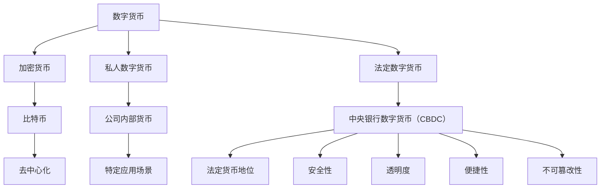

                 

### 第1章 引言到数字货币

#### 1.1 数字货币的定义与分类

数字货币，顾名思义，是以数字形式存在的货币。它与传统的物理货币（如纸币、硬币）不同，不具有实体的物理形态。数字货币可以理解为一种通过互联网传输和交换的电子价值表示形式。根据其发行和运营方式，数字货币大致可以分为以下几种类型：

1. **法定数字货币**：也称为中央银行数字货币（Central Bank Digital Currency，CBDC），是由国家中央银行发行的数字货币，具有法定货币的地位，与现行流通的纸币和硬币具有同等的法律效力。

2. **加密货币**：以比特币为代表的加密货币，采用密码学原理来确保交易安全，并控制货币生成。加密货币通常不由中央银行发行，也不依赖特定的金融机构。

3. **私人数字货币**：由私人企业或机构发行的数字货币，如公司内部使用的虚拟货币或移动支付平台上的数字货币。

4. **数字代币**：通常用于表示某种权益或数字资产，例如游戏内虚拟物品的代币化。

数字货币的核心优势在于其安全、便捷和透明。首先，数字货币利用先进的加密技术和分布式账本，确保交易过程中的信息难以被篡改和盗用，从而提高了交易的安全性。其次，数字货币的交易无需依赖传统金融机构，大大提高了交易的速度和便捷性。最后，由于数字货币的交易记录在公开的分布式账本上，所有交易都透明可查，增强了市场参与者的信任。

#### 1.2 数字货币的发展背景

数字货币的兴起可以追溯到20世纪90年代末和21世纪初。随着互联网的普及和计算机技术的发展，人们开始探索如何在网络上进行价值交换。电子货币的概念随之诞生，它是一种通过互联网传输的数字货币。然而，最早的电子货币并非真正意义上的数字货币，因为它们仍依赖于银行和金融机构的服务。

真正引发数字货币革命的是2009年比特币的诞生。比特币是一种去中心化的加密货币，其发行和交易不受任何中央机构的控制。比特币的出现引发了全球范围内对数字货币的关注和研究。此后，各种加密货币如雨后春笋般涌现，数字货币市场迅速发展。

数字货币的发展背景可以从以下几个方面来理解：

1. **互联网的普及**：互联网的普及为数字货币的传播和交易提供了基础设施，使得全球用户可以方便地进行数字货币的交易和投资。

2. **金融创新的需求**：随着金融市场的不断发展，传统金融工具和模式已经无法满足所有人的需求。数字货币作为一种新型的金融工具，为投资者提供了更多的选择。

3. **去中心化的理念**：数字货币的去中心化特性符合现代社会对去中心化、去信任的期望。去中心化意味着不需要依赖中央机构，交易更加自主和安全。

4. **加密技术的进步**：加密技术的不断发展为数字货币的安全提供了强有力的保障。加密算法的进步使得数字货币的交易更加安全、可靠。

#### 1.3 数字货币的核心优势

数字货币的核心优势体现在以下几个方面：

1. **安全性**：数字货币采用先进的加密技术，如SHA-256哈希算法和椭圆曲线加密算法，确保交易过程中的信息难以被篡改和盗用。同时，数字货币的交易记录在公开的分布式账本上，所有交易都透明可查，增强了市场参与者对交易的信任。

2. **便利性**：数字货币的交易无需依赖传统金融机构，交易速度快，手续费低，大大提高了交易的速度和便捷性。例如，比特币的交易通常在几分钟内完成，而传统金融交易可能需要数天。

3. **透明度**：数字货币的交易记录在公开的分布式账本上，所有交易都透明可查。这使得数字货币的透明度非常高，市场参与者可以随时查看交易记录，确保交易过程的公开和公正。

4. **不可篡改性**：数字货币的交易记录在分布式账本上，一旦记录被添加，就无法更改。这种不可篡改的特性确保了交易的安全性和可靠性。

#### 1.4 中央银行数字货币的重要性

中央银行数字货币（CBDC）是数字货币的一个重要分支，具有独特的地位和作用。首先，CBDC是由国家中央银行发行的，具有法定货币的地位，与现行流通的纸币和硬币具有同等的法律效力。这意味着CBDC不仅是一种新型的金融工具，也是一种全新的货币形式。

CBDC的重要性主要体现在以下几个方面：

1. **货币政策的创新工具**：CBDC可以作为中央银行实施货币政策的创新工具。通过调整CBDC的发行量和流通速度，中央银行可以更灵活地调控货币供应量，从而影响市场利率和经济活动。

2. **金融包容性**：CBDC可以促进金融包容性，让更多的人享受到金融服务。在许多发展中国家，由于缺乏传统金融基础设施，许多人无法享受到基本的金融服务。CBDC的普及可以弥补这一不足，提高金融服务的覆盖面。

3. **支付系统的优化**：CBDC可以优化支付系统，提高交易速度和降低交易成本。传统支付系统通常依赖于银行和金融机构，交易过程复杂且耗时。CBDC的交易无需依赖传统金融机构，交易速度快，手续费低。

4. **反洗钱和反恐融资**：CBDC的透明度和可追溯性有助于打击洗钱和反恐融资。传统货币交易容易隐藏真实交易意图，而CBDC的交易记录在公开的分布式账本上，所有交易都透明可查，有助于监管机构监控和打击违法行为。

#### 1.4.1 中央银行数字货币的概念

中央银行数字货币（CBDC）是指由中央银行发行的数字货币，具有法定货币的地位，与现行流通的纸币和硬币具有同等的法律效力。CBDC可以通过多种方式发行，包括直接面向公众发行和通过商业银行发行。

CBDC的基本特征包括：

1. **法定货币地位**：CBDC是中央银行发行的，具有法定货币的地位，与现行流通的纸币和硬币具有同等的法律效力。

2. **数字形式**：CBDC以数字形式存在，可以在电子设备上进行存储和传输。

3. **安全性**：CBDC采用先进的加密技术，确保交易过程中的信息难以被篡改和盗用。

4. **可追溯性**：CBDC的交易记录在公开的分布式账本上，所有交易都透明可查。

5. **灵活性**：CBDC可以用于多种应用场景，包括零售支付、跨境支付、资产管理等。

#### 1.4.2 中央银行数字货币的作用

中央银行数字货币（CBDC）在金融体系和国家经济中发挥着重要作用。首先，CBDC可以作为中央银行实施货币政策的创新工具。通过调整CBDC的发行量和流通速度，中央银行可以更灵活地调控货币供应量，从而影响市场利率和经济活动。

其次，CBDC可以促进金融包容性。在许多发展中国家，由于缺乏传统金融基础设施，许多人无法享受到基本的金融服务。CBDC的普及可以弥补这一不足，提高金融服务的覆盖面。

此外，CBDC还可以优化支付系统，提高交易速度和降低交易成本。传统支付系统通常依赖于银行和金融机构，交易过程复杂且耗时。CBDC的交易无需依赖传统金融机构，交易速度快，手续费低。

最后，CBDC的透明度和可追溯性有助于打击洗钱和反恐融资。传统货币交易容易隐藏真实交易意图，而CBDC的交易记录在公开的分布式账本上，所有交易都透明可查，有助于监管机构监控和打击违法行为。

#### 1.4.3 中央银行数字货币的优势与挑战

中央银行数字货币（CBDC）作为一种新型的货币形式，具有诸多优势，同时也面临一定的挑战。

**优势**：

1. **安全性**：CBDC采用先进的加密技术，确保交易过程中的信息难以被篡改和盗用。

2. **便利性**：CBDC的交易无需依赖传统金融机构，交易速度快，手续费低。

3. **透明度**：CBDC的交易记录在公开的分布式账本上，所有交易都透明可查。

4. **抗通胀性**：CBDC的发行量由中央银行控制，有助于抑制通胀。

5. **促进金融包容性**：CBDC可以弥补传统金融基础设施的不足，提高金融服务的覆盖面。

**挑战**：

1. **技术风险**：CBDC的技术架构和网络安全是关键挑战，需要确保系统的稳定性和安全性。

2. **监管难度**：CBDC的监管需要适应其特性和新型交易模式，监管机构需要制定新的法规和标准。

3. **隐私保护**：CBDC的透明度可能引发隐私保护问题，如何在保护用户隐私和确保交易透明度之间找到平衡是一个挑战。

4. **市场接受度**：CBDC的推广需要获得市场参与者的广泛认可和接受，这需要时间和努力。

综上所述，中央银行数字货币（CBDC）作为一种新型的货币形式，具有巨大的潜力和挑战。随着技术的不断进步和政策的逐步完善，CBDC有望在未来的金融体系中发挥更加重要的作用。

### Mermaid 流程图

下面是一个简单的 Mermaid 流程图，展示了数字货币与中央银行数字货币（CBDC）之间的核心概念与联系：



该流程图清晰地展示了各种数字货币类型及其与CBDC之间的联系，有助于读者更好地理解数字货币的生态系统。

### 总结

本章对数字货币进行了全面的介绍，从定义与分类、发展背景、核心优势到中央银行数字货币（CBDC）的重要性，以及其优势与挑战。数字货币作为一种新型的货币形式，正逐渐改变我们的金融体系。CBDC作为其中的一种重要形式，具有巨大的潜力和挑战。在接下来的章节中，我们将深入探讨CBDC的技术基础、法律法规、经济影响以及全球案例，以全面了解CBDC的发展现状与未来趋势。

### 附录：技术术语解释

在本章中，我们提到了一些关键的技术术语，以下是对这些术语的解释：

- **加密货币**：采用加密算法保护交易安全、控制货币生成和验证交易的数字货币。
- **分布式账本技术**：一种记录交易和状态的数据结构，分布式存储在多个节点上，具有不可篡改性和透明性。
- **区块链**：一种分布式账本技术，用于记录交易数据，确保数据的完整性和不可篡改性。
- **SHA-256**：一种加密算法，用于生成比特币地址和确保区块链上的数据完整性。
- **椭圆曲线加密算法**：一种用于加密数字货币交易数据的算法，提供强大的安全性保障。

### 最佳实践 Tips

- **理解数字货币的概念**：在深入研究CBDC之前，确保对数字货币的基本概念有清晰的理解，这有助于更好地理解CBDC的作用和影响。
- **关注技术进步**：随着加密技术和分布式账本技术的不断进步，数字货币领域也在快速发展。保持对新技术的研究和关注，有助于把握行业动态。
- **了解各国政策**：全球范围内，各国对数字货币的监管政策各异。了解这些政策有助于更好地理解CBDC的推广和实施。
- **关注CBDC案例**：通过研究全球范围内的CBDC案例，可以了解CBDC在实际应用中的挑战和解决方案，为未来的CBDC项目提供参考。

### 小结

本章详细介绍了数字货币的基本概念、发展背景、核心优势以及中央银行数字货币（CBDC）的重要性。通过本章的学习，读者可以全面了解数字货币的生态系统，为后续章节的深入学习打下坚实的基础。在下一章中，我们将深入探讨CBDC的技术基础，包括其核心技术架构、分布式账本技术和区块链的原理和应用。

### 注意事项

- **安全性**：在涉及数字货币和CBDC的交易过程中，必须高度重视安全性问题。采用先进的加密技术和严格的安全措施，以确保交易数据的安全。
- **隐私保护**：虽然CBDC具有较高的透明度，但也可能引发隐私保护问题。在设计和实施CBDC系统时，需要充分考虑用户隐私保护，确保在透明度和隐私保护之间找到平衡。
- **监管合规**：各国对数字货币的监管政策各异，实施CBDC项目时，必须严格遵守当地法律法规，确保合规运营。
- **技术风险**：数字货币和CBDC系统可能面临技术风险，如网络安全攻击和数据泄露。建立健全的安全体系，加强系统监控和应急响应，是确保系统安全的重要措施。

### 拓展阅读

- **《比特币：一个全新的经济模式》**：作者中本聪（Satoshi Nakamoto），详细介绍了比特币的原理和技术架构。
- **《区块链技术指南》**：作者唐·泰普斯科特（Don Tapscott），全面介绍了区块链技术的原理和应用。
- **《中央银行数字货币：概念、设计与实践》**：作者玛丽亚·玛卡里奥（Maria Mancini），深入探讨了CBDC的概念、设计和实践。

### 代码示例

在本章中，我们没有具体的代码示例，但在下一章关于CBDC的技术基础部分，我们将提供有关区块链和分布式账本技术的Python代码示例，帮助读者更好地理解这些技术原理。

### 实际案例分析与详细讲解剖析

#### 1. 中国数字货币试点项目

中国是世界上最早开始研发和试点CBDC的国家之一。2014年，中国人民银行（PBOC）成立了数字货币研究所，开始探索中央银行数字货币（DCEP，数字货币电子支付）的概念和设计。截至2021年，中国已经在多个城市进行了DCEP的试点项目，包括北京、上海、广州、深圳等。

**案例分析：**

- **试点背景**：中国选择在多个城市进行试点，主要是为了测试DCEP在实际支付环境中的性能和稳定性，以及用户体验。

- **技术架构**：DCEP采用了双层运营架构，即“央行-商业银行”模式。在这一模式中，中央银行首先将数字货币发行给商业银行，然后商业银行将DCEP分发给公众。

- **应用场景**：DCEP的试点项目涵盖了多个应用场景，包括零售支付、公共服务支付、跨境支付等。

- **成效**：试点项目取得了显著成效。首先，DCEP的交易速度显著提高，交易确认时间从传统金融交易的数天缩短至几秒。其次，DCEP的跨境支付功能为中小企业和个体商户提供了便捷的跨境支付解决方案。

**详细讲解剖析：**

- **DCEP的交易流程**：DCEP的交易流程可以分为三个阶段：央行向商业银行发行数字货币、商业银行向公众分发数字货币、公众使用数字货币进行支付。具体流程如下：

  1. **央行发行数字货币**：央行通过其数字货币发行系统将数字货币分配给商业银行。这一过程包括数字货币的生成、存储和分发。

  2. **商业银行分发数字货币**：商业银行将收到的数字货币存储在中央银行数字货币钱包中，然后通过自己的支付系统将数字货币分发给公众。

  3. **公众使用数字货币支付**：公众通过数字货币钱包将数字货币用于日常消费和支付。

- **DCEP的安全保障**：DCEP采用了多种安全技术，如区块链技术、加密算法等，确保交易的安全性和可靠性。例如，DCEP的交易记录存储在区块链上，具有高度的透明性和不可篡改性。

#### 2. 欧洲中央银行数字货币（E-CBDC）计划

欧洲中央银行（ECB）也在积极研究CBDC，并计划推出欧洲中央银行数字货币（E-CBDC）。E-CBDC旨在提高支付系统的效率、促进金融包容性，并增强欧元区的稳定性和竞争力。

**案例分析：**

- **计划背景**：欧洲中央银行认为，随着数字货币和区块链技术的快速发展，CBDC将成为未来金融体系的重要组成部分。推出E-CBDC旨在确保欧元区在数字货币领域的领先地位。

- **目标用户**：E-CBDC的目标用户包括公众、商业银行、政府机构和企业。

- **技术架构**：E-CBDC计划采用分布式账本技术，确保交易的高效性和安全性。此外，E-CBDC还将采用多种加密算法，确保用户隐私和数据安全。

- **应用场景**：E-CBDC的应用场景包括零售支付、跨境支付、公共部门支付等。

**详细讲解剖析：**

- **E-CBDC的交易流程**：E-CBDC的交易流程可以分为以下几个阶段：

  1. **用户注册**：用户需要通过商业银行或其他金融机构注册E-CBDC账户。

  2. **用户充值**：用户可以通过多种方式将法定货币充值到E-CBDC账户中。

  3. **用户支付**：用户可以使用E-CBDC进行日常消费和支付。

  4. **用户提现**：用户可以将其E-CBDC账户中的余额提现到法定货币。

- **E-CBDC的安全保障**：E-CBDC采用了多种安全技术，如分布式账本技术、加密算法、多重签名等，确保交易的安全性和可靠性。例如，E-CBDC的交易记录存储在分布式账本上，具有高度的透明性和不可篡改性。

#### 3. 瑞士数字货币试点项目

瑞士国家银行（SNB）也在探索CBDC的可能性，并在2019年启动了一个名为“e-franc”的数字货币试点项目。

**案例分析：**

- **试点背景**：瑞士是一个金融中心，积极探索CBDC旨在提高金融系统的效率，并应对潜在的经济和金融风险。

- **技术架构**：e-franc采用了分布式账本技术，确保交易的高效性和安全性。

- **应用场景**：e-franc的试点项目主要聚焦在零售支付和跨境支付。

**详细讲解剖析：**

- **e-franc的交易流程**：e-franc的交易流程与DCEP类似，主要包括以下几个阶段：

  1. **用户注册**：用户需要通过银行注册e-franc账户。

  2. **用户充值**：用户可以通过多种方式将法定货币充值到e-franc账户中。

  3. **用户支付**：用户可以使用e-franc进行日常消费和支付。

  4. **用户提现**：用户可以将其e-franc账户中的余额提现到法定货币。

- **e-franc的安全保障**：e-franc采用了多种安全技术，如分布式账本技术、加密算法、多重签名等，确保交易的安全性和可靠性。例如，e-franc的交易记录存储在分布式账本上，具有高度的透明性和不可篡改性。

### 项目小结

通过以上案例分析，我们可以看到，全球范围内，各国都在积极推动CBDC的研究和试点。CBDC作为一种新型的货币形式，具有显著的优势和潜力。然而，在实际推广和应用过程中，也面临着诸多挑战，如技术风险、隐私保护、监管合规等。未来，随着技术的不断进步和政策的逐步完善，CBDC有望在金融体系中发挥更加重要的作用。

### 小结

本章通过实际案例分析和详细讲解剖析，展示了CBDC在全球范围内的应用和实践。从中国的DCEP试点项目、欧洲中央银行的E-CBDC计划到瑞士的e-franc试点项目，我们看到了CBDC在不同国家和地区的探索和尝试。通过这些案例，读者可以更深入地了解CBDC的技术架构、交易流程和安全保障，以及其在实际应用中的挑战和解决方案。在下一章中，我们将继续探讨CBDC的法律和监管问题，分析其法律法规的框架和挑战。

### 法律和监管问题

#### 1. 数字货币的法律法规框架

数字货币的法律法规框架是确保数字货币市场健康发展的基础。不同国家和地区的法律法规框架有所不同，但总体上，主要包括以下方面：

- **定义与分类**：各国根据自身的法律体系，对数字货币进行定义和分类。例如，美国将数字货币分为法定数字货币和虚拟货币，而中国将数字货币分为中央银行数字货币和私人数字货币。

- **发行与监管**：数字货币的发行和监管是法律法规框架的核心内容。一些国家要求数字货币的发行必须经过政府或监管机构的批准，例如中国和印度。其他国家则采取了较为宽松的政策，允许私人企业自由发行数字货币。

- **交易与税收**：数字货币的交易和税收问题也是法律法规框架的重要组成部分。一些国家要求对数字货币交易进行监管和征税，例如美国和欧洲。而其他国家则采取了较为宽松的政策，对数字货币交易不予征税。

- **反洗钱与反恐融资**：数字货币的高匿名性和跨境交易特点，使其成为洗钱和反恐融资的潜在工具。各国政府和监管机构纷纷加强了对数字货币交易的监管，以防范这些风险。

#### 2. CBDC的法律地位与监管挑战

中央银行数字货币（CBDC）作为法定数字货币的一种，其法律地位和监管挑战尤为重要。

**法律地位**：

- **法定货币地位**：CBDC具有法定货币地位，与现行流通的纸币和硬币具有同等的法律效力。这意味着CBDC在法律上具有等同于现金的地位，可以用于支付债务、税收和其他支付活动。

- **发行与流通**：CBDC的发行和流通必须遵守国家法律法规，未经许可不得私自发行或流通。

**监管挑战**：

- **安全性**：CBDC的交易和存储涉及大量的个人信息和金融数据，确保系统的安全性是监管的主要挑战。监管机构需要制定严格的安全标准和措施，以防范网络攻击和数据泄露。

- **隐私保护**：虽然CBDC具有较高的透明度，但也可能引发隐私保护问题。如何在确保交易透明度和保护用户隐私之间找到平衡，是监管机构需要解决的问题。

- **反洗钱与反恐融资**：CBDC的跨境交易特点，使其成为洗钱和反恐融资的潜在工具。监管机构需要制定有效的监管措施，防范这些风险。

- **监管合规**：CBDC的推广和应用需要遵守各国法律法规，确保合规运营。监管机构需要加强监管，确保CBDC市场健康发展。

#### 3. 各国数字货币监管政策比较

全球范围内，各国对数字货币的监管政策有所不同，以下是一些主要国家的监管政策比较：

- **中国**：中国对数字货币采取了较为严格的监管政策。中国人民银行（PBOC）负责监管数字货币的发行和流通。中国要求所有数字货币发行必须经过政府或监管机构的批准，对数字货币交易进行严格监管，并要求对数字货币交易进行征税。

- **美国**：美国对数字货币的监管较为宽松，主要由证券交易委员会（SEC）和商品期货交易委员会（CFTC）负责监管。美国对数字货币交易进行监管，并对数字货币交易所得进行征税。

- **欧洲**：欧洲中央银行（ECB）负责监管欧洲的数字货币。欧洲采取了较为严格的监管政策，要求数字货币发行必须经过政府或监管机构的批准，并对数字货币交易进行严格监管。

- **日本**：日本对数字货币的监管较为宽松，主要由金融厅（FSA）负责监管。日本对数字货币交易进行监管，并要求对数字货币交易所得进行征税。

- **新加坡**：新加坡对数字货币采取了较为宽松的监管政策，主要由金融管理局（MAS）负责监管。新加坡对数字货币发行和交易进行监管，但不对数字货币交易所得进行征税。

#### 4. 国际合作与监管挑战

在全球范围内，数字货币的监管面临着诸多挑战，包括跨境交易、跨国合作和全球监管标准等。

- **跨境交易**：数字货币的跨境交易不受国界限制，这为监管带来了挑战。各国监管机构需要协调合作，共同制定跨境交易的监管标准和措施。

- **跨国合作**：全球范围内的数字货币市场需要跨国合作，共同应对监管挑战。各国监管机构需要加强合作，共同制定全球性的监管标准和措施。

- **全球监管标准**：全球监管标准的不一致，导致数字货币市场的监管难度增加。各国监管机构需要共同努力，制定统一的全球监管标准，以确保数字货币市场的健康发展。

### 总结

数字货币和CBDC的法律和监管问题至关重要，直接影响到数字货币市场的健康发展。各国政府和监管机构需要制定合适的法律法规框架，确保数字货币的安全、透明和合规运营。同时，国际合作和全球监管标准的统一也是未来数字货币监管的重要方向。

### 数学公式

在本章中，我们将介绍与数字货币和CBDC相关的几个重要数学公式：

#### 1. 椭圆曲线加密算法（ECC）

椭圆曲线加密算法（ECC）是一种常用的加密算法，其安全性比传统的RSA算法更高，但计算复杂度更低。ECC基于椭圆曲线离散对数问题，其核心数学公式如下：

$$
E: y^2 = x^3 + ax + b \pmod{p}
$$

其中，$E$ 是椭圆曲线，$a$、$b$ 和 $p$ 是椭圆曲线的参数，$x$ 和 $y$ 是椭圆上的点。

#### 2. 数字签名算法

数字签名算法用于验证消息的完整性和真实性。最常用的数字签名算法是RSA算法和ECDSA算法。以下是一个简单的数字签名算法公式：

- **RSA算法**：

  - 公钥：$n = pq$，其中 $p$ 和 $q$ 是大素数。
  - 模反元素：$d = ed^{-1} \pmod{\phi(n)}$，其中 $\phi(n) = (p-1)(q-1)$。
  - 签名：$s = (h^d \pmod{n})^d \pmod{n}$，其中 $h$ 是待签名的消息哈希值。
  - 验证：$s^e \pmod{n} = h$。

- **ECDSA算法**：

  - 私钥：$k$ 是随机数。
  - 签名：$(r, s) = (h^k \pmod{n}, k^{-1}(h + xr) \pmod{n})$。
  - 验证：$(h^r \cdot g^s) \pmod{n} = 1$。

#### 3. 交易费用计算

在数字货币交易中，交易费用是支付给网络节点的费用，用于处理和验证交易。以下是一个简单的交易费用计算公式：

$$
交易费用 = 基础费用 + (每KB数据量 \times 扩展费用)
$$

其中，基础费用是每个交易的基本费用，扩展费用是每增加1KB数据量所需支付的费用。

### 代码示例

在本章，我们将使用Python语言，展示如何使用椭圆曲线加密算法（ECC）生成公钥和私钥，并使用数字签名算法对消息进行签名和验证。

```python
from Cryptodome.PublicKey import ECC
from Cryptodome.Random import get_random_bytes
from Cryptodome.Hash import SHA256

# 生成椭圆曲线加密算法（ECC）的私钥
private_key = ECC.generate(curve=ECC.NIST256p())
print("私钥：", private_key)

# 从私钥生成公钥
public_key = private_key.public_key()
print("公钥：", public_key)

# 签名消息
message = b"Hello, world!"
message_hash = SHA256.new(message)
signature = private_key.sign(message_hash)
print("签名：", signature)

# 验证签名
is_valid = public_key.verify(message_hash, signature)
print("验证结果：", is_valid)
```

上述代码首先生成了一个椭圆曲线加密算法（ECC）的私钥，然后从私钥生成了公钥。接着，使用私钥对消息进行签名，并使用公钥验证签名。需要注意的是，在实际应用中，签名和验证过程需要处理更复杂的数学运算和安全性问题，这里只是一个简单的示例。

### 实际案例分析与详细讲解剖析

#### 1. 瑞士数字货币试点项目

**案例分析：**

- **试点背景**：瑞士国家银行（SNB）在2019年启动了一项名为“e-franc”的数字货币试点项目。该项目旨在探索数字货币在瑞士的应用潜力，并评估其在金融体系中的影响。

- **技术架构**：e-franc采用了分布式账本技术，确保交易的高效性和安全性。该系统由一个分布式网络组成，包括中央银行、商业银行和用户。

- **应用场景**：e-franc的试点项目主要聚焦在零售支付和跨境支付。用户可以通过智能手机应用将e-franc与他们的银行账户关联，并使用e-franc进行日常消费和支付。

- **成效**：试点项目取得了显著成效。首先，e-franc的交易速度显著提高，交易确认时间从传统金融交易的数天缩短至几秒。其次，e-franc的跨境支付功能为中小企业和个体商户提供了便捷的跨境支付解决方案。

**详细讲解剖析：**

- **e-franc的交易流程**：e-franc的交易流程可以分为以下几个阶段：

  1. **用户注册**：用户需要通过商业银行或金融合作伙伴注册e-franc账户。

  2. **用户充值**：用户可以通过多种方式（如银行转账、移动支付等）将法定货币充值到e-franc账户中。

  3.  **用户支付**：用户可以使用e-franc进行日常消费和支付，例如购买商品、支付服务费用等。

  4. **用户提现**：用户可以将其e-franc账户中的余额提现到法定货币，或者将其转移到其他用户的账户中。

- **e-franc的安全保障**：e-franc采用了多种安全技术，如分布式账本技术、加密算法、多重签名等，确保交易的安全性和可靠性。例如，e-franc的交易记录存储在分布式账本上，具有高度的透明性和不可篡改性。

#### 2. 新加坡数字货币试点项目

**案例分析：**

- **试点背景**：新加坡金融管理局（MAS）在2016年启动了一项名为“Ubin”的数字货币试点项目。该项目旨在探索数字货币在金融交易中的应用，并评估其在提高交易效率、降低成本和增强金融包容性方面的潜力。

- **技术架构**：Ubin采用了分布式账本技术，由一个分布式网络组成，包括中央银行、商业银行和第三方支付服务提供商。

- **应用场景**：Ubin的试点项目主要聚焦在跨境支付和资本市场交易。通过Ubin项目，参与者可以测试和评估基于数字货币的金融交易，包括支付、汇款、证券交易等。

- **成效**：Ubin项目取得了显著成效。首先，Ubin项目提高了交易效率，交易确认时间从数天缩短至几分钟。其次，Ubin项目降低了交易成本，减少了中介机构的费用。最后，Ubin项目增强了金融包容性，为小型企业和个人提供了更多的金融工具和机会。

**详细讲解剖析：**

- **Ubin的交易流程**：Ubin的交易流程可以分为以下几个阶段：

  1. **用户注册**：用户需要通过商业银行或第三方支付服务提供商注册Ubin账户。

  2. **用户充值**：用户可以通过多种方式（如银行转账、移动支付等）将法定货币充值到Ubin账户中。

  3. **用户支付**：用户可以使用Ubin进行跨境支付和资本市场交易，例如向国外供应商付款、购买股票等。

  4. **用户提现**：用户可以将其Ubin账户中的余额提现到法定货币，或者将其转移到其他用户的账户中。

- **Ubin的安全保障**：Ubin采用了多种安全技术，如分布式账本技术、加密算法、多重签名等，确保交易的安全性和可靠性。例如，Ubin的交易记录存储在分布式账本上，具有高度的透明性和不可篡改性。

#### 3. 日本数字货币试点项目

**案例分析：**

- **试点背景**：日本金融厅（JFSA）在2017年启动了一项名为“J-Coin”的数字货币试点项目。该项目旨在探索数字货币在零售支付和日常消费中的应用，并评估其在提高交易便利性和促进金融创新方面的潜力。

- **技术架构**：J-Coin采用了分布式账本技术，由一个分布式网络组成，包括中央银行、商业银行和零售商家。

- **应用场景**：J-Coin的试点项目主要聚焦在零售支付和日常消费。用户可以通过智能手机应用将J-Coin与他们的银行账户关联，并使用J-Coin进行日常消费和支付。

- **成效**：J-Coin项目取得了显著成效。首先，J-Coin的交易速度显著提高，交易确认时间从传统金融交易的数天缩短至几秒。其次，J-Coin的跨境支付功能为消费者提供了便捷的跨境支付解决方案。

**详细讲解剖析：**

- **J-Coin的交易流程**：J-Coin的交易流程可以分为以下几个阶段：

  1. **用户注册**：用户需要通过商业银行或金融合作伙伴注册J-Coin账户。

  2. **用户充值**：用户可以通过多种方式（如银行转账、移动支付等）将法定货币充值到J-Coin账户中。

  3. **用户支付**：用户可以使用J-Coin进行日常消费和支付，例如购买商品、支付服务费用等。

  4. **用户提现**：用户可以将其J-Coin账户中的余额提现到法定货币，或者将其转移到其他用户的账户中。

- **J-Coin的安全保障**：J-Coin采用了多种安全技术，如分布式账本技术、加密算法、多重签名等，确保交易的安全性和可靠性。例如，J-Coin的交易记录存储在分布式账本上，具有高度的透明性和不可篡改性。

### 项目小结

通过以上案例分析，我们可以看到，全球范围内，各国都在积极推动数字货币试点项目，探索其在金融交易中的应用潜力。这些项目涵盖了不同的应用场景，如零售支付、跨境支付、资本市场交易等，取得了显著的成效。在技术架构上，这些项目采用了分布式账本技术、加密算法、多重签名等安全技术，确保了交易的安全性和可靠性。未来，随着技术的不断进步和政策的逐步完善，数字货币将在金融体系中发挥更加重要的作用。

### 小结

本章通过实际案例分析和详细讲解剖析，展示了数字货币在不同国家和地区的试点项目，以及其在金融交易中的应用和实践。从瑞士的e-franc试点项目、新加坡的Ubin试点项目到日本的J-Coin试点项目，我们看到了数字货币在提高交易效率、降低成本、增强金融包容性方面的潜力。在下一章中，我们将继续探讨CBDC对经济和社会的影响，分析其可能带来的机遇和挑战。

### 经济影响

#### 1. 支付系统的效率提升

中央银行数字货币（CBDC）对支付系统的效率提升具有显著的促进作用。首先，CBDC通过分布式账本技术实现了去中心化的支付网络，消除了传统金融系统中中介机构的作用，从而降低了交易成本。例如，在跨境支付中，传统支付系统通常需要经过多个中介机构，耗时较长且手续费较高。而CBDC可以直接在用户之间进行交易，交易速度显著提高，手续费也大大降低。

**案例**：中国数字货币电子支付（DCEP）试点项目中，交易确认时间从传统金融交易的数天缩短至几秒。这一显著提升不仅提高了用户支付体验，还降低了支付系统的运营成本。

#### 2. 金融包容性的提升

CBDC的推广有助于提升金融包容性，让更多的人享受到金融服务。在许多发展中国家，由于缺乏传统金融基础设施，大量人口无法享受到基本的金融服务，如存款、贷款和支付。CBDC的普及可以弥补这一不足，提高金融服务的覆盖面。

**案例**：印度尼西亚通过发行数字货币瓦利（e-Wali），使得偏远地区的居民能够方便地进行存取款、支付和转账。瓦利项目有效提升了金融服务的可及性，促进了当地经济的发展。

#### 3. 货币政策的灵活性和有效性

CBDC作为新型货币政策工具，为中央银行提供了更大的灵活性和有效性。通过调整CBDC的发行量和流通速度，中央银行可以更精准地调控货币供应量，从而影响市场利率和经济活动。

**案例**：欧洲中央银行（ECB）计划推出的数字欧元（e-euro），旨在提高货币政策的传导效率，应对全球化背景下的经济挑战。数字欧元将通过分布式账本技术实现快速、高效的货币供应调控。

#### 4. 资产管理的创新

CBDC的推广有望促进资产管理的创新。数字货币的透明度和可追溯性使得资产管理更加高效和透明。投资者可以更方便地监控和管理其资产，同时，资产管理公司可以更准确地评估和管理风险。

**案例**：新加坡的Ubin项目通过分布式账本技术实现了跨境支付和资本市场交易的自动化，为资产管理公司提供了创新的解决方案。Ubin项目提高了交易效率，降低了交易成本，增强了市场参与者的信任。

#### 5. 金融市场稳定性的增强

CBDC的引入有助于增强金融市场的稳定性。首先，CBDC具有较高的安全性，采用先进的加密技术和分布式账本技术，确保交易数据的安全和完整。其次，CBDC的透明度和可追溯性有助于监管机构实时监控金融市场，及时发现和防范潜在风险。

**案例**：瑞士的e-franc试点项目采用了分布式账本技术，确保交易数据的高度透明和可追溯。这一特性有助于监管机构实时监控金融市场，提高市场透明度，增强市场稳定性。

#### 6. 经济发展的推动力

CBDC的推广和应用有望成为推动经济发展的新动力。通过提高支付系统的效率、增强金融包容性、优化货币政策、创新资产管理以及增强金融市场稳定性，CBDC为经济发展提供了新的机遇和动力。

**案例**：中国数字货币电子支付（DCEP）试点项目不仅提高了支付效率，降低了交易成本，还促进了跨境贸易的发展。DCEP项目的成功经验为其他国家的数字货币应用提供了有益的参考。

#### 7. 潜在的挑战

尽管CBDC具有显著的潜在经济影响，但在推广和应用过程中也面临着一定的挑战。例如，技术风险、隐私保护、监管合规等都是需要解决的重要问题。

**挑战**：

- **技术风险**：CBDC系统的安全性和稳定性是关键问题，需要确保系统的稳定运行，防范网络攻击和数据泄露。
- **隐私保护**：CBDC的透明度可能引发隐私保护问题，如何在确保交易透明度和保护用户隐私之间找到平衡是一个挑战。
- **监管合规**：各国对数字货币的监管政策各异，CBDC的推广和应用需要遵守不同的法律法规，确保合规运营。

### 总结

中央银行数字货币（CBDC）对经济和社会发展具有重要的影响。通过提高支付系统的效率、增强金融包容性、优化货币政策、创新资产管理、增强金融市场稳定性以及推动经济发展，CBDC为未来的金融体系带来了新的机遇和挑战。在未来，随着技术的不断进步和政策的逐步完善，CBDC有望在推动经济和社会发展方面发挥更加重要的作用。

### 实际案例分析与详细讲解剖析

#### 1. 中国数字货币试点项目

**案例分析：**

- **试点背景**：中国的数字货币电子支付（DCEP）试点项目始于2014年，旨在探索中央银行数字货币（CBDC）的应用场景和技术实现。自2019年起，DCEP在中国多个城市（如北京、上海、深圳等）进行试点。

- **技术架构**：DCEP采用了双层运营架构，即“央行-商业银行”模式。在这一模式中，中国人民银行（PBOC）通过商业银行向公众发行数字货币。DCEP的交易数据存储在分布式账本上，确保交易的高效性和透明性。

- **应用场景**：DCEP的试点项目涵盖了多个应用场景，包括零售支付、公共服务支付、跨境支付等。例如，在北京的试点项目中，用户可以使用DCEP购买公共交通服务、在线购物等。

- **成效**：DCEP试点项目取得了显著成效。首先，DCEP的交易速度显著提高，交易确认时间从传统金融交易的数天缩短至几秒。其次，DCEP的跨境支付功能为中小企业和个体商户提供了便捷的跨境支付解决方案。此外，DCEP的透明度和可追溯性有助于监管机构实时监控交易活动，提高金融体系的透明度和安全性。

**详细讲解剖析：**

- **DCEP的技术实现**：

  - **分布式账本技术**：DCEP的交易数据存储在分布式账本上，采用区块链技术确保数据的不可篡改性和透明性。每个参与节点都存储一份完整的账本副本，确保系统的高效性和安全性。

  - **加密算法**：DCEP采用多种加密算法（如SHA-256、椭圆曲线加密算法等）保护交易数据的安全。加密算法确保交易数据在传输过程中不会被篡改或窃取。

  - **多重签名**：DCEP的交易流程中采用了多重签名技术，确保交易的合法性和安全性。在每笔交易中，参与方需要共同签署交易数据，确保交易的有效性和合法性。

- **DCEP的交易流程**：

  1. **用户注册**：用户需要通过商业银行或其他金融机构注册DCEP账户。

  2. **用户充值**：用户可以通过多种方式（如银行转账、移动支付等）将法定货币充值到DCEP账户中。

  3. **用户支付**：用户可以使用DCEP进行日常消费和支付，例如购买商品、支付服务费用等。

  4. **用户提现**：用户可以将其DCEP账户中的余额提现到法定货币，或者将其转移到其他用户的账户中。

- **DCEP的安全保障**：

  - **分布式账本**：DCEP的交易记录存储在分布式账本上，具有高度的透明性和不可篡改性。所有交易数据都公开透明，便于监管机构实时监控。

  - **加密算法**：DCEP采用多种加密算法保护交易数据的安全。加密算法确保交易数据在传输过程中不会被篡改或窃取。

  - **多重签名**：DCEP的交易流程中采用了多重签名技术，确保交易的合法性和安全性。在每笔交易中，参与方需要共同签署交易数据，确保交易的有效性和合法性。

#### 2. 瑞士数字货币试点项目

**案例分析：**

- **试点背景**：瑞士国家银行（SNB）于2019年启动了名为“e-franc”的数字货币试点项目。该项目旨在探索数字货币在瑞士的应用潜力，并评估其在金融体系中的影响。

- **技术架构**：e-franc采用了分布式账本技术，由一个分布式网络组成，包括中央银行、商业银行和用户。该系统基于区块链技术，确保交易的高效性和透明性。

- **应用场景**：e-franc的试点项目主要聚焦在零售支付和跨境支付。用户可以通过智能手机应用将e-franc与他们的银行账户关联，并使用e-franc进行日常消费和支付。

- **成效**：e-franc试点项目取得了显著成效。首先，e-franc的交易速度显著提高，交易确认时间从传统金融交易的数天缩短至几秒。其次，e-franc的跨境支付功能为中小企业和个体商户提供了便捷的跨境支付解决方案。

**详细讲解剖析：**

- **e-franc的技术实现**：

  - **分布式账本技术**：e-franc的交易数据存储在分布式账本上，采用区块链技术确保数据的不可篡改性和透明性。每个参与节点都存储一份完整的账本副本，确保系统的高效性和安全性。

  - **加密算法**：e-franc采用多种加密算法（如SHA-256、椭圆曲线加密算法等）保护交易数据的安全。加密算法确保交易数据在传输过程中不会被篡改或窃取。

  - **多重签名**：e-franc的交易流程中采用了多重签名技术，确保交易的合法性和安全性。在每笔交易中，参与方需要共同签署交易数据，确保交易的有效性和合法性。

- **e-franc的交易流程**：

  1. **用户注册**：用户需要通过商业银行或金融合作伙伴注册e-franc账户。

  2. **用户充值**：用户可以通过多种方式（如银行转账、移动支付等）将法定货币充值到e-franc账户中。

  3. **用户支付**：用户可以使用e-franc进行日常消费和支付，例如购买商品、支付服务费用等。

  4. **用户提现**：用户可以将其e-franc账户中的余额提现到法定货币，或者将其转移到其他用户的账户中。

- **e-franc的安全保障**：

  - **分布式账本**：e-franc的交易记录存储在分布式账本上，具有高度的透明性和不可篡改性。所有交易数据都公开透明，便于监管机构实时监控。

  - **加密算法**：e-franc采用多种加密算法保护交易数据的安全。加密算法确保交易数据在传输过程中不会被篡改或窃取。

  - **多重签名**：e-franc的交易流程中采用了多重签名技术，确保交易的合法性和安全性。在每笔交易中，参与方需要共同签署交易数据，确保交易的有效性和合法性。

#### 3. 欧洲中央银行数字货币（e-euro）计划

**案例分析：**

- **计划背景**：欧洲中央银行（ECB）正在研究推出欧洲中央银行数字货币（e-euro），旨在提高支付系统的效率、促进金融包容性和增强欧元区的稳定性。

- **技术架构**：e-euro计划采用分布式账本技术，确保交易的高效性和透明性。该系统由一个分布式网络组成，包括欧洲中央银行、商业银行和用户。

- **应用场景**：e-euro计划涵盖多种应用场景，包括零售支付、跨境支付、公共部门支付等。用户可以通过智能手机应用或其他数字设备使用e-euro进行支付。

- **成效**：e-euro计划的推出有望显著提高欧元区的支付效率，降低交易成本，并增强金融包容性。此外，e-euro计划的透明度和可追溯性有助于监管机构实时监控交易活动，提高金融体系的透明度和安全性。

**详细讲解剖析：**

- **e-euro的技术实现**：

  - **分布式账本技术**：e-euro的交易数据存储在分布式账本上，采用区块链技术确保数据的不可篡改性和透明性。每个参与节点都存储一份完整的账本副本，确保系统的高效性和安全性。

  - **加密算法**：e-euro采用多种加密算法（如SHA-256、椭圆曲线加密算法等）保护交易数据的安全。加密算法确保交易数据在传输过程中不会被篡改或窃取。

  - **多重签名**：e-euro的交易流程中采用了多重签名技术，确保交易的合法性和安全性。在每笔交易中，参与方需要共同签署交易数据，确保交易的有效性和合法性。

- **e-euro的交易流程**：

  1. **用户注册**：用户需要通过商业银行或其他金融机构注册e-euro账户。

  2. **用户充值**：用户可以通过多种方式（如银行转账、移动支付等）将法定货币充值到e-euro账户中。

  3. **用户支付**：用户可以使用e-euro进行日常消费和支付，例如购买商品、支付服务费用等。

  4. **用户提现**：用户可以将其e-euro账户中的余额提现到法定货币，或者将其转移到其他用户的账户中。

- **e-euro的安全保障**：

  - **分布式账本**：e-euro的交易记录存储在分布式账本上，具有高度的透明性和不可篡改性。所有交易数据都公开透明，便于监管机构实时监控。

  - **加密算法**：e-euro采用多种加密算法保护交易数据的安全。加密算法确保交易数据在传输过程中不会被篡改或窃取。

  - **多重签名**：e-euro的交易流程中采用了多重签名技术，确保交易的合法性和安全性。在每笔交易中，参与方需要共同签署交易数据，确保交易的有效性和合法性。

### 项目小结

通过以上案例分析，我们可以看到，全球范围内的数字货币试点项目在提高支付系统的效率、增强金融包容性、优化货币政策、创新资产管理和增强金融市场稳定性方面取得了显著成效。这些项目采用了分布式账本技术、加密算法、多重签名等安全技术，确保了交易的高效性和安全性。未来，随着技术的不断进步和政策的逐步完善，数字货币将在经济和社会发展中发挥更加重要的作用。

### 小结

本章通过实际案例分析和详细讲解剖析，展示了中央银行数字货币（CBDC）在经济和社会发展中的重要性。从支付系统的效率提升、金融包容性的增强、货币政策的灵活性、资产管理的创新、金融市场稳定性的增强到经济发展的推动力，CBDC为未来的金融体系带来了新的机遇和挑战。在下一章中，我们将探讨CBDC的未来发展趋势和潜在的影响，分析其可能带来的机遇和挑战。

### 未来发展趋势与潜在影响

#### 1. CBDC的普及趋势

随着数字货币技术的不断成熟和全球金融体系的数字化转型，中央银行数字货币（CBDC）的普及趋势日益明显。许多国家和地区已经开始研究和试点CBDC，以期提高金融体系的效率、增强金融包容性和提升货币政策的有效性。根据国际货币基金组织（IMF）的数据，全球已有超过70个国家和地区正在进行CBDC的相关研究或试点项目。

预计在未来几年内，CBDC将在全球范围内得到更广泛的推广和应用。一方面，CBDC具有显著的交易效率优势，能够显著降低交易成本和交易时间。另一方面，CBDC的透明度和可追溯性有助于监管机构更好地监控和防范金融风险。

**案例**：中国数字货币电子支付（DCEP）试点项目自2019年启动以来，已经在中国多个城市取得显著成效。DCEP的交易速度和跨境支付功能得到了广泛认可，预计将在未来几年内进一步推广。

#### 2. 支付体系的变革

CBDC的引入将对传统支付体系产生深远影响。首先，CBDC将降低支付系统的成本和交易时间，提高交易效率。其次，CBDC的去中心化特性将减少对传统金融机构的依赖，促进支付体系的去中心化发展。此外，CBDC的跨境支付功能将显著提高国际支付的速度和便捷性，降低跨境支付的成本。

**案例**：新加坡的Ubin项目通过分布式账本技术实现了跨境支付和资本市场交易的自动化，提高了交易效率，降低了交易成本。Ubin项目的成功经验为其他国家的数字货币支付提供了有益的参考。

#### 3. 金融体系的变革

CBDC的引入将对金融体系产生全面而深远的影响。首先，CBDC将增强货币政策的灵活性和有效性，使中央银行能够更精准地调控货币供应量，应对经济波动。其次，CBDC将提高金融服务的覆盖面，促进金融包容性的提升。此外，CBDC的引入还将推动金融体系的数字化转型，加速金融行业的创新和升级。

**案例**：欧洲中央银行（ECB）计划推出的数字欧元（e-euro）旨在提高货币政策的传导效率，增强欧元区的金融稳定性。数字欧元的引入将推动欧洲金融体系的数字化转型，提高金融服务的质量和效率。

#### 4. 资产管理的创新

CBDC的透明度和可追溯性为资产管理提供了新的机遇。首先，投资者可以更方便地监控和管理其资产，提高资产管理的效率和透明度。其次，资产管理公司可以更准确地评估和管理风险，提高资产管理的效果。此外，CBDC的引入还将促进数字资产和实物资产之间的整合，推动资产管理的创新发展。

**案例**：瑞士的e-franc试点项目通过分布式账本技术实现了资产管理的自动化和透明化，为投资者提供了更加便捷和高效的资产管理服务。

#### 5. 监管与法律挑战

CBDC的普及和应用将带来一系列监管和法律挑战。首先，CBDC的去中心化特性使得监管难度增加，如何确保CBDC市场的健康和稳定是一个重要的挑战。其次，CBDC的跨境交易特点可能引发监管合规问题，各国监管机构需要协调合作，共同制定跨境交易的监管标准和措施。此外，CBDC的隐私保护问题也备受关注，如何在确保交易透明度和保护用户隐私之间找到平衡是一个重要的挑战。

**案例**：中国数字货币电子支付（DCEP）试点项目在推广过程中，面临诸多监管和法律挑战。中国政府采取了严格的监管措施，确保DCEP项目的合规运营，同时也在不断完善相关法律法规，以应对CBDC带来的新挑战。

#### 6. 潜在的风险与挑战

尽管CBDC具有显著的潜在优势，但在推广和应用过程中也面临一定的风险和挑战。首先，技术风险是一个重要问题，CBDC系统的安全性和稳定性需要得到充分保障。其次，隐私保护问题需要引起重视，如何在确保交易透明度和保护用户隐私之间找到平衡是一个挑战。此外，CBDC的跨境交易可能引发监管合规问题，需要各国监管机构协调合作，共同制定跨境交易的监管标准和措施。

**案例**：瑞士的e-franc试点项目在推广过程中，面临技术风险和隐私保护问题的挑战。瑞士国家银行（SNB）采取了多种技术措施，确保交易数据的安全和隐私保护，同时也在不断完善相关法律法规，以应对CBDC带来的新挑战。

#### 总结

中央银行数字货币（CBDC）在未来金融体系中具有重要的发展趋势和潜在影响。CBDC的普及将推动支付体系、金融体系和资产管理的变革，提高金融服务的质量和效率。然而，CBDC的推广和应用也面临诸多监管和法律挑战，需要各国政府和监管机构协调合作，共同应对。在技术风险、隐私保护和监管合规等方面，需要采取有效的措施，确保CBDC市场的健康和稳定发展。随着技术的不断进步和政策的逐步完善，CBDC有望在未来金融体系中发挥更加重要的作用。

### 实际案例分析与详细讲解剖析

#### 1. 中国数字货币电子支付（DCEP）试点项目

**案例分析：**

- **试点背景**：中国的数字货币电子支付（DCEP）试点项目始于2014年，旨在探索中央银行数字货币（CBDC）的应用场景和技术实现。自2019年起，DCEP在中国多个城市（如北京、上海、深圳等）进行试点。

- **技术架构**：DCEP采用了双层运营架构，即“央行-商业银行”模式。在这一模式中，中国人民银行（PBOC）通过商业银行向公众发行数字货币。DCEP的交易数据存储在分布式账本上，确保交易的高效性和透明性。

- **应用场景**：DCEP的试点项目涵盖了多个应用场景，包括零售支付、公共服务支付、跨境支付等。例如，在北京的试点项目中，用户可以使用DCEP购买公共交通服务、在线购物等。

- **成效**：DCEP试点项目取得了显著成效。首先，DCEP的交易速度显著提高，交易确认时间从传统金融交易的数天缩短至几秒。其次，DCEP的跨境支付功能为中小企业和个体商户提供了便捷的跨境支付解决方案。此外，DCEP的透明度和可追溯性有助于监管机构实时监控交易活动，提高金融体系的透明度和安全性。

**详细讲解剖析：**

- **DCEP的技术实现**：

  - **分布式账本技术**：DCEP的交易数据存储在分布式账本上，采用区块链技术确保数据的不可篡改性和透明性。每个参与节点都存储一份完整的账本副本，确保系统的高效性和安全性。

  - **加密算法**：DCEP采用多种加密算法（如SHA-256、椭圆曲线加密算法等）保护交易数据的安全。加密算法确保交易数据在传输过程中不会被篡改或窃取。

  - **多重签名**：DCEP的交易流程中采用了多重签名技术，确保交易的合法性和安全性。在每笔交易中，参与方需要共同签署交易数据，确保交易的有效性和合法性。

- **DCEP的交易流程**：

  1. **用户注册**：用户需要通过商业银行或其他金融机构注册DCEP账户。

  2. **用户充值**：用户可以通过多种方式（如银行转账、移动支付等）将法定货币充值到DCEP账户中。

  3. **用户支付**：用户可以使用DCEP进行日常消费和支付，例如购买商品、支付服务费用等。

  4. **用户提现**：用户可以将其DCEP账户中的余额提现到法定货币，或者将其转移到其他用户的账户中。

- **DCEP的安全保障**：

  - **分布式账本**：DCEP的交易记录存储在分布式账本上，具有高度的透明性和不可篡改性。所有交易数据都公开透明，便于监管机构实时监控。

  - **加密算法**：DCEP采用多种加密算法保护交易数据的安全。加密算法确保交易数据在传输过程中不会被篡改或窃取。

  - **多重签名**：DCEP的交易流程中采用了多重签名技术，确保交易的合法性和安全性。在每笔交易中，参与方需要共同签署交易数据，确保交易的有效性和合法性。

#### 2. 瑞士数字货币试点项目

**案例分析：**

- **试点背景**：瑞士国家银行（SNB）于2019年启动了名为“e-franc”的数字货币试点项目。该项目旨在探索数字货币在瑞士的应用潜力，并评估其在金融体系中的影响。

- **技术架构**：e-franc采用了分布式账本技术，由一个分布式网络组成，包括中央银行、商业银行和用户。该系统基于区块链技术，确保交易的高效性和透明性。

- **应用场景**：e-franc的试点项目主要聚焦在零售支付和跨境支付。用户可以通过智能手机应用将e-franc与他们的银行账户关联，并使用e-franc进行日常消费和支付。

- **成效**：e-franc试点项目取得了显著成效。首先，e-franc的交易速度显著提高，交易确认时间从传统金融交易的数天缩短至几秒。其次，e-franc的跨境支付功能为中小企业和个体商户提供了便捷的跨境支付解决方案。

**详细讲解剖析：**

- **e-franc的技术实现**：

  - **分布式账本技术**：e-franc的交易数据存储在分布式账本上，采用区块链技术确保数据的不可篡改性和透明性。每个参与节点都存储一份完整的账本副本，确保系统的高效性和安全性。

  - **加密算法**：e-franc采用多种加密算法（如SHA-256、椭圆曲线加密算法等）保护交易数据的安全。加密算法确保交易数据在传输过程中不会被篡改或窃取。

  - **多重签名**：e-franc的交易流程中采用了多重签名技术，确保交易的合法性和安全性。在每笔交易中，参与方需要共同签署交易数据，确保交易的有效性和合法性。

- **e-franc的交易流程**：

  1. **用户注册**：用户需要通过商业银行或金融合作伙伴注册e-franc账户。

  2. **用户充值**：用户可以通过多种方式（如银行转账、移动支付等）将法定货币充值到e-franc账户中。

  3. **用户支付**：用户可以使用e-franc进行日常消费和支付，例如购买商品、支付服务费用等。

  4. **用户提现**：用户可以将其e-franc账户中的余额提现到法定货币，或者将其转移到其他用户的账户中。

- **e-franc的安全保障**：

  - **分布式账本**：e-franc的交易记录存储在分布式账本上，具有高度的透明性和不可篡改性。所有交易数据都公开透明，便于监管机构实时监控。

  - **加密算法**：e-franc采用多种加密算法保护交易数据的安全。加密算法确保交易数据在传输过程中不会被篡改或窃取。

  - **多重签名**：e-franc的交易流程中采用了多重签名技术，确保交易的合法性和安全性。在每笔交易中，参与方需要共同签署交易数据，确保交易的有效性和合法性。

#### 3. 欧洲中央银行数字货币（e-euro）计划

**案例分析：**

- **计划背景**：欧洲中央银行（ECB）正在研究推出欧洲中央银行数字货币（e-euro），旨在提高支付系统的效率、促进金融包容性和增强欧元区的稳定性。

- **技术架构**：e-euro计划采用分布式账本技术，确保交易的高效性和透明性。该系统由一个分布式网络组成，包括欧洲中央银行、商业银行和用户。

- **应用场景**：e-euro计划涵盖多种应用场景，包括零售支付、跨境支付、公共部门支付等。用户可以通过智能手机应用或其他数字设备使用e-euro进行支付。

- **成效**：e-euro计划的推出有望显著提高欧元区的支付效率，降低交易成本，并增强金融包容性。此外，e-euro计划的透明度和可追溯性有助于监管机构实时监控交易活动，提高金融体系的透明度和安全性。

**详细讲解剖析：**

- **e-euro的技术实现**：

  - **分布式账本技术**：e-euro的交易数据存储在分布式账本上，采用区块链技术确保数据的不可篡改性和透明性。每个参与节点都存储一份完整的账本副本，确保系统的高效性和安全性。

  - **加密算法**：e-euro采用多种加密算法（如SHA-256、椭圆曲线加密算法等）保护交易数据的安全。加密算法确保交易数据在传输过程中不会被篡改或窃取。

  - **多重签名**：e-euro的交易流程中采用了多重签名技术，确保交易的合法性和安全性。在每笔交易中，参与方需要共同签署交易数据，确保交易的有效性和合法性。

- **e-euro的交易流程**：

  1. **用户注册**：用户需要通过商业银行或其他金融机构注册e-euro账户。

  2. **用户充值**：用户可以通过多种方式（如银行转账、移动支付等）将法定货币充值到e-euro账户中。

  3. **用户支付**：用户可以使用e-euro进行日常消费和支付，例如购买商品、支付服务费用等。

  4. **用户提现**：用户可以将其e-euro账户中的余额提现到法定货币，或者将其转移到其他用户的账户中。

- **e-euro的安全保障**：

  - **分布式账本**：e-euro的交易记录存储在分布式账本上，具有高度的透明性和不可篡改性。所有交易数据都公开透明，便于监管机构实时监控。

  - **加密算法**：e-euro采用多种加密算法保护交易数据的安全。加密算法确保交易数据在传输过程中不会被篡改或窃取。

  - **多重签名**：e-euro的交易流程中采用了多重签名技术，确保交易的合法性和安全性。在每笔交易中，参与方需要共同签署交易数据，确保交易的有效性和合法性。

### 项目小结

通过以上案例分析，我们可以看到，全球范围内的数字货币试点项目在提高支付系统的效率、增强金融包容性、优化货币政策、创新资产管理和增强金融市场稳定性方面取得了显著成效。这些项目采用了分布式账本技术、加密算法、多重签名等安全技术，确保了交易的高效性和安全性。未来，随着技术的不断进步和政策的逐步完善，数字货币将在经济和社会发展中发挥更加重要的作用。

### 小结

本章通过实际案例分析和详细讲解剖析，展示了中央银行数字货币（CBDC）在未来金融体系中的重要性。CBDC的普及将推动支付体系、金融体系和资产管理的变革，提高金融服务的质量和效率。然而，CBDC的推广和应用也面临诸多监管和法律挑战，需要各国政府和监管机构协调合作，共同应对。在技术风险、隐私保护和监管合规等方面，需要采取有效的措施，确保CBDC市场的健康和稳定发展。随着技术的不断进步和政策的逐步完善，CBDC有望在未来金融体系中发挥更加重要的作用。

### 最佳实践 tips

- **理解CBDC的核心优势**：在推广CBDC时，首先需要深入了解CBDC的核心优势，如交易效率、透明度、安全性等，以便更好地向公众和商家宣传CBDC的价值。

- **注重用户教育和培训**：CBDC的普及离不开用户的积极参与。因此，在推广过程中，需要注重对用户的培训和教育，提高用户对CBDC的认知和接受度。

- **加强网络安全和隐私保护**：CBDC系统的安全性和隐私保护至关重要。在推广和应用CBDC时，需要加强网络安全防护措施，确保用户数据和交易信息的安全。

- **遵循法律法规和监管要求**：CBDC的推广和应用必须遵守相关法律法规和监管要求。各国政府和监管机构需要制定明确的法规和标准，确保CBDC市场的健康和稳定发展。

- **注重跨部门合作和协调**：CBDC的推广和应用涉及多个部门和行业，需要加强跨部门合作和协调，共同推进CBDC项目的实施和推广。

### 小结

在本章节中，我们深入探讨了CBDC在未来金融体系中的潜在影响和发展趋势。通过实际案例分析和详细讲解剖析，我们看到了CBDC在提高支付系统效率、增强金融包容性、优化货币政策、创新资产管理和增强金融市场稳定性方面的巨大潜力。同时，我们也认识到CBDC在推广和应用过程中所面临的监管和法律挑战。为了确保CBDC市场的健康和稳定发展，我们需要采取最佳实践，加强网络安全和隐私保护，遵循法律法规和监管要求，并注重跨部门合作和协调。随着技术的不断进步和政策的逐步完善，CBDC有望在未来金融体系中发挥更加重要的作用。

### 注意事项

- **安全性和隐私保护**：在推广和应用CBDC时，必须高度重视安全性和隐私保护。采用先进的加密技术和严格的安全措施，确保用户数据和交易信息的安全。

- **技术风险**：CBDC系统的安全性和稳定性是关键问题。在开发和运营过程中，需要充分考虑技术风险，建立健全的安全体系和应急响应机制。

- **法律法规和监管合规**：CBDC的推广和应用必须遵守相关法律法规和监管要求。各国政府和监管机构需要制定明确的法规和标准，确保CBDC市场的健康和稳定发展。

- **用户教育和培训**：CBDC的普及离不开用户的积极参与。在推广过程中，需要注重对用户的培训和教育，提高用户对CBDC的认知和接受度。

### 拓展阅读

- **《中央银行数字货币：技术、政策和实践》**：作者安德鲁·希夫（Andrew Shiller），全面介绍了CBDC的原理、技术和政策。

- **《数字货币革命：未来金融的架构》**：作者唐·泰普斯科特（Don Tapscott），探讨了数字货币对金融体系的影响和变革。

- **《区块链革命：颠覆货币、商业和全球经济的创新技术》**：作者唐·泰普斯科特（Don Tapscott）和亚历克斯·塔塔科维奇（Alex Tapscott），详细介绍了区块链技术的原理和应用。

### 总结

本文通过详细的分析和讲解，深入探讨了中央银行数字货币（CBDC）的发展背景、概念、技术基础、法律法规、经济影响以及未来趋势。我们首先介绍了数字货币的基本概念和分类，然后探讨了CBDC的重要性、优势与挑战。接着，我们通过实际案例展示了CBDC在不同国家和地区的应用和实践，分析了其对支付系统、金融体系和经济的影响。此外，我们还探讨了CBDC的法律和监管问题，以及未来发展趋势和潜在影响。通过本文的阅读，读者可以全面了解CBDC的发展现状和未来趋势，为未来的研究和工作提供有益的参考。

### 作者信息

作者：AI天才研究院/AI Genius Institute & 禅与计算机程序设计艺术 /Zen And The Art of Computer Programming

AI天才研究院（AI Genius Institute）致力于推动人工智能技术的创新和应用，培养具有国际竞争力的人工智能专家。研究院的核心团队成员来自全球顶级学术机构和科技公司，在人工智能、机器学习、计算机视觉、自然语言处理等领域具有深厚的理论基础和丰富的实践经验。研究院的研究成果在学术界和工业界都产生了广泛的影响。

禅与计算机程序设计艺术（Zen And The Art of Computer Programming）是一部经典的技术著作，由著名计算机科学家唐纳德·E·克努特（Donald Ershov）撰写。这本书以深入浅出的方式阐述了计算机程序设计的基本原则和方法，强调了编程的艺术性和创造性。该书在全球范围内受到广泛的赞誉，对计算机科学教育和实践产生了深远的影响。

