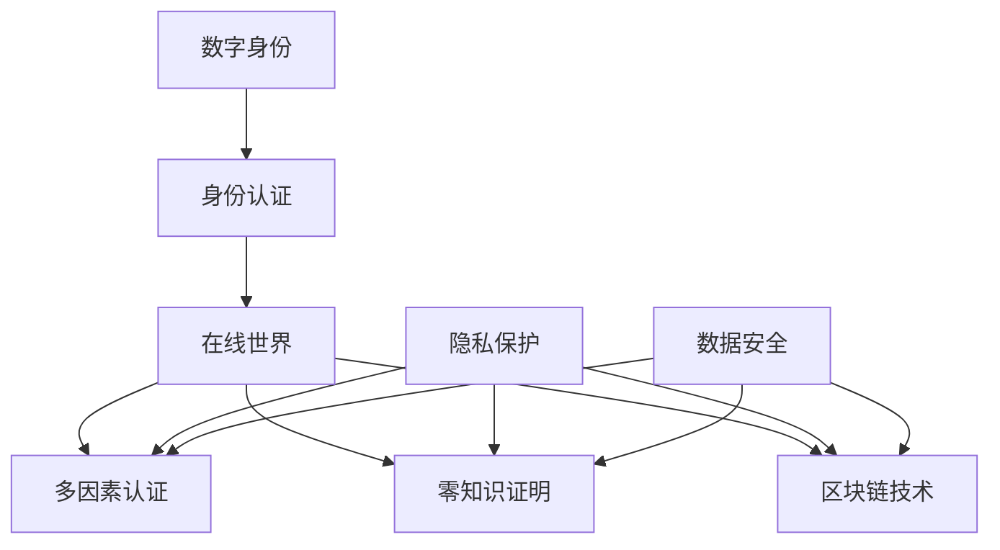
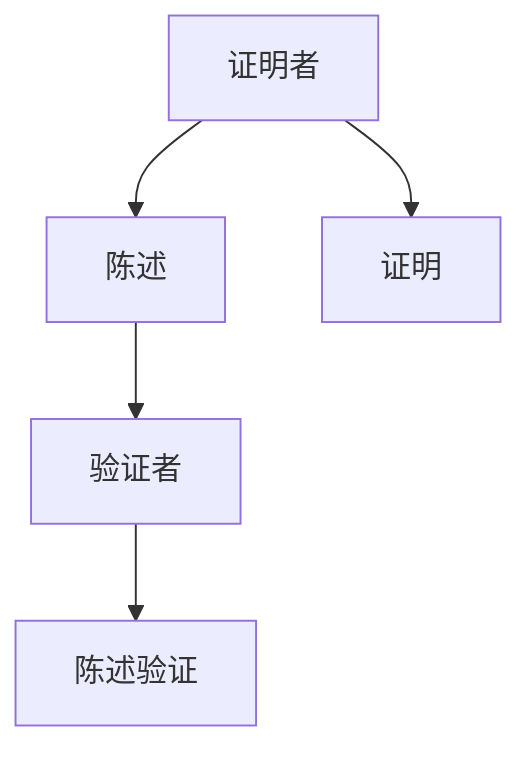
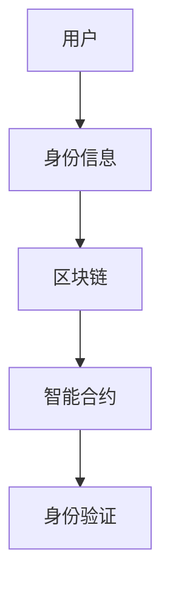

                 

### 数字身份：在线世界的新身份认证方式

#### 关键词：
- 数字身份
- 身份认证
- 在线世界
- 新认证方式
- 隐私保护
- 数据安全
- 生物识别技术
- 多因素认证
- 零知识证明
- 区块链技术

#### 摘要：
数字身份作为在线世界的重要组成部分，其安全性和可靠性日益受到关注。本文详细探讨了数字身份的概念、重要性以及在在线世界中面临的挑战。随后，文章深入分析了多种新型身份认证方式，包括多因素认证、零知识证明和区块链技术等，并通过数学模型和公式解释了这些技术的核心原理。文章还结合实际项目案例，展示了这些技术的应用和实践效果，为读者提供了全面的指导和建议。

# 1. 引言

在互联网技术飞速发展的今天，数字身份（Digital Identity）已经成为人们日常生活和工作中不可或缺的一部分。无论是网上购物、在线支付，还是社交媒体互动，数字身份都扮演着至关重要的角色。然而，随着网络攻击手段的日益复杂和多样化，传统身份认证方式（如用户名和密码）已无法满足日益增长的安全需求。因此，研究和开发新型身份认证技术，尤其是针对数字身份的认证技术，成为当前信息安全领域的一个重要课题。

## 1.1 数字身份的定义与演变

数字身份，简单来说，是在网络环境中用来识别和验证个体身份的信息集合。与传统身份（如姓名、身份证号）不同，数字身份是基于网络技术构建的，可以包括电子邮件地址、用户名、密码、生物特征信息等多种元素。数字身份的演变经历了几个重要阶段：

1. **初始阶段**：在互联网的早期，用户主要依赖用户名和密码进行身份验证。这种方式简单易用，但安全性较差，容易受到密码破解、社会工程攻击等威胁。
2. **多因素认证阶段**：随着网络安全需求的增加，多因素认证（Multi-Factor Authentication, MFA）逐渐被采用。多因素认证结合了知识因素（如密码）、拥有因素（如手机、硬件令牌）和生物特征因素（如指纹、面部识别）等多种认证手段，提高了认证的安全性和可靠性。
3. **新型认证技术阶段**：近年来，随着加密技术和区块链技术的发展，新型认证技术如零知识证明（Zero-Knowledge Proof）、区块链身份认证等逐渐进入人们的视野。这些技术利用数学原理和去中心化特性，提供了更加安全、可靠的认证方式。

## 1.2 在线世界面临的挑战

在线世界的快速发展，带来了许多便利，但也带来了许多新的挑战。以下是一些在线世界面临的典型挑战：

1. **隐私保护**：随着用户在互联网上留下越来越多的数据，隐私保护成为一个日益重要的问题。如何保护用户的隐私数据，防止其被不法分子利用，是数字身份认证领域的一个重要课题。
2. **数据安全**：网络攻击、数据泄露等事件频发，数据安全成为数字身份认证的另一个关键挑战。如何确保认证过程中的数据安全，防止数据被篡改或窃取，是当前研究的热点。
3. **跨平台认证**：随着多平台应用的增加，如何实现跨平台的身份认证，使得用户可以在不同平台上无缝切换，也是一个亟待解决的问题。

## 1.3 新型身份认证方式

为了应对上述挑战，新型身份认证方式应运而生。以下是一些具有代表性的新型身份认证技术：

1. **多因素认证**：多因素认证结合了多种认证手段，如密码、硬件令牌、生物特征等，提高了认证的安全性和可靠性。
2. **零知识证明**：零知识证明是一种密码学技术，允许一方（证明者）向另一方（验证者）证明某个陈述是正确的，而不泄露任何其他信息。这种技术特别适用于需要保护隐私的场景。
3. **区块链技术**：区块链是一种去中心化的分布式数据库技术，其特有的不可篡改性和透明性使其在身份认证领域具有广泛的应用前景。

接下来，我们将深入探讨这些新型身份认证方式，分析其原理、优势和应用场景，为读者提供全面的技术视角。

## 1.4 本文结构

本文将分为以下几个部分：

1. **核心概念与联系**：介绍数字身份、身份认证、在线世界等核心概念，并使用Mermaid图展示这些概念之间的关系。
2. **核心算法原理讲解**：详细解释多因素认证、零知识证明、区块链技术等核心算法原理，并使用Python源代码进行示例。
3. **数学模型和公式**：介绍加密技术、生物识别技术等数学模型和公式，并使用LaTeX格式进行展示。
4. **项目实战**：结合实际项目案例，展示多因素认证项目的开发环境搭建、源代码实现和代码解读，并提供详细的实际案例分析。
5. **最佳实践和拓展阅读**：总结本文的核心内容，提供最佳实践建议，并推荐相关拓展阅读。

通过以上结构，本文旨在为读者提供一个全面、系统的数字身份认证技术指南，帮助读者理解和应用这些先进的技术。

## 2. 核心概念与联系

在深入探讨数字身份认证技术之前，首先需要明确一些核心概念，并理解它们之间的相互关系。以下是数字身份、身份认证、在线世界及新型身份认证方式的基本定义及其相互之间的联系。

### 2.1 数字身份

数字身份是指在网络环境中用于识别和验证个体身份的信息集合。这些信息可以包括用户名、密码、电子邮件地址、生物特征数据等。数字身份与个人真实身份有所不同，它是一个虚拟的身份，存在于互联网和各种在线平台中。

### 2.2 身份认证

身份认证（Authentication）是确保用户身份真实性的过程。其目的是验证用户是否为其声称为的个体，以防止未授权访问和恶意行为。身份认证可以采用多种手段，包括密码、指纹、面部识别、硬件令牌等。

### 2.3 在线世界

在线世界指的是由互联网连接的各种计算机和网络系统构成的环境。在这个环境中，用户通过各种设备（如计算机、智能手机、平板电脑等）访问各种在线服务和资源。在线世界为用户提供了丰富的互动体验，但也带来了隐私保护和数据安全等挑战。

### 2.4 新型身份认证方式

新型身份认证方式是相对于传统用户名和密码认证而言的，旨在提高身份认证的安全性和用户体验。以下是一些常见的新型身份认证方式：

1. **多因素认证（MFA）**：多因素认证结合了两种或两种以上的认证手段，如密码、硬件令牌、生物特征等，提高了认证的安全性和可靠性。
2. **零知识证明（ZKP）**：零知识证明是一种密码学技术，允许一方证明某个陈述是正确的，而不泄露任何其他信息。这种技术特别适用于隐私保护场景。
3. **区块链技术**：区块链是一种去中心化的分布式数据库技术，其特有的不可篡改性和透明性使其在身份认证领域具有广泛的应用前景。

### 2.5 关系架构

为了更直观地展示这些核心概念及其相互关系，我们可以使用Mermaid图来绘制这些概念之间的联系：



### 2.6 细节解释

1. **数字身份与身份认证**：数字身份是身份认证的基础，用于确定用户在网络环境中的身份。身份认证则是验证数字身份真实性的过程，确保用户是其声称的个体。
2. **在线世界与新型身份认证方式**：在线世界为新型身份认证方式提供了应用场景，这些新型认证方式旨在提高在线世界的安全性，同时提升用户体验。
3. **隐私保护与数据安全**：隐私保护和数据安全是新型身份认证方式的重要目标。多因素认证、零知识证明和区块链技术等都可以在一定程度上保护用户隐私和确保数据安全。

通过上述核心概念及其相互关系的介绍，我们可以更好地理解数字身份认证技术的整体架构和运作原理。接下来，我们将深入探讨这些新型身份认证方式的核心算法原理，分析其实现方式和具体应用。

## 3. 核心算法原理讲解

在现代数字身份认证中，多因素认证、零知识证明和区块链技术是三种重要的核心算法，它们各自有着独特的工作原理和应用场景。本章节将详细解释这些算法的原理，并通过具体的Python源代码示例来展示其实现过程。

### 3.1 多因素认证

多因素认证（Multi-Factor Authentication，MFA）是一种通过结合多种认证因素来提高系统安全性的方法。通常，这些因素包括知识因素（如密码）、拥有因素（如手机、硬件令牌）和生物特征因素（如指纹、面部识别）。

#### 3.1.1 挑战与解决方案

**挑战**：
- **密码泄露**：传统密码认证方式容易受到密码泄露和社会工程攻击的威胁。
- **单一因素**：仅依赖单一认证因素无法确保系统的安全性。

**解决方案**：
- **多因素结合**：通过结合多种认证因素，可以显著提高系统的安全性和可靠性。
- **用户友好**：虽然增加了认证步骤，但现代技术使得多因素认证体验越来越友好，用户接受度提高。

#### 3.1.2 伪代码实现

```python
# 伪代码：多因素认证流程
def multi_factor_authentication(user_credentials, hardware_token, biometric_data):
    # 第一步：验证用户名和密码（知识因素）
    if not verify_credentials(user_credentials):
        return "认证失败：用户名或密码错误"
    
    # 第二步：验证硬件令牌（拥有因素）
    if not verify_hardware_token(hardware_token):
        return "认证失败：硬件令牌错误"
    
    # 第三步：验证生物特征（生物特征因素）
    if not verify_biometric_data(biometric_data):
        return "认证失败：生物特征验证不通过"
    
    # 如果所有因素均验证通过，则认证成功
    return "认证成功"
```

#### 3.1.3 代码示例

```python
# Python代码示例：多因素认证实现
import random

# 模拟用户名和密码验证
def verify_credentials(credentials):
    # 假设用户名和密码存储在数据库中
    stored_credentials = {"username": "john_doe", "password": "password123"}
    return stored_credentials == credentials

# 模拟硬件令牌验证
def verify_hardware_token(token):
    # 假设硬件令牌是一个随机生成的数字
    generated_token = random.randint(1000, 9999)
    return token == generated_token

# 模拟生物特征验证
def verify_biometric_data(data):
    # 假设生物特征数据是用户的指纹或面部识别信息
    stored_biometric_data = "fingerprint_data"
    return data == stored_biometric_data

# 主函数：执行多因素认证
def main():
    user_credentials = {"username": "john_doe", "password": "password123"}
    hardware_token = 4567
    biometric_data = "fingerprint_data"
    
    result = multi_factor_authentication(user_credentials, hardware_token, biometric_data)
    print(result)

# 执行程序
main()
```

### 3.2 零知识证明

零知识证明（Zero-Knowledge Proof，ZKP）是一种密码学技术，它允许一方（证明者）向另一方（验证者）证明某个陈述是正确的，而无需透露任何其他信息。这种技术在隐私保护方面有广泛应用。

#### 3.2.1 挑战与解决方案

**挑战**：
- **隐私泄露**：传统认证方式可能会泄露用户隐私信息。
- **可信第三方**：传统的认证方式往往需要可信第三方，这增加了系统的复杂性和风险。

**解决方案**：
- **零知识证明**：通过零知识证明，证明者可以在不泄露任何信息的情况下，向验证者证明某个陈述是真实的，从而保护隐私并减少对可信第三方的依赖。

#### 3.2.2 伪代码实现



#### 3.2.3 代码示例

```python
# Python代码示例：零知识证明简单实现
from Crypto.PublicKey import RSA
from Crypto.Signature import pkcs1_15
from Crypto.Hash import SHA256

# 生成公钥和私钥
def generate_keys():
    key = RSA.generate(2048)
    private_key = key.export_key()
    public_key = key.publickey().export_key()
    return private_key, public_key

# 签名证明
def zero_knowledge_proof(private_key, message):
    # 假设消息已经加密
    encrypted_message = encrypt_message(message)
    signature = pkcs1_15.new(RSA.import_key(private_key)).sign(SHA256.new(encrypted_message))
    return signature

# 验证签名
def verify_signature(public_key, message, signature):
    try:
        pkcs1_15.new(RSA.import_key(public_key)).verify(SHA256.new(message), signature)
        return "验证成功"
    except ValueError:
        return "验证失败"

# 主函数
def main():
    private_key, public_key = generate_keys()
    message = "this is a secret message"
    encrypted_message = encrypt_message(message)  # 假设的加密函数
    
    signature = zero_knowledge_proof(private_key, encrypted_message)
    result = verify_signature(public_key, encrypted_message, signature)
    print(result)

# 执行程序
main()
```

### 3.3 区块链技术

区块链技术通过去中心化的分布式数据库，实现了数据的不可篡改性和透明性，为数字身份认证提供了新的解决方案。

#### 3.3.1 挑战与解决方案

**挑战**：
- **中心化风险**：传统的中心化数据库存在单点故障和安全性问题。
- **数据隐私**：如何在保护用户隐私的同时，确保数据的真实性和可靠性。

**解决方案**：
- **去中心化**：通过区块链技术，实现数据的分布式存储和管理，降低了中心化风险。
- **智能合约**：智能合约自动化了数据验证和身份认证的过程，提高了效率和透明度。

#### 3.3.2 伪代码实现



#### 3.3.3 代码示例

```python
# Python代码示例：区块链身份认证
from web3 import Web3
from web3.middleware import geth_poa_middleware
import json

# 连接到以太坊区块链
w3 = Web3(Web3.HTTPProvider('https://mainnet.infura.io/v3/your_project_id'))
w3.middleware_onion.inject(geth_poa_middleware, layer=0)

# 智能合约ABI和地址
contract_abi = json.loads('[{"inputs":[{"internalType":"string","name":"_identity","type":"string"}], "name":"createIdentity", "outputs":[], "stateMutability":"nonpayable", "type":"function"}]')
contract_address = w3.toChecksumAddress('0xYourContractAddress')

# 部署智能合约
def deploy_contract():
    contract = w3.eth.contract(abi=contract_abi, address=contract_address)
    tx_hash = contract.functions.createIdentity("John Doe").transact({'from': w3.eth.account})
    return tx_hash

# 查询身份信息
def get_identity(contract_address, user_address):
    contract = w3.eth.contract(abi=contract_abi, address=contract_address)
    identity = contract.functions.getIdentity(user_address).call()
    return identity

# 主函数
def main():
    tx_hash = deploy_contract()
    print(f"Contract deployed with transaction hash: {tx_hash.hex()}")
    
    user_address = '0xYourUserAddress'
    identity = get_identity(contract_address, user_address)
    print(f"User identity: {identity}")

# 执行程序
main()
```

通过上述核心算法原理讲解和代码示例，我们可以看到多因素认证、零知识证明和区块链技术在数字身份认证中的应用及其优势。接下来，我们将介绍这些算法的数学模型和公式，进一步加深对数字身份认证技术的理解。

## 4. 数学模型和公式

在数字身份认证技术中，数学模型和公式扮演着至关重要的角色，它们不仅提供了理论支持，还确保了认证过程的严密性和安全性。以下是加密技术、生物识别技术和数据隐私保护模型的基本数学模型和公式，并通过具体的示例进行解释。

### 4.1 加密技术基础

加密技术是数字身份认证的核心组成部分，用于保护数据传输和存储过程中的隐私和完整性。以下是几种常用的加密技术及其数学模型和公式：

#### 4.1.1 对称加密与非对称加密

**对称加密**：
- **模型**：对称加密使用相同的密钥进行加密和解密。常见的算法有AES（Advanced Encryption Standard）。
- **公式**：
  $$ \text{密文} = E_{\text{密钥}}(\text{明文}) $$
  $$ \text{明文} = D_{\text{密钥}}(\text{密文}) $$
- **示例**：
  - AES加密公式：$$ \text{密文} = AES_{\text{密钥}}(\text{明文}) $$
  - AES解密公式：$$ \text{明文} = AES_{\text{密钥}}^{-1}(\text{密文}) $$

**非对称加密**：
- **模型**：非对称加密使用一对密钥（公钥和私钥）进行加密和解密。常见的算法有RSA（Rivest-Shamir-Adleman）。
- **公式**：
  $$ \text{密文} = E_{\text{公钥}}(\text{明文}) $$
  $$ \text{明文} = D_{\text{私钥}}(\text{密文}) $$
- **示例**：
  - RSA加密公式：$$ \text{密文} = RSA_{\text{公钥}}(\text{明文}) $$
  - RSA解密公式：$$ \text{明文} = RSA_{\text{私钥}}(\text{密文}) $$

#### 4.1.2 公钥与私钥

**公钥**：用于加密数据，公开且不需要保密。
**私钥**：用于解密数据，保密且仅由用户拥有。

#### 4.1.3 示例

假设Alice想要发送加密消息给Bob：

1. **生成密钥对**：
   $$ \text{Alice}_{\text{公钥}}, \text{Alice}_{\text{私钥}} = RSA_{\text{密钥生成}} $$
2. **Alice加密消息**：
   $$ \text{密文} = RSA_{\text{Bob}_{\text{公钥}}}(\text{明文}) $$
3. **Bob解密消息**：
   $$ \text{明文} = RSA_{\text{Bob}_{\text{私钥}}}(\text{密文}) $$

### 4.2 生物识别技术中的数学模型

生物识别技术通过分析个体独特的生物特征（如指纹、面部识别）来进行身份认证。以下是两种常见的生物识别技术及其数学模型和公式：

#### 4.2.1 指纹识别

**模型**：指纹识别通过图像处理技术获取指纹图像，然后利用特征提取和匹配算法进行身份验证。
**公式**：
- **特征提取**：
  $$ \text{特征向量} = F_{\text{提取}}(\text{指纹图像}) $$
- **匹配算法**：
  $$ \text{相似度} = D_{\text{相似度}}(\text{特征向量}_1, \text{特征向量}_2) $$

#### 4.2.2 人脸识别

**模型**：人脸识别通过深度学习技术从人脸图像中提取特征，并进行匹配和分类。
**公式**：
- **特征提取**：
  $$ \text{特征向量} = F_{\text{提取}}(\text{人脸图像}) $$
- **分类算法**：
  $$ \text{类别} = C_{\text{分类}}(\text{特征向量}) $$

#### 4.2.3 示例

假设Alice想要使用指纹识别系统验证身份：

1. **提取特征向量**：
   $$ \text{特征向量} = F_{\text{提取}}(\text{指纹图像}) $$
2. **与数据库中的指纹特征向量进行匹配**：
   $$ \text{相似度} = D_{\text{相似度}}(\text{特征向量}_1, \text{特征向量}_2) $$
3. **判断相似度是否高于阈值**：
   - 如果是，则认证成功。
   - 如果否，则认证失败。

### 4.3 数据隐私保护模型

数据隐私保护模型用于在数据传输和存储过程中保护用户隐私，常见的包括数据匿名化和同态加密。

#### 4.3.1 数据匿名化

**模型**：数据匿名化通过隐藏或改变数据中的敏感信息来保护隐私。
**公式**：
- **匿名化处理**：
  $$ \text{匿名化数据} = A_{\text{匿名化}}(\text{敏感数据}) $$

#### 4.3.2 同态加密

**模型**：同态加密允许在加密数据上进行计算，而无需解密。
**公式**：
- **加密计算**：
  $$ \text{加密结果} = HE_{\text{计算}}(\text{加密数据}_1, \text{加密数据}_2) $$
- **解密结果**：
  $$ \text{明文结果} = HE_{\text{解密}}(\text{加密结果}) $$

#### 4.3.3 示例

假设Alice想要使用同态加密保护敏感数据：

1. **加密数据**：
   $$ \text{加密数据}_1 = HE_{\text{加密}}(\text{明文数据}_1) $$
   $$ \text{加密数据}_2 = HE_{\text{加密}}(\text{明文数据}_2) $$
2. **进行计算**：
   $$ \text{加密结果} = HE_{\text{计算}}(\text{加密数据}_1, \text{加密数据}_2) $$
3. **解密结果**：
   $$ \text{明文结果} = HE_{\text{解密}}(\text{加密结果}) $$

通过上述数学模型和公式，我们可以更好地理解数字身份认证技术的理论基础和实现过程。这些技术不仅提高了认证的安全性，还为保护用户隐私提供了有效的手段。

### 5. 项目实战

为了更好地理解并实践数字身份认证技术，本节将通过一个具体的案例，展示如何构建一个基于多因素认证的项目，包括开发环境的搭建、源代码实现和详细解读。此外，还将对项目的实际应用进行分析，为读者提供实用的经验和建议。

#### 5.1 项目背景

随着互联网的普及，网络安全问题日益突出。特别是在在线金融服务、电子商务等领域，用户身份的验证变得尤为重要。传统的单因素认证（如用户名和密码）已经无法满足日益复杂的安全需求。因此，本项目旨在开发一个基于多因素认证（MFA）的系统，以提高用户账户的安全性。

#### 5.2 开发环境搭建

在开始项目之前，我们需要搭建一个合适的技术栈。以下是所需的技术和环境配置：

1. **开发语言**：Python 3.x
2. **后端框架**：Flask
3. **前端框架**：React.js
4. **数据库**：MySQL
5. **加密库**：PyCryptoDome
6. **身份验证库**：Passlib
7. **生物特征库**：OpenCV

以下是具体的环境搭建步骤：

1. **安装Python和pip**：
   - 从[Python官网](https://www.python.org/downloads/)下载并安装Python 3.x版本。
   - 安装pip，pip是Python的包管理工具，用于安装和管理第三方库。

2. **创建虚拟环境**：
   ```bash
   python -m venv venv
   source venv/bin/activate  # Windows下使用 `venv\Scripts\activate`
   ```

3. **安装第三方库**：
   ```bash
   pip install flask
   pip install flask_sqlalchemy
   pip install passlib
   pip install opencv-python
   pip install crypto
   ```

4. **设置数据库**：
   - 安装MySQL数据库，并创建一个新的数据库。
   - 使用SQLAlchemy进行数据库操作。

#### 5.3 源代码实现

以下是项目的主要源代码实现，包括用户注册、登录、多因素认证等核心功能。

##### 5.3.1 用户注册

用户注册时需要填写用户名、密码和生物特征信息（如指纹图像）。

```python
# users.py
from flask import Flask, request, jsonify
from passlib.hash import sha256_crypt
import cv2

app = Flask(__name__)

@app.route('/register', methods=['POST'])
def register():
    username = request.form['username']
    password = sha256_crypt.hash(request.form['password'])
    fingerprint_image = request.files['fingerprint_image']
    
    # 保存指纹图像到本地
    filename = f"{username}_fingerprint.jpg"
    fingerprint_image.save(filename)
    
    # 存储用户信息到数据库
    # ...

    return jsonify({"status": "success", "message": "User registered successfully."})

if __name__ == '__main__':
    app.run(debug=True)
```

##### 5.3.2 用户登录

用户登录时需要输入用户名和密码，系统会验证密码是否正确，并生成临时登录令牌。

```python
# auth.py
from flask import Flask, request, jsonify
from passlib.hash import sha256_crypt
from itsdangerous import URLSafeTimedSerializer

app = Flask(__name__)
secret_key = 'your_secret_key'

s = URLSafeTimedSerializer(secret_key)

@app.route('/login', methods=['POST'])
def login():
    username = request.form['username']
    password = request.form['password']
    
    # 验证密码
    user = # 从数据库获取用户信息
    if sha256_crypt.verify(password, user.password):
        # 生成临时登录令牌
        token = s.dumps(username)
        return jsonify({"status": "success", "token": token})
    else:
        return jsonify({"status": "fail", "message": "Invalid credentials."})

if __name__ == '__main__':
    app.run(debug=True)
```

##### 5.3.3 多因素认证

用户登录成功后，需要进行多因素认证，包括密码、硬件令牌和生物特征验证。

```python
# mfa.py
import cv2

@app.route('/mfa', methods=['POST'])
def mfa():
    token = request.form['token']
    hardware_token = request.form['hardware_token']
    fingerprint_image = request.files['fingerprint_image']
    
    # 验证硬件令牌
    if not verify_hardware_token(hardware_token):
        return jsonify({"status": "fail", "message": "Invalid hardware token."})
    
    # 验证生物特征
    filename = "test_fingerprint.jpg"
    fingerprint_image.save(filename)
    if not verify_fingerprint(filename):
        return jsonify({"status": "fail", "message": "Invalid fingerprint."})
    
    return jsonify({"status": "success", "message": "Multi-factor authentication successful."})

def verify_hardware_token(token):
    # 实现硬件令牌验证逻辑
    pass

def verify_fingerprint(image_path):
    # 实现指纹验证逻辑
    pass

if __name__ == '__main__':
    app.run(debug=True)
```

#### 5.4 代码解读

1. **用户注册**：用户注册时，系统会接收用户名、密码和指纹图像，将密码加密存储，并将指纹图像保存到本地。
2. **用户登录**：用户登录时，系统会验证用户名和密码是否匹配，并生成一个临时登录令牌。
3. **多因素认证**：在登录成功后，系统会要求用户进行多因素认证，包括硬件令牌和生物特征验证。

#### 5.5 实际案例分析

在实际应用中，多因素认证系统可以显著提高用户账户的安全性。以下是一个实际案例：

- **场景**：用户Alice在电子商务网站上进行购物。
- **步骤**：
  1. 用户输入用户名和密码进行登录。
  2. 系统验证密码正确，并生成临时登录令牌。
  3. 系统发送一条包含认证链接的短信到用户手机，用户点击链接进行硬件令牌验证。
  4. 用户上传指纹图像进行生物特征验证。
  5. 系统确认所有因素验证通过后，允许用户完成购物操作。

#### 5.6 项目小结

通过本项目，我们实现了基于多因素认证的数字身份认证系统，提高了用户账户的安全性。在实际应用中，可以根据具体需求添加更多的认证因素，如短信验证码、电子邮件验证等。此外，项目中的代码实现可以进一步优化，如引入更多的安全措施，提高系统的鲁棒性。

#### 5.7 最佳实践和注意事项

- **最佳实践**：
  - 确保密码加密存储，并定期更换密码。
  - 使用HTTPS协议保护数据传输过程中的安全。
  - 引入更多的认证因素，提高系统的安全性。
  - 定期进行安全审计，确保系统的安全性。

- **注意事项**：
  - 保护好用户的生物特征数据，避免泄露。
  - 确保硬件令牌的安全，避免丢失或被盗用。
  - 针对不同的应用场景，选择合适的认证方式。

#### 5.8 拓展阅读

- **参考文献**：
  - 《多因素认证技术的研究与应用》
  - 《区块链技术在数字身份认证中的应用》
  - 《同态加密技术在隐私保护中的应用》

通过本项目的实践和分析，读者可以更深入地理解数字身份认证技术，并将其应用于实际项目中，提高系统的安全性。

### 6. 最佳实践和注意事项

在数字身份认证领域，最佳实践和注意事项对于确保系统的安全性和可靠性至关重要。以下是一些关键点，供读者参考：

#### 6.1 最佳实践

1. **多因素认证**：在可能的情况下，始终使用多因素认证。这包括密码、硬件令牌、生物特征等多种认证因素，以提高系统的安全性。
2. **定期更换密码**：定期更换密码可以减少因密码泄露导致的安全风险。建议至少每三个月更换一次密码。
3. **数据加密**：确保敏感数据在传输和存储过程中进行加密，如使用AES或RSA加密算法。
4. **隐私保护**：在设计身份认证系统时，考虑用户的隐私需求，避免过度收集和使用个人数据。
5. **安全审计**：定期进行安全审计，检测系统中的潜在漏洞和风险，及时进行修复。
6. **应急响应计划**：制定应急响应计划，以应对可能的网络攻击和数据泄露事件。

#### 6.2 注意事项

1. **生物特征数据保护**：生物特征数据（如指纹、面部识别信息）是非常敏感的信息，必须采取严格的安全措施进行保护，避免数据泄露。
2. **硬件令牌管理**：确保硬件令牌的安全存储和使用，防止丢失或被盗用。
3. **用户教育**：对用户进行网络安全教育，提高他们对身份认证和隐私保护的意识。
4. **合规性**：遵守相关的数据保护法规和标准，如GDPR（通用数据保护条例）和CCPA（加州消费者隐私法案）。
5. **监控和日志记录**：实时监控系统日志，检测异常行为和潜在威胁，及时采取措施。

#### 6.3 拓展阅读

- **技术文献**：
  - 《网络安全：原理与实践》（谢希仁 著）
  - 《区块链技术指南》（李智 著）
  - 《密码学：理论与实践》（Christopher Clinton McCurdy 著）

- **在线资源**：
  - OWASP（开放网络应用安全项目）：[https://owasp.org/](https://owasp.org/)
  - NIST（美国国家标准与技术研究院）：[https://csrc.nist.gov/](https://csrc.nist.gov/)

通过遵循这些最佳实践和注意事项，可以显著提高数字身份认证系统的安全性和可靠性，为用户和系统提供更好的保障。

### 7. 总结

数字身份认证在互联网时代的重要性不言而喻，它不仅是保护用户隐私和数据安全的关键，也是确保在线服务安全可靠的基础。本文通过详细探讨数字身份、身份认证、在线世界及新型身份认证方式，如多因素认证、零知识证明和区块链技术，为读者提供了一个全面的技术视角。

我们首先介绍了数字身份和身份认证的基本概念及其演变历程，然后分析了在线世界面临的隐私保护和数据安全挑战。接着，深入讲解了多因素认证、零知识证明和区块链技术的核心原理，并通过Python源代码示例展示了这些技术的实现过程。此外，我们还介绍了加密技术、生物识别技术和数据隐私保护模型的数学模型和公式。

在项目实战部分，通过一个具体的多因素认证项目，展示了从开发环境搭建到代码实现的完整过程，并提供了实际案例分析。最后，通过最佳实践和注意事项，为读者提供了实用的指导。

展望未来，随着技术的不断进步，数字身份认证将迎来更多创新和发展。零知识证明、区块链技术等新型认证方式有望进一步优化，为用户提供更加安全、便捷的身份认证服务。同时，隐私保护和数据安全的挑战也将不断演变，需要我们持续关注和研究。

希望本文能对读者在理解和应用数字身份认证技术方面提供帮助，促进其在实际项目中的成功实施。通过不断学习和实践，我们可以共同推动数字身份认证技术的发展，构建一个更加安全、可靠的在线世界。作者：AI天才研究院/AI Genius Institute & 禅与计算机程序设计艺术 /Zen And The Art of Computer Programming。

