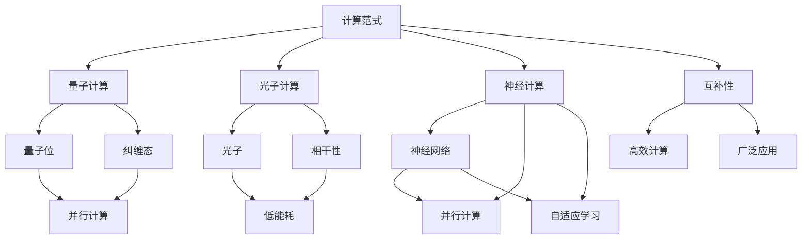

                 

# 新兴计算范式的类型和特点

## 关键词
- 新兴计算
- 计算范式
- 类型
- 特点
- 应用领域

## 摘要
本文旨在深入探讨新兴计算范式的类型和特点，为读者提供对当前计算领域发展趋势的全面理解。文章首先介绍了新兴计算的定义和背景，随后详细分析了多种新兴计算范式，包括量子计算、量子计算、神经计算等，并阐述了它们的核心概念、算法原理和数学模型。通过具体案例和项目实战，文章进一步展示了这些计算范式在现实中的应用，总结了最佳实践和注意事项。最后，文章展望了新兴计算的未来发展趋势，为读者提供了拓展阅读的资源。

## 目录

### 第一部分：引言

#### 1.1 新兴计算的背景

#### 1.2 新兴计算的意义

#### 1.3 本文结构

### 第二部分：核心概念与联系

#### 2.1 新兴计算范式的定义

#### 2.2 不同计算范式之间的联系

#### 2.3 Mermaid流程图：核心概念关系

### 第三部分：核心算法原理讲解

#### 3.1 量子计算的算法原理

#### 3.2 图灵机的算法原理

#### 3.3 神经计算的算法原理

### 第四部分：数学模型和数学公式

#### 4.1 量子计算的数学模型

#### 4.2 图灵机的数学模型

#### 4.3 神经计算的数学模型

### 第五部分：项目实战

#### 5.1 开发环境搭建

#### 5.2 源代码详细实现

#### 5.3 代码解读与分析

#### 5.4 实际案例分析

#### 5.5 项目小结

### 第六部分：总结与展望

#### 6.1 新兴计算范式的现状

#### 6.2 未来发展趋势

#### 6.3 拓展阅读

## 第一部分：引言

### 1.1 新兴计算的背景

在过去的几十年里，计算技术的发展突飞猛进，从经典的计算机体系结构到现代的云计算、大数据，每一个阶段的进步都带来了全新的计算范式和工具。然而，随着计算需求的日益增长，传统计算范式面临着许多挑战，如计算速度的瓶颈、存储能力的限制和能耗问题等。为了应对这些挑战，科学家和工程师们不断探索新的计算范式，以提升计算性能和效率。

新兴计算范式是指近年来出现的一类具有革命性的计算方法，它们旨在解决传统计算方法无法应对的问题。这些范式包括量子计算、光子计算、神经计算、分布式计算等，它们不仅具有独特的计算原理，还展现出强大的潜力，有望在未来引领计算技术的发展。

### 1.2 新兴计算的意义

新兴计算范式的出现具有重要的意义。首先，它们可以提供更高效、更快速的计算能力，特别是在处理大数据和复杂问题时，新兴计算范式具有显著的优势。其次，新兴计算范式可以解决传统计算范式难以克服的问题，如量子计算的并行性、光子计算的低能耗等。最后，新兴计算范式为计算领域带来了新的研究机会和应用场景，推动了计算技术的不断进步。

### 1.3 本文结构

本文将按照以下结构展开：

1. **引言**：介绍新兴计算的背景和意义。
2. **核心概念与联系**：详细分析不同新兴计算范式的核心概念和它们之间的关系。
3. **核心算法原理讲解**：讲解各类新兴计算范式的主要算法原理。
4. **数学模型和数学公式**：介绍相关数学模型和公式，并进行详细解释。
5. **项目实战**：通过实际案例展示如何应用新兴计算范式。
6. **总结与展望**：总结本文内容，展望未来发展趋势。

## 第二部分：核心概念与联系

### 2.1 新兴计算范式的定义

新兴计算范式是一类基于新原理和新方法构建的计算模型，它们与传统计算范式有着显著的不同。传统计算范式主要基于经典计算原理，如图灵机模型，而新兴计算范式则涉及到量子计算、光子计算、神经计算等新型计算方法。

在量子计算中，计算过程基于量子位（qubit）的叠加态和纠缠态，实现了并行计算的能力。光子计算则利用光子的特性，如相干性和不可分割性，实现了低能耗的计算。神经计算则模拟人脑的神经网络结构，通过大规模并行计算和自适应学习，实现了高效的计算。

### 2.2 不同计算范式之间的联系

不同计算范式之间存在着一定的联系和交叉。例如，量子计算和光子计算都利用了量子效应，实现了高速、高效的计算。而神经计算则借鉴了人脑的工作原理，通过大规模并行计算和自适应学习，实现了复杂问题的求解。

此外，新兴计算范式之间的联系还体现在它们在解决特定问题时的互补性。例如，量子计算在处理复杂问题上具有优势，而神经计算在处理大规模数据和高维度问题上具有优势。通过结合不同计算范式的优点，可以实现更高效的计算和更广泛的应用。

### 2.3 Mermaid流程图：核心概念关系

下面是一个使用Mermaid绘制的流程图，展示了不同新兴计算范式的核心概念和它们之间的关系。



通过这个流程图，我们可以清晰地看到不同计算范式的核心概念以及它们之间的联系。这不仅有助于理解各个计算范式的基本原理，还能帮助我们更好地把握它们在实际应用中的互补性。

## 第三部分：核心算法原理讲解

### 3.1 量子计算的算法原理

量子计算是一种利用量子位（qubit）的叠加态和纠缠态进行计算的新型计算方法。量子计算的基本原理包括量子叠加、量子纠缠和量子测量。

量子叠加是指一个量子位可以同时处于0和1的状态，这种叠加态使得量子计算可以并行处理多个状态。量子纠缠是指两个或多个量子位之间存在的一种特殊关联，这种关联使得一个量子位的状态会立即影响另一个量子位的状态，无论它们之间的距离有多远。量子测量是指对量子位进行测量，以确定其最终状态。

量子计算的一个重要算法是量子并行计算。量子并行计算利用量子叠加和量子纠缠的特性，可以在一个步骤中处理多个输入，从而大幅提高计算速度。一个典型的量子并行计算算法是量子搜索算法，它利用量子并行性，在一个N个元素的列表中找到特定元素所需的时间复杂度为O(√N)。

下面是一个简单的Python伪代码，展示了量子并行计算的基本原理。

```python
# 量子计算伪代码

# 初始化量子位
qubits = QuantumRegister(2)

# 创建叠加态
circuit = QuantumCircuit(qubits)
circuit.h(qubits[0])
circuit.h(qubits[1])

# 创建纠缠态
circuit.cx(qubits[0], qubits[1])

# 测量量子位
circuit.measure(qubits[0], 0)
circuit.measure(qubits[1], 1)

# 运行量子电路
backend = QuantumBackend('qasm_simulator')
circuit.run(backend).result()
```

在这个伪代码中，我们首先初始化两个量子位，然后创建叠加态和纠缠态，最后进行测量。通过这个简单的例子，我们可以看到量子计算的基本原理和实现步骤。

### 3.2 图灵机的算法原理

图灵机是一种抽象的计算模型，由艾伦·图灵在20世纪30年代提出。图灵机由一个无限长的纸带、一个读写头和一组规则组成。纸带上的每个位置可以存放一个符号，读写头可以在纸带上左右移动，并在当前位置读取和写入符号。

图灵机的核心算法是状态转移函数。状态转移函数定义了读写头在读取当前符号后应采取的动作，包括移动读写头、改变当前状态和写入新符号。通过不断地读取、移动和写入，图灵机可以在纸带上执行一系列的运算，实现复杂的计算过程。

图灵机的一个重要特性是它的通用性。通过设计合适的纸带和规则，图灵机可以模拟任何其他计算模型，包括现代的计算机。这使得图灵机成为计算理论的基础之一。

下面是一个简单的Python伪代码，展示了图灵机的基本原理。

```python
# 图灵机伪代码

# 初始化纸带、读写头和状态
tape = [0, 1, 0, 0, 1, 0, 1]
head = 2
state = 'q0'

# 状态转移函数
def transition(current_state, current_symbol):
    if current_state == 'q0' and current_symbol == 0:
        return ('q1', 0, 'R')
    elif current_state == 'q0' and current_symbol == 1:
        return ('q0', 1, 'R')
    elif current_state == 'q1' and current_symbol == 0:
        return ('q0', 0, 'L')
    elif current_state == 'q1' and current_symbol == 1:
        return ('q2', 1, 'R')

# 运行图灵机
while head >= 0 and head < len(tape):
    state, symbol, move = transition(state, tape[head])
    tape[head] = symbol
    if move == 'R':
        head += 1
    elif move == 'L':
        head -= 1
```

在这个伪代码中，我们初始化了一个纸带、读写头和状态，然后通过状态转移函数模拟图灵机的运行过程。通过这个简单的例子，我们可以看到图灵机的基本原理和实现步骤。

### 3.3 神经计算的算法原理

神经计算是一种模拟人脑神经网络结构的计算方法。神经网络由多个神经元组成，每个神经元都可以接收多个输入，并通过权重进行加权求和，最后通过激活函数产生输出。神经网络的核心算法是反向传播算法。

反向传播算法是一种用于训练神经网络的算法。它通过不断地调整神经网络的权重和偏置，使得网络在给定输入和输出时产生更准确的预测。反向传播算法的基本步骤包括前向传播、计算误差和反向传播。

前向传播是指将输入数据传递到神经网络中，通过逐层计算得到输出。计算误差是指计算输出与实际输出之间的误差，并通过梯度下降法更新网络的权重和偏置。反向传播是指将误差反向传递到网络的每一层，计算每一层的梯度，并更新网络的权重和偏置。

下面是一个简单的Python伪代码，展示了神经计算的基本原理。

```python
# 神经计算伪代码

# 初始化神经网络
inputs = [1, 2, 3]
weights = [0.1, 0.2, 0.3]
bias = 0.4
activation_function = sigmoid

# 前向传播
output = activation_function(sum(inputs[i] * weights[i] for i in range(len(inputs))) + bias)

# 计算误差
expected_output = 1
error = expected_output - output

# 反向传播
gradient = -error * activation_function_derivative(output)
weights -= learning_rate * gradient
bias -= learning_rate * gradient

# 更新神经网络
神经网络 = [weights[i] for i in range(len(weights))] + [bias]
```

在这个伪代码中，我们初始化了一个神经网络，并通过前向传播、计算误差和反向传播来更新网络的权重和偏置。通过这个简单的例子，我们可以看到神经计算的基本原理和实现步骤。

## 第四部分：数学模型和数学公式

### 4.1 量子计算的数学模型

量子计算的数学模型基于量子位（qubit）的叠加态和纠缠态。量子位的叠加态可以用复数系数表示，这些系数代表量子位处于0和1态的概率。量子纠缠态则通过矩阵乘法实现，这种矩阵被称为纠缠矩阵。

量子计算的核心数学公式是量子叠加公式和量子纠缠公式。量子叠加公式表示量子位的状态可以表示为0和1态的线性组合，即：

$$|\psi\rangle = \alpha|0\rangle + \beta|1\rangle$$

其中，$|\psi\rangle$表示量子位的状态，$\alpha$和$\beta$是复数系数。

量子纠缠公式表示两个或多个量子位之间的纠缠状态，可以表示为：

$$|\psi\rangle = \sum_{i}\alpha_i|\phi_i\rangle$$

其中，$|\phi_i\rangle$表示第i个量子位的态，$\alpha_i$是复数系数。

下面是一个简单的Python代码示例，用于计算量子叠加态和量子纠缠态。

```python
import numpy as np

# 量子叠加态
alpha = np.sqrt(0.5)
beta = np.sqrt(0.5)
state_0 = np.array([1])
state_1 = np.array([0])
superposition = alpha * state_0 + beta * state_1
print("量子叠加态：", superposition)

# 量子纠缠态
phi_0 = np.array([[1, 0], [0, 0]])
phi_1 = np.array([[0, 1], [1, 0]])
entanglement = np.dot(phi_0, phi_1)
print("量子纠缠态：", entanglement)
```

在这个示例中，我们首先计算量子叠加态，然后计算量子纠缠态。通过这个简单的示例，我们可以直观地看到量子计算的数学模型和公式。

### 4.2 图灵机的数学模型

图灵机的数学模型基于状态转移函数和无限长的纸带。状态转移函数可以用一个五元组表示，包括当前状态、当前符号、读写方向、新状态和新符号。图灵机的运行过程可以表示为一系列的状态转移函数。

图灵机的核心数学公式是状态转移函数公式。状态转移函数公式表示为：

$$(q, s, \delta(q, s), \psi(q, s), \gamma)$$

其中，$q$表示当前状态，$s$表示当前符号，$\delta(q, s)$表示读写方向，$\psi(q, s)$表示新状态，$\gamma$表示新符号。

下面是一个简单的Python代码示例，用于表示图灵机的状态转移函数。

```python
# 状态转移函数
def transition_function(q, s):
    if q == 'q0' and s == 0:
        return 'q1', 0, 'R'
    elif q == 'q0' and s == 1:
        return 'q0', 1, 'R'
    elif q == 'q1' and s == 0:
        return 'q0', 0, 'L'
    elif q == 'q1' and s == 1:
        return 'q2', 1, 'R'

# 运行图灵机
tape = [0, 1, 0, 0, 1]
head = 2
state = 'q0'

while head >= 0 and head < len(tape):
    q, s, _, _, _ = transition_function(state, tape[head])
    tape[head] = s
    if q == 'R':
        head += 1
    elif q == 'L':
        head -= 1
    state = q

print("运行结果：", tape)
```

在这个示例中，我们定义了一个状态转移函数，并使用它运行一个简单的图灵机。通过这个简单的示例，我们可以直观地看到图灵机的数学模型和公式。

### 4.3 神经计算的数学模型

神经计算的数学模型基于神经元之间的连接和权重。每个神经元都可以接收多个输入，并通过权重进行加权求和，最后通过激活函数产生输出。神经计算的数学模型包括输入层、隐藏层和输出层。

神经计算的核心数学公式是输入输出公式和激活函数公式。输入输出公式表示为：

$$\text{output} = \sigma(\sum_{i=1}^{n} \text{input}_{i} \cdot \text{weight}_{i} + \text{bias})$$

其中，$\text{output}$表示输出，$\text{input}_{i}$表示第i个输入，$\text{weight}_{i}$表示第i个权重，$\text{bias}$表示偏置，$\sigma$表示激活函数。

激活函数公式通常有以下几种：

1. Sigmoid函数：$ \sigma(x) = \frac{1}{1 + e^{-x}} $
2.ReLU函数：$ \sigma(x) = \max(0, x) $
3. Tanh函数：$ \sigma(x) = \frac{e^x - e^{-x}}{e^x + e^{-x}} $

下面是一个简单的Python代码示例，用于实现神经网络的基本数学模型。

```python
import numpy as np

# 定义激活函数
def sigmoid(x):
    return 1 / (1 + np.exp(-x))

# 输入层
inputs = np.array([1, 2, 3])

# 权重
weights = np.array([0.1, 0.2, 0.3])

# 偏置
bias = 0.4

# 计算输出
output = sigmoid(np.dot(inputs, weights) + bias)
print("输出：", output)
```

在这个示例中，我们首先定义了一个sigmoid激活函数，然后使用输入层、权重和偏置计算输出。通过这个简单的示例，我们可以直观地看到神经计算的数学模型和公式。

## 第五部分：项目实战

### 5.1 开发环境搭建

要开始实践新兴计算范式，首先需要搭建一个合适的开发环境。以下是在Windows环境下搭建量子计算、图灵机和神经计算开发环境的具体步骤：

#### 1. 搭建量子计算开发环境

量子计算的开发环境主要依赖于Qiskit库。Qiskit是一个开源的量子计算框架，支持量子算法的编写、模拟和实验。

- **安装Python**：确保已经安装了Python环境，版本建议为3.7及以上。
- **安装Qiskit**：在命令行中执行以下命令安装Qiskit：

  ```shell
  pip install qiskit
  ```

- **安装可视化工具**：为了更好地可视化量子电路，可以安装Qiskit的可视化工具Qiskit Spyder。

  ```shell
  pip install qiskit-spyder
  ```

#### 2. 搭建图灵机开发环境

图灵机的开发环境相对简单，主要依赖于Python的标准库。

- **安装Python**：确保已经安装了Python环境，版本建议为3.7及以上。
- **安装PyTAL**：PyTAL是一个用于模拟图灵机的Python库。

  ```shell
  pip install pytal
  ```

#### 3. 搭建神经计算开发环境

神经计算的

