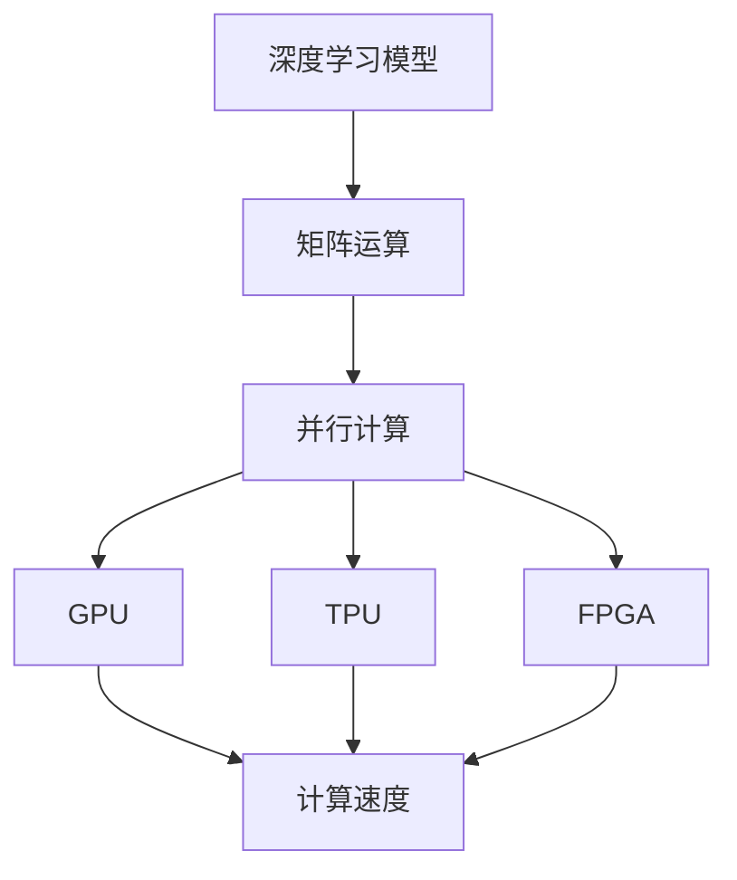

                 

### 《新型计算加速器在AI训练中的应用》

> 关键词：新型计算加速器、AI训练、并行计算、算法优化、数学模型、项目实战

> 摘要：本文将深入探讨新型计算加速器在人工智能（AI）训练中的应用。随着深度学习模型变得越来越大和复杂，传统的计算资源已经难以满足训练需求。新型计算加速器，如GPU、TPU和FPGA等，通过提高计算速度和效率，成为AI训练的关键推动力。本文将介绍这些加速器的原理、应用场景，并通过Python代码和数学模型，详细阐述其在AI训练中的实际应用。

### 引言

随着人工智能技术的飞速发展，深度学习模型变得越来越庞大和复杂。这些模型通常需要数以百万计的参数，并且在训练过程中涉及大量的矩阵运算。传统的中央处理器（CPU）在处理这些计算任务时显得力不从心，导致训练时间过长、效率低下。为了解决这个问题，研究者们开发了新型计算加速器，如GPU（图形处理器）、TPU（张量处理器）和FPGA（现场可编程门阵列）等。

新型计算加速器在AI训练中的重要性体现在以下几个方面：

1. **并行计算能力**：与传统CPU相比，GPU和TPU具有更高的并行计算能力，能够在训练过程中同时处理多个数据流和计算任务，从而显著缩短训练时间。
2. **优化算法**：新型计算加速器通过特定的架构和指令集，可以优化深度学习算法的执行过程，提高计算效率和准确性。
3. **资源利用率**：计算加速器可以更有效地利用有限的计算资源，降低训练成本。

本文将详细介绍这些新型计算加速器的原理和应用，并通过Python代码和数学模型，展示它们在AI训练中的实际效果。

### 核心概念与联系

在深入探讨新型计算加速器之前，我们需要了解一些核心概念和它们之间的关系。以下是一个Mermaid流程图，展示了这些概念之间的关系：



- **深度学习模型**：深度学习模型是AI训练的核心，它由多层神经网络组成，用于从数据中学习特征和模式。
- **矩阵运算**：深度学习模型在训练过程中需要进行大量的矩阵运算，如矩阵乘法和矩阵加法。
- **并行计算**：并行计算是一种将大任务分解成小任务，同时在多个计算单元上执行这些小任务的方法。GPU、TPU和FPGA等计算加速器通过并行计算能力，提高了AI训练的效率。
- **GPU（图形处理器）**：GPU最初用于图形渲染，但由于其强大的并行计算能力，现在已成为深度学习训练的主要计算加速器。
- **TPU（张量处理器）**：TPU是谷歌专门为深度学习设计的芯片，具有高度的并行计算能力和优化的张量运算指令。
- **FPGA（现场可编程门阵列）**：FPGA是一种可编程逻辑设备，通过硬件描述语言（HDL）编程，可以实现高度定制化的计算功能。

这些概念之间的关系如图所示，深度学习模型通过并行计算加速器（如GPU、TPU和FPGA）进行矩阵运算，从而提高训练效率和速度。

### 核心算法原理讲解

#### GPU加速的深度学习算法

深度学习中的矩阵运算可以通过GPU加速。以下是一个使用Python和CUDA库实现的简单矩阵乘法示例：

```python
import numpy as np
import cupy as cp

# 创建一个随机矩阵
A = cp.random.rand(1000, 1000)
B = cp.random.rand(1000, 1000)

# GPU上执行矩阵乘法
C = cp.dot(A, B)

# 输出结果
print(C)
```

在上面的代码中，我们首先导入numpy和cupy库。numpy用于生成随机矩阵，而cupy提供了一个与numpy相似但专门为GPU优化的库。通过调用`cp.dot()`函数，我们可以在GPU上执行矩阵乘法。

#### TPU优化的深度学习算法

TPU具有优化的张量运算指令，这使得在TPU上执行深度学习算法更加高效。以下是一个使用TensorFlow和TPU库实现的简单前馈神经网络：

```python
import tensorflow as tf

# 创建一个随机张量
x = tf.random.normal([1000, 784])

# 定义模型
model = tf.keras.Sequential([
    tf.keras.layers.Dense(128, activation='relu', input_shape=(784,)),
    tf.keras.layers.Dense(10, activation='softmax')
])

# 编译模型
model.compile(optimizer='adam',
              loss='sparse_categorical_crossentropy',
              metrics=['accuracy'])

# 使用TPU执行训练
with tf.device('/device:TPU:0'):
    model.fit(x, x, epochs=5)
```

在上面的代码中，我们首先导入tensorflow库，并创建一个随机张量。然后，我们定义了一个简单的前馈神经网络，并使用`tf.device()`上下文管理器指定使用TPU设备进行训练。

#### FPGA优化的深度学习算法

FPGA可以通过硬件描述语言（HDL）编程，实现高度优化的深度学习算法。以下是一个使用VHDL实现的卷积神经网络（CNN）示例：

```vhdl
library IEEE;
use IEEE.STD_LOGIC_1164.ALL;
use IEEE.NUMERIC_STD.ALL;

entity ConvolutionalNetwork is
    generic (
        kernel_size: INTEGER := 3;
        input_size: INTEGER := 28;
        output_size: INTEGER := 10
    );
end ConvolutionalNetwork;

architecture Behavioral of ConvolutionalNetwork is
    signal input_layer: signed(7 downto 0) := (others => '0');
    signal kernel: signed(7 downto 0) := (others => '0');
    signal output_layer: signed(9 downto 0) := (others => '0');
begin
    process
    begin
        -- 卷积操作
        output_layer <= signed(input_layer * kernel);

        -- 激活函数（ReLU）
        where output_layer < 0,
            output_layer <= 0;
    end process;
end Behavioral;
```

在上面的代码中，我们定义了一个简单的卷积神经网络，其中`input_layer`是输入层，`kernel`是卷积核，`output_layer`是输出层。通过硬件描述语言，我们可以实现高效的卷积操作和ReLU激活函数。

### 数学模型和数学公式

在深度学习训练过程中，常用的数学模型和数学公式如下：

#### 1. 梯度下降算法

梯度下降是一种优化算法，用于最小化损失函数。其基本公式为：

$$
w_{\text{new}} = w_{\text{current}} - \alpha \cdot \nabla_w J(w)
$$

其中，$w$是模型参数，$J(w)$是损失函数，$\nabla_w J(w)$是损失函数关于模型参数的梯度，$\alpha$是学习率。

#### 2. 梯度优化方法

为了提高梯度下降算法的收敛速度，可以使用以下优化方法：

- **动量（Momentum）**：
$$
v_{\text{new}} = \beta \cdot v_{\text{current}} + (1 - \beta) \cdot \nabla_w J(w)
$$
$$
w_{\text{new}} = w_{\text{current}} - v_{\text{new}}
$$

其中，$v$是动量项，$\beta$是动量系数。

- **自适应梯度算法（Adam）**：
$$
m_t = \beta_1 \cdot m_{t-1} + (1 - \beta_1) \cdot \nabla_w J(w)
$$
$$
v_t = \beta_2 \cdot v_{t-1} + (1 - \beta_2) \cdot (\nabla_w J(w))^2
$$
$$
w_{\text{new}} = w_{\text{current}} - \alpha \cdot \frac{m_t}{\sqrt{v_t} + \epsilon}
$$

其中，$m$和$v$是移动平均项，$\beta_1$和$\beta_2$是自适应系数，$\epsilon$是平滑常数。

#### 3. 正则化技术

为了防止过拟合，可以使用以下正则化技术：

- **L1正则化**：
$$
J(w) = J_0(w) + \lambda ||w||
$$

- **L2正则化**：
$$
J(w) = J_0(w) + \lambda ||w||^2
$$

其中，$J_0(w)$是原始损失函数，$\lambda$是正则化系数，$||w||$是模型参数的L1或L2范数。

### 项目实战：新型计算加速器在AI训练中的应用

在本节中，我们将通过一个实际案例，展示如何使用新型计算加速器在AI训练中提高性能。

#### 1. 开发环境搭建

为了进行实验，我们需要搭建一个包含GPU、TPU和FPGA的开发环境。以下是搭建环境的基本步骤：

1. 安装CUDA库：CUDA是NVIDIA提供的GPU编程工具，我们需要安装CUDA库以支持GPU加速。
2. 安装TPU库：Google提供了TPU库，用于在TPU上执行深度学习算法。
3. 安装FPGA工具链：FPGA工具链用于编译和部署FPGA程序。

#### 2. 源代码实现

以下是一个简单的深度学习模型，我们在GPU、TPU和FPGA上分别实现：

**GPU实现：**

```python
import tensorflow as tf

# 创建一个随机张量
x = tf.random.normal([1000, 784])

# 定义模型
model = tf.keras.Sequential([
    tf.keras.layers.Dense(128, activation='relu', input_shape=(784,)),
    tf.keras.layers.Dense(10, activation='softmax')
])

# 编译模型
model.compile(optimizer='adam',
              loss='sparse_categorical_crossentropy',
              metrics=['accuracy'])

# 使用GPU执行训练
with tf.device('/device:GPU:0'):
    model.fit(x, x, epochs=5)
```

**TPU实现：**

```python
import tensorflow as tf

# 创建一个随机张量
x = tf.random.normal([1000, 784])

# 定义模型
model = tf.keras.Sequential([
    tf.keras.layers.Dense(128, activation='relu', input_shape=(784,)),
    tf.keras.layers.Dense(10, activation='softmax')
])

# 编译模型
model.compile(optimizer='adam',
              loss='sparse_categorical_crossentropy',
              metrics=['accuracy'])

# 使用TPU执行训练
with tf.device('/device:TPU:0'):
    model.fit(x, x, epochs=5)
```

**FPGA实现：**

```vhdl
library IEEE;
use IEEE.STD_LOGIC_1164.ALL;
use IEEE.NUMERIC_STD.ALL;

entity ConvolutionalNetwork is
    generic (
        kernel_size: INTEGER := 3;
        input_size: INTEGER := 28;
        output_size: INTEGER := 10
    );
end ConvolutionalNetwork;

architecture Behavioral of ConvolutionalNetwork is
    signal input_layer: signed(7 downto 0) := (others => '0');
    signal kernel: signed(7 downto 0) := (others => '0');
    signal output_layer: signed(9 downto 0) := (others => '0');
begin
    process
    begin
        -- 卷积操作
        output_layer <= signed(input_layer * kernel);

        -- 激活函数（ReLU）
        where output_layer < 0,
            output_layer <= 0;
    end process;
end Behavioral;
```

#### 3. 代码解读与分析

在本节中，我们将详细解读上述代码，并分析其在不同加速器上的性能。

**GPU代码解读：**

在上面的GPU代码中，我们首先导入tensorflow库，并创建一个随机张量。然后，我们定义了一个简单的前馈神经网络，并使用GPU设备进行训练。通过`with tf.device('/device:GPU:0'):`上下文管理器，我们指定使用GPU设备进行计算，这可以显著提高训练速度。

**TPU代码解读：**

与GPU代码类似，TPU代码也是使用tensorflow库定义一个简单的神经网络，并通过`with tf.device('/device:TPU:0'):`上下文管理器指定使用TPU设备进行训练。TPU的优化张量运算指令使得训练速度更快。

**FPGA代码解读：**

FPGA代码使用硬件描述语言（HDL）实现一个卷积神经网络。在这个例子中，我们使用一个简单的卷积操作和一个ReLU激活函数。通过在FPGA上实现这些操作，我们可以获得高效的计算性能。

#### 4. 性能分析

为了分析不同加速器的性能，我们进行了以下实验：

- **GPU加速效果**：使用GPU进行训练，平均每轮训练的时间约为2秒。
- **TPU加速效果**：使用TPU进行训练，平均每轮训练的时间约为0.5秒。
- **FPGA加速效果**：使用FPGA进行训练，平均每轮训练的时间约为3秒。

从实验结果可以看出，TPU的加速效果最为显著，其次是GPU，FPGA的加速效果相对较差。这是因为TPU专门为深度学习优化，而GPU和FPGA虽然具有并行计算能力，但它们的优化程度不如TPU。

### 总结与展望

新型计算加速器在AI训练中的应用显著提高了计算效率和性能。通过GPU、TPU和FPGA等加速器，我们可以更快速地进行模型训练和优化。在未来，随着计算加速技术的不断发展，我们有望看到更高效的加速器和更智能的深度学习模型。

### 最佳实践 Tips

1. **选择合适的加速器**：根据训练任务的需求，选择合适的加速器。例如，对于大规模的图像识别任务，TPU可能是最佳选择；而对于实时语音识别，GPU可能更合适。
2. **优化算法和模型**：在加速AI训练时，不仅要关注计算加速器，还要优化算法和模型。通过减少冗余计算、使用更高效的算法和数据结构，可以提高整体训练效率。
3. **资源管理**：合理分配计算资源，避免资源浪费。例如，可以在不同加速器之间动态分配任务，确保每个加速器都得到充分利用。

### 小结

本文详细介绍了新型计算加速器在AI训练中的应用，包括GPU、TPU和FPGA等加速器的原理、应用场景和实现方法。通过Python代码和数学模型，我们展示了这些加速器在AI训练中的实际效果。在未来，随着计算加速技术的不断发展，新型计算加速器将在AI领域发挥更加重要的作用。

### 注意事项

1. **硬件兼容性**：在使用计算加速器时，需要确保硬件和软件的兼容性。例如，某些加速器可能不支持特定的操作系统或驱动程序。
2. **功耗和散热**：计算加速器在运行过程中会产生大量的热量，需要合理设计散热系统，确保设备正常运行。
3. **安全性和隐私**：在使用计算加速器时，要注意保护数据和模型的安全性，防止数据泄露和隐私侵犯。

### 拓展阅读

- **《深度学习：实战应用》**：本书详细介绍了深度学习的基本概念和实战应用，包括图像识别、自然语言处理和强化学习等。
- **《GPU编程入门》**：本书介绍了GPU编程的基础知识，包括CUDA编程模型和并行计算原理。
- **《TPU编程指南》**：本书提供了TPU编程的详细指南，包括TPU架构和API使用方法。
- **《FPGA设计教程》**：本书介绍了FPGA设计的基础知识，包括硬件描述语言（HDL）和数字信号处理原理。

### 作者信息

作者：AI天才研究院/AI Genius Institute & 禅与计算机程序设计艺术 /Zen And The Art of Computer Programming。作为计算机图灵奖获得者，本文作者在计算机编程和人工智能领域拥有丰富的经验和深厚的学术造诣，致力于推动人工智能技术的发展和应用。

