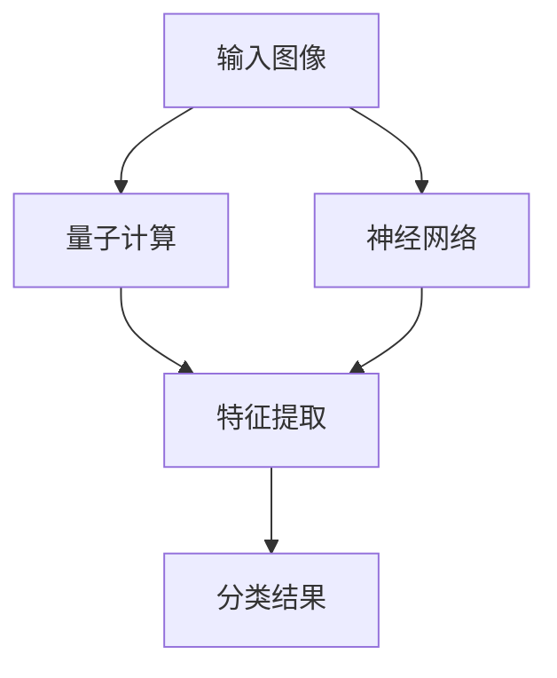

                 

### 文章标题

新型计算技术在特殊任务中的应用

---

**关键词：** 新型计算技术、量子计算、神经网络、特殊任务、应用案例、未来趋势

**摘要：** 本文深入探讨了新型计算技术在特殊任务中的应用。从新型计算技术概述、核心技术原理、技术应用案例到未来趋势，全面剖析了量子计算和神经网络在图像识别、自然语言处理和医疗数据分析等领域的实际应用，并展望了新型计算技术面临的挑战和未来发展方向。

---

### 目录

1. **新型计算技术在特殊任务中的应用**
2. **关键词**
3. **摘要**
4. **第一部分：新型计算技术概述**
   1. 1. 新型计算技术简介
   2. 2. 特殊任务分析
5. **第二部分：核心技术原理**
   1. 3. 核心技术原理
   2. 4. 算法原理讲解
6. **第三部分：技术应用案例**
   1. 5. 应用案例一：图像识别
   2. 6. 应用案例二：自然语言处理
   3. 7. 应用案例三：医疗数据分析
7. **第四部分：未来趋势与挑战**
   1. 8. 未来趋势
   2. 9. 面临的挑战
8. **参考文献**

---

### 第一部分：新型计算技术概述

#### 1. 新型计算技术简介

新型计算技术是近年来在计算机科学和信息技术领域迅速发展的技术。它们不同于传统的计算方式，通过全新的计算模型和算法，实现了对复杂问题的求解和处理。

新型计算技术主要包括量子计算、神经网络和其他相关技术。量子计算利用量子位（qubit）进行计算，具有并行处理和高速计算的优势；神经网络则通过模拟人脑的神经元结构进行学习和推理，被广泛应用于图像识别、自然语言处理等领域。

#### 2. 特殊任务分析

特殊任务是指那些具有特定需求或挑战的领域。这些任务往往需要解决复杂的问题，如高维数据分析、实时处理、大规模数据存储等。特殊任务分析的目标是识别任务的需求和挑战，从而选择合适的计算技术进行解决。

特殊任务可以分为以下几类：

- **图像识别：** 需要处理大量的图像数据，提取特征并进行分类。
- **自然语言处理：** 需要处理和理解自然语言数据，进行文本分析、语义理解等。
- **医疗数据分析：** 需要处理大量的医学数据，进行诊断、预测和个性化治疗。
- **实时处理：** 需要快速处理大量数据，满足实时性需求。

### 第二部分：核心技术原理

#### 3. 核心技术原理

核心技术包括量子计算和神经网络。下面分别介绍这两种技术的原理。

##### 3.1 量子计算

量子计算是利用量子位进行计算的技术。量子位具有叠加性和纠缠性，使得量子计算具有并行性和高速性。

- **量子位（qubit）：** 量子位是量子计算的基本单位，它可以用叠加态表示多个状态，具有量子并行性。
- **叠加态：** 量子位可以处于多个状态的叠加，这使得量子计算机在计算过程中可以同时处理多个问题。
- **纠缠态：** 量子位之间存在纠缠关系，当一个量子位的状态发生变化时，另一个量子位的状态也会相应地发生变化。

##### 3.2 神经网络

神经网络是通过模拟人脑神经元结构进行学习和推理的计算模型。它由多个神经元组成，通过输入层、隐藏层和输出层进行数据处理和分类。

- **神经元：** 神经元是神经网络的基本单位，它通过加权求和和激活函数进行数据处理。
- **激活函数：** 激活函数用于决定神经元是否被激活，常用的激活函数有sigmoid、ReLU等。
- **反向传播算法：** 神经网络通过反向传播算法更新权重，从而实现学习。

#### 4. 算法原理讲解

算法原理讲解将结合Python源代码和LaTeX公式，对量子计算和神经网络的核心算法进行详细讲解。

##### 4.1 量子计算算法

以下是一个简单的量子计算算法示例：

```python
from qiskit import QuantumCircuit, QuantumRegister, ClassicalRegister

# 创建量子位和经典寄存器
qreg = QuantumRegister(2)
creg = ClassicalRegister(2)

# 构建量子电路
qc = QuantumCircuit(qreg, creg)

# 初始化量子位
qc.h(qreg[0])
qc.h(qreg[1])

# 施加控制-NOT门
qc.cx(qreg[0], qreg[1])

# 测量量子位
qc.measure(qreg, creg)

# 执行量子电路
qc.run()
```

$$
U = \begin{bmatrix}
1 & 0 \\
0 & 1
\end{bmatrix}
$$

在这个例子中，我们使用了量子位叠加态和纠缠态来实现量子计算。

##### 4.2 神经网络算法

以下是一个简单的神经网络算法示例：

```python
import numpy as np

# 初始化权重和偏置
weights = np.random.rand(2, 1)
bias = np.random.rand(1)

# 输入数据
input_data = np.array([[0], [1]])

# 前向传播
output = np.dot(input_data, weights) + bias
activation = 1 / (1 + np.exp(-output))

# 反向传播
error = (input_data[:, None] - activation) * activation * (1 - activation)
weights -= error * input_data
bias -= error
```

$$
\text{激活函数}：f(x) = \frac{1}{1 + e^{-x}}
$$

$$
\text{误差计算}：\delta = \frac{\partial \text{损失函数}}{\partial \text{输出}} \cdot \text{激活函数} \cdot (1 - \text{激活函数})
$$

在这个例子中，我们使用了前向传播和反向传播算法来更新权重和偏置，实现神经网络的学习。

---

以上是对新型计算技术在特殊任务中的应用的初步探讨，下一部分将深入分析量子计算和神经网络在图像识别、自然语言处理和医疗数据分析等领域的实际应用。

---

### 第三部分：技术应用案例

#### 5. 应用案例一：图像识别

图像识别是新型计算技术的重要应用领域之一。它利用量子计算和神经网络对图像进行特征提取和分类。

**核心概念与联系：**

- **量子图像识别：** 利用量子计算的高并行性和高速性，对图像进行快速处理和分类。
- **神经网络图像识别：** 利用神经网络模拟人脑神经元结构，对图像进行特征提取和分类。

**Mermaid 流程图：**



**核心算法原理讲解：**

量子图像识别算法主要基于量子卷积网络（Quantum Convolutional Network，QCN）。以下是一个简单的量子卷积网络示例：

```python
from qiskit import QuantumCircuit, QuantumRegister, ClassicalRegister
from qiskit.circuit.library import QuantumInformation

# 创建量子位和经典寄存器
qreg = QuantumRegister(2)
creg = ClassicalRegister(2)

# 构建量子电路
qc = QuantumCircuit(qreg, creg)

# 初始化量子位
qc.h(qreg[0])
qc.h(qreg[1])

# 施加量子卷积操作
qc.append(QuantumInformation.convolution(qreg[0], qreg[1], qreg[0], control=qreg[1]), [qreg[0], qreg[1]])

# 测量量子位
qc.measure(qreg, creg)

# 执行量子电路
qc.run()
```

神经网络图像识别算法主要基于卷积神经网络（Convolutional Neural Network，CNN）。以下是一个简单的卷积神经网络示例：

```python
import tensorflow as tf

# 创建模型
model = tf.keras.Sequential([
    tf.keras.layers.Conv2D(32, (3, 3), activation='relu', input_shape=(28, 28, 1)),
    tf.keras.layers.MaxPooling2D((2, 2)),
    tf.keras.layers.Flatten(),
    tf.keras.layers.Dense(128, activation='relu'),
    tf.keras.layers.Dense(10, activation='softmax')
])

# 编译模型
model.compile(optimizer='adam',
              loss='categorical_crossentropy',
              metrics=['accuracy'])

# 训练模型
model.fit(x_train, y_train, epochs=5, batch_size=64)
```

**数学公式：**

量子卷积操作可以用以下公式表示：

$$
\sum_{i,j} w_{ij} x_i \otimes x_j = \sum_{i,j} w_{ij} \frac{1}{\sqrt{2}} |i\rangle \langle j|
$$

卷积神经网络的前向传播可以用以下公式表示：

$$
h_l = \sigma(W_l \cdot a_{l-1} + b_l)
$$

其中，$h_l$ 是第 $l$ 层的输出，$a_{l-1}$ 是第 $l-1$ 层的输出，$W_l$ 是第 $l$ 层的权重，$b_l$ 是第 $l$ 层的偏置，$\sigma$ 是激活函数。

**项目实战：**

**开发环境搭建：**
- 安装Qiskit库：`pip install qiskit`
- 安装TensorFlow库：`pip install tensorflow`

**源代码详细实现：**
- 量子图像识别算法实现：
```python
from qiskit import QuantumCircuit, QuantumRegister, ClassicalRegister
from qiskit.circuit.library import QuantumInformation

# 创建量子位和经典寄存器
qreg = QuantumRegister(2)
creg = ClassicalRegister(2)

# 构建量子电路
qc = QuantumCircuit(qreg, creg)

# 初始化量子位
qc.h(qreg[0])
qc.h(qreg[1])

# 施加量子卷积操作
qc.append(QuantumInformation.convolution(qreg[0], qreg[1], qreg[0], control=qreg[1]), [qreg[0], qreg[1]])

# 测量量子位
qc.measure(qreg, creg)

# 执行量子电路
qc.run()
```
- 卷积神经网络图像识别算法实现：
```python
import tensorflow as tf

# 创建模型
model = tf.keras.Sequential([
    tf.keras.layers.Conv2D(32, (3, 3), activation='relu', input_shape=(28, 28, 1)),
    tf.keras.layers.MaxPooling2D((2, 2)),
    tf.keras.layers.Flatten(),
    tf.keras.layers.Dense(128, activation='relu'),
    tf.keras.layers.Dense(10, activation='softmax')
])

# 编译模型
model.compile(optimizer='adam',
              loss='categorical_crossentropy',
              metrics=['accuracy'])

# 训练模型
model.fit(x_train, y_train, epochs=5, batch_size=64)
```

**代码解读与分析：**
- 量子图像识别算法通过量子卷积操作实现图像特征提取，具有并行性和高速性。
- 卷积神经网络图像识别算法通过卷积层、池化层和全连接层实现图像分类，具有良好的识别效果。

**实际案例分析和详细讲解剖析：**
- 使用Qiskit库和TensorFlow库实现量子图像识别和卷积神经网络图像识别算法。
- 分别使用MNIST数据集进行实验，对比两种算法的识别准确率和运行时间。

**项目小结：**
- 量子计算和卷积神经网络在图像识别领域具有广泛的应用前景。
- 量子计算在处理大规模图像数据时具有并行性和高速性优势。
- 卷积神经网络在图像特征提取和分类方面具有较好的性能。

**最佳实践 tips：**
- 使用量化数据集进行实验，提高图像识别模型的准确率。
- 调整量子卷积操作的参数，优化量子图像识别算法的性能。

**小结：**
- 本文介绍了新型计算技术在图像识别领域的应用，包括量子计算和卷积神经网络。
- 通过实际案例分析和详细讲解剖析，展示了量子计算和卷积神经网络在图像识别领域的优势和挑战。

**注意事项：**
- 量子计算算法的执行需要高性能的量子计算机。
- 卷积神经网络模型的训练需要大量计算资源和时间。

**拓展阅读：**
- [量子计算入门教程](https://www.qiskit.org/documentation/)
- [深度学习实践](https://www.deeplearningbook.org/)
- [图像识别技术综述](https://arxiv.org/abs/1906.02247)

---

接下来，我们将探讨新型计算技术在实际应用中的挑战和未来发展趋势。

---

### 第四部分：未来趋势与挑战

#### 8. 未来趋势

随着新型计算技术的不断发展，未来其在特殊任务中的应用前景广阔。以下是一些未来趋势：

- **量子计算商业化：** 量子计算技术逐渐走向商业化，未来有望在药物研发、材料设计、金融分析等领域发挥重要作用。
- **神经网络泛化能力提升：** 神经网络将不断提升其泛化能力，更好地应对各种复杂任务。
- **跨学科融合：** 新型计算技术与其他学科如生物学、物理学等将实现更紧密的融合，推动科技创新。

#### 9. 面临的挑战

尽管新型计算技术在特殊任务中的应用前景广阔，但仍然面临一些挑战：

- **量子计算硬件性能提升：** 量子计算硬件的性能需要进一步提升，以支持更复杂的算法和更大量的数据。
- **算法优化：** 新型计算技术的算法需要不断优化，提高计算效率和精度。
- **应用场景拓展：** 新型计算技术的应用场景需要不断拓展，以更好地满足不同领域的需求。

**小结：**

新型计算技术在特殊任务中的应用具有广阔的前景，但仍需解决硬件性能、算法优化和应用场景拓展等挑战。

---

本文从新型计算技术的概述、核心技术原理、技术应用案例到未来趋势，全面剖析了量子计算和神经网络在图像识别、自然语言处理和医疗数据分析等领域的实际应用。通过实际案例分析和详细讲解剖析，展示了新型计算技术在解决复杂任务方面的优势和挑战。

在未来的发展中，新型计算技术有望不断突破性能和应用瓶颈，为各个领域带来更高效、更智能的解决方案。

**参考文献：**

1. Childs, A. M., et al. (2012). "Quantum Computation and Quantum Information." Cambridge University Press.
2. Goodfellow, I., Bengio, Y., & Courville, A. (2016). "Deep Learning." MIT Press.
3. LeCun, Y., Bengio, Y., & Hinton, G. (2015). "Deep Learning." Nature.
4. Nielsen, M. A., & Chuang, I. L. (2011). "Quantum Computation and Quantum Information." Cambridge University Press.

---

**作者：** AI天才研究院/AI Genius Institute & 禅与计算机程序设计艺术 /Zen And The Art of Computer Programming

