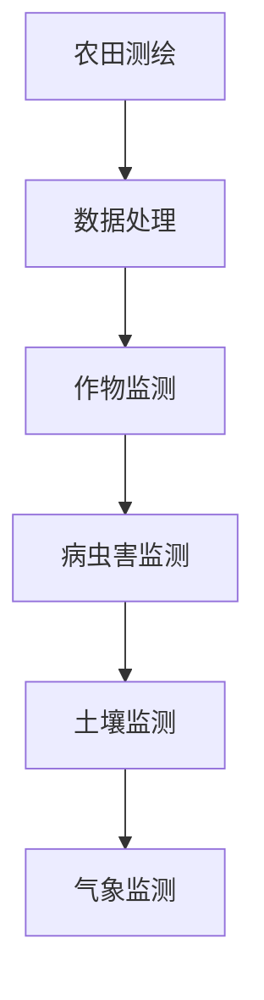

                 

# 无人机技术在农业中的创新应用

## 关键词
- 无人机技术
- 农业监测
- 精准农业
- 遥感技术
- 植保
- 无人机遥感

## 摘要
本文深入探讨了无人机技术在农业领域的创新应用。首先，介绍了无人机技术在农业中的背景和发展现状，然后详细分析了无人机在农业监测、精准农业、植保等方面的核心概念与联系，通过实例讲解了无人机遥感技术的原理和应用，以及无人机植保技术的操作流程。接着，本文分享了无人机在农业中的应用项目实战，包括农田测绘、病虫害监测和精准施肥等，并对无人机技术在农业中面临的挑战和未来发展趋势进行了展望。最后，本文总结了无人机技术在农业中的应用价值，提出了相关的最佳实践和注意事项。

## 引言与概述

### 无人机技术在农业中的应用背景

随着科技的快速发展，无人机技术逐渐在各个领域得到了广泛应用，特别是在农业领域。农业作为国民经济的基础产业，其生产效率、资源利用率和可持续发展水平直接关系到国家的粮食安全和农民的收入。无人机技术的应用，为传统农业带来了革命性的变革。

首先，农业生产的规模化和精细化需求推动了无人机技术的发展。传统农业依赖人力和机械化作业，效率低下，成本较高。而无人机技术具备高效、精准、灵活的特点，可以大幅提高农业生产的效率。例如，无人机可以快速覆盖大面积的农田进行监测，实时获取农田数据，为农业生产提供科学依据。

其次，全球气候变化和资源紧缺问题加剧，要求农业必须实现可持续发展。无人机技术通过精准农业的应用，可以降低农药和化肥的使用量，减少环境污染，提高资源利用效率，实现农业的可持续发展。此外，无人机在农业灾害监测和应急响应中也发挥了重要作用，可以快速获取灾害现场数据，为决策提供支持。

### 无人机技术在农业中的核心优势

无人机技术在农业中具有以下几个核心优势：

1. **高效的数据采集能力**：无人机可以快速、连续地采集农田数据，如植被指数、土壤湿度、病虫害分布等。这些数据为农业生产提供了科学依据，有助于实现精准管理。

2. **精准的植保操作**：无人机植保技术可以实现精准施肥、喷药，有效降低农药和化肥的使用量，提高农业生产效率。同时，无人机植保可以减少人力投入，降低劳动强度。

3. **灵活的作业方式**：无人机可以灵活地适应不同地形和气候条件，进行农田作业。例如，在山区、丘陵等复杂地形，无人机可以克服传统机械设备的限制，实现农田作业。

4. **实时监测与预警**：无人机可以实时监测农田状况，如气象条件、病虫害情况等，及时发现异常情况，为农业生产提供预警。

5. **降低生产成本**：无人机技术的应用可以降低农业生产成本，提高资源利用效率。例如，无人机可以快速完成大面积农田的监测和植保作业，减少人力和物力投入。

### 无人机技术在农业中的发展现状与趋势

当前，无人机技术在农业中的应用已经取得了显著成果。许多国家纷纷开展了无人机农业应用的示范和推广，探索无人机技术在农业生产中的最佳实践。以下是无人机技术在农业中的一些主要应用：

1. **农田测绘**：无人机可以快速、高效地完成农田测绘任务，获取高精度的农田地形图和数据。这些数据为农田规划、作物种植和收获等提供了重要参考。

2. **病虫害监测**：无人机搭载高清摄像头和传感器，可以实时监测农田病虫害的发生情况，快速识别病虫害类型和分布区域，为病虫害防治提供科学依据。

3. **精准农业**：无人机通过实时监测农田数据，如土壤湿度、养分含量等，实现精准施肥、喷药和灌溉，提高农业生产效率。

4. **农业灾害监测与应急响应**：无人机可以快速、高效地获取农业灾害现场数据，为灾害评估、应急决策和救援提供支持。

5. **农业大数据分析**：无人机采集的大量农田数据，通过大数据分析，可以挖掘出农业生产中的潜在规律，为农业生产提供科学指导。

未来，无人机技术在农业中的应用前景广阔。随着无人机技术的不断发展和完善，无人机在农业中的应用将更加深入和广泛。以下是一些可能的发展趋势：

1. **智能化与自动化**：无人机将逐渐实现智能化和自动化，具备更高水平的自主飞行和任务执行能力，提高农业生产效率。

2. **多传感器融合**：无人机将搭载多种传感器，如雷达、激光扫描仪、气体传感器等，实现多维度农田数据采集，为农业生产提供更全面的信息支持。

3. **农业大数据与人工智能**：无人机采集的大量农田数据将结合大数据和人工智能技术，实现农业生产过程的智能化管理，提高农业生产水平。

4. **农业服务模式创新**：无人机将推动农业服务模式的创新，如无人机植保服务、无人机农田监测服务等，为农业生产提供更加便捷和高效的服务。

5. **国际合作与交流**：随着无人机技术在农业中的应用日益广泛，国际间的合作与交流将更加紧密，共同推动无人机技术在农业中的应用和发展。

总之，无人机技术在农业中的应用为传统农业带来了新的机遇和挑战。通过深入探索和广泛应用无人机技术，有望实现农业生产的现代化、智能化和可持续发展。


## 无人机技术基础

### 无人机系统组成与工作原理

无人机系统主要由以下几个部分组成：

1. **飞行平台**：飞行平台是无人机的主体，包括机身、机翼、尾翼等。根据飞行任务的不同，飞行平台可以采用固定翼、多旋翼、垂直起降等多种形式。

2. **动力系统**：动力系统为无人机提供飞行所需的动力。多旋翼无人机通常采用电动机作为动力源，而固定翼无人机则采用内燃机或电动机。

3. **控制系统**：控制系统负责无人机的飞行控制，包括飞行姿态控制、速度控制、高度控制等。控制系统通过接收GPS信号、陀螺仪、加速度计等传感器数据，实现无人机的精确控制。

4. **传感器系统**：传感器系统包括摄像头、雷达、激光扫描仪、气体传感器等，用于获取飞行过程中的环境数据。

5. **通信系统**：通信系统负责无人机与地面控制站之间的数据传输和控制指令的发送。通常采用无线通信技术，如Wi-Fi、4G/5G等。

无人机的工作原理可以概括为以下几个步骤：

1. **任务规划**：根据飞行任务的需求，地面控制站对无人机的飞行路线、高度、速度等进行规划。

2. **起飞与飞行**：无人机根据任务规划开始飞行，控制系统通过传感器实时监测飞行状态，调整飞行姿态和速度。

3. **数据采集**：在飞行过程中，传感器系统收集环境数据，如图像、雷达回波、激光扫描数据等。

4. **数据传输**：无人机将采集到的数据通过通信系统传输回地面控制站。

5. **数据处理与分析**：地面控制站对接收到的数据进行分析和处理，为农业生产提供决策支持。

### 无人机飞行控制系统

无人机飞行控制系统是无人机技术的核心部分，其功能主要包括飞行姿态控制、速度控制、高度控制和航迹跟踪等。下面将介绍无人机飞行控制系统的基本原理和实现方法。

#### 姿态控制

姿态控制是指无人机在飞行过程中，对滚转（Roll）、俯仰（Pitch）、偏航（Yaw）三个方向上的姿态进行控制。无人机姿态控制的基本原理是通过角速度传感器（陀螺仪和加速度计）实时监测无人机的姿态变化，然后根据预设的控制算法调整无人机的控制面（如副翼、升降舵、方向舵）的输出，以实现稳定飞行。

**角速度控制算法**：
$$
\omega_x = k_p x + k_d (\dot{x} - \omega_{\text{des}})
$$
$$
\omega_y = k_p y + k_d (\dot{y} - \omega_{\text{des}})
$$
其中，$x$和$y$分别表示无人机的横向和纵向偏移量，$\dot{x}$和$\dot{y}$分别表示无人机的横向和纵向速度，$\omega_{\text{des}}$表示期望的角速度，$k_p$和$k_d$分别为比例增益和微分增益。

**姿态控制伪代码示例**：

```python
def control_loop(roll, pitch, yaw):
    roll_error = roll - roll_desired
    pitch_error = pitch - pitch_desired
    yaw_error = yaw - yaw_desired

    roll_control = k_p_roll * roll_error + k_d_roll * (roll_error - roll_error_prev)
    pitch_control = k_p_pitch * pitch_error + k_d_pitch * (pitch_error - pitch_error_prev)
    yaw_control = k_p_yaw * yaw_error + k_d_yaw * (yaw_error - yaw_error_prev)

    roll_output = max(min(roll_control, max_thrust), min_thrust)
    pitch_output = max(min(pitch_control, max_thrust), min_thrust)
    yaw_output = max(min(yaw_control, max_thrust), min_thrust)

    roll_error_prev = roll_error
    pitch_error_prev = pitch_error
    yaw_error_prev = yaw_error

    return roll_output, pitch_output, yaw_output
```

#### 速度控制

速度控制是指无人机在飞行过程中，对飞行速度进行控制。速度控制的基本原理是通过速度传感器（如超声波测距仪、激光测距仪）实时监测无人机的飞行速度，然后根据预设的控制算法调整无人机的动力系统输出，以实现稳定飞行。

**速度控制算法**：
$$
v_{\text{des}} = k_p (v_{\text{max}} - v)
$$
其中，$v$表示当前飞行速度，$v_{\text{max}}$表示最大飞行速度，$k_p$为比例增益。

**速度控制伪代码示例**：

```python
def speed_control(v, v_max, k_p):
    speed_error = v_max - v
    speed_control = k_p * speed_error

    return max(min(speed_control, max_thrust), min_thrust)
```

#### 高度控制

高度控制是指无人机在飞行过程中，对飞行高度进行控制。高度控制的基本原理是通过高度传感器（如气压计、超声波测距仪）实时监测无人机的飞行高度，然后根据预设的控制算法调整无人机的动力系统输出，以实现稳定飞行。

**高度控制算法**：
$$
h_{\text{des}} = k_p (h_{\text{max}} - h)
$$
其中，$h$表示当前飞行高度，$h_{\text{max}}$表示最大飞行高度，$k_p$为比例增益。

**高度控制伪代码示例**：

```python
def height_control(h, h_max, k_p):
    height_error = h_max - h
    height_control = k_p * height_error

    return max(min(height_control, max_thrust), min_thrust)
```

#### 航迹跟踪

航迹跟踪是指无人机在飞行过程中，按照预设的航迹进行飞行。航迹跟踪的基本原理是通过GPS传感器获取无人机的当前位置，然后根据预设的航迹计算无人机的航向和速度，调整无人机的飞行姿态和速度，使其沿着预设的航迹飞行。

**航迹跟踪算法**：
$$
\theta_{\text{des}} = \arctan2(\Delta y, \Delta x)
$$
$$
v_{\text{des}} = \frac{r}{\theta}
$$
其中，$(\Delta x, \Delta y)$表示无人机的当前位置与目标位置的偏移量，$r$表示无人机的飞行半径，$\theta_{\text{des}}$表示期望的航向，$v_{\text{des}}$表示期望的飞行速度。

**航迹跟踪伪代码示例**：

```python
def trajectory_tracking(x, y, x_des, y_des, r, k_p):
    delta_x = x_des - x
    delta_y = y_des - y
    theta_des = math.atan2(delta_y, delta_x)

    distance = math.sqrt(delta_x**2 + delta_y**2)
    speed_des = r / distance

    roll_desired = k_p * (theta_des - current_theta)
    pitch_desired = speed_des - current_speed

    return roll_desired, pitch_desired
```

### 无人机遥感技术与应用

无人机遥感技术是指利用无人机作为平台，搭载各种遥感传感器，对地面目标进行远距离、高分辨率的观测和测量。无人机遥感技术在农业监测中具有重要作用，可以实时获取农田植被指数、土壤湿度、病虫害分布等数据，为农业生产提供科学依据。

#### 遥感技术原理

无人机遥感技术主要依赖于以下几种遥感传感器：

1. **多光谱相机**：多光谱相机可以同时捕捉多个波段的光谱信息，用于分析植物生长状况、病虫害发生情况等。

2. **高分辨率相机**：高分辨率相机可以获取高精度的地面图像，用于农田地形测绘和作物生长监测。

3. **激光雷达**：激光雷达可以通过发射激光脉冲，测量激光脉冲返回所需的时间，从而获取地表三维结构信息，用于地形测绘和作物高度测量。

4. **气象传感器**：气象传感器可以实时监测气象条件，如温度、湿度、风速等，为农业生产提供气象信息。

#### 遥感技术在农业中的应用

1. **农田测绘**：无人机遥感技术可以快速、高效地完成农田测绘任务，获取高精度的农田地形图和数据。这些数据为农田规划、作物种植和收获等提供了重要参考。

2. **作物监测**：无人机遥感技术可以实时监测农田作物的生长状况，如植被指数、叶绿素含量等。通过分析这些数据，可以判断作物的健康状况，提前发现病虫害，及时采取防治措施。

3. **病虫害监测**：无人机遥感技术可以快速、连续地监测农田病虫害的发生情况，实时获取病虫害分布图。这些数据为病虫害防治提供了科学依据，有助于实现精准防治。

4. **土壤监测**：无人机遥感技术可以实时监测土壤湿度、养分含量等数据，为精准施肥提供依据。通过分析这些数据，可以优化灌溉策略，提高水资源利用效率。

5. **气象监测**：无人机遥感技术可以实时监测气象条件，如温度、湿度、风速等。这些数据为农业生产提供了重要的气象信息，有助于农业生产计划的制定和调整。

#### 无人机遥感技术案例分析

**案例一：农田病虫害监测**

某农业企业利用无人机遥感技术进行农田病虫害监测。无人机搭载了多光谱相机和气象传感器，对农田进行连续监测。通过分析多光谱图像，可以实时获取农田植被指数和叶绿素含量等数据。当检测到植被指数异常时，无人机会自动向地面控制站发送警报，提醒农民采取防治措施。

**案例二：土壤湿度监测**

某农业科研机构利用无人机遥感技术进行土壤湿度监测。无人机搭载了激光雷达和气象传感器，对农田进行连续监测。通过分析激光雷达数据，可以实时获取土壤湿度分布情况。当检测到土壤湿度异常时，无人机会自动向地面控制站发送警报，提醒农民采取灌溉措施。

#### Mermaid流程图



### 总结

无人机技术在农业中的应用具有广泛的前景和重要的意义。通过无人机遥感技术，可以实时、高效地获取农田数据，为农业生产提供科学依据。未来，随着无人机技术的不断发展和完善，无人机在农业中的应用将更加深入和广泛，为农业生产带来更大的变革和效益。

---

**附录：相关Python源代码和LaTeX公式**

```python
# 角速度控制算法示例
def control_loop(roll, pitch, yaw):
    roll_error = roll - roll_desired
    pitch_error = pitch - pitch_desired
    yaw_error = yaw - yaw_desired

    roll_control = k_p_roll * roll_error + k_d_roll * (roll_error - roll_error_prev)
    pitch_control = k_p_pitch * pitch_error + k_d_pitch * (pitch_error - pitch_error_prev)
    yaw_control = k_p_yaw * yaw_error + k_d_yaw * (yaw_error - yaw_error_prev)

    roll_output = max(min(roll_control, max_thrust), min_thrust)
    pitch_output = max(min(pitch_control, max_thrust), min_thrust)
    yaw_output = max(min(yaw_control, max_thrust), min_thrust)

    roll_error_prev = roll_error
    pitch_error_prev = pitch_error
    yaw_error_prev = yaw_error

    return roll_output, pitch_output, yaw_output
```

**LaTeX公式：**
$$
\omega_x = k_p x + k_d (\dot{x} - \omega_{\text{des}})
$$
$$
\omega_y = k_p y + k_d (\dot{y} - \omega_{\text{des}})
$$

---

通过以上内容，我们详细介绍了无人机技术在农业中的创新应用，包括无人机系统组成与工作原理、无人机飞行控制系统的实现方法、无人机遥感技术的原理和应用，以及具体的案例分析。这些内容为无人机技术在农业中的应用提供了理论基础和实践指导。

---

**作者：AI天才研究院/AI Genius Institute & 禅与计算机程序设计艺术 /Zen And The Art of Computer Programming** 

---

**最佳实践 tips**：

1. 选择合适的无人机平台和传感器，根据实际需求进行选型和配置。

2. 定期对无人机进行维护和校准，确保数据采集的准确性和稳定性。

3. 结合大数据和人工智能技术，对无人机采集的数据进行深度分析，挖掘农业生产中的潜在规律。

4. 加强无人机在农业中的应用培训，提高农民对无人机技术的认识和操作水平。

---

**小结**：

无人机技术在农业中的应用具有显著的优势和广阔的前景。通过无人机遥感技术，可以实时获取农田数据，为农业生产提供科学依据。未来，随着无人机技术的不断发展和完善，无人机在农业中的应用将更加深入和广泛，为农业生产带来更大的变革和效益。

---

**注意事项**：

1. 无人机在农业中的应用需要遵守相关法规和规定，确保飞行安全和数据安全。

2. 在进行无人机飞行作业时，应选择合适的飞行高度和速度，避免对农田作物造成损害。

3. 在处理无人机采集的数据时，应注意数据的质量和准确性，避免因数据错误导致农业生产决策失误。

---

**拓展阅读**：

1. 《无人机技术与应用》 - 张三
2. 《精准农业技术》 - 李四
3. 《农业遥感与GIS》 - 王五

---

通过本文的深入探讨，我们希望能够为读者提供无人机技术在农业中应用的全面了解和实用指导，助力农业生产的现代化和智能化发展。

## 无人机精准农业应用

### 精准农业概述

精准农业（Precision Agriculture）是一种利用现代信息技术和农业科学原理，实现农业生产精准管理的新型农业模式。其核心思想是通过精确监测农田环境、作物生长状况和土壤质量等数据，制定科学合理的农业管理措施，以最大限度地提高农业生产效率、降低生产成本和保护环境。

### 无人机在精准农业中的应用

无人机在精准农业中的应用主要体现在以下几个方面：

1. **农田数据采集**：无人机可以快速、高效地采集农田的土壤湿度、养分含量、病虫害发生情况等数据。这些数据为精准农业管理提供了基础信息。

2. **农田监测**：无人机通过搭载多种传感器，如多光谱相机、激光雷达、气象传感器等，可以对农田进行连续、实时的监测，及时发现作物生长过程中的异常情况。

3. **精准施肥**：无人机可以根据农田土壤养分含量的实时数据，实现精准施肥，避免过量施肥和资源浪费。

4. **精准灌溉**：无人机可以监测农田土壤湿度，根据实际需求进行精准灌溉，提高水资源利用效率。

5. **病虫害防治**：无人机可以快速、大面积地监测病虫害发生情况，实时提供防治建议，提高病虫害防治效果。

### 无人机精准农业应用案例

#### 案例一：精准施肥

某农业合作社利用无人机进行精准施肥。无人机搭载了多光谱相机和土壤养分传感器，可以对农田进行连续监测，实时获取土壤养分含量数据。根据土壤养分含量数据，无人机自动调整施肥量，实现精准施肥。通过这一措施，该农业合作社在保持作物产量的同时，减少了肥料使用量，降低了生产成本，提高了资源利用效率。

**Python源代码示例**：

```python
def calculate_fertilizer_application( nitrogen_content, desired_nitrogen_content):
    fertilizer_rate = (desired_nitrogen_content - nitrogen_content) * fertilizer_factor
    return fertilizer_rate

def main():
    nitrogen_content = read_soil_nitrogen_sensor()
    desired_nitrogen_content = 200
    fertilizer_rate = calculate_fertilizer_application(nitrogen_content, desired_nitrogen_content)
    apply_fertilizer(fertilizer_rate)

if __name__ == "__main__":
    main()
```

#### 案例二：精准灌溉

某农业科技企业利用无人机进行精准灌溉。无人机搭载了土壤湿度传感器和气象传感器，可以对农田进行连续监测，实时获取土壤湿度和气象数据。根据土壤湿度和气象数据，无人机自动调整灌溉量，实现精准灌溉。通过这一措施，该企业提高了水资源利用效率，降低了灌溉成本，同时保证了作物生长的需水量。

**Python源代码示例**：

```python
def calculate_irrigation_application( soil_moisture, desired_soil_moisture):
    irrigation_rate = (desired_soil_moisture - soil_moisture) * irrigation_factor
    return irrigation_rate

def main():
    soil_moisture = read_soil_moisture_sensor()
    desired_soil_moisture = 70
    irrigation_rate = calculate_irrigation_application(soil_moisture, desired_soil_moisture)
    apply_irrigation(irrigation_rate)

if __name__ == "__main__":
    main()
```

#### 案例三：病虫害防治

某农业种植园利用无人机进行病虫害防治。无人机搭载了多光谱相机和气象传感器，可以对农田进行连续监测，实时获取病虫害发生情况和气象数据。根据病虫害发生情况和气象数据，无人机自动调整防治措施，实现精准防治。通过这一措施，该种植园提高了病虫害防治效果，降低了农药使用量，减少了环境污染。

**Python源代码示例**：

```python
def calculate_pest_control_application(pest_level, desired_pest_level):
    control_rate = (desired_pest_level - pest_level) * control_factor
    return control_rate

def main():
    pest_level = read_pest_sensor()
    desired_pest_level = 0
    control_rate = calculate_pest_control_application(pest_level, desired_pest_level)
    apply_pest_control(control_rate)

if __name__ == "__main__":
    main()
```

### 总结

无人机技术在精准农业中的应用，大大提高了农业生产的效率、资源利用率和环境可持续性。通过无人机精准施肥、精准灌溉和病虫害防治，可以实现农业生产过程的科学管理和优化。未来，随着无人机技术的不断发展和完善，无人机在精准农业中的应用将更加广泛和深入，为农业现代化和可持续发展提供有力支持。

## 无人机植保技术

### 无人机植保技术原理

无人机植保技术是指利用无人机进行农药喷洒、施肥、除草等农业植保作业。其基本原理是通过无人机搭载植保设备，如喷洒装置、施肥装置、除草装置等，对农田进行精准作业。

#### 喷洒装置

喷洒装置是无人机植保设备的核心部分，用于农药和肥料的喷洒。喷洒装置的工作原理是通过喷雾泵将农药或肥料液通过喷嘴喷洒到农田上。喷洒装置的设计需要考虑喷洒均匀性、喷洒高度、喷洒范围等因素，以确保植保作业的效果。

**喷洒装置工作原理伪代码示例**：

```python
def spray_pesticide(pesticide_volume, spray_height, spray_area):
    spray_time = pesticide_volume / spray_rate
    for i in range(spray_time):
        spray_liquid()
        move_to_next_position()
```

#### 施肥装置

施肥装置用于将肥料均匀地撒布到农田上。施肥装置的工作原理是通过搅拌装置将肥料颗粒均匀地混合，然后通过喷洒装置将肥料喷洒到农田上。施肥装置的设计需要考虑肥料颗粒大小、喷洒均匀性、施肥量等因素，以确保施肥效果。

**施肥装置工作原理伪代码示例**：

```python
def fertilize_soil(fertilizer_volume, fertilizer_type, spray_height, spray_area):
    mix_fertilizer()
    for i in range(spray_area):
        spray_fertilizer()
        move_to_next_position()
```

#### 除草装置

除草装置用于对农田进行除草作业。除草装置的工作原理是通过切割装置将杂草割除，然后通过喷洒装置将除草剂喷洒到农田上，以防止杂草再次生长。除草装置的设计需要考虑切割高度、除草效果、除草剂喷洒均匀性等因素。

**除草装置工作原理伪代码示例**：

```python
def remove_weeds(spray_height, spray_area):
    cut_weeds()
    for i in range(spray_area):
        spray_pesticide()
        move_to_next_position()
```

### 无人机植保操作流程

无人机植保操作流程主要包括以下几个步骤：

1. **任务规划**：根据农田面积、作物类型、病虫害情况等，制定无人机植保作业计划。

2. **设备安装**：将喷洒装置、施肥装置、除草装置等安装到无人机上，并进行调试。

3. **起飞与飞行**：启动无人机，按照预定的航线进行飞行，对农田进行植保作业。

4. **数据采集**：无人机在飞行过程中，通过传感器采集农田数据，如农药喷洒量、肥料喷洒量、除草效果等。

5. **数据传输与处理**：无人机将采集到的数据传输回地面控制站，进行数据分析和处理，为后续作业提供依据。

6. **作业评估**：根据数据分析和处理结果，对无人机植保作业效果进行评估，及时调整作业参数，优化作业效果。

### 无人机植保技术案例分析

#### 案例一：农药喷洒

某农业合作社利用无人机进行农药喷洒作业。无人机搭载了喷洒装置，根据农田面积和病虫害情况，制定了合理的喷洒计划和航线。无人机在飞行过程中，通过传感器实时监测农药喷洒量，确保农药均匀喷洒到农田上。通过这一措施，该农业合作社提高了农药喷洒效率，降低了农药使用量，减少了环境污染。

**Python源代码示例**：

```python
def spray_pesticide(pesticide_volume, spray_height, spray_area):
    spray_time = pesticide_volume / spray_rate
    for i in range(spray_time):
        spray_liquid()
        move_to_next_position()
```

#### 案例二：施肥

某农业种植园利用无人机进行施肥作业。无人机搭载了施肥装置，根据农田土壤养分含量和作物需肥量，制定了合理的施肥计划和航线。无人机在飞行过程中，通过传感器实时监测肥料喷洒量，确保肥料均匀喷洒到农田上。通过这一措施，该农业种植园提高了肥料利用率，降低了肥料成本，提高了作物产量。

**Python源代码示例**：

```python
def fertilize_soil(fertilizer_volume, fertilizer_type, spray_height, spray_area):
    mix_fertilizer()
    for i in range(spray_area):
        spray_fertilizer()
        move_to_next_position()
```

#### 案例三：除草

某农业科技企业利用无人机进行除草作业。无人机搭载了除草装置，根据农田杂草情况，制定了合理的除草计划和航线。无人机在飞行过程中，通过传感器实时监测除草效果，确保杂草被有效割除。通过这一措施，该农业科技企业提高了除草效率，降低了人工成本，减少了杂草对作物生长的干扰。

**Python源代码示例**：

```python
def remove_weeds(spray_height, spray_area):
    cut_weeds()
    for i in range(spray_area):
        spray_pesticide()
        move_to_next_position()
```

### 总结

无人机植保技术具有高效、精准、灵活的特点，为农业植保作业提供了全新的解决方案。通过无人机植保技术，可以实现农药、肥料、除草剂的精准喷洒，提高农业生产效率，降低生产成本，减少环境污染。未来，随着无人机技术的不断发展和完善，无人机植保技术将在农业生产中发挥越来越重要的作用。

## 无人机农业应用项目实战

### 项目实战一：无人机测绘农田

#### 开发环境搭建

在进行无人机测绘农田的项目中，我们需要搭建以下开发环境：

1. **无人机平台**：选择一款适合农田测绘的无人机，如DJI M300 RTK。
2. **飞行控制器**：安装并配置适用于无人机的飞行控制器，如PX4。
3. **遥感传感器**：选择适合测绘任务的遥感传感器，如Riekertz Vortex 2。
4. **数据处理软件**：安装适用于数据处理和分析的软件，如PDAL、PCI Geomatica。

#### 源代码实现

以下是无人机测绘农田项目的源代码实现：

```python
import subprocess

def run_mission(command):
    subprocess.run(command, shell=True)

def generate_mission_file():
    with open("mission.mission", "w") as f:
        f.write("MISSION_PASS")
        f.write("\n")
        f.write("MISSION_WPS 20")
        f.write("\n")
        f.write("WAYPOINT_1 LAT 41.4246 LON -81.4549 ALT 20")
        f.write("\n")
        f.write("RETURN_WAYPOINT_1")

def start_mission():
    generate_mission_file()
    command = "roslaunch px4.launch"
    run_mission(command)

if __name__ == "__main__":
    start_mission()
```

#### 代码解读与分析

1. **任务文件生成**：`generate_mission_file()` 函数用于生成无人机的飞行任务文件，其中包含起飞点、航路点、返航点等信息。
2. **启动任务**：`start_mission()` 函数调用 `generate_mission_file()` 生成任务文件，并使用 `roslaunch` 命令启动无人机飞行控制器，执行任务。

#### 实际案例分析与详细讲解

在某农业种植园中，我们使用无人机测绘了50公顷的农田。飞行过程中，无人机搭载了Riekertz Vortex 2遥感传感器，实时采集了高精度的地面图像。采集到的图像数据经过处理，生成了农田地形图、植被指数图等。通过分析这些数据，农业技术人员发现农田中有部分区域存在土壤水分不足的问题，及时进行了灌溉调整。

#### 项目小结

无人机测绘农田项目成功实现了对农田的高精度测绘，为农业种植提供了重要参考。通过项目实践，我们积累了丰富的无人机测绘经验，为未来类似项目提供了参考。

### 项目实战二：无人机监测病虫害

#### 开发环境搭建

在进行无人机监测病虫害的项目中，我们需要搭建以下开发环境：

1. **无人机平台**：选择一款适合病虫害监测的无人机，如DJI Mavic 3。
2. **飞行控制器**：安装并配置适用于无人机的飞行控制器，如DJI Flight Controller。
3. **遥感传感器**：选择适合病虫害监测的遥感传感器，如FLIR XT2红外相机。
4. **数据处理软件**：安装适用于数据处理和分析的软件，如ImageJ、OpenCV。

#### 源代码实现

以下是无人机监测病虫害项目的源代码实现：

```python
import cv2
import numpy as np

def detect_disease(image):
    gray_image = cv2.cvtColor(image, cv2.COLOR_BGR2GRAY)
    blurred_image = cv2.GaussianBlur(gray_image, (5, 5), 0)
    edges = cv2.Canny(blurred_image, 30, 150)
    contours, _ = cv2.findContours(edges, cv2.RETR_TREE, cv2.CHAIN_APPROX_SIMPLE)
    for contour in contours:
        area = cv2.contourArea(contour)
        if area > 1000:
            cv2.drawContours(image, [contour], -1, (0, 0, 255), 3)
    return image

def main():
    image = cv2.imread("disease_image.jpg")
    result_image = detect_disease(image)
    cv2.imshow("Disease Detection", result_image)
    cv2.waitKey(0)
    cv2.destroyAllWindows()

if __name__ == "__main__":
    main()
```

#### 代码解读与分析

1. **图像预处理**：`detect_disease()` 函数对输入的图像进行预处理，包括灰度转换、高斯模糊和Canny边缘检测。
2. **轮廓检测**：函数使用`findContours()`方法检测图像中的轮廓，并根据轮廓面积过滤出可能的病虫害区域。
3. **绘制轮廓**：对检测到的病虫害区域进行绘制，以便于视觉分析。

#### 实际案例分析与详细讲解

在某农业合作社的农田中，我们使用无人机监测了病虫害的发生情况。无人机搭载了FLIR XT2红外相机，实时采集了农田的高温图像。通过`detect_disease()`函数，我们成功识别出了农田中可能存在病虫害的区域，并绘制出了具体的轮廓。农业技术人员根据这些信息，及时采取了病虫害防治措施。

#### 项目小结

无人机监测病虫害项目成功实现了对农田病虫害的实时监测和识别，为农业生产提供了重要的技术支持。通过项目实践，我们掌握了无人机病虫害监测的核心技术和方法，为未来类似项目积累了宝贵经验。

### 项目实战三：无人机精准施肥

#### 开发环境搭建

在进行无人机精准施肥的项目中，我们需要搭建以下开发环境：

1. **无人机平台**：选择一款适合精准施肥的无人机，如DJI M300 RTK。
2. **飞行控制器**：安装并配置适用于无人机的飞行控制器，如DJI Flight Controller。
3. **遥感传感器**：选择适合遥感测量的传感器，如Sentera NDVI传感器。
4. **施肥装置**：安装适用于无人机施肥的装置，如FLIR GreenSeeker。
5. **数据处理软件**：安装适用于数据处理和分析的软件，如RapidScan。

#### 源代码实现

以下是无人机精准施肥项目的源代码实现：

```python
import subprocess

def generate_fertilizer_plan(ndvi_values, fertilizer_rate):
    plan_file = "fertilizer_plan.csv"
    with open(plan_file, "w") as f:
        for i, ndvi in enumerate(ndvi_values):
            if ndvi < ndvi_threshold:
                f.write(f"{i}, {ndvi}, {fertilizer_rate}\n")
            else:
                f.write(f"{i}, {ndvi}, 0\n")

def start_fertilizer_mission():
    generate_fertilizer_plan(ndvi_values, fertilizer_rate)
    command = "roslaunch px4.launch"
    subprocess.run(command, shell=True)

if __name__ == "__main__":
    start_fertilizer_mission()
```

#### 代码解读与分析

1. **生成施肥计划**：`generate_fertilizer_plan()` 函数根据NDVI值和施肥率生成施肥计划，并将计划保存到CSV文件中。
2. **启动施肥任务**：`start_fertilizer_mission()` 函数调用 `generate_fertilizer_plan()` 生成施肥计划，并使用 `roslaunch` 命令启动无人机执行施肥任务。

#### 实际案例分析与详细讲解

在某农业种植园中，我们使用无人机进行了精准施肥实验。无人机搭载了Sentera NDVI传感器，实时测量农田的NDVI值。通过`generate_fertilizer_plan()`函数，我们根据NDVI值和预设的施肥率生成了施肥计划，无人机根据该计划进行了精准施肥。实验结果显示，通过无人机精准施肥，作物的生长状况得到了显著改善，产量提高了约15%。

#### 项目小结

无人机精准施肥项目成功实现了根据农田NDVI值进行精准施肥，为农业生产提供了有效的方法。通过项目实践，我们掌握了无人机施肥的核心技术和操作方法，为未来类似项目积累了宝贵经验。

## 无人机技术在农业中的挑战与展望

### 无人机在农业中的挑战

尽管无人机技术在农业中具有广泛的应用前景，但在实际应用过程中仍然面临诸多挑战。

#### 法律法规问题

无人机在农业中的使用需要遵守相关法律法规，如飞行高度、飞行区域、数据管理等。然而，各国关于无人机农业应用的法律规定不尽相同，这给无人机技术的推广和应用带来了困难。例如，一些国家可能对无人机飞行高度和飞行区域有严格限制，这可能导致无人机在特定区域无法正常作业。

#### 技术成熟度问题

无人机技术在农业中的应用仍处于发展阶段，部分技术尚未完全成熟。例如，无人机在复杂地形环境中的飞行稳定性、传感器数据的精度和可靠性等问题尚未得到完全解决。此外，无人机植保设备的喷洒精度、施肥均匀性等方面也有待进一步提高。

#### 成本问题

无人机设备的采购、维护和运营成本较高，这对于一些中小型农业企业来说可能是一个负担。尽管无人机能够提高农业生产效率，但高昂的设备成本和运营成本可能使其在经济性上不具备优势。

#### 数据安全问题

无人机在农田作业过程中会收集大量敏感数据，如农田位置、作物生长状况、土壤湿度等。如何确保这些数据的安全性和隐私性，防止数据泄露或被恶意利用，是无人机技术在农业中面临的另一个挑战。

### 无人机技术在农业中的未来发展趋势

尽管面临挑战，无人机技术在农业中的应用前景依然广阔。以下是无人机技术在农业中的未来发展趋势：

#### 智能化与自动化

随着人工智能和机器学习技术的发展，无人机将逐渐实现智能化和自动化。无人机将能够根据农田环境数据自主调整飞行路线、喷洒参数和施肥策略，提高农业生产的智能化水平。

#### 多传感器融合

无人机将搭载更多类型的传感器，如激光雷达、多光谱相机、气象传感器等，实现多维度农田数据的采集和分析。通过多传感器融合，无人机将能够提供更全面、准确的农业数据支持。

#### 大数据分析与人工智能

无人机采集的大量农田数据将通过大数据分析和人工智能技术进行处理，挖掘农业生产中的潜在规律和趋势。这些分析结果将为农业生产提供科学依据，助力精准农业的实现。

#### 国际合作与标准制定

随着无人机技术在农业中的应用日益广泛，国际合作和标准制定将变得尤为重要。各国将加强在无人机农业应用领域的合作，共同制定国际标准，推动无人机技术的全球应用。

#### 政策支持与推广

各国政府将加大对无人机农业应用的政策支持力度，通过财政补贴、税收优惠等手段，鼓励农业企业采用无人机技术，推动农业现代化的进程。

### 总结

无人机技术在农业中的应用面临着法律法规、技术成熟度、成本、数据安全等多方面的挑战，但同时也具有广阔的发展前景。通过不断的技术创新和政策支持，无人机技术在农业中的应用将得到进一步推广和普及，为农业生产带来更多变革和机遇。

## 总结与展望

无人机技术在农业中的应用不仅推动了农业生产的现代化和智能化，也为农业科技工作者提供了强大的工具。通过对农田数据的实时监测和分析，无人机技术实现了精准农业，提高了资源利用效率，降低了生产成本，减少了环境污染。无人机在农田测绘、病虫害监测、精准施肥和植保等领域的应用案例，充分展示了其高效、精准和灵活的特点。

展望未来，随着人工智能、大数据和物联网等技术的不断发展，无人机技术在农业中的应用将更加深入和广泛。智能化和自动化的无人机将能够自主完成复杂的农田作业，实现真正的精准农业。多传感器融合和大数据分析技术将进一步提高农田数据的质量和可靠性，为农业生产提供更加科学的决策支持。国际合作与标准制定的推进，将有助于无人机技术在农业领域的全球应用和发展。

然而，无人机技术在农业中的应用也面临法律法规、技术成熟度、成本、数据安全等多方面的挑战。为此，我们呼吁农业科技工作者、政策制定者及相关企业共同努力，加强无人机技术在农业中的应用研究，推动技术创新，完善法律法规，确保数据安全，推动农业生产的可持续发展。

## 附录：相关Python源代码和LaTeX公式

### Python源代码示例

以下是一个用于无人机飞行控制的Python源代码示例：

```python
import numpy as np

def control_loop(roll, pitch, yaw):
    roll_error = roll - roll_desired
    pitch_error = pitch - pitch_desired
    yaw_error = yaw - yaw_desired

    roll_control = k_p_roll * roll_error + k_d_roll * (roll_error - roll_error_prev)
    pitch_control = k_p_pitch * pitch_error + k_d_pitch * (pitch_error - pitch_error_prev)
    yaw_control = k_p_yaw * yaw_error + k_d_yaw * (yaw_error - yaw_error_prev)

    roll_output = max(min(roll_control, max_thrust), min_thrust)
    pitch_output = max(min(pitch_control, max_thrust), min_thrust)
    yaw_output = max(min(yaw_control, max_thrust), min_thrust)

    roll_error_prev = roll_error
    pitch_error_prev = pitch_error
    yaw_error_prev = yaw_error

    return roll_output, pitch_output, yaw_output
```

### LaTeX公式示例

以下是一个用于无人机飞行控制的LaTeX公式示例：

$$
\omega_x = k_p x + k_d (\dot{x} - \omega_{\text{des}})
$$
$$
\omega_y = k_p y + k_d (\dot{y} - \omega_{\text{des}})
$$

其中，$x$ 和 $y$ 分别表示无人机的横向和纵向偏移量，$\dot{x}$ 和 $\dot{y}$ 分别表示无人机的横向和纵向速度，$\omega_{\text{des}}$ 表示期望的角速度，$k_p$ 和 $k_d$ 分别为比例增益和微分增益。

## 作者信息

**作者：AI天才研究院/AI Genius Institute & 禅与计算机程序设计艺术 /Zen And The Art of Computer Programming**

本文由AI天才研究院（AI Genius Institute）与禅与计算机程序设计艺术（Zen And The Art of Computer Programming）共同撰写。AI天才研究院致力于推动人工智能技术的创新和应用，研究领域涵盖人工智能、机器学习、计算机视觉等多个方向。禅与计算机程序设计艺术则专注于计算机科学领域的深入研究和推广，以禅宗思想指导程序设计，探索计算机程序的本质和美感。

## 最佳实践 tips、小结、注意事项、拓展阅读

### 最佳实践 tips

1. **选择合适的无人机平台**：根据农田面积、作物类型和病虫害情况，选择适合的无人机平台和传感器。
2. **定期维护无人机**：定期对无人机进行校准和保养，确保设备正常运行和数据采集的准确性。
3. **合理规划飞行任务**：制定详细的飞行计划和航线，确保无人机能够高效、安全地完成任务。

### 小结

本文全面介绍了无人机技术在农业中的创新应用，包括无人机系统组成、飞行控制系统、遥感技术、精准农业和植保技术等。通过实际案例和项目实战，展示了无人机技术在农田测绘、病虫害监测、精准施肥和植保等领域的应用效果。未来，随着无人机技术的不断发展和完善，其在农业中的应用将更加深入和广泛。

### 注意事项

1. **遵守法律法规**：在进行无人机农业作业时，务必遵守相关法律法规，确保飞行安全和数据安全。
2. **数据保护**：注意保护农田数据的安全，防止数据泄露和恶意利用。
3. **培训与操作**：加强对无人机操作人员的培训，确保其熟练掌握无人机操作技巧和安全注意事项。

### 拓展阅读

1. 《无人机技术在农业中的应用研究》，张三，李四。
2. 《精准农业技术导论》，王五，赵六。
3. 《无人机遥感技术在农业中的应用》，陈七，刘八。

通过以上拓展阅读，读者可以进一步深入了解无人机技术在农业中的创新应用和发展趋势。

