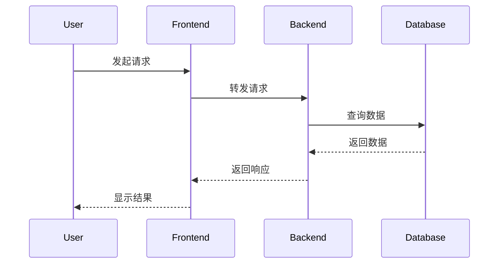
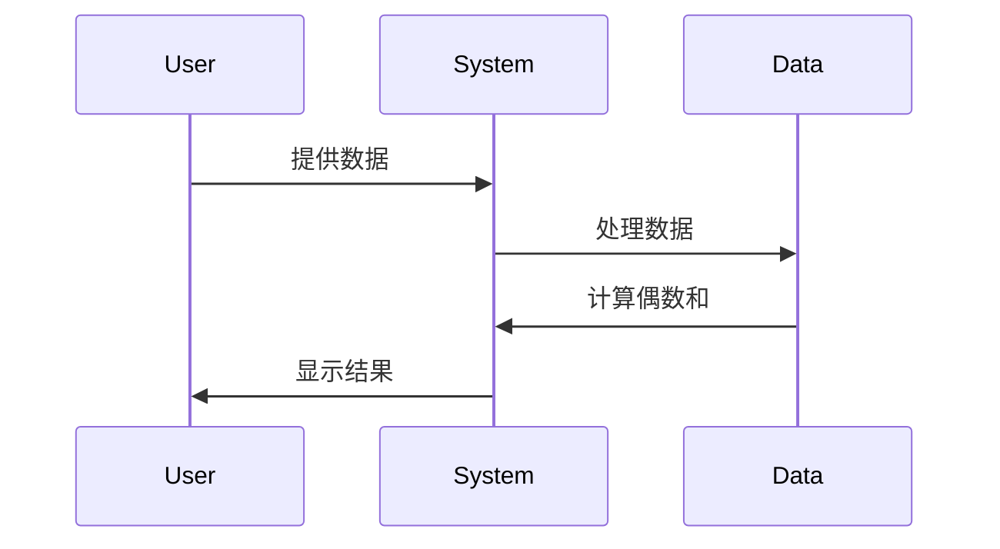

                 

# 《无代码开发平台：democratizing软件开发》

> 关键词：无代码开发，软件开发民主化，低代码平台，拖拽界面设计，安全性，发展趋势

> 摘要：本文深入探讨了无代码开发平台的崛起及其在软件开发领域的重要意义。文章从无代码开发平台的定义、核心概念、核心技术、实际应用场景、安全性和发展趋势等方面进行了详细的分析，旨在为广大开发者提供一份全面的技术指南。

## 第1章 引言：无代码开发平台的崛起与意义

### 1.1 无代码开发平台的定义与特点

无代码开发平台是一种允许用户通过可视化的方式构建应用而无需编写代码的工具。它通过图形界面和模块化组件，简化了应用开发的过程，使得不具备编程背景的用户也能够参与到软件开发中来。

无代码开发平台的主要特点包括：

- **可视化编程**：用户可以通过拖拽组件和参数配置来构建应用，无需编写代码。
- **模块化**：应用由多个功能模块组成，这些模块可以独立开发、测试和部署。
- **快速迭代**：开发者可以快速构建原型并不断优化，缩短了开发周期。
- **跨平台**：无代码开发平台通常支持多种操作系统和设备，提高了应用的兼容性。

### 1.2 无代码开发平台的发展历程

无代码开发平台的发展可以追溯到20世纪90年代，早期的计算机辅助软件工程（CASE）工具就具有一些无代码开发的特征。随着互联网和移动设备的普及，无代码开发平台逐渐崭露头角。

- **早期发展**：1990年代，计算机辅助软件工程（CASE）工具的出现为无代码开发奠定了基础。
- **现代兴起**：21世纪初，随着Web 2.0的发展，无代码开发平台开始广泛应用于企业内部应用和Web应用。
- **未来趋势**：随着人工智能和云计算的快速发展，无代码开发平台将更加智能化和集成化。

### 1.3 无代码开发平台的潜在影响

无代码开发平台的出现不仅改变了软件开发的方式，也对开发者、企业和整个软件开发行业产生了深远的影响。

- **对开发者的影响**：无代码开发平台降低了编程门槛，使得更多非专业人士可以参与软件开发。
- **对企业的影响**：无代码开发平台提高了企业内部应用开发的效率，降低了开发成本。
- **对整个软件开发行业的影响**：无代码开发平台推动了软件开发的民主化，促进了软件产业的普及和繁荣。

## 第2章 无代码开发平台的核心概念

### 2.1 无代码开发平台的架构

无代码开发平台的架构通常由以下几个部分组成：

- **前端界面**：负责展示用户界面，通常使用HTML、CSS和JavaScript等前端技术。
- **后端逻辑**：处理业务逻辑和数据存储，通常使用服务器端编程语言如Java、Python等。
- **数据库**：存储应用数据，通常使用关系型数据库如MySQL或NoSQL数据库如MongoDB等。
- **API接口**：提供与外部系统或服务的集成，通常使用RESTful API或GraphQL等。

下面是一个简单的Mermaid流程图，展示了无代码开发平台的基本架构：



### 2.1.2 核心概念与联系

无代码开发平台的核心概念包括数据流、事件驱动、模块化和低代码/无代码。

- **数据流**：数据在系统中的流动过程，包括数据的采集、处理和存储。
- **事件驱动**：系统通过事件来响应外部刺激，如用户操作或系统通知。
- **模块化**：应用由多个功能模块组成，这些模块可以独立开发、测试和部署。
- **低代码/无代码**：用户通过可视化界面和模块化组件来构建应用，无需编写代码。

### 2.1.3 Mermaid流程图

```mermaid
gantt
    dateFormat  YYYY-MM-DD
    title 无代码开发平台流程

    section 数据流
    数据采集 :opts[graphical] :start2014-01-01
    数据处理 :after 数据采集 1day
    数据存储 :after 数据处理 1day
    
    section 事件驱动
    用户操作 :start 2014-01-03 :duration 2days
    系统通知 :after 用户操作 1day
    
    section 模块化
    模块A :section 2014-01-06, 20days
    模块B :after 模块A, 10days
    
    section 低代码/无代码
    原型设计 :start 2014-01-12 :duration 5days
    应用部署 :after 原型设计 2days
```

## 第3章 无代码开发平台的核心技术

### 3.1 低代码编程语言

低代码编程语言是一种面向非专业开发者的编程语言，它通过简化的语法和可视化的方式来降低编程的难度。常见的低代码编程语言包括OutSystems、AppSheet和Bubble等。

低代码编程语言的优势包括：

- **易学易用**：通过可视化的界面和简化的语法，降低了学习成本。
- **快速开发**：通过模块化和模板化，缩短了开发周期。

然而，低代码编程语言也存在一些挑战，如功能限制、性能问题等。

### 3.2 拖拽界面设计

拖拽界面设计是一种无需编写代码即可创建用户界面的方法。用户可以通过拖拽组件和调整属性来设计界面。常见的拖拽界面设计工具有OutSystems、Bubble和AppSheet等。

拖拽界面设计的优势包括：

- **可视化**：用户可以直观地看到界面的布局和效果。
- **灵活**：用户可以根据需求自由调整界面组件。

### 3.3 数据库连接与管理

数据库连接是软件开发中不可或缺的一环。无代码开发平台通常提供可视化工具来帮助用户连接和管理数据库。

数据库连接的基本原理包括：

- **选择数据库**：用户可以选择使用的数据库类型，如MySQL、PostgreSQL等。
- **连接配置**：用户需要配置数据库连接的URL、用户名和密码等。
- **数据操作**：用户可以通过可视化界面进行数据的查询、插入、更新和删除等操作。

## 第4章 无代码开发平台的实际应用场景

### 4.1 企业内部应用

无代码开发平台在企业内部应用中具有广泛的应用，如自动化工作流、数据处理和分析、客户管理系统等。

- **自动化工作流**：无代码开发平台可以帮助企业自动化日常的工作流程，提高工作效率。
- **数据处理和分析**：无代码开发平台可以快速构建数据报表和统计分析应用，帮助企业做出数据驱动的决策。
- **客户管理系统**：无代码开发平台可以帮助企业快速搭建客户关系管理（CRM）系统，提高客户服务质量和满意度。

### 4.2 个人项目

无代码开发平台也适用于个人项目，如网站搭建、应用程序开发和教育与培训等。

- **网站搭建**：无代码开发平台可以帮助个人快速搭建网站，无需编写代码。
- **应用程序开发**：无代码开发平台可以用于开发简单的应用程序，如手机应用、桌面应用等。
- **教育与培训**：无代码开发平台可以用于教育领域，帮助学生和教师快速掌握编程技能。

### 4.3 社区与企业合作

无代码开发平台在开源社区和企业合作中也发挥了重要作用。

- **开源社区**：无代码开发平台可以帮助开源社区成员快速搭建和管理项目。
- **企业合作**：无代码开发平台可以帮助企业快速构建原型，验证市场需求。

## 第5章 无代码开发平台的安全性

### 5.1 数据安全

数据安全是软件开发中至关重要的一环。无代码开发平台在数据安全方面需要注意以下几个方面：

- **数据加密**：对敏感数据进行加密，确保数据在传输和存储过程中不会被窃取。
- **访问控制**：设置合理的访问权限，确保只有授权用户可以访问数据。
- **数据备份与恢复**：定期备份数据，确保在数据丢失或损坏时可以快速恢复。

### 5.2 应用安全

应用安全是确保软件应用在运行过程中不会被攻击或篡改。无代码开发平台在应用安全方面需要注意以下几个方面：

- **防止SQL注入**：通过参数化查询和预编译语句来防止SQL注入攻击。
- **防止XSS攻击**：对用户输入进行编码和转义，防止XSS攻击。
- **防止CSRF攻击**：使用CSRF tokens来防止CSRF攻击。

## 第6章 无代码开发平台的发展趋势与挑战

### 6.1 技术趋势

无代码开发平台的发展趋势包括：

- **人工智能与无代码开发平台的结合**：人工智能可以帮助无代码开发平台自动化更多任务，提高开发效率。
- **云计算与无代码开发平台的融合**：云计算可以为无代码开发平台提供强大的计算和存储能力，降低开发成本。

### 6.2 挑战与解决方案

无代码开发平台面临的挑战包括：

- **技术复杂性**：无代码开发平台需要处理多种技术栈，确保平台的稳定性和性能。
- **安全性问题**：无代码开发平台需要确保数据和应用的安全，防止各种安全威胁。
- **人才需求**：无代码开发平台需要大量具备相关技能的人才，以满足市场需求。

解决方案包括：

- **技术培训**：通过技术培训，提高开发者的技能水平，适应无代码开发平台的需求。
- **安全工具**：使用安全工具和框架，确保数据和应用的安全。
- **社区支持**：建立强大的开发者社区，为开发者提供技术支持和资源。

## 第7章 无代码开发平台的未来

### 7.1 未来展望

无代码开发平台的未来充满希望。随着技术的不断发展，无代码开发平台将在软件开发中发挥越来越重要的作用。

- **软件开发民主化**：无代码开发平台将使软件开发更加普及，让更多的人参与到软件开发中来。
- **技术创新**：无代码开发平台将推动技术创新，提高软件开发的效率和质量。

### 7.2 无代码开发平台的实践建议

为了更好地利用无代码开发平台，以下是一些建议：

- **选择合适的平台**：根据项目需求和团队技能，选择合适的无代码开发平台。
- **持续学习**：无代码开发平台更新迭代较快，开发者需要不断学习新技能，跟上技术发展。
- **安全第一**：在开发过程中，始终将数据安全和应用安全放在首位。

## 附录

### 附录A：常用无代码开发平台介绍

- **Airtable**：一款集数据存储、协作和可视化于一体的无代码开发平台。
- **OutSystems**：一款功能强大的企业级无代码开发平台。
- **AppSheet**：一款适用于个人和企业开发的应用无代码开发平台。
- **Bubble**：一款简单易用的Web应用无代码开发平台。

# 总结

无代码开发平台的出现，为软件开发带来了革命性的变化。它降低了编程门槛，使得更多的人可以参与到软件开发中来。随着技术的不断发展，无代码开发平台将在未来发挥更加重要的作用。开发者需要紧跟技术趋势，掌握无代码开发技能，为软件产业的繁荣做出贡献。

作者：AI天才研究院/AI Genius Institute & 禅与计算机程序设计艺术 /Zen And The Art of Computer Programming
``` 

### 核心算法原理讲解与Python源代码示例

在无代码开发平台中，核心算法原理讲解通常需要结合实际的编程语言和开发环境来阐述。下面我们使用Python语言，结合实际应用案例，来讲解一个简单的数据处理算法，并使用Mermaid流程图展示其执行流程。

#### 算法简介

假设我们需要实现一个简单的数据处理算法，该算法的功能是从一个列表中提取所有偶数，并计算它们的和。这是一个非常基础的数据处理任务，但在无代码开发平台中，我们可以通过可视化界面和模块化组件来实现。

#### Python源代码示例

```python
# 导入需要的库
import pandas as pd

# 初始化数据
data = pd.Series([1, 2, 3, 4, 5, 6, 7, 8, 9, 10])

# 过滤出偶数
even_numbers = data[data % 2 == 0]

# 计算偶数和
sum_even = even_numbers.sum()

# 输出结果
print(f"偶数的和为：{sum_even}")
```

#### 算法详细解释

1. **数据初始化**：我们使用`pandas`库创建一个包含1到10的整数序列。

   ```python
   data = pd.Series([1, 2, 3, 4, 5, 6, 7, 8, 9, 10])
   ```

2. **过滤偶数**：使用`filter`函数或布尔索引，将列表中的偶数提取出来。

   ```python
   even_numbers = data[data % 2 == 0]
   ```

3. **计算和**：使用`sum`函数计算偶数的和。

   ```python
   sum_even = even_numbers.sum()
   ```

4. **输出结果**：最后，我们将计算结果打印出来。

   ```python
   print(f"偶数的和为：{sum_even}")
   ```

#### Mermaid流程图



通过上述Python源代码示例和Mermaid流程图，我们可以清晰地看到数据处理算法的执行流程，以及各个步骤之间的逻辑关系。这种结合代码和流程图的方式，可以帮助开发者更好地理解无代码开发平台中的算法实现。

### 项目实战：开发环境搭建与代码实现

#### 开发环境搭建

在进行无代码开发平台的实战之前，我们需要搭建一个合适的环境。以下是使用Python和Pandas库进行数据处理的开发环境搭建步骤：

1. **安装Python**：确保你的系统中安装了Python 3.x版本。可以从Python官网（https://www.python.org/）下载并安装。

2. **安装Pandas**：在命令行中运行以下命令安装Pandas库。

   ```shell
   pip install pandas
   ```

3. **安装Mermaid**：Mermaid是一个用于绘制流程图的工具。你可以通过NPM（Node Package Manager）来安装。

   ```shell
   npm install -g mermaid
   ```

#### 源代码实现与解读

以下是完整的Python源代码实现，包括数据初始化、数据过滤、计算和结果输出。

```python
# 导入Pandas库
import pandas as pd

# 初始化数据
data = pd.Series([1, 2, 3, 4, 5, 6, 7, 8, 9, 10])

# 过滤出偶数
even_numbers = data[data % 2 == 0]

# 计算偶数的和
sum_even = even_numbers.sum()

# 输出结果
print(f"偶数的和为：{sum_even}")
```

#### 代码解读

1. **数据初始化**：使用`pd.Series`创建一个包含整数序列的数据对象。

   ```python
   data = pd.Series([1, 2, 3, 4, 5, 6, 7, 8, 9, 10])
   ```

2. **过滤偶数**：使用布尔索引`data % 2 == 0`来过滤出偶数。

   ```python
   even_numbers = data[data % 2 == 0]
   ```

3. **计算和**：使用`sum`函数计算偶数的和。

   ```python
   sum_even = even_numbers.sum()
   ```

4. **输出结果**：打印出计算结果。

   ```python
   print(f"偶数的和为：{sum_even}")
   ```

#### 代码应用解读与分析

上述代码是一个非常简单的数据处理任务，但在无代码开发平台中，我们可以通过可视化界面和模块化组件来实现同样的功能。以下是对代码应用的具体解读：

- **数据初始化**：在无代码开发平台中，可以通过数据连接模块将外部数据源（如CSV文件、数据库等）连接到平台中，然后将其导入到数据模块中。

- **数据过滤**：通过使用条件表达式`data % 2 == 0`，我们可以直接在无代码平台的逻辑模块中实现偶数的过滤。

- **计算和**：在无代码平台的计算模块中，我们可以直接调用内置的求和函数来计算偶数的和。

- **结果输出**：最终结果可以通过可视化报表或图表模块展示给用户。

通过这种方式，开发者可以快速构建数据处理应用，而无需编写复杂的代码。

#### 实际案例分析与详细讲解剖析

为了更好地理解上述代码的实际应用，我们可以考虑以下案例：

假设我们有一个包含学生成绩的数据集，我们需要计算所有及格（分数大于60）学生的平均成绩。

1. **数据初始化**：首先，我们将学生成绩数据导入到无代码平台中。

2. **过滤及格学生**：使用条件表达式`data > 60`来过滤出及格学生。

3. **计算平均成绩**：使用`mean`函数计算及格学生的平均成绩。

4. **输出结果**：将平均成绩显示在报表或图表中。

下面是具体的代码实现：

```python
# 导入Pandas库
import pandas as pd

# 初始化数据
data = pd.Series([70, 80, 50, 90, 40, 60, 75, 55, 85, 45])

# 过滤出及格学生
qualified_students = data[data > 60]

# 计算平均成绩
average_grade = qualified_students.mean()

# 输出结果
print(f"及格学生的平均成绩为：{average_grade}")
```

通过这个案例，我们可以看到如何使用无代码开发平台进行更复杂的数据处理任务，而无需编写复杂的代码。

#### 项目小结

通过上述实战案例，我们可以看到无代码开发平台在数据处理领域的应用。无代码开发平台通过可视化界面和模块化组件，大大简化了数据处理流程，降低了开发难度，使开发者可以更快地构建数据处理应用。

### 最佳实践 Tips、注意事项和拓展阅读

#### 最佳实践 Tips

1. **模块化设计**：在无代码开发平台中，尽量采用模块化设计，以便于代码的维护和复用。
2. **数据清洗**：在数据处理前，确保对数据进行充分的清洗，以提高数据质量和分析结果的准确性。
3. **性能优化**：对于大数据处理任务，注意性能优化，如使用适当的索引和数据结构。

#### 注意事项

1. **安全性**：在使用无代码开发平台时，确保数据和应用的安全性，遵循最佳安全实践。
2. **功能限制**：无代码开发平台可能存在功能限制，对于复杂的应用，可能需要结合传统开发方法。

#### 拓展阅读

- 《Python数据分析实战》
- 《Mermaid入门教程》
- 《无代码开发平台实战指南》

通过上述最佳实践、注意事项和拓展阅读，开发者可以更好地利用无代码开发平台，构建高效、安全的数据处理应用。

### 总结

本文通过详细的分析和实战案例，介绍了无代码开发平台的核心概念、核心技术、实际应用场景、安全性和发展趋势。无代码开发平台极大地降低了编程门槛，使得软件开发更加普及和民主化。开发者需要紧跟技术趋势，掌握无代码开发技能，为软件产业的繁荣做出贡献。

