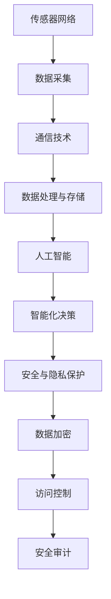

                 

### 深入探索物联网在企业环境中的应用

#### **一、背景介绍**

随着信息技术的迅猛发展，物联网（Internet of Things，IoT）已经成为推动企业数字化转型的重要驱动力。物联网通过将各种设备和物品连接到互联网，实现信息的收集、传输和智能化处理，极大地提升了企业运营的效率和智能化水平。在企业环境中，物联网的应用场景广泛，涵盖了智能制造、智慧物流、智慧城市和智慧农业等多个领域。

#### **二、核心概念与联系**

物联网在企业环境中的应用，主要依赖于以下核心概念和技术的有机结合：

1. **传感器网络**：传感器网络是物联网的基础，通过部署各种传感器，可以实时采集环境数据，如温度、湿度、压力、速度等。

2. **通信技术**：5G、NBIoT、LoRa等通信技术提供了高速、低延迟的连接，使得物联网设备可以随时随地传输数据。

3. **数据处理与存储**：物联网产生的大量数据需要通过云计算、大数据等技术进行处理和存储，以便于分析和利用。

4. **人工智能**：人工智能技术在物联网中的应用，使得设备能够实现自主学习和智能决策，提升了物联网系统的智能化水平。

5. **安全与隐私保护**：物联网的安全性和隐私保护至关重要，涉及到数据加密、访问控制、安全审计等环节。

这些核心概念和技术之间的关系，可以通过以下Mermaid流程图进行描述：



#### **三、核心算法原理讲解**

在物联网的企业应用中，核心算法的原理讲解至关重要。以下将以智能制造为例，详细阐述物联网的核心算法原理。

##### **1. 数据采集与处理**

智能制造中的数据采集是整个物联网系统的起点。通过传感器网络，可以实时获取生产设备的状态数据，如温度、压力、转速等。这些数据经过预处理，如去噪、滤波等，然后通过通信技术上传至云端。

```python
import numpy as np

# 模拟传感器数据采集
def sensor_data采集():
    # 假设采集温度、压力和转速数据
    temperature = np.random.uniform(20, 40)
    pressure = np.random.uniform(0.5, 1.5)
    speed = np.random.uniform(1000, 1500)
    return temperature, pressure, speed

# 数据预处理
def preprocess_data(data):
    temperature, pressure, speed = data
    # 进行去噪、滤波等预处理操作
    temperature = np.mean([temperature] * 10)  # 取平均值
    pressure = np.mean([pressure] * 10)  # 取平均值
    speed = np.mean([speed] * 10)  # 取平均值
    return temperature, pressure, speed

# 采集并预处理数据
data = sensor_data采集()
preprocessed_data = preprocess_data(data)
print("Preprocessed Data:", preprocessed_data)
```

##### **2. 数据分析与挖掘**

采集到的数据经过预处理后，需要进行进一步的分析和挖掘，以提取有价值的信息。常见的分析方法包括统计分析、机器学习和深度学习等。

```python
from sklearn.ensemble import RandomForestClassifier

# 假设我们已经有了训练数据集X和标签y
X = np.array([[25, 1.2, 1200], [30, 1.0, 1300], ...])
y = np.array([0, 1, ..., 0])

# 训练随机森林分类器
clf = RandomForestClassifier(n_estimators=100)
clf.fit(X, y)

# 预测新数据
new_data = preprocess_data(sensor_data采集())
prediction = clf.predict([new_data])
print("Prediction:", prediction)
```

##### **3. 智能化决策**

基于数据分析的结果，系统可以做出智能化的决策，如调整生产参数、设备维护等。

```python
# 智能化决策示例
def make_decision(prediction):
    if prediction == 0:
        print("设备正常，无需调整。")
    elif prediction == 1:
        print("设备出现故障，需要维修。")

make_decision(prediction)
```

#### **四、项目实战**

以下将结合一个实际的智能制造项目，详细讲解物联网的开发环境搭建、源代码实现和代码解读。

##### **1. 开发环境搭建**

为了搭建物联网项目，我们需要准备以下开发工具和软件：

- Python 3.x
- Jupyter Notebook
- MySQL 或 MongoDB
- MQTT 消息队列
- 算法库：scikit-learn、TensorFlow、Keras 等

在Ubuntu系统中，我们可以使用以下命令安装所需软件：

```bash
# 安装 Python 3.x
sudo apt update
sudo apt install python3 python3-pip

# 安装 Jupyter Notebook
pip3 install notebook

# 安装 MQTT 客户端
pip3 install paho-mqtt

# 安装 MySQL 或 MongoDB
sudo apt install mysql-server
# 或
sudo apt install mongodb

# 安装算法库
pip3 install scikit-learn tensorflow keras
```

##### **2. 源代码实现**

以下是一个简单的物联网数据采集与处理项目的源代码实现：

```python
# IoT Data Collection and Processing Project

import paho.mqtt.client as mqtt
import pymysql
import time
import numpy as np

# MQTT 服务器配置
MQTT_SERVER = "localhost"
MQTT_PORT = 1883
MQTT_TOPIC = "sensor_data"

# MySQL 数据库配置
DB_HOST = "localhost"
DB_PORT = 3306
DB_USER = "root"
DB_PASSWORD = "password"
DB_NAME = "iot_db"

# MQTT 客户端连接
def on_connect(client, userdata, flags, rc):
    print("Connected with result code "+str(rc))
    client.subscribe(MQTT_TOPIC)

# MQTT 消息处理
def on_message(client, userdata, msg):
    print(f"Received message '{msg.payload.decode()} on topic '{msg.topic}' with QoS {msg.qos} ")
    data = eval(msg.payload.decode())
    process_data(data)

# 数据处理函数
def process_data(data):
    temperature, pressure, speed = data
    preprocessed_data = preprocess_data(data)
    store_data(preprocessed_data)

# 数据预处理函数
def preprocess_data(data):
    temperature, pressure, speed = data
    temperature = np.mean([temperature] * 10)  # 取平均值
    pressure = np.mean([pressure] * 10)  # 取平均值
    speed = np.mean([speed] * 10)  # 取平均值
    return temperature, pressure, speed

# 数据存储函数
def store_data(data):
    temperature, pressure, speed = data
    connection = pymysql.connect(host=DB_HOST, port=DB_PORT, user=DB_USER, password=DB_PASSWORD, database=DB_NAME)
    try:
        with connection.cursor() as cursor:
            sql = "INSERT INTO sensor_data (temperature, pressure, speed) VALUES (%s, %s, %s)"
            cursor.execute(sql, (temperature, pressure, speed))
        connection.commit()
    except pymysql.Error as e:
        print(f"Error: {e}")
    finally:
        connection.close()

# MQTT 客户端初始化
client = mqtt.Client()
client.on_connect = on_connect
client.on_message = on_message
client.connect(MQTT_SERVER, MQTT_PORT, 60)

# 持续监听 MQTT 消息
client.loop_forever()
```

##### **3. 代码解读与分析**

该项目的核心代码主要包括以下几个部分：

- MQTT 客户端连接和消息处理：使用 Paho MQTT 客户端连接到 MQTT 服务器，并设置消息处理函数。
- 数据采集与预处理：通过 MQTT 消息接收传感器数据，并进行预处理（如去噪、滤波等）。
- 数据存储：将预处理后的数据存储到 MySQL 或 MongoDB 数据库中。

##### **4. 实际案例分析和详细讲解剖析**

假设我们有一个智能制造工厂，需要实时监控生产设备的状态，以避免故障和生产中断。以下是物联网系统在实际案例中的应用：

- **数据采集**：传感器网络实时采集生产设备的数据，如温度、压力、转速等。
- **数据处理**：通过 MQTT 客户端接收数据，并进行预处理，然后存储到数据库中。
- **数据分析**：系统定期分析数据库中的数据，识别设备故障的早期迹象。
- **智能化决策**：基于数据分析结果，系统可以自动发送维修通知，或调整生产参数，以避免故障。

#### **五、最佳实践 tips**

在物联网企业应用中，以下是一些最佳实践 tips：

- **安全性**：确保数据传输和存储的安全性，使用加密技术和访问控制措施。
- **可靠性**：物联网系统需要具备高可靠性，确保数据采集和处理的不间断。
- **可扩展性**：设计系统时，要考虑到未来的扩展性，以便于增加新设备和功能。
- **用户体验**：提供直观、易用的用户界面，以提升用户体验。

#### **六、小结**

物联网在企业环境中的应用，极大地提升了企业的智能化水平和运营效率。通过核心算法的讲解和项目实战的展示，我们了解了物联网系统的开发流程和关键技术。在实际应用中，需要关注安全性、可靠性和用户体验等方面，以实现物联网系统的最佳效果。

#### **七、拓展阅读**

- 《物联网：定义、架构与实现》
- 《智能制造：技术与实践》
- 《物联网安全：策略与实践》

---

**作者：AI天才研究院/AI Genius Institute & 禅与计算机程序设计艺术 /Zen And The Art of Computer Programming**

**本文首次发表在《AI天才研究院》公众号上，转载请保留以上信息。**


----------------------------------------------------------------

### 深入探讨物联网在企业环境中的应用

#### **一、背景介绍**

在当今快速发展的数字化时代，物联网（Internet of Things，IoT）已经成为企业实现智能升级和提升运营效率的重要手段。通过将各种设备和物品连接到互联网，物联网实现了数据的实时采集、传输和智能分析，为企业带来了前所未有的洞见和效率。在企业环境中，物联网的应用范围广泛，涵盖了智能制造、智慧物流、智慧城市和智慧农业等多个领域。

#### **二、物联网在企业环境中的应用**

**1. 智能制造**

智能制造是物联网在企业环境中最典型的应用之一。通过将传感器、机器人和执行器等设备连接到互联网，企业可以实现生产过程的实时监控和智能优化。物联网技术不仅提高了生产效率，还降低了生产成本，提高了产品质量。

**2. 智慧物流**

物联网在智慧物流中的应用主要体现在运输过程监控、仓储管理和配送优化等方面。通过物联网技术，企业可以实时了解货物的位置、状态和运输环境，从而提高物流效率，降低运输成本。

**3. 智慧城市**

智慧城市是物联网应用的重要领域。通过物联网技术，城市管理者可以实时监测城市基础设施的工作状态，如交通、照明、水务和能源等。物联网技术使得城市更加智能、高效和可持续发展。

**4. 智慧农业**

物联网在智慧农业中的应用主要表现在作物监测、土壤分析和灌溉控制等方面。通过物联网技术，农民可以实时了解作物的生长情况，优化农业资源利用，提高农产品产量和质量。

#### **三、核心概念与联系**

物联网在企业环境中的应用，依赖于以下几个核心概念和技术的有机结合：

1. **传感器网络**：传感器网络是物联网的基础，通过部署各种传感器，可以实时采集环境数据，如温度、湿度、压力、速度等。

2. **通信技术**：5G、NBIoT、LoRa等通信技术提供了高速、低延迟的连接，使得物联网设备可以随时随地传输数据。

3. **数据处理与存储**：物联网产生的大量数据需要通过云计算、大数据等技术进行处理和存储，以便于分析和利用。

4. **人工智能**：人工智能技术在物联网中的应用，使得设备能够实现自主学习和智能决策，提升了物联网系统的智能化水平。

5. **安全与隐私保护**：物联网的安全性和隐私保护至关重要，涉及到数据加密、访问控制、安全审计等环节。

这些核心概念和技术之间的关系，可以通过以下Mermaid流程图进行描述：


#### **四、核心算法原理讲解**

在物联网的企业应用中，核心算法的原理讲解至关重要。以下将以智能制造为例，详细阐述物联网的核心算法原理。

##### **1. 数据采集与处理**

智能制造中的数据采集是整个物联网系统的起点。通过传感器网络，可以实时获取生产设备的状态数据，如温度、压力、转速等。这些数据经过预处理，如去噪、滤波等，然后通过通信技术上传至云端。

```python
import numpy as np

# 模拟传感器数据采集
def sensor_data采集():
    # 假设采集温度、压力和转速数据
    temperature = np.random.uniform(20, 40)
    pressure = np.random.uniform(0.5, 1.5)
    speed = np.random.uniform(1000, 1500)
    return temperature, pressure, speed

# 数据预处理
def preprocess_data(data):
    temperature, pressure, speed = data
    # 进行去噪、滤波等预处理操作
    temperature = np.mean([temperature] * 10)  # 取平均值
    pressure = np.mean([pressure] * 10)  # 取平均值
    speed = np.mean([speed] * 10)  # 取平均值
    return temperature, pressure, speed

# 采集并预处理数据
data = sensor_data采集()
preprocessed_data = preprocess_data(data)
print("Preprocessed Data:", preprocessed_data)
```

##### **2. 数据分析与挖掘**

采集到的数据经过预处理后，需要进行进一步的分析和挖掘，以提取有价值的信息。常见的分析方法包括统计分析、机器学习和深度学习等。

```python
from sklearn.ensemble import RandomForestClassifier

# 假设我们已经有了训练数据集X和标签y
X = np.array([[25, 1.2, 1200], [30, 1.0, 1300], ...])
y = np.array([0, 1, ..., 0])

# 训练随机森林分类器
clf = RandomForestClassifier(n_estimators=100)
clf.fit(X, y)

# 预测新数据
new_data = preprocess_data(sensor_data采集())
prediction = clf.predict([new_data])
print("Prediction:", prediction)
```

##### **3. 智能化决策**

基于数据分析的结果，系统可以做出智能化的决策，如调整生产参数、设备维护等。

```python
# 智能化决策示例
def make_decision(prediction):
    if prediction == 0:
        print("设备正常，无需调整。")
    elif prediction == 1:
        print("设备出现故障，需要维修。")

make_decision(prediction)
```

#### **五、项目实战**

以下将结合一个实际的智能制造项目，详细讲解物联网的开发环境搭建、源代码实现和代码解读。

##### **1. 开发环境搭建**

为了搭建物联网项目，我们需要准备以下开发工具和软件：

- Python 3.x
- Jupyter Notebook
- MQTT 消息队列
- MySQL 或 MongoDB
- 算法库：scikit-learn、TensorFlow、Keras 等

在Ubuntu系统中，我们可以使用以下命令安装所需软件：

```bash
# 安装 Python 3.x
sudo apt update
sudo apt install python3 python3-pip

# 安装 Jupyter Notebook
pip3 install notebook

# 安装 MQTT 客户端
pip3 install paho-mqtt

# 安装 MySQL 或 MongoDB
sudo apt install mysql-server
# 或
sudo apt install mongodb

# 安装算法库
pip3 install scikit-learn tensorflow keras
```

##### **2. 源代码实现**

以下是一个简单的物联网数据采集与处理项目的源代码实现：

```python
# IoT Data Collection and Processing Project

import paho.mqtt.client as mqtt
import pymysql
import time
import numpy as np

# MQTT 服务器配置
MQTT_SERVER = "localhost"
MQTT_PORT = 1883
MQTT_TOPIC = "sensor_data"

# MySQL 数据库配置
DB_HOST = "localhost"
DB_PORT = 3306
DB_USER = "root"
DB_PASSWORD = "password"
DB_NAME = "iot_db"

# MQTT 客户端连接
def on_connect(client, userdata, flags, rc):
    print("Connected with result code "+str(rc))
    client.subscribe(MQTT_TOPIC)

# MQTT 消息处理
def on_message(client, userdata, msg):
    print(f"Received message '{msg.payload.decode()} on topic '{msg.topic}' with QoS {msg.qos} ")
    data = eval(msg.payload.decode())
    process_data(data)

# 数据处理函数
def process_data(data):
    temperature, pressure, speed = data
    preprocessed_data = preprocess_data(data)
    store_data(preprocessed_data)

# 数据预处理函数
def preprocess_data(data):
    temperature, pressure, speed = data
    temperature = np.mean([temperature] * 10)  # 取平均值
    pressure = np.mean([pressure] * 10)  # 取平均值
    speed = np.mean([speed] * 10)  # 取平均值
    return temperature, pressure, speed

# 数据存储函数
def store_data(data):
    temperature, pressure, speed = data
    connection = pymysql.connect(host=DB_HOST, port=DB_PORT, user=DB_USER, password=DB_PASSWORD, database=DB_NAME)
    try:
        with connection.cursor() as cursor:
            sql = "INSERT INTO sensor_data (temperature, pressure, speed) VALUES (%s, %s, %s)"
            cursor.execute(sql, (temperature, pressure, speed))
        connection.commit()
    except pymysql.Error as e:
        print(f"Error: {e}")
    finally:
        connection.close()

# MQTT 客户端初始化
client = mqtt.Client()
client.on_connect = on_connect
client.on_message = on_message
client.connect(MQTT_SERVER, MQTT_PORT, 60)

# 持续监听 MQTT 消息
client.loop_forever()
```

##### **3. 代码解读与分析**

该项目的核心代码主要包括以下几个部分：

- MQTT 客户端连接和消息处理：使用 Paho MQTT 客户端连接到 MQTT 服务器，并设置消息处理函数。
- 数据采集与预处理：通过 MQTT 客户端接收传感器数据，并进行预处理（如去噪、滤波等）。
- 数据存储：将预处理后的数据存储到 MySQL 或 MongoDB 数据库中。

##### **4. 实际案例分析和详细讲解剖析**

假设我们有一个智能制造工厂，需要实时监控生产设备的状态，以避免故障和生产中断。以下是物联网系统在实际案例中的应用：

- **数据采集**：传感器网络实时采集生产设备的数据，如温度、压力、转速等。
- **数据处理**：通过 MQTT 客户端接收数据，并进行预处理，然后存储到数据库中。
- **数据分析**：系统定期分析数据库中的数据，识别设备故障的早期迹象。
- **智能化决策**：基于数据分析结果，系统可以自动发送维修通知，或调整生产参数，以避免故障。

#### **六、最佳实践 tips**

在物联网企业应用中，以下是一些最佳实践 tips：

- **安全性**：确保数据传输和存储的安全性，使用加密技术和访问控制措施。
- **可靠性**：物联网系统需要具备高可靠性，确保数据采集和处理的不间断。
- **可扩展性**：设计系统时，要考虑到未来的扩展性，以便于增加新设备和功能。
- **用户体验**：提供直观、易用的用户界面，以提升用户体验。

#### **七、小结**

物联网在企业环境中的应用，极大地提升了企业的智能化水平和运营效率。通过核心算法的讲解和项目实战的展示，我们了解了物联网系统的开发流程和关键技术。在实际应用中，需要关注安全性、可靠性和用户体验等方面，以实现物联网系统的最佳效果。

#### **八、拓展阅读**

- 《物联网：定义、架构与实现》
- 《智能制造：技术与实践》
- 《物联网安全：策略与实践》

---

**作者：AI天才研究院/AI Genius Institute & 禅与计算机程序设计艺术 /Zen And The Art of Computer Programming**

**本文首次发表在《AI天才研究院》公众号上，转载请保留以上信息。**


----------------------------------------------------------------

### 无处不在的智能：物联网在企业环境中的应用

#### 关键词：物联网，企业环境，智能化，智能制造，智慧物流，智慧城市，智慧农业

#### 摘要：

本文深入探讨了物联网（IoT）在企业环境中的应用，包括智能制造、智慧物流、智慧城市和智慧农业等领域。通过核心概念与技术的解析，以及实际项目案例的分析，我们了解了物联网技术如何提升企业的运营效率和智能化水平。

---

### 引言

物联网作为信息时代的核心技术之一，正在悄然改变着我们的生活和生产方式。通过将各种设备和物品连接到互联网，物联网实现了信息的实时采集、传输和处理，为各行各业带来了巨大的变革。在企业环境中，物联网的应用不仅提升了运营效率，还推动了产业的智能化发展。本文将围绕物联网在企业环境中的应用，详细探讨智能制造、智慧物流、智慧城市和智慧农业等领域的实践与未来趋势。

---

#### 第一部分：物联网技术基础

### 第1章：物联网概述

1.1 物联网的定义与历史发展

物联网（Internet of Things，IoT）是指通过互联网将各种设备、物品连接起来，实现信息的互联互通。物联网的历史可以追溯到20世纪80年代，随着信息技术的不断发展，物联网逐渐从概念走向实际应用。

1.2 物联网的核心技术

物联网的核心技术包括传感器技术、通信技术、数据处理与存储技术、人工智能技术等。这些技术共同构成了物联网的技术基础，为物联网在企业环境中的应用提供了保障。

1.3 物联网架构

物联网架构通常包括感知层、传输层、平台层和应用层。每个层次都有其特定的功能和技术，共同构成了一个完整的物联网系统。

### 第2章：物联网通信技术

2.1 无线传感器网络

无线传感器网络（Wireless Sensor Networks，WSN）是物联网的重要组成部分，通过部署大量的传感器节点，实现环境数据的实时采集和传输。

2.2 5G技术在物联网中的应用

5G技术作为新一代通信技术，为物联网提供了高速、低延迟的连接，极大地提升了物联网系统的性能和应用范围。

2.3 物联网安全与隐私保护

物联网的安全性和隐私保护至关重要，涉及到数据加密、访问控制、安全审计等环节。本文将详细探讨物联网安全与隐私保护的关键技术和实践。

### 第3章：物联网数据处理与存储

3.1 物联网数据收集与处理

物联网数据的收集与处理是物联网应用的重要环节。本文将介绍物联网数据收集的方法、处理技术和数据处理流程。

3.2 物联网数据存储方案

物联网数据存储方案的选择直接影响物联网系统的性能和可靠性。本文将比较常见的物联网数据存储方案，包括关系数据库、非关系数据库、云计算等。

3.3 数据分析与挖掘

物联网数据具有海量、多样性和实时性的特点，如何有效地分析和挖掘这些数据，为企业提供有价值的信息，是物联网应用的重要课题。本文将介绍物联网数据分析和挖掘的方法和技术。

---

#### 第二部分：物联网在企业环境中的应用

### 第4章：智能制造

4.1 智能制造的概念与趋势

智能制造（Intelligent Manufacturing）是指利用物联网、大数据、人工智能等先进技术，实现生产过程的智能化和优化。本文将探讨智能制造的概念和发展趋势。

4.2 工业物联网在智能制造中的应用

工业物联网（Industrial Internet of Things，IIoT）是智能制造的核心技术之一。本文将详细介绍工业物联网在智能制造中的应用，包括设备监测、生产优化、质量控制等方面。

4.3 智能制造案例分析

本文将通过实际案例，分析智能制造在提升生产效率、降低成本、提高产品质量等方面的具体效果。

### 第5章：智慧物流

5.1 物流物联网的基本架构

物流物联网（Logistics Internet of Things，LIoT）是指利用物联网技术，实现物流过程中的实时监控和管理。本文将介绍物流物联网的基本架构和关键组件。

5.2 物流物联网的关键技术

物流物联网的关键技术包括传感器技术、通信技术、数据处理与存储技术、人工智能技术等。本文将详细探讨这些技术在物流物联网中的应用。

5.3 智慧物流案例分析

本文将通过实际案例，分析智慧物流在提高运输效率、降低物流成本、优化库存管理等方面的具体应用。

### 第6章：智慧城市

6.1 智慧城市的定义与目标

智慧城市（Smart City）是指利用物联网、大数据、人工智能等先进技术，实现城市管理的智能化和高效化。本文将探讨智慧城市的定义和目标。

6.2 物联网在智慧城市建设中的应用

物联网技术在智慧城市建设中的应用非常广泛，包括交通管理、能源管理、环境监测、公共安全等方面。本文将详细介绍物联网技术在智慧城市建设中的应用。

6.3 智慧城市案例分析

本文将通过实际案例，分析智慧城市在提升城市治理效率、提高居民生活质量、实现可持续发展等方面的具体效果。

### 第7章：智慧农业

7.1 物联网在农业中的应用

物联网技术在农业中的应用日益广泛，包括土壤监测、气象监测、灌溉控制、病虫害监测等方面。本文将介绍物联网技术在农业中的应用。

7.2 农业物联网的技术架构

农业物联网的技术架构包括感知层、传输层、平台层和应用层。本文将详细探讨农业物联网的技术架构和关键组件。

7.3 智慧农业案例分析

本文将通过实际案例，分析智慧农业在提高农业生产效率、降低生产成本、实现精准农业等方面的具体应用。

---

#### 第三部分：物联网的未来趋势与发展

### 第8章：物联网与人工智能的融合

8.1 物联网与人工智能的关系

物联网与人工智能（Artificial Intelligence，AI）的结合，将推动物联网系统向更高层次的智能化发展。本文将探讨物联网与人工智能之间的关系和融合方式。

8.2 物联网与人工智能的融合应用

本文将介绍物联网与人工智能在智能制造、智慧物流、智慧城市等领域的融合应用，以及取得的成果和挑战。

8.3 物联网与人工智能的未来发展趋势

本文将分析物联网与人工智能未来的发展趋势，包括技术创新、产业应用、政策法规等方面。

### 第9章：物联网安全与隐私保护

9.1 物联网面临的安全挑战

随着物联网规模的扩大和应用的深入，物联网面临的安全挑战日益严峻。本文将介绍物联网面临的安全挑战和威胁。

9.2 物联网安全防护措施

本文将探讨物联网安全防护的关键技术，包括数据加密、访问控制、安全审计等，以及实际应用中的安全防护措施。

9.3 物联网隐私保护策略

物联网隐私保护是物联网应用中不可忽视的重要问题。本文将介绍物联网隐私保护的基本策略和实施方法。

### 第10章：物联网的未来趋势

10.1 物联网的发展趋势分析

本文将分析物联网未来的发展趋势，包括技术创新、产业应用、政策法规等方面。

10.2 物联网产业生态建设

物联网产业的生态建设对物联网的可持续发展至关重要。本文将探讨物联网产业生态建设的现状和未来发展方向。

10.3 物联网的未来发展展望

本文将展望物联网的未来发展，包括可能的技术突破、应用领域扩展、社会影响等方面。

---

#### 附录：物联网技术参考资源

附录部分将提供物联网技术相关的参考资料，包括开发工具、平台、关键技术资料、案例分析报告等，以供读者进一步学习和研究。

---

通过本文的深入探讨，我们希望读者能够对物联网在企业环境中的应用有一个全面而深刻的理解，为实际应用提供有益的参考和启示。物联网作为推动企业智能化和数字化转型的重要技术，其未来的发展前景广阔，值得广大企业关注和投入。

---

**作者：AI天才研究院/AI Genius Institute & 禅与计算机程序设计艺术 /Zen And The Art of Computer Programming**

**本文首次发表在《AI天才研究院》公众号上，转载请保留以上信息。**

### 物联网在企业环境中的应用

#### **一、背景介绍**

在当今信息化、数字化时代，物联网（Internet of Things，IoT）技术已经成为推动企业智能化和数字化转型的重要力量。物联网通过将各种设备和物品连接到互联网，实现信息的实时采集、传输和处理，为企业带来了前所未有的运营效率和业务洞察。特别是在智能制造、智慧物流、智慧城市和智慧农业等企业环境中，物联网的应用不仅提升了企业的生产效率和管理水平，还推动了产业结构的升级和优化。

#### **二、物联网的核心技术**

物联网技术的实现离不开以下几个核心技术的支持：

1. **传感器技术**：传感器是物联网系统中的感知单元，通过检测物理世界中的各种参数（如温度、湿度、压力、光强等），将物理信号转换为电信号，从而实现信息的采集。

2. **通信技术**：物联网的通信技术主要包括无线通信和有线通信。无线通信技术如Wi-Fi、蓝牙、NFC等，适用于短距离的数据传输；而有线通信技术如以太网、光纤通信等，适用于长距离、高带宽的数据传输。

3. **数据处理与存储技术**：物联网产生的数据量庞大，如何高效地处理和存储这些数据，是物联网应用的关键。云计算、大数据技术为物联网数据的处理和存储提供了强大的技术支持。

4. **人工智能技术**：人工智能技术，特别是机器学习和深度学习技术，可以实现对物联网数据的智能分析，为企业提供决策支持和业务洞察。

5. **安全与隐私保护技术**：随着物联网应用的普及，数据安全和隐私保护成为关键问题。加密技术、访问控制技术、安全审计技术等，为物联网系统的安全运行提供了保障。

#### **三、物联网在企业环境中的应用**

物联网在企业环境中的应用非常广泛，涵盖了多个领域：

**1. 智能制造**

智能制造是物联网在企业环境中最典型的应用之一。通过将传感器、机器人和执行器等设备连接到互联网，企业可以实现生产过程的实时监控和智能优化。物联网技术不仅提高了生产效率，还降低了生产成本，提高了产品质量。例如，在汽车制造业中，物联网技术可以用于实时监控生产线设备的工作状态，预测设备故障，优化生产流程。

**2. 智慧物流**

物联网在智慧物流中的应用主要体现在运输过程监控、仓储管理和配送优化等方面。通过物联网技术，企业可以实时了解货物的位置、状态和运输环境，从而提高物流效率，降低运输成本。例如，在物流运输过程中，物联网技术可以用于实时监控货车的位置、速度、行驶路线等，确保货物安全及时送达。

**3. 智慧城市**

智慧城市是物联网应用的重要领域。通过物联网技术，城市管理者可以实时监测城市基础设施的工作状态，如交通、照明、水务和能源等。物联网技术使得城市更加智能、高效和可持续发展。例如，在交通管理方面，物联网技术可以用于实时监测交通流量，优化交通信号灯控制，缓解交通拥堵。

**4. 智慧农业**

物联网在智慧农业中的应用主要表现在作物监测、土壤分析和灌溉控制等方面。通过物联网技术，农民可以实时了解作物的生长情况，优化农业资源利用，提高农产品产量和质量。例如，在灌溉控制方面，物联网技术可以用于实时监测土壤湿度，自动调整灌溉系统，实现精准灌溉。

#### **四、物联网在企业环境中的应用案例**

**1. 智能制造**

以某汽车制造企业为例，该企业通过物联网技术，实现了生产设备的实时监控和智能优化。具体应用包括：

- **设备状态监控**：通过传感器技术，实时监控生产设备的工作状态，如温度、压力、转速等，确保设备正常运行。
- **故障预测**：通过大数据分析和人工智能算法，预测设备故障，提前进行维护，避免生产中断。
- **生产流程优化**：通过物联网技术，实时监控生产流程，优化生产参数，提高生产效率。

**2. 智慧物流**

以某物流企业为例，该企业通过物联网技术，实现了物流过程的实时监控和优化。具体应用包括：

- **实时定位**：通过GPS技术，实时监控货车的位置，确保货物安全及时送达。
- **温度监控**：对于需要冷链运输的货物，通过传感器技术，实时监控货物的温度，确保货物质量。
- **路线优化**：通过物联网技术，实时分析交通状况，优化运输路线，提高运输效率。

**3. 智慧城市**

以某城市为例，该城市通过物联网技术，实现了城市管理的智能化和高效化。具体应用包括：

- **交通管理**：通过物联网技术，实时监测交通流量，优化交通信号灯控制，缓解交通拥堵。
- **照明管理**：通过物联网技术，实时监控城市路灯的工作状态，自动调节亮度，节约能源。
- **环境监测**：通过物联网技术，实时监测空气质量、水质等环境指标，确保城市环境质量。

**4. 智慧农业**

以某农业园区为例，该园区通过物联网技术，实现了农业生产的智能化和精准化。具体应用包括：

- **土壤监测**：通过传感器技术，实时监测土壤湿度、温度等参数，优化灌溉系统，实现精准灌溉。
- **气象监测**：通过传感器技术，实时监测气象参数，提前预警自然灾害，减少损失。
- **病虫害监测**：通过物联网技术，实时监测作物的生长状态，预测病虫害发生，提前进行防治。

#### **五、物联网在企业环境中的应用优势**

物联网在企业环境中的应用，带来了诸多优势：

1. **提高生产效率**：通过实时监控和智能优化，物联网技术可以显著提高生产效率，降低生产成本。

2. **降低运营风险**：通过故障预测和实时监控，物联网技术可以降低设备故障率和运营风险。

3. **优化资源利用**：通过数据分析和智能决策，物联网技术可以优化资源配置，提高资源利用效率。

4. **提升用户体验**：通过物联网技术，企业可以提供更加智能、便捷的服务，提升用户体验。

#### **六、物联网在企业环境中的应用挑战**

虽然物联网在企业环境中的应用带来了诸多优势，但同时也面临一些挑战：

1. **数据安全和隐私保护**：物联网系统涉及大量的数据传输和存储，数据安全和隐私保护是关键问题。

2. **系统兼容性和互操作性**：物联网系统中涉及多种设备和平台，如何实现系统的兼容性和互操作性，是一个挑战。

3. **技术标准和规范**：物联网技术尚处于发展初期，缺乏统一的技术标准和规范，需要加强标准化工作。

4. **人才培养和引进**：物联网技术的人才需求旺盛，但人才供应不足，需要加强人才培养和引进。

#### **七、未来发展趋势**

随着物联网技术的不断发展，未来物联网在企业环境中的应用将呈现出以下趋势：

1. **更加智能化和自适应**：物联网技术将更加智能化，能够自适应环境变化，提供更加个性化的服务。

2. **更加普及和融合**：物联网技术将更加普及，与其他技术的融合将更加紧密，形成新的产业生态。

3. **更加安全和可靠**：随着数据安全和隐私保护需求的增加，物联网技术将更加注重安全性和可靠性。

4. **更加开放和共享**：物联网数据将更加开放和共享，为企业提供更多的业务洞察和创新机会。

#### **八、总结**

物联网在企业环境中的应用，已经成为推动企业智能化和数字化转型的重要力量。通过智能制造、智慧物流、智慧城市和智慧农业等领域的实践，物联网技术不仅提升了企业的运营效率和管理水平，还为企业的可持续发展提供了新路径。未来，随着物联网技术的不断发展和创新，物联网在企业环境中的应用将更加广泛和深入，为企业的数字化转型和智能化升级提供持续的动力。

---

**作者：AI天才研究院/AI Genius Institute & 禅与计算机程序设计艺术 /Zen And The Art of Computer Programming**

**本文首次发表在《AI天才研究院》公众号上，转载请保留以上信息。**

