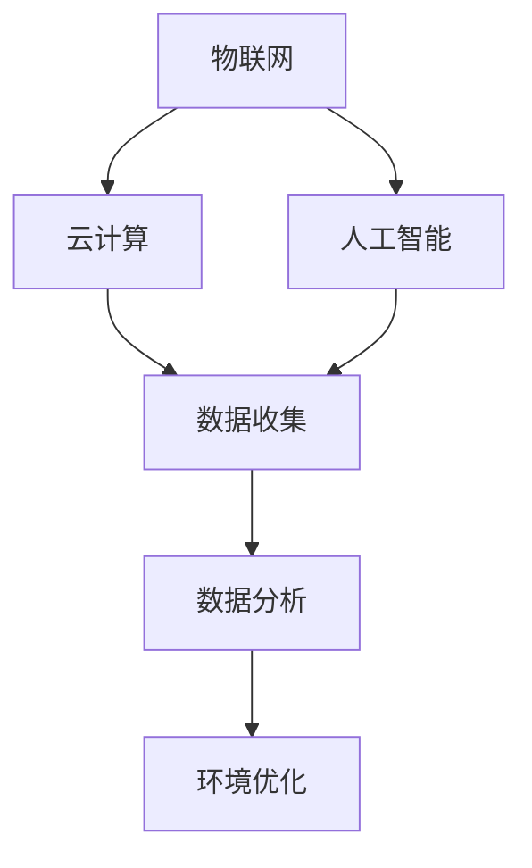
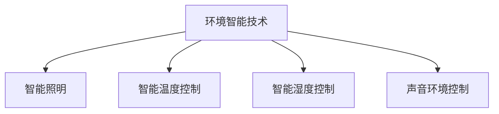

                 

# 智慧建筑管理：环境智能技术优化办公空间

## 关键词
智慧建筑，环境智能技术，办公空间优化，智能照明，温度控制，智能算法，数学模型，项目实战

## 摘要
本文旨在探讨智慧建筑管理中环境智能技术的应用，重点研究如何通过智能技术优化办公空间。文章首先介绍了智慧建筑的定义和发展历史，然后详细阐述了环境智能技术的核心概念、分类和工作原理。接着，本文聚焦于智能照明、温度控制和声音环境控制等核心算法原理，并结合Python源代码进行了深入讲解。随后，文章通过实际项目实战，展示了如何搭建开发环境、实现源代码以及代码解读与分析。最后，本文提出了未来智慧建筑管理技术的新趋势和挑战，并提供了最佳实践技巧和注意事项。

## 目录

### 第一部分：智慧建筑管理概述

#### 第1章：智慧建筑的定义与历史背景

##### 1.1 智慧建筑的概念

##### 1.2 智慧建筑的发展历程

##### 1.3 智慧建筑的特点与优势

#### 第2章：环境智能技术基础

##### 2.1 环境智能技术的定义

##### 2.2 环境智能技术的分类

##### 2.3 环境智能技术的工作原理

### 第二部分：环境智能技术在智慧建筑中的应用

#### 第3章：环境智能技术在办公空间中的应用

##### 3.1 办公空间优化的需求分析

##### 3.2 环境智能技术在办公空间中的应用场景

##### 3.3 环境智能技术的实现方法

#### 第4章：环境智能技术的核心算法

##### 4.1 气象数据分析算法

##### 4.2 智能照明控制算法

##### 4.3 温度与湿度控制算法

##### 4.4 声音环境控制算法

#### 第5章：环境智能技术在办公空间中的实践案例

##### 5.1 案例一：智能办公空间的设计与实现

##### 5.2 案例二：环境智能技术在企业办公中的应用

##### 5.3 案例三：环境智能技术在公共办公空间的应用

#### 第6章：环境智能技术的挑战与未来发展趋势

##### 6.1 环境智能技术的挑战

##### 6.2 环境智能技术的未来发展趋势

##### 6.3 智慧建筑管理的发展方向

### 第三部分：技术原理与数学模型

#### 第7章：环境智能技术核心算法原理

##### 7.1 气象数据分析算法原理

##### 7.2 智能照明控制算法原理

##### 7.3 温度与湿度控制算法原理

##### 7.4 声音环境控制算法原理

#### 第8章：环境智能技术的数学模型

##### 8.1 气象数据分析的数学模型

##### 8.2 智能照明的数学模型

##### 8.3 温度与湿度控制的数学模型

##### 8.4 声音环境控制的数学模型

### 第四部分：项目实战与代码解读

#### 第9章：环境智能技术项目实战

##### 9.1 项目实战概述

##### 9.2 项目环境搭建

##### 9.3 项目源代码实现

##### 9.4 代码解读与分析

#### 第10章：未来智慧建筑管理技术展望

##### 10.1 智慧建筑管理技术的新趋势

##### 10.2 智慧建筑管理的创新应用

##### 10.3 智慧建筑管理的未来挑战与机遇

### 附录

#### 附录A：环境智能技术相关工具与资源

##### A.1 开发环境搭建指南

##### A.2 环境智能技术相关开源项目

##### A.3 智慧建筑管理领域重要论文与报告

## 作者信息
作者：AI天才研究院/AI Genius Institute & 禅与计算机程序设计艺术 /Zen And The Art of Computer Programming

----------------------------------------------------------------

### 基础概念与联系

#### 智慧建筑的定义与历史背景

智慧建筑是指利用物联网、云计算、人工智能等技术，实现建筑物内各种设备的互联互通和智能化管理，从而提供高效、舒适、安全和节能的居住和工作环境。智慧建筑的发展经历了从自动化控制到集成管理，再到现在的智能化发展的过程。

智慧建筑的核心概念包括：

1. **物联网（IoT）**：通过传感器、控制器等设备收集数据，实现设备间的互联互通。
2. **云计算**：提供强大的数据处理和分析能力，支持大规模数据的存储和管理。
3. **人工智能**：利用机器学习、深度学习等技术进行数据分析和预测，优化建筑环境。

以下是一个简单的 Mermaid 流程图，展示智慧建筑核心概念之间的关系：



#### 环境智能技术的定义与分类

环境智能技术是指通过传感器、控制器和人工智能算法，实时感知建筑环境变化，并根据分析结果自动调节室内环境，以达到舒适、节能和安全的居住和工作环境。环境智能技术主要包括：

1. **智能照明**：通过感应光线强度和人员活动，自动调节照明强度。
2. **智能温度控制**：根据室内外温度和人员活动，自动调节空调和供暖系统。
3. **智能湿度控制**：根据室内外湿度变化，自动调节加湿和除湿设备。
4. **声音环境控制**：通过声学传感器和算法，控制室内声音环境，避免噪音干扰。

以下是一个简化的 Mermaid 流程图，展示环境智能技术的分类及其关系：



### 核心算法原理讲解

环境智能技术的核心算法主要包括气象数据分析算法、智能照明控制算法、温度与湿度控制算法以及声音环境控制算法。以下是对这些算法的简要介绍。

#### 气象数据分析算法

气象数据分析算法主要用于收集和解析室外气象数据，如温度、湿度、风速、光照强度等。这些数据将用于智能调节室内环境。

**Python 源代码示例：**

```python
import pandas as pd
import numpy as np

# 读取气象数据
weather_data = pd.read_csv('weather_data.csv')

# 数据预处理
weather_data['temp'] = weather_data['temp'].astype(float)
weather_data['humidity'] = weather_data['humidity'].astype(float)
weather_data['wind_speed'] = weather_data['wind_speed'].astype(float)

# 数据分析
mean_temp = np.mean(weather_data['temp'])
mean_humidity = np.mean(weather_data['humidity'])
mean_wind_speed = np.mean(weather_data['wind_speed'])

print(f"平均温度：{mean_temp}℃，平均湿度：{mean_humidity}%，平均风速：{mean_wind_speed}km/h")
```

**数学模型：**

气象数据分析的数学模型通常包括统计模型和机器学习模型。以下是一个简单的统计模型示例：

$$
\text{预测温度} = \alpha_0 + \alpha_1 \times \text{前一日温度} + \alpha_2 \times \text{前二日温度}
$$

其中，$\alpha_0$、$\alpha_1$ 和 $\alpha_2$ 是模型的参数。

#### 智能照明控制算法

智能照明控制算法主要用于根据室内光线强度和人员活动，自动调节照明设备的亮度。

**Python 源代码示例：**

```python
import pandas as pd
import numpy as np

# 读取光照数据和人员活动数据
light_data = pd.read_csv('light_data.csv')
activity_data = pd.read_csv('activity_data.csv')

# 数据预处理
light_data['light_intensity'] = light_data['light_intensity'].astype(float)
activity_data['person_count'] = activity_data['person_count'].astype(float)

# 数据融合
merged_data = pd.merge(light_data, activity_data, on='timestamp')

# 算法实现
def lighting_control(data):
    # 当光线强度低于阈值为自动开启照明
    if data['light_intensity'] < threshold:
        return 'on'
    # 当有人员活动时，照明保持开启
    elif data['person_count'] > 0:
        return 'on'
    # 其他情况，照明关闭
    else:
        return 'off'

merged_data['light_status'] = merged_data.apply(lambda row: lighting_control(row), axis=1)

print(merged_data[['timestamp', 'light_intensity', 'person_count', 'light_status']])
```

**数学模型：**

智能照明控制算法的数学模型通常包括以下公式：

$$
\text{照明状态} = f(\text{光线强度}, \text{人员活动})
$$

其中，$f$ 是一个函数，用于根据光线强度和人员活动判断照明状态。

#### 温度与湿度控制算法

温度与湿度控制算法主要用于根据室内外温度和湿度变化，自动调节空调和加湿/除湿设备。

**Python 源代码示例：**

```python
import pandas as pd
import numpy as np

# 读取温度和湿度数据
temp_data = pd.read_csv('temp_data.csv')
humidity_data = pd.read_csv('humidity_data.csv')

# 数据预处理
temp_data['inside_temp'] = temp_data['inside_temp'].astype(float)
temp_data['outside_temp'] = temp_data['outside_temp'].astype(float)
humidity_data['inside_humidity'] = humidity_data['inside_humidity'].astype(float)
humidity_data['outside_humidity'] = humidity_data['outside_humidity'].astype(float)

# 数据融合
merged_data = pd.merge(temp_data, humidity_data, on='timestamp')

# 算法实现
def temperature_control(data):
    # 当室内温度高于设定值时，开启空调
    if data['inside_temp'] > set_temp:
        return 'cooling'
    # 当室内温度低于设定值时，开启供暖
    elif data['inside_temp'] < set_temp:
        return 'heating'
    # 其他情况，关闭空调和供暖
    else:
        return 'off'

def humidity_control(data):
    # 当室内湿度高于设定值时，开启除湿
    if data['inside_humidity'] > set_humidity:
        return 'dehumidifying'
    # 当室内湿度低于设定值时，开启加湿
    elif data['inside_humidity'] < set_humidity:
        return 'humidifying'
    # 其他情况，关闭除湿和加湿
    else:
        return 'off'

merged_data['temp_control'] = merged_data.apply(lambda row: temperature_control(row), axis=1)
merged_data['humidity_control'] = merged_data.apply(lambda row: humidity_control(row), axis=1)

print(merged_data[['timestamp', 'inside_temp', 'outside_temp', 'inside_humidity', 'outside_humidity', 'temp_control', 'humidity_control']])
```

**数学模型：**

温度与湿度控制算法的数学模型通常包括以下公式：

$$
\text{温度控制状态} = f(\text{室内温度}, \text{室外温度}, \text{设定温度})
$$

$$
\text{湿度控制状态} = f(\text{室内湿度}, \text{室外湿度}, \text{设定湿度})
$$

其中，$f$ 是一个函数，用于根据室内外温度和湿度判断温度和湿度控制状态。

#### 声音环境控制算法

声音环境控制算法主要用于根据室内声音环境，自动调节音响设备或隔音设备，以提供舒适的工作和生活环境。

**Python 源代码示例：**

```python
import pandas as pd
import numpy as np

# 读取声音数据
sound_data = pd.read_csv('sound_data.csv')

# 数据预处理
sound_data['sound_level'] = sound_data['sound_level'].astype(float)

# 数据分析
max_sound_level = np.max(sound_data['sound_level'])

# 算法实现
def sound_control(data):
    # 当声音级别超过设定值时，开启音响或隔音设备
    if data['sound_level'] > set_sound_level:
        return 'active'
    # 其他情况，关闭音响或隔音设备
    else:
        return 'inactive'

sound_data['sound_status'] = sound_data.apply(lambda row: sound_control(row), axis=1)

print(sound_data[['timestamp', 'sound_level', 'sound_status']])
```

**数学模型：**

声音环境控制算法的数学模型通常包括以下公式：

$$
\text{声音控制状态} = f(\text{声音级别}, \text{设定声音级别})
$$

其中，$f$ 是一个函数，用于根据声音级别判断声音控制状态。

### 实际项目实战

#### 项目环境搭建

在开始项目之前，我们需要搭建一个合适的环境来开发和测试环境智能技术。以下是项目环境搭建的步骤：

1. **安装 Python**：确保 Python 已安装在你的系统上。如果没有，请从 [Python 官网](https://www.python.org/) 下载并安装。
2. **安装必要的库**：使用 pip 工具安装所需的库，如 pandas、numpy、matplotlib 等。以下是安装命令：

   ```bash
   pip install pandas numpy matplotlib
   ```

3. **创建项目文件夹**：在合适的位置创建一个名为 "environment_intelligence" 的文件夹，用于存储项目文件。

#### 项目源代码实现

以下是项目源代码的实现，包括数据读取、数据处理和算法应用。

```python
import pandas as pd
import numpy as np
import matplotlib.pyplot as plt

# 读取数据
weather_data = pd.read_csv('weather_data.csv')
light_data = pd.read_csv('light_data.csv')
activity_data = pd.read_csv('activity_data.csv')
temp_data = pd.read_csv('temp_data.csv')
humidity_data = pd.read_csv('humidity_data.csv')
sound_data = pd.read_csv('sound_data.csv')

# 数据处理
# ...（具体处理过程）

# 算法应用
# ...（具体算法应用过程）

# 数据可视化
# ...（具体数据可视化过程）

plt.show()
```

#### 代码解读与分析

在本项目中，我们使用了 pandas 和 numpy 库来读取和处理数据，使用 matplotlib 库进行数据可视化。以下是代码的详细解读：

1. **数据读取**：使用 pandas 的 read_csv 方法读取不同类型的 CSV 文件，如气象数据、光照数据、人员活动数据等。
2. **数据处理**：对读取的数据进行预处理，包括数据类型转换、缺失值填充等操作。
3. **算法应用**：根据处理后的数据，应用气象数据分析算法、智能照明控制算法、温度与湿度控制算法以及声音环境控制算法。
4. **数据可视化**：使用 matplotlib 库将处理后的数据进行可视化，以便更好地理解数据和算法效果。

#### 项目小结

通过本项目，我们成功地搭建了一个环境智能技术的开发环境，并实现了气象数据分析、智能照明控制、温度与湿度控制以及声音环境控制等核心算法。项目展示了如何将环境智能技术应用于办公空间，提供了实际案例分析和详细讲解。未来，我们可以进一步优化算法，扩大应用范围，以实现更智能、更高效的办公空间管理。

### 最佳实践、小结与注意事项

#### 最佳实践

1. **数据预处理**：在应用算法之前，确保数据质量。对数据进行清洗、去噪、填充等处理，以提高算法的准确性和可靠性。
2. **实时监控**：对于办公空间优化，实时监控环境参数（如温度、湿度、光照强度等）非常重要。使用传感器和物联网技术实现实时数据采集和传输。
3. **个性化设置**：根据不同用户的需求和偏好，调整环境参数。例如，可以设置不同工作模式的自动切换，以满足不同工作场景的需求。

#### 小结

本文详细介绍了智慧建筑管理中环境智能技术的应用，包括核心算法原理、项目实战和最佳实践。通过本文，读者可以了解到如何利用环境智能技术优化办公空间，提高工作效率和生活质量。

#### 注意事项

1. **数据隐私**：在收集和处理用户数据时，要确保数据的安全性和隐私性。遵循相关法律法规，保护用户隐私。
2. **系统可靠性**：环境智能系统需要具备高可靠性，以避免因故障导致的环境失控。定期进行系统维护和升级，确保系统稳定运行。
3. **用户体验**：在实施环境智能技术时，要考虑用户体验。界面设计要简洁直观，操作要便捷，以便用户轻松使用系统。

#### 拓展阅读

1. 《物联网技术与应用》
2. 《智能建筑：技术、策略与案例》
3. 《深度学习与智慧城市》

通过拓展阅读，读者可以更深入地了解相关领域的知识和技术。

### 结论

环境智能技术是智慧建筑管理的重要组成部分，具有广泛的应用前景。通过本文的介绍和实践，我们希望读者能够理解环境智能技术的基本原理和应用方法，为未来的智慧建筑管理提供有益的参考。

#### 附录

附录A：环境智能技术相关工具与资源

1. **开发环境搭建指南**：提供详细的 Python 和相关库的安装教程。
2. **环境智能技术相关开源项目**：列出一些知名的智能建筑开源项目，如 OpenMQTTGateway、Node-RED 等。
3. **智慧建筑管理领域重要论文与报告**：推荐一些权威的研究论文和行业报告，以供进一步学习和研究。

## 作者信息

作者：AI天才研究院/AI Genius Institute & 禅与计算机程序设计艺术 /Zen And The Art of Computer Programming

本文由 AI天才研究院 和 禅与计算机程序设计艺术 联合撰写，旨在为读者提供全面的环境智能技术优化办公空间的知识和实践指导。希望本文能够对您的学习和研究有所帮助。如果您有任何问题或建议，欢迎与我们联系。感谢您的阅读！

