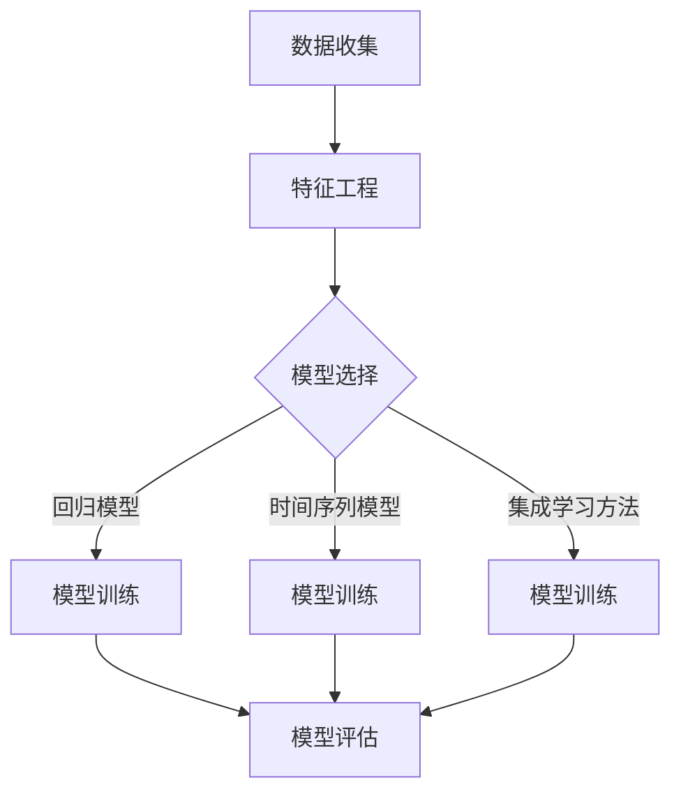

                 

### 第1章 引言

#### 1.1 智能KPI预测模型简介

关键绩效指标（Key Performance Indicators，简称KPI）是企业用于衡量运营成效的重要工具。它们帮助组织跟踪关键业务领域，确保目标的实现。然而，传统的方法往往依赖于历史数据和经验，难以适应动态变化的市场环境。为了更有效地设定和跟踪KPI，引入了智能KPI预测模型，该模型利用人工智能（AI）技术，特别是机器学习算法，来预测未来的绩效指标。

智能KPI预测模型通过分析历史数据、市场趋势和内部运营指标，提供对未来KPI的预测。这不仅帮助企业预见潜在问题，还能在机会出现时迅速采取行动。随着AI技术的不断发展，智能KPI预测模型已经成为企业管理决策的重要工具。

#### 1.2 AI在目标设定与跟踪中的应用

人工智能在目标设定与跟踪中的应用具有显著的潜力。首先，AI能够处理大量数据，并从中提取有价值的信息。通过机器学习算法，AI可以识别出数据中的模式和趋势，从而预测未来的绩效。此外，AI系统还可以根据实时数据调整目标，提供个性化的目标设定方案。

在目标跟踪方面，AI能够实时监控KPI的执行情况，并自动生成报告。如果发现KPI未达到预期，AI可以提供原因分析，并推荐改进措施。这种实时反馈和调整机制，有助于企业快速响应市场变化，保持竞争力。

### 第2章 相关概念

#### 2.1 KPI概念解析

KPI是用于衡量企业或个人在特定领域内表现的关键指标。它们通常针对企业的战略目标，定义了需要在哪些方面进行衡量和改进。常见的KPI包括财务指标（如收入、利润）、运营指标（如生产效率、客户满意度）等。

KPI的定义与重要性在于它们能够帮助企业专注于关键任务，提高运营效率，实现可持续增长。通过设定和跟踪KPI，企业可以更好地了解自身的表现，识别优势和不足，并制定相应的改进策略。

#### 2.2 AI与机器学习基础

人工智能（AI）是一种模拟人类智能的技术，它使计算机系统能够感知、学习和决策。机器学习（Machine Learning，ML）是AI的一个分支，它通过数据训练模型，使其能够自动识别模式和趋势。

机器学习算法包括监督学习、无监督学习和强化学习。监督学习算法使用标记数据训练模型，以预测新的数据点。无监督学习算法则从未标记的数据中学习，以发现数据中的结构和模式。强化学习算法则通过奖励机制，训练模型在不同环境中做出最优决策。

#### 2.3 数据科学与数据预处理

数据科学（Data Science）是应用统计学、计算机科学和领域知识来从数据中提取有价值信息的一门交叉学科。数据预处理是数据科学中的关键步骤，它包括数据收集、清洗、转换和归一化等。

数据预处理的重要性在于它能够提高数据质量，减少噪声和异常值，为后续的分析和建模提供可靠的数据基础。有效的数据预处理能够显著提高模型性能，降低模型复杂性。

### 第3章 预测模型原理

#### 3.1 预测模型的基本原理

预测模型是用于预测未来事件或数值的数学模型。在智能KPI预测中，预测模型通过分析历史数据和市场趋势，预测未来的KPI值。

预测模型的基本原理包括以下方面：

1. **数据收集**：收集与KPI相关的历史数据，如销售额、生产量等。
2. **特征工程**：从原始数据中提取有价值的特征，如时间序列特征、季节性特征等。
3. **模型选择**：选择适合数据特性的预测模型，如时间序列模型、回归模型等。
4. **模型训练**：使用历史数据训练模型，使其学会预测未来的KPI值。
5. **模型评估**：使用验证数据评估模型性能，调整模型参数以优化预测结果。

#### 3.2 机器学习算法介绍

机器学习算法是构建预测模型的关键。以下是几种常见的机器学习算法：

1. **回归算法**：用于预测连续数值的输出，如线性回归、岭回归等。
2. **时间序列模型**：用于预测时间序列数据的值，如ARIMA、LSTM等。
3. **集成学习方法**：通过组合多个预测模型，提高预测准确性，如随机森林、梯度提升树等。
4. **神经网络**：通过多层神经元的连接，模拟人脑的决策过程，如深度神经网络、卷积神经网络等。

#### 3.3 Mermaid流程图：预测模型架构

以下是智能KPI预测模型的架构Mermaid流程图：



### 第4章 数据预处理

#### 4.1 数据收集与采集

数据收集是构建智能KPI预测模型的第一步。数据来源可以是企业内部数据库、第三方数据提供商或公开数据集。在收集数据时，需要注意以下几点：

1. **数据完整性**：确保数据集完整，无缺失值。
2. **数据质量**：筛选高质量的数据，去除噪声和异常值。
3. **数据多样性**：收集多种类型的数据，以提高模型的泛化能力。

#### 4.2 数据清洗与预处理

数据清洗与预处理是确保数据质量的重要步骤。以下是一些常见的数据预处理方法：

1. **缺失值处理**：使用统计方法（如平均值、中位数）填充缺失值，或删除缺失值较多的记录。
2. **异常值处理**：使用统计学方法（如箱线图、Z分数）检测和去除异常值。
3. **数据规范化**：将数据缩放到相同的尺度，以便模型更好地处理。
4. **特征提取**：从原始数据中提取有用的特征，如时间序列特征、季节性特征等。

#### 4.3 数据可视化与分析

数据可视化是理解数据分布和关系的重要工具。以下是一些常见的数据可视化方法：

1. **折线图**：用于展示时间序列数据的变化趋势。
2. **箱线图**：用于展示数据的分布和异常值。
3. **散点图**：用于展示两个变量之间的关系。
4. **热力图**：用于展示数据的热点和冷区。

### 第5章 模型构建与训练

#### 5.1 数据分割与特征提取

在构建智能KPI预测模型之前，需要对数据进行分割和特征提取。以下是一些步骤：

1. **数据分割**：将数据集划分为训练集、验证集和测试集，以评估模型性能。
2. **特征提取**：从原始数据中提取有用的特征，如时间序列特征、季节性特征等。

#### 5.2 模型构建与训练

在模型构建与训练阶段，需要选择合适的机器学习算法，并进行参数调优。以下是一些步骤：

1. **模型选择**：根据数据特性和预测目标，选择合适的机器学习算法。
2. **参数调优**：使用交叉验证方法，调整模型参数，以提高预测准确性。
3. **模型训练**：使用训练数据训练模型，使其学会预测未来的KPI值。

#### 5.3 伪代码：智能KPI预测模型构建过程

以下是一个简单的智能KPI预测模型构建过程的伪代码：

```python
# 导入必要的库
import pandas as pd
from sklearn.model_selection import train_test_split
from sklearn.preprocessing import StandardScaler
from sklearn.linear_model import LinearRegression
from sklearn.metrics import mean_squared_error

# 数据收集
data = pd.read_csv('kpi_data.csv')

# 数据分割
X = data.drop('kpi', axis=1)
y = data['kpi']
X_train, X_test, y_train, y_test = train_test_split(X, y, test_size=0.2, random_state=42)

# 特征提取
scaler = StandardScaler()
X_train_scaled = scaler.fit_transform(X_train)
X_test_scaled = scaler.transform(X_test)

# 模型选择与训练
model = LinearRegression()
model.fit(X_train_scaled, y_train)

# 模型评估
y_pred = model.predict(X_test_scaled)
mse = mean_squared_error(y_test, y_pred)
print("MSE:", mse)
```

### 第6章 模型评估与优化

#### 6.1 评估指标与模型性能

评估模型性能的关键指标包括：

1. **均方误差（MSE）**：衡量预测值与真实值之间的平均误差。
2. **均方根误差（RMSE）**：MSE的平方根，用于衡量预测的准确性。
3. **决定系数（R²）**：衡量模型对数据的解释能力，取值范围在0到1之间。

#### 6.2 模型优化方法

为了提高模型性能，可以采用以下优化方法：

1. **超参数调优**：调整模型参数，以找到最优的参数组合。
2. **模型集成**：结合多个预测模型，提高预测准确性。
3. **模型剪枝**：去除模型中的冗余结构，减少过拟合。

#### 6.3 实际案例：模型优化实践

以下是一个简单的模型优化案例：

```python
from sklearn.model_selection import GridSearchCV
from sklearn.ensemble import RandomForestRegressor

# 参数调优
param_grid = {'n_estimators': [100, 200, 300], 'max_depth': [10, 20, 30]}
grid_search = GridSearchCV(RandomForestRegressor(), param_grid, cv=5)
grid_search.fit(X_train_scaled, y_train)

# 优化后的模型
best_model = grid_search.best_estimator_
y_pred_optimized = best_model.predict(X_test_scaled)
mse_optimized = mean_squared_error(y_test, y_pred_optimized)
print("Optimized MSE:", mse_optimized)
```

### 第7章 应用实践

#### 7.1 目标设定与跟踪

智能KPI预测模型可以用于目标设定与跟踪，以下是一些应用场景：

1. **销售目标设定**：通过预测未来的销售额，帮助销售人员制定合理的销售目标。
2. **生产计划**：预测未来的生产需求，帮助生产部门制定生产计划。
3. **供应链管理**：预测原材料的需求量，优化库存管理。

#### 7.2 模型部署与监控

模型部署是使预测模型在实际应用中发挥作用的关键步骤。以下是一些步骤：

1. **部署模型**：将训练好的模型部署到生产环境中，以便实时预测KPI。
2. **监控模型**：定期评估模型性能，确保其准确性和稳定性。
3. **数据更新**：定期更新模型训练数据，以适应新的市场趋势。

#### 7.3 实际案例：企业KPI预测应用

以下是一个企业KPI预测的实际案例：

**案例背景**：某电商企业希望利用智能KPI预测模型预测未来的销售额，以便制定合理的营销策略。

**实施步骤**：

1. **数据收集**：收集过去一年的销售数据，包括日期、销售额等。
2. **数据预处理**：清洗数据，去除缺失值和异常值，提取有用的特征。
3. **模型构建**：选择合适的机器学习算法，如线性回归，构建预测模型。
4. **模型训练**：使用训练数据训练模型，调整参数以优化性能。
5. **模型评估**：使用验证数据评估模型性能，确保其准确性。
6. **模型部署**：将模型部署到生产环境中，实时预测销售额。
7. **监控与维护**：定期评估模型性能，更新模型训练数据。

**项目小结**：

通过智能KPI预测模型，该电商企业能够提前预测未来的销售额，为营销策略提供数据支持。在实际应用中，模型性能得到持续优化，帮助企业实现销售额的稳定增长。

### 第8章 未来展望

#### 8.1 智能KPI预测模型的挑战与机遇

智能KPI预测模型在应用中面临一些挑战：

1. **数据质量**：高质量的数据是预测准确性的基础。然而，实际应用中，数据往往存在噪声、缺失和异常值，需要有效处理。
2. **模型解释性**：尽管机器学习模型在预测准确性方面表现优异，但它们的内部决策过程往往缺乏解释性，难以被非专业人士理解。
3. **计算资源**：构建和训练复杂的机器学习模型需要大量的计算资源，尤其是在处理大规模数据时。

尽管存在挑战，智能KPI预测模型也带来了巨大的机遇：

1. **实时预测**：随着云计算和边缘计算的发展，实时预测成为可能，为企业提供更快速、更准确的决策支持。
2. **个性化应用**：基于用户行为的个性化预测，可以帮助企业实现更精细化管理，提高用户体验。
3. **跨界应用**：智能KPI预测模型可以应用于各种领域，如金融、医疗、教育等，推动行业的数字化转型。

#### 8.2 发展趋势与未来方向

未来，智能KPI预测模型的发展趋势将包括：

1. **深度学习与强化学习**：深度学习和强化学习等更先进的算法将在智能KPI预测中得到广泛应用。
2. **数据隐私与安全性**：随着数据隐私和安全性的日益重视，模型将需要更好地保护数据隐私。
3. **跨领域协作**：不同领域的专家将共同探索智能KPI预测模型的应用，推动技术创新。

### 总结

智能KPI预测模型是企业管理决策的重要工具，通过结合人工智能技术和机器学习算法，它能够预测未来的绩效指标，帮助企业制定合理的策略。随着技术的不断发展，智能KPI预测模型将在更多领域发挥作用，推动企业的数字化转型。作者：AI天才研究院 & 禅与计算机程序设计艺术

关键词：智能KPI预测，机器学习，目标设定，数据预处理，模型优化，实际案例，未来展望。摘要：本文深入探讨了智能KPI预测模型的概念、原理、构建与优化方法，并结合实际案例展示了其应用价值，展望了未来的发展趋势。

