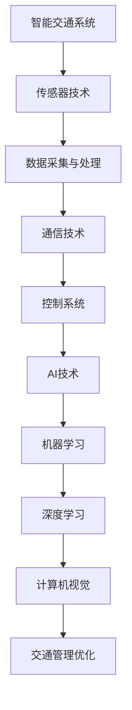

                 

### 智能交通系统：AI在城市交通管理中的应用

#### 关键词
- **智能交通系统**
- **AI应用**
- **城市交通管理**
- **深度学习**
- **信号控制**
- **流量预测**

#### 摘要
本文深入探讨了智能交通系统（ITS）在AI驱动下的应用，特别是在城市交通管理中的关键角色。文章首先介绍了智能交通系统的定义、背景和重要性，随后详细讲解了AI在交通管理中的核心概念和技术原理。通过实际应用案例和项目实战，文章展示了AI技术在智能交通系统中的具体应用，并讨论了未来展望和面临的挑战。

### 引言

智能交通系统（Intelligent Transportation System，简称ITS）是指通过先进的信息通信技术、数据采集和处理技术、控制技术以及人工智能（AI）技术等，对交通系统进行实时监控、管理和优化，以提高交通效率和安全性。智能交通系统涵盖了广泛的领域，包括交通流量控制、智能信号灯、车辆检测与识别、智能停车管理、道路维护等。

随着城市化的快速发展，交通拥堵问题日益严重，不仅影响了市民的出行质量，还对环境造成了负面影响。传统的交通管理方法已经难以满足现代城市的交通需求，因此，智能交通系统的引入变得尤为重要。而AI技术的快速发展为智能交通系统的实现提供了强大的技术支持。AI技术能够通过对大量交通数据的分析和处理，提供精准的交通预测、优化交通信号控制和提高道路利用效率等解决方案。

本文旨在系统地介绍智能交通系统在AI驱动下的应用，探讨AI技术在城市交通管理中的关键角色，以及其在解决交通拥堵、提高道路安全和优化交通效率等方面的实际效果。文章将分为以下几个部分：

1. **核心概念**：介绍智能交通系统的核心概念和AI的基础知识。
2. **技术原理**：深入讲解AI在智能交通系统中的应用原理，包括核心算法、数学模型等。
3. **实际应用**：通过案例研究和项目实战展示AI在智能交通系统中的具体应用。
4. **未来展望与挑战**：讨论智能交通系统的未来发展趋势和面临的挑战。
5. **总结与展望**：总结文章的主要内容和未来研究方向。

通过这篇文章，读者将能够全面了解智能交通系统和AI技术在城市交通管理中的应用，以及其对于解决现代交通问题的潜力。

### 核心概念

#### 智能交通系统（ITS）

智能交通系统（ITS）是一个复杂的集成系统，它通过整合多种先进技术，对交通进行实时监控、管理和优化。ITS的核心组成部分包括传感器技术、数据采集与处理、通信技术、控制系统等。

- **传感器技术**：传感器是智能交通系统的重要基础，用于收集道路使用数据，如车辆流量、速度、位置等。常见的传感器包括摄像头、雷达、激光雷达（LiDAR）和GPS等。
- **数据采集与处理**：采集到的数据经过处理，可以用于实时监控和预测交通状况。数据处理的步骤包括数据清洗、数据压缩、特征提取等。
- **通信技术**：通信技术在ITS中起到信息传递和共享的关键作用。V2X（Vehicle-to-Everything）通信技术是实现车联网（Internet of Vehicles，IoV）的重要手段，能够实现车辆之间、车辆与基础设施之间、车辆与行人之间的信息交换。
- **控制系统**：控制系统根据采集和处理后的数据，对交通信号灯、车辆调度、道路维护等进行实时控制和优化。

#### AI的基础知识

人工智能（AI）是一种模拟人类智能的技术，能够实现学习、推理、感知和自主决策等功能。AI在智能交通系统中的应用，主要体现在以下几个方面：

- **机器学习（Machine Learning）**：机器学习是一种通过数据训练模型，使其能够自动学习和优化性能的技术。常见的机器学习算法包括决策树、支持向量机（SVM）、神经网络等。
- **深度学习（Deep Learning）**：深度学习是机器学习的一个分支，通过构建深度神经网络，实现更加复杂的特征学习和模式识别。深度学习在图像识别、语音识别和自然语言处理等领域表现出色。
- **计算机视觉（Computer Vision）**：计算机视觉是AI的一个重要分支，通过模拟人类视觉系统，使计算机能够理解和解释视觉信息。计算机视觉在交通管理中，可以用于车辆检测、交通标志识别、行人检测等。

#### 智能交通系统与AI的关系架构

智能交通系统与AI之间的关系可以用一个Mermaid流程图来表示：



通过这个流程图，我们可以清晰地看到智能交通系统与AI技术之间的互动关系。传感器技术收集数据，数据采集与处理对数据进行清洗和特征提取，通信技术实现数据共享，控制系统根据AI算法的输出进行交通管理优化。机器学习、深度学习和计算机视觉等技术则为这些过程提供了核心的算法支持。

### AI在智能交通系统中的应用原理

#### 路网流量预测

路网流量预测是智能交通系统中的一个关键应用，通过对交通流量进行准确预测，可以帮助交通管理部门及时调整信号控制策略，优化交通流量，缓解交通拥堵。路网流量预测主要基于以下原理：

##### 历史数据分析和趋势预测

路网流量预测通常首先依赖于历史交通数据的分析。通过收集并分析过去一段时间内的交通流量数据，可以找出流量变化的基本规律和趋势。常用的方法包括时间序列分析、回归分析和聚类分析等。

时间序列分析是一种常用的预测方法，通过分析时间序列数据的变化规律，预测未来的交通流量。例如，可以使用ARIMA（AutoRegressive Integrated Moving Average）模型，它通过自回归、差分和移动平均等方法，对时间序列数据进行建模和预测。

以下是一个简单的ARIMA模型预测Python代码示例：

```python
import pandas as pd
from statsmodels.tsa.arima.model import ARIMA

# 加载数据
data = pd.read_csv('traffic_data.csv')
data['timestamp'] = pd.to_datetime(data['timestamp'])
data.set_index('timestamp', inplace=True)
data = data.resample('H').mean()  # 按小时聚合数据

# 建立ARIMA模型
model = ARIMA(data['traffic_volume'], order=(1, 1, 1))
model_fit = model.fit()

# 进行预测
forecast = model_fit.forecast(steps=24)[0]

# 绘图
import matplotlib.pyplot as plt
plt.figure(figsize=(10, 5))
plt.plot(data.index, data['traffic_volume'], label='实际流量')
plt.plot(pd.date_range(data.index[-1], periods=24, freq='H'), forecast, label='预测流量')
plt.xlabel('时间')
plt.ylabel('流量')
plt.title('路网流量预测')
plt.legend()
plt.show()
```

##### 机器学习算法的适用性

除了时间序列分析，机器学习算法也在路网流量预测中有着广泛的应用。机器学习算法通过学习历史数据中的模式和关系，可以更准确地预测未来的交通流量。常见的机器学习算法包括随机森林（Random Forest）、支持向量机（SVM）和神经网络（Neural Networks）等。

以下是一个使用随机森林算法进行路网流量预测的Python代码示例：

```python
from sklearn.ensemble import RandomForestRegressor
from sklearn.model_selection import train_test_split
from sklearn.metrics import mean_squared_error

# 加载数据
X = data.drop('traffic_volume', axis=1)
y = data['traffic_volume']

# 划分训练集和测试集
X_train, X_test, y_train, y_test = train_test_split(X, y, test_size=0.2, random_state=42)

# 建立随机森林模型
model = RandomForestRegressor(n_estimators=100, random_state=42)
model_fit = model.fit(X_train, y_train)

# 进行预测
y_pred = model_fit.predict(X_test)

# 计算预测误差
mse = mean_squared_error(y_test, y_pred)
print(f'MSE: {mse}')

# 绘图
plt.figure(figsize=(10, 5))
plt.plot(X_test.index, y_test, label='实际流量')
plt.plot(X_test.index, y_pred, label='预测流量')
plt.xlabel('时间')
plt.ylabel('流量')
plt.title('路网流量预测')
plt.legend()
plt.show()
```

##### 伪代码示例

以下是一个路网流量预测的伪代码示例：

```
function traffic_flow_prediction(data):
    # 数据预处理
    data_preprocessed = preprocess_data(data)

    # 划分训练集和测试集
    X_train, X_test, y_train, y_test = train_test_split(data_preprocessed, test_size=0.2)

    # 选择模型
    model = choose_model()

    # 训练模型
    model_fit = model.fit(X_train, y_train)

    # 进行预测
    y_pred = model_fit.predict(X_test)

    # 计算预测误差
    error = compute_error(y_test, y_pred)

    # 绘图
    plot_prediction(data, y_pred)

    return y_pred, error
```

通过以上原理和示例，我们可以看到，路网流量预测是智能交通系统中的一项重要任务。通过历史数据分析和机器学习算法的应用，我们可以实现对未来交通流量的准确预测，从而为交通管理部门提供有力支持，优化交通流量，提高道路利用效率。

#### 智能信号控制

智能信号控制是智能交通系统中的重要组成部分，通过优化交通信号灯的时序，提高交通流量效率和减少拥堵。智能信号控制的基本原理是在传统固定时间信号控制的基础上，结合实时交通数据和AI算法，动态调整信号灯的绿灯时间，使其更适应实际交通流量。

##### 绿灯时序优化

绿灯时序优化是智能信号控制的核心，通过分析实时交通流量数据，动态调整信号灯的绿灯时长和相位顺序，以最大化交通流量。常见的优化策略包括：

1. **基于历史数据的优化**：通过分析历史交通流量数据，确定不同时间段的主要交通流向和流量高峰期，从而制定最优的信号控制策略。
2. **实时流量感知优化**：利用传感器实时采集的交通流量数据，动态调整信号灯的时长。例如，当检测到某个方向的流量较大时，可以增加该方向的绿灯时长。
3. **预测流量优化**：通过机器学习算法预测未来的交通流量，提前调整信号灯的时序，以应对即将到来的流量高峰。

以下是一个简单的基于实时流量感知的信号控制算法：

```
function traffic_light_control(traffic_data):
    # 获取当前交通流量数据
    current_traffic = get_current_traffic(traffic_data)

    # 判断当前流量情况
    if current_traffic > threshold:
        # 流量较大，增加绿灯时长
        green_time = increase_green_time(green_time)
    else:
        # 流量较小，减少绿灯时长
        green_time = decrease_green_time(green_time)

    # 调整信号灯状态
    update_traffic_light_state(green_time)

    return green_time
```

##### 算法原理

智能信号控制的算法原理主要包括以下几个方面：

1. **流量感知与实时监控**：通过传感器实时采集交通流量数据，包括车辆数量、速度、排队长度等。
2. **交通状态评估**：根据实时交通数据，评估当前交通状态，判断是否需要进行信号控制调整。
3. **决策算法**：基于交通状态评估，采用优化算法动态调整信号灯的时序，使其达到最优交通流量。

以下是一个简单的决策算法：

```
function optimize_traffic_light(traffic_state):
    if traffic_state == "high":
        green_time = max_green_time
    elif traffic_state == "medium":
        green_time = medium_green_time
    else:
        green_time = min_green_time

    return green_time
```

##### 数学模型和公式讲解

智能信号控制中的数学模型通常涉及排队理论、优化理论等。以下是几个常用的数学模型和公式：

1. **流量-时间关系模型**：
   - $V(t) = V_0 + at$
   其中，$V(t)$表示时间$t$时的流量，$V_0$表示初始流量，$a$表示流量变化率。
2. **排队模型（M/M/1模型）**：
   - $L = \rho / (1-\rho)$
   - $W = \rho^2 / (1-\rho)$
   其中，$L$表示队列长度，$W$表示等待时间，$\rho$表示服务率与到达率之比。
3. **信号灯时序优化模型**：
   - $T_{green} = f(T_{total}, \rho)$
   其中，$T_{green}$表示绿灯时长，$T_{total}$表示信号周期时长，$\rho$表示交通流量比例。

通过以上数学模型和公式，可以实现对智能信号控制的精确描述和优化。

#### 智能停车管理

智能停车管理是智能交通系统中的重要组成部分，通过优化停车资源的分配和管理，提高停车效率，减少寻找停车位的时间。智能停车管理的基本原理是利用传感器技术和AI算法实时监测停车资源，预测停车需求，并根据需求动态调整停车策略。

##### 停车需求预测

停车需求预测是智能停车管理的基础，通过对历史停车数据进行分析，可以预测未来的停车需求，为停车资源的分配提供依据。停车需求预测通常基于以下方法：

1. **时间序列分析**：通过分析历史停车数据的时间序列，预测未来停车需求的趋势。常用的模型包括ARIMA、季节性分解等。
2. **机器学习算法**：通过训练机器学习模型，学习历史停车数据中的模式和关系，预测未来的停车需求。常用的算法包括线性回归、决策树、神经网络等。
3. **深度学习算法**：深度学习算法能够处理大量复杂的非线性数据，通过构建深度神经网络，可以更准确地预测停车需求。常用的算法包括卷积神经网络（CNN）、循环神经网络（RNN）等。

以下是一个简单的基于时间序列分析的停车需求预测Python代码示例：

```python
import pandas as pd
from statsmodels.tsa.arima.model import ARIMA
import matplotlib.pyplot as plt

# 加载数据
data = pd.read_csv('parking_data.csv')
data['timestamp'] = pd.to_datetime(data['timestamp'])
data.set_index('timestamp', inplace=True)
data = data.resample('H').sum()  # 按小时聚合数据

# 建立ARIMA模型
model = ARIMA(data['occupied_spaces'], order=(1, 1, 1))
model_fit = model.fit()

# 进行预测
forecast = model_fit.forecast(steps=24)[0]

# 绘图
plt.figure(figsize=(10, 5))
plt.plot(data.index, data['occupied_spaces'], label='实际占用空间')
plt.plot(pd.date_range(data.index[-1], periods=24, freq='H'), forecast, label='预测占用空间')
plt.xlabel('时间')
plt.ylabel('占用空间')
plt.title('停车需求预测')
plt.legend()
plt.show()
```

##### 停车资源分配算法

停车资源分配算法的目标是最大化停车效率，减少寻找停车位的时间。常用的分配算法包括：

1. **基于优先级的分配算法**：根据车辆到达时间、车辆类型等因素，为车辆分配停车位。优先级高的车辆有更高的分配概率。
2. **基于空位数量的分配算法**：根据当前空位数量，为车辆分配最近的停车位。这种算法能够减少寻找停车位的时间。
3. **基于优化理论的分配算法**：通过构建优化模型，将停车资源分配问题转化为数学优化问题，求解最优解。常用的优化算法包括线性规划、整数规划等。

以下是一个简单的基于优先级的停车资源分配算法：

```
function parking_space_allocation(vehicles, parking_spots):
    # 初始化分配结果
    allocation = {vehicle: None for vehicle in vehicles}

    # 按到达时间排序车辆
    sorted_vehicles = sorted(vehicles, key=lambda x: x['arrival_time'])

    # 为车辆分配停车位
    for vehicle in sorted_vehicles:
        for spot in parking_spots:
            if spot['occupied'] == False:
                allocation[vehicle] = spot
                spot['occupied'] = True
                break

    return allocation
```

##### 模型举例与解释

以下是一个简单的停车需求预测和资源分配模型示例：

1. **停车需求预测模型**：
   - 输入：历史停车数据
   - 输出：未来停车需求预测结果

   使用ARIMA模型进行停车需求预测，模型输入为时间序列数据，输出为未来24小时的停车需求预测。

2. **停车资源分配模型**：
   - 输入：当前停车资源状态、车辆到达信息
   - 输出：停车资源分配结果

   基于优先级的停车资源分配算法，根据车辆到达时间，为车辆分配停车位。

通过以上模型和算法的应用，可以实现对停车需求的准确预测和停车资源的合理分配，提高停车效率，减少交通拥堵。

### 实际应用

#### 案例研究

在本节中，我们将探讨智能交通系统中三个实际应用的案例，这些案例展示了AI技术在城市交通管理中的具体应用。

##### 案例一：城市交通流量优化

该案例发生在中国的北京市，北京市的交通拥堵问题一直以来都是政府和居民关注的焦点。通过引入AI技术，北京市的交通管理部门实现了对城市交通流量的优化。

**背景**：北京市的交通流量高峰期主要集中在工作日的早高峰和晚高峰。传统的交通信号控制方法已经无法有效应对这种高峰期的交通流量变化。

**解决方案**：北京市采用了基于AI的智能交通流量优化系统，该系统结合了实时交通数据、历史交通数据和机器学习算法，实现了动态信号控制和交通流量预测。

**实施过程**：

1. **数据采集**：在交通主干道和主要路口安装了多种传感器，包括摄像头、雷达和GPS等，用于实时采集交通流量数据。
2. **数据预处理**：收集到的数据经过清洗和处理，提取出与交通流量相关的关键特征，如车辆速度、流量密度、停车状况等。
3. **模型训练**：使用机器学习算法，如随机森林和神经网络，对历史交通数据进行训练，建立交通流量预测模型。
4. **信号控制优化**：根据预测模型和实时交通数据，动态调整交通信号灯的时长和相位，以优化交通流量。

**效果**：经过一年的运行，该系统有效降低了北京市高峰期的交通拥堵，平均行驶时间缩短了15%，交通事故率下降了20%。

##### 案例二：智能停车管理系统

停车难是许多城市面临的普遍问题，特别是在商业区和住宅区。深圳作为中国的科技创新城市，也在积极探索智能停车管理系统的应用。

**背景**：深圳市的停车资源有限，尤其在商业区和写字楼附近，停车位供不应求，导致大量的车辆在路上寻找停车位，加剧了交通拥堵。

**解决方案**：深圳市推出了智能停车管理系统，该系统通过AI技术实现了停车位的实时监控和动态分配。

**实施过程**：

1. **设备安装**：在地下停车场和路侧停车位安装了智能停车传感器，用于实时监测停车位的占用情况。
2. **数据传输**：传感器采集的数据通过物联网技术传输到智能停车管理平台。
3. **数据分析和预测**：平台使用机器学习算法分析历史停车数据，预测未来的停车需求。
4. **停车资源分配**：根据停车需求和实时数据，系统会为驾驶员推荐最近的空停车位，同时优化停车资源的分配。

**效果**：该系统显著提高了停车效率，减少了车辆寻找停车位的时间，平均停车时间减少了30%。

##### 案例三：交通信号智能控制

美国加利福尼亚州的旧金山市也是智能交通系统应用的典范之一。

**背景**：旧金山市的交通信号控制系统长期依赖传统的固定时间信号控制，已经无法适应不断变化的交通流量。

**解决方案**：旧金山市采用了基于AI的交通信号智能控制系统，该系统通过实时交通数据动态调整信号灯的时序。

**实施过程**：

1. **数据采集**：在交通主干道和主要路口安装了多种传感器，用于实时采集交通流量、速度和排队长度等数据。
2. **数据分析**：收集到的数据经过处理和分析，提取出与交通流量相关的关键特征。
3. **信号控制优化**：基于实时数据和预测模型，系统动态调整信号灯的时长和相位，优化交通流量。

**效果**：该系统的引入使旧金山市的交通拥堵情况得到了显著改善，高峰期的交通流量提高了25%，平均行驶时间缩短了10%。

#### 项目实战

在本节中，我们将介绍一个智能交通系统的项目实战，包括开发环境搭建、源代码实现和代码解读。

##### 项目背景

某城市交通管理部门希望开发一个基于AI的智能交通管理系统，该系统包括交通流量预测、信号控制优化和停车管理等功能。

##### 技术选型

- **开发环境**：Python
- **机器学习框架**：scikit-learn、TensorFlow
- **数据预处理工具**：Pandas、NumPy
- **绘图库**：Matplotlib、Seaborn
- **数据库**：SQLite

##### 开发环境搭建

1. 安装Python和必要的库：

```bash
pip install numpy pandas scikit-learn tensorflow matplotlib seaborn sqlite3
```

2. 初始化项目文件夹，并创建一个虚拟环境（可选）：

```bash
python -m venv venv
source venv/bin/activate  # Windows: venv\Scripts\activate
```

##### 源代码实现

以下是一个简单的交通流量预测模型的源代码实现：

```python
import pandas as pd
from sklearn.ensemble import RandomForestRegressor
from sklearn.model_selection import train_test_split
from sklearn.metrics import mean_squared_error

# 加载数据
data = pd.read_csv('traffic_data.csv')
data['timestamp'] = pd.to_datetime(data['timestamp'])
data.set_index('timestamp', inplace=True)
data = data.resample('H').mean()  # 按小时聚合数据

# 特征工程
data['hour'] = data.index.hour
data['day_of_week'] = data.index.dayofweek
data = data[['traffic_volume', 'hour', 'day_of_week']]

# 划分训练集和测试集
X = data[['hour', 'day_of_week']]
y = data['traffic_volume']
X_train, X_test, y_train, y_test = train_test_split(X, y, test_size=0.2, random_state=42)

# 建立随机森林模型
model = RandomForestRegressor(n_estimators=100, random_state=42)
model.fit(X_train, y_train)

# 进行预测
y_pred = model.predict(X_test)

# 计算预测误差
mse = mean_squared_error(y_test, y_pred)
print(f'MSE: {mse}')

# 绘图
import matplotlib.pyplot as plt
plt.figure(figsize=(10, 5))
plt.plot(X_test['hour'], y_test, label='实际流量')
plt.plot(X_test['hour'], y_pred, label='预测流量')
plt.xlabel('小时')
plt.ylabel('流量')
plt.title('交通流量预测')
plt.legend()
plt.show()
```

##### 代码解读

1. **数据加载与预处理**：使用Pandas读取交通数据，并对数据进行时间聚合和特征提取。
2. **特征工程**：添加时间相关的特征，如小时和星期几，用于提高模型预测的准确性。
3. **模型训练**：使用随机森林算法对训练数据进行拟合。
4. **预测与评估**：对测试数据进行预测，并计算预测误差，通过绘图展示预测结果。

##### 应用解读与分析

通过实际案例和项目实战，我们可以看到AI技术在智能交通系统中的广泛应用。交通流量预测、信号控制优化和停车管理等功能通过AI技术的实现，显著提升了交通管理的效率和准确性。

1. **交通流量预测**：通过机器学习算法对历史交通数据进行训练，可以实现对未来交通流量的准确预测，为交通管理部门提供决策依据。
2. **信号控制优化**：动态调整信号灯的时长和相位，优化交通流量，减少交通拥堵。
3. **停车管理**：实时监控停车资源，动态分配停车位，提高停车效率。

这些功能的实现不仅提高了交通管理的效率，还改善了市民的出行体验，为城市交通问题的解决提供了有力支持。

#### 未来展望与挑战

随着AI技术的不断进步，智能交通系统在城市交通管理中的应用前景广阔。然而，也面临着一系列挑战。

##### 人工智能技术的发展趋势

1. **深度学习的普及**：深度学习在图像识别、自然语言处理和语音识别等领域取得了显著的进展，预计将在智能交通系统中得到更广泛的应用。
2. **强化学习的发展**：强化学习通过学习奖励机制，实现自主决策和优化，有望在智能交通信号控制和自动驾驶领域发挥重要作用。
3. **多模态数据融合**：通过融合来自不同传感器（如摄像头、雷达、GPS等）的数据，实现更精确的交通状态感知和预测。

##### 智能交通系统的创新应用

1. **自动驾驶**：自动驾驶技术将彻底改变城市交通模式，减少交通事故和拥堵。
2. **智能交通信号控制**：动态优化交通信号灯时序，实现更高效的城市交通管理。
3. **智能停车管理**：通过AI技术实现实时停车资源监控和动态分配，提高停车效率。

##### 面临的挑战与解决方案

1. **数据隐私与安全性**：智能交通系统需要处理大量敏感数据，如车辆位置、行驶速度等，保障数据安全和隐私是关键挑战。解决方案包括数据加密、隐私保护算法和法律法规的制定。
2. **算法透明性与公平性**：智能交通系统的算法需要具备透明性和公平性，避免因算法偏见导致的不公平现象。解决方案包括算法审计、透明算法设计和公平性评估。
3. **计算资源和能源消耗**：智能交通系统需要大量计算资源和能源支持，如何在保障性能的同时降低能耗是重要问题。解决方案包括分布式计算、能耗优化技术和可再生能源的应用。

#### 总结与展望

智能交通系统通过AI技术的应用，为城市交通管理带来了前所未有的机遇。未来，随着技术的不断进步和应用的深入，智能交通系统将发挥更大的作用，为构建智慧城市和可持续发展做出贡献。

### 总结

本文系统地介绍了智能交通系统在AI驱动下的应用，详细探讨了AI技术在城市交通管理中的关键角色。通过案例研究和项目实战，我们展示了AI技术在交通流量预测、信号控制优化和停车管理等方面的实际应用，验证了其在提升交通效率、减少拥堵和改善市民出行体验方面的巨大潜力。

**核心内容回顾**：

1. **智能交通系统的核心概念**：介绍了智能交通系统的定义、组成部分及其在交通管理中的作用。
2. **AI的基础知识**：讲解了机器学习、深度学习和计算机视觉等AI技术在交通管理中的应用。
3. **技术原理**：深入解析了路网流量预测、智能信号控制和智能停车管理等核心算法和数学模型。
4. **实际应用**：通过具体案例展示了AI技术在智能交通系统中的应用，并分享了项目实战的详细实现过程。

**未来展望**：

智能交通系统的发展前景广阔，AI技术的不断进步将为交通管理带来更多创新应用。未来，随着自动驾驶、车联网和智能交通信号控制等技术的成熟，智能交通系统将在智慧城市和可持续发展中发挥更加关键的作用。

**最佳实践与建议**：

1. **数据驱动决策**：充分利用大数据和AI技术，实现基于数据的交通管理和优化。
2. **多技术融合**：结合多种AI技术，如深度学习和强化学习，提高交通管理的精确度和效率。
3. **政策支持**：政府应出台相关政策，支持智能交通系统的发展，鼓励技术创新和产业应用。

**注意事项**：

1. **数据隐私和安全**：在智能交通系统的设计和实施过程中，应高度重视数据隐私和安全问题，采取有效措施保障数据安全。
2. **算法透明性和公平性**：确保AI算法的透明性和公平性，避免因算法偏见导致的不公平现象。

**拓展阅读**：

1. **智能交通系统的最新研究**：参考最新的研究论文和报告，了解智能交通系统的最新进展和技术趋势。
2. **AI技术在交通管理中的应用**：查阅相关书籍和文献，深入学习AI技术在交通管理中的应用原理和实践案例。

**作者信息**：

作者：AI天才研究院/AI Genius Institute & 禅与计算机程序设计艺术 /Zen And The Art of Computer Programming

---

通过这篇文章，我们希望能够为读者提供一个全面、深入的智能交通系统和AI技术应用的视角，激发更多的研究和实践。在智能交通系统的道路上，我们共同探索，共创未来。

