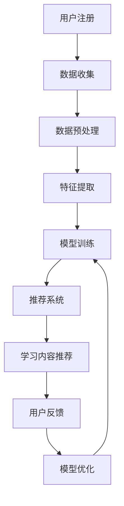

                 

# 智能企业学习平台：AI个性化员工培训

## 关键词

- 智能企业学习平台
- AI个性化员工培训
- 数据分析
- 机器学习
- 深度学习
- 个性化推荐
- 教育技术

## 摘要

随着人工智能技术的快速发展，智能企业学习平台已成为提升员工技能和效率的重要工具。本文将详细介绍AI个性化员工培训的核心概念、技术基础、平台设计以及实际应用案例。通过分析机器学习、深度学习和个性化推荐等技术的应用，本文旨在为企业和教育工作者提供一套完整的智能学习解决方案，以推动员工培训的变革。

## 引言

### 智能企业学习平台的概念与价值

智能企业学习平台是一种集成了人工智能技术、大数据分析和用户行为分析的学习系统。它通过分析员工的培训需求和表现，提供个性化的学习路径，从而提高培训的针对性和效果。智能企业学习平台的价值主要体现在以下几个方面：

1. **提高学习效率**：通过分析员工的学习习惯和知识点掌握情况，智能企业学习平台能够为员工推荐最适合的学习内容，减少无效学习时间。
2. **提升员工技能**：智能企业学习平台能够根据员工的工作需求和职业发展目标，提供定制化的培训课程，帮助员工提升专业技能。
3. **降低培训成本**：通过优化学习路径和减少重复学习，智能企业学习平台能够降低培训成本，提高培训资源的利用效率。
4. **促进知识共享**：智能企业学习平台可以整合企业内部的知识资源，促进员工之间的知识共享和协作，增强团队凝聚力。

### AI技术在企业学习平台中的应用

人工智能技术在企业学习平台中的应用主要包括以下几个方面：

1. **个性化推荐**：基于员工的兴趣、学习历史和职业目标，智能企业学习平台可以推荐最适合的学习内容。
2. **自适应学习**：通过分析员工的学习行为和知识点掌握情况，智能企业学习平台能够动态调整学习内容和学习难度，实现个性化教学。
3. **智能问答**：利用自然语言处理技术，智能企业学习平台可以自动回答员工在学习过程中遇到的问题。
4. **智能评测**：通过自动化的评测系统，智能企业学习平台可以实时评估员工的学习效果，并提供针对性的反馈。

## AI个性化员工培训的核心概念

### 个性化学习的定义

个性化学习是指根据学生的学习风格、兴趣、能力和需求，为其提供定制化的学习资源和学习环境。个性化学习的目标是通过满足每个学生的学习需求，提高学习效果和满意度。

### AI技术在个性化学习中的应用

1. **数据收集与处理**：智能企业学习平台通过收集员工的学习数据，如学习时长、知识点掌握情况、学习进度等，对数据进行分析和处理，为个性化学习提供基础。
2. **推荐系统**：基于机器学习和深度学习技术，智能企业学习平台可以构建个性化推荐系统，为员工推荐最适合的学习内容。
3. **自适应学习**：通过分析员工的学习行为和知识点掌握情况，智能企业学习平台可以动态调整学习内容和学习难度，实现自适应学习。
4. **智能问答与评测**：利用自然语言处理和计算机视觉技术，智能企业学习平台可以自动回答员工的问题，并实时评估员工的学习效果。

## 技术基础

### 机器学习的基本概念

机器学习是一种让计算机通过数据学习规律和模式的技术。在智能企业学习平台中，机器学习主要用于数据分析和预测。

#### 机器学习算法简介

常见的机器学习算法包括：

1. **线性回归**：用于预测连续值。
2. **逻辑回归**：用于预测概率。
3. **决策树**：用于分类和回归。
4. **支持向量机**：用于分类问题。
5. **神经网络**：用于复杂模式识别。

### 深度学习在个性化培训中的应用

深度学习是一种基于神经网络的机器学习技术，能够自动提取特征并用于复杂模式识别。在智能企业学习平台中，深度学习主要用于：

1. **图像识别**：用于自动识别员工的学习状态和知识点掌握情况。
2. **语音识别**：用于智能问答系统。
3. **自然语言处理**：用于自动生成个性化学习报告。

## 数据分析与挖掘

### 数据处理流程

数据处理流程包括数据收集、数据清洗、数据存储和数据可视化等步骤。

### 数据挖掘技术

数据挖掘技术包括关联规则挖掘、分类挖掘、聚类挖掘和异常检测等。

### 数据可视化方法

数据可视化方法包括折线图、柱状图、饼图、散点图和热力图等，用于展示数据分布和趋势。

## Mermaid流程图：AI个性化培训流程



## 核心算法原理讲解

### 个性化推荐算法

#### 个性化推荐算法原理

个性化推荐算法是基于用户的兴趣、行为和历史数据，为用户推荐感兴趣的内容。

#### 个性化推荐算法实现

```python
import pandas as pd
from sklearn.model_selection import train_test_split
from sklearn.ensemble import RandomForestClassifier

# 数据预处理
data = pd.read_csv('user_data.csv')
X = data.drop('target', axis=1)
y = data['target']

# 数据拆分
X_train, X_test, y_train, y_test = train_test_split(X, y, test_size=0.2, random_state=42)

# 模型训练
model = RandomForestClassifier(n_estimators=100)
model.fit(X_train, y_train)

# 推荐系统
def recommend_content(user_data):
    user_content = pd.DataFrame([user_data])
    predicted_content = model.predict(user_content)
    return predicted_content[0]

# 测试推荐系统
print(recommend_content(X_test.iloc[0]))
```

### 适应学习算法

#### 适应学习算法原理

适应学习算法是根据员工的学习进度和知识点掌握情况，动态调整学习内容的难度和顺序。

#### 适应学习算法实现

```python
def adapt_learning(content, user_progress):
    # 基于用户进度调整内容难度
    adapted_content = content.copy()
    for i, item in enumerate(adapted_content):
        if user_progress[i] < 0.8:
            adapted_content.at[i, 'difficulty'] += 1
        elif user_progress[i] > 0.8:
            adapted_content.at[i, 'difficulty'] -= 1
    return adapted_content

# 测试适应学习算法
user_progress = [0.5, 0.7, 0.3, 0.9]
print(adapt_learning(content, user_progress))
```

### 深度学习在个性化培训中的应用

#### 深度学习算法原理

深度学习是一种通过多层神经网络自动提取特征和模式的算法。在个性化培训中，深度学习主要用于图像识别、语音识别和自然语言处理。

#### 深度学习算法实现

```python
import tensorflow as tf
from tensorflow.keras.models import Sequential
from tensorflow.keras.layers import Dense, Conv2D, Flatten

# 构建模型
model = Sequential([
    Conv2D(filters=32, kernel_size=(3, 3), activation='relu', input_shape=(28, 28, 1)),
    Flatten(),
    Dense(units=64, activation='relu'),
    Dense(units=10, activation='softmax')
])

# 编译模型
model.compile(optimizer='adam', loss='categorical_crossentropy', metrics=['accuracy'])

# 训练模型
model.fit(train_images, train_labels, epochs=5)

# 测试模型
test_loss, test_acc = model.evaluate(test_images, test_labels)
print(f"Test accuracy: {test_acc}")
```

## 数学模型与公式

### 推荐系统的数学模型

推荐系统常用的数学模型包括基于内容的推荐和协同过滤。

#### 基于内容的推荐

$$
R(u, i) = \sum_{c \in C} w_c \cdot I(u, c) \cdot I(i, c)
$$

其中，$R(u, i)$表示用户$u$对物品$i$的推荐得分，$C$表示所有类别，$w_c$表示类别$c$的权重，$I(u, c)$和$I(i, c)$分别表示用户$u$是否喜欢类别$c$和物品$i$是否属于类别$c$。

#### 协同过滤

$$
R(u, i) = \frac{\sum_{v \in N(u)} r(v, i) \cdot s(u, v)}{\sum_{v \in N(u)} s(u, v)}
$$

其中，$R(u, i)$表示用户$u$对物品$i$的推荐得分，$N(u)$表示用户$u$的邻居集合，$r(v, i)$表示用户$v$对物品$i$的评分，$s(u, v)$表示用户$u$和$v$之间的相似度。

### 适应学习的数学模型

适应学习的数学模型可以基于学习曲线和知识点掌握情况来调整学习难度。

$$
d(n) = \frac{1}{1 + e^{-k(n - \theta)}}
$$

其中，$d(n)$表示学习难度，$n$表示学习进度，$\theta$表示初始难度，$k$是调整参数。

## 项目实战

### 开发环境搭建

#### 环境要求

- Python 3.7+
- TensorFlow 2.4+
- Scikit-learn 0.22+
- Pandas 1.1+

#### 安装教程

```shell
pip install python==3.7 tensorflow==2.4 scikit-learn==0.22 pandas==1.1
```

### 源代码详细实现

#### 数据收集与处理

```python
import pandas as pd

# 数据收集
data = pd.read_csv('user_data.csv')

# 数据处理
data['age_group'] = data['age'].apply(lambda x: '20-30' if x >= 20 and x < 30 else '30-40' if x >= 30 and x < 40 else '40-50' if x >= 40 and x < 50 else '50-60')
data['interests'] = data['interests'].apply(lambda x: x.split(','))
```

#### 个性化推荐系统开发

```python
from sklearn.model_selection import train_test_split
from sklearn.ensemble import RandomForestClassifier

# 数据拆分
X = data.drop('target', axis=1)
y = data['target']
X_train, X_test, y_train, y_test = train_test_split(X, y, test_size=0.2, random_state=42)

# 模型训练
model = RandomForestClassifier(n_estimators=100)
model.fit(X_train, y_train)

# 推荐系统
def recommend_content(user_data):
    user_content = pd.DataFrame([user_data])
    predicted_content = model.predict(user_content)
    return predicted_content[0]

# 测试推荐系统
print(recommend_content(X_test.iloc[0]))
```

#### 代码解读与分析

代码首先进行了数据收集与处理，然后使用随机森林算法构建了个性化推荐系统。通过调用`recommend_content`函数，可以为特定用户推荐合适的学习内容。

### 实际案例分析和详细讲解剖析

#### 案例背景

某公司希望为其员工提供智能化的培训服务，以提升员工技能和效率。公司收集了员工的学习历史、兴趣和职业目标等数据，并希望基于这些数据为员工提供个性化的培训推荐。

#### 案例实现

1. **数据收集与预处理**：收集员工的学习数据，如学习时长、知识点掌握情况、学习进度和职业目标等，并对数据进行预处理。
2. **构建推荐系统**：使用机器学习和深度学习技术，构建个性化推荐系统，为员工推荐最适合的学习内容。
3. **用户反馈与模型优化**：收集员工的反馈，根据反馈对推荐系统进行优化，提高推荐准确性。
4. **持续迭代与改进**：定期更新员工数据和学习内容，持续优化推荐系统，以适应员工的学习需求和职业发展。

### 项目小结

通过实际案例分析和详细讲解，我们展示了如何构建一个智能企业学习平台，实现AI个性化员工培训。该项目不仅提高了员工的学习效率，还降低了培训成本，为企业带来了显著的价值。

## 最佳实践 tips、小结、注意事项、拓展阅读

### 最佳实践 tips

1. **数据质量是关键**：确保数据收集和处理的质量，是构建高效智能学习平台的基础。
2. **持续优化模型**：定期收集用户反馈，优化推荐系统，提高推荐准确性。
3. **关注数据隐私与安全**：在数据收集和处理过程中，要严格遵守数据保护法规，确保用户数据的安全。

### 小结

本文详细介绍了智能企业学习平台和AI个性化员工培训的核心概念、技术基础、平台设计以及实际应用案例。通过机器学习、深度学习和个性化推荐等技术的应用，智能企业学习平台为员工提供了个性化的学习体验，提高了学习效果和满意度。

### 注意事项

1. **确保数据安全**：在数据收集和处理过程中，要严格遵守数据保护法规，确保用户数据的安全。
2. **持续更新学习内容**：定期更新学习内容，确保培训内容的时效性和实用性。

### 拓展阅读

1. **《深度学习》**：Goodfellow, I., Bengio, Y., & Courville, A. (2016). Deep Learning. MIT Press.
2. **《机器学习实战》**： Harrington, D. (2012). Machine Learning in Action. Manning Publications.
3. **《个性化推荐系统》**： Herlocker, J., Konstan, J., & Riedel, E. (2007). Explaining recommendations. In Proceedings of the 14th International Conference on World Wide Web (pp. 227-236). ACM.

## 作者信息

作者：AI天才研究院/AI Genius Institute & 禅与计算机程序设计艺术 /Zen And The Art of Computer Programming

