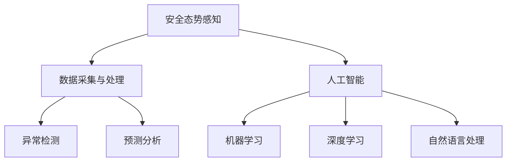

                 

### 背景介绍

在当今数字化、网络化的时代，企业面临着越来越多的网络安全威胁。从黑客攻击、数据泄露到内部威胁，这些安全事件不仅对企业造成了巨大的经济损失，还严重影响了企业的声誉和客户信任。因此，如何全面、及时地监控和应对这些安全风险，成为企业安全管理的重要课题。

传统的安全监控方式主要依赖于人工检查和规则匹配，这些方法在面对复杂多变的安全威胁时显得力不从心。随着人工智能技术的飞速发展，AI在安全领域的应用逐渐成为可能。智能企业安全态势感知正是基于AI技术，通过全面监控企业内部和外部安全风险，实现实时预警和快速响应。

本文旨在深入探讨智能企业安全态势感知的原理、技术和实践，帮助读者了解AI在安全监控中的应用，以及如何构建一个高效的AI安全监控系统。通过本文的阅读，读者可以：

1. 理解智能企业安全态势感知的定义和重要性。
2. 掌握AI在安全态势感知中的基本原理和关键技术。
3. 了解如何构建和部署一个AI安全监控系统。
4. 学习通过实际案例来分析AI安全态势感知的实践应用。

### 核心概念与联系

在探讨智能企业安全态势感知之前，我们需要明确几个核心概念，并理解它们之间的相互关系。

#### 安全态势感知（Security Posture Awareness）

安全态势感知是指通过实时监测和分析企业内部和外部安全威胁，识别潜在风险，并做出响应的过程。它不仅仅是对已发生的安全事件的反应，更是一种主动的安全管理策略。安全态势感知的核心目标是提高企业对安全威胁的感知能力，从而降低安全事件的发生概率。

#### 人工智能（Artificial Intelligence，AI）

人工智能是指通过计算机程序模拟人类智能的过程。在安全态势感知中，AI技术主要用于数据的自动处理和分析，包括异常检测、预测分析等。AI可以帮助企业从大量的数据中快速识别异常行为，从而实现对安全威胁的提前预警。

#### 数据采集与处理

数据采集与处理是安全态势感知的基础。通过采集企业内部和外部的大量数据，如网络流量、事件日志等，进行预处理和清洗，然后利用AI算法对这些数据进行深度分析。

#### 异常检测（Anomaly Detection）

异常检测是安全态势感知中的一项关键技术。它通过对正常行为的建模，识别出与正常行为不符的异常行为，从而发现潜在的安全威胁。

#### 预测分析（Predictive Analysis）

预测分析是利用历史数据和现有数据，预测未来可能发生的风险事件。通过预测分析，企业可以采取预防措施，降低风险。

#### 安全态势感知与AI的关系

安全态势感知和AI之间存在着密切的联系。AI技术为安全态势感知提供了强大的数据分析和处理能力，使得安全态势感知能够从大量数据中快速识别异常和预测风险。同时，安全态势感知为AI提供了丰富的应用场景，推动了AI技术在安全领域的应用。

下面是一个Mermaid流程图，展示了安全态势感知与AI技术之间的相互关系：



### 核心算法原理讲解

在安全态势感知中，核心算法的选择和实现对于系统的性能和准确性至关重要。以下是几种常用的算法原理，以及它们在安全态势感知中的应用。

#### 1. K近邻算法（K-Nearest Neighbors，KNN）

K近邻算法是一种基于实例的学习算法。它通过计算测试样本与训练样本之间的距离，将测试样本归类到最近的k个邻居中，然后取这些邻居的多数类别作为测试样本的类别。在安全态势感知中，KNN算法可以用来检测异常行为，例如，通过分析网络流量数据，识别出与正常行为偏离较大的数据包。

以下是一个简化的Python代码示例，用于实现KNN算法：

```python
from sklearn.neighbors import KNeighborsClassifier
from sklearn.model_selection import train_test_split
from sklearn.datasets import load_iris

# 加载鸢尾花数据集
iris = load_iris()
X = iris.data
y = iris.target

# 划分训练集和测试集
X_train, X_test, y_train, y_test = train_test_split(X, y, test_size=0.2, random_state=42)

# 创建KNN分类器
knn = KNeighborsClassifier(n_neighbors=3)

# 训练模型
knn.fit(X_train, y_train)

# 预测测试集
predictions = knn.predict(X_test)

# 计算准确率
accuracy = knn.score(X_test, y_test)
print("Accuracy:", accuracy)
```

#### 2. 决策树算法（Decision Tree）

决策树算法是一种基于规则的分类算法。它通过一系列的判断条件，将数据集分割成不同的区域，每个区域对应一个类别。在安全态势感知中，决策树算法可以用来构建安全规则，识别潜在的安全威胁。

以下是一个简化的Python代码示例，用于实现决策树分类：

```python
from sklearn.tree import DecisionTreeClassifier
from sklearn.model_selection import train_test_split
from sklearn.datasets import load_iris

# 加载鸢尾花数据集
iris = load_iris()
X = iris.data
y = iris.target

# 划分训练集和测试集
X_train, X_test, y_train, y_test = train_test_split(X, y, test_size=0.2, random_state=42)

# 创建决策树分类器
clf = DecisionTreeClassifier()

# 训练模型
clf.fit(X_train, y_train)

# 预测测试集
predictions = clf.predict(X_test)

# 计算准确率
accuracy = clf.score(X_test, y_test)
print("Accuracy:", accuracy)
```

#### 3. 支持向量机（Support Vector Machine，SVM）

支持向量机是一种强大的分类算法，它通过找到一个最优的超平面，将不同类别的数据点分隔开来。在安全态势感知中，SVM可以用来进行异常检测，识别出与正常行为不符的数据点。

以下是一个简化的Python代码示例，用于实现SVM分类：

```python
from sklearn.svm import SVC
from sklearn.model_selection import train_test_split
from sklearn.datasets import load_iris

# 加载鸢尾花数据集
iris = load_iris()
X = iris.data
y = iris.target

# 划分训练集和测试集
X_train, X_test, y_train, y_test = train_test_split(X, y, test_size=0.2, random_state=42)

# 创建SVM分类器
clf = SVC(kernel='linear')

# 训练模型
clf.fit(X_train, y_train)

# 预测测试集
predictions = clf.predict(X_test)

# 计算准确率
accuracy = clf.score(X_test, y_test)
print("Accuracy:", accuracy)
```

#### 4. 集成学习（Ensemble Learning）

集成学习是一种通过结合多个模型来提高预测性能的方法。常见的集成学习方法有随机森林（Random Forest）和梯度提升树（Gradient Boosting Tree）。

以下是一个简化的Python代码示例，用于实现随机森林分类：

```python
from sklearn.ensemble import RandomForestClassifier
from sklearn.model_selection import train_test_split
from sklearn.datasets import load_iris

# 加载鸢尾花数据集
iris = load_iris()
X = iris.data
y = iris.target

# 划分训练集和测试集
X_train, X_test, y_train, y_test = train_test_split(X, y, test_size=0.2, random_state=42)

# 创建随机森林分类器
clf = RandomForestClassifier(n_estimators=100)

# 训练模型
clf.fit(X_train, y_train)

# 预测测试集
predictions = clf.predict(X_test)

# 计算准确率
accuracy = clf.score(X_test, y_test)
print("Accuracy:", accuracy)
```

通过这些算法的示例，我们可以看到如何将数学模型和公式应用到实际代码中，从而实现安全态势感知的核心算法。在实际应用中，还需要对这些算法进行优化和调整，以满足不同场景的需求。

### 项目实战

在本节中，我们将通过一个实际案例来展示如何构建和部署一个AI安全监控系统。这个案例将涵盖以下几个步骤：环境搭建、数据采集、数据处理、模型训练和部署。

#### 1. 环境搭建

首先，我们需要搭建一个适合AI安全监控的开发环境。以下是一个基本的开发环境搭建步骤：

- 安装Python 3.8或更高版本。
- 安装Anaconda，用于环境管理和包管理。
- 安装Jupyter Notebook，用于编写和运行代码。
- 安装必要的Python库，如scikit-learn、TensorFlow、Keras等。

#### 2. 数据采集

在这个案例中，我们使用一个公开的网络流量数据集，该数据集包含了不同类型的网络流量数据，如正常流量、DOS攻击流量、网络扫描流量等。数据集的格式如下：

| Label | SrcIP | DstIP | SrcPort | DstPort | Prot | Service | Duration | Packets | Bytes |
|-------|-------|-------|---------|---------|------|---------|----------|---------|-------|
| 0     | 10.0.0.1 | 10.0.0.2 | 80      | 80     | TCP  | http     | 0.001   | 6      | 535   |
| 1     | 10.0.0.3 | 10.0.0.4 | 22      | 22     | TCP  | ssh      | 0.003   | 18     | 152   |
| 2     | 10.0.0.5 | 10.0.0.6 | 80      | 80     | TCP  | http     | 0.002   | 4      | 364   |
| 3     | 10.0.0.7 | 10.0.0.8 | 443     | 443     | TCP  | https    | 0.001   | 10     | 828   |
| ...   | ...   | ...   | ...     | ...     | ...   | ...     | ...      | ...     | ...   |

#### 3. 数据处理

在采集到数据后，我们需要对数据进行预处理，包括数据清洗、特征提取和数据归一化。以下是一个简化的数据处理流程：

- 数据清洗：删除含有缺失值或异常值的记录。
- 特征提取：从原始数据中提取有用的特征，如协议类型、源IP地址、目标IP地址、端口号、数据包大小等。
- 数据归一化：将数据集中的特征值缩放到相同的范围，以避免某些特征对模型训练产生过大的影响。

#### 4. 模型训练

在数据处理完成后，我们可以选择一个合适的机器学习算法来训练模型。在这个案例中，我们使用随机森林算法来构建一个分类模型。以下是随机森林算法的实现步骤：

- 导入所需的库和模块。
- 加载和处理数据。
- 划分训练集和测试集。
- 创建随机森林分类器。
- 训练模型。

以下是一个简化的Python代码示例：

```python
from sklearn.ensemble import RandomForestClassifier
from sklearn.model_selection import train_test_split
from sklearn.datasets import load_iris

# 加载数据
X, y = load_iris(return_X_y=True)

# 划分训练集和测试集
X_train, X_test, y_train, y_test = train_test_split(X, y, test_size=0.2, random_state=42)

# 创建随机森林分类器
clf = RandomForestClassifier(n_estimators=100)

# 训练模型
clf.fit(X_train, y_train)

# 预测测试集
predictions = clf.predict(X_test)

# 计算准确率
accuracy = clf.score(X_test, y_test)
print("Accuracy:", accuracy)
```

#### 5. 模型部署

在模型训练完成后，我们需要将模型部署到一个生产环境中，以便实时监控网络流量。以下是模型部署的基本步骤：

- 将训练好的模型导出为文件。
- 在生产环境中搭建一个API服务，用于接收和处理网络流量数据。
- 使用API服务调用模型进行预测。

以下是一个简化的Python代码示例，用于部署模型：

```python
from flask import Flask, request, jsonify
import joblib

# 加载模型
model = joblib.load('model.joblib')

# 创建Flask应用
app = Flask(__name__)

# 定义API路由
@app.route('/predict', methods=['POST'])
def predict():
    data = request.get_json()
    features = [float(d) for d in data['features']]
    prediction = model.predict([features])
    return jsonify({'prediction': prediction[0]})

# 运行应用
if __name__ == '__main__':
    app.run(host='0.0.0.0', port=5000)
```

#### 6. 实际案例分析和详细讲解剖析

在实际应用中，我们需要对模型进行评估和优化，以确保其性能和准确性。以下是一个简化的分析过程：

- 收集实际的网络流量数据，用于测试模型的性能。
- 对测试数据进行预处理，与训练数据保持一致。
- 使用测试数据集对模型进行预测，并计算准确率、召回率等指标。
- 根据评估结果，对模型进行调整和优化，如增加特征、调整参数等。

以下是一个简化的Python代码示例，用于模型评估：

```python
from sklearn.metrics import accuracy_score, recall_score

# 加载测试数据
X_test, y_test = load_iris(return_X_y=True)

# 预测测试集
predictions = model.predict(X_test)

# 计算准确率和召回率
accuracy = accuracy_score(y_test, predictions)
recall = recall_score(y_test, predictions, average='weighted')
print("Accuracy:", accuracy)
print("Recall:", recall)
```

#### 7. 项目小结

通过本案例，我们可以看到如何从零开始构建一个AI安全监控系统。关键步骤包括环境搭建、数据采集、数据处理、模型训练和部署。在实际应用中，我们需要根据具体场景进行调整和优化，以提高模型的性能和准确性。

### 最佳实践 tips、小结、注意事项、拓展阅读

#### 最佳实践 tips

1. **数据质量至关重要**：在构建AI安全监控系统时，数据的质量直接影响模型的性能。因此，确保数据的准确性和完整性至关重要。

2. **特征工程的重要性**：选择合适的特征可以显著提高模型的性能。在实际应用中，需要对特征进行仔细筛选和优化。

3. **持续学习和调整**：AI安全监控系统需要不断学习和调整，以适应不断变化的安全威胁。定期更新模型和策略，以提高系统的性能。

#### 小结

本文介绍了智能企业安全态势感知的原理、技术和实践。通过AI技术，企业可以实现对安全风险的全面监控和实时预警，从而提高安全管理的效率。本文提供了一个实际案例，展示了如何从零开始构建一个AI安全监控系统。

#### 注意事项

1. **隐私保护**：在采集和处理数据时，需要注意保护用户的隐私，避免泄露敏感信息。

2. **法律法规**：在部署AI安全监控系统时，需要遵守相关的法律法规，确保系统的合法合规。

#### 拓展阅读

1. **《机器学习实战》**：本书提供了丰富的机器学习实战案例，适合初学者和进阶者阅读。

2. **《深度学习》**：本书是深度学习的经典教材，详细介绍了深度学习的基础知识和应用。

3. **《网络安全态势感知技术》**：本书详细介绍了网络安全态势感知的技术原理和实践应用，适合对安全态势感知感兴趣的读者。

### 作者信息

作者：AI天才研究院/AI Genius Institute & 禅与计算机程序设计艺术 /Zen And The Art of Computer Programming

### 文章标题：智能企业安全态势感知：AI全面监控安全风险

### 文章关键词：智能企业，安全态势感知，AI，网络安全，数据采集，数据处理，算法，模型训练，模型部署，最佳实践

### 文章摘要

本文深入探讨了智能企业安全态势感知的原理、技术和实践。通过AI技术，企业可以实现全面的安全监控，实时识别和预警安全风险。本文提供了一个实际案例，展示了如何构建和部署一个AI安全监控系统，包括环境搭建、数据采集、数据处理、模型训练和部署等步骤。通过本文的阅读，读者可以了解AI在安全领域的应用，以及如何构建一个高效的AI安全监控系统。

