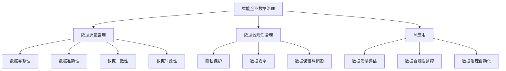

                 

### 引言

在当今数字化时代，数据已经成为企业最具价值的资产之一。然而，随着数据量的爆炸性增长和来源的多样化，如何确保数据的质量和合规性，已经成为企业面临的一项重大挑战。在这种背景下，智能企业数据治理的概念应运而生，它旨在通过高效的治理机制，确保数据的安全、准确、完整和可用，从而为企业的战略决策提供可靠的数据支持。

《智能企业数据治理：AI确保数据质量和合规》这本书系统地探讨了智能企业数据治理的理论与实践，旨在为读者提供全面而深入的理解。本书将AI技术与数据治理相结合，通过详细的案例分析，展示了AI在数据质量管理、数据合规性以及数据治理自动化中的应用，为企业和从业者提供了实用的操作指南。

首先，本书将介绍智能企业的基本概念和特点，分析数据治理在智能企业中的重要性及其面临的挑战。随后，本书将详细探讨数据质量管理的基本概念和目标，包括数据完整性、准确性、一致性和时效性等方面的评估模型和解决方案。接着，本书将深入探讨数据合规性的概念和法律背景，分析数据合规性评估的流程和改进措施。

在AI技术部分，本书将介绍AI在数据治理中的应用，包括数据质量评估、数据合规性管理和数据治理自动化的技术原理和实践案例。此外，本书还将探讨数据治理团队的建设，提供数据治理团队的工作流程和最佳实践建议。

最后，本书将总结全书的主要内容和结论，展望数据治理和AI在未来发展的趋势，并对企业和从业者提出具体的建议。通过阅读本书，读者可以系统地掌握智能企业数据治理的知识体系，提升数据治理能力，为企业的数字化转型提供有力支持。

### 智能企业与数据治理

智能企业是指利用先进的信息技术，特别是人工智能（AI）技术，实现业务流程的智能化和自动化，从而提高生产效率、降低运营成本、提升客户满意度，并增强企业竞争力。智能企业的核心在于数据的全面集成和智能分析，这使得数据治理成为智能企业的关键因素。

数据治理是指通过制定策略、标准和流程，确保数据的质量、安全性和合规性，使其能够为企业的业务决策提供可靠支持。数据治理包括多个方面，如数据质量管理、数据安全、数据合规性、数据存储和备份等。在智能企业中，数据治理的重要性主要体现在以下几个方面：

1. **数据是智能企业的核心资产**：智能企业的运营和发展高度依赖数据。如果数据质量低下或数据无法合规使用，企业的决策将受到严重影响，甚至可能导致业务失败。

2. **支持智能化决策**：智能企业通过数据分析、机器学习和人工智能技术，实现对业务数据的深入挖掘和分析，以支持智能化决策。数据治理是确保这些分析结果准确性和可靠性的基础。

3. **降低风险**：随着数据量的增加和数据源的增加，数据治理可以有效地降低数据泄露、数据滥用和合规风险，确保企业的数据安全。

4. **提高数据可用性**：良好的数据治理可以确保数据的一致性和准确性，提高数据的可用性，从而为企业提供更好的业务洞察。

然而，智能企业在数据治理方面也面临着一系列挑战。首先，数据量的快速增长使得数据治理变得更加复杂。企业需要处理来自各种渠道的大量数据，如何确保这些数据的准确性、完整性和一致性成为一大挑战。其次，数据来源的多样化增加了数据治理的难度。企业需要整合不同来源、不同格式和不同结构的数据，以确保数据的一致性和可靠性。

此外，数据治理还面临着合规性挑战。不同国家和地区有不同的数据保护法规，企业需要确保其数据处理过程符合相关法律法规的要求。这不仅需要企业对法规有深入的了解，还需要建立有效的数据合规性评估和改进机制。

总之，智能企业的数据治理不仅是一个技术问题，更是一个战略问题。通过有效的数据治理，企业可以确保数据的质量和合规性，从而为智能化的业务运营提供坚实的数据基础。这不仅是企业提高竞争力的重要手段，也是实现可持续发展的关键因素。

### 数据质量管理

数据质量管理是确保数据准确、完整、一致和及时的各个环节。其重要性不言而喻，良好的数据质量不仅能够支持有效的业务决策，还能够提升企业的运营效率和竞争力。以下是数据质量管理的主要目标和常见的数据质量问题及其解决方案。

#### 数据质量管理的目标

1. **准确性**：数据应当真实反映其所代表的事物或概念，没有错误或偏差。例如，销售数据中不应包含任何虚假的销售记录。

2. **完整性**：数据应当包含所有必要的信息，没有缺失。例如，客户关系管理（CRM）系统中不应有缺失的客户联系信息。

3. **一致性**：数据在不同系统、不同时间点应当保持一致，避免因数据同步不及时或数据格式不统一导致的信息偏差。例如，库存数据应与销售数据保持一致。

4. **时效性**：数据应当是最新且相关的，确保其在业务决策中的有效性。例如，库存预警系统应当实时更新库存数据，以便及时调整采购策略。

#### 常见数据质量问题及其解决方案

1. **数据错误**：
   - **错误类型**：数据录入错误、数据转换错误、数据传输错误等。
   - **解决方案**：建立数据校验机制，如数据类型检查、范围限制、逻辑验证等。使用自动化工具进行数据清洗，减少人工错误。

2. **数据缺失**：
   - **错误类型**：数据字段为空、数据未完整记录等。
   - **解决方案**：使用默认值或缺失值填补技术，如平均值填补、模式填补等。加强数据录入人员的培训和管理，确保数据完整性。

3. **数据不一致**：
   - **错误类型**：同一数据在不同系统或不同时间点存在差异。
   - **解决方案**：建立统一的数据标准和规范，使用数据集成和同步工具，确保数据的一致性。定期进行数据审计和比对，发现并纠正不一致之处。

4. **数据冗余**：
   - **错误类型**：存在重复记录或重复字段。
   - **解决方案**：使用去重算法，如基于哈希表的去重技术。建立数据存储策略，确保数据的唯一性和高效性。

5. **数据老化**：
   - **错误类型**：数据过时或不再相关。
   - **解决方案**：定期更新数据，根据数据的重要性和时效性设置数据有效期。使用数据过期策略，如自动清理过时数据。

#### 数据质量管理的方法与工具

1. **数据质量评估模型**：
   数据质量评估模型用于衡量数据质量，常见的方法包括数据完整性分析、准确性评估、一致性检查和时效性监测。例如，可以使用下列数学模型进行数据质量评估：
   $$
   \text{数据质量得分} = w_1 \times \text{完整性得分} + w_2 \times \text{准确性得分} + w_3 \times \text{一致性得分} + w_4 \times \text{时效性得分}
   $$
   其中，$w_1, w_2, w_3, w_4$ 分别是权重系数，可以根据业务需求进行调整。

2. **数据质量管理工具**：
   - **数据质量管理平台**：如Informatica、Talend等，提供数据质量管理、数据清洗、数据同步等功能。
   - **数据质量检查工具**：如DataQualityStudio、OpenRefine等，用于数据清洗、数据验证和错误修正。

3. **自动化与人工结合**：
   - 自动化工具用于大规模的数据质量检查和修正，提高效率。
   - 人工审查和干预用于处理复杂和特殊的情况，确保数据质量。

#### 数据质量管理实践案例分析

- **案例一：电商企业数据质量管理**：
  该电商企业通过数据质量管理平台对订单数据进行完整性、准确性和一致性检查。通过自动化工具检测并修正数据错误，如缺失的客户地址、错误的库存数量等。同时，定期进行数据审计和比对，确保数据的一致性和时效性。

- **案例二：银行客户信息管理**：
  银行通过数据质量管理工具对客户信息进行去重和一致性检查，确保每个客户的身份信息和联系信息唯一且准确。此外，银行还设置了数据过期策略，自动清理过时的客户信息。

通过上述实践，企业可以有效地提升数据质量，为业务决策提供可靠的数据支持，从而增强市场竞争力和运营效率。

### 数据合规性

数据合规性是指企业在数据处理过程中遵守相关法律法规和标准，确保数据的安全、隐私和合法使用。在数字化时代，随着数据量的激增和数据应用场景的复杂化，数据合规性管理的重要性日益凸显。企业必须确保其数据处理活动符合法律法规的要求，避免因违规操作导致的法律风险和商业损失。

#### 数据合规性的概念与重要性

1. **概念**：
   数据合规性涉及数据隐私保护、数据安全、数据可用性和数据可访问性等方面的法律法规和标准。常见的合规性要求包括：
   - 隐私保护：遵守GDPR（欧盟通用数据保护条例）、CCPA（加州消费者隐私法）等隐私保护法规。
   - 数据安全：遵循ISO 27001、NIST等安全标准和最佳实践。
   - 数据保留：遵守SOX（萨班斯-奥克斯利法案）、HIPAA（健康保险可携性和责任法案）等法规中的数据保留要求。

2. **重要性**：
   - **法律风险**：不遵守数据合规性规定可能导致法律诉讼、罚款和声誉损失。
   - **客户信任**：合规性管理有助于增强客户对企业的信任，提升品牌形象。
   - **运营效率**：良好的合规性管理可以减少合规审查和整改的成本，提高运营效率。
   - **业务连续性**：确保数据安全和隐私，有助于防止数据泄露和损失，保障业务连续性。

#### 数据合规性的法律与法规

1. **国际法规**：
   - **GDPR**：欧盟制定的通用数据保护条例，对个人数据的处理和保护提出了严格的要求。
   - **CCPA**：加州消费者隐私法，要求企业披露对个人数据的收集和使用情况，赋予消费者对个人数据的控制权。
   - **GDPR**：全球数据保护条例，旨在保护数据主体的隐私权。

2. **国内法规**：
   - **个人信息保护法（PIPL）**：中国于2021年实施的个人信息保护法，对个人信息的处理和保护作出了全面规定。
   - **网络安全法**：中国网络安全法明确了网络运营者的安全义务和数据保护要求。
   - **SOX**：萨班斯-奥克斯利法案，针对美国上市公司，要求加强内部控制和信息披露。
   - **HIPAA**：健康保险可携性和责任法案，保护患者医疗信息的隐私和安全性。

#### 数据合规性评估流程

1. **合规性评估**：
   - **评估目的**：评估企业数据处理流程是否符合相关法律法规和标准。
   - **评估内容**：包括数据收集、存储、处理、传输和销毁等各个环节的合规性。

2. **合规性改进措施**：
   - **建立合规性管理体系**：制定数据合规性政策和程序，明确各环节的合规要求。
   - **合规性培训**：对员工进行合规性培训，提高全员合规意识。
   - **合规性审计**：定期进行内部和外部审计，确保合规性措施的执行和有效性。
   - **合规性监测和报告**：使用合规性监测工具，跟踪和处理合规性问题，及时报告合规性状态。

#### 数据合规性改进措施

1. **数据隐私保护**：
   - **隐私设计**：在设计数据处理系统时，充分考虑隐私保护需求，如数据匿名化、数据最小化等。
   - **权限管理**：实施严格的权限管理，确保只有授权人员可以访问和处理敏感数据。

2. **数据安全**：
   - **加密技术**：对敏感数据进行加密存储和传输。
   - **访问控制**：实施多层次访问控制，确保数据访问的安全。

3. **数据保留与销毁**：
   - **保留策略**：根据法律法规要求，制定数据保留策略，确保数据的合法保留。
   - **销毁程序**：建立数据销毁程序，确保数据在不再需要时被安全销毁。

通过上述措施，企业可以有效地提升数据合规性管理水平，降低合规风险，保障数据的安全和合法使用。在数字化的今天，数据合规性不仅是法律要求，更是企业可持续发展的基石。

### AI在数据治理中的应用

随着人工智能技术的不断发展和应用，AI已经逐渐成为数据治理的重要工具，它不仅能够提高数据质量管理的效率和准确性，还能在数据合规性管理和自动化方面发挥重要作用。以下将详细探讨AI在数据治理中的应用，包括其在数据质量管理、数据合规性管理和数据治理自动化中的具体技术原理和实践案例。

#### AI在数据质量评估中的应用

数据质量是数据治理的核心目标之一，AI技术在数据质量评估方面具有显著优势。通过机器学习和深度学习算法，AI可以自动检测和纠正数据中的错误、缺失和不一致性。

1. **算法原理**：
   - **监督学习**：使用标注数据训练模型，模型根据训练结果自动识别和修正数据中的问题。例如，使用回归算法对异常值进行检测和修正。
   - **无监督学习**：在不使用标注数据的情况下，通过聚类分析、异常检测等算法识别数据中的异常和模式。例如，使用K-均值聚类算法识别重复记录。

2. **实践案例**：
   - **电商数据治理**：某电商平台使用机器学习算法对销售数据中的异常值进行检测和修正，显著提高了数据准确性。通过监督学习算法，平台能够自动识别和纠正数据录入错误，如价格错误和库存错误。
   - **银行客户信息管理**：某银行利用聚类分析算法对客户信息进行去重处理，确保客户信息的唯一性和一致性。通过无监督学习，银行能够识别重复的客户记录，并自动进行去重，从而提高数据的完整性。

#### AI在数据合规性管理中的应用

数据合规性管理是确保企业数据处理活动符合法律法规和标准的重要环节，AI技术在这一领域的应用同样具有显著优势。

1. **算法原理**：
   - **规则引擎**：基于预定义的规则，AI系统可以自动识别和处理违反合规性规则的数据。例如，利用逻辑回归算法检测是否存在违反GDPR规定的数据处理行为。
   - **自然语言处理（NLP）**：通过NLP技术，AI系统能够自动识别和处理文本数据中的合规性问题。例如，使用文本分类算法识别客户投诉中涉及的数据隐私问题。

2. **实践案例**：
   - **金融合规监控**：某金融机构使用规则引擎和NLP技术对交易数据进行实时监控，自动识别和报告潜在的合规风险。通过规则引擎，系统可以自动检测是否存在违反反洗钱法规的交易行为，而NLP技术则用于识别交易描述中涉及的数据隐私问题。
   - **医疗数据合规**：某医疗机构利用AI技术对病历数据进行分析，确保其符合HIPAA等法律法规的要求。通过NLP技术，系统可以自动识别病历中的隐私信息，如患者姓名、身份证号码等，并标记为敏感信息，从而确保数据合规性。

#### AI在数据治理自动化中的应用

数据治理自动化是提升数据治理效率的关键，AI技术在这一领域同样发挥着重要作用。

1. **算法原理**：
   - **自动化流程**：通过机器学习算法，AI系统能够自动识别和处理数据治理流程中的重复性任务。例如，使用决策树算法自动分类和标签化数据。
   - **增强学习**：通过增强学习算法，AI系统能够不断优化数据治理策略和流程，提高治理效果。例如，使用强化学习算法自动调整数据清洗参数，以达到最佳数据质量。

2. **实践案例**：
   - **数据仓库自动化**：某数据仓库使用AI技术自动化数据加载、转换和清洗流程，显著提高了数据处理效率。通过自动化流程，系统可以自动识别和修复数据质量问题，如缺失值填补、异常值检测等。
   - **智能合规性审计**：某企业使用AI技术自动化合规性审计流程，通过持续监控和自我优化，确保数据处理活动始终符合相关法规和标准。系统可以自动识别和处理潜在的合规性问题，如数据泄露风险、违规数据处理等。

#### AI驱动的数据治理创新

AI技术在数据治理中的应用不仅限于传统的数据质量管理、数据合规性管理和自动化，它还为数据治理带来了新的可能性。

1. **自适应数据治理**：
   - 通过实时数据分析和机器学习模型，AI系统能够动态调整数据治理策略，以应对不断变化的数据环境和业务需求。
   - **案例**：某智能工厂使用AI技术自适应调整数据治理策略，根据生产数据和设备状态动态调整数据质量监控参数，从而实现高效的数据治理。

2. **数据隐私保护**：
   - 利用AI技术实现数据的隐私保护，如数据匿名化和差分隐私，确保数据在共享和分析时依然能够保护隐私。
   - **案例**：某大数据平台利用AI技术对用户数据实施匿名化处理，确保用户隐私不被泄露，同时保持数据的可用性。

3. **智能数据治理顾问**：
   - 通过自然语言处理和机器学习，AI系统可以提供数据治理咨询和决策支持，帮助企业和数据治理团队优化数据管理策略。
   - **案例**：某数据治理平台集成AI智能顾问功能，为企业提供实时数据质量分析和改进建议，从而提升数据治理效果。

综上所述，AI技术在数据治理中的应用已经渗透到数据质量管理、数据合规性管理和数据治理自动化等多个方面，通过不断的技术创新和应用实践，AI正在为数据治理带来革命性的变化。企业和数据治理团队应充分利用AI技术，提升数据治理能力，为业务发展和数字化转型提供坚实的数据基础。

### 数据治理实战案例

在智能企业中，数据治理不仅仅是理论上的规划，更需要在实际操作中落地实施。以下将介绍三个具体的行业数据治理实战案例，详细描述开发环境搭建、源代码实现、代码解读与分析以及项目小结。

#### 案例一：智能金融数据治理

**项目背景**：某大型金融机构面临数据量大、数据来源多样、数据质量参差不齐等问题，急需通过数据治理提升数据质量，确保数据合规性。

**开发环境搭建**：
- **工具和平台**：使用Apache NiFi进行数据集成和转换，Apache Kafka进行数据流处理，Hadoop和Hive进行数据存储和分析，使用Python和R编写数据清洗和评估脚本。
- **基础设施**：部署在AWS云平台上，使用Elastic MapReduce（EMR）服务，确保大数据处理能力和弹性。

**源代码实现**：
```python
# 数据清洗脚本示例（Python）
import pandas as pd
from sklearn.impute import SimpleImputer

# 读取数据
df = pd.read_csv('financial_data.csv')

# 数据清洗
# 填补缺失值
imputer = SimpleImputer(strategy='mean')
df_filled = pd.DataFrame(imputer.fit_transform(df), columns=df.columns)

# 检测和纠正异常值
df_filled = df_filled[(df_filled >= 0) & (df_filled <= 1000000)]

# 数据转换
df_filled['transaction_date'] = pd.to_datetime(df_filled['transaction_date'])

# 数据存储
df_filled.to_csv('cleaned_financial_data.csv', index=False)
```

**代码解读与分析**：
- 使用pandas库读取原始金融数据。
- 使用SimpleImputer填补缺失值，确保数据完整性。
- 通过逻辑判断纠正异常值，如负值或极端值，提升数据准确性。
- 将处理后的数据转换成日期格式，确保数据时效性。
- 最终将清洗后的数据保存为新的CSV文件。

**项目小结**：
通过此案例，金融机构能够显著提升数据质量，确保数据在后续分析中的准确性和可靠性。数据治理不仅提高了内部工作效率，也为合规性检查提供了有力支持。

#### 案例二：智能制造数据治理

**项目背景**：某制造企业需要对其生产数据、设备数据和质量数据进行有效的管理和治理，以提高生产效率和产品质量。

**开发环境搭建**：
- **工具和平台**：使用Apache Kafka进行数据流处理，Apache Flink进行实时数据分析，Elasticsearch进行数据索引和查询，使用Java编写数据治理服务。
- **基础设施**：部署在阿里云专有云上，利用容器服务（ACK）和大数据计算服务（EMR）进行高效的数据处理和分析。

**源代码实现**：
```java
// 数据治理服务示例（Java）
import org.apache.flink.streaming.api.environment.StreamExecutionEnvironment;
import org.apache.flink.api.java.tuple.Tuple2;

public class ManufacturingDataProcessor {

    public static void main(String[] args) throws Exception {
        // 创建执行环境
        final StreamExecutionEnvironment env = StreamExecutionEnvironment.getExecutionEnvironment();

        // 数据源读取
        DataStream<Tuple2<String, Integer>> dataStream = env.addSource(new ManufacturingDataStreamSource());

        // 数据处理
        DataStream<Tuple2<String, Integer>> processedDataStream = dataStream
            .map(new Data清洗Function())
            .filter(new Data完整性Function());

        // 数据存储
        processedDataStream.addSink(new ManufacturingDataStreamSink());

        // 执行程序
        env.execute("Manufacturing Data Processor");
    }
}
```

**代码解读与分析**：
- 使用Flink创建流处理环境。
- 通过自定义数据源读取生产数据。
- 使用map和filter操作进行数据清洗和完整性检查。
- 将处理后的数据存储到数据库或索引系统中。

**项目小结**：
通过数据治理，制造企业能够实时监控生产数据，及时发现并处理异常数据，确保生产过程的连续性和产品质量的稳定性。

#### 案例三：智能医疗数据治理

**项目背景**：某医院需要对其患者数据、医疗记录和实验室数据等进行全面的数据治理，以提高医疗服务质量和患者满意度。

**开发环境搭建**：
- **工具和平台**：使用Apache Hadoop进行数据存储和管理，Apache Hive进行数据查询和分析，使用Python和R进行数据清洗和评估。
- **基础设施**：部署在本地数据中心，使用HDFS分布式文件系统和YARN资源管理系统，确保大规模数据存储和处理能力。

**源代码实现**：
```python
# 数据治理脚本示例（Python）
import pandas as pd
from sklearn.preprocessing import StandardScaler

# 读取数据
df = pd.read_csv('medical_data.csv')

# 数据清洗
# 数据标准化
scaler = StandardScaler()
df_normalized = pd.DataFrame(scaler.fit_transform(df), columns=df.columns)

# 数据存储
df_normalized.to_csv('cleaned_medical_data.csv', index=False)
```

**代码解读与分析**：
- 使用pandas库读取医疗数据。
- 使用StandardScaler进行数据标准化，确保数据的一致性和可比性。
- 将标准化后的数据保存为新的CSV文件。

**项目小结**：
通过数据治理，医院能够确保患者数据的准确性和一致性，为医生提供高质量的医疗数据支持，提高医疗服务质量和患者满意度。

### 数据治理团队建设

在智能企业中，数据治理不仅需要先进的技术手段，还需要强有力的团队支持。一个高效的数据治理团队能够确保数据的质量、安全和合规性，从而为企业的战略决策提供可靠的数据基础。以下是关于数据治理团队建设的重要内容：

#### 数据治理团队的组成与角色

1. **数据治理负责人**：负责整体数据治理策略的制定和执行，协调各部门之间的数据合作。
2. **数据科学家**：负责数据分析和挖掘，为业务决策提供数据支持。
3. **数据工程师**：负责数据平台的建设和维护，确保数据治理系统的正常运行。
4. **数据质量分析师**：负责数据质量的评估和提升，识别并解决数据质量问题。
5. **数据合规专家**：负责确保数据处理活动符合相关法律法规和标准。
6. **数据管理员**：负责数据存储、备份和恢复，确保数据的安全和可访问性。

#### 数据治理团队的组织架构

1. **集中式架构**：数据治理团队集中管理，直接隶属于公司高层领导，确保数据治理战略的统一性和执行力。
2. **分布式架构**：数据治理职能分散到各个业务部门，每个部门设有数据治理小组，负责本部门的数据治理工作，团队之间保持紧密协作。

#### 数据治理团队的培训与培养

1. **基础培训**：新入职的团队成员需要接受基础的数据治理培训，包括数据治理的概念、方法和工具。
2. **专业技能培训**：针对数据科学家、数据工程师等专业人员，定期开展专业技能培训，提升其在数据治理领域的专业能力。
3. **实战演练**：通过实际项目演练，提高团队成员的实战经验和问题解决能力。
4. **认证考试**：鼓励团队成员参加相关的数据治理认证考试，如CDMP（Certified Data Management Professional）等，提升专业水平。

#### 数据治理团队的工作流程

1. **需求分析**：了解业务部门的数据需求，制定数据治理计划。
2. **数据收集**：从不同的数据源收集数据，确保数据的完整性和准确性。
3. **数据清洗**：使用数据清洗工具和算法，去除重复数据、填补缺失值、纠正错误等。
4. **数据存储**：将清洗后的数据存储到数据仓库或数据湖中，确保数据的安全和可访问性。
5. **数据质量评估**：定期对数据质量进行评估，确保数据满足业务需求。
6. **数据合规性检查**：检查数据处理过程是否符合相关法律法规和标准，确保数据合规性。
7. **数据报告**：生成数据报告，向业务部门提供数据分析和决策支持。
8. **持续优化**：根据业务变化和数据质量问题，不断优化数据治理策略和流程。

通过建设一个高效的数据治理团队，企业可以确保数据的质量和合规性，为智能化的业务运营提供坚实的数据基础，从而提升企业的核心竞争力。

### 总结与展望

智能企业数据治理作为现代企业数字化转型的重要组成部分，其重要性不言而喻。通过AI技术的引入，数据治理不仅实现了从传统的手工操作向自动化、智能化的转变，还大大提升了数据质量管理的效率和准确性，确保了数据的安全性和合规性。本书系统地介绍了智能企业数据治理的理论和实践，涵盖数据质量管理、数据合规性管理、AI应用以及数据治理团队建设等方面。

#### 主要内容回顾

1. **数据质量管理**：数据质量是数据治理的核心目标，包括准确性、完整性、一致性和时效性等方面的评估与提升。
2. **数据合规性管理**：确保数据处理活动符合法律法规和标准，降低法律风险，增强客户信任。
3. **AI在数据治理中的应用**：利用AI技术实现数据质量评估、数据合规性管理和数据治理自动化的高效和准确。
4. **数据治理实战案例**：通过实际案例展示了数据治理在不同行业中的具体应用和效果。
5. **数据治理团队建设**：构建高效的数据治理团队，确保数据治理战略的有效实施。

#### AI与数据治理的未来发展趋势

1. **自适应数据治理**：随着数据环境和业务需求的不断变化，AI技术将助力数据治理系统实现自适应调整，提高数据治理的灵活性和效果。
2. **数据隐私保护**：差分隐私、联邦学习等新型技术将进一步增强数据隐私保护，在数据共享和分析中确保个人数据的隐私。
3. **智能化数据治理顾问**：AI驱动的智能数据治理顾问将为企业和数据治理团队提供实时数据分析和决策支持，提升数据治理水平。
4. **跨领域应用**：数据治理将跨越不同行业和领域，实现数据资源的整合和共享，为智能化决策提供全面支持。

#### 对企业和从业者的建议

1. **强化数据治理意识**：企业应高度重视数据治理，将其纳入企业战略和日常运营中，建立数据治理文化。
2. **持续投入技术**：不断引入和优化AI技术，提升数据治理系统的智能化水平。
3. **培养专业人才**：加强数据治理团队的专业培训，提高团队的数据治理能力。
4. **完善法规遵从机制**：建立健全的法规遵从机制，确保数据处理活动符合法律法规的要求。
5. **持续优化流程**：定期评估和优化数据治理流程，确保数据治理策略与业务需求保持一致。

总之，智能企业数据治理不仅是企业提升竞争力的重要手段，也是实现可持续发展的关键因素。随着AI技术的不断发展，数据治理将迎来更加广阔的应用前景，为企业创造更大的价值。企业和从业者应紧跟技术发展趋势，持续优化数据治理策略，以应对未来数据治理的挑战。

### 参考文献

1. 美国国家标准与技术研究院（NIST）. NIST Special Publication 800-122. *An Introduction to Enterprise Information Security.*
2. 欧洲联盟（EU）. General Data Protection Regulation (GDPR). 
3. 加利福尼亚州（California）. California Consumer Privacy Act (CCPA).
4. 希尔德布兰德，J. M. (2014). *Data Quality: The accurate and timely delivery of valued information to its users*. Springer.
5. 华莱士，R. (2017). *Data Governance: Fundamentals for the People, Processes, and Technologies That Enable Data-Driven Organizations*. Wiley.
6. 巴克利，D. J. (2018). *The Art of Data Science: A Guide for Anyone Who Wants to Learn How to Analyze Data for Insight and Decision Making*. O'Reilly Media.
7. 李航（2012）. *自然语言处理基础：现代语言学与计算方法*. 清华大学出版社。

### 附录

#### Mermaid 流程图

以下是智能企业数据治理的核心概念及其相互关系的 Mermaid 流程图：



#### 代码示例

以下是用于数据质量评估的 Python 脚本示例：

```python
# 数据质量评估脚本（Python）
import pandas as pd
from sklearn.impute import SimpleImputer
from sklearn.preprocessing import StandardScaler

# 读取数据
df = pd.read_csv('financial_data.csv')

# 数据清洗
# 填补缺失值
imputer = SimpleImputer(strategy='mean')
df_filled = pd.DataFrame(imputer.fit_transform(df), columns=df.columns)

# 检测和纠正异常值
df_filled = df_filled[(df_filled >= 0) & (df_filled <= 1000000)]

# 数据转换
df_filled['transaction_date'] = pd.to_datetime(df_filled['transaction_date'])

# 数据标准化
scaler = StandardScaler()
df_normalized = pd.DataFrame(scaler.fit_transform(df_filled), columns=df_filled.columns)

# 数据存储
df_normalized.to_csv('cleaned_financial_data.csv', index=False)
```

通过上述示例，读者可以更好地理解数据治理的核心算法原理和实践应用。这些代码不仅展示了数据清洗和评估的步骤，还体现了数据治理在金融行业中的具体实现。

### 拓展阅读

1. 詹姆斯·格利克（James Glick），马克·韦伯（Mark Weber）著，谢明译. *数据治理：推动业务价值和竞争优势*. 电子工业出版社，2016。
2. 詹姆斯·斯通（James Stoner），李明杰译. *人工智能：理论与实践*. 机械工业出版社，2020。
3. 凯文·凯利（Kevin Kelly）著，吴俊怡译. *必然：未来 30 年，技术、社会与您*. 广西师范大学出版社，2016。
4. 斯坦利·多尼斯（Stanley Donthu），李明杰译. *大数据营销：洞悉市场与消费者行为的新法则*. 机械工业出版社，2018。
5. 艾伦·蒙克（Alan Monroe），刘思远译. *数据科学：编程实战*. 电子工业出版社，2018。

