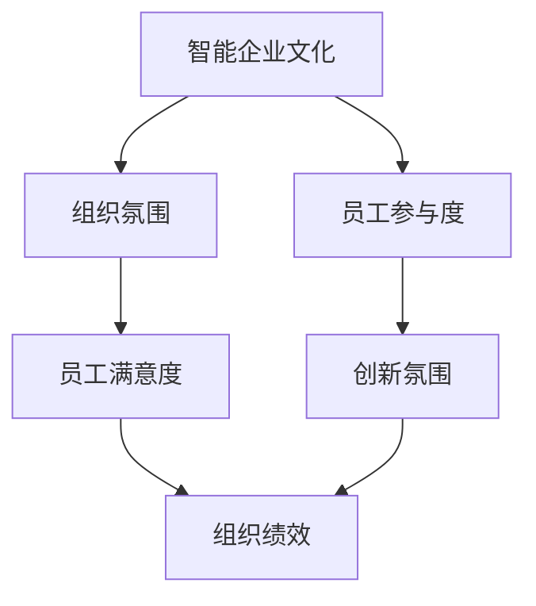

                 

 <sop>
### 《智能企业文化塑造：AI辅助组织氛围营造》

#### 关键词：
智能企业文化、AI、组织氛围、情感分析、机器学习、算法、项目实战、案例解析。

#### 摘要：
本文深入探讨了智能企业文化塑造的路径，通过AI技术在组织氛围营造中的应用，分析了AI辅助企业文化建设的关键算法和实际案例，旨在为现代企业构建积极、和谐的工作环境提供技术支持和实战指导。

---

### 1. 确定书籍的核心主题和目标

《智能企业文化塑造：AI辅助组织氛围营造》的核心主题在于探索如何利用人工智能（AI）技术来增强企业文化的建设，营造一种积极向上的组织氛围。随着人工智能技术的不断发展，其在企业中的应用已经从简单的自动化操作拓展到深层次的文化建设领域。本书的目标是：

- 介绍智能企业文化的概念和重要性。
- 分析AI技术在组织氛围营造中的应用场景。
- 通过案例研究和实战指导，展示AI在企业文化塑造中的实际效果。
- 提供工具和策略，帮助企业利用AI技术优化企业文化。

### 2. 设计整体结构

本书的整体结构分为三个部分：

**第一部分：智能企业文化概述**
- **第1章：智能企业文化核心概念与联系**：介绍智能企业文化的定义、内涵及其与企业战略、组织氛围的联系。
- **第2章：智能企业文化的发展历程**：回顾智能企业文化的发展历程，探讨其演变过程及当前的发展趋势。

**第二部分：AI与组织氛围营造**
- **第3章：AI技术在组织氛围营造中的应用**：详细讨论AI在组织氛围营造中的具体应用，如情感分析、个性化培训等。
- **第4章：核心算法原理讲解**：深入分析AI技术背后的核心算法原理，如情感分析算法、机器学习算法等。

**第三部分：案例分析与实战指导**
- **第5章：智能企业文化塑造案例**：通过实际案例展示智能企业文化塑造的成功实践。
- **第6章：AI辅助组织氛围营造实战**：提供实战指导，帮助企业利用AI技术营造良好的组织氛围。
- **第7章：算法应用案例分析**：分析案例中AI算法的应用及其效果，总结经验教训。

### 3. 详细规划各章节内容

**前言/引言**
- 介绍书籍的目的、适用对象、主要内容和结构安排。

**第一部分：智能企业文化概述**

**第1章：智能企业文化核心概念与联系**
- **1.1 核心概念**：定义智能企业文化、组织氛围、AI技术等关键概念。
- **1.2 关联关系**：分析智能企业文化与组织氛围之间的内在联系。
- **1.3 Mermaid流程图**：绘制智能企业文化与相关因素之间的流程图。

**第2章：智能企业文化的发展历程**
- **2.1 早期阶段**：介绍传统企业文化与智能企业文化的差异。
- **2.2 发展阶段**：讨论智能化技术在企业文化中的应用。
- **2.3 现代阶段**：分析当前智能企业文化的发展趋势。

**第二部分：AI与组织氛围营造**

**第3章：AI技术在组织氛围营造中的应用**
- **3.1 AI技术在员工关系管理中的应用**：探讨AI如何改善员工之间的关系。
- **3.2 AI技术在员工培训与发展中的应用**：分析AI如何提升员工的培训效果。
- **3.3 AI技术在员工满意度调查中的应用**：介绍AI如何进行员工满意度调查。

**第4章：核心算法原理讲解**
- **4.1 情感分析算法**：讲解情感分析算法的基本原理和应用。
- **4.2 机器学习算法**：分析机器学习算法在组织氛围营造中的应用。

**第三部分：案例分析与实战指导**

**第5章：智能企业文化塑造案例**
- **5.1 案例背景**：介绍案例企业的基本情况。
- **5.2 案例实施**：详细描述智能企业文化塑造的实施过程。
- **5.3 案例效果**：分析案例实施后的效果和影响。

**第6章：AI辅助组织氛围营造实战**
- **6.1 实战准备**：介绍实施AI辅助组织氛围营造的准备工作。
- **6.2 实战步骤**：详细说明实施过程的关键步骤。
- **6.3 实战效果**：评估AI辅助组织氛围营造的实战效果。

**第7章：算法应用案例分析**
- **7.1 案例背景**：介绍案例企业的基本情况。
- **7.2 案例算法应用**：分析案例中使用的AI算法。
- **7.3 案例效果**：评估算法应用的效果和影响。

### 4. 格式与字数要求

- **格式要求**：文章内容使用markdown格式输出，确保代码、公式和流程图等元素的正确显示。
- **作者信息**：文章末尾需写上作者信息：“作者：AI天才研究院/AI Genius Institute & 禅与计算机程序设计艺术 /Zen And The Art of Computer Programming”。
- **字数要求**：文章总字数控制在10000～12000字左右，确保内容完整、详实、逻辑清晰。

### 5. 确保完整性

- **核心概念与联系**：提供Mermaid流程图，展示智能企业文化与相关因素之间的关联。
- **核心算法原理讲解**：使用Python源代码详细阐述核心算法原理，结合数学模型和公式，进行深入讲解。
- **数学模型和数学公式**：使用latex格式嵌入文中独立段落的数学公式，确保公式的正确显示。
- **项目实战**：提供完整的代码实现和详细解释，结合实际案例进行分析。

---

通过以上规划，我们为《智能企业文化塑造：AI辅助组织氛围营造》一书设计了详细的内容框架，确保文章逻辑清晰、内容丰富、技术深入。在接下来的撰写过程中，我们将严格按照这一结构进行逐章编写，力求为读者呈现一篇高质量的技术博客文章。让我们一步步深入探索智能企业文化塑造的奥秘！

