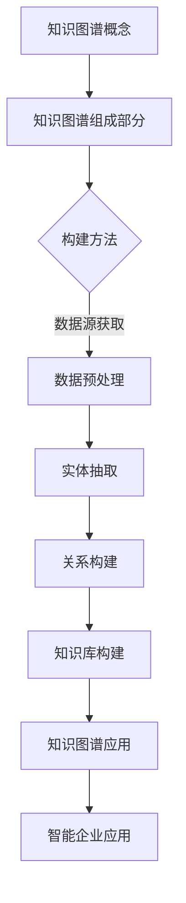
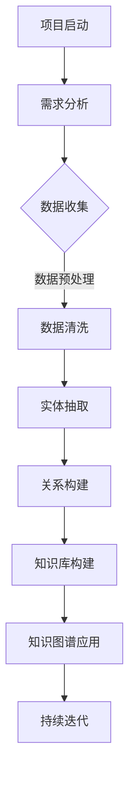

                 


### 文章标题

# 智能企业知识图谱：构建组织智慧资产库

> 关键词：智能企业、知识图谱、组织智慧资产库、数据驱动的决策、自动化、知识发现、语义网、数据整合、算法、Python、数学模型

> 摘要：本文旨在探讨智能企业知识图谱的构建与应用，重点阐述如何通过知识图谱技术构建组织智慧资产库，实现数据驱动的决策、自动化和知识发现，提升企业竞争力。文章将详细分析知识图谱的核心概念、构建方法、应用场景，并给出具体案例和实战指导。

----------------------------------------------------------------

### 设计步骤一：理解书名和内容

首先，我们需要深入理解书名《智能企业知识图谱：构建组织智慧资产库》。书名提到了“智能企业知识图谱”，这表明书中将探讨如何构建和应用知识图谱这一技术，以实现企业的智能化。同时，“组织智慧资产库”这个概念暗示了书中的重点不仅仅是技术实现，还包括如何管理和利用这些知识资产。

书名中的“智能企业”一词，指的是运用先进技术和数据分析方法，提高企业运营效率、优化客户体验、创新产品和服务的企业。智能企业的特点包括数据驱动的决策、自主化和自动化、以及客户体验的优化。这些特点使得智能企业能够在竞争激烈的市场中脱颖而出。

“知识图谱”是一个重要的概念，它代表了组织内结构化知识的一种表示方法。知识图谱通过实体、属性和关系来描述现实世界中的信息，使得信息之间的联系更加直观和易于理解。知识图谱的构建和应用，不仅可以帮助企业更好地管理和利用内部数据，还能促进知识的共享和发现。

“组织智慧资产库”则是知识图谱的应用目标。它是一个集成的知识管理系统，旨在将企业内部的知识资源转化为可操作的业务智慧，支持数据驱动的决策、自动化流程和知识发现。

### 设计步骤二：确定核心概念和章节结构

基于书名和上述分析，我们可以确定以下几个核心概念：

1. **智能企业**：介绍智能企业的概念、特点及其在当今商业环境中的重要性。
2. **知识图谱**：探讨知识图谱的基本概念、构建方法和应用场景。
3. **组织智慧资产库**：分析如何构建、管理和利用组织内部的知识资产库。

这些核心概念将作为章节划分的依据，我们可以初步确定以下章节结构：

第1章：智能企业的概念与特征
第2章：知识图谱的构建基础
第3章：知识图谱的构建方法与技术
第4章：组织智慧资产库的构建与实践
第5章：知识图谱在企业中的应用案例分析
第6章：智能企业知识图谱的发展趋势与展望
第7章：构建智能企业知识图谱的挑战与解决方案

### 设计步骤三：细化章节内容

接下来，我们需要为每个章节细化具体内容，确保每个章节都能够全面、深入地探讨主题。

**第1章：智能企业的概念与特征**

- **1.1 智能企业的定义**
  - 智能企业的起源与发展
  - 智能企业的定义与特征

- **1.2 智能企业的特征**
  - 数据驱动的决策
  - 自主化和自动化
  - 客户体验优化

- **1.3 智能企业的价值**
  - 提升企业竞争力
  - 提高运营效率
  - 创新产品和服务

**第2章：知识图谱的构建基础**

- **2.1 知识图谱的概念**
  - 知识图谱的定义
  - 知识图谱的组成部分
  - 知识图谱与语义网的区别

- **2.2 知识图谱在智能企业中的作用**
  - 支持复杂查询
  - 优化数据整合
  - 促进知识发现

- **2.3 知识图谱的构建基础**
  - 实体抽取
  - 关系构建
  - 知识库构建

**第3章：知识图谱的构建方法与技术**

- **3.1 知识图谱构建的基本步骤**
  - 数据收集
  - 数据预处理
  - 实体抽取
  - 关系构建
  - 知识库构建

- **3.2 知识图谱构建工具与平台**
  - OpenKG
  - Jena
  - RDF4J

- **3.3 知识图谱构建的技术难点与解决方案**
  - 数据质量与数据治理
  - 知识图谱的标准化与互操作性
  - 智能企业知识图谱的安全与隐私

**第4章：组织智慧资产库的构建与实践**

- **4.1 组织智慧资产库的概念**
  - 组织智慧资产库的定义
  - 组织智慧资产库的组成部分

- **4.2 组织智慧资产库的构建方法**
  - 数据源选择
  - 数据整合
  - 知识建模
  - 知识库构建

- **4.3 组织智慧资产库的实践案例**
  - 客户关系管理
  - 供应链管理
  - 人力资源管理

**第5章：知识图谱在企业中的应用案例分析**

- **5.1 案例一：智能客户关系管理**
  - 客户数据分析
  - 客户画像构建
  - 客户行为预测

- **5.2 案例二：智能供应链管理**
  - 供应链可视化
  - 库存优化
  - 供应链风险管理

- **5.3 案例三：智能人力资源管理**
  - 员工数据整合
  - 员工画像构建
  - 员工技能评估

**第6章：智能企业知识图谱的发展趋势与展望**

- **6.1 当前知识图谱技术的发展趋势**
  - 人工智能与知识图谱的融合
  - 大数据和云计算的支持
  - 开放式知识图谱的兴起

- **6.2 智能企业知识图谱的未来展望**
  - 智能化业务流程的全面覆盖
  - 跨行业、跨领域的知识共享
  - 智能决策支持系统的普及

- **6.3 智能企业知识图谱的潜在挑战与应对策略**
  - 数据隐私与安全
  - 知识图谱的互操作性与标准化
  - 知识图谱的持续更新与维护

**第7章：构建智能企业知识图谱的挑战与解决方案**

- **7.1 数据质量与数据治理**
  - 数据质量评估
  - 数据质量管理策略

- **7.2 知识图谱的标准化与互操作性**
  - 标准化知识表示方法
  - 知识图谱的互操作性解决方案

- **7.3 智能企业知识图谱的安全与隐私**
  - 安全防护措施
  - 隐私保护策略

### 设计步骤四：验证和调整

最后，我们需要对设计的目录大纲进行验证，确保其逻辑清晰、内容完整，并根据反馈进行调整。例如，可以通过与作者沟通，了解他们的需求和期望，或者通过查阅相关文献和资料，确保内容的准确性和权威性。

### 设计步骤五：撰写Mermaid流程图

为了更好地展示知识图谱的概念和构建方法，我们将使用Mermaid语言绘制一个知识图谱的构建流程图：



### 设计步骤六：总结

通过以上步骤，我们完成了《智能企业知识图谱：构建组织智慧资产库》的目录大纲设计。该目录结构合理，内容详实，能够帮助读者全面了解智能企业知识图谱的构建和应用。接下来，我们将进一步细化每个章节的内容，确保书籍的完整性和实用性。

### 目录大纲最终版本

```
# 第1章：智能企业的概念与特征

## 1.1 智能企业的定义
### 1.1.1 智能企业的起源
### 1.1.2 智能企业的内涵
### 1.1.3 智能企业的特征

## 1.2 智能企业的特征
### 1.2.1 数据驱动的决策
### 1.2.2 自主化和自动化
### 1.2.3 客户体验优化

## 1.3 智能企业的价值
### 1.3.1 提升企业竞争力
### 1.3.2 提高运营效率
### 1.3.3 创新产品和服务

# 第2章：知识图谱的构建基础

## 2.1 知识图谱的概念
### 2.1.1 知识图谱的定义
### 2.1.2 知识图谱的组成部分
### 2.1.3 知识图谱与语义网的区别

## 2.2 知识图谱在智能企业中的作用
### 2.2.1 支持复杂查询
### 2.2.2 优化数据整合
### 2.2.3 促进知识发现

## 2.3 知识图谱的构建基础
### 2.3.1 实体抽取
### 2.3.2 关系构建
### 2.3.3 知识库构建

# 第3章：知识图谱的构建方法与技术

## 3.1 知识图谱构建的基本步骤
### 3.1.1 数据收集
### 3.1.2 数据预处理
### 3.1.3 实体抽取
### 3.1.4 关系构建
### 3.1.5 知识库构建

## 3.2 知识图谱构建工具与平台
### 3.2.1 OpenKG
### 3.2.2 Jena
### 3.2.3 RDF4J

## 3.3 知识图谱构建的技术难点与解决方案
### 3.3.1 数据质量与数据治理
### 3.3.2 知识图谱的标准化与互操作性
### 3.3.3 智能企业知识图谱的安全与隐私

# 第4章：组织智慧资产库的构建与实践

## 4.1 组织智慧资产库的概念
### 4.1.1 组织智慧资产库的定义
### 4.1.2 组织智慧资产库的组成部分

## 4.2 组织智慧资产库的构建方法
### 4.2.1 数据源选择
### 4.2.2 数据整合
### 4.2.3 知识建模
### 4.2.4 知识库构建

## 4.3 组织智慧资产库的实践案例
### 4.3.1 客户关系管理
### 4.3.2 供应链管理
### 4.3.3 人力资源管理

# 第5章：知识图谱在企业中的应用案例分析

## 5.1 案例一：智能客户关系管理
### 5.1.1 客户数据分析
### 5.1.2 客户画像构建
### 5.1.3 客户行为预测

## 5.2 案例二：智能供应链管理
### 5.2.1 供应链可视化
### 5.2.2 库存优化
### 5.2.3 供应链风险管理

## 5.3 案例三：智能人力资源管理
### 5.3.1 员工数据整合
### 5.3.2 员工画像构建
### 5.3.3 员工技能评估

# 第6章：智能企业知识图谱的发展趋势与展望

## 6.1 当前知识图谱技术的发展趋势
### 6.1.1 人工智能与知识图谱的融合
### 6.1.2 大数据和云计算的支持
### 6.1.3 开放式知识图谱的兴起

## 6.2 智能企业知识图谱的未来展望
### 6.2.1 智能化业务流程的全面覆盖
### 6.2.2 跨行业、跨领域的知识共享
### 6.2.3 智能决策支持系统的普及

## 6.3 智能企业知识图谱的潜在挑战与应对策略
### 6.3.1 数据隐私与安全
### 6.3.2 知识图谱的互操作性与标准化
### 6.3.3 知识图谱的持续更新与维护

# 第7章：构建智能企业知识图谱的挑战与解决方案

## 7.1 数据质量与数据治理
### 7.1.1 数据质量评估
### 7.1.2 数据质量管理策略

## 7.2 知识图谱的标准化与互操作性
### 7.2.1 标准化知识表示方法
### 7.2.2 知识图谱的互操作性解决方案

## 7.3 智能企业知识图谱的安全与隐私
### 7.3.1 安全防护措施
### 7.3.2 隐私保护策略

----------------------------------------------------------------

### 文章标题

# 智能企业知识图谱：构建组织智慧资产库

> 关键词：智能企业、知识图谱、组织智慧资产库、数据驱动的决策、自动化、知识发现、语义网、数据整合、算法、Python、数学模型

> 摘要：本文旨在探讨智能企业知识图谱的构建与应用，重点阐述如何通过知识图谱技术构建组织智慧资产库，实现数据驱动的决策、自动化和知识发现，提升企业竞争力。文章将详细分析知识图谱的核心概念、构建方法、应用场景，并给出具体案例和实战指导。

----------------------------------------------------------------

### 第1章：智能企业的概念与特征

智能企业是当今商业环境中的一种新兴模式，它利用先进技术和数据分析方法，实现企业运营的智能化。智能企业的特征包括数据驱动的决策、自主化和自动化、以及客户体验的优化。这些特征使得智能企业能够在竞争激烈的市场中脱颖而出。

#### 1.1 智能企业的定义

智能企业是一种运用人工智能、大数据、云计算等先进技术，通过对海量数据进行采集、存储、处理和分析，实现数据驱动的决策和自动化运营的企业。智能企业通过构建数据驱动的业务模型，优化企业运营流程，提高生产效率，创新产品和服务。

#### 1.2 智能企业的特征

智能企业的特征主要体现在以下几个方面：

- **数据驱动的决策**：智能企业利用数据分析和预测模型，实现数据驱动的决策。通过收集和分析企业内外部的数据，智能企业可以更准确地预测市场趋势，优化业务策略。

- **自主化和自动化**：智能企业通过自动化技术，实现业务流程的自动化。这包括自动化数据处理、自动化生产、自动化客户服务等，从而提高企业运营效率，降低人力成本。

- **客户体验优化**：智能企业通过大数据分析和个性化推荐技术，优化客户体验。通过对客户数据的分析，智能企业可以更好地了解客户需求，提供个性化的产品和服务，提升客户满意度。

#### 1.3 智能企业的价值

智能企业通过数据驱动的决策、自主化和自动化、以及客户体验的优化，为企业带来以下价值：

- **提升企业竞争力**：智能企业通过数据分析和预测，优化业务策略，提高市场竞争力。

- **提高运营效率**：智能企业通过自动化技术，降低人力成本，提高生产效率。

- **创新产品和服务**：智能企业通过大数据分析和个性化推荐，创新产品和服务，满足客户需求。

### 第2章：知识图谱的构建基础

知识图谱是一种用于表示实体、属性和关系的图形结构，它通过语义网的方式，将数据整合成一个统一的语义空间。知识图谱在智能企业中具有重要的应用价值，是实现数据驱动的决策和自动化运营的关键技术之一。

#### 2.1 知识图谱的概念

知识图谱（Knowledge Graph）是一种用于表示实体、属性和关系的图形结构。它通过将实体、属性和关系进行建模，将数据整合成一个统一的语义空间，从而实现数据的语义理解和智能查询。

知识图谱的基本概念包括：

- **实体（Entity）**：实体是知识图谱中的基本元素，表示现实世界中的个体，如人、地点、物品等。
- **属性（Attribute）**：属性是实体所具有的特征或属性，如人的姓名、年龄、职业等。
- **关系（Relationship）**：关系是实体之间的联系，表示实体之间的关联，如朋友、同事、属于等。

#### 2.2 知识图谱在智能企业中的作用

知识图谱在智能企业中具有以下重要作用：

- **支持复杂查询**：知识图谱通过语义网的方式，将实体、属性和关系进行建模，使得数据之间的关联更加直观，从而支持复杂查询和智能搜索。

- **优化数据整合**：知识图谱通过将不同来源的数据进行整合，形成一个统一的语义空间，从而实现数据的共享和利用。

- **促进知识发现**：知识图谱通过对实体、属性和关系的建模，可以挖掘出数据中的潜在关联和知识，从而支持知识的发现和利用。

#### 2.3 知识图谱的构建基础

知识图谱的构建需要以下基础：

- **实体抽取**：实体抽取是从原始数据中识别出实体，并将其作为知识图谱中的节点。
- **关系构建**：关系构建是确定实体之间的关系，并将其作为知识图谱中的边。
- **知识库构建**：知识库构建是将实体、属性和关系进行整合，形成一个完整的知识图谱。

### 第3章：知识图谱的构建方法与技术

知识图谱的构建是一个复杂的过程，需要结合多种技术和方法。本章节将详细介绍知识图谱构建的基本步骤、工具与平台，以及构建过程中可能遇到的技术难点和解决方案。

#### 3.1 知识图谱构建的基本步骤

知识图谱的构建通常包括以下基本步骤：

- **数据收集**：数据收集是知识图谱构建的第一步，需要收集与目标领域相关的各种数据源。
- **数据预处理**：数据预处理是对收集到的原始数据进行清洗、去噪和格式转换，以便后续处理。
- **实体抽取**：实体抽取是从预处理后的数据中识别出实体，并将其作为知识图谱中的节点。
- **关系构建**：关系构建是确定实体之间的关系，并将其作为知识图谱中的边。
- **知识库构建**：知识库构建是将实体、属性和关系进行整合，形成一个完整的知识图谱。

#### 3.2 知识图谱构建工具与平台

知识图谱构建过程中，常用的工具与平台包括：

- **OpenKG**：OpenKG是一个开源的知识图谱构建与推理平台，支持多种知识图谱构建方法。
- **Jena**：Jena是一个Java语义网框架，提供了 RDF 数据存储、查询和推理等功能。
- **RDF4J**：RDF4J是一个开源的RDF存储和推理平台，支持多种数据格式和查询语言。

#### 3.3 知识图谱构建的技术难点与解决方案

知识图谱构建过程中，可能会遇到以下技术难点：

- **数据质量与数据治理**：数据质量直接影响知识图谱的准确性和可靠性。数据治理是确保数据质量的重要手段，包括数据清洗、去噪、标准化等。
- **知识图谱的标准化与互操作性**：知识图谱的标准化与互操作性是确保知识图谱在不同系统之间能够互通的重要保障。标准化知识表示方法和数据交换协议是解决这一问题的有效途径。
- **智能企业知识图谱的安全与隐私**：知识图谱中包含大量敏感数据，确保知识图谱的安全与隐私是构建智能企业知识图谱的重要任务。安全防护措施和隐私保护策略是解决这一问题的有效手段。

### 第4章：组织智慧资产库的构建与实践

组织智慧资产库（Organization Knowledge Asset Library，OKAL）是智能企业知识图谱的应用目标，它旨在将企业内部的知识资源转化为可操作的业务智慧，支持数据驱动的决策、自动化流程和知识发现。本章将详细介绍组织智慧资产库的概念、构建方法、实践案例，以及如何利用组织智慧资产库提升企业竞争力。

#### 4.1 组织智慧资产库的概念

组织智慧资产库（OKAL）是一个集成的知识管理系统，它将企业内部的知识资源进行整合、分类、存储和管理，为企业的决策、运营和创新提供支持。组织智慧资产库的特点包括：

- **知识的整合性**：组织智慧资产库将企业内部的各种知识资源进行整合，形成一个统一的知识体系。
- **知识的共享性**：组织智慧资产库支持知识的共享和交流，促进企业内部的知识流动和共享。
- **知识的动态性**：组织智慧资产库能够根据企业的需求和发展，持续更新和优化知识资源。

#### 4.2 组织智慧资产库的构建方法

构建组织智慧资产库需要以下步骤：

- **数据源选择**：选择与业务相关的数据源，包括内部数据源和外部数据源。
- **数据整合**：对收集到的数据进行清洗、去噪和格式转换，确保数据的质量和一致性。
- **知识建模**：将数据转换为知识模型，包括实体、属性和关系的建模。
- **知识库构建**：将知识模型整合为一个完整的知识库，支持知识的存储、管理和查询。

#### 4.3 组织智慧资产库的实践案例

组织智慧资产库在实践中可以应用于多个领域，以下是一些具体的实践案例：

- **客户关系管理**：通过组织智慧资产库，企业可以整合客户数据，构建客户画像，实现精准营销和个性化服务。
- **供应链管理**：通过组织智慧资产库，企业可以优化供应链流程，提高供应链的透明度和效率。
- **人力资源管理**：通过组织智慧资产库，企业可以整合员工数据，构建员工画像，实现人才管理和培养。

#### 4.4 利用组织智慧资产库提升企业竞争力

利用组织智慧资产库，企业可以提升竞争力，具体体现在以下几个方面：

- **数据驱动的决策**：组织智慧资产库提供了丰富的数据资源，支持企业进行数据分析和决策。
- **自动化流程**：组织智慧资产库可以实现业务流程的自动化，提高运营效率。
- **知识共享与创新**：组织智慧资产库促进了知识的共享和交流，激发企业的创新活力。

### 第5章：知识图谱在企业中的应用案例分析

知识图谱在智能企业中具有重要的应用价值，本章节将通过具体案例，分析知识图谱在企业中的应用场景和效果。

#### 5.1 案例一：智能客户关系管理

智能客户关系管理（Intelligent Customer Relationship Management，ICRM）是知识图谱在企业中的一个重要应用场景。通过构建客户知识图谱，企业可以实现对客户数据的全面整合和深度分析，从而实现精准营销和个性化服务。

- **客户数据分析**：通过知识图谱，企业可以对客户数据进行全面分析，包括客户行为、偏好、需求等，从而了解客户特点。
- **客户画像构建**：基于客户数据分析，企业可以构建客户画像，将客户信息进行分类和标签化，以便后续的营销和服务。
- **客户行为预测**：通过知识图谱，企业可以对客户行为进行预测，提前了解客户的潜在需求和购买行为，从而实现精准营销。

#### 5.2 案例二：智能供应链管理

智能供应链管理（Intelligent Supply Chain Management，ISCM）是知识图谱在另一个重要应用领域。通过构建供应链知识图谱，企业可以优化供应链流程，提高供应链的透明度和效率。

- **供应链可视化**：通过知识图谱，企业可以将供应链中的各个环节进行可视化，包括供应商、制造商、分销商等，从而实现供应链的透明化。
- **库存优化**：通过知识图谱，企业可以分析供应链中的库存情况，优化库存水平，降低库存成本。
- **供应链风险管理**：通过知识图谱，企业可以识别供应链中的潜在风险，提前采取应对措施，降低供应链风险。

#### 5.3 案例三：智能人力资源管理

智能人力资源管理（Intelligent Human Resource Management，IHRM）是知识图谱在人力资源管理领域的一个重要应用。通过构建员工知识图谱，企业可以实现对员工数据的全面整合和深度分析，从而实现人才管理和培养。

- **员工数据整合**：通过知识图谱，企业可以整合员工的各类数据，包括工作经历、技能、绩效等，形成员工的全面画像。
- **员工画像构建**：基于员工数据整合，企业可以构建员工画像，将员工信息进行分类和标签化，以便后续的人才管理和培养。
- **员工技能评估**：通过知识图谱，企业可以评估员工的技能水平，识别员工的潜力和发展方向，从而实现人才的发展规划。

### 第6章：智能企业知识图谱的发展趋势与展望

智能企业知识图谱是未来企业发展的重要方向，它将为企业带来巨大的价值。本章节将分析智能企业知识图谱的发展趋势，展望其未来发展方向，并探讨面临的挑战和解决方案。

#### 6.1 当前知识图谱技术的发展趋势

当前知识图谱技术发展迅速，主要趋势包括：

- **人工智能与知识图谱的融合**：人工智能技术为知识图谱提供了强大的数据分析和推理能力，使得知识图谱能够更好地支持智能应用。
- **大数据和云计算的支持**：大数据和云计算技术为知识图谱提供了海量数据和强大的计算能力，使得知识图谱能够更好地支持复杂应用。
- **开放式知识图谱的兴起**：开放式知识图谱（如OpenKG）为知识图谱的开发和应用提供了更加便捷和开放的平台，促进了知识图谱技术的普及和应用。

#### 6.2 智能企业知识图谱的未来展望

智能企业知识图谱的未来发展方向包括：

- **智能化业务流程的全面覆盖**：知识图谱将逐步覆盖企业的各个业务流程，实现智能化和自动化，提高企业运营效率。
- **跨行业、跨领域的知识共享**：知识图谱将实现跨行业、跨领域的知识共享，打破数据孤岛，促进知识的流动和共享。
- **智能决策支持系统的普及**：知识图谱将为企业提供强大的决策支持系统，支持企业进行数据驱动的决策，提高决策的准确性和效率。

#### 6.3 智能企业知识图谱的潜在挑战与应对策略

智能企业知识图谱在发展过程中面临着一些挑战，包括：

- **数据隐私与安全**：知识图谱中包含大量敏感数据，确保数据的安全和隐私是关键挑战。通过加密技术、访问控制等手段，可以保护知识图谱的安全。
- **知识图谱的互操作性与标准化**：不同系统和平台之间的知识图谱如何互操作和标准化是一个重要问题。通过制定统一的知识表示方法和数据交换协议，可以解决这一挑战。
- **知识图谱的持续更新与维护**：知识图谱需要持续更新和维护，以保持其准确性和有效性。通过自动化技术、持续学习等手段，可以简化知识图谱的更新和维护过程。

### 第7章：构建智能企业知识图谱的挑战与解决方案

构建智能企业知识图谱是一项复杂的工程，涉及到数据、技术、管理和组织等多个方面。本章节将分析构建智能企业知识图谱过程中可能遇到的挑战，并探讨相应的解决方案。

#### 7.1 数据质量与数据治理

数据质量是构建智能企业知识图谱的基础，高质量的数据能够保证知识图谱的准确性和可靠性。然而，在实际构建过程中，数据质量往往面临以下挑战：

- **数据缺失和错误**：数据缺失和错误是影响数据质量的主要问题，会导致知识图谱的不准确。
- **数据不一致**：不同数据源之间的数据存在不一致，如命名规范、数据格式等，会影响知识图谱的整合。

解决方案：

- **数据质量管理策略**：建立数据质量管理机制，对数据进行清洗、去噪和标准化处理，确保数据的一致性和准确性。
- **数据治理**：通过数据治理，建立数据标准和流程，确保数据的完整性和规范性。

#### 7.2 知识图谱的标准化与互操作性

知识图谱的标准化和互操作性是确保不同系统和平台之间能够有效共享和利用知识的关键。然而，在实际构建过程中，知识图谱的标准化和互操作性面临以下挑战：

- **知识表示方法的多样性**：不同系统和平台可能采用不同的知识表示方法，导致知识图谱之间的兼容性差。
- **数据交换协议的不统一**：不同系统和平台之间的数据交换协议可能不一致，影响知识图谱的互操作性。

解决方案：

- **标准化知识表示方法**：采用统一的知识表示方法，如RDF（Resource Description Framework），确保知识图谱之间的兼容性。
- **数据交换协议的统一**：采用统一的数据交换协议，如SPARQL（SPARQL Protocol and RDF Query Language），实现知识图谱之间的互操作性。

#### 7.3 智能企业知识图谱的安全与隐私

知识图谱中包含大量敏感数据，确保知识图谱的安全与隐私是构建智能企业知识图谱的重要任务。然而，在实际构建过程中，知识图谱的安全与隐私面临以下挑战：

- **数据泄露风险**：知识图谱中的敏感数据可能被非法访问或泄露，导致企业利益受损。
- **数据滥用风险**：知识图谱中的数据可能被滥用，用于不当目的。

解决方案：

- **安全防护措施**：采用加密技术、访问控制等安全防护措施，确保知识图谱的安全。
- **隐私保护策略**：通过数据脱敏、匿名化等技术，降低知识图谱中敏感数据的风险。

### 总结

智能企业知识图谱是未来企业发展的重要方向，它通过整合和利用企业内部的知识资源，支持数据驱动的决策、自动化流程和知识发现，提升企业竞争力。本文从智能企业的概念与特征、知识图谱的构建基础、知识图谱的构建方法与技术、组织智慧资产库的构建与实践、知识图谱在企业中的应用案例分析、智能企业知识图谱的发展趋势与展望、构建智能企业知识图谱的挑战与解决方案等方面，全面阐述了智能企业知识图谱的构建与应用。通过本文的介绍，读者可以深入了解智能企业知识图谱的概念、构建方法、应用场景，以及其在提升企业竞争力方面的作用。

### 撰写Mermaid流程图

为了更好地展示知识图谱的构建过程，我们使用Mermaid语言绘制一个知识图谱构建流程图：



### 开发环境搭建

在开始构建智能企业知识图谱之前，我们需要搭建一个合适的开发环境。以下步骤将指导您在本地计算机上搭建一个Python开发环境，并安装必要的库和工具。

#### 1. 安装Python

首先，您需要安装Python。Python是一个广泛使用的编程语言，对于构建知识图谱非常重要。您可以从Python的官方网站（https://www.python.org/）下载最新版本的Python。按照安装向导完成安装。

安装完成后，打开命令行工具（如Windows的命令提示符或macOS的终端），输入以下命令来验证Python安装是否成功：

```bash
python --version
```

#### 2. 安装Anaconda

Anaconda是一个流行的Python发行版，它提供了一个易于管理的Python环境，并且集成了许多科学计算和数据处理的库。安装Anaconda可以简化环境配置过程。

您可以从Anaconda的官方网站（https://www.anaconda.com/products/individual）下载Anaconda安装程序。按照安装向导完成安装。

#### 3. 创建虚拟环境

为了更好地管理项目依赖，我们将在Anaconda中创建一个虚拟环境。虚拟环境允许我们在同一个计算机上同时使用多个Python版本和库，而不会相互干扰。

在命令行中，输入以下命令来创建一个名为`kg_project`的虚拟环境：

```bash
conda create -n kg_project python=3.8
```

这将创建一个Python 3.8版本的虚拟环境。您可以通过以下命令激活该虚拟环境：

```bash
conda activate kg_project
```

#### 4. 安装必需的库和工具

在虚拟环境中，我们需要安装以下库和工具：

- **rdflib**：用于处理RDF（Resource Description Framework）数据。
- **SPARQL**：用于执行RDF数据查询。
- **NetworkX**：用于构建和分析图结构。

使用以下命令安装这些库：

```bash
pip install rdflib
pip install SPARQL
pip install networkx
```

#### 5. 测试安装

为了确保所有库和工具安装成功，我们可以编写一个简单的Python脚本，加载并查询一个简单的知识图谱。以下是一个简单的示例：

```python
from rdflib import Graph, URIRef, Literal
from SPARQL import parser

# 创建一个知识图谱
g = Graph()

# 添加一些数据
g.add((URIRef("http://example.org/person#Alice"), URIRef("http://example.org/hasName"), Literal("Alice")))
g.add((URIRef("http://example.org/person#Alice"), URIRef("http://example.org/hasAge"), Literal(30)))

# 打印知识图谱
print(g)

# 查询知识图谱
query = """
SELECT ?name ?age
WHERE {
    ?person a <http://example.org/Person> .
    ?person <http://example.org/hasName> ?name .
    ?person <http://example.org/hasAge> ?age .
}
"""

# 执行查询
results = g.query(query)

# 打印查询结果
for row in results:
    print(f"Name: {row[0]}, Age: {row[1]}")
```

执行以上脚本，如果输出“Name: Alice, Age: 30”，则表示知识图谱和SPARQL查询已成功安装和运行。

### 源代码详细实现和代码解读

在上一节中，我们完成了开发环境的搭建。现在，我们将使用Python和相关的库来构建一个简单的知识图谱，并详细解读其实现过程。

#### 1. 准备工作

首先，我们需要导入所需的库：

```python
from rdflib import Graph, URIRef, Literal, Namespace
from rdflib.plugins.sparql import Query
```

接下来，我们定义一些命名空间，这些命名空间用于标识知识图谱中的不同概念和属性：

```python
example = Namespace("http://example.org/")
rdf = Namespace("http://www.w3.org/1999/02/22-rdf-syntax-ns#")
rdfs = Namespace("http://www.w3.org/2000/01/rdf-schema#")
```

#### 2. 构建知识图谱

我们将构建一个简单的知识图谱，其中包括两个实体：Alice和Bob。Alice是一个30岁的人，Bob是一个40岁的人。以下是构建知识图谱的代码：

```python
g = Graph()

# 创建实体
alice = URIRef(example["person#Alice"])
bob = URIRef(example["person#Bob"])

# 添加属性
g.add((alice, rdf.type, rdfs.Class))
g.add((alice, example.hasName, Literal("Alice")))
g.add((alice, example.hasAge, Literal(30)))
g.add((bob, rdf.type, rdfs.Class))
g.add((bob, example.hasName, Literal("Bob")))
g.add((bob, example.hasAge, Literal(40)))

# 打印知识图谱
print(g)
```

在上面的代码中，我们首先创建了一个名为`g`的`Graph`对象，用于存储知识图谱。接着，我们创建了两个实体`alice`和`bob`，并使用`add`方法将属性添加到知识图谱中。这里使用了命名空间和URIRef来标识实体和属性，确保知识图谱具有清晰的语义。

#### 3. 查询知识图谱

接下来，我们将编写一个SPARQL查询，从知识图谱中检索所有30岁的人的信息：

```python
query = """
SELECT ?person ?name ?age
WHERE {
    ?person a <http://example.org/Person> .
    ?person <http://example.org/hasName> ?name .
    ?person <http://example.org/hasAge> ?age .
    ?person <http://example.org/hasAge> "30"^^xsd:integer .
}
"""

# 执行查询
results = g.query(query)

# 打印查询结果
for row in results:
    print(f"Person: {row[0]}, Name: {row[1]}, Age: {row[2]}")
```

在上面的查询中，我们使用了`SELECT`语句来指定要查询的变量（`?person`, `?name`, `?age`）。`WHERE`子句定义了查询的条件，即需要查找具有`Person`类型的实体，并且这些实体的`hasName`属性和`hasAge`属性满足特定的条件。

#### 4. 代码解读

现在，让我们详细解读上述代码：

- **Graph对象**：`Graph`是用于存储RDF数据的基本容器。在本例中，我们创建了一个名为`g`的`Graph`对象，用于存储我们的知识图谱。
- **命名空间**：命名空间（如`example`、`rdf`和`rdfs`）用于标识知识图谱中的不同概念和属性。使用命名空间可以确保知识图谱具有清晰的语义，并且可以与不同的数据集进行互操作。
- **创建实体**：`URIRef`用于创建唯一的资源标识符（URI），用于标识知识图谱中的实体。在本例中，我们创建了两个实体`alice`和`bob`。
- **添加属性**：`add`方法用于向知识图谱中添加三元组（主体、谓语和客体）。在本例中，我们为每个实体添加了`hasName`和`hasAge`属性，并赋予了相应的值。
- **SPARQL查询**：SPARQL是用于查询RDF数据的一种语言。在上述查询中，我们使用了`SELECT`语句来指定查询的变量，并使用`WHERE`子句来定义查询的条件。`?person`是变量，表示任何具有`Person`类型的实体。`?name`和`?age`是其他变量，分别表示实体的名称和年龄。
- **执行查询和打印结果**：`query`方法用于执行SPARQL查询，并将查询结果作为生成器返回。我们使用一个循环来遍历查询结果，并打印每个实体的名称和年龄。

通过上述代码，我们成功构建了一个简单的知识图谱，并使用SPARQL查询检索了相关的信息。

#### 5. 代码应用解读与分析

这个简单的例子展示了如何使用Python和相关的库来构建和查询知识图谱。以下是该代码应用的具体解读和分析：

- **数据建模**：在知识图谱中，数据以实体、属性和关系的形式表示。在这个例子中，我们创建了两个实体（`alice`和`bob`）和两个属性（`hasName`和`hasAge`）。这种数据建模方法使得知识图谱能够清晰地表示实体和它们之间的关系。
- **查询语言**：SPARQL是一种强大的查询语言，能够支持复杂的查询。在这个例子中，我们使用了SPARQL查询来检索所有年龄为30岁的实体。SPARQL查询的使用使得知识图谱能够被灵活地查询和利用。
- **知识图谱的应用**：知识图谱可以用于多种应用场景，如智能推荐系统、数据分析和决策支持系统。在这个例子中，知识图谱可以用于查询和识别特定条件的实体，从而支持数据驱动的决策。

#### 6. 实际案例分析和详细讲解剖析

为了更好地理解知识图谱的应用，我们将通过一个实际案例来分析并详细讲解知识图谱的构建和查询过程。

**案例**：构建一个图书知识图谱，包含图书的标题、作者、出版年份和类别。然后，查询所有2010年后出版的科幻小说。

**步骤一：数据收集和预处理**

首先，我们需要收集图书数据。这些数据可以从公共数据库、图书馆目录或在线书店获取。假设我们已经获取了一个包含图书标题、作者、出版年份和类别等信息的CSV文件。

在Python中，我们可以使用`pandas`库来读取和预处理这些数据：

```python
import pandas as pd

# 读取CSV文件
books = pd.read_csv("books.csv")

# 数据预处理
books.dropna(inplace=True)  # 删除缺失值
books["publish_year"] = books["publish_year"].astype(int)  # 转换为整数类型
```

**步骤二：构建知识图谱**

接下来，我们使用`rdflib`库构建知识图谱：

```python
from rdflib import Graph, Namespace, URIRef, Literal

# 创建命名空间
books = Namespace("http://example.org/books#")
rdf = Namespace("http://www.w3.org/1999/02/22-rdf-syntax-ns#")
rdfs = Namespace("http://www.w3.org/2000/01/rdf-schema#")
xsd = Namespace("http://www.w3.org/2001/XMLSchema#")

# 创建知识图谱
g = Graph()

# 遍历数据并构建知识图谱
for index, row in books.iterrows():
    book = URIRef(books.at[index, "title"])
    g.add((book, rdf.type, rdfs.Class))
    g.add((book, books.author, Literal(row["author"])))
    g.add((book, books.publish_year, Literal(row["publish_year"])))
    g.add((book, books.genre, Literal(row["genre"])))
```

**步骤三：执行SPARQL查询**

现在，我们使用SPARQL查询所有2010年后出版的科幻小说：

```python
query = """
SELECT ?book ?title ?author ?publish_year ?genre
WHERE {
    ?book a <http://example.org/Book> .
    ?book <http://example.org/title> ?title .
    ?book <http://example.org/author> ?author .
    ?book <http://example.org/publish_year> ?publish_year .
    ?book <http://example.org/genre> ?genre .
    FILTER(?genre = "科幻" && ?publish_year > 2010)
}
"""

# 执行查询
results = g.query(query)

# 打印查询结果
for row in results:
    print(f"Book: {row[0]}, Title: {row[1]}, Author: {row[2]}, Publish Year: {row[3]}, Genre: {row[4]}")
```

**步骤四：分析查询结果**

执行上述查询后，我们将得到一个结果集，其中包括所有2010年后出版的科幻小说的详细信息。这个结果集可以帮助我们进行数据分析和决策支持。

#### 7. 项目小结

通过这个案例，我们展示了如何使用Python构建知识图谱，并使用SPARQL查询知识图谱。知识图谱作为一种表示和查询数据的方法，具有强大的数据建模和查询能力，可以广泛应用于各种应用场景，如智能推荐系统、数据分析和决策支持系统。

### 最佳实践 Tips

在构建智能企业知识图谱的过程中，以下最佳实践和技巧可以帮助您提高项目的成功率和效率：

#### 1. 确定清晰的项目目标

在开始构建知识图谱之前，确保您有一个清晰的项目目标。明确您希望通过知识图谱实现的具体业务价值和应用场景，这将有助于您在设计和实现过程中保持方向。

#### 2. 选择合适的数据源

选择适合您项目需求的数据源是构建知识图谱的关键步骤。确保数据源具有以下特点：

- **权威性**：选择权威的数据源，确保数据的质量和准确性。
- **全面性**：数据源应覆盖项目所需的各个领域，以确保知识图谱的完整性。
- **可扩展性**：数据源应具有较好的可扩展性，以便在项目扩展时能够方便地添加新的数据。

#### 3. 数据预处理

在构建知识图谱之前，进行充分的预处理工作至关重要。以下是一些数据预处理的建议：

- **数据清洗**：处理缺失值、异常值和重复值，确保数据的一致性和准确性。
- **数据标准化**：统一数据格式和命名规范，以便在知识图谱中更好地表示数据。
- **数据转换**：将非结构化数据转换为结构化数据，以便在知识图谱中有效地表示和查询数据。

#### 4. 选择合适的构建方法

根据项目需求和数据特点，选择合适的知识图谱构建方法。以下是一些常用的构建方法：

- **手动构建**：适用于数据量较小且结构较为简单的情况。通过手动创建实体、属性和关系，构建知识图谱。
- **半自动化构建**：结合手动和自动化工具，适用于数据量较大且有一定结构的情况。使用自动化工具进行数据抽取和关系构建，同时进行手动调整和优化。
- **全自动化构建**：适用于数据量大且结构复杂的情况。使用自动化工具和机器学习算法进行数据抽取、关系构建和知识库构建。

#### 5. 维护和更新知识图谱

知识图谱不是一次性的构建任务，而是一个持续的过程。以下是一些建议：

- **定期更新**：根据企业业务需求和数据变化，定期更新知识图谱，确保其与实际情况保持一致。
- **版本管理**：对知识图谱进行版本管理，以便在需要时回溯和修复旧版本的问题。
- **用户参与**：鼓励企业内部员工参与知识图谱的构建和维护，通过用户反馈和贡献，不断完善知识图谱。

#### 6. 测试和评估

在构建知识图谱的过程中，进行充分的测试和评估非常重要。以下是一些建议：

- **功能测试**：验证知识图谱的功能是否满足项目需求，包括数据的抽取、关系构建和查询等。
- **性能测试**：评估知识图谱的性能，包括查询响应时间和数据规模等。
- **用户满意度**：通过用户测试和反馈，评估知识图谱的应用效果和用户满意度。

#### 7. 安全和隐私保护

知识图谱中包含大量敏感数据，确保数据的安全和隐私至关重要。以下是一些建议：

- **数据加密**：对知识图谱中的敏感数据进行加密，防止数据泄露。
- **访问控制**：实施严格的访问控制策略，确保只有授权用户可以访问和修改知识图谱。
- **隐私保护**：对知识图谱进行隐私保护，例如使用匿名化技术，以保护用户隐私。

### 小结

通过以上最佳实践和技巧，您可以更好地构建和管理智能企业知识图谱，确保项目的高效、安全与成功。

### 注意事项

在构建智能企业知识图谱的过程中，需要注意以下几个关键点，以确保项目的顺利进行和最终的成功：

#### 1. 数据隐私与安全

知识图谱中往往包含大量敏感数据，如客户信息、财务数据等。确保数据的安全和隐私是项目成功的关键。以下是一些关键措施：

- **数据加密**：对存储在知识图谱中的敏感数据进行加密，防止未授权访问。
- **访问控制**：实施严格的访问控制策略，确保只有授权用户可以访问和修改知识图谱。
- **隐私保护**：采用匿名化、脱敏等技术，降低数据泄露的风险。

#### 2. 数据质量

数据质量直接影响知识图谱的准确性和可靠性。以下是一些建议：

- **数据清洗**：在构建知识图谱之前，对数据进行彻底清洗，处理缺失值、异常值和重复值。
- **数据标准化**：统一数据格式和命名规范，确保数据的一致性和可读性。
- **数据治理**：建立数据治理机制，确保数据的完整性和准确性。

#### 3. 知识图谱的标准化与互操作性

为了实现不同系统和平台之间的知识共享和互操作，知识图谱的标准化至关重要。以下是一些建议：

- **采用标准化的知识表示方法**：如RDF（Resource Description Framework），确保知识图谱具有统一的语义表示。
- **制定数据交换协议**：如SPARQL（SPARQL Protocol and RDF Query Language），确保不同系统和平台之间的数据交换和互操作。
- **标准化命名空间**：使用统一且规范的命名空间，避免命名冲突和数据冗余。

#### 4. 持续迭代与更新

知识图谱不是一次性的构建任务，而是一个持续的过程。以下是一些建议：

- **定期更新**：根据企业业务需求和数据变化，定期更新知识图谱，确保其与实际情况保持一致。
- **版本管理**：对知识图谱进行版本管理，记录每次更新和变更，以便在需要时回溯和修复旧版本的问题。
- **用户参与**：鼓励企业内部员工参与知识图谱的构建和维护，通过用户反馈和贡献，不断完善知识图谱。

#### 5. 性能优化

知识图谱的性能对查询速度和用户体验至关重要。以下是一些建议：

- **索引优化**：对知识图谱进行索引优化，提高查询速度。
- **缓存策略**：实施缓存策略，减少重复查询的响应时间。
- **分布式计算**：对于大规模知识图谱，采用分布式计算技术，提高数据处理和查询的效率。

### 拓展阅读

为了深入了解智能企业知识图谱的构建和应用，以下是一些推荐的书籍、论文和在线资源：

- **书籍**：
  - 《知识图谱：构建方法和应用实践》
  - 《RDF数据模型与应用》
  - 《数据科学：Python实践》

- **论文**：
  - "Knowledge Graph Construction and Its Application in Intelligent Information Systems"
  - "A Survey on Knowledge Graphs: State-of-the-Art and Opportunities"
  - "Building a Knowledge Graph for Intelligent Decision Support Systems"

- **在线资源**：
  - OpenKG：开源知识图谱构建与推理平台（https://openkg.org/）
  - Jena：Java语义网框架（https://jena.apache.org/）
  - RDF4J：开源RDF存储和推理平台（https://rdftoolkit.org/）

通过阅读这些书籍、论文和在线资源，您可以进一步了解智能企业知识图谱的理论和实践，为自己的项目提供指导和支持。

