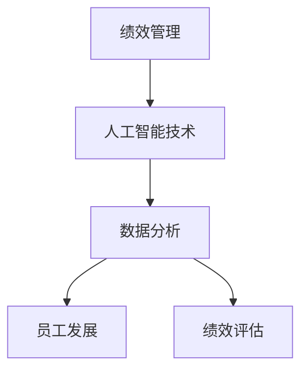

                 

**文章标题：智能企业绩效管理：AI辅助员工发展与评估**

**关键词：** 智能企业绩效管理，AI技术，员工发展，员工评估

**摘要：** 本文探讨了智能企业绩效管理的重要性，以及如何利用AI技术辅助员工发展和评估。文章首先介绍了智能企业绩效管理的基本概念和架构，然后详细阐述了AI技术在员工技能提升、绩效评估和人才选拔中的应用，最后通过案例研究分析了智能企业绩效管理的实施步骤和挑战。

## 第一部分：智能企业绩效管理基础

### 第1章：智能企业绩效管理概述

#### 1.1 智能企业绩效管理的定义与背景

**背景介绍：**
在当今的快速变化和竞争激烈的市场环境中，企业必须不断优化其运营模式，提高员工绩效，以保持竞争力。传统的绩效管理方法通常依赖于定期的评估和反馈，但这些方法往往缺乏实时性、个性化和客观性。随着人工智能（AI）技术的快速发展，智能企业绩效管理成为一种新的趋势，它利用AI技术提供更精确的绩效评估和个性化的员工发展方案。

**核心概念与联系：**
智能企业绩效管理涉及到多个核心概念，包括绩效管理、人工智能、数据分析等。这些概念之间的关系可以用Mermaid流程图表示：



**核心算法原理讲解：**
在智能企业绩效管理中，AI技术主要应用于数据分析、预测和决策支持。以下是一个简单的Python代码示例，用于计算员工的绩效得分：

```python
# 导入必要的库
import numpy as np

# 定义员工绩效评估模型
def performance_score(kpi_data, weight_factors):
    # 计算各个指标的得分
    scores = [kpi * weight for kpi, weight in zip(kpi_data, weight_factors)]
    # 计算总得分
    total_score = sum(scores)
    return total_score

# 示例数据
kpi_data = [85, 90, 75, 88]  # 四个指标的得分
weight_factors = [0.2, 0.25, 0.25, 0.3]  # 各个指标的权重

# 计算绩效得分
score = performance_score(kpi_data, weight_factors)
print(f"Employee Performance Score: {score}")
```

**数学模型和公式：**
绩效评估的数学模型通常涉及加权得分模型，其中各个绩效指标按照其重要性进行加权，以得出总绩效得分。公式如下：

$$
P = \sum_{i=1}^{n} (K_i \cdot W_i)
$$

其中，$P$ 是总绩效得分，$K_i$ 是第 $i$ 个绩效指标的得分，$W_i$ 是第 $i$ 个绩效指标的权重。

#### 1.2 智能企业绩效管理的目标

**提高员工绩效：**
智能企业绩效管理的首要目标是提高员工绩效。通过利用AI技术，企业可以实时监控员工的工作表现，提供个性化的反馈和改进建议，从而帮助员工提升工作效率和质量。

**优化企业绩效：**
除了关注员工绩效，智能企业绩效管理还致力于优化整个企业的运营绩效。通过分析员工的绩效数据，企业可以识别瓶颈和改进机会，从而制定更有效的战略决策。

**建立智能化绩效管理体系：**
智能企业绩效管理的最终目标是建立一套智能化、高效、客观的绩效管理体系。这种体系可以自动化地处理大量数据，提供精确的绩效评估，并为员工提供个性化的发展路径。

### 第2章：智能企业绩效管理架构

#### 2.1 智能化绩效管理系统的核心模块

**数据收集与整合模块：**
数据收集与整合是智能企业绩效管理的第一步。该模块负责收集来自不同源的数据，包括员工的工作表现、项目进展、客户反馈等，并进行整合和处理，以确保数据的准确性和一致性。

**绩效评估模块：**
绩效评估模块是智能企业绩效管理的核心。它利用AI技术对员工的工作表现进行量化评估，并根据评估结果提供反馈和建议。

**绩效反馈与改进模块：**
绩效反馈与改进模块负责将绩效评估结果传达给员工，并提供个性化的改进建议。这有助于员工了解自己的优势和不足，并制定相应的改进计划。

**绩效激励模块：**
绩效激励模块旨在通过奖励机制激励员工提升绩效。这可以包括奖金、晋升机会、培训等，以激励员工为企业做出更大贡献。

#### 2.2 智能化绩效管理的技术架构

**数据采集与存储技术：**
智能企业绩效管理依赖于高效的数据采集和存储技术。这包括使用数据库管理系统（如MySQL、MongoDB）来存储和处理大量数据。

**人工智能算法与应用：**
人工智能算法是智能企业绩效管理的核心技术。这包括机器学习算法、深度学习模型等，用于分析数据、预测员工绩效和提供个性化建议。

**大数据与云计算技术：**
大数据和云计算技术为智能企业绩效管理提供了强大的计算能力和数据存储能力。这有助于企业快速处理和分析大量数据，并确保数据的可靠性和安全性。

### 第3章：智能企业绩效管理数据准备

#### 3.1 数据收集与整理

**数据来源：**
智能企业绩效管理需要收集来自多个来源的数据，包括员工工作日志、项目报告、客户反馈等。

**数据收集方法：**
数据收集方法包括自动化数据采集工具、问卷调查、面试记录等。这些方法有助于确保数据的全面性和准确性。

**数据整理流程：**
数据整理流程包括数据清洗、数据归一化、数据转换等步骤。这些步骤有助于提高数据的质量和可用性。

#### 3.2 数据质量评估与处理

**数据质量评估标准：**
数据质量评估标准包括完整性、准确性、一致性、时效性等。

**数据清洗与预处理方法：**
数据清洗与预处理方法包括缺失值处理、异常值检测、数据归一化等。这些方法有助于提高数据的质量和可靠性。

**数据质量改进策略：**
数据质量改进策略包括数据质量监控、数据质量反馈机制等。这些策略有助于确保数据在收集、整理和处理过程中的质量。

## 第二部分：AI辅助员工发展

### 第4章：AI辅助员工技能提升

#### 4.1 AI在员工技能提升中的应用

**个性化学习推荐系统：**
个性化学习推荐系统可以根据员工的学习兴趣和职业需求，提供个性化的学习资源推荐。这有助于员工高效地提升专业技能。

**智能培训系统：**
智能培训系统利用AI技术自动生成培训内容，并根据员工的学习进度提供实时反馈和改进建议。这有助于提高培训效果。

**在线教育平台的AI应用：**
在线教育平台可以利用AI技术提供自动化的考试和评估，帮助学生及时了解自己的学习成果，并调整学习计划。

#### 4.2 AI在员工培训与职业规划中的应用

**培训需求分析：**
AI技术可以帮助企业分析员工的培训需求，根据员工的职业发展和企业战略制定个性化的培训计划。

**职业发展规划：**
AI技术可以分析员工的工作表现和职业兴趣，为员工提供职业发展规划建议，帮助他们实现职业目标。

**培训效果评估：**
AI技术可以实时评估员工的培训效果，为培训提供改进建议，确保培训目标的实现。

### 第5章：AI辅助员工评估

#### 5.1 AI在员工绩效评估中的应用

**多维度绩效评估模型：**
AI技术可以帮助企业建立多维度绩效评估模型，从多个角度评估员工的绩效，提供更全面的评估结果。

**绩效预测与分析：**
AI技术可以预测员工的绩效表现，分析员工的工作行为和绩效之间的关系，为企业提供战略决策支持。

**绩效反馈与改进：**
AI技术可以实时收集员工的绩效数据，提供个性化的反馈和改进建议，帮助员工提升绩效。

#### 5.2 AI在员工行为分析中的应用

**员工行为数据收集：**
AI技术可以自动化收集员工的工作行为数据，如工作时长、任务完成情况等。

**行为分析算法：**
AI技术可以分析员工的行为数据，识别员工的行为模式和工作习惯，为企业提供员工行为分析报告。

**行为分析与绩效关联：**
AI技术可以分析员工的行为数据与绩效之间的关系，为企业提供行为分析与绩效关联的分析结果。

## 第三部分：AI辅助员工选拔与留任

### 第6章：AI在员工选拔中的应用

#### 6.1 AI在人才选拔中的作用

**人才选拔的需求分析：**
AI技术可以帮助企业分析人才选拔的需求，确定招聘的标准和条件。

**AI在简历筛选中的应用：**
AI技术可以自动化筛选简历，根据候选人的技能、经验和背景匹配招聘要求。

**面试评估：**
AI技术可以分析面试过程中的行为和语言，为候选人提供评估报告。

#### 6.2 AI在员工留任管理中的应用

**员工满意度分析：**
AI技术可以分析员工的满意度数据，识别员工的不满意因素，为企业管理者提供改进建议。

**员工流失预测：**
AI技术可以预测员工的流失风险，帮助企业管理者采取预防措施。

**员工发展计划：**
AI技术可以分析员工的发展需求，为员工提供个性化的职业发展计划。

### 第7章：智能企业绩效管理的实施步骤

#### 7.1 智能企业绩效管理的实施策略

**策略制定：**
制定智能企业绩效管理的总体策略，明确目标和预期成果。

**组织架构调整：**
根据智能企业绩效管理的需求，调整组织架构，确保各部门的协同工作。

**技术选型与部署：**
选择合适的AI技术和工具，进行系统部署和集成。

#### 7.2 智能企业绩效管理的实施流程

**需求分析与规划：**
与各部门沟通，了解绩效管理的需求和目标，制定详细的实施计划。

**系统设计与开发：**
根据需求分析和规划，设计智能企业绩效管理系统的架构和功能模块。

**系统测试与优化：**
进行系统测试，确保系统的稳定性和可靠性，并根据测试结果进行优化。

**培训与推广：**
对员工进行智能企业绩效管理的培训和推广，确保系统的有效应用。

### 第8章：智能企业绩效管理的案例研究

#### 8.1 成功案例分析

**案例一：** 一家跨国公司通过实施智能企业绩效管理，提高了员工绩效和满意度，实现了业务目标。

**案例二：** 一家创业公司利用AI技术进行人才选拔和员工发展，快速提升了团队的整体竞争力。

#### 8.2 失败案例分析

**案例一：** 一家传统企业由于对AI技术的理解不足，导致智能企业绩效管理项目失败。

**案例二：** 一家初创公司由于技术选型不当，导致智能企业绩效管理系统性能不佳，影响了员工的使用体验。

### 第9章：智能企业绩效管理的发展趋势

#### 9.1 AI技术在企业绩效管理中的应用前景

**自动化与智能化：** AI技术将进一步提升企业绩效管理的自动化和智能化水平，提高管理效率。

**个性化与多样化：** AI技术将根据员工的不同需求，提供个性化的绩效管理方案，满足多样化的管理需求。

#### 9.2 智能企业绩效管理面临的挑战与机遇

**挑战：**
- 技术成熟度：AI技术尚未完全成熟，需要不断优化和升级。
- 数据安全与隐私：智能企业绩效管理需要大量员工数据，如何保护数据安全和隐私是重大挑战。
- 员工接受度：员工对AI技术的接受度和使用意愿可能影响智能企业绩效管理的效果。

**机遇：**
- 效率提升：AI技术可以大幅提高绩效管理的效率，降低管理成本。
- 精细化管理：AI技术可以帮助企业实现更精细化的管理，提高员工绩效。
- 智能决策支持：AI技术可以为企业管理者提供更准确的决策支持，优化企业战略。

**总结：**
智能企业绩效管理是未来企业发展的必然趋势。通过利用AI技术，企业可以实现更高效、更智能的绩效管理，提升员工绩效和企业竞争力。然而，企业在实施智能企业绩效管理时，需要充分准备，应对挑战，抓住机遇。

**作者：** AI天才研究院/AI Genius Institute & 禅与计算机程序设计艺术 /Zen And The Art of Computer Programming**END OF ARTICLE**

