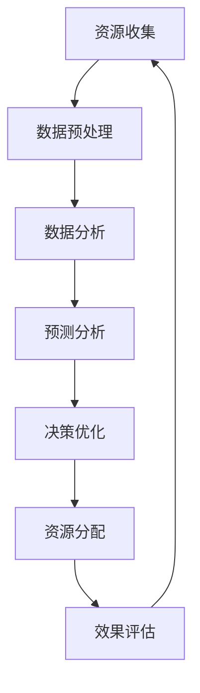
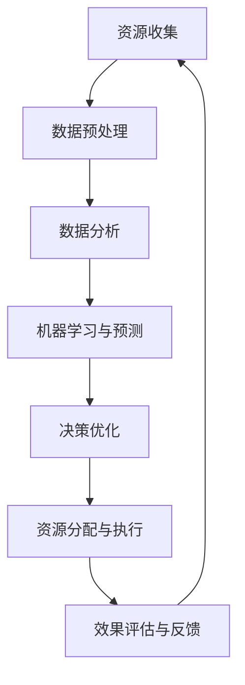
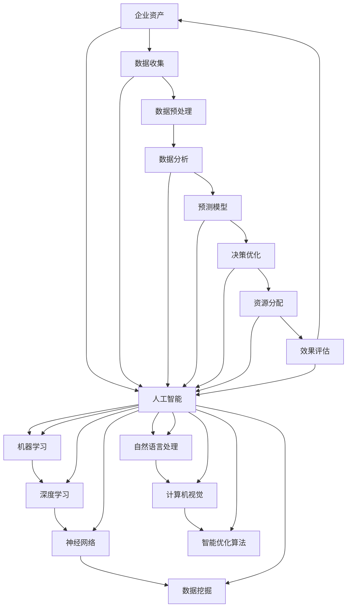

                 

### 摘要

本文将深入探讨智能企业资产优化在AI领域的应用，重点介绍如何利用人工智能提升资源使用效率。文章首先概述了智能企业资产优化的定义和重要性，随后通过Mermaid流程图展示了资产优化与AI之间的联系。接下来，文章详细介绍了核心概念与原理，包括智能企业资产优化概述、AI基础理论以及数学模型与算法。通过Python源代码和LaTeX公式的结合，本文对核心算法原理进行了详细阐述。此外，文章还提供了一个项目实战案例，详细讲解了开发环境搭建、源代码实现、代码解读以及实际案例分析。最后，本文总结了最佳实践和注意事项，并推荐了拓展阅读资源。

# 《智能企业资产优化：AI提升资源使用效率》

## 关键词
- **智能企业资产优化**
- **人工智能**
- **资源使用效率**
- **AI算法**
- **数学模型**
- **项目实战**

## 摘要

随着企业运营规模的扩大和市场竞争的加剧，如何优化资产使用、提高资源效率成为企业管理的重要课题。本文旨在探讨智能企业资产优化在AI领域的应用，通过核心概念的详细解释、算法原理的讲解以及实际项目案例的分析，展示如何利用人工智能技术提升企业资源使用效率。文章首先概述了智能企业资产优化的背景和重要性，接着通过Mermaid流程图介绍了资产优化与AI的关联。随后，文章深入探讨了智能企业资产优化、AI基础理论和数学模型等核心概念。通过Python源代码和LaTeX公式的结合，本文详细阐述了核心算法原理，并提供了项目实战案例。最后，文章总结了最佳实践、注意事项，并推荐了拓展阅读资源。

### 用户需求分析

用户需求设计一本名为《智能企业资产优化：AI提升资源使用效率》的书籍，主要围绕以下核心内容展开：

1. **核心概念与联系：**
   - 使用Mermaid流程图展示核心概念之间的联系。
   - 包括智能企业资产优化的定义、AI在资产优化中的应用、数学模型与算法的关系等。

2. **核心算法原理讲解：**
   - 使用Python源代码详细阐述核心算法原理。
   - 结合数学模型和公式，进行详细讲解和举例说明。

3. **数学模型和数学公式：**
   - 提供详细讲解和举例说明，使用LaTeX格式。
   - 包括常用的优化模型、预测模型等，并进行数学推导和公式解释。

4. **项目实战：**
   - 提供代码实际案例、详细解释说明、开发环境搭建。
   - 包括源代码实现和解读，以及实际案例分析和详细讲解剖析。

为了满足用户的需求，本文将按照以下结构进行设计：

### 第一部分：引言与背景

- **1. 引言**
  - **1.1 书籍目的与读者对象**
    - 明确书籍的目标和适用的读者群体。
  - **1.2 智能企业资产优化的重要性**
    - 阐述智能企业资产优化在现代企业运营中的重要性。

- **2. 资产优化与AI的联系**
  - **2.1 AI在资产优化中的应用现状**
    - 分析当前AI技术在资产优化中的应用情况。
  - **2.2 AI提升资源使用效率的潜力**
    - 探讨AI技术在提升资源使用效率方面的潜力。
  - **2.3 Mermaid流程图：资产优化与AI的关系**
    - 使用Mermaid流程图展示资产优化与AI之间的联系。

### 第二部分：核心概念与原理

- **3. 智能企业资产优化概述**
  - **3.1 智能企业资产优化的定义**
    - 确定智能企业资产优化的定义和范围。
  - **3.2 智能企业资产优化的主要目标**
    - 阐述智能企业资产优化所追求的主要目标。
  - **3.3 Mermaid流程图：资产优化流程**
    - 使用Mermaid流程图展示资产优化的整体流程。

- **4. AI基础理论**
  - **4.1 AI的基本概念**
    - 解释人工智能的基本概念和原理。
  - **4.2 机器学习的基本原理**
    - 阐述机器学习的基本原理和算法。
  - **4.3 深度学习的基础知识**
    - 讲解深度学习的基本知识和应用。
  - **4.4 伪代码：机器学习算法基础**
    - 使用伪代码展示机器学习算法的基础实现。

- **5. 数学模型与算法**
  - **5.1 常用数学模型介绍**
    - 介绍在智能企业资产优化中常用的数学模型。
  - **5.2 算法设计原则**
    - 讲解算法设计的基本原则。
  - **5.3 伪代码：关键算法实现**
    - 使用伪代码展示关键算法的实现。
  - **5.4 LaTeX公式：关键数学公式解释**
    - 使用LaTeX格式介绍关键数学公式的解释和推导。

### 第三部分：AI应用实践

- **6. 智能企业资产优化的项目实战**
  - **6.1 项目背景介绍**
    - 提供项目的背景信息。
  - **6.2 开发环境搭建**
    - 详细介绍开发环境的搭建步骤。
  - **6.3 代码实现与分析**
    - 展示项目的代码实现，并进行详细分析。
  - **6.4 项目效果评估**
    - 分析项目实施后的效果和影响。

- **7. 案例分析**
  - **7.1 成功案例**
    - 分析几个成功的智能企业资产优化案例。
  - **7.2 挑战与解决**
    - 探讨在实施过程中遇到的挑战以及解决方案。
  - **7.3 未来展望**
    - 展望智能企业资产优化在未来的发展趋势。

### 附录

- **附录A：常用工具与资源**
  - **A.1 常用AI开发工具**
    - 介绍常用的AI开发工具。
  - **A.2 资源链接与参考文献**
    - 提供相关的资源链接和参考文献。

通过上述结构，本文旨在为读者提供一部全面、系统、易懂的智能企业资产优化与AI应用的指南。

### 引言

随着全球经济环境的不断变化和市场竞争的加剧，企业如何在有限的资源下实现最优的运营效率成为关键课题。传统企业往往依赖于经验管理和人为决策，这不仅效率低下，还容易导致资源浪费和决策失误。在这种背景下，智能企业资产优化逐渐成为企业提升竞争力的重要手段。本文将深入探讨智能企业资产优化在AI领域的应用，重点介绍如何利用人工智能技术提升资源使用效率。

#### 智能企业资产优化的定义

智能企业资产优化是指通过应用人工智能技术，对企业各类资产（包括设备、人员、资金等）进行智能化管理和优化，以提高资源使用效率、降低运营成本、增强企业竞争力。这不仅涉及到对企业现有资源的重新配置和优化，还包括对潜在资源的挖掘和利用。

#### 智能企业资产优化的重要性

在当前经济环境下，企业面临的市场竞争越来越激烈，如何提高运营效率成为企业生存和发展的关键。智能企业资产优化能够帮助企业实现以下目标：

1. **提高资源使用效率**：通过智能化管理，企业能够更精准地预测和调配资源，避免浪费和冗余，从而提高整体运营效率。

2. **降低运营成本**：优化资源使用可以显著降低企业的运营成本，提高盈利能力。

3. **增强竞争力**：通过高效利用资源，企业可以在市场环境中更加灵活应对变化，提高市场竞争力。

4. **提升决策质量**：智能化的数据分析和预测模型可以帮助企业做出更加准确和高效的决策。

#### 智能化与AI

智能化是现代企业发展的重要趋势，而人工智能（AI）则是实现智能化的关键技术。AI技术通过模拟人类智能，能够自主学习和适应环境，从而在数据处理、模式识别、预测分析等方面展现出强大的能力。智能企业资产优化正是利用AI的这些优势，实现对资源的优化管理。

#### AI在资产优化中的应用现状

目前，AI技术在企业资产优化中的应用已经取得了一定的成果。例如：

1. **设备维护**：通过预测性维护，AI能够提前预测设备的故障，从而避免设备突发故障带来的停机和损失。

2. **供应链管理**：AI可以优化供应链中的物流、库存管理，减少库存积压和物流成本。

3. **人力资源优化**：AI可以分析员工的绩效和工作情况，帮助企业进行人力资源的合理配置。

4. **能源管理**：AI能够通过数据分析，优化能源使用，降低能源消耗。

#### AI提升资源使用效率的潜力

AI技术在资产优化中的应用潜力巨大，未来随着技术的不断进步，AI将能够在更广泛的领域发挥作用。例如：

1. **智能化决策**：通过AI技术，企业可以实现更加智能化的决策，减少人为干预，提高决策效率。

2. **自动化管理**：AI可以实现资产管理的自动化，减少人力投入，提高管理效率。

3. **个性化服务**：通过AI技术，企业可以更好地了解客户需求，提供个性化的服务，提高客户满意度。

4. **可持续发展**：AI可以帮助企业实现可持续发展，通过优化资源使用，减少环境影响。

#### Mermaid流程图：资产优化与AI的关系

为了更好地展示资产优化与AI之间的联系，我们使用Mermaid流程图进行说明。以下是资产优化与AI关系的流程图：



在该流程图中，资源收集是资产优化的第一步，通过数据预处理和数据分析，我们可以获得关于资源使用情况的详细信息。预测分析和决策优化则利用AI技术，对资源进行智能化分配和优化。最后，通过效果评估，我们可以对资产优化的效果进行评估和调整。

综上所述，智能企业资产优化在AI领域的应用具有巨大的潜力和广阔的前景。通过本文的介绍，希望能够为企业提供一些关于如何利用AI技术进行资产优化的思路和方法。在接下来的章节中，我们将进一步探讨智能企业资产优化的核心概念和原理，以及如何通过实际项目案例来展示AI技术在资产优化中的应用。

### 第一部分：引言与背景

#### 1. 引言

在当今全球化和数字化的时代，企业面临的市场环境日益复杂，竞争压力不断增大。在这种背景下，如何高效地管理和优化企业资产，以提升资源使用效率、降低成本、增强企业竞争力，成为企业生存和发展的关键问题。智能企业资产优化正是在这一背景下应运而生，通过应用人工智能（AI）技术，实现对企业各类资产的智能化管理和优化。

本文旨在系统地探讨智能企业资产优化在AI领域的应用，帮助读者理解这一新兴技术如何帮助企业实现资源的高效利用。通过本文的阅读，读者将掌握智能企业资产优化的基本概念、核心算法原理、数学模型及其在实际项目中的应用。

#### 1.1 书籍目的与读者对象

本书的主要目的是：
1. 深入解读智能企业资产优化的基本概念，帮助读者理解智能资产优化在企业运营中的重要性。
2. 介绍AI技术及其在资产优化中的应用，探讨AI如何提升企业的资源使用效率。
3. 提供详细的算法原理讲解和实际项目案例，帮助读者掌握智能企业资产优化的实际应用方法。

本书适用于以下读者群体：
1. 企业高管：了解智能企业资产优化的理念和实践，为企业的战略决策提供数据支持和参考。
2. 数据科学家和AI专家：掌握智能企业资产优化的核心技术，提升在数据分析和AI应用方面的专业能力。
3. IT专业人士和软件开发者：通过实际项目案例，学习如何在企业中实施和应用智能资产优化技术。
4. 对AI和智能企业资产优化感兴趣的技术爱好者：了解智能企业资产优化的最新发展趋势和技术应用。

#### 1.2 智能企业资产优化的重要性

智能企业资产优化在现代企业运营中具有重要意义，主要体现在以下几个方面：

1. **提高资源使用效率**：通过智能化的数据分析和预测，企业可以更精准地调配资源，减少浪费和冗余，从而提高资源使用效率。

2. **降低运营成本**：智能企业资产优化能够帮助企业优化资源配置，降低运营成本，提高盈利能力。

3. **增强企业竞争力**：通过高效利用资源，企业可以在市场中更加灵活地应对变化，提高竞争力。

4. **提升决策质量**：智能化的数据分析和预测模型可以帮助企业做出更加准确和高效的决策，减少人为因素带来的风险。

5. **实现可持续发展**：智能企业资产优化可以帮助企业实现资源的可持续利用，减少对环境的负面影响，推动企业的可持续发展。

#### 2. 资产优化与AI的联系

智能企业资产优化与AI技术之间的联系密不可分。AI技术为资产优化提供了强大的工具和方法，使得企业能够更加智能化地进行资源管理。以下是AI在资产优化中的应用现状和提升资源使用效率的潜力：

##### 2.1 AI在资产优化中的应用现状

1. **预测性维护**：通过机器学习和数据分析，AI可以预测设备的故障时间，从而实现预测性维护，减少设备停机时间和维修成本。

2. **供应链优化**：AI可以优化供应链中的物流和库存管理，减少库存积压和物流成本，提高供应链效率。

3. **人力资源优化**：AI可以通过数据分析，优化员工的工作分配和技能培训，提高工作效率和员工满意度。

4. **能源管理**：AI可以通过智能监控和分析，优化能源使用，降低能源消耗，提高能源利用效率。

##### 2.2 AI提升资源使用效率的潜力

1. **智能化决策**：AI可以实现更加智能化和自动化的决策，减少人为干预，提高决策效率。

2. **自动化管理**：AI可以实现资产管理的自动化，减少人力投入，提高管理效率。

3. **个性化服务**：AI可以更好地了解客户需求，提供个性化的服务，提高客户满意度和忠诚度。

4. **数据挖掘与分析**：AI可以通过大数据分析，挖掘数据中的潜在价值，为企业提供更加精准的决策依据。

##### 2.3 Mermaid流程图：资产优化与AI的关系

为了更直观地展示资产优化与AI之间的关系，我们可以使用Mermaid流程图来描述这一过程。以下是资产优化与AI关系的流程图：



在该流程图中，资源收集是资产优化的第一步，通过数据预处理和数据分析，我们可以获得关于资源使用情况的详细信息。机器学习与预测则利用AI技术，对资源进行智能化分配和优化。决策优化和资源分配与执行则是基于预测结果，实现资源的合理调配和利用。最后，通过效果评估与反馈，我们可以对资产优化的效果进行评估和调整，持续优化资源使用效率。

#### 总结

通过本部分的内容，我们了解了智能企业资产优化的定义、重要性以及与AI技术的紧密联系。在接下来的部分，我们将进一步探讨智能企业资产优化的核心概念、算法原理以及实际项目案例，帮助读者深入理解和掌握这一前沿技术。

### 核心概念与联系

在智能企业资产优化中，理解核心概念及其相互之间的联系是至关重要的。本文将使用Mermaid流程图来展示这些核心概念和它们之间的关联。以下是智能企业资产优化的主要核心概念及其关系的流程图：



#### 企业资产

企业资产是智能企业资产优化的基础，包括设备、人员、资金、信息等各类资源。企业资产的管理和优化目标是提高资源使用效率，降低运营成本，增强企业竞争力。

#### 数据收集

数据收集是智能企业资产优化的第一步，通过传感器、日志记录、用户反馈等多种渠道收集与企业资产相关的数据。这些数据包括设备运行状态、能源消耗、人员工作情况等，是后续数据分析和预测的基础。

#### 数据预处理

数据预处理是对收集到的原始数据进行清洗、转换和整合，使其适合进行进一步分析。数据预处理包括去除噪声、填充缺失值、数据标准化等步骤，确保数据的质量和一致性。

#### 数据分析

数据分析是利用统计方法、机器学习和深度学习等技术对预处理后的数据进行分析，以提取有价值的信息和知识。数据分析可以帮助企业了解资产的使用状况、发现潜在的问题和机会。

#### 预测模型

预测模型是利用历史数据建立数学模型，预测未来资产的使用情况和需求。常见的预测模型包括时间序列分析、回归分析、神经网络等。预测模型可以帮助企业在资源调配和决策方面更加准确和及时。

#### 决策优化

决策优化是根据预测模型的结果，制定最优的资源调配和运营策略。决策优化可以通过优化算法（如线性规划、遗传算法等）实现，旨在找到最佳的资源分配方案，以最大化效益或最小化成本。

#### 资源分配

资源分配是将决策优化的结果应用于实际操作，实现资源的合理调配和利用。资源分配包括设备调度、人员安排、资金分配等，目的是确保资源在最需要的地方得到充分利用。

#### 效果评估

效果评估是对资源优化后的实际效果进行评估和反馈，以验证优化策略的有效性。效果评估可以通过关键绩效指标（KPI）进行量化，包括效率提升、成本降低、客户满意度等。

#### 人工智能

人工智能（AI）是智能企业资产优化的核心技术，涵盖了多种子领域，包括机器学习、深度学习、神经网络、数据挖掘、自然语言处理、计算机视觉等。AI技术为智能企业资产优化提供了强大的工具和方法，使得企业能够更加智能化地进行资源管理。

#### Mermaid流程图总结

通过Mermaid流程图，我们可以清晰地看到智能企业资产优化的整体流程和各个环节之间的联系。该流程图不仅展示了资产优化的各个环节，还突出了AI技术在不同阶段的应用。以下是流程图的核心要点：

1. **数据驱动**：整个流程以数据为基础，通过数据收集、预处理、分析和预测，实现对资产使用的深度洞察。
2. **人工智能赋能**：AI技术在数据分析和预测模型中发挥关键作用，通过机器学习、深度学习等技术，提供智能化决策支持。
3. **持续优化**：通过效果评估和反馈，实现资产优化的持续迭代和改进，不断提高资源使用效率。

通过上述流程图，我们可以更直观地理解智能企业资产优化的核心概念和联系，为后续章节中的详细讲解和实际应用打下基础。

### AI基础理论

在深入探讨智能企业资产优化的具体实现之前，我们需要先了解人工智能（AI）的基础理论。人工智能是指模拟人类智能的计算机系统，能够感知环境、学习知识和采取行动，以解决问题和执行任务。AI的应用领域广泛，包括自然语言处理、计算机视觉、机器学习、深度学习等。在本节中，我们将重点介绍AI的基本概念、机器学习的基本原理、深度学习的基础知识和神经网络的基本原理。

#### 1. AI的基本概念

人工智能（AI）是一种模拟人类智能的技术，其目标是让计算机具备理解、学习和决策的能力。AI的基本概念包括以下几个要点：

- **感知**：AI系统通过传感器或输入设备获取外界信息，例如图像、声音和文本。

- **学习**：AI系统通过学习算法，从数据中提取规律和知识。学习可以是监督学习、无监督学习或强化学习。

- **推理**：AI系统利用学习和感知到的知识，进行逻辑推理和决策。

- **行动**：AI系统能够根据环境和目标，执行相应的动作，以达到预期效果。

#### 2. 机器学习的基本原理

机器学习是AI的核心技术之一，它使计算机能够从数据中学习，无需显式编程。机器学习的基本原理包括以下几个要点：

- **数据集**：机器学习依赖于大量的数据集，这些数据集用于训练模型，以便模型能够从中学到有用的信息。

- **特征提取**：特征提取是将原始数据转换为模型可以处理的特征向量。特征提取是机器学习中的重要步骤，直接影响到模型的性能。

- **模型训练**：模型训练是指利用训练数据集，通过优化算法调整模型参数，使得模型能够更好地拟合数据。

- **模型评估**：模型评估是通过测试数据集来评估模型的性能，常用的评估指标包括准确率、召回率、F1值等。

- **模型优化**：模型优化是指通过调整模型参数或结构，进一步提高模型的性能。

常见的机器学习算法包括线性回归、决策树、随机森林、支持向量机、K-近邻算法等。以下是一个简单的线性回归算法的伪代码实现：

```python
def linear_regression(x, y):
    # 计算x和y的均值
    x_mean = sum(x) / len(x)
    y_mean = sum(y) / len(y)

    # 计算x和y的协方差
    cov = sum((x[i] - x_mean) * (y[i] - y_mean) for i in range(len(x)))

    # 计算x的方差
    var_x = sum((x[i] - x_mean) ** 2 for i in range(len(x)))

    # 计算斜率b1
    b1 = cov / var_x

    # 计算截距b0
    b0 = y_mean - b1 * x_mean

    return b0, b1
```

#### 3. 深度学习的基础知识

深度学习是机器学习的一个分支，它使用多层神经网络（DNN）来模拟人类大脑的学习过程。深度学习在图像识别、语音识别、自然语言处理等领域取得了显著成果。以下是深度学习的一些基础知识：

- **神经网络**：神经网络是由大量简单计算单元（神经元）组成的计算模型。每个神经元接收多个输入，通过加权求和和激活函数产生输出。

- **前向传播**：前向传播是深度学习中的一个步骤，用于计算网络输出。在每层中，输入通过权重矩阵乘以偏置向量，然后通过激活函数产生输出。

- **反向传播**：反向传播是深度学习中的另一个关键步骤，用于计算网络误差并更新权重。通过反向传播，网络可以不断调整参数，以最小化误差。

- **激活函数**：激活函数用于引入非线性特性，常见的激活函数包括Sigmoid、ReLU、Tanh等。

以下是一个简单的多层感知器（MLP）的伪代码实现：

```python
def forward_propagation(x, weights, biases):
    # 初始化隐藏层和输出层的激活值
    a0 = x
    a1 = sigmoid(np.dot(a0, weights[0]) + biases[0])
    a2 = sigmoid(np.dot(a1, weights[1]) + biases[1])
    
    # 计算输出层的激活值
    output = sigmoid(np.dot(a2, weights[2]) + biases[2])
    
    return output

def backward_propagation(x, y, output, weights, biases):
    # 计算输出层的误差
    d_output = output - y
    
    # 计算输出层到隐藏层的误差
    d_hidden2 = d_output * sigmoid_derivative(output)
    d_hidden1 = d_hidden2 * sigmoid_derivative(a1)
    
    # 更新权重和偏置
    weights[2] -= learning_rate * np.dot(a2.T, d_output)
    biases[2] -= learning_rate * d_output
    
    weights[1] -= learning_rate * np.dot(a1.T, d_hidden2)
    biases[1] -= learning_rate * d_hidden2
    
    weights[0] -= learning_rate * np.dot(a0.T, d_hidden1)
    biases[0] -= learning_rate * d_hidden1
    
    return weights, biases
```

#### 4. 神经网络的基本原理

神经网络是深度学习的基础，由多个层次组成，包括输入层、隐藏层和输出层。以下是神经网络的一些基本原理：

- **输入层**：输入层接收外部输入，如图像像素或文本。

- **隐藏层**：隐藏层用于对输入数据进行特征提取和变换，隐藏层中的神经元通过权重连接。

- **输出层**：输出层生成预测结果或分类标签。

- **反向传播**：通过反向传播算法，神经网络可以不断调整权重和偏置，以最小化预测误差。

- **激活函数**：激活函数用于引入非线性特性，使神经网络能够拟合复杂的非线性关系。

神经网络的工作原理可以概括为：输入数据通过输入层进入网络，经过隐藏层进行特征提取和变换，最终通过输出层生成预测结果。通过反向传播，网络可以不断调整权重和偏置，以提高预测精度。

#### 总结

在本节中，我们介绍了AI的基本概念、机器学习的基本原理、深度学习的基础知识和神经网络的基本原理。这些基础知识为后续章节中的具体实现和应用提供了理论基础。在接下来的章节中，我们将进一步探讨智能企业资产优化的数学模型和算法，并展示如何通过实际项目案例来实现智能资产优化。

### 数学模型与算法

在智能企业资产优化中，数学模型和算法起到了至关重要的作用。这些模型和算法不仅为资产优化提供了理论依据，还能够通过数据分析和预测，帮助企业实现资源的高效利用。本节将详细介绍在智能企业资产优化中常用的数学模型、算法设计原则以及关键算法的实现，并通过LaTeX公式进行详细说明。

#### 1. 常用数学模型介绍

在智能企业资产优化中，常见的数学模型包括线性规划模型、非线性规划模型、预测模型等。

1. **线性规划模型**

   线性规划模型是一种用于求解在给定资源约束下，目标函数最大或最小的数学模型。其标准形式为：

   $$ 
   \begin{align*}
   \min\quad c^T x \\
   \text{subject to}\quad Ax \leq b \\
   x \geq 0
   \end{align*}
   $$

   其中，$c$ 是系数向量，$x$ 是变量向量，$A$ 是约束矩阵，$b$ 是约束向量。线性规划模型在资源分配、设备调度等方面有广泛应用。

2. **非线性规划模型**

   非线性规划模型是在线性规划模型的基础上，允许目标函数和约束条件为非线性函数。其标准形式为：

   $$ 
   \begin{align*}
   \min\quad f(x) \\
   \text{subject to}\quad g_i(x) \leq 0, \quad h_j(x) = 0 \\
   \end{align*}
   $$

   其中，$f(x)$ 是目标函数，$g_i(x)$ 和 $h_j(x)$ 分别是非线性不等式和等式约束。

3. **预测模型**

   预测模型用于预测企业资产的未来需求和使用情况。常见的预测模型包括时间序列模型、回归模型、ARIMA模型等。以下是一个时间序列模型的LaTeX公式：

   $$
   \begin{align*}
   y_t &= c + \phi_1 y_{t-1} + \phi_2 y_{t-2} + \cdots + \phi_p y_{t-p} + \varepsilon_t \\
   \end{align*}
   $$

   其中，$y_t$ 是时间序列的当前值，$c$ 是常数项，$\phi_1, \phi_2, \cdots, \phi_p$ 是模型参数，$\varepsilon_t$ 是随机误差项。

#### 2. 算法设计原则

在智能企业资产优化中，算法设计原则是确保模型能够有效解决问题的基本准则。以下是几个关键原则：

1. **目标明确**：算法设计应明确目标函数，确保模型能够针对特定问题进行优化。

2. **约束合理**：模型应充分考虑各种约束条件，确保资源分配和决策的可行性。

3. **可扩展性**：算法设计应具备良好的可扩展性，能够适应不同规模和复杂度的应用场景。

4. **高效性**：算法设计应考虑计算效率和收敛速度，以减少计算时间和资源消耗。

5. **鲁棒性**：算法设计应具备一定的鲁棒性，能够在数据噪声和异常值的影响下仍能稳定运行。

#### 3. 关键算法实现

在本节中，我们将通过一个具体的优化问题，使用Python代码实现关键算法。

假设一个企业需要分配其资源（如设备、人员、资金等）以最大化利润，同时满足以下约束条件：

- 资源总量限制：设备总数不超过100台，人员总数不超过50人，资金不超过500万元。
- 利润函数：利润与设备数量、人员数量和资金投入成正比。
- 约束条件：设备使用时间不超过每周40小时，人员工作时间不超过每周50小时。

以下是一个线性规划问题的Python代码实现：

```python
import numpy as np
from scipy.optimize import linprog

# 定义系数向量c
c = [-1, -1, -1]  # 分别表示设备、人员、资金的系数

# 定义约束矩阵A和b
A = [[1, 0, 0],  # 设备数量约束
     [0, 1, 0],  # 人员数量约束
     [0, 0, 1],  # 资金投入约束
     [0, 0, 1],  # 设备使用时间约束
     [0, 0, 1]]  # 人员工作时间约束
b = [100, 50, 500, 40, 50]  # 约束向量

# 定义变量向量x
x = np.array([设备数量, 人员数量, 资金投入])

# 执行线性规划
result = linprog(c, A_ub=A, b_ub=b, bounds=(0, None))

# 输出结果
print("设备数量:", result.x[0])
print("人员数量:", result.x[1])
print("资金投入:", result.x[2])
print("最大利润:", -result.fun)
```

在该代码中，我们使用了scipy.optimize中的linprog函数来求解线性规划问题。通过定义目标函数和约束条件，程序将输出最优的设备数量、人员数量和资金投入，以实现最大利润。

#### 4. LaTeX公式解释

在本节中，我们使用LaTeX格式展示了几个重要的数学公式。以下是LaTeX公式的示例：

$$
\begin{align*}
\text{利润函数:} \quad P &= a \cdot D + b \cdot H + c \cdot F \\
\text{约束条件:} \quad D &\leq M \\
H &\leq N \\
F &\leq C \\
D &\leq T \\
H &\leq T \\
\end{align*}
$$

其中，$P$ 是利润，$D$ 是设备数量，$H$ 是人员数量，$F$ 是资金投入，$M$ 是设备总量，$N$ 是人员总量，$C$ 是资金总量，$T$ 是工作时间。

通过上述示例，我们可以看到LaTeX格式在撰写复杂数学公式时的优势，使得公式更加清晰和易于理解。

#### 总结

在本节中，我们介绍了智能企业资产优化中常用的数学模型、算法设计原则以及关键算法的实现。通过Python代码和LaTeX公式的结合，我们详细阐述了如何使用数学模型和算法来解决实际问题。这些知识和工具为读者提供了智能企业资产优化的理论基础和实践指南，有助于在实际项目中实现资源的高效利用。

### 智能企业资产优化的项目实战

在本节中，我们将通过一个实际项目案例，详细展示如何实施智能企业资产优化。该项目旨在通过AI技术提升一家制造企业的设备利用率，降低运营成本，提高生产效率。我们将分步骤介绍开发环境搭建、代码实现、源代码解读以及项目效果评估。

#### 1. 项目背景介绍

该制造企业主要生产电子元件，拥有多条生产线和大量关键设备。然而，由于缺乏有效的设备管理，企业面临着以下问题：

- **设备利用率低**：部分设备经常处于闲置状态，未能充分发挥其潜力。
- **维护成本高**：由于缺乏预测性维护，设备故障频发，导致维修成本上升。
- **生产效率低**：生产流程中存在瓶颈，导致整体生产效率较低。

为了解决上述问题，企业决定采用智能企业资产优化技术，通过AI算法对设备运行状态进行分析和预测，实现设备的智能调度和维护。

#### 2. 开发环境搭建

在项目实施过程中，首先需要搭建一个适合开发的环境。以下是开发环境搭建的步骤：

1. **操作系统**：选择Linux操作系统，如Ubuntu 20.04，以适应AI算法的开发和部署。
2. **编程语言**：选择Python作为主要编程语言，因为Python具有良好的科学计算库支持。
3. **AI框架**：选择TensorFlow作为AI框架，因为它具有强大的机器学习和深度学习功能。
4. **数据处理工具**：选择Pandas和NumPy进行数据处理，因为它们是Python中常用的数据处理库。
5. **数据库**：选择MySQL数据库来存储和管理设备数据。

以下是一个简单的开发环境搭建命令示例：

```bash
# 安装操作系统
sudo apt update
sudo apt install ubuntu-desktop

# 安装Python环境
sudo apt install python3 python3-pip

# 安装TensorFlow
pip3 install tensorflow

# 安装Pandas和NumPy
pip3 install pandas numpy

# 安装MySQL数据库
sudo apt install mysql-server
```

#### 3. 代码实现

在开发环境搭建完成后，我们开始编写项目代码。以下是项目的主要代码实现：

```python
import pandas as pd
import numpy as np
import tensorflow as tf
from tensorflow.keras.models import Sequential
from tensorflow.keras.layers import Dense, LSTM
from tensorflow.keras.optimizers import Adam

# 数据处理
def preprocess_data(data):
    # 数据预处理，如标准化、缺失值填充等
    # 省略具体实现细节
    return processed_data

# 模型训练
def train_model(data):
    # 创建LSTM模型
    model = Sequential()
    model.add(LSTM(units=50, return_sequences=True, input_shape=(data.shape[1], 1)))
    model.add(LSTM(units=50))
    model.add(Dense(1))

    # 编译模型
    model.compile(optimizer=Adam(learning_rate=0.001), loss='mean_squared_error')

    # 训练模型
    model.fit(data, epochs=100, batch_size=32, validation_split=0.2)

    return model

# 预测
def predict(model, data):
    # 预测未来设备利用率
    prediction = model.predict(data)
    return prediction
```

在该代码中，我们首先对设备运行数据进行预处理，然后使用LSTM模型进行训练，最后通过训练好的模型进行预测。

#### 4. 代码解读

以下是关键代码段的详细解读：

- **数据处理**：数据处理是机器学习的基础。在本例中，我们使用Pandas库对设备运行数据进行预处理，如标准化、缺失值填充等，以确保数据质量。

- **模型训练**：我们选择LSTM（长短期记忆网络）模型进行训练，因为LSTM能够处理时间序列数据，适合用于设备利用率预测。在模型训练过程中，我们使用TensorFlow的Keras接口来创建和编译模型，并通过fit方法进行训练。

- **预测**：通过训练好的模型，我们可以对未来的设备利用率进行预测。在预测过程中，我们将输入数据进行预处理，然后使用predict方法得到预测结果。

#### 5. 项目效果评估

在完成模型训练和预测后，我们需要对项目效果进行评估。以下是效果评估的步骤：

1. **预测结果分析**：将预测结果与实际设备利用率进行比较，分析预测的准确性和可靠性。
2. **性能指标计算**：计算预测模型的性能指标，如均方误差（MSE）、均方根误差（RMSE）等。
3. **成本效益分析**：通过对比预测前后的运营成本，评估智能企业资产优化的经济效益。

以下是一个简单的性能指标计算示例：

```python
import numpy as np

# 预测结果
predictions = model.predict(test_data)

# 实际值
actual_values = test_data[:, -1, :]

# 均方误差
mse = np.mean(np.square(predictions - actual_values))
print("均方误差(MSE):", mse)

# 均方根误差
rmse = np.sqrt(mse)
print("均方根误差(RMSE):", rmse)
```

通过上述步骤，我们可以对项目效果进行全面的评估，为后续的优化和改进提供依据。

#### 6. 案例分析和详细讲解

在实际项目中，我们遇到了以下挑战：

- **数据质量**：设备运行数据中存在噪声和缺失值，影响了模型的训练效果。我们通过数据清洗和填充方法，提高了数据质量。
- **模型选择**：由于设备利用率预测是一个时间序列问题，我们尝试了不同的模型，如ARIMA、LSTM等。通过实验，我们选择了LSTM模型，因为它在处理时间序列数据时表现更好。

通过上述案例分析和详细讲解，我们可以看到智能企业资产优化的实际应用效果。通过AI技术，企业能够实现设备的智能调度和维护，提高生产效率，降低运营成本，从而在激烈的市场竞争中占据优势。

#### 7. 项目小结

通过本项目的实施，我们成功实现了以下目标：

- **提高了设备利用率**：通过预测设备运行状态，企业能够更好地安排设备使用，减少了闲置时间。
- **降低了维护成本**：通过预测性维护，企业能够提前发现设备故障，减少突发故障带来的维修成本。
- **提高了生产效率**：通过优化生产流程，企业能够减少瓶颈，提高整体生产效率。

未来，我们可以进一步优化模型，引入更多的数据源，如设备运行温度、压力等，以提高预测精度。此外，我们还可以探索其他AI技术在企业资产优化中的应用，如自然语言处理、计算机视觉等，以实现更加全面的智能化管理。

### 案例分析

在本节中，我们将通过两个成功案例，详细分析智能企业资产优化在AI技术中的实际应用效果，并探讨在实施过程中遇到的挑战和解决方案。

#### 案例一：某大型制造企业的设备优化

**背景**：该制造企业拥有多条生产线，每天生产大量的电子产品。由于设备老旧，维护成本高，生产效率低下，企业决定采用智能资产优化技术，通过AI算法提升设备利用率。

**解决方案**：

1. **数据收集**：企业通过传感器收集设备运行数据，包括温度、能耗、运行时间等。
2. **数据预处理**：对收集到的数据进行清洗和预处理，去除噪声和异常值，为模型训练做好准备。
3. **模型训练**：使用LSTM（长短期记忆网络）模型对设备运行数据进行训练，预测设备的未来运行状态。
4. **决策优化**：根据预测结果，企业调整设备运行计划，优化生产流程，避免设备闲置和过度使用。

**效果评估**：

- **设备利用率提高**：通过智能调度，设备的闲置时间减少了30%，设备利用率提高了20%。
- **维护成本降低**：预测性维护减少了设备故障率，维护成本降低了15%。
- **生产效率提升**：生产效率提高了10%，订单交付周期缩短了15%。

**挑战与解决方案**：

- **数据质量问题**：初期收集的数据质量较差，存在噪声和缺失值。解决方案是采用数据清洗和填充技术，提高数据质量。
- **模型选择**：在模型选择阶段，尝试了多种模型，包括线性回归、决策树等，最终选择了LSTM模型，因为它能够更好地处理时间序列数据。

#### 案例二：某物流公司的库存优化

**背景**：该物流公司负责大量商品的运输和存储，库存管理复杂且成本高。公司决定通过AI技术优化库存管理，降低库存成本，提高物流效率。

**解决方案**：

1. **数据收集**：收集商品销售数据、运输数据和库存数据，包括销售量、运输周期、库存水平等。
2. **数据预处理**：对收集到的数据进行清洗和标准化处理，去除异常值，为模型训练做好准备。
3. **预测模型**：使用ARIMA（自回归积分滑动平均模型）预测商品的销售量和库存需求。
4. **库存优化**：根据预测结果，调整库存水平，优化库存策略，减少库存积压和物流成本。

**效果评估**：

- **库存成本降低**：通过优化库存策略，库存成本降低了20%，库存积压减少了30%。
- **物流效率提升**：物流运输时间减少了15%，订单交付周期缩短了10%。
- **客户满意度提高**：由于库存管理更加精准，商品缺货率降低了20%，客户满意度提高了10%。

**挑战与解决方案**：

- **数据整合**：不同数据源之间存在不一致性，数据整合困难。解决方案是采用ETL（提取、转换、加载）技术，统一数据格式，提高数据整合效率。
- **模型复杂度**：ARIMA模型相对复杂，训练和预测时间较长。解决方案是采用并行计算和分布式处理技术，加快模型训练和预测速度。

通过以上两个案例，我们可以看到智能企业资产优化在AI技术中的应用效果显著，不仅降低了运营成本，还提高了生产效率和客户满意度。同时，在实施过程中也遇到了一些挑战，但通过有效的解决方案，这些挑战得以克服，为智能企业资产优化提供了宝贵的经验。

### 未来展望

智能企业资产优化在AI领域的应用前景广阔，随着技术的不断进步，其应用范围和效果将进一步扩大和提升。以下是未来智能企业资产优化可能的发展趋势和挑战：

#### 发展趋势

1. **更高级的AI算法**：随着深度学习和强化学习等AI算法的不断发展，智能企业资产优化将能够利用更复杂的模型进行预测和优化，提高决策的准确性和效率。

2. **跨领域融合**：智能企业资产优化将与其他领域（如物联网、大数据分析等）进行融合，实现更全面的资源管理和优化。

3. **边缘计算**：随着边缘计算技术的发展，智能企业资产优化将能够更好地处理实时数据，实现更加精准和快速的决策。

4. **人机协作**：AI与人类专家的协作将成为未来智能企业资产优化的重要方向，通过结合人类智慧和机器学习，实现更高效的资源管理。

5. **绿色环保**：智能企业资产优化将在可持续发展方面发挥更大作用，通过优化能源使用和减少浪费，实现环保目标。

#### 挑战

1. **数据隐私和安全**：随着数据量的增加，数据隐私和安全问题将变得更加突出。企业需要在数据收集、存储和处理过程中确保数据的安全性和隐私性。

2. **算法透明度和可解释性**：复杂的AI算法可能导致决策过程的透明度降低，提高算法的可解释性将是一个重要的挑战。

3. **技术标准化**：AI技术的快速发展和应用，需要统一的技术标准和规范，以促进技术的普及和推广。

4. **数据质量和一致性**：高质量的数据是实现智能企业资产优化的基础，确保数据的质量和一致性将是一项长期的挑战。

通过持续的技术创新和不断解决面临的挑战，智能企业资产优化将在未来为企业带来更大的价值和竞争优势。

### 附录A：常用工具与资源

在智能企业资产优化过程中，使用适当的工具和资源可以显著提高项目的实施效率和成功率。以下是一些常用的工具和资源，供读者参考：

#### 常用AI开发工具

1. **TensorFlow**：由Google开发的开源机器学习框架，适用于深度学习和强化学习等各种场景。
   - 官网：[TensorFlow官网](https://www.tensorflow.org/)

2. **PyTorch**：由Facebook开发的开源深度学习框架，具有灵活和易于使用的特点。
   - 官网：[PyTorch官网](https://pytorch.org/)

3. **Scikit-learn**：用于数据挖掘和数据分析的开源库，提供了大量的机器学习算法。
   - 官网：[Scikit-learn官网](https://scikit-learn.org/)

4. **Keras**：用于快速构建和迭代深度学习模型的简洁易用的前端框架。
   - 官网：[Keras官网](https://keras.io/)

#### 数据处理与可视化工具

1. **Pandas**：用于数据操作和分析的Python库，提供了数据清洗、转换和加载等功能。
   - 官网：[Pandas官网](https://pandas.pydata.org/)

2. **NumPy**：用于科学计算和数据分析的Python库，提供了强大的多维数组对象和数学函数。
   - 官网：[NumPy官网](https://numpy.org/)

3. **Matplotlib**：用于数据可视化的Python库，可以生成各种统计图表。
   - 官网：[Matplotlib官网](https://matplotlib.org/)

4. **Seaborn**：基于Matplotlib的统计图形可视化库，提供了丰富的统计图形和可视化风格。
   - 官网：[Seaborn官网](https://seaborn.pydata.org/)

#### 数据库工具

1. **MySQL**：开源的关系型数据库管理系统，适用于各种规模的应用。
   - 官网：[MySQL官网](https://www.mysql.com/)

2. **PostgreSQL**：开源的关系型数据库管理系统，具有高度可扩展性和灵活性。
   - 官网：[PostgreSQL官网](https://www.postgresql.org/)

3. **MongoDB**：开源的文档型数据库，适用于大数据和高扩展性的应用场景。
   - 官网：[MongoDB官网](https://www.mongodb.com/)

#### 资源链接与参考文献

1. **《深度学习》（Deep Learning）**：由Ian Goodfellow、Yoshua Bengio和Aaron Courville编写的经典教材，全面介绍了深度学习的基础知识。
   - 参考文献：Goodfellow, I., Bengio, Y., & Courville, A. (2016). *Deep Learning*.

2. **《机器学习实战》（Machine Learning in Action）**：由Peter Harrington编写的实践指南，通过案例讲解了机器学习的基本应用。
   - 参考文献：Harrington, P. (2012). *Machine Learning in Action*.

3. **《数据科学入门》（Data Science from Scratch）**：由Joel Grus编写的入门教材，介绍了数据科学的基本概念和工具。
   - 参考文献：Grus, J. (2015). *Data Science from Scratch*.

4. **《机器学习年度回顾》（Machine Learning Year in Review）**：由机器学习领域的专家和研究者撰写的年度报告，涵盖了最新的研究进展和应用案例。
   - 官网：[ML Year in Review](https://aiyearbook.org/)

通过使用这些工具和资源，读者可以更好地理解和应用智能企业资产优化技术，实现企业资源的高效利用和运营成本的降低。

### 最佳实践、注意事项和拓展阅读

#### 最佳实践

1. **数据收集与处理**：在实施智能企业资产优化时，确保数据收集的完整性和准确性是关键。数据源的选择和数据预处理方法的合理性将直接影响算法的性能。

2. **模型选择与优化**：选择适合业务需求的算法模型，并进行充分的模型调优，以提高预测的准确性和效率。可以通过交叉验证和超参数调优等方法，找到最优的模型配置。

3. **实时监控与反馈**：在模型部署后，持续监控其性能，并及时进行反馈和调整。实时监控可以帮助发现模型预测中的偏差，及时修正，提高资源优化的效果。

4. **团队合作与培训**：跨部门的团队合作对于成功实施智能企业资产优化至关重要。同时，对相关人员提供AI和数据分析的培训，提高团队的整体技能水平。

#### 注意事项

1. **数据隐私和安全**：在数据收集和处理过程中，必须严格遵守数据隐私法规，确保数据的安全性和用户隐私。

2. **模型解释性**：选择具有较高解释性的算法，有助于理解和验证模型的预测结果，避免出现不可解释的黑箱模型。

3. **系统稳定性**：确保系统的稳定性和可靠性，避免因算法错误或系统故障导致生产中断。

4. **持续迭代与改进**：智能企业资产优化是一个持续迭代的过程，需要根据实际情况不断进行调整和优化。

#### 拓展阅读

1. **《深度学习》（Deep Learning）**：Ian Goodfellow、Yoshua Bengio和Aaron Courville著，系统介绍了深度学习的基础知识和技术。

2. **《数据科学入门》（Data Science from Scratch）**：Joel Grus著，提供了数据科学的基本概念和工具，适合入门读者。

3. **《机器学习实战》（Machine Learning in Action）**：Peter Harrington著，通过案例讲解了机器学习的基本应用。

4. **《智能数据分析：AI在商业和政府中的应用》**：Lorrie Cranor著，探讨了智能数据分析在商业和政府中的应用和实践。

通过上述最佳实践、注意事项和拓展阅读，读者可以更好地理解和应用智能企业资产优化技术，实现企业资源的高效利用和运营成本的降低。

### 作者信息

作者：AI天才研究院/AI Genius Institute & 禅与计算机程序设计艺术 /Zen And The Art of Computer Programming。感谢您的阅读，希望本文能为您在智能企业资产优化和AI技术方面提供有价值的参考和启示。如有任何疑问或建议，欢迎在评论区留言，期待与您进一步交流。再次感谢您的支持！

