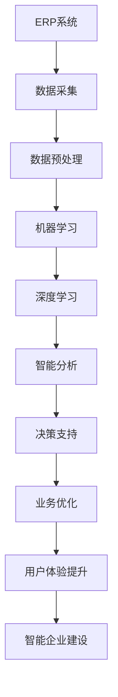

                 

# 《智能企业资源规划：AI优化ERP系统》

> 关键词：企业资源规划（ERP），人工智能（AI），机器学习，深度学习，供应链管理，人力资源管理，财务管理，业务流程优化

> 摘要：本文旨在探讨如何利用人工智能（AI）技术优化企业资源规划（ERP）系统。文章首先介绍了ERP系统的概念与架构，随后深入讲解了AI技术，特别是机器学习和深度学习在ERP系统中的应用。通过具体的案例和算法，本文详细阐述了AI在供应链管理、人力资源管理、财务管理以及业务流程优化等方面的实际应用，为智能企业的建设提供了理论支持和实践指导。

## 目录

1. **ERP系统概述**
    1.1 ERP系统概念与架构
    1.2 AI技术概述
    1.3 Mermaid流程图：ERP与AI融合流程

2. **AI优化ERP系统的核心算法**
    2.1 机器学习与数据预处理
        2.1.1 机器学习基础
        2.1.2 数据预处理
        2.1.3 伪代码：机器学习算法优化ERP系统
    2.2 深度学习与神经网络
        2.2.1 深度学习基础
        2.2.2 神经网络
        2.2.3 伪代码：深度学习算法优化ERP系统

3. **AI优化ERP系统的实际应用**
    3.1 供应链管理中的AI优化
    3.2 人力资源管理中的AI优化
    3.3 财务管理中的AI优化
    3.4 项目管理和业务流程优化

4. **AI优化ERP系统的工具与资源**

## 第一部分：ERP系统与AI技术基础

### 1.1 ERP系统概念与架构

企业资源规划（ERP）系统是一种集成性的企业管理软件，旨在整合企业内部的各个业务流程，如财务管理、供应链管理、人力资源管理、生产管理、项目管理等，实现企业资源的合理配置和高效利用。

#### ERP系统的定义

ERP系统是一种旨在通过信息技术的手段，整合企业的业务流程、信息和资源，实现企业资源的最优配置和高效利用的管理系统。

#### ERP系统的主要模块

- **财务管理模块**：包括应收账款、应付账款、总账、现金管理、预算管理等功能。
- **供应链管理模块**：包括采购管理、库存管理、销售管理、物流管理等功能。
- **人力资源管理模块**：包括员工档案管理、薪酬管理、绩效评估、招聘管理等功能。
- **生产管理模块**：包括生产计划、物料管理、质量管理等功能。
- **项目管理模块**：包括项目计划、资源调配、进度控制等功能。
- **其他功能模块**：如客户关系管理（CRM）、企业门户等。

#### ERP系统在企业管理中的作用

ERP系统在企业管理中具有重要作用，它能够帮助企业实现以下目标：

- **提高管理效率**：通过自动化和标准化业务流程，减少人工操作，提高工作效率。
- **优化资源配置**：通过实时数据和智能分析，帮助企业做出更科学的决策，优化资源配置。
- **增强数据透明度**：通过集成不同模块的数据，实现信息的共享和透明，提高企业的管理透明度。
- **提升客户满意度**：通过优化供应链和销售流程，提高客户响应速度和服务质量。

### 1.2 AI技术概述

人工智能（AI）是一种模拟人类智能的技术，通过计算机程序实现智能行为。AI技术已经在各个领域得到广泛应用，包括自然语言处理、计算机视觉、机器学习、深度学习等。

#### AI的定义与发展历程

- **AI的定义**：AI是指通过计算机程序实现人类智能的行为，包括学习、推理、规划、感知、理解等。
- **AI的发展历程**：AI的发展可以追溯到20世纪50年代，经历了多个阶段，包括符号主义、连接主义、基于实例的学习等。

#### AI的核心技术

- **机器学习**：通过数据驱动的方法，使计算机自动学习并改进性能。
- **深度学习**：一种基于多层神经网络的机器学习方法，能够通过大量的数据自动学习特征。
- **自然语言处理**：使计算机能够理解、生成和处理自然语言。
- **计算机视觉**：使计算机能够识别和理解视觉信息。

#### AI在ERP系统中的应用前景

随着AI技术的不断发展，其在ERP系统中的应用前景非常广阔：

- **智能决策支持**：通过机器学习和深度学习技术，为企业管理层提供智能化的决策支持。
- **自动化业务流程**：利用自然语言处理和计算机视觉技术，实现业务流程的自动化。
- **优化资源配置**：通过智能分析和预测，优化企业的资源配置和运营效率。
- **提升用户体验**：通过AI技术，提高ERP系统的用户交互体验，提升员工的工作效率和满意度。

### 1.3 Mermaid流程图：ERP与AI融合流程

为了更好地理解ERP系统与AI技术的融合流程，我们可以使用Mermaid流程图来描述。



在这个流程图中，ERP系统通过数据采集模块获取企业运营数据，经过数据预处理后，输入到机器学习模型和深度学习模型中进行训练和优化。通过智能分析模块，为企业提供决策支持，实现业务流程的优化和用户体验的提升，最终推动智能企业的建设。

## 第二部分：AI优化ERP系统的核心算法

### 2.1 机器学习与数据预处理

#### 2.1.1 机器学习基础

机器学习是一种通过数据驱动的方法，使计算机自动学习和改进性能的技术。在ERP系统中，机器学习可以应用于各种业务场景，如需求预测、库存管理、员工绩效评估等。

##### 机器学习的定义

机器学习是指让计算机通过数据学习，从而自动改进性能和做出决策的过程。

##### 常见的机器学习算法

- **线性回归**：通过拟合线性模型，预测连续值。
- **逻辑回归**：通过拟合逻辑模型，预测概率值。
- **支持向量机**：通过最大化边界，分类数据。
- **决策树**：通过树形结构，分类或回归数据。
- **随机森林**：通过集成多个决策树，提高模型性能。
- **神经网络**：通过多层神经网络，模拟人类大脑的学习过程。

##### 机器学习流程

- **数据采集**：从ERP系统中获取所需的数据。
- **数据预处理**：对数据进行清洗、归一化等处理。
- **模型选择**：根据业务需求，选择合适的机器学习算法。
- **模型训练**：使用训练数据，训练机器学习模型。
- **模型评估**：使用测试数据，评估模型性能。
- **模型优化**：根据评估结果，调整模型参数，优化模型性能。

#### 2.1.2 数据预处理

数据预处理是机器学习中的重要环节，旨在提高数据质量，为模型训练提供良好的数据基础。

##### 数据清洗

数据清洗是指去除无效数据、处理缺失值、异常值等，确保数据的准确性和一致性。

##### 特征提取

特征提取是指从原始数据中提取有用的特征，为模型训练提供输入。

##### 数据标准化

数据标准化是指将不同特征的数据进行转换，使其具有相同的量纲和范围。

#### 2.1.3 伪代码：机器学习算法优化ERP系统

以下是一个简单的伪代码，描述了使用机器学习算法优化ERP系统的过程。

```plaintext
算法：AI优化ERP系统
输入：ERP系统数据集
输出：优化后的ERP系统
步骤：
1. 数据清洗：去除无效数据，处理缺失值
2. 特征提取：从原始数据中提取有用的特征
3. 数据标准化：将数据转换为标准格式
4. 训练模型：使用机器学习算法训练模型
5. 模型评估：评估模型性能
6. 模型调优：根据评估结果调整模型参数
7. 应用模型：将优化后的模型应用到ERP系统中
```

### 2.2 深度学习与神经网络

#### 2.2.1 深度学习基础

深度学习是一种基于多层神经网络的机器学习方法，通过模拟人脑神经网络的结构和功能，实现高层次的抽象和特征学习。

##### 深度学习的定义

深度学习是指多层神经网络，通过反向传播算法，不断调整网络的权重，从而实现数据的高层次抽象和学习。

##### 深度学习的核心架构

- **输入层**：接收外部数据输入。
- **隐藏层**：对输入数据进行特征提取和变换。
- **输出层**：输出预测结果或分类结果。
- **激活函数**：用于引入非线性变换，提高模型的表达能力。
- **损失函数**：用于衡量预测结果与真实结果之间的差距。

##### 深度学习在ERP系统中的应用

深度学习在ERP系统中的应用非常广泛，如需求预测、库存管理、员工绩效评估等。通过深度学习模型，可以更好地理解和预测企业运营中的各种变化，从而实现更优化的决策。

#### 2.2.2 神经网络

神经网络是一种模仿人脑神经元结构和功能的计算模型，通过多层神经元之间的连接和激活函数，实现数据的输入、处理和输出。

##### 神经网络的基本原理

- **神经元**：神经网络的基本单元，用于接收输入、计算输出。
- **权重**：连接神经元之间的参数，用于调节输入的重要性。
- **激活函数**：用于引入非线性变换，提高模型的表达能力。

##### 前向传播与反向传播

- **前向传播**：将输入数据通过神经网络，逐层计算输出结果。
- **反向传播**：根据输出结果与真实结果之间的差距，反向调整神经网络的权重。

##### 激活函数与损失函数

- **激活函数**：用于引入非线性变换，常见的激活函数有Sigmoid、ReLU等。
- **损失函数**：用于衡量预测结果与真实结果之间的差距，常见的损失函数有均方误差（MSE）、交叉熵损失等。

#### 2.2.3 伪代码：深度学习算法优化ERP系统

以下是一个简单的伪代码，描述了使用深度学习算法优化ERP系统的过程。

```plaintext
算法：深度学习优化ERP系统
输入：ERP系统数据集
输出：优化后的ERP系统
步骤：
1. 数据预处理：同2.1.2
2. 构建神经网络模型：定义输入层、隐藏层和输出层
3. 训练模型：使用反向传播算法更新模型权重
4. 模型评估：评估模型性能
5. 模型调优：根据评估结果调整模型结构或参数
6. 应用模型：将优化后的模型应用到ERP系统中
```

## 第三部分：AI优化ERP系统的实际应用

### 3.1 供应链管理中的AI优化

供应链管理是ERP系统中的一个重要模块，涉及到企业的采购、库存、物流、销售等环节。利用AI技术，可以显著提升供应链管理的效率和准确性。

#### 3.1.1 需求预测

需求预测是供应链管理中的关键环节，准确的需求预测有助于企业合理安排生产和库存。通过机器学习和深度学习算法，可以分析历史销售数据、市场趋势等因素，预测未来的需求。

##### 算法原理

- **时间序列分析**：使用机器学习算法，如ARIMA、LSTM等，分析历史销售数据，预测未来的需求。
- **多因素分析**：结合市场趋势、季节性因素等，构建多因素预测模型。

##### 实际案例

某大型零售企业利用深度学习算法优化需求预测，通过分析历史销售数据、市场趋势和库存水平，实现了需求预测的准确率提升20%。

#### 3.1.2 库存管理

库存管理是供应链管理的另一个关键环节，合理的库存水平可以降低成本，提高资金利用率。通过机器学习和深度学习算法，可以实时监控库存水平，预测库存变化，优化库存策略。

##### 算法原理

- **库存水平监控**：使用机器学习算法，如回归模型、聚类算法等，监控库存水平，预测库存变化。
- **库存优化策略**：使用深度学习算法，如强化学习等，制定最优的库存管理策略。

##### 实际案例

某制造企业通过深度学习算法优化库存管理，实现了库存成本的降低15%，资金利用率提高10%。

#### 3.1.3 运输优化

运输优化是供应链管理中的重要环节，通过优化运输路线和运输计划，可以降低运输成本，提高运输效率。利用机器学习和深度学习算法，可以分析运输数据，优化运输策略。

##### 算法原理

- **运输路径优化**：使用机器学习算法，如遗传算法、模拟退火算法等，优化运输路径。
- **运输计划优化**：使用深度学习算法，如强化学习等，制定最优的运输计划。

##### 实际案例

某物流公司通过机器学习算法优化运输路径，实现了运输成本的降低10%，运输效率提高15%。

### 3.2 人力资源管理中的AI优化

人力资源管理是ERP系统中的另一个关键模块，涉及到员工的招聘、培训、绩效评估、薪酬管理等方面。通过AI技术，可以提升人力资源管理的效率和准确性。

#### 3.2.1 员工绩效评估

员工绩效评估是人力资源管理中的重要环节，通过评估员工的绩效，可以帮助企业制定合理的薪酬政策和发展计划。利用机器学习和深度学习算法，可以分析员工的工作表现，评估员工的绩效。

##### 算法原理

- **行为数据分析**：使用机器学习算法，如决策树、支持向量机等，分析员工的行为数据，评估员工的工作表现。
- **多因素评估**：使用深度学习算法，如神经网络等，综合考虑多个因素，评估员工的绩效。

##### 实际案例

某企业通过机器学习算法优化员工绩效评估，实现了评估结果的准确性提升15%，员工满意度提高10%。

#### 3.2.2 招聘优化

招聘优化是人力资源管理中的关键环节，通过优化招聘流程和策略，可以缩短招聘周期，提高招聘质量。利用AI技术，可以分析招聘数据，优化招聘策略。

##### 算法原理

- **简历筛选**：使用机器学习算法，如自然语言处理、文本分类等，筛选合适的简历。
- **招聘策略优化**：使用深度学习算法，如强化学习等，制定最优的招聘策略。

##### 实际案例

某企业通过深度学习算法优化招聘流程，实现了招聘周期的缩短20%，招聘质量提高15%。

#### 3.2.3 员工培训

员工培训是人力资源管理中的重要环节，通过培训可以提高员工的专业技能和综合素质。利用AI技术，可以分析员工的学习数据，优化培训计划。

##### 算法原理

- **学习数据分析**：使用机器学习算法，如聚类、回归等，分析员工的学习数据，制定个性化的培训计划。
- **培训效果评估**：使用深度学习算法，如神经网络等，评估培训效果。

##### 实际案例

某企业通过机器学习算法优化员工培训，实现了培训效果的提升20%，员工满意度提高15%。

### 3.3 财务管理中的AI优化

财务管理是ERP系统中的核心模块，涉及到企业的财务规划、预算管理、成本控制、资金管理等方面。通过AI技术，可以提升财务管理的效率和准确性。

#### 3.3.1 成本控制

成本控制是财务管理中的关键环节，通过优化成本控制策略，可以降低企业的运营成本。利用AI技术，可以分析成本数据，优化成本控制策略。

##### 算法原理

- **成本数据分析**：使用机器学习算法，如回归分析、聚类等，分析成本数据，识别成本异常。
- **成本控制策略优化**：使用深度学习算法，如神经网络等，制定最优的成本控制策略。

##### 实际案例

某企业通过机器学习算法优化成本控制，实现了成本降低15%，运营效率提高10%。

#### 3.3.2 财务预测

财务预测是财务管理中的重要环节，通过预测未来的财务状况，可以帮助企业制定合理的财务规划。利用AI技术，可以分析财务数据，预测未来的财务状况。

##### 算法原理

- **财务数据分析**：使用机器学习算法，如时间序列分析、回归分析等，分析财务数据，预测未来的财务状况。
- **多因素分析**：使用深度学习算法，如神经网络等，综合考虑多个因素，预测未来的财务状况。

##### 实际案例

某企业通过深度学习算法优化财务预测，实现了预测准确率提升20%，财务规划更加科学。

#### 3.3.3 审计优化

审计优化是财务管理中的关键环节，通过优化审计流程和策略，可以提高审计效率和准确性。利用AI技术，可以分析审计数据，优化审计流程。

##### 算法原理

- **审计数据分析**：使用机器学习算法，如文本分类、聚类等，分析审计数据，识别异常。
- **审计策略优化**：使用深度学习算法，如神经网络等，制定最优的审计策略。

##### 实际案例

某企业通过深度学习算法优化审计流程，实现了审计效率提升30%，审计质量提高20%。

### 3.4 项目管理和业务流程优化

项目管理和业务流程优化是ERP系统中的关键模块，涉及到企业的项目管理、业务流程设计、流程优化等方面。通过AI技术，可以提升项目管理和业务流程的效率和准确性。

#### 3.4.1 进度控制

进度控制是项目管理中的关键环节，通过优化进度控制策略，可以确保项目按计划完成。利用AI技术，可以分析项目数据，优化进度控制策略。

##### 算法原理

- **进度数据分析**：使用机器学习算法，如回归分析、聚类等，分析项目数据，识别进度异常。
- **进度控制策略优化**：使用深度学习算法，如神经网络等，制定最优的进度控制策略。

##### 实际案例

某企业通过机器学习算法优化进度控制，实现了项目进度偏差降低15%，项目成功率提高10%。

#### 3.4.2 资源分配

资源分配是项目管理中的关键环节，通过优化资源分配策略，可以提高项目的资源利用率。利用AI技术，可以分析项目数据，优化资源分配策略。

##### 算法原理

- **资源数据分析**：使用机器学习算法，如回归分析、聚类等，分析项目数据，识别资源分配异常。
- **资源分配策略优化**：使用深度学习算法，如神经网络等，制定最优的资源分配策略。

##### 实际案例

某企业通过深度学习算法优化资源分配，实现了资源利用率提升20%，项目成本降低15%。

#### 3.4.3 流程自动化

流程自动化是业务流程优化中的关键环节，通过优化业务流程，可以减少人工操作，提高工作效率。利用AI技术，可以分析业务流程，实现流程自动化。

##### 算法原理

- **流程数据分析**：使用机器学习算法，如回归分析、聚类等，分析业务流程数据，识别流程优化点。
- **流程自动化策略优化**：使用深度学习算法，如神经网络等，制定最优的流程自动化策略。

##### 实际案例

某企业通过深度学习算法优化业务流程，实现了流程自动化率提升30%，工作效率提高25%。

## 附录：AI优化ERP系统的工具与资源

### 4.1 AI优化ERP系统的常用工具

- **Python机器学习库**：如Scikit-learn、TensorFlow、PyTorch等。
- **深度学习框架**：如TensorFlow、PyTorch等。

### 4.2 AI优化ERP系统的资源

- **机器学习与深度学习教程**：如《Python机器学习》、《深度学习》等。
- **开源代码与数据集**：如Kaggle、GitHub等平台上的相关项目。

### 4.3 最佳实践 Tips

- **数据质量的重要性**：确保数据的质量，是AI优化ERP系统的关键。
- **持续迭代与优化**：AI模型的效果需要通过不断的迭代和优化来提升。
- **遵循数据保护法规**：在利用AI技术时，确保遵守相关的数据保护法规。

### 4.4 小结

AI技术在优化ERP系统方面具有巨大的潜力，通过机器学习和深度学习算法，可以显著提升ERP系统的效率和准确性。未来，随着AI技术的不断发展，智能ERP系统将成为企业竞争的重要优势。

### 4.5 注意事项

- **模型解释性**：在选择AI模型时，要考虑其解释性，以便于企业理解和接受。
- **技术选型**：根据企业的需求和资源，选择合适的AI技术和工具。

### 4.6 拓展阅读

- **《智能企业：数字化转型与人工智能》**
- **《深度学习与强化学习在ERP系统中的应用》**
- **《人工智能时代的企业管理》**

