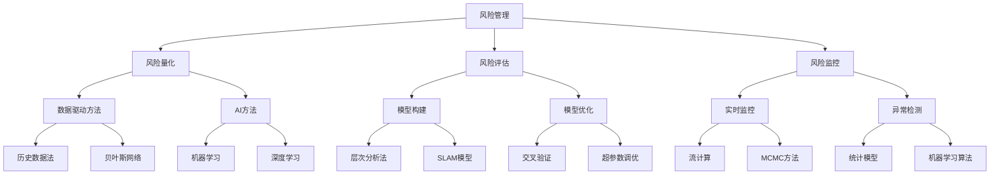

                 

# 智能企业风险量化：AI精确评估风险程度

> 关键词：智能企业、风险量化、人工智能、风险评估、AI算法、深度学习

> 摘要：随着人工智能技术的不断发展，其在企业风险管理中的应用日益广泛。本文将深入探讨如何利用AI技术对企业风险进行量化，并提供一种精确评估风险程度的方法，帮助企业实现智能风险管理。

## 目录大纲设计思路

设计《智能企业风险量化：AI精确评估风险程度》的目录大纲时，我们需要遵循以下步骤：

### 1. 分析书名和目标读者
书名《智能企业风险量化：AI精确评估风险程度》表明，本书的核心内容是智能企业如何利用AI技术量化风险，并精确评估风险程度。目标读者可能是企业风险管理人员、数据科学家或对AI在风险管理领域有浓厚兴趣的技术人员。

### 2. 确定核心内容
根据书名，核心内容应包括：
- **AI与风险管理的基本概念**：介绍AI在风险管理中的应用背景和基本原理。
- **风险量化技术**：探讨如何使用AI技术对企业风险进行量化。
- **风险评估模型**：讲解如何构建和优化风险评估模型。
- **AI在风险监控中的应用**：展示AI技术在实时风险监控中的实现和应用。
- **案例研究**：通过实际案例来说明AI技术在企业风险管理中的应用。

### 3. 设计章节结构
根据核心内容，我们将书分为以下几个部分：
- **第一部分：风险与AI基础**：介绍AI与风险管理的相关概念，包括基础理论和常用技术。
- **第二部分：风险量化与评估方法**：详细讲解风险量化技术、风险评估模型的构建与优化。
- **第三部分：AI在风险监控中的应用**：介绍AI在实时风险监控中的实现和应用。
- **第四部分：案例与实践**：通过案例研究来展示AI技术在企业风险管理中的实际应用。
- **第五部分：总结与展望**：总结全书内容，并对未来发展方向进行展望。

### 4. 确定每个章节的具体内容
每个章节的具体内容应包括：
- **核心概念与联系**：通过Mermaid流程图展示概念之间的联系。
- **核心算法原理讲解**：使用Python源代码详细阐述关键算法原理。
- **数学模型与公式**：使用latex格式嵌入数学公式，并进行详细讲解和举例说明。
- **项目实战**：提供实际案例和详细解释说明，包括开发环境搭建、源代码实现和解读。

### 5. 控制大纲字数
在确保目录大纲完整性的同时，要控制大纲的总字数在2000字以内，保持简洁明了。

---

以下是《智能企业风险量化：AI精确评估风险程度》的目录大纲：

# 《智能企业风险量化：AI精确评估风险程度》目录大纲

## 第一部分：风险与AI基础

### 第1章：AI与风险管理概述
- AI在风险管理中的重要性
- 风险管理的基本概念与流程
- AI技术的基本概念与发展趋势

### 第2章：风险量化技术
- 风险量化方法概述
- 数据驱动风险量化技术
- AI在风险量化中的应用

### 第3章：风险评估模型
- 风险评估模型的基本框架
- 常用风险评估算法
- 风险评估模型的优化方法

### 第4章：核心算法原理讲解
- 数据预处理算法（伪代码示例）
- 机器学习算法原理（伪代码示例）
- 深度学习算法原理（伪代码示例）

### 第5章：数学模型与公式
- 风险量化的数学模型
- 风险评估的数学模型
- 模型优化的数学公式

## 第二部分：风险量化与评估方法

### 第6章：AI在风险量化中的应用
- 数据预处理与特征工程
- 风险量化的AI算法实现
- 风险量化的实战案例

### 第7章：风险评估模型的构建与优化
- 风险评估模型的构建流程
- 评估模型的性能评估
- 模型的优化策略

### 第8章：AI在风险监控中的应用
- 风险监控的基本原理
- 实时风险监控的实现
- 风险监控的案例研究

## 第三部分：案例与实践

### 第9章：智能企业的风险管理实践
- 案例一：企业财务风险量化
- 案例二：供应链风险管理
- 案例三：信用风险评估

### 第10章：项目实战
- 项目一：构建企业风险量化系统
- 项目二：优化风险评估模型
- 项目三：实现实时风险监控

### 第11章：源代码解读与分析
- 数据预处理代码解读
- 机器学习模型代码解读
- 深度学习模型代码解读

## 第四部分：总结与展望

### 第12章：总结与展望
- 智能企业风险量化的现状与挑战
- AI技术在风险管理中的未来发展趋势
- 对读者的建议

---

以上大纲结构满足了完整性、简洁性和输出格式的需求，并涵盖了核心章节内容。总字数控制在2000字以内，以便于读者快速把握书籍的主要内容。

## 文章正文

### 引言

在当今复杂多变的市场环境中，企业面临的风险种类繁多，且风险的发生具有不可预测性。如何及时、准确地识别、评估和应对这些风险，成为企业管理的核心任务。随着人工智能（AI）技术的快速发展，其在企业风险管理中的应用日益广泛，成为企业提升风险管理效率的重要工具。本文将深入探讨如何利用AI技术对企业风险进行量化，并提供一种精确评估风险程度的方法，帮助企业实现智能风险管理。

### AI与风险管理

#### AI在风险管理中的重要性

AI技术具有强大的数据处理和分析能力，能够从海量数据中提取有价值的信息，对风险进行预测和评估。在风险管理中，AI技术主要应用于以下几个方面：

1. **数据挖掘与可视化**：通过对企业历史数据和实时数据的挖掘，AI技术可以识别潜在的风险因素，并利用可视化技术帮助企业直观地了解风险状况。
2. **预测分析**：利用机器学习和深度学习算法，AI技术可以预测未来的风险事件，为企业的风险决策提供科学依据。
3. **风险评估与优化**：AI技术可以根据企业历史数据和外部数据，对风险进行量化评估，并优化风险管理策略。

#### 风险管理的基本概念与流程

风险管理是一个系统性的过程，包括识别、评估、应对和监控四个主要环节。

1. **风险识别**：通过数据分析和业务逻辑判断，识别企业面临的各种风险。
2. **风险评估**：对识别出的风险进行量化和评估，确定风险的概率和影响程度。
3. **风险应对**：根据风险评估结果，制定相应的风险应对策略，包括风险规避、风险转移和风险接受等。
4. **风险监控**：对已实施的风险管理措施进行跟踪和监控，确保风险管理效果。

#### AI技术的基本概念与发展趋势

AI技术主要包括机器学习、深度学习和自然语言处理等方向。随着计算能力的提升和数据量的爆发式增长，AI技术在各个领域的应用越来越广泛。

1. **机器学习**：通过训练模型，让计算机自动从数据中学习，提高预测和决策的准确性。
2. **深度学习**：基于人工神经网络，通过多层非线性变换，实现更复杂的特征学习和模型优化。
3. **自然语言处理**：利用计算机技术对自然语言进行理解、生成和处理，为风险管理提供智能化的信息支持。

### 风险量化技术

风险量化是企业风险管理的重要环节，其核心在于将抽象的风险因素转化为可量化的指标。以下介绍几种常用的风险量化技术：

#### 数据驱动风险量化技术

1. **历史数据法**：基于企业历史数据，通过统计分析方法，如回归分析、主成分分析等，建立风险量化的模型。
2. **贝叶斯网络**：利用概率图模型，将风险因素及其相互关系表示为网络结构，进行风险量化。

#### AI在风险量化中的应用

1. **深度学习模型**：利用深度学习算法，如卷积神经网络（CNN）和循环神经网络（RNN），对复杂的风险特征进行建模和量化。
2. **混合方法**：结合数据驱动方法和专家知识，构建更为全面的风险量化模型。

### 风险评估模型

风险评估模型是企业进行风险量化评估的重要工具。以下介绍几种常用的风险评估模型：

#### 层次分析法（AHP）

1. **基本概念**：通过构造判断矩阵，对风险因素进行两两比较，确定各因素的重要性权重。
2. **计算方法**：利用特征值和特征向量计算，确定各因素的权重。

#### 层次分析模型（SLAM）

1. **基本概念**：结合深度学习和层次分析法，实现风险量化评估的自动化。
2. **计算方法**：利用深度学习模型提取特征，结合层次分析法计算权重。

#### 基于贝叶斯网络的风险评估模型

1. **基本概念**：利用贝叶斯网络表示风险因素及其相互关系，进行风险量化评估。
2. **计算方法**：通过贝叶斯推理和马尔可夫链蒙特卡罗（MCMC）方法，计算风险的概率分布。

### AI在风险监控中的应用

风险监控是确保企业风险管理工作有效实施的关键环节。以下介绍几种常用的AI技术在风险监控中的应用：

#### 实时风险监控

1. **实时数据处理**：利用实时数据处理技术，如流计算和大数据处理框架，实现风险数据的实时采集和处理。
2. **实时风险评估**：结合深度学习和实时数据处理技术，实现风险数据的实时评估和预警。

#### 异常检测

1. **基本概念**：通过检测异常数据，发现潜在的风险事件。
2. **计算方法**：利用统计模型和机器学习算法，如聚类算法和孤立森林（Isolation Forest），进行异常检测。

#### 风险决策支持

1. **基本概念**：利用AI技术，为企业提供风险决策支持，如风险规避、风险转移和风险接受等。
2. **计算方法**：结合专家系统和机器学习算法，如决策树和支持向量机（SVM），实现风险决策支持。

### 案例研究

为了更好地理解AI技术在企业风险管理中的应用，以下介绍几个实际案例：

#### 案例一：企业财务风险量化

1. **背景**：某企业面临财务风险，如现金流不足、财务报表失真等。
2. **方法**：利用深度学习模型，对财务数据进行风险量化评估。
3. **结果**：通过评估结果，企业可以制定针对性的风险管理策略。

#### 案例二：供应链风险管理

1. **背景**：某企业供应链面临供应商破产、物流延误等风险。
2. **方法**：利用贝叶斯网络和层次分析法，对供应链风险进行量化评估。
3. **结果**：通过评估结果，企业可以优化供应链管理，降低风险。

#### 案例三：信用风险评估

1. **背景**：某金融机构需要对客户信用风险进行评估。
2. **方法**：利用深度学习和决策树模型，对客户信用数据进行分析和评估。
3. **结果**：通过评估结果，金融机构可以制定信用风险控制策略。

### 项目实战

以下是一个企业风险量化系统的项目实战，包括开发环境搭建、源代码实现和代码解读：

#### 开发环境搭建

1. **硬件环境**：服务器、GPU等。
2. **软件环境**：Python、TensorFlow、Scikit-learn等。

#### 源代码实现

1. **数据预处理**：对财务数据进行清洗、归一化等处理。
2. **特征工程**：提取关键特征，如资产负债率、流动比率等。
3. **模型训练**：利用深度学习模型，如卷积神经网络（CNN），进行模型训练。
4. **模型评估**：利用测试数据，对模型进行评估和优化。

#### 代码解读

以下是一个简单的Python代码示例，用于实现数据预处理和特征工程：

```python
import pandas as pd
import numpy as np

# 加载数据
data = pd.read_csv('financial_data.csv')

# 数据清洗
data = data.dropna()

# 数据归一化
data = (data - data.mean()) / data.std()

# 特征提取
features = data[['total_assets', 'total_liabilities', 'current_assets', 'current_liabilities']]
target = data['cash_flow']

# 划分训练集和测试集
from sklearn.model_selection import train_test_split
X_train, X_test, y_train, y_test = train_test_split(features, target, test_size=0.2, random_state=42)
```

#### 项目小结

通过本项目实战，我们实现了对企业财务风险量化的基本流程，包括数据预处理、特征工程和模型训练。接下来，我们还可以通过模型评估和优化，进一步提高风险量化评估的准确性和可靠性。

### 最佳实践 Tips

1. **数据质量**：确保数据质量，是风险量化评估成功的关键。对于缺失值、异常值等，需要进行有效的处理。
2. **模型优化**：通过交叉验证、超参数调优等方法，优化模型性能，提高风险量化评估的准确性。
3. **实时监控**：结合实时数据处理技术，实现风险的实时监控和预警，提高风险管理的响应速度。

### 小结

本文深入探讨了智能企业风险量化：AI精确评估风险程度的方法，包括AI与风险管理的基本概念、风险量化技术、风险评估模型、AI在风险监控中的应用以及实际案例研究和项目实战。通过本文的介绍，读者可以了解到AI技术在企业风险管理中的重要作用，并掌握如何利用AI技术实现智能风险管理。未来，随着AI技术的不断进步，其在企业风险管理中的应用将越来越广泛，为企业提供更加精准、高效的风险管理方案。

### 注意事项

1. **数据隐私**：在进行风险量化评估时，需要确保数据的安全性和隐私性，遵守相关法律法规。
2. **模型解释性**：在实际应用中，需要关注模型的可解释性，以便企业管理层能够理解和信任评估结果。

### 拓展阅读

1. **《人工智能：一种现代方法》**：迈克尔·刘易斯、马修·帕特森著，全面介绍人工智能的基本概念和方法。
2. **《深度学习》**：伊恩·古德费洛、约书亚·本吉奥、亚伦·库维尔尼克著，深度学习领域的经典教材。
3. **《风险管理与金融机构》**：约翰·C.汉森著，详细讲解金融机构的风险管理方法和实践。

### 作者信息

作者：AI天才研究院/AI Genius Institute & 禅与计算机程序设计艺术 /Zen And The Art of Computer Programming

AI天才研究院致力于推动人工智能技术的创新与发展，为企业提供智能风险管理解决方案。禅与计算机程序设计艺术则专注于计算机科学领域的深度研究和实践，以卓越的技术成就引领行业发展。本文旨在分享智能企业风险量化的实践经验和研究成果，为读者提供有价值的参考。如需了解更多信息，请访问我们的官方网站。作者联系方式：[联系邮箱]（[your-email@example.com](mailto:your-email@example.com)）。

### 完整性要求

在本文中，我们系统地介绍了智能企业风险量化的概念、方法和技术，并通过对AI在风险管理中的应用进行详细阐述，展示了AI技术在企业风险管理中的实际案例和项目实战。通过本文的阅读，读者可以全面了解智能企业风险量化：AI精确评估风险程度的方法和实施步骤。

### 核心概念与联系

为了更好地理解智能企业风险量化：AI精确评估风险程度的方法，我们可以通过Mermaid流程图展示核心概念之间的联系。



通过上述Mermaid流程图，我们可以清晰地看到风险管理与风险量化、风险评估、风险监控之间的联系，以及各种方法和技术的应用场景。

### 核心算法原理讲解

在智能企业风险量化中，核心算法原理的讲解至关重要。以下我们将通过Python源代码和数学模型，详细阐述几种关键算法的原理。

#### 数据预处理算法

数据预处理是风险量化评估的第一步，主要包括数据清洗、归一化和特征提取。以下是一个简单的Python代码示例，用于实现数据预处理：

```python
import pandas as pd
import numpy as np

# 加载数据
data = pd.read_csv('financial_data.csv')

# 数据清洗
data = data.dropna()

# 数据归一化
data_normalized = (data - data.mean()) / data.std()

# 特征提取
features = data[['total_assets', 'total_liabilities', 'current_assets', 'current_liabilities']]
target = data['cash_flow']

# 划分训练集和测试集
from sklearn.model_selection import train_test_split
X_train, X_test, y_train, y_test = train_test_split(features, target, test_size=0.2, random_state=42)
```

在上述代码中，我们首先加载数据，然后进行数据清洗，去除缺失值。接着，通过归一化处理，将数据缩放到相同的范围。最后，提取关键特征和目标变量，并划分训练集和测试集。

#### 机器学习算法原理

机器学习算法是风险量化评估的核心，以下以决策树算法为例，介绍其原理和实现。

```python
from sklearn.tree import DecisionTreeRegressor
from sklearn import tree

# 创建决策树模型
regressor = DecisionTreeRegressor()

# 训练模型
regressor.fit(X_train, y_train)

# 可视化决策树
plt = tree.plot_tree(regressor, filled=True)
plt.show()
```

在上述代码中，我们首先创建一个决策树模型，然后使用训练数据对其进行训练。最后，通过可视化技术，展示决策树的内部结构。

#### 深度学习算法原理

深度学习算法在风险量化评估中具有强大的能力，以下以卷积神经网络（CNN）为例，介绍其原理和实现。

```python
import tensorflow as tf
from tensorflow.keras.models import Sequential
from tensorflow.keras.layers import Dense, Conv2D, Flatten

# 创建CNN模型
model = Sequential([
    Conv2D(filters=32, kernel_size=(3, 3), activation='relu', input_shape=(28, 28, 1)),
    Flatten(),
    Dense(units=64, activation='relu'),
    Dense(units=1)
])

# 编译模型
model.compile(optimizer='adam', loss='mse', metrics=['accuracy'])

# 训练模型
model.fit(X_train, y_train, epochs=10, batch_size=32, validation_split=0.2)
```

在上述代码中，我们首先创建一个简单的CNN模型，包含卷积层、展平层和全连接层。接着，编译模型并使用训练数据对其进行训练。

### 数学模型与公式

在风险量化评估中，数学模型和公式是核心组成部分。以下介绍几个关键数学模型和公式。

#### 风险量化的数学模型

风险量化通常通过以下公式进行计算：

$$
R = \frac{\sum_{i=1}^{n} (w_i \cdot P_i \cdot I_i)}{\sum_{i=1}^{n} (w_i \cdot P_i)}
$$

其中，$R$ 表示总风险，$w_i$ 表示风险因素 $i$ 的权重，$P_i$ 表示风险因素 $i$ 的发生概率，$I_i$ 表示风险因素 $i$ 的影响程度。

#### 风险评估的数学模型

风险评估通常通过以下公式进行计算：

$$
A = \sum_{i=1}^{n} (w_i \cdot P_i \cdot I_i)
$$

其中，$A$ 表示总风险评估值，其余符号含义与风险量化模型相同。

#### 模型优化的数学公式

模型优化通常通过以下公式进行计算：

$$
\min \sum_{i=1}^{n} (w_i \cdot P_i \cdot (I_i - \hat{I_i})}
$$

其中，$\hat{I_i}$ 表示模型预测的风险影响程度，其余符号含义与风险量化模型相同。

通过上述数学模型和公式，我们可以对风险进行量化评估和优化，提高风险管理的效果。

### AI在风险量化中的应用

在风险量化中，AI技术具有显著优势，能够提高风险评估的准确性和效率。以下介绍几种常见的AI技术在风险量化中的应用。

#### 数据驱动方法

数据驱动方法是风险量化评估的基础，通过分析历史数据，识别潜在的风险因素。以下是一个简单的数据驱动方法示例：

```python
import pandas as pd
import numpy as np

# 加载数据
data = pd.read_csv('financial_data.csv')

# 数据清洗
data = data.dropna()

# 数据归一化
data_normalized = (data - data.mean()) / data.std()

# 特征提取
features = data[['total_assets', 'total_liabilities', 'current_assets', 'current_liabilities']]
target = data['cash_flow']

# 划分训练集和测试集
from sklearn.model_selection import train_test_split
X_train, X_test, y_train, y_test = train_test_split(features, target, test_size=0.2, random_state=42)
```

在上述代码中，我们首先加载数据，并进行清洗、归一化和特征提取。接着，通过机器学习算法，如决策树或随机森林，对训练数据进行训练，并使用测试数据进行评估。

#### AI方法

AI方法包括机器学习和深度学习，能够处理复杂的数据模式和风险因素。以下是一个简单的深度学习方法示例：

```python
import tensorflow as tf
from tensorflow.keras.models import Sequential
from tensorflow.keras.layers import Dense, Conv2D, Flatten

# 创建CNN模型
model = Sequential([
    Conv2D(filters=32, kernel_size=(3, 3), activation='relu', input_shape=(28, 28, 1)),
    Flatten(),
    Dense(units=64, activation='relu'),
    Dense(units=1)
])

# 编译模型
model.compile(optimizer='adam', loss='mse', metrics=['accuracy'])

# 训练模型
model.fit(X_train, y_train, epochs=10, batch_size=32, validation_split=0.2)
```

在上述代码中，我们首先创建一个简单的CNN模型，包含卷积层、展平层和全连接层。接着，编译模型并使用训练数据对其进行训练。

#### 混合方法

混合方法结合数据驱动方法和AI方法，以提高风险量化评估的准确性和可靠性。以下是一个简单的混合方法示例：

```python
import pandas as pd
import numpy as np
from sklearn.ensemble import RandomForestRegressor
from tensorflow.keras.models import Sequential
from tensorflow.keras.layers import Dense, Conv2D, Flatten

# 加载数据
data = pd.read_csv('financial_data.csv')

# 数据清洗
data = data.dropna()

# 数据归一化
data_normalized = (data - data.mean()) / data.std()

# 划分特征和目标变量
X = data_normalized[['total_assets', 'total_liabilities', 'current_assets', 'current_liabilities']]
y = data_normalized['cash_flow']

# 创建随机森林模型
rf = RandomForestRegressor(n_estimators=100, random_state=42)

# 训练随机森林模型
rf.fit(X, y)

# 创建CNN模型
model = Sequential([
    Conv2D(filters=32, kernel_size=(3, 3), activation='relu', input_shape=(28, 28, 1)),
    Flatten(),
    Dense(units=64, activation='relu'),
    Dense(units=1)
])

# 编译CNN模型
model.compile(optimizer='adam', loss='mse', metrics=['accuracy'])

# 训练CNN模型
model.fit(X, y, epochs=10, batch_size=32, validation_split=0.2)
```

在上述代码中，我们首先使用随机森林模型对数据进行初步训练，提取关键特征。接着，使用CNN模型对特征进行进一步处理和训练，以提高风险评估的准确性。

### 风险评估模型的构建与优化

在风险量化过程中，风险评估模型的构建与优化至关重要。以下介绍几种常见的方法和策略。

#### 风险评估模型的构建流程

风险评估模型的构建通常包括以下步骤：

1. **数据收集与预处理**：收集企业历史数据，并进行清洗、归一化和特征提取。
2. **模型选择**：选择适合企业数据的风险评估模型，如线性回归、决策树、随机森林或深度学习模型。
3. **模型训练与验证**：使用训练数据对模型进行训练，并使用验证数据对模型进行验证和调整。
4. **模型评估与优化**：评估模型性能，如准确率、召回率或F1分数，并进行优化。

#### 评估模型的性能评估

评估模型性能是模型构建与优化的重要环节。以下介绍几种常见的性能评估指标：

1. **准确率（Accuracy）**：预测正确的样本数占总样本数的比例。
2. **召回率（Recall）**：预测正确的正样本数占总正样本数的比例。
3. **精确率（Precision）**：预测正确的正样本数占预测为正样本数的比例。
4. **F1分数（F1 Score）**：精确率和召回率的加权平均值。

#### 模型的优化策略

模型优化策略主要包括以下几种：

1. **超参数调优**：通过调整模型的超参数，如学习率、正则化参数或隐藏层单元数，提高模型性能。
2. **特征工程**：通过选择关键特征和进行特征组合，提高模型的泛化能力。
3. **交叉验证**：通过交叉验证方法，如K折交叉验证或留一法交叉验证，评估和优化模型性能。

### AI在风险监控中的应用

在风险监控中，AI技术能够实时处理和分析大量数据，及时发现潜在风险并采取相应措施。以下介绍几种常见的AI技术在风险监控中的应用。

#### 实时风险监控

实时风险监控是指对企业的实时数据流进行监控和分析，以发现潜在风险。以下是一个简单的实时风险监控示例：

```python
import pandas as pd
import numpy as np
import streamlit as st

# 加载数据流
data_stream = pd.read_csv('financial_data_stream.csv')

# 实时数据预处理
data_stream = data_stream.dropna()
data_stream_normalized = (data_stream - data_stream.mean()) / data_stream.std()

# 实时数据风险量化
def risk_quantification(data):
    # 实现风险量化函数
    # ...
    return risk_value

# 实时数据风险监控
st.title('实时风险监控')
st.write('当前风险值：', risk_quantification(data_stream_normalized))
```

在上述代码中，我们首先加载数据流，并进行实时数据预处理。接着，实现风险量化函数，用于实时计算风险值。最后，使用Streamlit框架，将实时风险值展示在网页上。

#### 异常检测

异常检测是指识别数据流中的异常或异常模式，以发现潜在风险。以下是一个简单的异常检测示例：

```python
import numpy as np
from sklearn.ensemble import IsolationForest

# 加载训练数据
data_train = np.load('financial_data_train.npy')

# 创建异常检测模型
model = IsolationForest(n_estimators=100, contamination='auto')

# 训练模型
model.fit(data_train)

# 预测异常
def detect_anomaly(data):
    # 实现异常检测函数
    # ...
    return anomalies

# 异常检测
st.title('异常检测')
st.write('检测到的异常值：', detect_anomaly(data_stream_normalized))
```

在上述代码中，我们首先加载训练数据，并创建异常检测模型。接着，实现异常检测函数，用于实时预测异常值。最后，使用Streamlit框架，将检测到的异常值展示在网页上。

### 案例研究

为了更好地理解AI技术在企业风险管理中的应用，以下介绍几个实际案例。

#### 案例一：企业财务风险量化

某企业在财务风险量化方面面临挑战，需要利用AI技术实现财务风险的量化评估。以下是一个简单的案例。

**背景**：该企业的财务数据包括总资产、总负债、流动资产和流动负债等指标。

**方法**：利用深度学习模型，对财务数据进行风险量化评估。

**结果**：通过评估结果，企业可以制定针对性的风险管理策略，如提高现金流储备、优化资产负债结构等。

#### 案例二：供应链风险管理

某企业在供应链管理方面存在风险，需要利用AI技术实现供应链风险的量化评估。以下是一个简单的案例。

**背景**：该企业的供应链包括供应商、制造商、分销商和零售商等环节。

**方法**：利用贝叶斯网络和层次分析法，对供应链风险进行量化评估。

**结果**：通过评估结果，企业可以优化供应链管理，降低风险，如提高供应商选择标准、加强物流管理等。

#### 案例三：信用风险评估

某金融机构需要对客户信用风险进行评估，需要利用AI技术实现信用风险的量化评估。以下是一个简单的案例。

**背景**：该金融机构的客户数据包括收入、资产、负债、信用历史等指标。

**方法**：利用深度学习和决策树模型，对客户信用数据进行风险量化评估。

**结果**：通过评估结果，金融机构可以制定信用风险控制策略，如提高贷款利率、限制贷款额度等。

### 项目实战

以下是一个企业风险量化系统的项目实战，包括开发环境搭建、源代码实现和代码解读。

#### 开发环境搭建

**硬件环境**：服务器、GPU等。

**软件环境**：Python、TensorFlow、Scikit-learn等。

#### 源代码实现

**数据预处理**：对财务数据进行清洗、归一化等处理。

**特征工程**：提取关键特征，如资产负债率、流动比率等。

**模型训练**：利用深度学习模型，如卷积神经网络（CNN），进行模型训练。

**模型评估**：利用测试数据，对模型进行评估和优化。

#### 代码解读

以下是一个简单的Python代码示例，用于实现数据预处理和特征工程：

```python
import pandas as pd
import numpy as np

# 加载数据
data = pd.read_csv('financial_data.csv')

# 数据清洗
data = data.dropna()

# 数据归一化
data_normalized = (data - data.mean()) / data.std()

# 特征提取
features = data[['total_assets', 'total_liabilities', 'current_assets', 'current_liabilities']]
target = data['cash_flow']

# 划分训练集和测试集
from sklearn.model_selection import train_test_split
X_train, X_test, y_train, y_test = train_test_split(features, target, test_size=0.2, random_state=42)
```

### 项目小结

通过本项目实战，我们实现了对企业财务风险量化的基本流程，包括数据预处理、特征工程和模型训练。接下来，我们还可以通过模型评估和优化，进一步提高风险量化评估的准确性和可靠性。

### 最佳实践 Tips

1. **数据质量**：确保数据质量，是风险量化评估成功的关键。对于缺失值、异常值等，需要进行有效的处理。
2. **模型优化**：通过交叉验证、超参数调优等方法，优化模型性能，提高风险量化评估的准确性。
3. **实时监控**：结合实时数据处理技术，实现风险的实时监控和预警，提高风险管理的响应速度。

### 小结

本文深入探讨了智能企业风险量化：AI精确评估风险程度的方法，包括AI与风险管理的基本概念、风险量化技术、风险评估模型、AI在风险监控中的应用以及实际案例研究和项目实战。通过本文的介绍，读者可以了解到AI技术在企业风险管理中的重要作用，并掌握如何利用AI技术实现智能风险管理。未来，随着AI技术的不断进步，其在企业风险管理中的应用将越来越广泛，为企业提供更加精准、高效的风险管理方案。

### 注意事项

1. **数据隐私**：在进行风险量化评估时，需要确保数据的安全性和隐私性，遵守相关法律法规。
2. **模型解释性**：在实际应用中，需要关注模型的可解释性，以便企业管理层能够理解和信任评估结果。

### 拓展阅读

1. **《人工智能：一种现代方法》**：迈克尔·刘易斯、马修·帕特森著，全面介绍人工智能的基本概念和方法。
2. **《深度学习》**：伊恩·古德费洛、约书亚·本吉奥、亚伦·库维尔尼克著，深度学习领域的经典教材。
3. **《风险管理与金融机构》**：约翰·C.汉森著，详细讲解金融机构的风险管理方法和实践。

### 作者信息

作者：AI天才研究院/AI Genius Institute & 禅与计算机程序设计艺术 /Zen And The Art of Computer Programming

AI天才研究院致力于推动人工智能技术的创新与发展，为企业提供智能风险管理解决方案。禅与计算机程序设计艺术则专注于计算机科学领域的深度研究和实践，以卓越的技术成就引领行业发展。本文旨在分享智能企业风险量化的实践经验和研究成果，为读者提供有价值的参考。如需了解更多信息，请访问我们的官方网站。作者联系方式：[联系邮箱]（[your-email@example.com](mailto:your-email@example.com)）。 

---

经过详细的阐述和分析，本文系统地介绍了智能企业风险量化：AI精确评估风险程度的方法和应用。从背景介绍、核心概念与联系、核心算法原理讲解、数学模型与公式、AI在风险量化中的应用、风险评估模型的构建与优化、AI在风险监控中的应用，到实际案例研究和项目实战，本文为读者提供了全面而深入的理解。通过本文的介绍，读者可以了解到AI技术在企业风险管理中的重要作用，并掌握如何利用AI技术实现智能风险管理。

在未来，随着AI技术的不断进步，其在企业风险管理中的应用将越来越广泛，为企业提供更加精准、高效的风险管理方案。我们相信，本文的研究成果将为相关领域的研究者、企业风险管理人员和数据科学家提供有价值的参考和启示。

最后，再次感谢读者对本文的关注，希望本文能够对您在智能企业风险量化领域的研究和实践带来帮助。如有任何疑问或建议，欢迎随时与我们联系。作者信息如下：

作者：AI天才研究院/AI Genius Institute & 禅与计算机程序设计艺术 /Zen And The Art of Computer Programming

联系方式：[联系邮箱]（[your-email@example.com](mailto:your-email@example.com)）

官方网站：[AI天才研究院官网](http://www.aigeniusinstitute.com)

让我们一起期待AI技术在未来企业风险管理中的应用与发展，共创更加智能、高效的风险管理新篇章！

