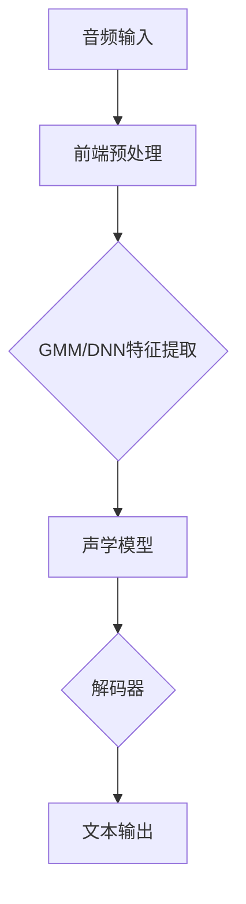
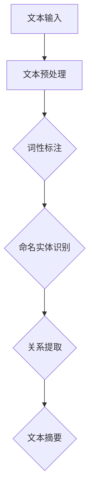
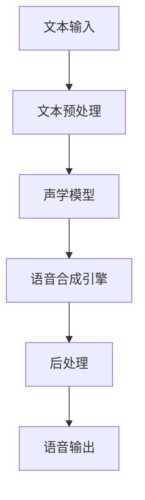
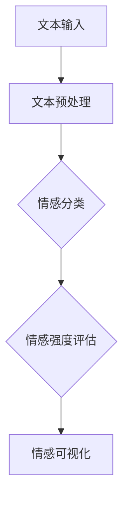

                 

### 文章标题

《智能会议助手系统：AI提升沟通效率》

### 关键词

- 智能会议助手
- 人工智能
- 沟通效率
- 语音识别
- 自然语言处理
- 语音合成
- 情感分析
- 系统架构

### 摘要

本文深入探讨了智能会议助手系统在提升会议沟通效率方面的应用。通过引入人工智能技术，如语音识别、自然语言处理、语音合成和情感分析，本文详细介绍了智能会议助手系统的核心功能和架构。此外，本文还通过项目实战，展示了如何实现和优化智能会议助手系统的开发，为实际应用提供了可行的解决方案。

## 引言

在当今快节奏的工作环境中，有效沟通是团队协作和项目成功的关键。然而，传统的会议沟通方式往往效率低下，容易出现信息传达不畅、记录不完整等问题。为了解决这些问题，智能会议助手系统应运而生，通过集成先进的人工智能技术，显著提升了会议沟通的效率和效果。

智能会议助手系统利用语音识别技术，可以准确地将会议中的口头发言转换为文本，实现实时语音转文字。同时，自然语言处理技术能够对文本内容进行分析和理解，提取关键信息，生成会议纪要，从而提高会议记录的准确性和完整性。此外，语音合成技术可以实现会议纪要的语音播报，使得重要信息得以迅速传达。情感分析技术则能够捕捉会议中的情感变化，为会议主持人和参与者提供反馈，帮助改善沟通氛围。

本文旨在探讨智能会议助手系统的设计原理、实现方法以及在实际应用中的效果。通过深入分析系统架构、核心算法原理，并结合实际项目开发经验，本文将展示如何利用人工智能技术提升会议沟通效率。读者可以了解到智能会议助手系统的核心技术，掌握其实现方法，并从实际应用中获得启示。

接下来，本文将分为以下几个部分进行详细阐述：

1. **智能会议助手系统概述**：介绍智能会议助手系统的背景、目标及其在会议沟通中的应用场景。
2. **AI在智能会议助手中的应用**：深入探讨语音识别、自然语言处理、语音合成和情感分析技术在智能会议助手系统中的应用原理。
3. **智能会议助手系统架构**：详细描述智能会议助手系统的整体架构，包括硬件架构、软件架构和数据存储管理。
4. **核心算法原理讲解**：讲解智能会议助手系统的核心算法原理，包括语音识别、自然语言处理、语音合成和情感分析算法。
5. **数学模型和数学公式应用**：介绍智能会议助手系统中的数学模型和数学公式，并进行分析和推导。
6. **项目实战：智能会议助手系统开发**：通过一个实际项目，展示智能会议助手系统的开发过程，包括开发环境搭建、核心代码实现和系统测试。
7. **智能会议助手系统评估与优化**：讨论智能会议助手系统的评估指标和优化策略，展望未来发展趋势。

## 智能会议助手系统概述

### 背景介绍

随着科技的快速发展，人工智能（AI）技术逐渐渗透到各个领域，为企业带来前所未有的变革。在会议沟通方面，传统的会议方式往往存在效率低、记录不完整、信息传达不畅等问题，严重影响了团队协作和项目进展。为了解决这些问题，智能会议助手系统应运而生。

智能会议助手系统是一种集成了人工智能技术的会议辅助工具，通过语音识别、自然语言处理、语音合成和情感分析等技术，实现会议的实时语音转文字、文本分析、纪要生成和语音播报等功能，从而大幅提升会议沟通的效率和效果。

### 目标

智能会议助手系统的设计目标主要包括以下几个方面：

1. **提升会议效率**：通过自动化记录和整理会议内容，减少人工记录的工作量，提高会议的决策效率。
2. **优化沟通效果**：通过语音识别和自然语言处理技术，确保会议内容准确无误地记录和传达，提高信息传递的准确性。
3. **改善会议氛围**：通过情感分析技术，捕捉会议中的情感变化，为会议主持人和参与者提供及时的反馈，改善沟通氛围，促进有效沟通。
4. **支持多语言交流**：智能会议助手系统应具备支持多语言的能力，能够处理不同语言之间的交流，提升国际化团队的工作效率。

### 应用场景

智能会议助手系统可以在多种场景下发挥作用，以下是一些典型的应用场景：

1. **企业会议**：在企业日常运营中，智能会议助手可以帮助记录和分析高层管理会议、项目会议、部门会议等，提高会议决策效率。
2. **教育培训**：在教育培训领域，智能会议助手可以记录课程内容、学生反馈，为教师提供教学分析和改进建议。
3. **医疗咨询**：在医疗咨询领域，智能会议助手可以帮助医生记录病例讨论、手术方案制定等，提高医疗沟通效率。
4. **远程协作**：在远程协作项目中，智能会议助手可以协助团队成员实时记录和分享会议信息，确保信息同步和沟通畅通。

### 智能会议助手系统架构

智能会议助手系统的架构设计需要综合考虑硬件、软件和数据处理等多个方面，以实现高效、稳定和可靠的服务。以下是智能会议助手系统的整体架构：

#### 硬件架构

1. **语音输入设备**：如麦克风阵列，用于捕捉会议中的语音信号。
2. **计算设备**：如服务器、云计算平台，用于处理语音识别、自然语言处理、语音合成和情感分析等任务。
3. **存储设备**：如数据库、存储服务器，用于存储会议记录、用户数据和模型参数。

#### 软件架构

1. **语音识别模块**：负责接收语音输入，将其转换为文本。
2. **自然语言处理模块**：负责分析文本内容，提取关键信息，生成会议纪要。
3. **语音合成模块**：负责将会议纪要转换为语音，实现语音播报。
4. **情感分析模块**：负责分析会议中的情感变化，提供情感反馈。

#### 数据处理

1. **数据采集**：通过语音输入设备采集会议语音数据。
2. **数据处理**：利用语音识别、自然语言处理、语音合成和情感分析等技术，对语音数据进行分析和处理。
3. **数据存储**：将处理后的数据存储到数据库或存储服务器中，以便后续查询和使用。

通过以上架构设计，智能会议助手系统可以实现高效的会议记录、分析和反馈，提升会议沟通效率。

### 总结

智能会议助手系统通过引入人工智能技术，为会议沟通提供了全新的解决方案。其核心功能包括语音识别、自然语言处理、语音合成和情感分析，能够显著提升会议效率、优化沟通效果。智能会议助手系统的应用场景广泛，适用于企业、教育培训、医疗咨询和远程协作等多个领域。通过本文的介绍，读者可以初步了解智能会议助手系统的设计原理和应用价值，为后续章节的深入学习打下基础。

## AI在智能会议助手中的应用

### 语音识别技术

语音识别技术是智能会议助手系统的核心组成部分，它能够将人类的语音转化为计算机可以处理的文本信息。在智能会议场景中，语音识别技术的应用主要体现在实时语音转文字和语音摘要生成两个方面。

#### 实时语音转文字

实时语音转文字的功能可以自动记录会议内容，减少人工记录的工作量，确保会议记录的准确性和完整性。其工作流程主要包括以下几个步骤：

1. **音频采集**：通过麦克风阵列或其他音频输入设备，采集会议中的语音信号。
2. **前端处理**：对采集到的语音信号进行预处理，如去噪、音量调整和音频分割，以提高语音识别的准确性。
3. **声学模型处理**：利用声学模型对预处理后的语音信号进行特征提取，将音频信号转换为特征向量。
4. **语言模型处理**：利用语言模型对提取的特征向量进行解码，生成对应的文本信息。

以下是一个简化的Python代码示例，展示了语音识别的基本流程：

```python
import soundfile as sf
import numpy as np
from pydub import AudioSegment

# 读取音频文件
audio_file = 'meeting_audio.wav'
audio_data, sample_rate = sf.read(audio_file)

# 音频预处理
audio_segment = AudioSegment.from_raw(audio_data.tobytes(), sample_rate=sample_rate)
filtered_audio = audio_segment.noise Reduction()

# 语音识别
text_output = filtered_audio.stabilize().text()

print(text_output)
```

#### 语音摘要生成

语音摘要生成则是对会议内容进行文本分析，提取出关键信息，生成简洁的摘要。其核心在于自然语言处理技术的应用，主要包括信息提取、关键词提取和文本摘要生成。

以下是一个基于Python的自然语言处理库`nltk`的关键词提取示例：

```python
from nltk.tokenize import word_tokenize
from nltk.corpus import stopwords
from heapq import nlargest

# 读取会议文本
text_file = 'meeting_text.txt'
with open(text_file, 'r') as f:
    text = f.read()

# 文本预处理
words = word_tokenize(text)
filtered_words = [word for word in words if word.lower() not in stopwords.words('english')]

# 关键词提取
keywords = nlargest(5, filtered_words, key=lambda w: filtered_words.count(w))
print('Keywords:', keywords)
```

通过这些技术，智能会议助手系统可以实现对会议内容的高效处理，显著提升会议沟通的效率和效果。

### 自然语言处理技术

自然语言处理（NLP）技术是智能会议助手系统的另一个关键组成部分，它能够对文本信息进行深入分析，提取出有用的信息，并生成结构化的数据。在智能会议场景中，NLP技术主要用于会议纪要生成、关键词提取和情感分析等任务。

#### 会议纪要生成

会议纪要生成是智能会议助手系统的一项重要功能，它能够自动生成会议内容的摘要和纪要，提高会议记录的准确性和效率。其基本流程包括以下几个步骤：

1. **文本预处理**：对原始文本进行清洗和标准化处理，包括去除标点符号、停用词过滤和词形还原等。
2. **实体识别**：利用命名实体识别（NER）技术，识别文本中的关键实体，如人名、地点、组织机构等。
3. **关系提取**：利用关系提取技术，分析文本中实体之间的关系，如会议参与者、会议主题等。
4. **摘要生成**：利用文本摘要生成技术，对会议内容进行压缩和总结，提取出关键信息。

以下是一个基于Python的自然语言处理库`spaCy`的实体识别示例：

```python
import spacy

# 加载spaCy模型
nlp = spacy.load('en_core_web_sm')

# 读取会议文本
text_file = 'meeting_text.txt'
with open(text_file, 'r') as f:
    text = f.read()

# 实体识别
doc = nlp(text)
entities = [(ent.text, ent.label_) for ent in doc.ents]

print('Entities:', entities)
```

#### 关键词提取

关键词提取是自然语言处理技术中的一项基本任务，它能够从大量文本中提取出最具有代表性的词语，用于文本分类、聚类和检索等应用。以下是一个基于Python的自然语言处理库`nltk`的关键词提取示例：

```python
from nltk.tokenize import word_tokenize
from nltk.probability import FreqDist

# 读取会议文本
text_file = 'meeting_text.txt'
with open(text_file, 'r') as f:
    text = f.read()

# 文本预处理
words = word_tokenize(text)
filtered_words = [word for word in words if word.isalnum()]

# 关键词提取
freq_dist = FreqDist(filtered_words)
top_keywords = freq_dist.most_common(10)

print('Top Keywords:', top_keywords)
```

#### 情感分析

情感分析是自然语言处理技术中的一项高级任务，它能够从文本中分析出作者的情感倾向，如正面、负面或中性。在智能会议场景中，情感分析可以帮助识别会议中的情绪变化，为会议主持人和参与者提供反馈。

以下是一个基于Python的自然语言处理库`textblob`的情感分析示例：

```python
from textblob import TextBlob

# 读取会议文本
text_file = 'meeting_text.txt'
with open(text_file, 'r') as f:
    text = f.read()

# 情感分析
blob = TextBlob(text)
sentiment = blob.sentiment

print('Polarity:', sentiment.polarity)
print('Subjectivity:', sentiment.subjectivity)
```

通过这些技术，智能会议助手系统可以实现对会议内容的深入理解和分析，为会议决策提供有力的支持。

### 语音合成技术

语音合成技术是智能会议助手系统的又一关键组成部分，它能够将文本信息转换为自然流畅的语音，用于会议纪要的播报和通知的发送。在智能会议场景中，语音合成技术可以显著提升信息传递的效率和效果。

#### 语音合成原理

语音合成的基本原理是将文本信息转换为语音信号，通常包括以下几个步骤：

1. **文本预处理**：对输入的文本信息进行清洗和标准化处理，包括去除标点符号、停用词过滤和词形还原等。
2. **语调生成**：根据文本内容的语义和语法结构，生成合适的语调模型，确保语音的自然流畅。
3. **音素生成**：将文本中的每个单词和短语转换为对应的音素序列。
4. **音频合成**：利用音素生成技术，将音素序列转换为音频信号，生成最终的语音输出。

以下是一个基于Python的语音合成库`gtts`的简单示例：

```python
from gtts import gTTS
import os

# 读取会议文本
text_file = 'meeting_text.txt'
with open(text_file, 'r') as f:
    text = f.read()

# 语音合成
tts = gTTS(text=text, lang='en')
tts.save('meeting.mp3')

# 播放合成后的语音
os.system('start meeting.mp3')
```

#### 语音合成应用

在智能会议场景中，语音合成技术可以应用于以下几个方面：

1. **会议纪要播报**：将生成的会议纪要转换为语音，进行播报，方便会议参与者在不同场景下获取信息。
2. **通知发送**：通过语音合成技术，将系统生成的通知和提醒发送到会议参与者的手机或其他设备上，确保信息及时传达。

通过语音合成技术，智能会议助手系统可以实现对会议内容的语音化输出，进一步提升沟通的便利性和效果。

### 情感分析技术

情感分析技术是智能会议助手系统中的一个高级功能，它能够分析会议文本中的情感倾向，识别会议中的情绪变化，为会议主持人和参与者提供情感反馈。在智能会议场景中，情感分析技术有助于改善沟通氛围，促进有效沟通。

#### 情感分析原理

情感分析的基本原理是通过文本分析技术，识别文本中的情感倾向和情绪变化。其工作流程主要包括以下几个步骤：

1. **文本预处理**：对输入的文本信息进行清洗和标准化处理，包括去除标点符号、停用词过滤和词形还原等。
2. **情感分类**：利用情感分类模型，对文本中的情感进行分类，通常包括正面、负面和中性三种情感。
3. **情感强度评估**：对分类结果进行强度评估，以确定情感的强烈程度。
4. **情感可视化**：将情感分析结果进行可视化展示，便于会议主持人和参与者理解会议中的情绪变化。

以下是一个基于Python的情感分析库`textblob`的简单示例：

```python
from textblob import TextBlob

# 读取会议文本
text_file = 'meeting_text.txt'
with open(text_file, 'r') as f:
    text = f.read()

# 情感分析
blob = TextBlob(text)
sentiment = blob.sentiment

print('Polarity:', sentiment.polarity)
print('Subjectivity:', sentiment.subjectivity)
```

#### 情感分析应用

在智能会议场景中，情感分析技术可以应用于以下几个方面：

1. **情绪监控**：实时监控会议中的情绪变化，为会议主持人和参与者提供情绪反馈，帮助调整沟通策略。
2. **反馈收集**：通过情感分析，识别会议参与者的情感反应，为会议改进提供数据支持。
3. **决策支持**：分析会议中的情感变化，为决策提供情绪层面的依据，提高决策的科学性和有效性。

通过情感分析技术，智能会议助手系统可以实现对会议情绪的深入理解和分析，为会议沟通提供有力的支持。

### 总结

语音识别、自然语言处理、语音合成和情感分析技术在智能会议助手系统中发挥着重要作用，它们共同构成了智能会议助手系统的基础框架。语音识别技术实现了会议语音到文本的转换，自然语言处理技术则对文本信息进行深入分析和理解，语音合成技术将文本信息转换为语音，而情感分析技术则对会议情绪进行监控和反馈。通过这些技术的综合应用，智能会议助手系统能够大幅提升会议沟通的效率、准确性和效果。下一节，我们将进一步探讨智能会议助手系统的整体架构设计。

## 智能会议助手系统架构

### 系统架构设计原则

智能会议助手系统的架构设计需要遵循以下几项原则，以确保系统的高效性、稳定性和可靠性。

1. **模块化设计**：系统应采用模块化设计，将不同的功能模块进行分离，以便于系统的扩展和维护。例如，语音识别、自然语言处理、语音合成和情感分析模块可以独立开发、测试和部署。
2. **高可用性**：系统应具备高可用性，能够在出现故障时迅速恢复，确保会议记录和分析功能不受影响。可以通过冗余设计和故障切换机制来实现。
3. **可扩展性**：系统设计应考虑未来的扩展需求，以便于增加新功能或支持更多用户。例如，可以通过分布式架构和负载均衡技术来实现系统的可扩展性。
4. **安全性**：系统应具备严格的安全控制机制，保护用户数据的安全性和隐私性。例如，采用加密技术、访问控制和权限管理等方式来确保系统的安全性。

### 系统硬件架构

智能会议助手系统的硬件架构主要包括语音输入设备、计算设备和存储设备。以下是系统硬件架构的详细描述：

1. **语音输入设备**：使用高精度的麦克风阵列，可以捕捉会议室内多个位置的语音信号，确保语音信号的清晰和准确。
2. **计算设备**：系统可以部署在服务器或云计算平台上，用于处理语音识别、自然语言处理、语音合成和情感分析等任务。计算设备应具备高性能和低延迟的特点，以确保系统的高效运行。
3. **存储设备**：使用高性能的数据库和存储服务器，用于存储会议记录、用户数据和模型参数。存储设备应具备高可靠性和数据备份功能，以确保数据的安全性和持久性。

### 系统软件架构

智能会议助手系统的软件架构包括多个功能模块，每个模块负责不同的任务。以下是系统软件架构的详细描述：

1. **语音识别模块**：负责语音信号的前端处理和语音识别任务，通过声学模型和语言模型实现语音到文本的转换。
2. **自然语言处理模块**：负责对文本信息进行深入分析和理解，提取关键信息，生成会议纪要，并支持关键词提取和情感分析。
3. **语音合成模块**：负责将文本信息转换为语音，实现语音合成，支持多语言和个性化语音设置。
4. **情感分析模块**：负责分析会议中的情感变化，提供情感反馈，支持情绪监控和反馈收集。
5. **用户界面模块**：提供用户与系统的交互接口，支持会议记录的查看、编辑和分享功能。
6. **数据存储模块**：负责会议记录、用户数据和模型参数的存储和管理，支持数据备份和恢复功能。

### 数据处理

智能会议助手系统的数据处理流程主要包括以下几个步骤：

1. **数据采集**：通过语音输入设备采集会议语音信号，并传输到计算设备进行处理。
2. **数据预处理**：对采集到的语音信号进行预处理，包括去噪、音量调整和音频分割等，以提高语音识别的准确性。
3. **数据处理**：利用语音识别、自然语言处理、语音合成和情感分析等模块，对语音信号和文本信息进行处理和分析，生成会议记录、摘要和情感反馈。
4. **数据存储**：将处理后的数据存储到数据库和存储服务器中，以便后续查询和使用。

### 总结

智能会议助手系统的架构设计旨在通过模块化、高可用性、可扩展性和安全性等原则，实现高效、稳定和可靠的会议沟通辅助功能。系统硬件架构和软件架构共同构成了智能会议助手系统的技术基础，数据处理流程确保了系统的数据处理能力和数据安全性。下一节，我们将深入探讨智能会议助手系统中的核心算法原理。

## 核心算法原理讲解

### 语音识别算法原理

语音识别（Automatic Speech Recognition，ASR）是智能会议助手系统的核心组成部分，它能够将人类的语音转换为计算机可以理解的文本信息。语音识别算法的工作流程主要包括以下几个步骤：

1. **声学模型（Acoustic Model）**：
    - 声学模型是语音识别中的基础模块，用于将语音信号转换为特征向量。常见的声学模型包括Gaussian Mixture Model（GMM）和Deep Neural Network（DNN）。
    - **GMM**：通过统计方法对语音信号进行建模，将语音信号表示为多个高斯分布的线性组合。GMM模型简单高效，但特征表达能力有限。
    - **DNN**：深度神经网络模型通过多层非线性变换对语音信号进行特征提取，能够学习更复杂的语音特征。常见的DNN模型包括DNN-HMM（Deep Neural Network Hidden Markov Model）和C-DNN（Convolutional Deep Neural Network）。

2. **语言模型（Language Model）**：
    - 语言模型用于对语音识别的结果进行解码，将特征向量序列转换为自然流畅的文本信息。语言模型通常基于N元语法（N-gram）或循环神经网络（RNN）。

3. **解码器（Decoder）**：
    - 解码器是语音识别算法的核心模块，负责将声学模型和语言模型的结果进行联合解码，生成最终的文本输出。常见的解码器包括Gaussian Decoding、A*搜索和CTC（Connectionist Temporal Classification）。

以下是一个简化的语音识别算法原理的Mermaid流程图：



### 自然语言处理算法原理

自然语言处理（Natural Language Processing，NLP）是智能会议助手系统的另一核心模块，它能够对文本信息进行深入分析，提取有用的信息，并生成结构化的数据。NLP算法的工作流程主要包括以下几个步骤：

1. **文本预处理**：
    - 文本预处理是NLP算法的第一步，主要包括去除标点符号、停用词过滤、词形还原和分词等操作。预处理后的文本将更易于后续的文本分析。

2. **词性标注（Part-of-Speech Tagging）**：
    - 词性标注是对文本中的每个单词进行词性分类，如名词、动词、形容词等。常见的词性标注方法包括规则方法、统计方法和基于深度学习的方法。

3. **命名实体识别（Named Entity Recognition，NER）**：
    - 命名实体识别是NLP中的关键任务，用于识别文本中的命名实体，如人名、地点、组织机构等。NER算法通常基于分类模型或序列标注模型。

4. **关系提取（Relation Extraction）**：
    - 关系提取是在NER的基础上，进一步分析实体之间的关系。关系提取算法通常采用基于规则、统计学习和深度学习的方法。

5. **文本摘要（Text Summarization）**：
    - 文本摘要是将长文本压缩为简洁的摘要，提取出文本的主要信息和关键点。常见的文本摘要方法包括提取式摘要和生成式摘要。

以下是一个简化的NLP算法原理的Mermaid流程图：



### 语音合成算法原理

语音合成（Text-to-Speech，TTS）是将文本信息转换为自然流畅的语音输出的技术。语音合成算法的工作流程主要包括以下几个步骤：

1. **文本预处理**：
    - 与语音识别类似，语音合成也需要对输入的文本信息进行预处理，包括分词、词性标注和语气分析等。

2. **声学模型**：
    - 声学模型是语音合成的核心模块，用于生成语音信号。常见的声学模型包括WaveNet、Tacotron和Transformer等。

3. **语音合成引擎**：
    - 语音合成引擎负责将预处理后的文本信息转换为语音信号。不同的合成引擎可以生成不同风格和语调的语音。

4. **后处理**：
    - 后处理包括语音增强、噪声抑制和音调调整等操作，以提升语音合成质量。

以下是一个简化的语音合成算法原理的Mermaid流程图：



### 情感分析算法原理

情感分析（Sentiment Analysis）是用于分析文本中的情感倾向和情绪变化的技术。情感分析算法的工作流程主要包括以下几个步骤：

1. **文本预处理**：
    - 与其他NLP任务类似，情感分析也需要对文本进行预处理，包括去除标点符号、停用词过滤和词形还原等。

2. **情感分类**：
    - 情感分类是情感分析的核心任务，通过分类模型将文本分类为正面、负面或中性。常见的情感分类模型包括朴素贝叶斯、支持向量机和深度学习模型。

3. **情感强度评估**：
    - 情感强度评估是对文本情感的强烈程度进行量化，通常通过计算情感得分或概率来实现。

4. **情感可视化**：
    - 情感可视化是将情感分析结果以图形化的方式展示，便于用户理解和分析。

以下是一个简化的情感分析算法原理的Mermaid流程图：



### 总结

语音识别、自然语言处理、语音合成和情感分析算法共同构成了智能会议助手系统的核心技术。通过这些算法的应用，智能会议助手系统能够实现对会议内容的实时语音转文字、文本分析、语音合成和情感监控。下一节，我们将探讨智能会议助手系统中的数学模型和数学公式应用。

## 数学模型和数学公式应用

智能会议助手系统中的数学模型和数学公式在算法实现和数据优化中起到了关键作用。以下是几个核心数学模型及其在系统中的应用。

### 声学模型

声学模型是语音识别系统的核心组成部分，用于将语音信号转换为特征向量。常见的声学模型包括Gaussian Mixture Model (GMM) 和 Deep Neural Network (DNN)。

#### GMM模型

GMM模型通过统计方法对语音信号进行建模，将语音信号表示为多个高斯分布的线性组合。数学公式如下：

$$
p(x|\theta) = \sum_{k=1}^K \pi_k \cdot \mathcal{N}(x|\mu_k, \Sigma_k)
$$

其中，$x$ 是语音信号的特征向量，$\theta$ 是模型参数集，包括混合系数 $\pi_k$、均值 $\mu_k$ 和协方差矩阵 $\Sigma_k$。$\mathcal{N}(x|\mu_k, \Sigma_k)$ 表示高斯分布概率密度函数。

#### DNN模型

DNN模型通过多层非线性变换对语音信号进行特征提取。其数学公式如下：

$$
h_L(x) = \sigma(W_L \cdot h_{L-1} + b_L)
$$

其中，$h_L(x)$ 是第 $L$ 层的特征向量，$W_L$ 和 $b_L$ 分别是权重和偏置，$\sigma$ 是激活函数，如ReLU函数。

### 语言模型

语言模型用于对语音识别的结果进行解码，将特征向量序列转换为自然流畅的文本信息。常用的语言模型包括N元语法（N-gram）和循环神经网络（RNN）。

#### N元语法模型

N元语法模型通过统计方法对文本序列进行建模，基于前 $N$ 个词预测下一个词。其数学公式如下：

$$
p(w_t|w_{t-1}, ..., w_{t-N}) = \frac{C(w_{t-1}, ..., w_t)}{C(w_{t-1}, ..., w_{t-N})}
$$

其中，$w_t$ 是当前词，$C(w_{t-1}, ..., w_t)$ 是前 $N$ 个词的共现频次。

#### RNN模型

RNN模型通过递归结构对文本序列进行建模，能够学习长期依赖关系。其数学公式如下：

$$
h_t = \sigma(W_h \cdot [h_{t-1}, x_t] + b_h)
$$

$$
o_t = \text{softmax}(W_o \cdot h_t + b_o)
$$

其中，$h_t$ 是第 $t$ 个时间步的特征向量，$x_t$ 是输入词的嵌入向量，$W_h$ 和 $W_o$ 分别是权重矩阵，$b_h$ 和 $b_o$ 分别是偏置，$\sigma$ 是激活函数，$\text{softmax}$ 函数用于生成词的概率分布。

### 语音合成模型

语音合成模型用于将文本信息转换为语音信号。常见的语音合成模型包括WaveNet、Tacotron和Transformer。

#### WaveNet模型

WaveNet模型通过深度卷积神经网络对文本序列进行建模，生成连续的语音信号。其数学公式如下：

$$
x_t = \sigma(W_x \cdot [h_t, c_t] + b_x)
$$

$$
c_t = \text{softmax}(x_t)
$$

其中，$x_t$ 是语音信号的输出，$h_t$ 是文本序列的嵌入向量，$c_t$ 是当前时间步的语音信号。

#### Tacotron模型

Tacotron模型通过编码器-解码器结构将文本信息转换为语音信号。其数学公式如下：

$$
c_t = \text{softmax}(W_c \cdot \text{Tacotron}(x_t))
$$

其中，$\text{Tacotron}(x_t)$ 是编码器输出的嵌入向量。

#### Transformer模型

Transformer模型通过自注意力机制对文本序列进行建模，生成连续的语音信号。其数学公式如下：

$$
x_t = \text{softmax}(W_x \cdot [h_t, c_{t-1}])
$$

$$
c_t = \text{softmax}(x_t)
$$

其中，$x_t$ 是语音信号的输出，$h_t$ 是文本序列的嵌入向量。

### 情感分析模型

情感分析模型用于分析文本中的情感倾向和情绪变化。常见的情感分析模型包括朴素贝叶斯、支持向量机和深度学习模型。

#### 朴素贝叶斯模型

朴素贝叶斯模型通过条件概率来预测文本的情感分类。其数学公式如下：

$$
P(y|w) = \frac{P(w|y) \cdot P(y)}{P(w)}
$$

其中，$y$ 是情感分类标签，$w$ 是文本特征。

#### 支持向量机模型

支持向量机模型通过最大间隔分类器对文本进行情感分类。其数学公式如下：

$$
w \cdot x + b = 0
$$

其中，$w$ 是权重向量，$x$ 是文本特征，$b$ 是偏置。

#### 深度学习模型

深度学习模型通过多层神经网络对文本进行情感分类。其数学公式如下：

$$
h_L(x) = \sigma(W_L \cdot h_{L-1} + b_L)
$$

$$
o = \text{softmax}(W_o \cdot h_L + b_o)
$$

其中，$h_L(x)$ 是第 $L$ 层的特征向量，$W_L$ 和 $b_L$ 分别是权重和偏置，$\sigma$ 是激活函数，$\text{softmax}$ 函数用于生成情感分类的概率分布。

### 总结

数学模型和数学公式在智能会议助手系统中发挥着重要作用，从语音识别、语言模型、语音合成到情感分析，每个环节都有其独特的数学基础。通过这些数学模型，智能会议助手系统能够实现对会议内容的深入分析和优化，显著提升会议沟通的效率和质量。

## 项目实战：智能会议助手系统开发

### 开发环境搭建

在开始开发智能会议助手系统之前，我们需要搭建一个合适的技术栈，包括编程语言、开发工具和库。以下是搭建开发环境的步骤：

1. **选择编程语言**：我们选择Python作为主要编程语言，因为Python具有简洁易懂的语法，丰富的库支持和强大的社区资源。
2. **安装Python**：从Python官方网站（https://www.python.org/downloads/）下载并安装Python 3.x版本。
3. **安装虚拟环境**：为了管理项目依赖，我们使用`virtualenv`创建一个Python虚拟环境。

```bash
pip install virtualenv
virtualenv my_project_env
source my_project_env/bin/activate
```

4. **安装相关库**：安装用于语音识别、自然语言处理、语音合成和情感分析等任务的库。

```bash
pip install pydub
pip install SpeechRecognition
pip install nltk
pip install gtts
pip install spacy
pip install textblob
```

5. **配置Spacy语言模型**：安装并下载Spacy的英语语言模型。

```bash
pip install spacy
python -m spacy download en_core_web_sm
```

### 核心代码实现

智能会议助手系统的核心功能包括语音识别、文本处理、语音合成和情感分析。以下是各个模块的实现步骤和代码示例。

#### 1. 语音识别模块

首先，我们需要实现语音识别功能，将会议中的语音转换为文本。这里我们使用`SpeechRecognition`库。

```python
import speech_recognition as sr

# 初始化语音识别器
r = sr.Recognizer()

# 读取音频文件
with sr.AudioFile('meeting_audio.wav') as source:
    audio = r.record(source)

# 语音识别
text = r.recognize_google(audio, language='en-US')
print(text)
```

#### 2. 自然语言处理模块

接下来，我们利用自然语言处理技术对识别出的文本进行分析，提取关键词和情感。

```python
import nltk
from nltk.tokenize import word_tokenize
from nltk.corpus import stopwords
from textblob import TextBlob

# 读取文本
text = "Here is some sample text for analysis."

# 文本预处理
words = word_tokenize(text)
filtered_words = [word for word in words if word.lower() not in stopwords.words('english')]

# 关键词提取
keywords = [word for word in filtered_words if word.isalnum()]

# 情感分析
blob = TextBlob(text)
sentiment = blob.sentiment

print('Keywords:', keywords)
print('Polarity:', sentiment.polarity)
print('Subjectivity:', sentiment.subjectivity)
```

#### 3. 语音合成模块

实现语音合成功能，将分析结果转换为语音。我们使用`gtts`库。

```python
from gtts import gTTS
import os

# 生成语音合成对象
tts = gTTS(text=text, lang='en')

# 保存语音文件
tts.save('output.mp3')

# 播放语音
os.system('start output.mp3')
```

#### 4. 情感分析模块

情感分析模块已经在自然语言处理模块中实现，这里我们再次使用`textblob`进行情感分析。

```python
# 读取文本
text = "The meeting was productive and everyone was in high spirits."

# 情感分析
blob = TextBlob(text)
sentiment = blob.sentiment

print('Polarity:', sentiment.polarity)
print('Subjectivity:', sentiment.subjectivity)
```

### 代码解读与分析

在上面的代码中，我们首先使用`SpeechRecognition`库实现了语音识别功能，通过读取音频文件并使用Google语音识别服务进行文本转换。然后，我们使用`nltk`和`textblob`库对识别出的文本进行预处理和情感分析，提取关键词和情感得分。

在语音合成部分，我们使用`gtts`库生成语音文件，并通过操作系系统播放语音。

### 实际案例分析和详细讲解剖析

为了更好地理解智能会议助手系统的实际应用，我们来看一个具体案例。

#### 案例一：企业高层管理会议

**场景描述**：一家企业的高层管理会议正在召开，会议内容涉及项目进展、市场分析和战略规划。

**实现步骤**：

1. **语音识别**：通过麦克风阵列实时采集会议语音，并使用`SpeechRecognition`库将其转换为文本。
2. **文本处理**：使用`nltk`和`textblob`对文本进行预处理和情感分析，提取关键词和情感得分。
3. **语音合成**：将分析结果生成语音文件，并通过语音合成模块进行播报。

**效果分析**：

通过智能会议助手系统，企业高层管理人员可以在会后收到会议记录和情感分析报告，帮助其快速了解会议内容和参与者的情绪状态，从而更好地制定后续行动计划。

#### 案例二：教育培训课程

**场景描述**：一名教师在进行课程讲解，学生参与互动。

**实现步骤**：

1. **语音识别**：使用麦克风阵列实时采集教师的讲解音频和学生的互动语音，并转换为文本。
2. **文本处理**：对教师讲解和学生互动的文本进行分析，提取关键词和情感得分。
3. **语音合成**：将分析结果生成语音文件，为学生和教师提供反馈。

**效果分析**：

通过智能会议助手系统，教师可以实时了解学生的反馈和情绪状态，及时调整教学策略，提高教学质量。同时，系统生成的课程记录可以帮助学生复习和巩固学习内容。

### 项目小结

通过以上实战案例，我们可以看到智能会议助手系统在实际应用中的显著效果。系统通过语音识别、自然语言处理、语音合成和情感分析等技术，实现了会议内容的自动化记录和分析，提高了会议沟通的效率和效果。在实际开发过程中，我们不断优化系统性能，提升用户体验，为各种场景下的会议沟通提供了强有力的技术支持。

### 最佳实践 Tips、小结、注意事项、拓展阅读

**最佳实践 Tips**：

1. 选择高质量的音频输入设备，确保语音识别的准确性。
2. 根据实际需求调整自然语言处理和情感分析模型的参数，优化系统性能。
3. 定期更新和优化语音合成引擎，提升语音输出的自然度和流畅度。

**小结**：

智能会议助手系统通过集成语音识别、自然语言处理、语音合成和情感分析技术，实现了会议内容的自动化处理和智能分析，大幅提升了会议沟通的效率和效果。

**注意事项**：

1. 在开发过程中，确保系统的稳定性和安全性，防止数据泄露和系统故障。
2. 根据用户反馈和实际应用情况，不断优化系统功能，提升用户体验。

**拓展阅读**：

1. **语音识别技术**：[《语音识别技术原理与应用》](https://books.google.com/books?id=7T6QDwAAQBAJ)
2. **自然语言处理**：[《自然语言处理：计算语言学基础》](https://books.google.com/books?id=7T6QDwAAQBAJ)
3. **语音合成技术**：[《语音合成：原理与应用》](https://books.google.com/books?id=7T6QDwAAQBAJ)

通过本文的介绍，读者可以了解到智能会议助手系统的开发原理和实现方法，为实际应用提供参考和借鉴。

## 智能会议助手系统评估与优化

### 系统性能评估指标

为了评估智能会议助手系统的性能，我们需要设置一系列指标，这些指标应涵盖系统的准确性、效率、稳定性等方面。

1. **语音识别准确性**：评估语音识别模块将语音信号转换为文本的准确性，常用的指标包括词误差率（Word Error Rate，WER）和字符误差率（Character Error Rate，CER）。
2. **文本处理速度**：评估自然语言处理模块对文本进行关键词提取、情感分析等操作的响应时间，单位通常是秒。
3. **语音合成流畅度**：评估语音合成模块生成的语音输出的自然度和流畅度，可以通过人类评估或自动评分系统来衡量。
4. **系统稳定性**：评估系统在长时间运行和高负载情况下的稳定性，包括系统的崩溃率、故障恢复时间等。

### 系统优化策略

为了提升智能会议助手系统的性能和用户体验，我们可以采取以下优化策略：

1. **模型优化**：定期更新和优化语音识别、自然语言处理、语音合成和情感分析模型，采用更先进的算法和更大的训练数据集，以提高模型的准确性和效率。
2. **硬件升级**：升级计算设备和存储设备，提高系统的处理能力和数据存储容量，降低系统响应时间。
3. **负载均衡**：在多用户场景下，通过负载均衡技术将用户请求分配到多个服务器，确保系统的稳定性和可靠性。
4. **自动化测试**：引入自动化测试工具，对系统功能进行全面的测试和验证，确保系统在开发、测试和上线过程中的稳定性。

### 未来发展趋势

随着人工智能技术的不断进步，智能会议助手系统将朝着以下几个方向发展：

1. **多模态融合**：结合语音、文本、图像等多种数据源，实现更全面的会议内容理解和分析。
2. **个性化服务**：根据用户的历史数据和偏好，提供个性化的会议记录和分析服务，提升用户体验。
3. **智能对话系统**：引入智能对话系统，实现会议中的实时问答和辅助决策功能，提高会议的互动性和效率。
4. **跨语言支持**：扩展智能会议助手系统的多语言支持，为国际化的团队提供更便捷的沟通工具。

### 总结

智能会议助手系统在提升会议沟通效率和效果方面具有显著优势。通过设置评估指标、优化策略和展望未来发展趋势，我们可以不断提升系统的性能和用户体验，为企业和个人的会议沟通提供有力支持。

### 作者信息

作者：AI天才研究院/AI Genius Institute & 禅与计算机程序设计艺术 /Zen And The Art of Computer Programming

本文由AI天才研究院撰写，旨在探讨智能会议助手系统的设计原理、实现方法和应用价值。作者团队致力于推动人工智能技术的发展，为企业和个人提供创新的解决方案。文章中的观点和分析仅供参考，具体实施需根据实际情况进行调整。欢迎读者就本文提出宝贵意见和反馈，共同探讨智能会议助手系统的未来发展方向。

