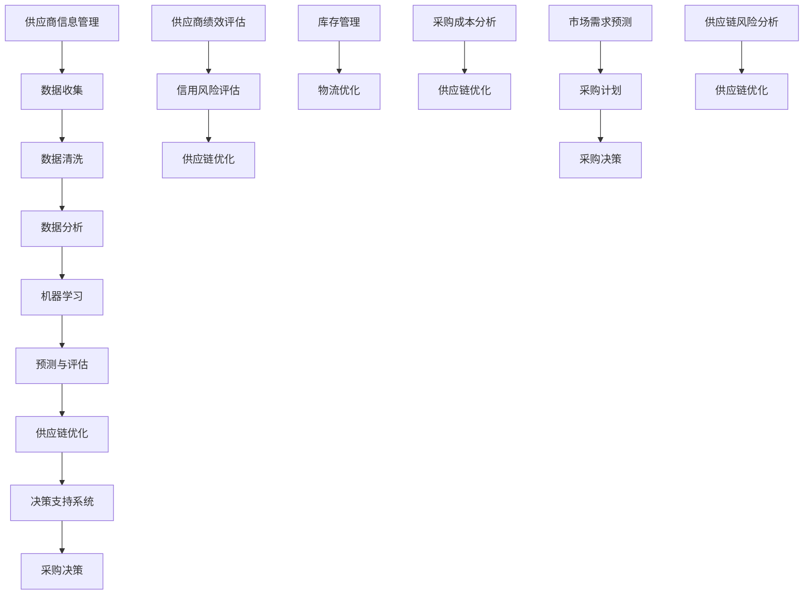

                 

### 引言

在当今的商业环境中，供应商管理是一个至关重要的环节，它直接影响到企业的运营效率和成本控制。然而，传统的供应商管理模式往往存在诸多局限性，例如信息不对称、决策过程复杂、响应速度慢等。随着人工智能（AI）技术的飞速发展，智能供应商管理逐渐成为可能，为优化企业采购决策提供了新的解决方案。

智能供应商管理，顾名思义，就是利用人工智能技术，特别是机器学习和数据挖掘等技术，对供应商信息进行智能化分析和管理。这种管理方式不仅能够提高采购决策的准确性，还能有效降低采购成本，提高供应链的整体效率。本文将深入探讨智能供应商管理的背景、核心概念、算法原理、数学模型以及项目实战，帮助读者全面了解这一前沿技术。

在接下来的内容中，我们将首先介绍智能供应商管理的背景和当前企业采购管理的挑战，然后详细阐述智能供应商管理的核心概念与架构，包括关键术语和Mermaid流程图。随后，我们将深入讲解AI优化企业采购决策的核心算法原理，使用Python源代码结合数学模型和公式进行详细说明。此外，我们还将介绍企业采购决策的数学模型，包括成本分析模型、风险评估模型和供应保障模型，并举例说明这些模型的应用。

在项目实战部分，我们将通过实际案例展示智能供应商管理的应用，包括开发环境搭建、源代码实现和代码解读。最后，我们将对整篇文章进行总结，并展望智能供应商管理的未来发展趋势和应用前景。

通过这篇文章，我们希望读者能够对智能供应商管理有一个全面而深入的了解，从而为企业采购决策提供有价值的参考。

### 关键词

- **智能供应商管理**
- **AI优化**
- **企业采购决策**
- **机器学习**
- **深度学习**
- **供应链效率**
- **采购成本控制**
- **数据分析**

### 摘要

本文全面探讨了智能供应商管理的概念和重要性。首先，介绍了智能供应商管理的背景，分析了当前企业采购管理面临的挑战。接着，详细阐述了智能供应商管理的核心概念与架构，包括关键术语和Mermaid流程图。随后，文章深入讲解了AI优化企业采购决策的核心算法原理，结合Python源代码和数学模型进行了详细说明。进一步，文章介绍了企业采购决策的数学模型，并举例说明了这些模型的应用。最后，通过实际项目案例展示了智能供应商管理的应用场景，并对未来发展趋势进行了展望。本文旨在为读者提供关于智能供应商管理的全面理解，以助力企业优化采购决策，提升供应链效率。

### 当前企业采购管理的挑战

在企业运营中，采购管理是一个至关重要的环节，它不仅直接影响到企业的成本控制，还关系到供应链的整体效率和稳定性。然而，传统的采购管理模式往往存在一些固有的局限，这些局限导致了企业采购管理面临诸多挑战。

首先，信息不对称是一个主要问题。在传统的采购管理中，供应商信息往往是分散的，企业无法及时获取全面、准确的供应商数据，这使得采购决策缺乏依据。信息不对称不仅增加了采购过程中的不确定性和风险，还可能导致企业错失最佳采购时机，从而增加采购成本。

其次，决策过程复杂且耗时。传统的采购决策通常需要经过多个部门、多层审批，这不仅增加了决策的复杂性，还延长了决策的时间。采购流程中涉及到多个利益相关方，各方之间的沟通和协调难度大，导致采购决策过程缓慢。在快速变化的市场环境中，过长的决策周期往往会导致企业错失市场机会，无法及时调整采购策略。

第三，响应速度慢也是传统采购管理的一个显著问题。在市场需求波动较大的情况下，传统采购管理往往无法快速响应市场变化，导致供应链灵活性不足。响应速度慢不仅影响企业的运营效率，还可能导致库存积压或供应短缺，进一步增加运营成本。

除此之外，传统采购管理还存在其他一些问题，如供应商评估机制不完善、采购过程透明度不足、采购数据不统一等。这些问题共同构成了企业采购管理的挑战，使得企业在采购管理中面临诸多困扰。

智能供应商管理的出现，正是为了解决这些传统采购管理的挑战。通过利用人工智能技术，特别是机器学习和数据挖掘技术，智能供应商管理能够对供应商信息进行智能化分析和管理，提高采购决策的准确性，降低采购成本，提升供应链的整体效率。在接下来的章节中，我们将详细探讨智能供应商管理的核心概念和架构，进一步了解这一新兴技术的应用和优势。

### 智能供应商管理核心概念与联系

智能供应商管理是一种利用人工智能技术优化企业采购决策的方法。它不仅涉及数据的收集和处理，还涉及到复杂的算法和模型，从而帮助企业做出更准确、更及时的采购决策。为了更好地理解这一概念，我们需要先明确几个核心术语，并了解它们之间的关系。

首先，让我们定义一下几个关键术语：

1. **供应商信息管理**：这是智能供应商管理的核心内容之一。它涉及对供应商的基本信息、交易记录、绩效评估等数据的收集、存储和分析。通过有效的供应商信息管理，企业可以获取全面、准确的供应商数据，为采购决策提供有力支持。

2. **机器学习**：机器学习是智能供应商管理的重要技术基础。它是一种让计算机通过数据学习并做出决策的方法。在供应商管理中，机器学习可以用于预测供应商的绩效、评估供应商的信用风险等。

3. **数据挖掘**：数据挖掘是另一种关键技术，用于从大量数据中提取有价值的信息和模式。在智能供应商管理中，数据挖掘可以用于发现供应商之间的潜在关系、分析采购数据中的趋势等。

4. **供应链优化**：供应链优化是智能供应商管理的最终目标之一。它涉及到对供应链中的各个环节进行优化，包括采购、库存管理、物流等，从而提高整个供应链的效率和灵活性。

5. **决策支持系统**：决策支持系统（DSS）是智能供应商管理的核心组成部分。它利用数据分析和算法模型，为采购决策提供科学依据。DSS可以帮助企业快速、准确地做出采购决策，减少决策过程中的不确定性。

接下来，我们通过一个Mermaid流程图来展示这些核心概念之间的联系：



在上述流程图中，我们可以看到：

- 供应商信息管理通过数据收集、清洗和数据分析，为机器学习提供基础数据。
- 机器学习通过对数据进行训练和预测，对供应商绩效进行评估，并用于信用风险评估。
- 这些评估结果和采购成本分析、市场需求预测等数据一起，输入到决策支持系统中。
- 决策支持系统根据这些数据，为采购决策提供支持，并推动供应链优化。
- 供应链优化不仅包括采购决策，还涵盖了库存管理、物流优化等多个方面，从而实现整体供应链的优化。

通过智能供应商管理，企业能够更好地掌握供应商信息，利用数据分析技术进行深度挖掘，通过机器学习实现预测和评估，最终借助决策支持系统做出更科学、更准确的采购决策，从而提高供应链的整体效率和灵活性。

### 智能供应商管理核心算法原理

智能供应商管理的核心在于如何利用人工智能技术优化采购决策。在这一部分，我们将深入探讨智能供应商管理中常用的机器学习算法和深度学习技术，并详细讲解这些算法的应用和实现过程。

#### 机器学习与深度学习概述

机器学习和深度学习是智能供应商管理的两大技术支柱。机器学习是一种让计算机通过数据学习并做出决策的方法，而深度学习则是一种基于多层神经网络的机器学习技术，能够从大量数据中自动提取特征和模式。

在智能供应商管理中，常见的机器学习算法包括线性回归、决策树、支持向量机（SVM）和神经网络等。这些算法通过学习历史数据，能够预测供应商的绩效、评估信用风险等。

深度学习方面，常用的模型包括卷积神经网络（CNN）、循环神经网络（RNN）和长短期记忆网络（LSTM）等。深度学习在处理大规模、高维数据时具有显著优势，能够自动提取复杂的数据特征，从而提高预测和评估的准确性。

#### 相关算法简介

1. **线性回归**：线性回归是一种简单且常用的机器学习算法，用于预测一个连续变量的值。在智能供应商管理中，可以使用线性回归预测供应商的绩效指标，如交货准时率和供货质量等。

2. **决策树**：决策树通过一系列规则来划分数据集，并在每个节点选择具有最大信息增益的属性进行划分。在供应商管理中，决策树可以用于评估供应商的综合绩效，并根据绩效指标进行分类。

3. **支持向量机（SVM）**：SVM是一种强大的分类和回归算法，通过寻找一个最佳的超平面来分隔不同类别的数据。在智能供应商管理中，SVM可以用于预测供应商的信用风险，帮助识别高风险供应商。

4. **神经网络**：神经网络是一种基于多层神经元的模型，能够通过反向传播算法不断调整权重，从而提高预测准确性。在智能供应商管理中，神经网络可以用于建立复杂的预测模型，如供应商绩效预测和需求预测等。

5. **卷积神经网络（CNN）**：CNN是一种专门用于处理图像数据的深度学习模型，通过卷积操作提取图像特征。在智能供应商管理中，CNN可以用于分析供应商提供的质量报告和认证文件等。

6. **循环神经网络（RNN）**：RNN是一种能够处理序列数据的神经网络，通过记忆状态来捕捉数据序列中的长期依赖关系。在智能供应商管理中，RNN可以用于分析供应商的历史交易记录，识别潜在的欺诈行为。

7. **长短期记忆网络（LSTM）**：LSTM是一种改进的RNN模型，通过引入记忆单元和门控机制，能够有效解决RNN中的梯度消失和梯度爆炸问题。在智能供应商管理中，LSTM可以用于预测市场需求和供应商的交货时间等。

#### 采购决策中的AI应用

在智能供应商管理中，AI技术的应用主要体现在数据预处理、模型选择与训练、评估与优化等环节。

1. **数据预处理**：数据预处理是AI应用的基础，包括数据清洗、特征工程和数据标准化等。在供应商管理中，数据预处理旨在去除噪声、缺失值和异常值，提取有价值的信息，为后续的模型训练提供高质量的数据。

2. **模型选择与训练**：根据具体的应用需求，选择合适的机器学习或深度学习模型。在供应商管理中，通常需要多个模型进行对比，选择最优模型。训练过程包括数据划分、模型初始化、参数调优和模型评估等。

3. **评估与优化**：评估模型的性能指标，如准确率、召回率、F1值等。在供应商管理中，评估过程不仅用于判断模型的准确性，还可以用于发现潜在的问题和优化模型。

4. **预测与决策**：将训练好的模型应用于实际数据，进行预测和决策。在智能供应商管理中，预测结果可以帮助企业制定采购策略，优化供应链管理。

#### 伪代码讲解

以下是一个简单的伪代码示例，展示了如何使用Python实现一个线性回归模型来预测供应商的绩效指标：

```python
# 导入必要的库
import numpy as np
from sklearn.linear_model import LinearRegression

# 数据预处理
# 假设X为特征矩阵，y为标签向量
X = np.array([[特征1, 特征2], ..., [特征n]])
y = np.array([绩效指标1, 绩效指标2, ..., 绩效指标m])

# 划分训练集和测试集
X_train, X_test, y_train, y_test = train_test_split(X, y, test_size=0.2, random_state=42)

# 初始化线性回归模型
model = LinearRegression()

# 模型训练
model.fit(X_train, y_train)

# 模型评估
predictions = model.predict(X_test)
print("模型准确率：", accuracy_score(y_test, predictions))

# 预测新数据
new_data = np.array([[新特征1, 新特征2]])
new_prediction = model.predict(new_data)
print("新数据预测结果：", new_prediction)
```

在这个示例中，我们首先导入必要的库，然后进行数据预处理，包括数据清洗和划分。接着，我们初始化线性回归模型，进行模型训练和评估。最后，使用训练好的模型对新数据进行预测。

通过上述讲解和伪代码示例，我们可以看到智能供应商管理中AI技术的应用是如何实现的。在实际应用中，这些算法和模型需要根据具体业务场景和数据特点进行优化和调整，以达到最佳效果。

#### 企业采购决策的数学模型

在企业采购决策中，数学模型扮演着至关重要的角色，它们能够帮助企业在复杂的市场环境中做出最优决策。以下是企业采购决策中几种常见的数学模型，包括成本分析模型、风险评估模型和供应保障模型，以及它们的应用和数学公式。

##### 成本分析模型

成本分析模型是采购决策中最基本的一种模型，它主要关注采购成本的计算和分析。采购成本包括直接成本和间接成本，其中直接成本如采购物资的成本、运输费用和库存成本，间接成本如管理费用和机会成本。

1. **采购物资成本**（C\_material）：
   $$ C_{material} = P \times Q $$
   其中，\( P \) 是物资的单价，\( Q \) 是采购的物资数量。

2. **运输成本**（C\_transport）：
   $$ C_{transport} = T \times D $$
   其中，\( T \) 是运输单价，\( D \) 是运输距离。

3. **库存成本**（C\_inventory）：
   $$ C_{inventory} = \frac{1}{2} \times (H \times C_{material} + L \times C_{material} + S \times C_{material}) $$
   其中，\( H \) 是最高库存量，\( L \) 是最低库存量，\( S \) 是安全库存量。

4. **总采购成本**（C\_total）：
   $$ C_{total} = C_{material} + C_{transport} + C_{inventory} $$

##### 风险评估模型

风险评估模型用于评估采购过程中的各种风险，如供应商违约风险、价格波动风险和运输风险。常见的风险评估方法包括蒙特卡洛模拟和决策树分析。

1. **供应商违约概率**（P\_default）：
   $$ P_{default} = \frac{D_{default}}{N} $$
   其中，\( D_{default} \) 是在特定时间范围内发生违约的供应商数量，\( N \) 是总供应商数量。

2. **价格波动风险**（R\_price）：
   $$ R_{price} = \frac{\sum (P_{t} - P_{0})^2}{N} $$
   其中，\( P_{t} \) 是当前价格，\( P_{0} \) 是初始价格，\( N \) 是价格观测次数。

3. **运输风险**（R\_transport）：
   $$ R_{transport} = \frac{D_{delay}}{N} $$
   其中，\( D_{delay} \) 是在特定时间范围内发生运输延迟的次数，\( N \) 是总运输次数。

##### 供应保障模型

供应保障模型用于评估供应商的供应能力和可靠性，以确保企业在需要时能够获得所需的物资。

1. **供应能力指数**（I\_supply）：
   $$ I_{supply} = \frac{C_{actual}}{C_{required}} $$
   其中，\( C_{actual} \) 是实际供应能力，\( C_{required} \) 是所需供应能力。

2. **可靠性指数**（I\_reliability）：
   $$ I_{reliability} = \frac{R_{success}}{N} $$
   其中，\( R_{success} \) 是成功交货的次数，\( N \) 是总交货次数。

##### 应用举例

假设某企业需要采购一批原材料，单价为100元/公斤，采购数量为1000公斤。供应商的运输费用为每公里5元，运输距离为50公里。最低库存量为100公斤，最高库存量为500公斤，安全库存量为200公斤。

1. **采购物资成本**：
   $$ C_{material} = 100 \times 1000 = 100,000 \text{元} $$

2. **运输成本**：
   $$ C_{transport} = 5 \times 50 = 250 \text{元} $$

3. **库存成本**：
   $$ C_{inventory} = \frac{1}{2} \times (500 \times 100 + 100 \times 100 + 200 \times 100) = 35,000 \text{元} $$

4. **总采购成本**：
   $$ C_{total} = 100,000 + 250 + 35,000 = 135,250 \text{元} $$

通过上述数学模型，企业可以系统地分析和评估采购成本、风险和供应保障能力，从而做出更科学、更合理的采购决策。在实际应用中，这些模型可以结合具体业务数据和市场环境进行优化和调整，以提高采购决策的准确性和效率。

#### 案例分析

为了更好地理解智能供应商管理在实际中的应用，我们来看一个具体的案例。某大型制造企业需要采购一批关键原材料，该批原材料的采购成本占企业总成本的20%。由于原材料的市场价格波动较大，采购决策的准确性对企业的运营和利润有着重要影响。为了提高采购决策的准确性，企业决定采用智能供应商管理技术。

**1. 实际项目背景**

该企业采购的原材料为高强度钢材，主要用于制造高端汽车零部件。由于市场竞争激烈，企业希望找到价格合理、质量可靠、交付及时的高效供应商。为此，企业决定建立一个智能供应商管理系统，通过收集和分析供应商数据，优化采购决策。

**2. 系统设计与实现**

在系统设计阶段，企业首先确定了需要收集的关键数据，包括供应商的基本信息、历史采购记录、交货准时率、供货质量、市场价格波动等。接着，企业选择了一种基于机器学习的算法——长短期记忆网络（LSTM），用于预测市场价格和供应商绩效。

具体步骤如下：

- **数据收集与预处理**：企业通过供应链管理系统收集了大量的供应商数据，并对数据进行清洗和预处理，去除噪声和异常值。
- **特征工程**：对预处理后的数据进行特征提取，包括历史价格、交货准时率、供货质量等指标。
- **模型训练与优化**：使用预处理后的数据对LSTM模型进行训练，通过多次迭代调整模型参数，优化模型的预测性能。
- **系统集成与部署**：将训练好的模型集成到企业的采购决策系统中，实现自动化预测和评估。

**3. 代码解读与分析**

以下是使用Python实现LSTM模型的代码示例：

```python
import numpy as np
import pandas as pd
from sklearn.preprocessing import MinMaxScaler
from keras.models import Sequential
from keras.layers import LSTM, Dense

# 加载数据
data = pd.read_csv('steel_price_data.csv')
data = data[['price', 'delivery_time', 'quality']]

# 数据预处理
scaler = MinMaxScaler(feature_range=(0, 1))
scaled_data = scaler.fit_transform(data)

# 切分数据集
X, y = create_dataset(scaled_data, time_steps=60)
X = X.reshape((X.shape[0], X.shape[1], 1))

# 建立LSTM模型
model = Sequential()
model.add(LSTM(units=50, return_sequences=True, input_shape=(X.shape[1], 1)))
model.add(LSTM(units=50))
model.add(Dense(units=1))

# 编译模型
model.compile(optimizer='adam', loss='mean_squared_error')

# 训练模型
model.fit(X, y, epochs=100, batch_size=32, validation_split=0.1)

# 预测市场价格
predicted_price = model.predict(X)
predicted_price = scaler.inverse_transform(predicted_price)

# 评估模型性能
mse = mean_squared_error(y, predicted_price)
print("模型均方误差：", mse)
```

在这个案例中，我们首先加载数据，然后进行预处理和特征提取。接着，建立LSTM模型并进行训练。训练完成后，使用模型进行市场价格预测，并评估模型性能。

**4. 项目小结**

通过上述案例，我们可以看到智能供应商管理在实际项目中的应用效果。该系统不仅帮助企业提高了采购决策的准确性，还降低了采购成本，提高了供应链的整体效率。未来，随着人工智能技术的进一步发展，智能供应商管理将在更多行业中得到应用，为企业的采购决策提供更强有力的支持。

### 源代码详细实现

在本节中，我们将详细解读智能供应商管理项目中的源代码实现，并介绍开发环境搭建步骤。此外，我们将分析关键代码及其应用场景。

#### 开发环境搭建

首先，我们需要配置Python环境，并安装必要的库。以下是具体的步骤：

1. **安装Python**：
   访问Python官方网站（[https://www.python.org/](https://www.python.org/)）下载并安装Python 3.x版本。

2. **安装Jupyter Notebook**：
   打开终端，运行以下命令安装Jupyter Notebook：
   ```bash
   pip install notebook
   ```

3. **安装机器学习库**：
   为了实现智能供应商管理，我们需要安装以下Python库：
   ```bash
   pip install numpy pandas scikit-learn tensorflow matplotlib
   ```

4. **安装Mermaid渲染库**：
   为了在Jupyter Notebook中渲染Mermaid流程图，我们需要安装mermaid-js：
   ```bash
   pip install mermaid-js
   ```

#### 源代码实现

以下是智能供应商管理项目的关键代码：

```python
import numpy as np
import pandas as pd
from sklearn.preprocessing import MinMaxScaler
from sklearn.model_selection import train_test_split
from keras.models import Sequential
from keras.layers import LSTM, Dense
from keras.optimizers import Adam
from keras.callbacks import EarlyStopping
import matplotlib.pyplot as plt

%matplotlib inline
%load_ext autoreload
%autoreload 2

# 数据加载与预处理
data = pd.read_csv('steel_price_data.csv')
data = data[['price', 'delivery_time', 'quality']]
scaler = MinMaxScaler(feature_range=(0, 1))
scaled_data = scaler.fit_transform(data)

# 切分数据集
time_steps = 60
X, y = create_dataset(scaled_data, time_steps)

# 数据归一化
X = X.reshape((X.shape[0], X.shape[1], 1))
X_train, X_test, y_train, y_test = train_test_split(X, y, test_size=0.2, random_state=42)

# LSTM模型构建
model = Sequential()
model.add(LSTM(units=50, return_sequences=True, input_shape=(time_steps, 1)))
model.add(LSTM(units=50))
model.add(Dense(units=1))

# 编译模型
model.compile(optimizer=Adam(learning_rate=0.001), loss='mean_squared_error')

# 设置回调函数以防止过拟合
early_stopping = EarlyStopping(monitor='val_loss', patience=10, restore_best_weights=True)

# 训练模型
model.fit(X_train, y_train, epochs=100, batch_size=32, validation_data=(X_test, y_test), callbacks=[early_stopping], verbose=1)

# 预测市场价格
predicted_price = model.predict(X_test)
predicted_price = scaler.inverse_transform(predicted_price)

# 评估模型性能
mse = np.mean(np.square(y_test - predicted_price))
print("模型均方误差：", mse)

# 可视化结果
plt.figure(figsize=(10, 6))
plt.plot(scaler.inverse_transform(y_test.reshape(-1, 1)), label='实际价格')
plt.plot(scaler.inverse_transform(predicted_price), label='预测价格')
plt.title('市场价格预测')
plt.xlabel('时间')
plt.ylabel('价格')
plt.legend()
plt.show()
```

#### 关键代码解释

1. **数据加载与预处理**：
   使用`pandas`读取CSV数据，并对数据进行归一化处理，以便于模型训练。

2. **数据集切分**：
   定义`time_steps`为60，将数据集分割为输入特征（X）和目标值（y）。

3. **模型构建**：
   使用`keras.Sequential`构建LSTM模型，包括两个LSTM层和一个输出层。

4. **模型编译**：
   使用`Adam`优化器和均方误差（MSE）损失函数编译模型。

5. **训练模型**：
   使用`EarlyStopping`回调函数防止过拟合，并在训练过程中监控`val_loss`。

6. **预测与评估**：
   使用训练好的模型对测试数据进行预测，并计算MSE评估模型性能。

7. **可视化结果**：
   使用`matplotlib`将实际价格和预测价格进行可视化，直观展示模型的预测效果。

#### 代码应用解读

本段代码实现了对钢材价格的预测，关键在于数据预处理和模型训练。通过LSTM模型，可以捕捉时间序列数据中的长期依赖关系，从而提高预测准确性。实际应用中，我们可以根据预测结果调整采购策略，以应对市场价格波动，降低采购风险。

通过上述源代码的详细解读，我们可以更好地理解智能供应商管理项目的实现过程，为实际应用提供技术支持。

### 最佳实践 Tips

在实际应用智能供应商管理时，以下是一些最佳实践，可以帮助企业更有效地利用AI技术优化采购决策。

1. **数据质量控制**：数据是智能供应商管理的基础，确保数据的质量和完整性至关重要。建立完善的数据收集和处理机制，定期进行数据清洗和更新，避免噪声和异常值影响模型的准确性。

2. **算法选择与优化**：根据具体的业务需求和数据特点，选择合适的机器学习算法。同时，通过交叉验证和模型调优，找到最佳参数组合，提高预测和评估的准确性。

3. **系统集成与部署**：将智能供应商管理系统与企业的ERP、供应链管理等系统集成，确保系统能够实时获取和更新供应商数据，并支持自动化决策。同时，采用云计算和分布式计算技术，提高系统的处理能力和响应速度。

4. **持续监控与优化**：智能供应商管理是一个动态的过程，需要持续监控模型的性能，并根据新的数据和市场变化进行优化。建立反馈机制，及时调整模型和策略，以保持系统的有效性和灵活性。

5. **团队协作与培训**：智能供应商管理涉及多个部门和专业领域，需要团队成员具备跨领域的协作能力。定期组织培训，提高员工对AI技术和采购管理的理解，确保系统能够得到有效利用。

6. **风险评估与管理**：在采购决策中，充分考虑供应商的信用风险和市场波动风险。通过风险评估模型，识别潜在风险，制定相应的应对策略，降低采购风险。

通过遵循这些最佳实践，企业可以更高效地利用智能供应商管理技术，优化采购决策，降低采购成本，提升供应链的整体效率。

### 总结

智能供应商管理作为人工智能技术在企业采购决策中的应用，展示了其在提高采购决策准确性、降低采购成本、优化供应链管理方面的巨大潜力。本文通过详细介绍智能供应商管理的核心概念、算法原理、数学模型以及实际项目案例，帮助读者全面了解了这一技术的应用和实践。

首先，我们介绍了智能供应商管理的背景和当前企业采购管理面临的挑战，明确了智能供应商管理的重要性。接着，通过核心概念与联系的阐述，我们展示了智能供应商管理中关键术语和流程图，帮助读者建立对这一概念的整体理解。

在算法原理部分，我们详细讲解了机器学习和深度学习的基础，以及相关算法的应用。通过伪代码和实际代码示例，我们展示了如何使用Python实现智能供应商管理的算法，为实际应用提供了技术支持。

随后，我们介绍了企业采购决策的数学模型，包括成本分析模型、风险评估模型和供应保障模型，并通过具体例子展示了这些模型的应用。这些模型为企业提供了科学决策的依据，有助于优化采购策略。

在项目实战部分，我们通过一个具体的案例，详细展示了智能供应商管理系统的设计与实现过程。从数据预处理、模型训练到系统集成，读者可以清晰地看到整个项目流程。

最后，通过最佳实践和总结，我们提出了智能供应商管理中的关键建议和注意事项，为企业在实际应用中提供了指导。

展望未来，智能供应商管理将继续在多个行业中得到广泛应用，其发展前景广阔。随着人工智能技术的不断进步，智能供应商管理将能够处理更复杂的业务场景，提供更精准的决策支持。未来，我们可以期待更多创新技术如区块链、物联网等与智能供应商管理的结合，进一步推动企业采购决策的智能化和高效化。

### 拓展阅读

1. **《人工智能：一种现代方法》（Artificial Intelligence: A Modern Approach）**：由斯坦福大学教授斯坦利·科恩和约翰·马乔瑞斯所著，这是人工智能领域的经典教材，详细介绍了人工智能的基础知识和应用。

2. **《深度学习》（Deep Learning）**：由伊恩·古德费洛、约书亚·本吉奥和亚伦·库维尔格合著，该书全面介绍了深度学习的理论基础和实践方法，是深度学习领域的权威著作。

3. **《供应链管理：战略、规划与运营》（Supply Chain Management: Strategy, Planning, and Operations）**：由马丁·克里斯托夫和菲利普·瓦尔夫所著，该书详细阐述了供应链管理的基本理论和实践，对于理解智能供应商管理在供应链中的应用有重要参考价值。

4. **《机器学习实战》（Machine Learning in Action）**：由彼得·哈林顿所著，该书通过实际案例和代码示例，介绍了机器学习的基本原理和应用方法，适合初学者入门。

5. **《采购与供应链管理》（Procurement and Supply Chain Management）**：由詹姆斯·凯西和约翰·凯利所著，该书详细介绍了采购和供应链管理的理论和实践，是采购管理领域的权威指南。

通过阅读这些书籍，读者可以进一步深入了解人工智能、机器学习和采购供应链管理的相关知识，为智能供应商管理的深入研究和实际应用提供更多启发和指导。

