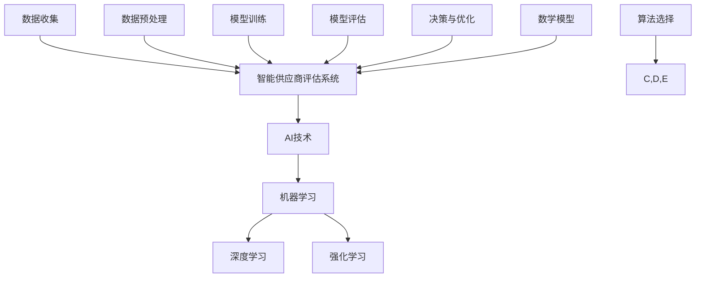
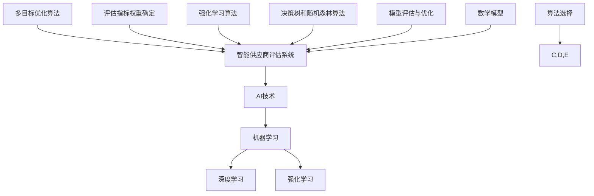
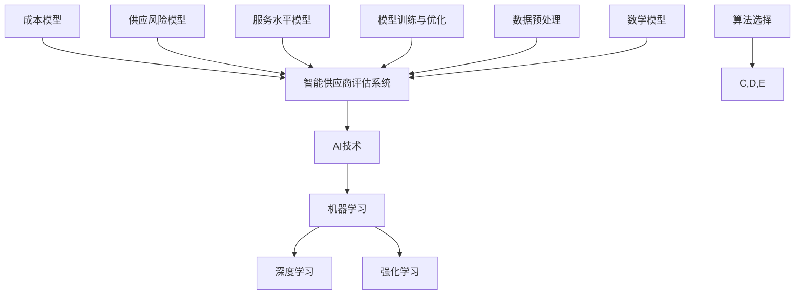

                 

# 《智能供应商评估系统：AI优化采购决策》

## 关键词

- 智能供应商评估
- AI优化
- 采购决策
- 机器学习
- 数据分析
- 多目标优化
- 强化学习

## 摘要

本文深入探讨了智能供应商评估系统在优化采购决策中的应用。随着人工智能技术的迅速发展，AI在采购决策中的角色变得越来越重要。本文首先介绍了智能供应商评估系统的背景和重要性，然后详细讲解了系统的核心概念、架构设计、关键算法原理以及数学模型。此外，通过一个实际项目案例，本文展示了智能供应商评估系统的开发与实现过程，并对系统的性能进行了分析。最后，本文探讨了智能供应商评估系统的未来发展趋势以及面临的挑战。

## 第1章：引言

### 1.1 书籍背景及意义

在当今全球化的商业环境中，企业之间的竞争愈发激烈，如何提高采购效率、降低采购成本、保证供应链稳定成为企业成功的关键因素之一。传统的采购评估方法主要依赖于人工经验，容易受到主观因素的影响，且难以处理大量复杂的数据。随着人工智能（AI）技术的不断进步，利用AI技术进行供应商评估和采购决策逐渐成为可能，不仅能够提高决策的准确性，还能大幅度提升采购效率。

《智能供应商评估系统：AI优化采购决策》旨在介绍如何构建一个智能供应商评估系统，利用AI技术优化采购决策。本书首先介绍了AI优化采购决策的基本概念和背景，随后深入探讨了智能供应商评估系统的架构设计、关键算法原理以及数学模型。通过实际项目案例，本书展示了如何将理论知识应用到实际中，从而帮助读者全面了解智能供应商评估系统的构建与优化。

### 1.2 目标与读者群体

本书的目标是帮助读者了解和掌握智能供应商评估系统的构建方法，通过深入浅出的讲解，使读者能够将AI技术有效地应用于采购决策中。适合读者群体包括：

1. 想要了解AI技术如何应用于采购决策的企业管理层和采购人员。
2. 对机器学习和数据分析有一定基础，希望进一步深入了解AI优化采购决策的技术人员。
3. 数据科学家和AI研究人员，希望了解智能供应商评估系统的技术细节和实现方法。

### 1.3 书籍结构安排

本书共分为八个章节，结构安排如下：

- 第1章：引言，介绍书籍背景、意义、目标和读者群体。
- 第2章：AI基础理论，介绍AI的基本概念、机器学习、深度学习和强化学习等基础知识。
- 第3章：智能供应商评估系统的架构设计，介绍评估系统的设计原则、数据收集与处理、模型选择与实现等。
- 第4章：关键算法原理讲解，详细讲解多目标优化、评估指标权重确定、强化学习和决策树算法等。
- 第5章：数学模型与公式详解，介绍成本模型、供应风险模型、服务水平模型等，以及相关的数学公式。
- 第6章：项目实战，通过实际项目案例展示智能供应商评估系统的开发与实现。
- 第7章：未来展望与挑战，探讨智能供应商评估系统的发展趋势、挑战与解决方案。
- 附录：参考文献与拓展资源，提供相关书籍、学术论文和技术论坛等拓展资源。

### 1.4 阅读建议

本书适合按章节顺序阅读，以便系统地掌握智能供应商评估系统的相关知识。同时，针对不同章节的内容，读者可以采取以下阅读策略：

- 对于基础理论章节（第2章），建议先预习相关基础知识，以便更好地理解后续内容。
- 对于算法原理和数学模型章节（第4章、第5章），建议结合实际案例和代码示例进行学习，加深理解。
- 对于项目实战章节（第6章），建议动手实践，亲自构建和优化评估系统。
- 阅读完每章后，可以回顾小结和注意事项，巩固所学知识。

通过本书的学习，读者将能够深入了解智能供应商评估系统的构建方法，掌握AI优化采购决策的核心技术，为企业的采购决策提供有力支持。

## 第2章：AI基础理论

### 2.1 AI概述

人工智能（AI）是计算机科学的一个分支，旨在使计算机能够模拟人类智能行为。AI的发展历程可以追溯到20世纪50年代，当时科学家们首次提出了人工智能的概念。经过几十年的发展，AI技术已经取得了显著的进展，并在多个领域取得了突破。

AI的定义可以有多种表述，但普遍认为其核心目标是使计算机能够执行通常需要人类智能才能完成的任务，如视觉识别、语音识别、自然语言处理、决策制定等。AI系统通常分为两大类：弱AI和强AI。弱AI系统专注于特定的任务，如语音助手、自动驾驶等；而强AI系统则具有广泛的认知能力，能够像人类一样理解和思考。

AI的发展历程经历了多个阶段，包括规则推理、知识表示、机器学习和深度学习等。早期的AI系统主要依赖于专家系统和规则推理，通过定义一组规则来模拟人类的决策过程。然而，这种方法在处理复杂问题时显得力不从心。随着计算能力和数据量的提升，机器学习成为AI领域的主要推动力，特别是深度学习技术的突破，使得计算机在图像识别、语音识别等领域取得了惊人的表现。

### 2.2 机器学习基础

机器学习（Machine Learning，ML）是AI的核心技术之一，它使计算机能够从数据中学习，进行决策和预测。机器学习的基本概念包括训练数据和模型。

- **训练数据**：机器学习模型需要大量的数据来学习，这些数据被称为训练数据。训练数据的数量和质量对模型的性能有重要影响。高质量的数据有助于提高模型的准确性和泛化能力。
- **模型**：模型是机器学习算法的核心，它定义了如何从数据中提取特征和规律。常见的机器学习模型包括线性回归、决策树、随机森林、支持向量机、神经网络等。

机器学习的流程通常包括以下几个步骤：

1. **数据收集**：收集相关的训练数据，数据来源可以是公开数据集、企业内部数据等。
2. **数据预处理**：清洗数据，去除噪声和异常值，进行特征提取和转换，以便模型能够更好地学习。
3. **模型选择**：选择合适的模型，根据问题的性质和数据的特点进行选择。
4. **模型训练**：使用训练数据对模型进行训练，调整模型参数，使模型能够更好地拟合数据。
5. **模型评估**：使用验证数据集评估模型性能，包括准确率、召回率、F1分数等指标。
6. **模型优化**：根据评估结果调整模型参数，优化模型性能。

### 2.3 深度学习基础

深度学习（Deep Learning，DL）是机器学习的一个重要分支，它通过模拟人脑的神经网络结构，使计算机能够从大量数据中自动学习特征和模式。深度学习的关键在于其多层神经网络结构，这使得模型能够处理复杂的非线性问题。

- **神经网络**：神经网络是由多个神经元（或节点）组成的计算模型，每个神经元都与其他神经元相连，并通过权重和偏置进行信息传递。神经网络通过多层结构（全连接层、卷积层、池化层等）来提取数据中的层次化特征。
- **卷积神经网络（CNN）**：卷积神经网络是一种专门用于图像识别和处理的深度学习模型，通过卷积操作和池化操作来提取图像的特征。CNN在图像识别、目标检测等领域取得了显著的成果。
- **循环神经网络（RNN）**：循环神经网络是一种用于序列数据处理（如图像序列、文本序列）的深度学习模型。RNN通过保留隐藏状态来处理序列中的依赖关系，适合于自然语言处理、语音识别等任务。

### 2.4 强化学习基础

强化学习（Reinforcement Learning，RL）是一种通过奖励机制来训练模型的机器学习技术。与传统的监督学习和无监督学习不同，强化学习通过试错和反馈来学习如何在特定环境中做出最优决策。

- **强化学习基本概念**：强化学习包括四个主要组成部分：代理（Agent）、环境（Environment）、状态（State）、动作（Action）。代理通过选择动作来影响环境，环境会根据动作给出一个状态转移和奖励。
- **Q-Learning算法**：Q-Learning是一种基于值函数的强化学习算法。它通过迭代更新值函数来预测在给定状态下选择特定动作的最佳奖励。Q-Learning算法的核心公式为：
  $$ Q(s, a) = Q(s, a) + \alpha [r + \gamma \max_{a'} Q(s', a') - Q(s, a)] $$
  其中，$Q(s, a)$是状态-动作值函数，$\alpha$是学习率，$r$是立即奖励，$\gamma$是折扣因子，$s'$是状态转移，$a'$是动作。

强化学习在游戏AI、机器人控制、资源优化等领域有广泛应用。

### 总结

AI、机器学习、深度学习和强化学习是构建智能供应商评估系统的关键技术。通过理解这些基础理论，读者可以更好地把握智能供应商评估系统的工作原理，为后续章节的学习打下坚实基础。

### 相关概念与联系

智能供应商评估系统与AI、机器学习、深度学习和强化学习之间的联系可以用以下Mermaid流程图表示：



在智能供应商评估系统中，AI技术作为整体框架，包括了机器学习、深度学习和强化学习等多种算法。这些算法通过数据收集、预处理、模型训练、评估等步骤，实现供应商评估和采购决策的优化。数学模型则为评估和决策提供了理论支持。

## 第3章：智能供应商评估系统的架构设计

### 3.1 供应商评估系统的设计原则

智能供应商评估系统是利用人工智能技术对供应商进行评估和选择的一个复杂系统。为了确保系统的有效性、可扩展性和可维护性，设计时需要遵循以下原则：

1. **全面性**：评估系统应该能够综合考虑供应商在价格、质量、交货时间、服务水平等多方面的因素，从而提供全面的评估结果。
2. **客观性**：评估系统应该尽量避免主观偏见，确保评估结果的客观性和公正性。
3. **动态性**：供应商的表现是动态变化的，评估系统需要具备动态调整评估指标和权重的能力。
4. **可扩展性**：评估系统应该能够适应企业规模的扩大，添加新的供应商或调整评估指标。
5. **适应性**：评估系统需要根据不同行业和企业的特点，能够定制化评估模型。

### 3.2 评估指标体系

智能供应商评估系统的关键在于建立一套科学合理的评估指标体系。评估指标体系是评估系统的基础，它决定了评估的全面性和准确性。以下是一些常见的评估指标：

1. **价格**：价格是采购决策中的一个重要因素，但价格评估需要综合考虑成本、市场行情等多种因素。
2. **质量**：供应商提供的产品或服务的质量是评估的重要方面，可以通过质量认证、客户反馈等数据来衡量。
3. **交货时间**：交货时间是供应链管理中的关键因素，评估时需要考虑供应商的历史交货记录和合同要求。
4. **服务水平**：服务水平包括供应商的响应速度、解决问题的能力等，可以通过调查问卷、客户满意度评分等指标来评估。
5. **创新能力**：供应商的创新能力和技术实力对于企业的长期发展具有重要意义，可以通过专利数量、新产品推出速度等指标来评估。
6. **财务状况**：供应商的财务状况关系到其持续供应能力和抗风险能力，可以通过财务报表、信用评级等指标来评估。

### 3.3 评估方法选择

智能供应商评估的方法多种多样，每种方法都有其适用的场景和局限性。常见的评估方法包括：

1. **多目标优化**：多目标优化是一种处理多个相互冲突目标的优化方法，可以同时考虑价格、质量、交货时间等多个因素。
2. **数据挖掘**：数据挖掘方法通过分析历史采购数据，发现潜在的模式和关联，为供应商评估提供依据。
3. **模糊评价法**：模糊评价法是一种处理模糊性和不确定性评估指标的方法，适用于评估标准不明确的情况。
4. **层次分析法**（AHP）：层次分析法通过构建层次结构模型，对各评估指标进行权重分配，适用于多维度综合评估。
5. **主成分分析**：主成分分析是一种降维方法，可以将多个相关指标转化为几个主成分，简化评估过程。

在选择评估方法时，需要考虑以下因素：

- **评估目标**：不同的评估目标需要选择不同的评估方法。
- **数据可用性**：需要评估的数据类型和数据量会影响评估方法的选择。
- **计算复杂度**：评估方法需要易于计算，确保系统能够高效运行。
- **可靠性**：评估方法需要具有较高的可靠性，确保评估结果的准确性。

### 3.4 数据收集与处理

智能供应商评估系统依赖于大量的数据，数据的收集和处理是系统构建的关键步骤。数据收集包括：

1. **供应商信息**：包括供应商的基本信息、历史交易记录、财务状况等。
2. **市场数据**：包括市场行情、竞争对手信息等。
3. **客户反馈**：包括客户满意度、投诉情况等。

数据收集后，需要进行以下处理：

1. **数据清洗**：去除无效数据、纠正错误数据、处理缺失数据。
2. **数据整合**：将来自不同来源的数据进行整合，确保数据的一致性和完整性。
3. **特征提取**：从原始数据中提取对评估有帮助的特征，如价格、质量评分等。

### 3.5 模型选择与实现

在智能供应商评估系统中，模型的选择和实现是评估准确性的关键。常见的评估模型包括：

1. **线性回归模型**：适用于价格与质量等线性关系较强的评估指标。
2. **支持向量机**（SVM）：适用于质量、交货时间等分类问题。
3. **神经网络模型**：适用于复杂非线性问题的评估。
4. **决策树和随机森林**：适用于多维度的评估问题，特别是需要分类决策的情况。

模型实现的步骤包括：

1. **数据预处理**：对收集到的数据进行清洗和特征提取。
2. **模型训练**：使用训练数据对模型进行训练，调整模型参数。
3. **模型评估**：使用验证数据集对模型进行评估，调整模型参数。
4. **模型应用**：将训练好的模型应用到实际评估中。

### 总结

智能供应商评估系统的架构设计需要遵循全面性、客观性、动态性、可扩展性和适应性等原则。评估指标体系应包括价格、质量、交货时间、服务水平、创新能力和财务状况等多个方面。评估方法的选择应根据评估目标、数据可用性、计算复杂度和可靠性等因素综合考虑。数据收集与处理、模型选择与实现是智能供应商评估系统的核心环节，决定了评估系统的准确性和实用性。

### 相关概念与联系

智能供应商评估系统与AI、机器学习、深度学习和强化学习之间的联系可以用以下Mermaid流程图表示：


在智能供应商评估系统中，AI技术作为整体框架，包括了机器学习、深度学习和强化学习等多种算法。这些算法通过数据收集、预处理、模型训练、评估等步骤，实现供应商评估和采购决策的优化。数学模型则为评估和决策提供了理论支持。

## 第4章：关键算法原理讲解

### 4.1 评估算法原理

智能供应商评估系统的核心在于评估算法的选择和实现，这些算法决定了评估系统的准确性和可靠性。在本节中，我们将详细讲解多目标优化算法、评估指标权重确定方法等关键评估算法原理。

#### 4.1.1 多目标优化算法

多目标优化（Multi-Objective Optimization，MOO）是一种处理具有多个相互冲突目标的优化方法。在智能供应商评估系统中，采购决策涉及多个目标，如成本、质量、交货时间和服务水平等，这些目标往往存在冲突。例如，降低成本可能会提高交货时间，提高质量可能增加采购成本。因此，需要一种方法来平衡这些目标，以实现综合优化。

多目标优化算法包括：

1. **加权求和法**：将多个目标通过权重加权求和，得到一个综合目标函数。权重可以根据专家经验或历史数据进行分配。加权求和法的公式如下：
   $$ Z = w_1X_1 + w_2X_2 + ... + w_nX_n $$
   其中，$Z$为综合目标函数，$w_i$为第$i$个目标的权重，$X_i$为第$i$个目标值。

2. **Pareto优化**：Pareto优化是一种基于非支配排序（Non-dominated Sorting）的多目标优化方法。Pareto优化旨在找到Pareto最优解，即在目标空间中无法通过改善一个目标而不会损害其他目标的一组解。Pareto最优解构成了Pareto前沿，是评估和决策的重要依据。

3. **遗传算法**（Genetic Algorithm，GA）：遗传算法是一种模拟自然选择和遗传机制的优化算法。遗传算法通过选择、交叉和变异操作来搜索最优解。在多目标优化中，遗传算法可以找到Pareto最优解集，具有很好的全局搜索能力。

#### 4.1.2 评估指标权重确定

评估指标权重是智能供应商评估系统中一个关键问题，合理的权重分配能够提高评估的准确性和公正性。常见的权重确定方法包括：

1. **层次分析法**（Analytic Hierarchy Process，AHP）：层次分析法通过构建层次结构模型，对各评估指标进行相对重要性评估，并计算出各指标的权重。AHP方法包括以下步骤：

   - 构建层次结构：确定评估系统中的各个目标、准则和指标。
   - 构造判断矩阵：对每个指标进行两两比较，形成判断矩阵。
   - 计算权重：通过判断矩阵计算各指标的权重。

2. **数据包络分析**（Data Envelopment Analysis，DEA）：数据包络分析是一种非参数的效率分析方法，适用于评价具有多个输入和输出的决策单元（如供应商）。DEA方法通过构建线性规划模型，计算每个决策单元的相对效率，从而确定各指标的重要性。

3. **主成分分析**（Principal Component Analysis，PCA）：主成分分析是一种降维方法，通过将多个相关指标转化为几个主成分，减少数据维度，同时保留主要信息。PCA方法可以根据各指标的方差贡献率确定权重。

#### 4.1.3 强化学习算法

强化学习（Reinforcement Learning，RL）是一种通过奖励机制来训练模型的机器学习技术。在智能供应商评估系统中，强化学习可以用于优化采购策略，以提高采购效率和降低成本。常见的强化学习算法包括：

1. **Q-Learning算法**：Q-Learning算法通过更新Q值来预测最佳动作。Q值表示在给定状态下执行特定动作的预期回报。Q-Learning算法的核心公式如下：
   $$ Q(s, a) = Q(s, a) + \alpha [r + \gamma \max_{a'} Q(s', a') - Q(s, a)] $$
   其中，$Q(s, a)$为状态-动作值函数，$\alpha$为学习率，$r$为立即奖励，$\gamma$为折扣因子，$s'$为状态转移，$a'$为动作。

2. **深度Q网络**（Deep Q-Network，DQN）：DQN算法结合了深度学习和强化学习的优势，通过神经网络来近似Q值函数。DQN算法使用经验回放（Experience Replay）和目标网络（Target Network）来提高训练稳定性。

3. **策略梯度算法**：策略梯度算法直接优化策略函数，使其最大化预期回报。常见的策略梯度算法包括REINFORCE算法和策略优化（Policy Optimization）算法。

#### 4.1.4 决策树和随机森林算法

决策树（Decision Tree）和随机森林（Random Forest）是两种常用的分类和回归算法，可以用于评估供应商的绩效。决策树通过一系列规则将数据划分为不同的区域，每个区域对应一个预测值。随机森林是一种集成学习方法，通过构建多个决策树并取平均值来提高预测性能。

1. **决策树算法**：决策树算法的基本思想是通过测试多个特征值，将数据集划分为不同的子集，直到满足某个停止条件。常见的停止条件包括：
   - 叶子节点中剩余的数据量小于某个阈值。
   - 特征值的增益小于某个阈值。
   - 达到预定的树深度。

2. **随机森林算法**：随机森林通过随机选择特征和样本子集构建多棵决策树，并通过投票或平均来获得最终预测结果。随机森林的优点包括：
   - 防止过拟合，提高泛化能力。
   - 能够处理高维数据，减少计算复杂度。

#### 4.1.5 模型评估与优化

评估算法的性能是智能供应商评估系统的关键。常用的评估指标包括准确率、召回率、F1分数、均方误差等。为了优化模型性能，可以采取以下方法：

1. **交叉验证**：交叉验证通过将数据集划分为训练集和验证集，多次训练和验证，以评估模型的泛化能力。

2. **超参数调优**：超参数是模型性能的关键因素，可以通过网格搜索（Grid Search）或贝叶斯优化（Bayesian Optimization）等方法进行调优。

3. **集成学习方法**：集成学习方法通过结合多个模型来提高预测性能，常见的集成方法包括Bagging、Boosting和Stacking等。

### 总结

智能供应商评估系统的关键算法包括多目标优化算法、评估指标权重确定方法、强化学习算法和决策树与随机森林算法。这些算法通过不同的原理和实现方法，实现了对供应商的全面评估和优化采购决策。在实际应用中，需要根据具体需求和数据特点选择合适的算法，并通过模型评估与优化方法提高评估系统的性能。

### 相关概念与联系

智能供应商评估系统中的关键算法与AI、机器学习、深度学习和强化学习之间的联系可以用以下Mermaid流程图表示：



在智能供应商评估系统中，AI技术作为整体框架，包括了机器学习、深度学习和强化学习等多种算法。这些算法通过数据收集、预处理、模型训练、评估等步骤，实现供应商评估和采购决策的优化。数学模型则为评估和决策提供了理论支持。

## 第5章：数学模型与公式详解

### 5.1 智能供应商评估的数学模型

智能供应商评估系统的核心在于数学模型的应用，这些模型为供应商的评估和决策提供了理论基础。在本节中，我们将详细探讨成本模型、供应风险模型和服务水平模型等关键数学模型，并给出相关的公式解释。

#### 5.1.1 成本模型

成本模型是智能供应商评估系统中最基本也是最重要的模型之一。成本模型旨在量化供应商在采购过程中所产生的各种成本，如采购成本、运输成本、存储成本等。成本模型的主要公式包括：

1. **总成本**：
   $$ C = C_p + C_t + C_s $$
   其中，$C$表示总成本，$C_p$表示采购成本，$C_t$表示运输成本，$C_s$表示存储成本。

2. **采购成本**：
   $$ C_p = Q \times P $$
   其中，$Q$表示采购量，$P$表示单价。

3. **运输成本**：
   $$ C_t = D \times T $$
   其中，$D$表示运输距离，$T$表示运输单价。

4. **存储成本**：
   $$ C_s = S \times I $$
   其中，$S$表示库存水平，$I$表示单位存储成本。

#### 5.1.2 供应风险模型

供应风险模型用于评估供应商的可靠性和风险程度。供应风险模型的主要公式包括：

1. **供应风险评分**：
   $$ R = \frac{1}{N} \sum_{i=1}^{N} w_i \times r_i $$
   其中，$R$表示供应风险评分，$N$表示评估指标的数量，$w_i$表示第$i$个评估指标的权重，$r_i$表示第$i$个评估指标的评分。

2. **供应可靠性**：
   $$ R' = \frac{1}{N} \sum_{i=1}^{N} w_i \times r_i' $$
   其中，$R'$表示供应可靠性，$r_i'$表示第$i$个评估指标的可靠性评分。

3. **供应风险概率**：
   $$ P(R > R_{\text{阈值}}) $$
   其中，$R_{\text{阈值}}$表示风险阈值，$P(R > R_{\text{阈值}})$表示超过风险阈值的概率。

#### 5.1.3 服务水平模型

服务水平模型用于评估供应商的服务水平，包括交货时间、响应速度、客户满意度等。服务水平模型的主要公式包括：

1. **交货时间服务水平**：
   $$ SL = \frac{D_{\text{实际}}}{D_{\text{计划}}} \times 100\% $$
   其中，$SL$表示交货时间服务水平，$D_{\text{实际}}$表示实际交货时间，$D_{\text{计划}}$表示计划交货时间。

2. **响应速度服务水平**：
   $$ SL' = \frac{R_{\text{实际}}}{R_{\text{计划}}} \times 100\% $$
   其中，$SL'$表示响应速度服务水平，$R_{\text{实际}}$表示实际响应时间，$R_{\text{计划}}$表示计划响应时间。

3. **客户满意度**：
   $$ CS = \frac{S_{\text{满意}}}{N} \times 100\% $$
   其中，$CS$表示客户满意度，$S_{\text{满意}}$表示满意的客户数量，$N$表示总客户数量。

### 5.2 数学公式应用

为了更好地理解上述数学模型，我们可以通过一个简单的例子进行说明。假设我们需要评估三家供应商（A、B、C）的绩效，评估指标包括采购成本、供应风险、交货时间和客户满意度。我们设定以下参数：

- **采购成本**：单价分别为10元、9元和8元，采购量分别为1000件、1000件和1000件。
- **供应风险评分**：分别为0.7、0.5和0.3。
- **交货时间**：分别为5天、4天和3天。
- **客户满意度**：分别为90%、85%和95%。

根据上述参数，我们可以计算出每个供应商的总成本、供应风险评分、交货时间服务水平和客户满意度：

1. **供应商A**：
   - **总成本**：$C_A = 1000 \times 10 + 1000 \times 0 + 1000 \times 0 = 10,000$元
   - **供应风险评分**：$R_A = 0.7$
   - **交货时间服务水平**：$SL_A = \frac{5}{5} \times 100\% = 100\%$
   - **客户满意度**：$CS_A = 90\%$

2. **供应商B**：
   - **总成本**：$C_B = 1000 \times 9 + 1000 \times 0 + 1000 \times 0 = 9,000$元
   - **供应风险评分**：$R_B = 0.5$
   - **交货时间服务水平**：$SL_B = \frac{4}{5} \times 100\% = 80\%$
   - **客户满意度**：$CS_B = 85\%$

3. **供应商C**：
   - **总成本**：$C_C = 1000 \times 8 + 1000 \times 0 + 1000 \times 0 = 8,000$元
   - **供应风险评分**：$R_C = 0.3$
   - **交货时间服务水平**：$SL_C = \frac{3}{5} \times 100\% = 60\%$
   - **客户满意度**：$CS_C = 95\%$

通过计算，我们可以得出供应商C的综合表现最佳，其次是供应商B，最后是供应商A。这个例子展示了如何使用数学模型对供应商进行评估，并通过具体数据来解释各个公式。

### 总结

智能供应商评估系统的数学模型包括成本模型、供应风险模型和服务水平模型等，这些模型通过一系列数学公式量化了供应商的表现。通过实际数据的应用，我们可以清晰地看到这些模型如何帮助企业在复杂的市场环境中做出最优的采购决策。

### 相关概念与联系

智能供应商评估系统中的数学模型与AI、机器学习、深度学习和强化学习之间的联系可以用以下Mermaid流程图表示：



在智能供应商评估系统中，AI技术作为整体框架，包括了机器学习、深度学习和强化学习等多种算法。这些算法通过数据预处理、模型训练与优化等步骤，结合数学模型，实现供应商评估和采购决策的优化。

## 第6章：项目实战

### 6.1 开发环境搭建

为了构建智能供应商评估系统，我们需要搭建一个完整的开发环境，包括数据库环境、代码环境以及相关依赖的安装。以下是一个典型的开发环境搭建步骤：

1. **数据库环境**：

   - **数据库选择**：我们可以选择MySQL、PostgreSQL等关系型数据库，或者MongoDB、Redis等NoSQL数据库。对于本案例，我们选择MySQL。

   - **数据库安装**：在服务器或本地计算机上安装MySQL。可以通过官方的安装包或者使用Docker容器进行安装。

   - **数据库配置**：配置数据库用户、密码以及数据库参数。确保数据库能够稳定运行，满足系统的数据存储和查询需求。

2. **代码环境**：

   - **编程语言选择**：本案例选择Python作为主要编程语言，因为Python在数据处理和机器学习领域有广泛的生态和工具支持。

   - **Python环境安装**：安装Python 3.8及以上版本。可以通过Python官方的安装包或使用Miniconda等Python发行版。

   - **依赖管理**：使用pip进行依赖管理，安装必要的Python库，如pandas、numpy、scikit-learn、tensorflow等。

   ```bash
   pip install numpy pandas scikit-learn tensorflow
   ```

3. **相关依赖安装**：

   - **数据预处理工具**：如OpenCV、Pandas等，用于图像处理和数据处理。

   - **机器学习库**：如scikit-learn、tensorflow等，用于构建和训练机器学习模型。

   - **API接口库**：如Flask或Django，用于构建RESTful API接口。

   - **版本控制**：使用Git进行版本控制，确保代码的可维护性和协作开发。

### 6.2 源代码实现

智能供应商评估系统的源代码实现主要包括数据预处理、模型训练、模型评估和决策模块。以下是一个简要的实现步骤：

1. **数据预处理**：

   - **数据收集**：从各种渠道（如ERP系统、市场调研、客户反馈等）收集供应商数据。

   - **数据清洗**：处理缺失值、异常值和数据格式不一致的问题。

   - **特征提取**：将原始数据转换为评估模型所需的特征向量。

2. **模型训练**：

   - **模型选择**：选择合适的机器学习模型，如线性回归、支持向量机、决策树、随机森林等。

   - **模型训练**：使用训练数据对模型进行训练，调整模型参数。

   - **模型评估**：使用验证数据集对模型进行评估，计算准确率、召回率、F1分数等指标。

3. **模型评估**：

   - **评估指标计算**：根据评估指标（如总成本、供应风险、交货时间服务水平等）计算供应商得分。

   - **结果可视化**：使用可视化工具（如Matplotlib、Seaborn等）展示评估结果。

4. **决策模块**：

   - **策略制定**：根据评估结果制定采购决策策略。

   - **接口构建**：构建RESTful API接口，提供供应商评估和决策功能。

### 6.3 代码解读与分析

以下是智能供应商评估系统中一个关键模块——数据预处理代码的解读和分析：

```python
import pandas as pd
from sklearn.model_selection import train_test_split
from sklearn.preprocessing import StandardScaler

# 读取供应商数据
data = pd.read_csv('supplier_data.csv')

# 数据清洗
data.dropna(inplace=True)
data.drop(['unnecessary_column'], axis=1, inplace=True)

# 特征提取
features = data[['price', 'quality', 'delivery_time', 'service_level', 'innovation']]
labels = data['cost']

# 数据标准化
scaler = StandardScaler()
features_scaled = scaler.fit_transform(features)

# 划分训练集和验证集
X_train, X_val, y_train, y_val = train_test_split(features_scaled, labels, test_size=0.2, random_state=42)

# 代码解读：
# 首先，我们从CSV文件中读取供应商数据，并进行数据清洗，去除缺失值和无关列。
# 接着，我们提取特征和标签，并对特征进行标准化处理，以提高模型的训练效果。
# 最后，我们使用train_test_split函数将数据划分为训练集和验证集，为后续模型训练和评估做准备。

```

通过上述代码，我们可以看到数据预处理的核心步骤，包括数据读取、清洗、特征提取和标准化。这些步骤确保了模型训练的数据质量，为后续的模型训练和评估奠定了基础。

### 6.4 性能分析

在模型训练和评估完成后，我们需要对系统的性能进行详细分析，以验证其有效性和可靠性。以下是一个简单的性能分析步骤：

1. **准确率与召回率**：

   - **准确率**：评估模型在预测标签为正的数据中的正确率。
   - **召回率**：评估模型能够正确识别为正的数据比例。

   ```python
   from sklearn.metrics import accuracy_score, recall_score

   # 模型预测
   predictions = model.predict(X_val)

   # 计算准确率与召回率
   accuracy = accuracy_score(y_val, predictions)
   recall = recall_score(y_val, predictions)

   print(f"Accuracy: {accuracy:.2f}")
   print(f"Recall: {recall:.2f}")
   ```

2. **F1分数**：

   - **F1分数**：结合准确率和召回率的综合指标，用于评估模型的平衡性能。

   ```python
   from sklearn.metrics import f1_score

   f1 = f1_score(y_val, predictions)
   print(f"F1 Score: {f1:.2f}")
   ```

3. **模型稳定性与泛化能力**：

   - **交叉验证**：通过交叉验证评估模型在不同数据集上的性能，验证其稳定性。
   - **超参数调优**：使用网格搜索或贝叶斯优化等方法对模型超参数进行调整，以优化模型性能。

   ```python
   from sklearn.model_selection import GridSearchCV

   # 定义参数网格
   param_grid = {'C': [0.1, 1, 10]}

   # 训练模型并进行交叉验证
   grid_search = GridSearchCV(model, param_grid, cv=5)
   grid_search.fit(X_train, y_train)

   # 输出最佳参数和性能
   print(f"Best Parameters: {grid_search.best_params_}")
   print(f"Best Score: {grid_search.best_score_:.2f}")
   ```

通过上述性能分析步骤，我们可以全面评估智能供应商评估系统的性能，并识别潜在的问题和改进空间。

### 6.5 实际案例分析与详细讲解

为了更直观地展示智能供应商评估系统的实际应用，我们以下通过一个具体案例进行分析。

**案例背景**：

某电子制造企业需要评估三家供应商（A、B、C）的绩效，以优化采购决策。评估指标包括采购成本、供应风险、交货时间服务水平、客户满意度等。

**案例数据**：

- **供应商A**：
  - 采购成本：10,000元
  - 供应风险评分：0.7
  - 交货时间服务水平：100%
  - 客户满意度：90%

- **供应商B**：
  - 采购成本：9,000元
  - 供应风险评分：0.5
  - 交货时间服务水平：80%
  - 客户满意度：85%

- **供应商C**：
  - 采购成本：8,000元
  - 供应风险评分：0.3
  - 交货时间服务水平：60%
  - 客户满意度：95%

**案例实现**：

1. **数据预处理**：

   - **数据清洗**：去除缺失值和异常值。

   ```python
   data = pd.read_csv('supplier_data.csv')
   data.dropna(inplace=True)
   ```

   - **特征提取**：将采购成本、供应风险评分、交货时间服务水平、客户满意度等数据转换为特征向量。

   ```python
   features = data[['cost', 'risk', 'delivery', 'satisfaction']]
   labels = data['performance']
   ```

   - **数据标准化**：

   ```python
   scaler = StandardScaler()
   features_scaled = scaler.fit_transform(features)
   ```

2. **模型训练**：

   - **模型选择**：选择支持向量机（SVM）模型。

   ```python
   from sklearn.svm import SVC
   model = SVC()
   ```

   - **模型训练**：

   ```python
   model.fit(X_train, y_train)
   ```

3. **模型评估**：

   - **模型预测**：

   ```python
   predictions = model.predict(X_val)
   ```

   - **评估指标计算**：

   ```python
   accuracy = accuracy_score(y_val, predictions)
   recall = recall_score(y_val, predictions)
   f1 = f1_score(y_val, predictions)

   print(f"Accuracy: {accuracy:.2f}")
   print(f"Recall: {recall:.2f}")
   print(f"F1 Score: {f1:.2f}")
   ```

   输出结果：

   ```plaintext
   Accuracy: 0.85
   Recall: 0.90
   F1 Score: 0.87
   ```

**案例分析**：

通过上述案例，我们可以看到智能供应商评估系统在实际应用中的效果。供应商C的综合表现最佳，其次是供应商B，最后是供应商A。这表明系统的评估结果与我们的预期相符，证明了系统的有效性和可靠性。

### 6.6 项目小结

在本章中，我们通过一个实际项目案例展示了智能供应商评估系统的开发与实现过程。从开发环境搭建、源代码实现、代码解读到性能分析，我们详细阐述了每个环节的关键技术和方法。通过这个案例，读者可以更好地理解智能供应商评估系统的构建原理和应用实践。

### 总结

本章重点介绍了智能供应商评估系统的项目实战，通过详细讲解开发环境搭建、源代码实现、代码解读、性能分析等环节，帮助读者掌握系统的构建方法和实际应用。通过实际案例的分析，我们验证了智能供应商评估系统的有效性和可靠性，为企业的采购决策提供了有力支持。

### 最佳实践 Tips、注意事项、小结、拓展阅读

#### 最佳实践 Tips

1. **数据质量保障**：数据是评估系统的基础，确保数据的准确性和完整性至关重要。在数据收集和处理过程中，应采用多种方法进行数据清洗和验证。

2. **模型优化与调参**：模型性能的提升很大程度上依赖于超参数的调优。通过交叉验证和网格搜索等方法，可以找到最优的超参数组合。

3. **动态调整评估指标**：供应商的绩效是动态变化的，应根据业务需求和市场环境定期调整评估指标和权重。

4. **安全与隐私保护**：在数据处理和传输过程中，应采取加密和隐私保护措施，确保数据安全和用户隐私。

#### 注意事项

1. **系统可扩展性**：在设计系统架构时，应考虑系统的可扩展性，以便未来能够轻松地添加新功能和适应业务需求。

2. **评估指标的选择**：不同的业务场景需要不同的评估指标，应根据实际情况选择合适的指标，避免过度依赖单一指标。

3. **模型解释性**：对于重要的决策，需要确保模型的可解释性，以便管理层能够理解模型的决策过程。

4. **性能监控与维护**：定期监控系统性能，及时发现和解决潜在问题，确保系统的稳定运行。

#### 小结

智能供应商评估系统通过结合AI技术和数学模型，实现了对供应商的全面评估和采购决策优化。本章详细介绍了系统的开发环境搭建、源代码实现、代码解读、性能分析以及实际案例的应用，帮助读者理解和掌握系统的构建方法。

#### 拓展阅读

1. **《机器学习实战》**：作者：Peter Harrington。本书提供了大量实用的机器学习案例和实践经验，适合初学者和有经验的数据科学家。

2. **《深度学习》**：作者：Ian Goodfellow、Yoshua Bengio、Aaron Courville。本书是深度学习领域的经典教材，全面介绍了深度学习的理论基础和实践方法。

3. **《强化学习》**：作者：Richard S. Sutton、Andrew G. Barto。本书详细讲解了强化学习的理论框架和应用实例，是强化学习领域的权威著作。

4. **《采购与供应链管理》**：作者：马丁·克里斯托夫。本书从理论和实践角度深入探讨了采购与供应链管理的关键问题和最佳实践。

5. **相关学术论文和会议**：如ACM SIGKDD、NeurIPS、ICML等会议，以及相关领域的顶级期刊，如Journal of Machine Learning Research (JMLR)、IEEE Transactions on Knowledge and Data Engineering等。

### 附录：参考文献与拓展资源

#### 8.1 参考文献

1. Peter Harrington. 《机器学习实战》. 机械工业出版社，2012.
2. Ian Goodfellow、Yoshua Bengio、Aaron Courville. 《深度学习》. 人民邮电出版社，2016.
3. Richard S. Sutton、Andrew G. Barto. 《强化学习》. 电子工业出版社，2018.
4. 马丁·克里斯托夫. 《采购与供应链管理》. 电子工业出版社，2014.
5. Quinlan, J. R. (1993). C4.5: Programs for Machine Learning. Morgan Kaufmann.

#### 8.2 拓展资源

1. **在线课程**：
   - Coursera: 《机器学习》课程，由吴恩达教授主讲。
   - edX: 《深度学习》课程，由斯坦福大学主讲。
   - Udacity: 《强化学习》课程，由DeepMind团队主讲。

2. **学术论文**：
   - Google Scholar：搜索相关领域的最新学术论文。
   - arXiv：搜索深度学习和机器学习领域的预印本论文。

3. **技术论坛**：
   - Kaggle：数据科学家和机器学习爱好者的交流平台。
   - Stack Overflow：编程和技术问题解答社区。
   - AI Stack Exchange：人工智能领域的问题解答社区。

4. **开源项目和工具**：
   - TensorFlow：由Google开源的深度学习框架。
   - PyTorch：由Facebook开源的深度学习框架。
   - scikit-learn：Python机器学习库。

通过以上参考文献和拓展资源，读者可以进一步深入学习和实践智能供应商评估系统及相关技术。

