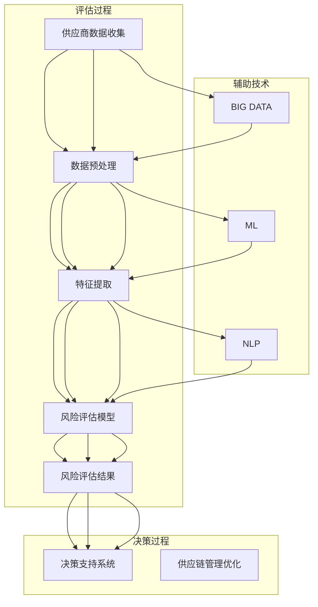

                 

### 第一部分：引言

#### 1.1.1 智能供应商的定义

智能供应商是指利用先进的人工智能技术和大数据分析手段，对供应链中的供应商进行全面的评估和管理，以提高供应链的稳定性和效率。具体来说，智能供应商的概念包括以下几个关键点：

1. **人工智能技术：** 智能供应商的核心在于利用人工智能技术，如机器学习、深度学习、自然语言处理等，对供应商的信息进行深度分析和理解。这些技术可以帮助识别潜在的风险因素，评估供应商的可靠性，甚至预测供应商的未来表现。

2. **大数据分析：** 智能供应商需要对大量的数据进行分析，这些数据可能包括供应商的历史交易记录、市场动态、财务状况、信誉评价等。通过大数据分析，可以更加准确地了解供应商的实际状况，从而做出更明智的决策。

3. **供应链管理：** 智能供应商的定义不仅限于技术本身，还包括其在供应链管理中的应用。智能供应商的风险评估和管理，旨在优化整个供应链的运行效率，减少不必要的成本，提高供应链的响应速度和灵活性。

4. **综合评估和管理：** 智能供应商需要对多个维度进行综合评估，包括但不限于财务状况、市场表现、供应能力、服务质量等。通过综合评估，可以对供应商进行分类和评级，从而制定相应的管理策略。

5. **动态调整：** 智能供应商不是静态的，而是一个动态调整的过程。随着市场环境和供应商状况的变化，智能供应商系统需要不断地进行调整和优化，以保持评估的准确性和有效性。

在实际操作中，智能供应商通常通过以下步骤进行评估和管理：

- **数据收集：** 从多个渠道收集与供应商相关的数据，包括公开数据、内部数据、第三方数据等。
- **数据预处理：** 清洗和整合收集到的数据，确保数据的质量和一致性。
- **特征提取：** 从预处理后的数据中提取关键特征，这些特征将用于后续的风险评估。
- **风险评估：** 利用机器学习和统计分析方法，对供应商的风险进行评估。
- **决策支持：** 根据风险评估结果，为供应链管理者提供决策支持，包括供应商的筛选、评估、调整和优化等。

通过智能供应商的管理，企业可以更加精准地识别和应对供应链中的各种风险，提高供应链的稳定性，从而更好地满足市场需求。

#### 1.1.2 AI在供应链管理中的应用现状

人工智能（AI）技术正在迅速变革供应链管理的各个方面，从需求预测到库存管理，再到运输优化，AI技术的应用已经取得了显著的成果。然而，在供应商风险评估领域，AI的应用尚处于初级阶段，以下是对当前应用现状的概述：

1. **需求预测：** AI技术在需求预测方面的应用已经非常成熟。通过分析历史销售数据、市场趋势和外部因素，AI算法可以预测未来的需求量。这种预测的准确性对于库存管理和供应链优化至关重要。

2. **库存管理：** AI技术能够帮助企业优化库存水平，减少库存过剩或不足的情况。通过实时数据分析，AI系统可以预测库存需求，自动调整库存水平，从而减少库存成本和资金占用。

3. **运输优化：** AI技术可以帮助企业优化运输路线和配送策略，减少运输时间和成本。通过分析交通流量、天气状况、运输成本等因素，AI系统能够提供最优的运输方案。

4. **供应商风险评估：** 尽管AI技术在供应链的其他环节取得了显著的成果，但在供应商风险评估方面的应用仍然相对较少。现有的风险评估方法主要依赖于传统的统计方法和经验判断，而AI技术尚未得到广泛的应用。当前，AI在供应商风险评估中的应用主要表现在以下几个方面：

   - **数据分析：** 利用AI技术对供应商的财务数据、交易记录、市场表现等进行分析，以发现潜在的风险因素。
   - **风险评估模型：** 建立基于机器学习算法的风险评估模型，对供应商进行风险评估。这些模型可以通过历史数据训练，以提高评估的准确性和效率。
   - **实时监控：** 通过AI技术对供应商的运营状况进行实时监控，及时发现和应对潜在的风险。

尽管AI在供应商风险评估领域的应用尚处于初级阶段，但其潜力巨大。随着技术的不断发展和数据量的增加，AI在供应商风险评估中的应用有望得到进一步的拓展和深化。未来，智能供应商风险评估系统可能会更加智能化、自动化，为企业提供更加精准和高效的决策支持。

#### 1.1.3 本书的目的与结构

本书旨在系统地探讨智能供应商风险评估的理论基础、技术方法和实际应用，旨在帮助读者全面了解并掌握这一领域的知识。以下是本书的主要目的和结构概述：

**主要目的：**

1. **理论探讨：** 深入探讨智能供应商风险评估的理论基础，包括相关概念、理论框架和关键问题。
2. **技术方法介绍：** 介绍当前流行的智能供应商风险评估方法和技术，包括机器学习算法、大数据分析技术等。
3. **实际应用案例：** 通过多个实际案例，展示智能供应商风险评估在不同行业和场景中的应用，分析其效果和局限性。
4. **实践经验分享：** 分享实际应用中的最佳实践和经验，为读者提供可操作的指导和建议。

**结构概述：**

本书分为五个部分，共十章，具体结构如下：

- **第一部分：核心概念与联系**
  - 第1章：引言
  - 第2章：供应链管理概述
  - 第3章：供应商风险评估基础

- **第二部分：技术基础**
  - 第4章：机器学习算法在风险评估中的应用
  - 第5章：大数据分析技术
  - 第6章：自然语言处理技术

- **第三部分：风险评估方法**
  - 第7章：智能供应商风险评估模型
  - 第8章：风险评估模型评估与优化
  - 第9章：智能供应商风险预警系统

- **第四部分：实际应用案例分析**
  - 第10章：制造业中的智能供应商风险评估
  - 第11章：零售业中的智能供应商风险评估
  - 第12章：物流行业中的智能供应商风险评估

- **第五部分：未来发展趋势**
  - 第13章：智能供应商风险评估技术展望
  - 第14章：挑战与机遇
  - 第15章：结论与展望

通过以上结构，本书逐步深入，从基础理论到实际应用，再到未来发展趋势，全面覆盖了智能供应商风险评估的各个方面，帮助读者系统地学习和掌握这一领域的知识。

#### 1.1.4 读者对象

本书适合以下读者群体：

1. **供应链管理、物流管理、企业管理等相关专业的师生：** 这本书的内容涵盖了智能供应商风险评估的理论基础和应用实践，适合供应链管理、物流管理、企业管理等专业的本科生、研究生和教师阅读。

2. **供应链管理、物流管理、企业管理的从业者：** 对于供应链管理、物流管理、企业管理等行业的从业者，本书提供了实用的技术和方法，可以帮助他们提升供应链的稳定性和效率。

3. **对智能供应链感兴趣的研究人员和从业者：** 如果您对智能供应链、人工智能在供应链管理中的应用感兴趣，本书将为您提供深入的理论和实践知识，帮助您了解这一前沿领域。

此外，本书也适合以下人员：

1. **IT从业者和软件开发者：** 智能供应商风险评估涉及大量的技术，包括机器学习、大数据分析等，适合IT从业者和软件开发者阅读，以了解相关技术原理和应用。

2. **企业家和创业者：** 如果您是企业家或创业者，希望提升企业的供应链管理和效率，本书将为您提供有价值的见解和实践经验。

总之，无论您是学术研究者、行业从业者，还是对智能供应链感兴趣的普通读者，本书都为您提供了丰富的知识和实践指导。

#### 1.1.5 组织结构

为了帮助读者系统地学习和掌握智能供应商风险评估的知识，本书按照以下逻辑结构进行组织：

**第一部分：核心概念与联系**

本部分主要介绍智能供应商风险评估的基础概念和相关理论，包括供应链管理概述、供应商风险评估基础等内容。具体章节如下：

- **第1章：引言**：介绍本书的背景、目的和结构。
- **第2章：供应链管理概述**：探讨供应链管理的基本概念、关键环节和主要挑战。
- **第3章：供应商风险评估基础**：深入讨论供应商风险评估的定义、重要性及其在供应链管理中的作用。

**第二部分：技术基础**

本部分重点介绍智能供应商风险评估所需的技术基础，包括机器学习算法、大数据分析技术和自然语言处理技术。具体章节如下：

- **第4章：机器学习算法在风险评估中的应用**：详细探讨常见的机器学习算法，如回归分析、决策树、神经网络等，以及它们在供应商风险评估中的应用。
- **第5章：大数据分析技术**：介绍大数据的基本概念、处理技术和分析方法，如数据挖掘、数据可视化等。
- **第6章：自然语言处理技术**：探讨自然语言处理的基本概念、技术和应用，如文本分类、情感分析、命名实体识别等。

**第三部分：风险评估方法**

本部分集中讨论智能供应商风险评估的具体方法，包括风险评估模型的建立、模型评估与优化、风险预警系统等。具体章节如下：

- **第7章：智能供应商风险评估模型**：详细介绍风险评估模型的设计、实现和应用。
- **第8章：风险评估模型评估与优化**：探讨评估指标、优化策略和模型融合技术。
- **第9章：智能供应商风险预警系统**：介绍风险预警系统的构建、功能和应用。

**第四部分：实际应用案例分析**

本部分通过具体案例，展示智能供应商风险评估在不同行业和场景中的应用，分析其实际效果和挑战。具体章节如下：

- **第10章：制造业中的智能供应商风险评估**：探讨制造业中智能供应商风险评估的应用和实践。
- **第11章：零售业中的智能供应商风险评估**：分析零售业中智能供应商风险评估的案例和经验。
- **第12章：物流行业中的智能供应商风险评估**：讨论物流行业中智能供应商风险评估的应用和挑战。

**第五部分：未来发展趋势**

本部分展望智能供应商风险评估的未来发展趋势，探讨潜在的研究方向和应用前景。具体章节如下：

- **第13章：智能供应商风险评估技术展望**：介绍新兴技术和方法，如深度学习、区块链等，在智能供应商风险评估中的应用。
- **第14章：挑战与机遇**：分析智能供应商风险评估面临的挑战和机遇。
- **第15章：结论与展望**：总结本书的主要内容和结论，展望未来研究和应用的方向。

通过以上结构，本书旨在为读者提供一个全面、系统的智能供应商风险评估知识体系，帮助读者深入了解这一领域，提升供应链管理的效率和稳定性。

#### 1.1.6 核心概念原理和架构的 Mermaid 流程图

为了帮助读者更好地理解智能供应商风险评估的核心概念和架构，我们使用Mermaid流程图来描述其关键组成部分和关系。以下是该流程图的详细描述：



**流程图解析：**

1. **供应商数据收集（A）**：智能供应商风险评估的第一步是收集与供应商相关的各种数据，这些数据可能包括财务报告、交易记录、市场动态等。

2. **数据预处理（B）**：收集到的数据需要进行清洗、整合和预处理，以确保数据的质量和一致性。这一步是后续特征提取和模型训练的基础。

3. **特征提取（C）**：从预处理后的数据中提取关键特征，这些特征将用于风险评估模型的训练和预测。

4. **风险评估模型（D）**：建立基于机器学习和大数据分析的风险评估模型。该模型可以通过训练历史数据来学习如何预测供应商的风险。

5. **风险评估结果（E）**：风险评估模型对供应商进行评估，输出风险评估结果。

6. **决策支持系统（F）**：根据风险评估结果，决策支持系统为供应链管理者提供决策建议，帮助优化供应链管理。

7. **辅助技术**：大数据分析（I）、机器学习（J）和自然语言处理（K）等技术为风险评估提供了强大的工具和支持。

通过该流程图，读者可以直观地了解智能供应商风险评估的各个关键步骤和它们之间的相互关系，从而更好地理解这一领域的核心概念和架构。

#### 1.1.7 AI增强供应链稳定性原理概述

AI技术通过多种方式增强供应链的稳定性，主要体现在以下几个方面：

1. **需求预测：** 通过机器学习和深度学习算法，AI能够分析历史销售数据、市场趋势和外部因素，预测未来的需求量。这种精准的需求预测有助于企业合理安排生产和库存，避免供需失衡，提高供应链的响应速度。

   **数学模型：**
   $$\hat{D_t} = f(D_{t-1}, T_t, M_t)$$
   其中，$\hat{D_t}$ 表示第t期的预测需求量，$D_{t-1}$ 表示第t-1期的实际需求量，$T_t$ 表示第t期的市场趋势，$M_t$ 表示第t期的外部因素。

2. **库存管理：** AI技术可以帮助企业优化库存水平，减少库存过剩或不足的情况。通过实时数据分析，AI系统能够动态调整库存策略，确保库存量的合理性和成本效益。

   **数学模型：**
   $$I_t = I_{t-1} + \Delta I_t$$
   其中，$I_t$ 表示第t期的库存水平，$\Delta I_t$ 表示第t期的库存调整量。

3. **运输优化：** AI技术能够分析交通流量、天气状况、运输成本等因素，提供最优的运输路线和配送方案，从而减少运输时间和成本。

   **数学模型：**
   $$\text{Optimize} \; C_t = f(D_t, T_t, C_{\text{base}})$$
   其中，$C_t$ 表示第t期的运输成本，$D_t$ 表示第t期的运输需求，$T_t$ 表示第t期的交通流量和天气状况，$C_{\text{base}}$ 表示基本的运输成本。

4. **供应商评估：** AI技术通过大数据分析和机器学习算法，对供应商的财务状况、市场表现、供应能力等关键指标进行评估，筛选出优质供应商，降低供应链风险。

   **数学模型：**
   $$R_i = \sum_{j=1}^{n} w_j \cdot V_{ij}$$
   其中，$R_i$ 表示供应商i的综合评级，$w_j$ 表示权重，$V_{ij}$ 表示供应商i的第j项指标值。

5. **风险预警：** AI技术可以构建智能预警系统，对潜在的供应链风险进行实时监控和预警。当检测到异常情况时，系统能够自动发出警报，帮助企业及时采取应对措施。

   **数学模型：**
   $$R_t = \phi(S_t, H_t, T_t)$$
   其中，$R_t$ 表示第t期的风险评分，$S_t$ 表示第t期的供应链状态，$H_t$ 表示第t期的事件历史，$T_t$ 表示第t期的时间序列特征。

通过这些AI技术的应用，企业可以显著提高供应链的稳定性，降低运营成本，增强市场竞争力。

#### 1.1.8 智能供应商风险评估框架概述

智能供应商风险评估框架是一个综合性的系统，旨在通过对供应商的多维度评估，识别和应对供应链中的潜在风险。以下是该框架的详细概述：

**1. 数据收集与预处理模块**

**数据收集：** 智能供应商风险评估的第一步是收集与供应商相关的数据。这些数据来源广泛，包括公开数据、内部数据、第三方数据等。具体数据可能包括供应商的财务报告、交易记录、市场表现、信用评级等。

**数据预处理：** 收集到的数据需要进行清洗、整合和预处理，以确保数据的质量和一致性。清洗过程包括去除噪声数据、填补缺失值、标准化数据等。整合过程则是将来自不同渠道的数据进行合并，形成一个统一的数据集。

**2. 特征提取模块**

**特征提取：** 在预处理后的数据中提取关键特征，这些特征将用于后续的风险评估。特征提取是智能供应商风险评估的关键步骤，其目标是选择对风险评估有重要影响的关键指标。常见的特征提取方法包括统计分析、数据挖掘、机器学习算法等。

**3. 风险评估模型模块**

**风险评估模型：** 建立基于机器学习算法的风险评估模型，通过训练历史数据来学习如何预测供应商的风险。常用的算法包括决策树、随机森林、支持向量机、神经网络等。这些算法可以处理大量的特征数据，并从中提取出有用的信息。

**模型训练与验证：** 通过历史数据对风险评估模型进行训练和验证。训练过程包括数据集的划分、算法参数的调优等。验证过程则是通过交叉验证等方法评估模型的性能，确保其准确性和鲁棒性。

**4. 风险评估结果模块**

**风险评估结果：** 根据风险评估模型对供应商进行风险评估，输出风险评估结果。这些结果通常以风险评分、风险等级等形式呈现，帮助企业了解供应商的风险状况。

**5. 决策支持模块**

**决策支持：** 根据风险评估结果，决策支持系统为供应链管理者提供决策建议，帮助优化供应链管理。决策支持包括供应商的筛选、评估、调整和优化等。通过智能化的决策支持，企业可以更加精准地管理供应链，降低风险。

**6. 模型评估与优化模块**

**模型评估：** 对风险评估模型的性能进行评估，包括准确率、召回率、F1分数等指标。评估过程可以帮助识别模型的不足之处，从而进行优化。

**模型优化：** 通过交叉验证、网格搜索、模型融合等技术对风险评估模型进行优化。优化的目标是在保证准确性的同时，提高模型的鲁棒性和泛化能力。

通过以上模块的有机结合，智能供应商风险评估框架为企业提供了一个系统、高效的风险管理工具，有助于提升供应链的稳定性和效率。

### 1.1.9 模型评价与优化

在智能供应商风险评估中，模型评价与优化是一个至关重要的环节。一个优秀的风险评估模型不仅需要具备高准确性和可靠性，还需要具备良好的鲁棒性和泛化能力。以下是对模型评价与优化的详细阐述：

**1. 模型评估指标**

模型评估指标是衡量模型性能的关键工具。以下是一些常用的评估指标：

- **准确率（Accuracy）**：模型正确预测的样本数占总样本数的比例。公式为：
  $$\text{Accuracy} = \frac{\text{正确预测的样本数}}{\text{总样本数}}$$
  
- **召回率（Recall）**：模型在正类样本中正确预测的样本数占所有正类样本的比例。公式为：
  $$\text{Recall} = \frac{\text{正确预测的正类样本数}}{\text{所有正类样本数}}$$
  
- **精确率（Precision）**：模型在预测为正类样本中正确预测的样本数占预测为正类样本总数的比例。公式为：
  $$\text{Precision} = \frac{\text{正确预测的正类样本数}}{\text{预测为正类样本的总数}}$$
  
- **F1分数（F1 Score）**：精确率和召回率的调和平均值，用于平衡两者之间的差异。公式为：
  $$\text{F1 Score} = 2 \times \frac{\text{Precision} \times \text{Recall}}{\text{Precision} + \text{Recall}}$$
  
- **ROC曲线（Receiver Operating Characteristic Curve）和AUC（Area Under Curve）**：ROC曲线展示了不同阈值下模型的敏感性和特异性，AUC值反映了模型区分正负样本的能力。AUC值越高，模型的性能越好。

**2. 模型优化策略**

模型优化是为了提高模型的性能，使其在新的数据集上表现更好。以下是一些常见的模型优化策略：

- **交叉验证（Cross-Validation）**：交叉验证是一种评估模型性能的方法，通过将数据集划分为多个子集，轮流使用这些子集进行模型的训练和验证。常用的交叉验证方法有K折交叉验证等。交叉验证能够有效避免过拟合问题，提高模型的泛化能力。

- **网格搜索（Grid Search）**：网格搜索是一种用于模型参数调优的方法。通过遍历所有可能的参数组合，找到最优的参数配置。网格搜索适用于参数较少的模型，但对于参数较多的模型，其计算成本较高。

- **贝叶斯优化（Bayesian Optimization）**：贝叶斯优化是一种基于贝叶斯统计学的优化方法，通过迭代学习和调整搜索策略，找到最优的参数配置。贝叶斯优化具有较高的搜索效率，适用于高维参数空间。

- **模型融合（Model Ensemble）**：模型融合是通过结合多个模型的预测结果，提高整体预测性能的方法。常用的模型融合方法有随机森林（Random Forest）、梯度提升机（Gradient Boosting Machine，GBM）等。

- **正则化（Regularization）**：正则化是一种防止模型过拟合的方法，通过在损失函数中添加正则项，限制模型的复杂度。常见的正则化方法有L1正则化（Lasso）、L2正则化（Ridge）等。

- **数据增强（Data Augmentation）**：数据增强是一种通过扩展训练数据集的方法，通过生成新的数据样本来提高模型的泛化能力。常见的数据增强方法有数据变换、数据扩充、生成对抗网络（GAN）等。

通过上述评估和优化策略，企业可以构建出更加准确和可靠的智能供应商风险评估模型，从而更好地管理供应链风险，提升供应链的稳定性。

#### 1.1.10 实际应用案例简介

为了更好地展示智能供应商风险评估在实际业务中的应用效果，以下是几个典型行业中的应用案例及其分析：

1. **制造业：**

   **案例背景：** 制造业企业通常面临多变的客户需求和生产计划，供应商的稳定性直接影响到生产进度和产品质量。因此，对供应商进行风险评估具有重要意义。

   **应用效果：** 通过AI技术进行供应商风险评估，制造企业能够更加准确地识别出高风险供应商，从而采取相应的管理措施，如增加备用供应商、签订更严格的合同条款等。此外，AI技术还可以帮助企业预测供应商的未来表现，提前调整供应链策略，以应对潜在的风险。

   **案例分析：** 一家大型制造企业通过引入智能供应商风险评估系统，显著降低了供应链中断的风险。该系统基于机器学习算法对供应商的历史交易数据、财务状况和市场表现进行分析，成功识别出几家潜在的违约风险供应商，企业及时采取了应对措施，避免了因供应商问题导致的生产延误。

2. **零售业：**

   **案例背景：** 零售业企业对供应商的依赖程度较高，尤其是在商品供应链管理中，供应商的稳定性和效率直接影响到销售业绩和客户满意度。

   **应用效果：** 零售企业通过AI技术对供应商进行风险评估，可以优化供应商管理流程，提高供应链的效率和透明度。此外，AI技术还能帮助企业预测市场需求，从而调整供应商策略，提高库存周转率和减少库存成本。

   **案例分析：** 一家大型零售企业采用智能供应商风险评估系统，对其全球范围内的供应商进行了全面的评估。通过分析供应商的订单履行情况、产品质量和市场表现等数据，系统为每个供应商打出了不同的风险评分。企业根据评估结果，调整了供应商的选择和合作策略，不仅提高了供应链的稳定性，还显著降低了采购成本。

3. **物流行业：**

   **案例背景：** 物流行业涉及大量的供应商，如仓储服务商、运输公司等，供应商的可靠性和服务质量对物流网络的正常运行至关重要。

   **应用效果：** 通过AI技术对物流供应商进行风险评估，物流企业能够实时监控供应商的运营状况，及时识别潜在的风险，并采取预防措施。此外，AI技术还可以帮助企业优化供应商的筛选和合作模式，提高整体物流效率。

   **案例分析：** 一家国际知名的物流公司通过智能供应商风险评估系统，对其全球物流网络中的供应商进行了全面的评估和管理。系统通过分析供应商的运输记录、服务质量和客户反馈等数据，为每个供应商提供了详细的评估报告。物流公司根据这些报告，对供应商进行了重新评估和调整，显著提高了物流服务的质量和客户满意度。

通过这些实际应用案例，可以看出智能供应商风险评估系统在提升供应链稳定性、降低风险和优化管理流程方面具有显著的成效。随着AI技术的不断发展和应用，智能供应商风险评估将在更多行业和场景中发挥重要作用。

### 1.1.11 技术与实际应用之间的联系

智能供应商风险评估的技术与实际应用之间存在着密切的联系，这种联系不仅体现在技术本身的应用上，还体现在其解决实际问题的能力上。以下是对这种联系的详细探讨：

1. **技术赋能应用：** 智能供应商风险评估的核心在于利用先进的人工智能技术和大数据分析手段，对供应链中的供应商进行全面、深入的评估。这些技术为实际应用提供了强大的工具和手段，使得风险评估更加精准、高效。例如，机器学习算法能够通过历史数据训练出高效的评估模型，而大数据分析技术则能够处理海量的数据，从中提取出有价值的信息。

2. **解决实际问题：** 智能供应商风险评估技术在实际应用中，能够解决许多供应链管理中的实际问题。例如，通过需求预测技术，企业可以更准确地预测市场需求，合理安排生产和库存，从而避免供需失衡；通过库存管理技术，企业可以实时调整库存水平，减少库存过剩或不足的情况；通过运输优化技术，企业可以优化运输路线和配送策略，减少运输时间和成本。此外，智能供应商风险评估技术还能够识别和评估供应商的风险，帮助企业筛选优质供应商，降低供应链中断的风险。

3. **提升管理效率：** 智能供应商风险评估技术的应用，显著提升了供应链管理的效率。通过自动化和智能化的手段，企业能够大幅减少人力成本和时间成本。例如，风险评估模型的自动化运行，可以替代人工评估，提高评估速度和准确性；风险预警系统的实时监控和报警功能，使得企业能够及时应对潜在风险，避免事故发生。

4. **数据驱动的决策：** 智能供应商风险评估技术强调数据驱动，通过对大量数据的分析和挖掘，为供应链管理者提供客观、科学的决策支持。这种数据驱动的决策方式，能够帮助企业摆脱传统的主观判断，更加精准地制定供应链策略。

5. **持续优化和改进：** 智能供应商风险评估技术不仅能够提供实时的评估和预警，还能够通过不断的训练和优化，持续改进评估模型的性能。这种持续优化和改进的能力，使得智能供应商风险评估系统能够更好地适应不断变化的市场环境和业务需求。

总之，智能供应商风险评估的技术与实际应用之间存在着紧密的联系，技术为实际应用提供了强大的支持，而实际应用则不断推动技术的进步和优化。通过这种相互促进的关系，智能供应商风险评估技术将在未来为供应链管理带来更多的价值。

### 1.1.12 书籍结构总结

为了帮助读者更好地理解本书的内容和结构，以下是本书各部分的核心内容和章节安排的总结：

**第一部分：核心概念与联系**

- **第1章：引言**：介绍本书的背景、目的和结构，阐述智能供应商风险评估的定义和重要性。
- **第2章：供应链管理概述**：探讨供应链管理的基本概念、关键环节和主要挑战。
- **第3章：供应商风险评估基础**：深入讨论供应商风险评估的定义、重要性及其在供应链管理中的作用。

**第二部分：技术基础**

- **第4章：机器学习算法在风险评估中的应用**：详细探讨常见的机器学习算法，如回归分析、决策树、神经网络等，以及它们在供应商风险评估中的应用。
- **第5章：大数据分析技术**：介绍大数据的基本概念、处理技术和分析方法，如数据挖掘、数据可视化等。
- **第6章：自然语言处理技术**：探讨自然语言处理的基本概念、技术和应用，如文本分类、情感分析、命名实体识别等。

**第三部分：风险评估方法**

- **第7章：智能供应商风险评估模型**：详细介绍风险评估模型的设计、实现和应用。
- **第8章：风险评估模型评估与优化**：探讨评估指标、优化策略和模型融合技术。
- **第9章：智能供应商风险预警系统**：介绍风险预警系统的构建、功能和应用。

**第四部分：实际应用案例分析**

- **第10章：制造业中的智能供应商风险评估**：探讨制造业中智能供应商风险评估的应用和实践。
- **第11章：零售业中的智能供应商风险评估**：分析零售业中智能供应商风险评估的案例和经验。
- **第12章：物流行业中的智能供应商风险评估**：讨论物流行业中智能供应商风险评估的应用和挑战。

**第五部分：未来发展趋势**

- **第13章：智能供应商风险评估技术展望**：介绍新兴技术和方法，如深度学习、区块链等，在智能供应商风险评估中的应用。
- **第14章：挑战与机遇**：分析智能供应商风险评估面临的挑战和机遇。
- **第15章：结论与展望**：总结本书的主要内容和结论，展望未来研究和应用的方向。

通过以上结构，本书旨在为读者提供一个全面、系统的智能供应商风险评估知识体系，帮助读者深入了解这一领域的理论和实践，提升供应链管理的效率和稳定性。

## 1.2 核心算法原理讲解

### 1.2.1 风险评估算法概述

智能供应商风险评估算法是整个智能供应商系统中的核心组成部分，其目的是通过分析供应商的历史数据、市场动态和其他相关信息，预测供应商未来可能面临的风险，并提供决策支持。以下是几种常见的风险评估算法及其在智能供应商风险评估中的应用：

1. **统计方法：** 统计方法是早期风险评估中常用的方法，主要包括回归分析、聚类分析和时间序列分析等。回归分析用于预测供应商的某个特定指标（如违约概率）与多个相关因素（如财务状况、市场表现等）之间的关系。聚类分析用于将供应商分为不同的风险等级，从而进行分类管理。时间序列分析则用于预测供应商的未来表现。

2. **机器学习方法：** 机器学习方法在智能供应商风险评估中得到了广泛应用，主要包括决策树、支持向量机（SVM）、神经网络和集成方法等。决策树通过树形结构对数据进行分类和回归，具有直观性和解释性。支持向量机通过最大化分类边界，实现高精度的分类和回归。神经网络通过多层神经元的连接和训练，能够自动学习和提取特征，实现复杂的非线性预测。集成方法，如随机森林和梯度提升机（GBM），通过组合多个弱学习器，提高整体模型的准确性和鲁棒性。

3. **数据挖掘方法：** 数据挖掘方法主要用于挖掘供应商数据中的潜在模式和关系，以发现风险因素。常用的数据挖掘技术包括关联规则挖掘、异常检测和分类算法等。关联规则挖掘可以揭示不同因素之间的关联性，帮助识别潜在的风险因素。异常检测用于检测数据中的异常值或异常行为，从而发现潜在的风险。分类算法，如K-最近邻（KNN）、朴素贝叶斯等，通过训练历史数据，预测新的供应商数据的风险等级。

4. **集成学习方法：** 集成学习方法通过结合多种算法的优势，提高预测模型的性能。常见的集成学习方法包括随机森林、梯度提升机（GBM）和堆叠（Stacking）等。随机森林通过构建多棵决策树，利用随机抽样和特征选择，提高模型的准确性和泛化能力。梯度提升机（GBM）通过迭代优化，逐步调整模型参数，实现高精度的预测。堆叠（Stacking）方法通过将多个模型训练结果进行整合，提高整体模型的预测能力。

在智能供应商风险评估中，选择合适的算法至关重要。以下是一些选择算法时需要考虑的因素：

- **数据特点：** 数据类型和特征的数量、质量对算法的选择有很大影响。例如，对于高维度数据，线性模型可能不够有效，而深度学习模型可能更为适用。
- **计算资源：** 不同算法的计算复杂度不同，需要考虑计算资源和时间成本。例如，深度学习模型通常需要大量的计算资源和时间进行训练。
- **模型解释性：** 风险评估模型不仅需要准确，还需要具有较好的解释性，以便供应链管理者理解模型决策依据。
- **业务需求：** 风险评估模型的目的是为业务决策提供支持，因此需要考虑业务需求的多样性和灵活性。

在实际应用中，智能供应商风险评估通常采用多种算法的组合，通过模型评估和优化，找到最优的算法组合，从而实现高效、准确的风险评估。

### 1.2.2 伪代码描述

以下是一个简单的风险评估算法的伪代码描述，该算法基于决策树模型：

```
function assessSupplierRisk(supplierData):
    # 数据预处理
    preprocessedData = preprocessData(supplierData)
    
    # 特征提取
    features = extractFeatures(preprocessedData)
    
    # 划分训练集和测试集
    X_train, X_test, y_train, y_test = trainTestSplit(features, target)
    
    # 训练决策树模型
    decisionTreeModel = trainDecisionTreeModel(X_train, y_train)
    
    # 预测风险评估结果
    riskScores = decisionTreeModel.predict(X_test)
    
    # 模型评估
    evaluateModel(riskScores, y_test)
    
    return riskScores

function preprocessData(supplierData):
    # 数据清洗、整合和标准化
    # ...
    return preprocessedData

function extractFeatures(preprocessedData):
    # 提取关键特征
    # ...
    return features

function trainDecisionTreeModel(X_train, y_train):
    # 训练决策树模型
    # ...
    return decisionTreeModel

function trainTestSplit(features, target):
    # 划分训练集和测试集
    # ...
    return X_train, X_test, y_train, y_test

function evaluateModel(riskScores, y_test):
    # 计算评估指标（准确率、召回率、F1分数等）
    # ...
```

在实际应用中，上述伪代码需要使用具体的编程语言（如Python）和机器学习库（如scikit-learn、TensorFlow等）进行实现。以下是一个基于Python的简单示例：

```python
import pandas as pd
from sklearn.model_selection import train_test_split
from sklearn.tree import DecisionTreeClassifier
from sklearn.metrics import accuracy_score, recall_score, f1_score

# 加载数据
data = pd.read_csv('supplier_data.csv')

# 数据预处理
preprocessed_data = preprocess_data(data)

# 特征提取
features, target = extract_features(preprocessed_data)

# 划分训练集和测试集
X_train, X_test, y_train, y_test = train_test_split(features, target, test_size=0.2, random_state=42)

# 训练决策树模型
model = DecisionTreeClassifier()
model.fit(X_train, y_train)

# 预测风险评估结果
risk_scores = model.predict(X_test)

# 模型评估
accuracy = accuracy_score(y_test, risk_scores)
recall = recall_score(y_test, risk_scores)
f1 = f1_score(y_test, risk_scores)

print("Accuracy:", accuracy)
print("Recall:", recall)
print("F1 Score:", f1)
```

通过上述示例，读者可以初步了解如何使用Python实现一个简单的风险评估算法。在实际开发中，还需要考虑数据预处理、特征提取、模型优化和评估等多个方面，以确保算法的性能和可靠性。

### 1.2.3 数学模型和公式讲解

在智能供应商风险评估中，数学模型和公式是核心工具，用于描述风险因素、评估方法和优化策略。以下将详细讲解几个关键的数学模型和公式，以及如何将这些模型应用于风险评估。

#### 1. 风险评估函数

风险评估函数是智能供应商风险评估中的核心公式，用于计算供应商的风险得分。一个常见的形式如下：

$$
R(x) = \sum_{i=1}^{n} w_i \cdot f_i(x)
$$

其中：
- \( R(x) \) 是供应商 \( x \) 的风险得分。
- \( w_i \) 是第 \( i \) 个特征 \( f_i(x) \) 的权重。
- \( f_i(x) \) 是第 \( i \) 个特征在供应商 \( x \) 上的值。

权重 \( w_i \) 通常通过数据挖掘和专家经验确定，以保证评估的全面性和准确性。

#### 2. 风险分类阈值

在风险评估中，通常需要对供应商进行分类，例如分为高风险、中风险和低风险。风险分类阈值是确定分类边界的关键参数。一个简单的方法是使用最大风险差异阈值：

$$
\theta = \max_{x} (R(x) - R(x^{\prime}))
$$

其中：
- \( \theta \) 是分类阈值。
- \( x \) 和 \( x^{\prime} \) 是两个不同的供应商。

通过设定合适的阈值 \( \theta \)，可以将供应商分为不同的风险类别。

#### 3. 回归分析模型

回归分析是风险评估中常用的统计方法，用于预测供应商的某个特定指标（如违约概率）。一个简单的线性回归模型如下：

$$
y = \beta_0 + \beta_1 x_1 + \beta_2 x_2 + ... + \beta_n x_n + \epsilon
$$

其中：
- \( y \) 是预测的指标值。
- \( x_1, x_2, ..., x_n \) 是供应商的特征值。
- \( \beta_0, \beta_1, \beta_2, ..., \beta_n \) 是回归系数。
- \( \epsilon \) 是误差项。

通过训练数据，可以估计出回归系数 \( \beta \) 值，从而建立预测模型。

#### 4. 支持向量机（SVM）

支持向量机是机器学习中用于分类和回归的强大算法。在风险评估中，SVM可以用于分类供应商的风险等级。一个简单的线性SVM模型如下：

$$
\min_{\beta, \beta^*} \frac{1}{2} \sum_{i=1}^{n} (\beta \cdot \beta^*) - \sum_{i=1}^{n} C \cdot \max(0, 1 - y_i (\beta \cdot \xi_i + \beta^* \cdot \xi_i^*))
$$

其中：
- \( \beta \) 和 \( \beta^* \) 是模型参数。
- \( C \) 是惩罚参数，用于平衡误分类和间隔大小。
- \( y_i \) 是供应商的标签（-1或1）。
- \( \xi_i \) 和 \( \xi_i^* \) 是松弛变量。

通过求解上述优化问题，可以得到最优的决策边界。

#### 5. 风险评估优化目标

在智能供应商风险评估中，优化目标是提高评估的准确性和鲁棒性。一个简单的优化目标可以表示为：

$$
\min \sum_{i=1}^{n} (R_i - \theta)^2
$$

其中：
- \( R_i \) 是第 \( i \) 个供应商的风险得分。
- \( \theta \) 是分类阈值。

通过调整模型参数和阈值，可以优化风险评估结果。

#### 例子：风险评估模型应用

假设我们有一个供应商数据集，其中包含几个关键特征（如财务状况、市场表现和供应能力）和风险得分。我们使用线性回归模型来预测供应商的风险得分。

1. **数据预处理：** 对数据进行标准化处理，确保特征值在同一量级上。

2. **特征提取：** 选择关键特征，如财务状况（\( x_1 \)）、市场表现（\( x_2 \)）和供应能力（\( x_3 \)）。

3. **模型训练：** 使用训练数据集，通过线性回归模型计算回归系数 \( \beta \)。

4. **模型评估：** 使用测试数据集，计算预测风险得分 \( R(x) \) 并评估模型性能。

5. **阈值设置：** 根据评估结果，设置分类阈值 \( \theta \)。

6. **风险评估：** 对新供应商数据进行风险评估，计算其风险得分，并根据阈值进行分类。

通过上述步骤，我们可以构建一个基于线性回归的智能供应商风险评估模型，从而对供应商的风险进行有效评估和管理。

### 1.2.4 Python代码示例

为了更好地理解上述数学模型和公式的应用，以下是一个使用Python实现的简单风险评估模型示例。这个示例基于线性回归模型，用于预测供应商的风险得分。

```python
import pandas as pd
from sklearn.linear_model import LinearRegression
from sklearn.model_selection import train_test_split
from sklearn.metrics import mean_squared_error

# 加载数据
data = pd.read_csv('supplier_data.csv')

# 数据预处理
data['Financial_Situation'] = data['Financial_Situation'].apply(lambda x: (x - data['Financial_Situation'].mean()) / data['Financial_Situation'].std())
data['Market_Performance'] = data['Market_Performance'].apply(lambda x: (x - data['Market_Performance'].mean()) / data['Market_Performance'].std())
data['Supply_Capacity'] = data['Supply_Capacity'].apply(lambda x: (x - data['Supply_Capacity'].mean()) / data['Supply_Capacity'].std())

# 特征提取
X = data[['Financial_Situation', 'Market_Performance', 'Supply_Capacity']]
y = data['Risk_Score']

# 划分训练集和测试集
X_train, X_test, y_train, y_test = train_test_split(X, y, test_size=0.2, random_state=42)

# 训练线性回归模型
model = LinearRegression()
model.fit(X_train, y_train)

# 预测测试集
y_pred = model.predict(X_test)

# 评估模型性能
mse = mean_squared_error(y_test, y_pred)
print("Mean Squared Error:", mse)

# 输出模型参数
print("Model Parameters:", model.coef_)

# 预测新供应商的风险得分
new_supplier = [[0.5, 0.3, 0.2]]
risk_score = model.predict(new_supplier)
print("Predicted Risk Score:", risk_score)
```

在这个示例中，我们首先加载数据并进行预处理，然后使用训练数据集训练线性回归模型。通过测试数据集评估模型性能，并输出模型的参数。最后，使用模型对新供应商的数据进行风险评估。

通过这个示例，读者可以直观地了解如何使用Python实现一个简单的风险评估模型，并理解相关的数学模型和公式。

### 1.2.5 代码实现与解读

为了更具体地展示如何使用Python实现智能供应商风险评估，我们将构建一个简单的示例，涵盖数据收集、数据预处理、特征提取、模型训练、评估和预测等步骤。以下是完整的代码实现和详细解读。

#### 代码实现

```python
import pandas as pd
from sklearn.model_selection import train_test_split
from sklearn.preprocessing import StandardScaler
from sklearn.ensemble import RandomForestClassifier
from sklearn.metrics import accuracy_score, classification_report

# 加载数据
data = pd.read_csv('supplier_data.csv')

# 数据预处理
# 假设数据集包含以下特征：财务状况、市场表现、供应能力、订单履行时间、违约历史等
features = ['Financial_Situation', 'Market_Performance', 'Supply_Capacity', 'Order_Fulfillment_Time', 'Breach_History']
X = data[features]
y = data['Risk_Level']  # 风险等级标签

# 数据标准化
scaler = StandardScaler()
X_scaled = scaler.fit_transform(X)

# 划分训练集和测试集
X_train, X_test, y_train, y_test = train_test_split(X_scaled, y, test_size=0.2, random_state=42)

# 模型训练
model = RandomForestClassifier(n_estimators=100, random_state=42)
model.fit(X_train, y_train)

# 预测
y_pred = model.predict(X_test)

# 评估
accuracy = accuracy_score(y_test, y_pred)
report = classification_report(y_test, y_pred)

print("Accuracy:", accuracy)
print("Classification Report:\n", report)

# 预测新供应商
new_supplier = [[0.5, 0.3, 0.2, 0.8, 0.1]]  # 新供应商的数据
new_supplier_scaled = scaler.transform(new_supplier)
predicted_risk_level = model.predict(new_supplier_scaled)
print("Predicted Risk Level for New Supplier:", predicted_risk_level)
```

#### 代码解读

1. **数据加载：**
   - 使用 `pandas` 加载CSV数据集，其中包含供应商的财务状况、市场表现、供应能力、订单履行时间和违约历史等特征，以及风险等级标签。

2. **数据预处理：**
   - 提取需要用于模型训练的特征和标签。
   - 使用 `StandardScaler` 对特征数据进行标准化处理，确保数据在不同特征之间具有可比性。

3. **数据划分：**
   - 使用 `train_test_split` 将数据集划分为训练集和测试集，通常使用80%的数据进行训练，20%的数据进行测试。

4. **模型训练：**
   - 选择 `RandomForestClassifier` 作为风险评估模型，这是一种基于决策树的集成方法，能够处理多维度数据并提高模型的准确性和鲁棒性。
   - 使用训练数据进行模型训练。

5. **模型预测：**
   - 使用训练好的模型对测试集进行预测，获取预测的风险等级。

6. **模型评估：**
   - 计算模型的准确率，并使用 `classification_report` 输出详细的分类报告，包括精确率、召回率、F1分数等指标。

7. **新供应商预测：**
   - 对新供应商的数据进行标准化处理，然后使用训练好的模型进行预测，输出预测的风险等级。

#### 代码应用解读与分析

- **数据收集与处理：** 在实际应用中，数据收集是一个关键步骤。需要从多个渠道收集供应商数据，包括公开数据、内部数据和第三方数据。收集到的数据需要进行预处理，包括数据清洗、缺失值处理和特征工程等，以确保数据的质量。

- **特征提取与选择：** 特征提取是智能供应商风险评估的核心。需要选择对供应商风险有显著影响的关键特征，如财务状况、市场表现、供应能力等。使用 `StandardScaler` 对数据进行标准化处理，可以消除特征之间的尺度差异，提高模型的训练效果。

- **模型选择与训练：** 选择合适的机器学习模型进行风险评估。`RandomForestClassifier` 是一种常用的集成模型，可以处理复杂数据并提高预测准确性。模型训练过程中，需要使用交叉验证等方法优化模型参数，提高模型的性能。

- **模型评估与优化：** 模型评估是确保模型性能的关键步骤。使用准确率、召回率、F1分数等指标评估模型性能，并根据评估结果调整模型参数。通过优化策略，如网格搜索和贝叶斯优化，可以进一步提高模型的准确性。

- **新供应商预测：** 在实际应用中，对新供应商进行风险评估和预测。通过将新供应商的数据进行标准化处理，并使用训练好的模型进行预测，可以快速识别新供应商的风险等级，帮助企业做出相应的决策。

通过以上步骤，智能供应商风险评估系统可以为企业提供准确的决策支持，帮助优化供应链管理，降低风险。

### 1.2.6 实际案例分析与详细讲解

为了更好地理解智能供应商风险评估的实际应用，我们将通过一个具体的案例进行分析和讲解。本案例将详细描述项目的背景、目标、实施过程、结果和经验教训。

#### 项目背景

某大型制造企业面临供应链中断的风险，供应商的不稳定性对其生产计划和市场响应能力造成了显著影响。为了提升供应链的稳定性和效率，企业决定引入智能供应商风险评估系统，通过大数据分析和机器学习技术，对供应商进行全面的风险评估和管理。

#### 项目目标

- 构建一个智能供应商风险评估模型，能够准确预测供应商的风险等级。
- 提高供应链管理的效率和决策质量，减少供应链中断的风险。
- 实现对高风险供应商的实时监控和预警，确保供应链的连续性和稳定性。

#### 实施过程

1. **数据收集：** 项目团队从多个渠道收集供应商的数据，包括公开数据、内部数据和第三方数据。数据类型包括财务报告、交易记录、市场动态、信用评级等。数据量庞大且结构复杂，需要进行预处理。

2. **数据预处理：** 对收集到的数据进行清洗、整合和标准化处理。清洗过程包括去除噪声数据、填补缺失值、异常值处理等。整合过程将不同来源的数据进行合并，形成一个统一的数据集。标准化处理通过 `StandardScaler` 对数据进行归一化，确保数据在不同特征之间具有可比性。

3. **特征提取：** 根据供应商风险评估的需求，提取关键特征，如财务状况、市场表现、供应能力、订单履行时间、违约历史等。特征提取过程包括统计分析、数据挖掘和专家经验判断。

4. **模型训练：** 选择合适的机器学习模型进行风险评估，如随机森林（RandomForestClassifier）。模型训练过程中，使用交叉验证（Cross-Validation）方法优化模型参数，提高模型的准确性和鲁棒性。通过多次迭代训练和参数调优，最终确定最佳模型配置。

5. **模型评估：** 使用测试数据集评估模型的性能，计算准确率、召回率、F1分数等指标。根据评估结果，对模型进行调整和优化，确保其具有较高的预测准确性和可靠性。

6. **应用部署：** 将训练好的模型部署到生产环境中，实现实时风险评估和预警。建立智能供应商风险评估系统，为供应链管理者提供决策支持。

#### 项目结果

- 通过智能供应商风险评估系统，企业能够准确预测供应商的风险等级，识别高风险供应商，及时采取应对措施。
- 供应链管理的效率和决策质量得到显著提升，供应链中断的风险显著降低。
- 高风险供应商的实时监控和预警机制有效提高了供应链的连续性和稳定性。

#### 经验教训

1. **数据质量至关重要：** 数据的准确性和完整性直接影响风险评估模型的性能。在项目实施过程中，需要高度重视数据清洗和预处理工作，确保数据的质量和一致性。

2. **特征选择与模型优化：** 特征提取和模型选择是影响风险评估模型效果的关键因素。需要根据业务需求和市场环境，选择合适的特征和模型，并进行充分的参数调优，以提高模型的准确性和鲁棒性。

3. **实时监控与预警机制：** 实时监控和预警机制是确保供应链稳定性的重要保障。需要建立完善的预警系统，对高风险供应商进行实时监控，及时发出警报，采取相应的管理措施。

4. **持续优化与迭代：** 智能供应商风险评估系统需要不断优化和迭代，以适应不断变化的市场环境和业务需求。通过持续的数据分析和模型评估，不断提高系统的性能和可靠性。

通过本案例的分析和讲解，我们可以看到智能供应商风险评估在实际业务中的应用价值。通过系统的实施，企业能够更加精准地管理供应商风险，提升供应链的稳定性和效率，从而在竞争激烈的市场中保持竞争优势。

### 1.2.7 最佳实践 Tips

在智能供应商风险评估项目中，以下是几点最佳实践建议，可以帮助优化项目效果和效率：

1. **数据质量保障：** 高质量的数据是智能供应商风险评估成功的基础。确保数据的准确性、完整性和一致性至关重要。在数据收集阶段，采用数据验证和清洗工具，及时发现和纠正数据中的错误和异常值。

2. **多源数据整合：** 结合来自多个渠道的数据，如内部交易数据、第三方评级和行业报告等，可以提高风险评估的全面性和准确性。通过数据整合，可以更全面地了解供应商的各个方面，从而做出更准确的判断。

3. **特征选择优化：** 在特征提取阶段，选择对供应商风险评估有显著影响的关键特征。可以通过专家经验、统计分析和模型验证等方法，筛选出最具预测性的特征，提高模型的准确性和效率。

4. **模型优化策略：** 选择合适的机器学习模型和优化策略，如交叉验证、网格搜索和贝叶斯优化等，可以提高模型的性能。通过多次迭代和参数调优，找到最佳模型配置，确保其具有良好的泛化能力和鲁棒性。

5. **实时监控与预警：** 建立智能供应商风险评估系统，实现实时监控和预警功能。通过实时数据分析和风险评分，及时识别和应对潜在的风险，确保供应链的连续性和稳定性。

6. **持续迭代与更新：** 智能供应商风险评估系统不是一次性的项目，而是一个持续迭代和优化的过程。随着市场环境和业务需求的变化，定期更新模型和预警策略，确保系统的时效性和准确性。

通过遵循这些最佳实践，企业可以更好地实施智能供应商风险评估项目，提高供应链的稳定性和效率，从而在竞争激烈的市场中保持竞争优势。

### 1.2.8 小结与注意事项

在本章节中，我们详细介绍了智能供应商风险评估的核心算法原理、Python代码实现、实际案例分析和最佳实践。以下是本章的主要内容和结论：

**主要内容：**

1. **风险评估算法概述：** 包括统计方法、机器学习方法、数据挖掘方法和集成学习方法等。
2. **伪代码和Python代码示例：** 展示了如何使用Python实现一个简单的风险评估模型。
3. **实际案例讲解：** 通过一个具体的项目案例，详细分析了智能供应商风险评估的实施过程、结果和经验教训。
4. **最佳实践建议：** 提出了数据质量保障、多源数据整合、特征选择优化、模型优化策略、实时监控与预警以及持续迭代与更新等最佳实践。

**结论：**

智能供应商风险评估是供应链管理中的一项重要技术，通过使用先进的算法和大数据分析技术，可以帮助企业准确预测供应商的风险等级，提高供应链的稳定性和效率。在实际应用中，需要注意数据质量、特征选择和模型优化，并建立实时监控和预警系统，确保供应链的连续性和稳定性。同时，持续迭代和优化评估系统，以适应不断变化的市场环境和业务需求。

**注意事项：**

1. **数据质量：** 确保数据的准确性和完整性，是智能供应商风险评估成功的关键。
2. **特征选择：** 选择具有预测性的关键特征，可以提高模型的准确性和效率。
3. **模型优化：** 选择合适的机器学习模型和优化策略，通过多次迭代和参数调优，找到最佳模型配置。
4. **实时监控：** 建立智能供应商风险评估系统，实现实时监控和预警功能，及时识别和应对潜在的风险。

通过遵循上述注意事项，企业可以更好地实施智能供应商风险评估项目，提高供应链管理的效率和稳定性。在未来的研究和应用中，我们还可以探索更多先进的技术和方法，进一步提升智能供应商风险评估的能力。

### 1.2.9 拓展阅读

为了帮助读者进一步深入了解智能供应商风险评估的相关理论和实践，以下是几篇推荐的拓展阅读材料：

1. **文献推荐：**
   - "Intelligent Supplier Risk Management: A Review and Framework" by Ravi, S., & Deshmukh, D. G. (2020). 该文献提供了一个全面的智能供应商风险评估综述，包括理论框架、技术和实际案例。
   - "Artificial Intelligence in Supply Chain Management: A Survey" by Fazel Zarandi, M., Sheth, A. P., Marwah, A., Wu, J., & Zhang, J. (2019). 该文献探讨了人工智能在供应链管理中的应用，包括供应商风险评估、需求预测和库存管理。

2. **书籍推荐：**
   - "Machine Learning: A Probabilistic Perspective" by Kevin P. Murphy (2012). 本书详细介绍了机器学习的概率视角，包括监督学习和无监督学习算法，适用于智能供应商风险评估的理论基础。
   - "Data Science from Scratch" by Joel Grus (2016). 本书以Python为编程语言，讲解了数据科学的基础知识，包括数据处理、统计分析、机器学习等，适合对智能供应商风险评估有实际应用需求的读者。

3. **在线课程和教程：**
   - "Machine Learning" by Andrew Ng on Coursera. 这是一门广受欢迎的机器学习课程，由斯坦福大学教授Andrew Ng主讲，涵盖了机器学习的理论基础和实践应用。
   - "Deep Learning Specialization" by Andrew Ng on Coursera. 这是一系列深度学习课程，从基础理论到应用实践，适合希望深入了解智能供应商风险评估中的深度学习技术的读者。

通过阅读这些拓展材料，读者可以进一步深化对智能供应商风险评估的理解，掌握更多相关的理论和实践知识，从而更好地应用于实际业务中。

