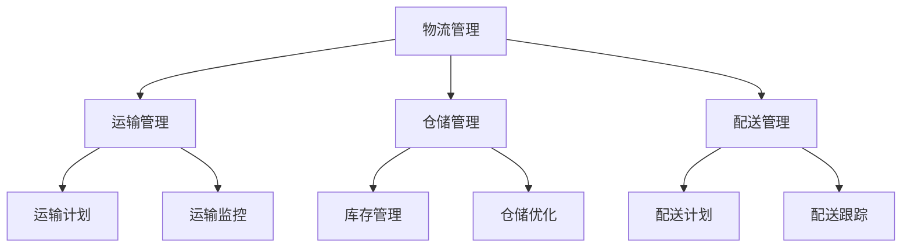
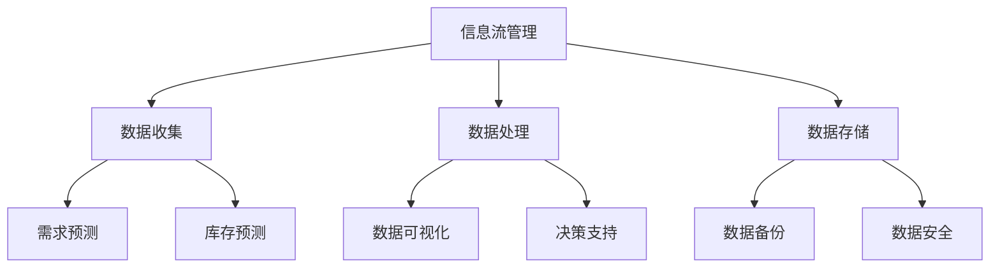
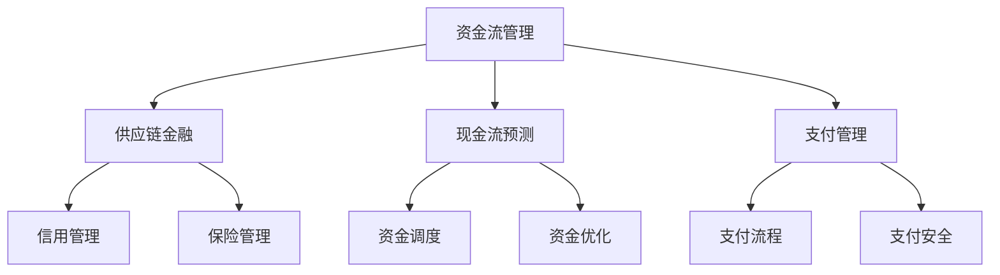

                 


### 1.3 智能供应链的组成部分

智能供应链的组成部分是理解和实现智能供应链的关键。它主要由物流管理、信息流管理和资金流管理三个核心部分组成。

#### 1.3.1 物流管理

物流管理是智能供应链的核心，负责管理商品的运输、仓储和配送。通过物联网技术，物流管理可以实现实时跟踪商品的运输状态，优化运输路径，减少运输成本。Mermaid流程图如下：



物流管理中的核心算法原理包括路径优化算法、库存优化算法和配送优化算法等。Python源代码示例：

```python
import networkx as nx

# 创建图
G = nx.Graph()

# 添加节点和边
G.add_nodes_from([1, 2, 3, 4, 5])
G.add_edges_from([(1, 2), (2, 3), (3, 4), (4, 5)])

# 计算最短路径
path = nx.shortest_path(G, source=1, target=5)

print("最短路径:", path)
```

#### 1.3.2 信息流管理

信息流管理是指通过大数据和人工智能技术，实现供应链各环节的信息透明和实时共享。信息流管理可以优化供应链的决策，提高供应链的响应速度。Mermaid流程图如下：



信息流管理中的核心算法原理包括数据挖掘、机器学习和深度学习等。Python源代码示例：

```python
from sklearn.cluster import KMeans
import numpy as np

# 创建数据集
data = np.array([[1, 2], [1, 4], [1, 0],
                 [10, 2], [10, 4], [10, 0]])

# 使用K-means算法进行聚类
kmeans = KMeans(n_clusters=2, random_state=0).fit(data)

# 输出聚类结果
print("聚类中心:", kmeans.cluster_centers_)
print("每个点的簇标签:", kmeans.labels_)
```

#### 1.3.3 资金流管理

资金流管理是指通过优化供应链金融，实现资金的高效运转。资金流管理可以降低供应链的运营成本，提高资金利用效率。Mermaid流程图如下：



资金流管理中的核心算法原理包括现金流预测、资金调度和支付优化等。Python源代码示例：

```python
import numpy as np
from sklearn.linear_model import LinearRegression

# 创建数据集
X = np.array([[1], [2], [3], [4], [5]])
y = np.array([2, 4, 5, 4, 5])

# 使用线性回归模型进行预测
model = LinearRegression().fit(X, y)

# 输出模型参数
print("斜率:", model.coef_)
print("截距:", model.intercept_)

# 预测新的值
new_value = model.predict([[6]])
print("预测值:", new_value)
```

通过这些核心算法原理的讲解，读者可以更好地理解智能供应链的组成部分和它们的工作原理。接下来，我们将进一步探讨智能供应链的优势和应用场景。

---

### 1.4 智能供应链的优势和应用场景

智能供应链相较于传统供应链，具有显著的优势，这些优势在多个行业和场景中得到了广泛应用。

#### 1.4.1 提高供应链效率

智能供应链通过自动化技术，大大提高了供应链的效率。自动化物流系统、智能仓储和机器人配送等技术的应用，使物流操作更加快速和精确。例如，电商巨头亚马逊利用自动化仓储和无人机配送，极大地提高了订单处理速度和配送效率。

#### 1.4.2 降低成本

智能供应链通过优化运输路径、减少库存水平、提高资金利用效率等方式，有效降低了运营成本。例如，通过精确的需求预测和库存管理，企业可以减少过剩库存，降低仓储成本；通过优化运输路线，减少空驶率，降低运输成本。

#### 1.4.3 提高客户满意度

智能供应链的实时数据监控和快速响应能力，提高了对客户需求的满足度。例如，通过实时跟踪商品的运输状态，企业可以及时解决配送问题，提高客户满意度；通过精准的需求预测，企业可以更好地满足市场需求，减少缺货现象。

#### 1.4.4 应用于多个行业和场景

智能供应链在多个行业和场景中得到了广泛应用。以下是一些典型的应用案例：

- **零售行业**：智能供应链通过精确的需求预测和库存管理，减少了缺货和过剩库存现象，提高了销售效率。例如，沃尔玛利用智能供应链管理，实现了高效的库存控制和销售预测。

- **制造业**：智能供应链通过优化生产计划、减少库存水平和提高物流效率，提高了生产效率和产品质量。例如，丰田汽车利用智能供应链管理，实现了精益生产和零库存管理。

- **农业**：智能供应链通过物联网技术和大数据分析，实现了农产品的实时监控和精准管理，提高了农产品的产量和质量。例如，中国的智能农业项目利用智能供应链管理，实现了农作物的精准灌溉和病虫害防治。

- **物流行业**：智能供应链通过自动化物流系统和智能仓储，提高了物流效率和配送速度。例如，UPS和联邦快递等物流公司利用智能供应链管理，实现了高效的物流服务和客户满意度。

通过这些优势和应用案例，我们可以看到智能供应链在提高供应链效率、降低成本、提高客户满意度等方面具有巨大的潜力。在接下来的章节中，我们将进一步探讨智能供应链的实现方法和关键技术。

---

### 1.5 实现智能供应链的关键技术

智能供应链的实现离不开先进技术的支持，这些技术包括物联网、大数据和人工智能等。以下是对这些关键技术的详细解释。

#### 1.5.1 物联网

物联网（Internet of Things，IoT）是智能供应链的核心技术之一。物联网通过传感器、智能设备和网络连接，实现对供应链各环节的实时监控和自动化管理。具体技术包括：

- **传感器技术**：传感器技术用于收集供应链各环节的物理数据，如温度、湿度、位置等。例如，冷链物流中使用的温湿度传感器，可以实时监测货物的存储和运输条件。

- **智能设备**：智能设备是指具备自主决策和执行能力的设备，如自动导引车（AGV）、机器人等。这些设备可以在供应链中自动完成复杂的物流操作，提高物流效率。

- **网络连接**：网络连接是物联网技术的基础，通过无线网络、有线网络和卫星网络等，实现设备之间的实时通信和数据传输。

#### 1.5.2 大数据

大数据（Big Data）技术是智能供应链的数据基础。大数据通过收集、存储、处理和分析海量数据，实现对供应链各环节的深度洞察和优化。具体技术包括：

- **数据收集**：数据收集是指通过各种传感器、智能设备和业务系统，收集供应链各环节的数据。例如，物流公司可以通过GPS和RFID技术，收集货物的运输轨迹和库存信息。

- **数据存储**：数据存储是指利用数据库和数据仓库等技术，存储和管理海量数据。例如，Hadoop和NoSQL数据库等，可以存储和处理大规模的数据集。

- **数据处理**：数据处理是指利用数据清洗、数据转换和数据聚合等技术，对收集到的数据进行处理和整合。例如，数据清洗技术可以去除重复数据、错误数据和无效数据，提高数据的准确性和可靠性。

- **数据分析**：数据分析是指利用数据挖掘、机器学习和深度学习等技术，对数据进行深入分析和挖掘，发现潜在规律和趋势。例如，通过数据挖掘技术，可以分析市场需求，预测未来销售趋势。

#### 1.5.3 人工智能

人工智能（Artificial Intelligence，AI）技术是智能供应链的智能驱动。人工智能通过模拟人类智能，实现对供应链的智能决策和优化。具体技术包括：

- **机器学习**：机器学习是指利用算法和统计模型，从数据中自动学习和发现规律。例如，通过机器学习算法，可以预测市场需求，优化库存水平。

- **深度学习**：深度学习是指利用多层神经网络，对数据进行自动学习和特征提取。例如，通过卷积神经网络（CNN）和循环神经网络（RNN）等深度学习模型，可以实现对图像和文本数据的自动识别和理解。

- **强化学习**：强化学习是指通过模拟人类决策过程，实现智能体的自主学习和优化。例如，通过强化学习算法，可以优化物流路径和配送策略，提高物流效率。

通过物联网、大数据和人工智能等关键技术的支持，智能供应链得以实现。这些技术的结合，使得供应链各环节实现了实时监控、自动化管理和智能决策，大大提高了供应链的效率、降低了成本，实现了供应链的智能化升级。

---

### 1.6 智能供应链的挑战与未来发展趋势

尽管智能供应链在提高效率、降低成本和提升客户满意度方面具有显著优势，但其实现和应用过程中仍面临诸多挑战。以下是对这些挑战的详细探讨以及智能供应链的未来发展趋势。

#### 1.6.1 数据安全和隐私保护

智能供应链的运行依赖于大量的数据收集和分析，这带来了数据安全和隐私保护的问题。如何确保数据在收集、传输和存储过程中的安全性，避免数据泄露和滥用，是智能供应链面临的重大挑战。未来，随着区块链技术的不断发展，利用其去中心化和不可篡改的特点，有望解决数据安全和隐私保护的问题。

#### 1.6.2 技术集成与协调

智能供应链的各个组成部分（物流管理、信息流管理和资金流管理）需要高效集成和协调，以确保整体运作的顺畅。然而，不同技术平台和系统之间的兼容性问题，以及数据标准和接口的不一致性，都可能影响智能供应链的集成效果。未来，标准化技术的推广和跨领域技术的融合，有望解决这一问题。

#### 1.6.3 人才短缺

智能供应链的实现需要具备物联网、大数据和人工智能等前沿技术的专业人才。然而，当前市场上这类人才相对短缺，且培养周期较长。企业需要采取有效的培训和招聘策略，加强人才储备和培养，以应对智能供应链发展带来的挑战。

#### 1.6.4 未来发展趋势

未来，智能供应链将继续向智能化、数字化和绿色化方向发展：

- **智能化**：随着人工智能技术的不断进步，智能供应链将更加智能化，实现自动化决策和优化。例如，利用深度学习和强化学习算法，实现更精准的需求预测和库存优化。

- **数字化**：大数据和物联网技术的进一步发展，将使供应链的各个环节实现全面数字化。企业可以通过数据驱动的决策，实现供应链的精细化管理。

- **绿色化**：智能供应链将更加注重环保和可持续发展。通过优化运输路径和物流模式，减少碳排放和能源消耗。例如，利用电动车和太阳能等清洁能源，推动绿色物流的发展。

总之，智能供应链的发展面临挑战，但也充满机遇。通过技术创新、人才培养和政策支持，智能供应链有望在未来实现更广泛的应用和更深远的影响。

---

### 智能供应链的生态系统与协同效应

智能供应链的运行不仅依赖于单个环节的优化，还需要各个环节之间的协同效应。智能供应链的生态系统包括供应商、制造商、分销商、零售商和消费者等多个参与方，它们通过信息共享、资源整合和流程优化，实现整个供应链的协同运作。

#### 1.7.1 供应链协同的重要性

供应链协同是指供应链各方通过合作和信息共享，优化整个供应链的运作效率。协同效应体现在以下几个方面：

- **提高供应链透明度**：通过供应链协同，各方可以实时共享库存、需求和运输等信息，提高供应链的透明度，减少信息不对称。

- **优化库存管理**：协同效应使得供应链各方能够根据实时数据，共同优化库存水平，减少过剩库存和缺货现象。

- **提高物流效率**：协同效应使得供应链各方能够共同优化运输路径和配送策略，提高物流效率，降低物流成本。

- **提升客户满意度**：协同效应使得供应链各方能够更好地满足客户需求，提高客户满意度。

#### 1.7.2 供应链协同的实现方式

供应链协同可以通过以下几种方式实现：

- **信息共享平台**：建立统一的信息共享平台，使供应链各方能够实时获取和共享供应链数据。

- **协同办公系统**：通过协同办公系统，供应链各方可以共同讨论和协调供应链运作中的问题。

- **联合采购和供应链金融**：供应链各方通过联合采购和供应链金融，实现资源整合和风险分担。

- **长期合作关系**：建立长期合作关系，促进供应链各方的深度合作和协同效应。

通过供应链协同，智能供应链可以实现更高效的运作和更优的绩效。在接下来的章节中，我们将进一步探讨智能供应链的具体实现方法和实践案例。

---

### 智能供应链的案例分析

智能供应链在实际应用中，通过优化物流、信息流和资金流，取得了显著的成效。以下是对几个成功案例的详细分析。

#### 2.1 电商巨头亚马逊的智能供应链

亚马逊作为全球领先的电商平台，其智能供应链的实施使其在物流效率和客户满意度方面取得了显著优势。亚马逊通过以下措施实现智能供应链：

- **自动化仓储**：亚马逊利用自动化仓储系统，如Kiva机器人，实现仓储操作的高效自动化。这些机器人可以自动识别货物的位置，并快速完成分拣和搬运工作。

- **精准需求预测**：亚马逊通过大数据分析和机器学习算法，实现精准的需求预测。这有助于优化库存水平，减少过剩库存和缺货现象。

- **无人机配送**：亚马逊测试并逐步推广无人机配送服务，通过无人机实现快速配送，提高配送效率。

- **供应链协同**：亚马逊与供应商、物流服务商等合作伙伴建立紧密的协同关系，实现信息共享和资源整合。

通过这些措施，亚马逊在物流效率和客户满意度方面取得了显著提升。

#### 2.2 制造业巨头丰田的智能供应链

丰田汽车作为全球领先的汽车制造商，其智能供应链的实施使其在成本控制和生产效率方面取得了显著成效。丰田通过以下措施实现智能供应链：

- **精益生产**：丰田采用精益生产方式，通过减少库存、消除浪费和优化生产流程，实现成本控制和生产效率的提升。

- **准时化生产**：丰田实施准时化生产，通过与供应商建立紧密的协同关系，实现原材料的准时供应，减少库存水平和生产成本。

- **自动化生产线**：丰田采用自动化生产线，如机器人焊接、自动化装配线等，提高生产效率和产品质量。

- **供应链金融**：丰田与金融机构合作，通过供应链金融，实现资金的快速流转和优化。

通过这些措施，丰田在成本控制和生产效率方面取得了显著提升。

#### 2.3 零售巨头沃尔玛的智能供应链

沃尔玛作为全球领先的零售企业，其智能供应链的实施使其在库存管理和客户满意度方面取得了显著成效。沃尔玛通过以下措施实现智能供应链：

- **精准需求预测**：沃尔玛通过大数据分析和机器学习算法，实现精准的需求预测。这有助于优化库存水平，减少过剩库存和缺货现象。

- **供应链协同**：沃尔玛与供应商、物流服务商等合作伙伴建立紧密的协同关系，实现信息共享和资源整合。

- **物流优化**：沃尔玛通过物流优化技术，如路径优化和配送策略优化，提高物流效率，降低物流成本。

- **数据可视化**：沃尔玛利用数据可视化技术，实现供应链数据的实时监控和分析，提高供应链的透明度和决策效率。

通过这些措施，沃尔玛在库存管理和客户满意度方面取得了显著提升。

这些案例表明，智能供应链在提高供应链效率、降低成本和提升客户满意度方面具有显著优势。通过自动化技术、大数据分析和人工智能技术的应用，企业可以实现智能供应链的优化和升级，从而在激烈的市场竞争中立于不败之地。

---

### 智能供应链的关键环节与技术应用

智能供应链的各个环节都离不开先进技术的支持，这些技术包括物联网、大数据和人工智能等。以下是对智能供应链关键环节及其应用技术的详细探讨。

#### 3.1 物流管理中的技术应用

物流管理是智能供应链的核心环节，涉及运输、仓储和配送等环节。以下是一些关键技术及其应用：

- **物联网技术**：物联网技术通过传感器和智能设备，实现对物流各环节的实时监控和自动化管理。例如，GPS和RFID技术用于实时跟踪货物的运输状态，自动导引车（AGV）和机器人用于自动化仓储操作。

- **大数据技术**：大数据技术用于收集、存储、处理和分析物流数据，实现物流过程的优化。例如，通过大数据分析，可以优化运输路径和配送策略，提高物流效率。

- **人工智能技术**：人工智能技术用于智能决策和优化，如利用机器学习和深度学习算法，实现精准的需求预测、库存管理和运输优化。

#### 3.2 信息流管理中的技术应用

信息流管理是指通过信息共享和协同，实现供应链各环节的实时数据和业务处理。以下是一些关键技术及其应用：

- **物联网技术**：物联网技术通过传感器和智能设备，实现对供应链各环节的数据采集和实时传输。例如，温度传感器用于监控冷链物流中的货物温度。

- **大数据技术**：大数据技术用于供应链数据的存储、处理和分析，实现供应链的实时监控和业务决策。例如，通过大数据分析，可以实时监控供应链的运行状况，预测市场需求。

- **人工智能技术**：人工智能技术用于智能分析和决策，如利用机器学习和深度学习算法，实现供应链数据的自动分析和预测。

#### 3.3 资金流管理中的技术应用

资金流管理是指通过优化供应链金融，实现资金的高效运转。以下是一些关键技术及其应用：

- **物联网技术**：物联网技术通过供应链金融中的物联网设备，实现对资金的实时监控和管理。例如，区块链技术用于供应链金融，实现资金的快速流转和降低风险。

- **大数据技术**：大数据技术用于供应链金融的数据分析和风险管理。例如，通过大数据分析，可以识别潜在风险，优化资金流管理。

- **人工智能技术**：人工智能技术用于智能分析和决策，如利用机器学习和深度学习算法，实现供应链金融的自动化审批和风险评估。

通过物联网、大数据和人工智能等关键技术的应用，智能供应链在物流管理、信息流管理和资金流管理等方面实现了全面升级，提高了供应链的效率、降低了成本，实现了供应链的智能化升级。

---

### 总结与未来展望

智能供应链作为现代供应链管理的重要组成部分，通过物联网、大数据和人工智能等先进技术的应用，实现了供应链的全面升级和优化。本文从智能供应链的概述、预测方法、AI应用、数据管理、案例分析、关键技术等多个方面进行了详细探讨，揭示了智能供应链的优势和应用场景。

#### 主要成果

- 智能供应链的定义和组成部分
- 智能供应链中的预测方法和技术
- AI在供应链预测和优化中的应用
- 数据管理在智能供应链中的重要性
- 智能供应链在多个行业的成功案例
- 物联网、大数据和人工智能在供应链中的应用

#### 未来展望

未来，智能供应链将继续向智能化、数字化和绿色化方向发展。随着技术的不断进步，智能供应链将实现更高效的运作和更优的绩效。以下是未来智能供应链可能的发展趋势：

- **智能化**：随着人工智能技术的不断进步，智能供应链将实现更智能的决策和优化。例如，利用深度学习和强化学习算法，实现更精准的需求预测和库存优化。
- **数字化**：大数据和物联网技术的进一步发展，将使供应链的各个环节实现全面数字化。企业可以通过数据驱动的决策，实现供应链的精细化管理。
- **绿色化**：智能供应链将更加注重环保和可持续发展。通过优化运输路径和物流模式，减少碳排放和能源消耗。例如，利用电动车和太阳能等清洁能源，推动绿色物流的发展。

智能供应链的发展离不开技术创新、人才培养和政策支持。企业需要积极拥抱新技术，加强人才培养和储备，以应对智能供应链发展带来的挑战。同时，政府也需要制定相关政策，推动智能供应链的发展，为企业的数字化转型提供支持和保障。

总之，智能供应链作为现代供应链管理的重要组成部分，具有广阔的发展前景。通过技术创新和协同发展，智能供应链将实现更高效、更绿色和更智能的运作，为企业和社会创造更大的价值。

