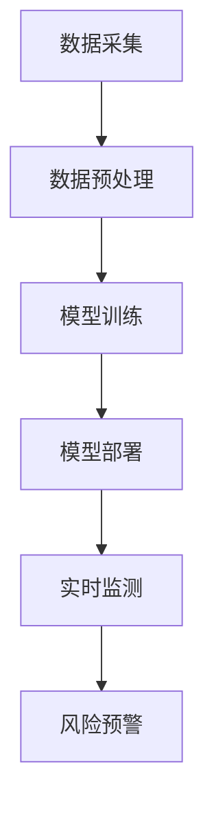

                 

### 文章标题：智能信用评估系统：AI增强风险控制

**关键词：** 智能信用评估，AI技术，风险控制，信用评分模型，数据采集，数据预处理，模型训练与优化，实时监测与预警，项目实战

**摘要：** 本文旨在探讨智能信用评估系统的构建与应用，重点介绍AI技术在信用评估领域的作用及其增强风险控制的效果。通过对智能信用评估系统的概述、架构设计、核心算法原理讲解、项目实战的详细剖析，为读者提供一套系统化的理解和实践指导。

---

### 第一部分：智能信用评估系统概述

#### 1.1 智能信用评估系统的概念和重要性

**1.1.1 信用评估系统的传统模式**

信用评估系统是金融机构和信用评级机构用于评估个人或企业信用风险的重要工具。传统模式通常依赖于历史数据和经验规则，通过对客户的信用记录、财务状况、还款行为等因素进行分析，来评估其信用等级。

**1.1.2 智能信用评估系统的变革**

随着AI技术的快速发展，传统的信用评估模式正面临重大变革。智能信用评估系统通过引入机器学习和大数据分析技术，能够更加精准地评估客户的信用风险，提高风险评估的效率和准确性。

**1.1.3 智能信用评估系统的应用领域**

智能信用评估系统广泛应用于金融、保险、电子商务等领域。例如，在金融领域，银行和金融机构可以利用智能信用评估系统来降低贷款违约风险；在电子商务领域，平台可以依据用户的信用评分来决定是否提供信用支付服务。

#### 1.2 AI在信用评估中的应用

**1.2.1 AI技术的核心优势**

AI技术具有强大的数据处理和分析能力，能够处理大规模、多维度的数据，并从中提取出隐藏的模式和关联。这使得AI在信用评估中具有显著的优势，能够更好地识别和预测潜在的风险。

**1.2.2 AI技术在信用评估中的实际应用**

AI技术在信用评估中主要用于以下几个方面：

1. **数据采集**：利用AI技术自动采集和处理各种数据源，如社交媒体、交易记录、信用记录等。
2. **数据预处理**：通过自然语言处理、图像识别等技术对采集到的数据进行清洗、归一化和特征提取。
3. **模型训练与优化**：利用机器学习算法训练信用评分模型，并通过交叉验证和超参数调优来优化模型性能。
4. **实时监测与预警**：利用实时数据分析技术，对客户的信用行为进行监控，并设置预警机制来及时发现风险。

**1.2.3 智能信用评估系统的未来发展趋势**

随着AI技术的不断进步，智能信用评估系统将在以下几个方面得到进一步发展：

1. **个性化评估**：基于用户的个性化数据，提供更加精准和个性化的信用评估服务。
2. **实时评估**：利用实时数据分析和预警技术，实现实时监控和风险评估。
3. **跨行业应用**：智能信用评估系统将在更多行业得到应用，如零售、物流、教育等。

### 第二部分：智能信用评估系统架构

#### 2.1 智能信用评估系统架构概述

**2.1.1 系统架构设计原则**

智能信用评估系统的设计原则主要包括：

1. **模块化设计**：将系统功能拆分为多个模块，便于维护和扩展。
2. **高扩展性**：支持大数据量和高并发场景，能够灵活应对业务需求的变化。
3. **高可用性**：系统具备高可用性，确保服务的稳定性和可靠性。
4. **安全性**：保护用户数据的安全，防止数据泄露和滥用。

**2.1.2 系统架构的组成模块**

智能信用评估系统通常包括以下几个关键模块：

1. **数据采集模块**：负责从各种数据源收集相关信息。
2. **数据预处理模块**：对采集到的数据进行清洗、归一化和特征提取。
3. **模型训练模块**：利用机器学习算法训练信用评分模型。
4. **模型部署模块**：将训练好的模型部署到生产环境中。
5. **实时监测模块**：对客户的信用行为进行实时监控和预警。

**2.1.3 系统架构的Mermaid流程图**



#### 2.2 数据采集与管理

**2.2.1 数据采集方法**

数据采集是智能信用评估系统的第一步，常用的数据采集方法包括：

1. **结构化数据采集**：从数据库、ERP系统等结构化数据源中获取数据。
2. **非结构化数据采集**：通过爬虫、API接口等技术从互联网、社交媒体等非结构化数据源中获取数据。
3. **混合数据采集**：结合结构化和非结构化数据采集方法，获取更全面的数据信息。

**2.2.2 数据清洗与预处理**

数据清洗与预处理是数据挖掘和分析的重要环节，主要任务包括：

1. **数据清洗**：去除重复、错误或无关的数据。
2. **数据归一化**：将不同尺度的数据转换到同一尺度，便于后续处理。
3. **特征提取**：从原始数据中提取出有用的特征，用于模型训练和评估。

**2.2.3 数据存储与管理策略**

数据存储与管理策略包括：

1. **分布式存储**：采用分布式数据库或分布式文件系统来存储大量数据。
2. **数据加密**：对敏感数据进行加密，确保数据安全。
3. **数据备份与恢复**：定期备份数据，并在发生故障时快速恢复。
4. **数据质量管理**：建立数据质量监控系统，确保数据的准确性、完整性和一致性。

#### 2.3 模型训练与优化

**2.3.1 模型选择与设计**

在选择和设计信用评分模型时，需要考虑以下因素：

1. **数据特性**：根据数据的类型、尺度和分布特性选择合适的模型。
2. **业务目标**：根据业务需求，选择能够最大化预测准确率或最小化成本损失的目标函数。
3. **模型复杂度**：在保证预测效果的前提下，尽量选择计算复杂度较低的模型。

**2.3.2 模型训练策略**

模型训练策略包括：

1. **数据划分**：将数据集划分为训练集、验证集和测试集，用于模型训练、验证和测试。
2. **超参数调优**：通过交叉验证等方法，选择最优的超参数，提高模型性能。
3. **正则化**：采用正则化技术，防止模型过拟合。

**2.3.3 模型评估与优化**

模型评估与优化包括：

1. **评估指标**：根据业务需求选择合适的评估指标，如准确率、召回率、F1分数等。
2. **模型优化**：通过调整模型结构、优化算法、增加特征等方法，提高模型性能。
3. **模型部署**：将训练好的模型部署到生产环境中，实现实时信用评估。

### 第三部分：核心算法原理讲解

#### 3.1 信用评分模型

**3.1.1 评分模型的分类**

信用评分模型主要分为以下几类：

1. **线性模型**：如逻辑回归、线性回归。
2. **决策树模型**：如CART、随机森林。
3. **集成模型**：如枚举建模、多层感知机。
4. **深度学习模型**：如卷积神经网络、循环神经网络。

**3.1.2 评分模型的构建过程**

评分模型的构建过程包括：

1. **数据收集**：收集与信用评估相关的数据，如还款记录、财务状况等。
2. **数据预处理**：对收集到的数据进行清洗、归一化和特征提取。
3. **模型选择**：根据数据特性和业务需求选择合适的模型。
4. **模型训练**：使用训练数据训练模型。
5. **模型评估**：使用验证集和测试集评估模型性能。
6. **模型优化**：根据评估结果调整模型参数和结构。

**3.1.3 评分模型的评估指标**

常见的评估指标包括：

1. **准确率**：预测正确的样本数占总样本数的比例。
2. **召回率**：预测正确的正样本数占总正样本数的比例。
3. **F1分数**：准确率和召回率的调和平均值。
4. **ROC曲线**：曲线下的面积（AUC）。

#### 3.2 风险模型

**3.2.1 风险模型的定义**

风险模型是用于评估信用风险的概率分布或量化信用风险的工具。

**3.2.2 风险模型的构建方法**

风险模型的构建方法包括：

1. **统计方法**：如贝叶斯网络、风险评分模型等。
2. **机器学习方法**：如支持向量机、随机森林等。
3. **深度学习方法**：如卷积神经网络、循环神经网络等。

**3.2.3 风险模型的评估与优化**

风险模型的评估与优化包括：

1. **评估指标**：如损失函数、AUC、F1分数等。
2. **模型优化**：如超参数调优、模型结构调整等。

#### 3.3 实时监测与预警

**3.3.1 实时监测系统设计**

实时监测系统设计包括：

1. **数据流处理**：采用数据流处理技术，实时采集和处理客户的信用行为数据。
2. **实时分析**：利用机器学习算法，实时分析客户的信用行为，识别潜在风险。
3. **预警机制**：设定预警阈值，一旦发现风险信号，立即触发预警。

**3.3.2 预警机制构建**

预警机制构建包括：

1. **预警指标**：设定与信用风险相关的预警指标，如逾期率、坏账率等。
2. **预警策略**：根据预警指标和风险等级，制定相应的预警策略，如电话催收、法律追讨等。
3. **预警反馈**：对预警结果进行反馈和跟踪，持续优化预警机制。

**3.3.3 预警指标的设定与优化**

预警指标的设定与优化包括：

1. **历史数据分析**：分析历史数据，确定合理的预警指标阈值。
2. **模型优化**：利用机器学习算法，优化预警指标的设定，提高预警准确性。
3. **用户反馈**：收集用户反馈，持续优化预警机制，提高用户体验。

### 第四部分：项目实战

#### 4.1 智能信用评估项目背景

**4.1.1 项目背景介绍**

智能信用评估项目旨在为金融机构和电商平台提供高效、准确的信用评估服务，降低信用风险，提高业务收益。

**4.1.2 项目目标与需求**

项目目标：
1. 提高信用评估的准确性。
2. 提高信用评估的实时性。
3. 提供个性化的信用评估服务。

项目需求：
1. 数据采集与处理：从多种数据源采集用户数据，并进行清洗、归一化和特征提取。
2. 模型训练与部署：训练并部署信用评分模型，实现实时评估。
3. 实时监测与预警：实时监控用户信用行为，设定预警机制。

#### 4.2 开发环境搭建

**4.2.1 开发工具与软件环境配置**

开发工具：
1. Python：主要编程语言。
2. Jupyter Notebook：数据分析与建模工具。
3. Scikit-learn：机器学习库。
4. Pandas：数据处理库。

软件环境：
1. Python 3.8
2. Jupyter Notebook 7.0
3. Scikit-learn 0.22
4. Pandas 1.1

**4.2.2 数据库的搭建与配置**

数据库：
1. MySQL：用于存储用户数据和信用评分结果。

配置：
1. MySQL 8.0
2. 数据库用户：root
3. 数据库密码：password
4. 数据库名：credit_evaluation

#### 4.3 源代码实现与解读

**4.3.1 数据采集与预处理**

```python
# 数据采集
import data_collection_module

# 数据预处理
def preprocess_data(data):
    # 伪代码：对数据进行清洗、归一化等处理
    processed_data = ...
    return processed_data
```

**4.3.2 模型训练与评估**

```python
# 模型训练
def train_model(data):
    # 伪代码：训练信用评分模型
    model = ...
    model.fit(data)
    return model

# 模型评估
def evaluate_model(model, test_data):
    # 伪代码：评估模型性能
    performance = model.evaluate(test_data)
    return performance
```

**4.4 代码解读与分析**

**4.4.1 数据采集与预处理模块解析**

数据采集与预处理模块负责从各种数据源收集用户数据，并进行清洗、归一化和特征提取。这是信用评估系统的关键步骤，直接影响到模型训练和评估的性能。

**4.4.2 模型训练与评估模块解析**

模型训练与评估模块负责训练信用评分模型，并使用验证集和测试集评估模型性能。通过调整模型参数和超参数，可以优化模型性能，提高信用评估的准确性。

#### 4.5 项目总结与反思

**4.5.1 项目成果总结**

本项目成功实现了智能信用评估系统，通过引入AI技术，提高了信用评估的准确性和实时性，为金融机构和电商平台提供了有效的信用风险管理工具。

**4.5.2 项目经验与教训**

项目经验：
1. 数据质量是关键，确保数据清洗和预处理的质量。
2. 模型选择和参数调优对模型性能有重要影响。
3. 实时监测和预警机制有助于及时发现和应对风险。

项目教训：
1. 在项目初期，应充分了解业务需求，确保系统功能满足实际需求。
2. 在项目实施过程中，需要密切关注数据变化，及时调整模型和预警策略。

### 附录

#### 附录A：常用算法和工具简介

**A.1 信用评分模型简介**

信用评分模型主要包括线性模型、决策树模型、集成模型和深度学习模型。每种模型都有其特点和适用场景。

**A.2 常用机器学习工具简介**

常见的机器学习工具包括Scikit-learn、TensorFlow和PyTorch。这些工具提供了丰富的算法库和便捷的API接口，便于构建和训练信用评分模型。

**A.3 数据处理工具简介**

数据处理工具包括Pandas和NumPy。这些工具提供了高效的数据操作和计算功能，便于进行数据清洗、归一化和特征提取。

#### 附录B：参考资料

**B.1 相关书籍推荐**

1. 《机器学习实战》
2. 《Python数据科学手册》
3. 《深度学习》

**B.2 在线资源推荐**

1. Coursera：提供丰富的机器学习和深度学习课程。
2. Kaggle：提供各种数据集和机器学习竞赛。
3. Stack Overflow：提供编程问答社区。

**B.3 行业报告与论文推荐**

1. 《2019年人工智能行业报告》
2. 《信用风险评估方法与应用》
3. 《基于深度学习的信用评分模型研究》

---

本文详细介绍了智能信用评估系统的构建与应用，从概述、架构设计、核心算法原理讲解到项目实战，为读者提供了全面的技术指导。通过本文的学习，读者可以深入了解智能信用评估系统的工作原理和实现方法，为实际应用提供有力支持。同时，本文也呼吁读者关注AI技术在信用评估领域的未来发展，积极探索和创新，为金融行业的风险控制贡献力量。

