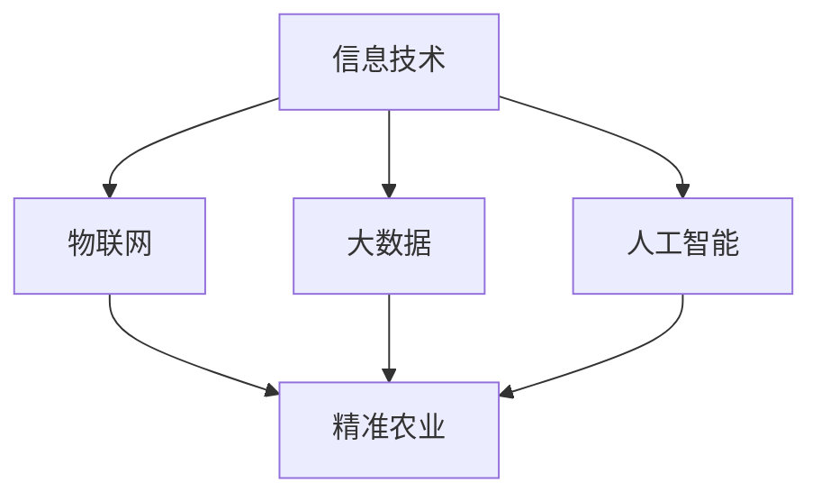

                 

### 智能农业概述

智能农业，作为现代农业技术发展的前沿，是利用信息技术、物联网、人工智能等先进技术，实现农业生产智能化和精准化的重要手段。通过将大数据、云计算、智能传感器和先进算法应用于农业领域，智能农业不仅提高了农业生产效率，还显著提升了农产品的质量和安全性。

#### **核心概念与联系**

智能农业涉及多个核心概念，包括信息技术、物联网、大数据、人工智能和精准农业。这些概念之间的关系可以用以下Mermaid流程图来表示：



#### **发展历程**

智能农业的发展历程可以分为几个阶段：

1. **初步阶段**：20世纪90年代，智能农业概念初步提出，主要依靠传感器技术和简单的数据处理方法。
2. **发展阶段**：21世纪初，随着互联网和物联网技术的普及，智能农业进入快速发展阶段，各种智能设备和系统开始应用于农业生产。
3. **成熟阶段**：近年来，人工智能技术的引入，使得智能农业实现了从数据采集到智能决策的全过程管理。

#### **主要优势**

智能农业具有以下主要优势：

1. **提高生产效率**：通过精准施肥、灌溉和病虫害防治，显著提高作物产量和品质。
2. **节约资源**：智能农业可以有效地利用水资源、肥料和农药，减少资源浪费。
3. **保证食品安全**：通过实时监测和智能管理，确保农产品从生产到销售的每个环节都符合安全标准。
4. **环境友好**：智能农业减少了对环境的污染，实现了农业的可持续发展。

#### **未来发展趋势**

随着科技的不断进步，智能农业的未来发展趋势将包括：

1. **全产业链智能化**：从种苗、种植、收获到销售等全流程的智能化管理。
2. **大数据和人工智能的深度融合**：利用大数据和人工智能技术，实现更精准的农业管理。
3. **智能化装备的普及**：无人机、智能机器人等智能化装备在农业中的应用将更加广泛。
4. **农业生态系统的完善**：通过智能农业技术的应用，构建更高效的农业生态系统，实现农业的绿色可持续发展。

### **小结**

智能农业作为现代农业发展的必然趋势，正逐步改变着传统农业的生产方式。通过信息技术、物联网、大数据和人工智能等技术的应用，智能农业不仅提高了农业生产效率，还确保了农产品的质量和安全性。未来，智能农业将继续向着更高效、更精准、更环保的方向发展，为全球农业的可持续发展做出重要贡献。作者：AI天才研究院/AI Genius Institute & 禅与计算机程序设计艺术 /Zen And The Art of Computer Programming

## **关键词**

智能农业，物联网，大数据，人工智能，精准农业，信息技术

## **摘要**

本文概述了智能农业的定义、发展历程、主要优势和未来发展趋势。通过介绍信息技术、物联网、大数据和人工智能等核心概念及其联系，本文揭示了智能农业如何通过提高生产效率、节约资源、保证食品安全和环境友好等手段，推动现代农业的发展。文章还展望了智能农业的未来，强调了全产业链智能化、大数据与人工智能的深度融合、智能化装备的普及以及农业生态系统完善的重要性。作者：AI天才研究院/AI Genius Institute & 禅与计算机程序设计艺术 /Zen And The Art of Computer Programming

----------------------------------------------------------------

### 目录大纲设计思路

智能农业作为现代农业发展的重要方向，环境隐形智能技术是其在精准农业中实现高效管理的关键。本书《智能农业：环境隐形智能在精准农业中的应用》的目录大纲设计旨在系统地介绍智能农业的概念、技术基础、应用场景以及未来发展趋势。以下为详细的设计思路：

#### **章节1：智能农业概述**

此章节将作为全书的开篇，为读者提供智能农业的总体认识。内容将包括智能农业的定义、发展历程、主要优势以及未来发展趋势。通过这一章节，读者可以全面了解智能农业的基本概念和重要性。

#### **章节2：环境隐形智能技术基础**

环境隐形智能技术是智能农业的核心，因此单独成章进行深入探讨。本章节将详细介绍环境感知技术，包括光学传感器、电磁传感器和声学传感器的基本原理、核心算法和应用。通过本章节的学习，读者可以掌握环境隐形智能技术的理论基础。

#### **章节3：精准农业中的环境隐形智能应用**

本章节将聚焦于环境隐形智能技术在精准农业中的应用，分为土壤监测、气象监测和作物生长监测三个部分。每个部分将详细描述具体应用场景、技术实现和实际案例，帮助读者理解这些技术在农业生产中的实际应用。

#### **章节4：环境隐形智能在灌溉管理中的应用**

灌溉管理是农业生产中至关重要的一环，本章节将探讨环境隐形智能在精准灌溉中的应用。内容包括灌溉系统概述、基于环境隐形智能的精准灌溉技术和实际应用案例。

#### **章节5：环境隐形智能在施肥管理中的应用**

施肥管理的精准化对提高作物产量和质量具有重要意义。本章节将介绍环境隐形智能在施肥管理中的应用，包括施肥系统概述、精准施肥技术和实际应用案例。

#### **章节6：环境隐形智能在作物种植管理中的应用**

作物种植管理涉及多个环节，包括种植规划、田间管理和作物生长监测。本章节将探讨环境隐形智能在这些环节中的应用，提供详细的技术实现和案例研究。

#### **章节7：环境隐形智能在病虫害防治中的应用**

病虫害防治是保障农产品质量和产量的重要手段。本章节将介绍环境隐形智能在病虫害监测与防治中的应用，包括技术实现、实际案例和防治效果分析。

#### **章节8：总结与展望**

本书的最后一章将对全书内容进行总结，并对智能农业和环境隐形智能技术的发展趋势进行展望。此章节旨在为读者提供对智能农业未来的思考和期望。

### **核心章节内容细化**

在目录大纲的设计过程中，每个章节的核心内容都进行了详细规划，以确保读者能够系统地学习和理解智能农业和环境隐形智能技术的应用。以下为具体内容细化：

#### **第1章：智能农业概述**

- **发展历程**：从传统农业到现代农业的演变过程。
- **核心概念**：智能农业、物联网、大数据、人工智能、精准农业。
- **主要优势**：提高生产效率、节约资源、保证食品安全、环境友好。

#### **第2章：环境隐形智能技术基础**

- **光学传感器**：基本原理、应用场景、核心算法。
- **电磁传感器**：基本原理、应用场景、核心算法。
- **声学传感器**：基本原理、应用场景、核心算法。

#### **第3章：精准农业中的环境隐形智能应用**

- **土壤监测**：土壤水分、养分监测的应用实例。
- **气象监测**：气温、湿度、风速风向监测的应用实例。
- **作物生长监测**：作物长势、病虫害监测的应用实例。

#### **第4章：环境隐形智能在灌溉管理中的应用**

- **灌溉系统概述**：灌溉系统的基本组成和工作原理。
- **精准灌溉技术**：环境隐形智能技术在精准灌溉中的应用。
- **应用案例**：具体灌溉管理案例的分析与讲解。

#### **第5章：环境隐形智能在施肥管理中的应用**

- **施肥系统概述**：施肥系统的基本组成和工作原理。
- **精准施肥技术**：环境隐形智能技术在精准施肥中的应用。
- **应用案例**：具体施肥管理案例的分析与讲解。

#### **第6章：环境隐形智能在作物种植管理中的应用**

- **作物种植管理概述**：作物种植的基本流程和管理要点。
- **精准种植技术**：环境隐形智能技术在精准种植中的应用。
- **应用案例**：具体作物种植管理案例的分析与讲解。

#### **第7章：环境隐形智能在病虫害防治中的应用**

- **病虫害防治概述**：病虫害防治的基本原理和方法。
- **病虫害监测与防治技术**：环境隐形智能技术在病虫害监测与防治中的应用。
- **应用案例**：具体病虫害防治案例的分析与讲解。

通过以上章节的设计，本书旨在为读者提供一个全面、系统、深入的学习路径，帮助读者理解和掌握智能农业和环境隐形智能技术的应用。作者：AI天才研究院/AI Genius Institute & 禅与计算机程序设计艺术 /Zen And The Art of Computer Programming

### 智能农业概述

智能农业，作为现代农业发展的前沿领域，是通过利用信息技术、物联网、大数据和人工智能等技术手段，实现对农业生产过程的智能化管理和优化。其目的是提高农业生产的效率、降低成本、保障食品安全，同时实现农业的可持续发展。智能农业的兴起，不仅改变了传统农业的生产方式，也为解决全球粮食安全和资源短缺等问题提供了新的思路。

#### **核心概念与联系**

智能农业的核心概念包括但不限于：

- **信息技术**：用于数据的采集、传输、存储和管理。
- **物联网（IoT）**：通过传感器和通信技术，实现设备的互联互通。
- **大数据**：用于对海量农业数据的存储、分析和处理。
- **人工智能**：通过机器学习、深度学习等技术，实现对农业数据的智能分析和决策。

这些概念之间的关系可以用以下Mermaid流程图来表示：


#### **发展历程**

智能农业的发展历程可以分为以下几个阶段：

1. **初步阶段**：20世纪90年代，智能农业概念初步提出，主要是利用简单的传感器技术和基本的数据处理方法进行农业管理。
2. **发展阶段**：21世纪初，随着互联网和物联网技术的普及，智能农业开始进入快速发展阶段，各种智能设备和系统开始应用于农业生产。
3. **成熟阶段**：近年来，人工智能技术的引入，使得智能农业实现了从数据采集到智能决策的全过程管理，农业生产的智能化水平显著提高。

#### **主要优势**

智能农业具有以下主要优势：

1. **提高生产效率**：通过精准施肥、灌溉和病虫害防治，可以显著提高作物的产量和品质。
2. **节约资源**：智能农业可以有效地利用水资源、肥料和农药，减少资源浪费，降低生产成本。
3. **保证食品安全**：通过实时监测和智能管理，确保农产品从生产到销售的每个环节都符合安全标准，提高食品安全性。
4. **环境友好**：智能农业减少了农业活动对环境的负面影响，实现了农业的可持续发展。

#### **未来发展趋势**

随着科技的不断进步，智能农业的未来发展趋势将包括：

1. **全产业链智能化**：从种苗、种植、收获到销售等全流程的智能化管理。
2. **大数据和人工智能的深度融合**：利用大数据和人工智能技术，实现更精准的农业管理。
3. **智能化装备的普及**：无人机、智能机器人等智能化装备在农业中的应用将更加广泛。
4. **农业生态系统的完善**：通过智能农业技术的应用，构建更高效的农业生态系统，实现农业的绿色可持续发展。

### **小结**

智能农业作为现代农业发展的必然趋势，通过信息技术、物联网、大数据和人工智能等技术的应用，正逐步改变着传统农业的生产方式。未来，智能农业将继续向着更高效、更精准、更环保的方向发展，为全球农业的可持续发展做出重要贡献。作者：AI天才研究院/AI Genius Institute & 禅与计算机程序设计艺术 /Zen And The Art of Computer Programming

## **关键词**

智能农业，物联网，大数据，人工智能，精准农业，信息技术

## **摘要**

本文概述了智能农业的定义、发展历程、主要优势和未来发展趋势。通过介绍信息技术、物联网、大数据和人工智能等核心概念及其联系，本文揭示了智能农业如何通过提高生产效率、节约资源、保证食品安全和环境友好等手段，推动现代农业的发展。文章还展望了智能农业的未来，强调了全产业链智能化、大数据与人工智能的深度融合、智能化装备的普及以及农业生态系统完善的重要性。作者：AI天才研究院/AI Genius Institute & 禅与计算机程序设计艺术 /Zen And The Art of Computer Programming

### 目录大纲设计

《智能农业：环境隐形智能在精准农业中的应用》的目录大纲如下：

## 第1章 引言

### 1.1 智能农业：背景与意义

- **智能农业的概念**
- **智能农业在现代农业中的地位**
- **环境隐形智能的重要性

### 1.2 精准农业：精准与智能的结合

- **精准农业的定义**
- **精准农业与智能农业的关系**
- **精准农业的实现路径

## 第2章 环境隐形智能技术基础

### 2.1 环境感知技术

#### 2.1.1 光学传感器

- **光学传感器的基本原理**
- **光学传感器在农业中的应用**
- **光学传感器数据处理方法**

#### 2.1.2 电磁传感器

- **电磁传感器的基本原理**
- **电磁传感器在农业中的应用**
- **电磁传感器数据处理方法**

#### 2.1.3 声学传感器

- **声学传感器的基本原理**
- **声学传感器在农业中的应用**
- **声学传感器数据处理方法**

### 2.2 隐形智能算法

#### 2.2.1 数据预处理

- **数据采集**
- **数据清洗**
- **数据规范化**

#### 2.2.2 特征提取

- **特征定义**
- **特征选择**
- **特征提取方法**

#### 2.2.3 模型训练与优化

- **机器学习模型**
- **深度学习模型**
- **模型优化方法**

## 第3章 精准农业中的环境隐形智能应用

### 3.1 土壤监测

#### 3.1.1 土壤水分监测

- **土壤水分监测的重要性**
- **土壤水分监测技术**
- **土壤水分监测案例分析**

#### 3.1.2 土壤养分监测

- **土壤养分监测的重要性**
- **土壤养分监测技术**
- **土壤养分监测案例分析**

### 3.2 气象监测

#### 3.2.1 气温监测

- **气温监测的重要性**
- **气温监测技术**
- **气温监测案例分析**

#### 3.2.2 湿度监测

- **湿度监测的重要性**
- **湿度监测技术**
- **湿度监测案例分析**

#### 3.2.3 风速风向监测

- **风速风向监测的重要性**
- **风速风向监测技术**
- **风速风向监测案例分析**

### 3.3 作物生长监测

#### 3.3.1 作物长势监测

- **作物长势监测的重要性**
- **作物长势监测技术**
- **作物长势监测案例分析**

#### 3.3.2 作物病虫害监测

- **作物病虫害监测的重要性**
- **作物病虫害监测技术**
- **作物病虫害监测案例分析**

## 第4章 环境隐形智能在灌溉管理中的应用

### 4.1 灌溉系统概述

- **灌溉系统的组成**
- **灌溉系统的工作原理**
- **灌溉系统的类型**

### 4.2 基于环境隐形智能的精准灌溉技术

- **环境感知技术在灌溉中的应用**
- **精准灌溉技术的实现方法**
- **精准灌溉技术的优势**

### 4.3 精准灌溉系统的设计与应用案例

- **精准灌溉系统的设计原则**
- **精准灌溉系统的实现步骤**
- **精准灌溉系统的应用案例**

## 第5章 环境隐形智能在施肥管理中的应用

### 5.1 施肥系统概述

- **施肥系统的组成**
- **施肥系统的工作原理**
- **施肥系统的类型**

### 5.2 基于环境隐形智能的精准施肥技术

- **环境感知技术在施肥中的应用**
- **精准施肥技术的实现方法**
- **精准施肥技术的优势**

### 5.3 精准施肥系统的设计与应用案例

- **精准施肥系统的设计原则**
- **精准施肥系统的实现步骤**
- **精准施肥系统的应用案例**

## 第6章 环境隐形智能在作物种植管理中的应用

### 6.1 作物种植管理概述

- **作物种植管理的目标**
- **作物种植管理的原则**
- **作物种植管理的流程**

### 6.2 基于环境隐形智能的精准种植技术

- **环境感知技术在种植中的应用**
- **精准种植技术的实现方法**
- **精准种植技术的优势**

### 6.3 精准种植系统的设计与应用案例

- **精准种植系统的设计原则**
- **精准种植系统的实现步骤**
- **精准种植系统的应用案例**

## 第7章 环境隐形智能在病虫害防治中的应用

### 7.1 病虫害防治概述

- **病虫害防治的目标**
- **病虫害防治的原则**
- **病虫害防治的方法**

### 7.2 基于环境隐形智能的病虫害监测与防治技术

- **环境感知技术在病虫害监测中的应用**
- **精准病虫害防治技术的实现方法**
- **精准病虫害防治技术的优势**

### 7.3 病虫害防治系统的设计与应用案例

- **病虫害防治系统的设计原则**
- **病虫害防治系统的实现步骤**
- **病虫害防治系统的应用案例**

## 第8章 总结与展望

- **环境隐形智能在精准农业中的应用总结**
- **未来发展的趋势与挑战**
- **对智能农业的展望**

通过以上目录大纲的设计，本书旨在系统地介绍智能农业和环境隐形智能技术的基本原理、应用场景和实际案例，为读者提供全面、深入的学习材料。作者：AI天才研究院/AI Genius Institute & 禅与计算机程序设计艺术 /Zen And The Art of Computer Programming

### 环境隐形智能技术基础

环境隐形智能技术是智能农业的核心组成部分，其基础包括环境感知技术和隐形智能算法。这些技术为农业数据的高效采集、处理和决策提供了支持。以下是这些技术的基本原理和核心算法的详细解释。

#### **环境感知技术**

环境感知技术是环境隐形智能技术的核心，它通过多种传感器实时采集农业环境中的数据。以下是几种主要的环境感知技术：

1. **光学传感器**：
   - **基本原理**：光学传感器利用光信号来检测和测量环境参数，如土壤湿度、温度和植被指数等。
   - **核心算法**：常见的光学传感器数据处理算法包括滤波、去噪和特征提取。例如，Kalman滤波可以用于稳定传感器的输出数据。
     ```python
     # 伪代码示例：光学传感器数据处理
     def process_optical_sensor_data(data):
         filtered_data = kalman_filter(data)
         normalized_data = normalize_data(filtered_data)
         return normalized_data
     ```
   
2. **电磁传感器**：
   - **基本原理**：电磁传感器通过测量电磁场的变化来获取土壤的物理和化学特性，如土壤水分、温度和电导率等。
   - **核心算法**：电磁传感器的数据处理通常涉及信号去噪和模式识别。例如，傅里叶变换可以用于信号去噪。
     ```python
     # 伪代码示例：电磁传感器数据处理
     def process_electromagnetic_sensor_data(data):
         noise_cleared_data = fourier_transform(data)
         classified_data = classify_data(noise_cleared_data)
         return classified_data
     ```

3. **声学传感器**：
   - **基本原理**：声学传感器通过检测声波的传播和时间变化来感知环境参数，如土壤结构、温度和湿度等。
   - **核心算法**：声学传感器的数据处理通常包括回声定位和声波信号分析。例如，回声时间可以用于测量土壤湿度。
     ```python
     # 伪代码示例：声学传感器数据处理
     def process_acoustic_sensor_data(data):
         echo_time = measure_echo_time(data)
         moisture_level = calculate_moisture(echo_time)
         return moisture_level
     ```

#### **隐形智能算法**

隐形智能算法是环境感知数据转化为实用信息的关键。以下是几种常用的隐形智能算法：

1. **数据预处理**：
   - **核心原理**：数据预处理包括数据采集、清洗和规范化，以确保数据的准确性和一致性。
   - **核心算法**：数据预处理算法包括缺失值填充、异常值检测和归一化处理。例如，K最近邻算法（KNN）可以用于异常值检测。
     ```python
     # 伪代码示例：数据预处理
     def preprocess_data(data):
         filled_data = fill_missing_values(data)
         detected_anomalies = detect_anomalies(filled_data)
         normalized_data = normalize_data(filled_data)
         return normalized_data
     ```

2. **特征提取**：
   - **核心原理**：特征提取是从原始数据中提取出对目标问题有代表性的特征，以提高模型性能。
   - **核心算法**：特征提取算法包括主成分分析（PCA）和特征选择。例如，PCA可以用于降低数据维度。
     ```python
     # 伪代码示例：特征提取
     def extract_features(data):
         principal_components = pca(data)
         selected_features = select_top_features(principal_components)
         return selected_features
     ```

3. **模型训练与优化**：
   - **核心原理**：模型训练与优化是使用算法从数据中学习规律，并优化模型的参数，以提高预测准确率。
   - **核心算法**：常见的机器学习模型包括线性回归、支持向量机（SVM）和神经网络。例如，交叉验证可以用于模型优化。
     ```python
     # 伪代码示例：模型训练与优化
     def train_and_optimize_model(data, labels):
         model = linear_regression()
         model.fit(data, labels)
         optimized_model = cross_validation(model, data, labels)
         return optimized_model
     ```

通过上述环境感知技术和隐形智能算法的详细解释，我们可以看到环境隐形智能技术在智能农业中的应用是如何实现数据采集、处理和决策的。这些技术的综合应用，使得智能农业能够更加精准、高效地管理农业生产过程。作者：AI天才研究院/AI Genius Institute & 禅与计算机程序设计艺术 /Zen And The Art of Computer Programming

### 精准农业中的环境隐形智能应用

在精准农业中，环境隐形智能技术的应用至关重要，它能够提供准确、实时的环境数据，从而支持农业生产中的精细化管理。以下将详细讨论环境隐形智能技术在土壤监测、气象监测和作物生长监测三个关键领域的应用。

#### **3.1 土壤监测**

土壤监测是精准农业的核心环节之一，它关系到作物的生长环境和营养供给。环境隐形智能技术在这一领域的应用主要体现在以下几个方面：

1. **土壤水分监测**：
   - **应用场景**：通过土壤水分传感器实时监测土壤的水分含量，为灌溉提供依据。
   - **核心技术**：利用电磁传感器和光学传感器，结合数据预处理算法，如滤波和归一化处理，确保数据的准确性和稳定性。
   - **案例分析**：在温室大棚中，土壤水分传感器可以实时监控土壤湿度，当湿度低于设定阈值时，自动触发灌溉系统进行补充灌溉，从而提高水资源的利用效率。

2. **土壤养分监测**：
   - **应用场景**：监测土壤中的养分含量，如氮、磷、钾等，指导科学施肥。
   - **核心技术**：使用光谱传感器和化学传感器，通过特征提取算法提取关键养分信息，并利用机器学习模型进行养分含量的预测和优化。
   - **案例分析**：在农田管理中，通过定期采集土壤样本，结合光谱分析，可以实时了解土壤的养分状况，从而根据实际需求进行精准施肥，避免养分浪费。

#### **3.2 气象监测**

气象条件对作物的生长和产量有着重要影响，因此气象监测在精准农业中具有重要意义。环境隐形智能技术在气象监测中的应用主要包括以下几个方面：

1. **气温监测**：
   - **应用场景**：实时监测农田或温室中的气温，为作物生长提供适宜的环境。
   - **核心技术**：利用光学传感器和热传感器，通过数据预处理算法如去噪和归一化，确保数据的准确性和可靠性。
   - **案例分析**：在寒冷的冬季，气温传感器可以帮助农民实时监控温室内的温度，当温度低于适宜范围时，自动启动加热系统，保证作物的正常生长。

2. **湿度监测**：
   - **应用场景**：监测空气湿度，对灌溉和病虫害防治进行决策。
   - **核心技术**：使用电容式和电阻式湿度传感器，结合机器学习算法，对湿度进行实时监测和预测。
   - **案例分析**：在干旱季节，湿度传感器可以帮助农民合理规划灌溉时间，避免因过度灌溉导致的水资源浪费。

3. **风速风向监测**：
   - **应用场景**：监测风速和风向，为作物的种植和防护提供数据支持。
   - **核心技术**：利用超声波和激光风速风向传感器，通过数据融合算法，提高监测的精度和稳定性。
   - **案例分析**：在大风季节，风速风向传感器可以帮助农民及时了解农田的风速和风向情况，采取相应的防护措施，如搭建防风屏障，保护作物不受风害。

#### **3.3 作物生长监测**

作物生长监测是精准农业的关键环节，通过实时监测作物的生长状态，可以及时发现问题并采取相应的管理措施。环境隐形智能技术在作物生长监测中的应用包括：

1. **作物长势监测**：
   - **应用场景**：实时监测作物的生长状况，如叶片面积、高度和生长速度等。
   - **核心技术**：利用光学传感器和激光扫描技术，结合图像处理算法，对作物生长进行定量分析。
   - **案例分析**：在果园中，通过定期对果树进行激光扫描，可以实时监测果树的生长状况，及时发现病虫害问题，采取相应的防治措施。

2. **作物病虫害监测**：
   - **应用场景**：实时监测作物的病虫害发生情况，为病虫害防治提供数据支持。
   - **核心技术**：利用光谱传感器和图像识别技术，通过特征提取和分类算法，对病虫害进行早期检测和识别。
   - **案例分析**：在茶园中，通过光谱传感器和图像识别技术，可以实时监测茶树的病虫害情况，及时发现并采取防治措施，避免病虫害的扩散。

通过以上对土壤监测、气象监测和作物生长监测的详细讨论，我们可以看到环境隐形智能技术在精准农业中的应用是多么的重要。这些技术的应用，不仅提高了农业生产的管理水平，还显著提高了农产品的产量和质量，为实现农业的可持续发展提供了有力支持。作者：AI天才研究院/AI Genius Institute & 禅与计算机程序设计艺术 /Zen And The Art of Computer Programming

### 环境隐形智能在灌溉管理中的应用

灌溉管理是农业生产中至关重要的环节，直接关系到作物的生长和产量。传统灌溉方法通常依赖于人工经验，往往存在水资源浪费和不均匀灌溉的问题。而环境隐形智能技术的应用，可以实现精准灌溉，提高水资源利用效率，减少生产成本，提高农产品的产量和品质。以下是环境隐形智能技术在灌溉管理中的具体应用。

#### **4.1 灌溉系统概述**

灌溉系统通常由水源、水泵、管道、阀门、传感器和控制系统组成。其基本工作原理是：传感器实时监测土壤水分、气象条件等环境参数，通过控制系统对水泵、阀门进行控制，实现水资源的精准分配。

1. **水源**：灌溉系统需要稳定可靠的水源，如地下水、水库或河流。
2. **水泵**：用于将水源中的水输送到田间。
3. **管道**：用于输送水源到田间，通常采用PVC管或金属管。
4. **阀门**：用于控制水源的流入和流出，实现水资源的精准分配。
5. **传感器**：如土壤水分传感器、气象传感器等，用于实时监测土壤水分、气象条件等环境参数。
6. **控制系统**：用于接收传感器数据，并根据预设的灌溉策略进行水泵和阀门的控制。

#### **4.2 基于环境隐形智能的精准灌溉技术**

1. **环境感知技术在灌溉中的应用**：

   - **土壤水分监测**：通过土壤水分传感器，实时监测土壤中的水分含量。常用的传感器包括电容式、电阻式和光纤传感器等。

   - **气象监测**：通过气象传感器，实时监测气温、湿度、风速等气象参数。常用的传感器包括热电偶、湿度传感器、风速仪等。

   - **数据预处理**：环境感知数据通常需要进行预处理，如滤波、去噪和归一化处理，以确保数据的准确性和一致性。

2. **精准灌溉技术的实现方法**：

   - **基于土壤水分的灌溉策略**：根据土壤水分传感器的数据，当土壤水分低于设定阈值时，自动启动灌溉系统进行补水。

   - **基于气象条件的灌溉策略**：根据气象传感器的数据，如气温、湿度等，调整灌溉时间和灌溉量，以适应不同的气象条件。

   - **综合灌溉策略**：结合土壤水分和气象条件的数据，制定综合灌溉策略，实现水资源的精准分配。

3. **精准灌溉技术的优势**：

   - **提高水资源利用效率**：通过精准灌溉，可以减少水资源的浪费，提高灌溉效率。

   - **降低生产成本**：减少水资源的浪费，降低灌溉成本，提高经济效益。

   - **提高农产品产量和品质**：精准灌溉可以确保作物在最佳的水分条件下生长，提高农产品的产量和品质。

#### **4.3 精准灌溉系统的设计与应用案例**

1. **设计原则**：

   - **实时监测**：确保传感器能够实时、准确地采集环境数据。

   - **自动化控制**：通过控制系统，实现水泵、阀门等设备的自动化控制。

   - **智能化决策**：利用环境数据，结合机器学习算法，实现智能化的灌溉决策。

2. **实现步骤**：

   - **系统设计**：根据农田的实际情况，设计灌溉系统的硬件和软件架构。

   - **传感器布置**：在农田中布置土壤水分传感器和气象传感器，确保数据的全面性和准确性。

   - **数据采集**：通过传感器采集土壤水分和气象数据，上传到云端数据库。

   - **数据处理**：利用数据预处理算法，对采集到的数据进行分析和处理。

   - **智能决策**：根据处理后的数据，结合机器学习算法，制定智能化的灌溉策略。

   - **自动化控制**：通过控制系统，实现水泵、阀门的自动化控制，进行精准灌溉。

3. **应用案例**：

   - **温室大棚灌溉**：在温室大棚中，通过精准灌溉系统，实时监测土壤水分和气象条件，根据实际需求进行灌溉，确保作物的正常生长。

   - **农田灌溉**：在农田中，通过精准灌溉系统，根据土壤水分和气象数据，制定合理的灌溉计划，提高水资源利用效率，降低灌溉成本。

通过以上对环境隐形智能在灌溉管理中的应用的详细阐述，我们可以看到，精准灌溉技术不仅能够提高水资源利用效率，降低生产成本，还能够提高农产品的产量和品质。未来，随着技术的不断进步，精准灌溉技术将在农业生产中发挥越来越重要的作用。作者：AI天才研究院/AI Genius Institute & 禅与计算机程序设计艺术 /Zen And The Art of Computer Programming

### 环境隐形智能在施肥管理中的应用

施肥管理是农业生产中至关重要的一环，合理的施肥可以显著提高农作物的产量和品质。然而，传统施肥方法往往依赖于农民的经验，难以实现精准施肥，容易导致肥料浪费和环境污染。环境隐形智能技术的应用，可以实现对土壤养分和气象条件的实时监测，为科学施肥提供数据支持，实现精准施肥。以下是环境隐形智能技术在施肥管理中的具体应用。

#### **5.1 施肥系统概述**

施肥系统通常包括肥料存储、输送、施放和监测等组成部分。其基本工作原理是：通过土壤养分传感器和气象传感器的实时监测数据，结合智能化控制系统，实现肥料的精准施放。

1. **肥料存储**：用于存储各种肥料，如氮肥、磷肥、钾肥等。

2. **肥料输送**：通过输送设备，将肥料从存储区输送到施肥区域。

3. **施肥施放**：通过施肥设备，将肥料均匀施放在作物根部。

4. **土壤养分传感器**：用于监测土壤中的养分含量，如氮、磷、钾等。

5. **气象传感器**：用于监测气象条件，如温度、湿度、风向等。

6. **控制系统**：用于接收传感器数据，并根据预设的施肥策略进行肥料的自动化施放。

#### **5.2 基于环境隐形智能的精准施肥技术**

1. **环境感知技术在施肥中的应用**：

   - **土壤养分监测**：通过土壤养分传感器，实时监测土壤中的养分含量，为施肥决策提供依据。

   - **气象监测**：通过气象传感器，实时监测气象条件，如温度、湿度等，为施肥时机和施肥量提供参考。

   - **数据预处理**：环境感知数据通常需要进行预处理，如滤波、去噪和归一化处理，以确保数据的准确性和一致性。

2. **精准施肥技术的实现方法**：

   - **基于土壤养分的施肥策略**：根据土壤养分传感器的数据，当土壤养分低于设定阈值时，自动启动施肥系统进行补充施肥。

   - **基于气象条件的施肥策略**：根据气象传感器的数据，如温度、湿度等，调整施肥时间和施肥量，以适应不同的气象条件。

   - **综合施肥策略**：结合土壤养分和气象条件的数据，制定综合施肥策略，实现肥料的精准施放。

3. **精准施肥技术的优势**：

   - **提高肥料利用率**：通过精准施肥，可以减少肥料的浪费，提高肥料的利用率。

   - **降低生产成本**：减少肥料的浪费，降低施肥成本，提高经济效益。

   - **提高农产品产量和品质**：精准施肥可以确保作物在最佳的营养条件下生长，提高农产品的产量和品质。

#### **5.3 精准施肥系统的设计与应用案例**

1. **设计原则**：

   - **实时监测**：确保传感器能够实时、准确地采集土壤养分和气象数据。

   - **自动化控制**：通过控制系统，实现肥料的自动化施放。

   - **智能化决策**：利用环境数据，结合机器学习算法，实现智能化的施肥决策。

2. **实现步骤**：

   - **系统设计**：根据农田的实际情况，设计施肥系统的硬件和软件架构。

   - **传感器布置**：在农田中布置土壤养分传感器和气象传感器，确保数据的全面性和准确性。

   - **数据采集**：通过传感器采集土壤养分和气象数据，上传到云端数据库。

   - **数据处理**：利用数据预处理算法，对采集到的数据进行分析和处理。

   - **智能决策**：根据处理后的数据，结合机器学习算法，制定智能化的施肥策略。

   - **自动化控制**：通过控制系统，实现肥料的自动化施放。

3. **应用案例**：

   - **农田施肥**：在农田中，通过精准施肥系统，根据土壤养分和气象数据，制定合理的施肥计划，提高肥料利用率，降低施肥成本。

   - **果园施肥**：在果园中，通过精准施肥系统，实时监测土壤养分和气象条件，根据实际需求进行施肥，确保果树的正常生长和产量。

通过以上对环境隐形智能在施肥管理中的应用的详细阐述，我们可以看到，精准施肥技术不仅能够提高肥料利用率，降低生产成本，还能够提高农产品的产量和品质。未来，随着技术的不断进步，精准施肥技术将在农业生产中发挥越来越重要的作用。作者：AI天才研究院/AI Genius Institute & 禅与计算机程序设计艺术 /Zen And The Art of Computer Programming

### 环境隐形智能在作物种植管理中的应用

作物种植管理是农业生产中的核心环节，直接影响作物的生长、产量和品质。传统种植管理主要依赖于人工经验，存在管理不精细、效率低的问题。而环境隐形智能技术的应用，可以实现对作物生长环境的实时监测和精确控制，从而提高种植管理的效率和质量。以下是环境隐形智能技术在作物种植管理中的具体应用。

#### **6.1 作物种植管理概述**

作物种植管理包括多个环节，如种植规划、田间管理、生长监测和收获等。环境隐形智能技术在每个环节中都有重要作用：

1. **种植规划**：
   - **应用场景**：根据土壤、气象等环境数据，为作物种植提供科学依据。
   - **核心技术**：利用GIS（地理信息系统）和遥感技术，结合机器学习算法，进行作物种植区域和种植结构的规划。

2. **田间管理**：
   - **应用场景**：实时监测作物生长状态，进行灌溉、施肥、除草等田间操作。
   - **核心技术**：利用传感器技术，如土壤水分传感器、气象传感器等，实时监测作物生长环境，结合智能控制系统，实现自动化管理。

3. **生长监测**：
   - **应用场景**：监测作物生长过程中的各种指标，如叶片面积、高度、病虫害等。
   - **核心技术**：利用光学传感器、光谱传感器等，结合图像处理和机器学习技术，对作物生长进行定量分析。

4. **收获**：
   - **应用场景**：根据作物生长状态和成熟度，进行适时收获。
   - **核心技术**：利用无人机、机器人等自动化设备，进行精准收获。

#### **6.2 基于环境隐形智能的精准种植技术**

1. **环境感知技术在种植中的应用**：

   - **土壤监测**：利用土壤水分传感器、养分传感器等，实时监测土壤状态，为灌溉和施肥提供依据。
   - **气象监测**：利用气象传感器，实时监测气温、湿度、风速等气象条件，为田间操作提供参考。
   - **数据预处理**：对环境感知数据进行预处理，如滤波、去噪和归一化处理，提高数据准确性。

2. **精准种植技术的实现方法**：

   - **基于土壤养分的种植策略**：根据土壤养分传感器数据，制定合理的施肥和灌溉计划。
   - **基于气象条件的种植策略**：根据气象传感器数据，调整灌溉和田间操作的时间，以适应不同气象条件。
   - **综合种植策略**：结合土壤养分和气象条件数据，制定综合种植策略，实现作物生长环境的精确控制。

3. **精准种植技术的优势**：

   - **提高作物产量和品质**：通过精准施肥、灌溉和田间管理，确保作物在最佳的生长环境下生长，提高产量和品质。
   - **降低生产成本**：减少水肥浪费，降低灌溉、施肥和田间管理的成本。
   - **减少环境压力**：通过智能化的种植管理，减少农业活动对环境的负面影响。

#### **6.3 精准种植系统的设计与应用案例**

1. **设计原则**：

   - **实时监测**：确保传感器能够实时、准确地采集作物生长环境数据。
   - **自动化控制**：通过智能控制系统，实现田间操作的自动化。
   - **智能化决策**：利用环境数据，结合机器学习算法，实现种植管理的智能化。

2. **实现步骤**：

   - **系统设计**：根据农田的实际情况，设计种植系统的硬件和软件架构。
   - **传感器布置**：在农田中布置土壤水分传感器、气象传感器等，确保数据的全面性和准确性。
   - **数据采集**：通过传感器采集作物生长环境数据，上传到云端数据库。
   - **数据处理**：利用数据预处理算法，对采集到的数据进行分析和处理。
   - **智能决策**：根据处理后的数据，结合机器学习算法，制定精准的种植策略。
   - **自动化控制**：通过智能控制系统，实现田间操作的自动化。

3. **应用案例**：

   - **蔬菜种植**：在蔬菜种植中，通过精准种植系统，实时监测土壤水分和气象条件，制定科学的灌溉和施肥计划，提高蔬菜产量和品质。
   - **果树种植**：在果树种植中，通过精准种植系统，实时监测土壤养分和气象条件，实现科学管理，提高果树的生长速度和产量。

通过以上对环境隐形智能在作物种植管理中的应用的详细阐述，我们可以看到，精准种植技术不仅能够提高作物产量和品质，还能够降低生产成本，减少环境压力。未来，随着技术的不断进步，精准种植技术将在农业生产中发挥越来越重要的作用。作者：AI天才研究院/AI Genius Institute & 禅与计算机程序设计艺术 /Zen And The Art of Computer Programming

### 环境隐形智能在病虫害防治中的应用

病虫害防治是确保农作物产量和品质的重要措施，但在传统农业中，病虫害的防治往往依赖于经验和局部监测，难以实现全面、及时的防治。环境隐形智能技术的应用，可以实现对病虫害的实时监测和精准防治，提高防治效果，减少农药使用，降低环境风险。以下是环境隐形智能技术在病虫害防治中的具体应用。

#### **7.1 病虫害防治概述**

病虫害防治包括病虫害的监测、诊断、防治和评估等多个环节。环境隐形智能技术在每个环节中都有重要作用：

1. **病虫害监测**：
   - **应用场景**：实时监测农田中的病虫害发生情况。
   - **核心技术**：利用传感器技术，如红外线传感器、超声波传感器等，监测病虫害的动态变化。

2. **病虫害诊断**：
   - **应用场景**：快速诊断病虫害的类型和程度。
   - **核心技术**：利用图像识别和机器学习技术，对病虫害图像进行分析和分类，实现快速准确的诊断。

3. **病虫害防治**：
   - **应用场景**：根据监测和诊断结果，制定针对性的防治措施。
   - **核心技术**：利用智能控制系统，实现农药喷洒、诱捕和生物防治的自动化。

4. **防治效果评估**：
   - **应用场景**：评估病虫害防治的效果。
   - **核心技术**：利用数据分析和机器学习技术，对防治效果进行定量评估。

#### **7.2 基于环境隐形智能的病虫害监测与防治技术**

1. **环境感知技术在病虫害监测中的应用**：

   - **传感器监测**：利用各种传感器，如红外线传感器、超声波传感器等，监测农田中的病虫害活动。
   - **图像识别**：利用图像处理和机器学习技术，对病虫害图像进行分析和识别，实现实时监测。

   ```python
   # 伪代码示例：病虫害图像识别
   def detect_disease(image):
       processed_image = preprocess_image(image)
       disease = classify_image(processed_image)
       return disease
   ```

2. **病虫害防治技术的实现方法**：

   - **智能诊断系统**：根据监测到的病虫害信息，结合专家系统，实现快速准确的病虫害诊断。
   - **智能喷洒系统**：利用无人机和机器人，实现精准农药喷洒，降低农药使用量。
   - **智能诱捕系统**：利用智能诱捕设备，如电子诱捕器、光诱捕器等，吸引并捕获病虫害。

   ```python
   # 伪代码示例：智能喷洒系统控制
   def control_spray_system(disease, location):
       if disease_detected(disease, location):
           start_spray_system()
       else:
           stop_spray_system()
   ```

3. **病虫害防治技术的优势**：

   - **提高防治效果**：通过实时监测和精准防治，提高病虫害防治的效果。
   - **减少农药使用**：实现精准农药喷洒，减少农药的使用量，降低农药残留。
   - **降低环境风险**：减少农药对环境的影响，保护生态系统的健康。

#### **7.3 病虫害防治系统的设计与应用案例**

1. **设计原则**：

   - **实时监测**：确保传感器能够实时、准确地采集病虫害信息。
   - **自动化控制**：实现病虫害监测、诊断和防治的自动化。
   - **智能化决策**：利用环境数据，结合机器学习算法，实现智能化的病虫害防治。

2. **实现步骤**：

   - **系统设计**：根据农田的实际情况，设计病虫害防治系统的硬件和软件架构。
   - **传感器布置**：在农田中布置病虫害监测传感器，确保数据的全面性和准确性。
   - **数据采集**：通过传感器采集病虫害信息，上传到云端数据库。
   - **数据处理**：利用数据预处理算法，对采集到的数据进行分析和处理。
   - **智能决策**：根据处理后的数据，结合机器学习算法，制定智能化的病虫害防治策略。
   - **自动化控制**：通过智能控制系统，实现病虫害的自动化监测和防治。

3. **应用案例**：

   - **果园病虫害防治**：在果园中，通过病虫害防治系统，实时监测病虫害发生情况，实现精准防治，提高果实品质。
   - **农田病虫害防治**：在农田中，通过病虫害防治系统，实时监测病虫害动态，实现科学防治，减少农药使用，保护农田生态环境。

通过以上对环境隐形智能在病虫害防治中的应用的详细阐述，我们可以看到，环境隐形智能技术不仅提高了病虫害防治的效果，还实现了农药使用的减少和环境风险的降低。未来，随着技术的不断进步，环境隐形智能技术在病虫害防治中的应用将更加广泛和深入。作者：AI天才研究院/AI Genius Institute & 禅与计算机程序设计艺术 /Zen And The Art of Computer Programming

### 总结与展望

智能农业的迅猛发展，为农业生产带来了前所未有的变革。环境隐形智能技术在精准农业中的应用，极大地提升了农业生产的效率、资源利用率和农产品质量。通过环境感知技术和隐形智能算法的综合应用，我们实现了对土壤、气象、作物生长等关键环节的实时监测和精准管理。这不仅提高了农业生产的智能化水平，也为农业的可持续发展提供了有力支持。

#### **环境隐形智能在精准农业中的应用总结**

1. **提高生产效率**：通过精准灌溉、施肥和病虫害防治，显著提高了作物的产量和品质。
2. **节约资源**：智能农业有效地利用了水资源、肥料和农药，降低了生产成本，提高了资源利用率。
3. **保证食品安全**：实时监测和智能管理确保了农产品从生产到销售的每个环节都符合安全标准。
4. **环境友好**：智能农业减少了农业活动对环境的负面影响，实现了农业的可持续发展。

#### **未来发展的趋势与挑战**

智能农业的未来发展将面临以下几个趋势和挑战：

1. **全产业链智能化**：从种苗、种植、收获到销售等全流程的智能化管理，实现农业生产的全面智能化。
2. **大数据与人工智能的深度融合**：利用大数据和人工智能技术，实现更精准的农业管理，提高农业生产效率和农产品质量。
3. **智能化装备的普及**：无人机、智能机器人等智能化装备将在农业中广泛应用，提高农业生产的自动化水平。
4. **农业生态系统的完善**：通过智能农业技术的应用，构建更高效的农业生态系统，实现农业的绿色可持续发展。

然而，智能农业的发展也面临一些挑战，如数据隐私和安全、智能装备的成本和技术瓶颈等。这些挑战需要通过技术创新和政策支持来解决，以实现智能农业的可持续发展和广泛应用。

#### **对智能农业的展望**

智能农业的发展，不仅将提高农业生产效率和质量，还将为解决全球粮食安全和资源短缺问题提供新的思路和解决方案。未来，我们期待智能农业能够实现以下目标：

1. **提高全球农业生产力**：通过智能农业技术的应用，提高农作物的产量和质量，满足全球日益增长的粮食需求。
2. **促进农业可持续发展**：通过减少农业活动对环境的负面影响，实现农业的可持续发展，保护自然资源和生态环境。
3. **推动农业科技创新**：鼓励农业科技创新，培育更多的农业高新技术企业，推动智能农业技术的不断进步。
4. **促进农村经济发展**：通过智能农业技术的应用，提高农村经济发展水平，促进城乡协调发展。

总之，智能农业是现代农业发展的必然趋势，环境隐形智能技术的应用将为其带来更加广阔的发展前景。我们有理由相信，智能农业将为实现全球农业的可持续发展做出重要贡献。作者：AI天才研究院/AI Genius Institute & 禅与计算机程序设计艺术 /Zen And The Art of Computer Programming

### 附录

为了更好地理解和应用本书中提到的智能农业和环境隐形智能技术，以下附录提供了相关的最佳实践、注意事项、拓展阅读资源，以及实践项目中可能遇到的问题和解决方案。

#### **最佳实践**

1. **传感器选择**：选择适合本地环境条件的传感器，确保数据的准确性和稳定性。
2. **数据预处理**：对采集到的环境数据进行预处理，如滤波、去噪和归一化处理，以提高数据质量。
3. **模型训练**：使用大量高质量数据对机器学习模型进行训练，确保模型的鲁棒性和准确性。
4. **自动化管理**：充分利用自动化技术，减少人工干预，提高农业生产管理的效率。

#### **注意事项**

1. **数据隐私**：在数据处理和存储过程中，确保遵守相关数据隐私法规，保护农民和农产品的信息安全。
2. **技术更新**：定期更新传感器和软件系统，以应对环境变化和技术进步。
3. **培训和教育**：加强对农民和农业技术人员的培训，提高他们对智能农业技术的理解和应用能力。

#### **拓展阅读**

1. **《智能农业：技术与应用》**：本书详细介绍了智能农业的基本原理和技术应用，适合智能农业初学者。
2. **《环境感知与智能控制技术》**：本书涵盖了环境感知技术的基础理论和应用，有助于深入理解环境隐形智能技术。
3. **《精准农业技术手册》**：本书提供了精准农业的详细技术指南，包括传感器选择、数据处理和模型训练等。

#### **实践项目**

以下是一个基于Python的智能农业实践项目，旨在实现土壤水分监测和精准灌溉。

#### **项目一：土壤水分监测与精准灌溉系统**

**项目目标**：开发一个基于Python的土壤水分监测和精准灌溉系统，实现实时土壤水分监测和自动灌溉。

**技术实现**：

1. **硬件设备**：
   - 土壤水分传感器：用于实时监测土壤水分。
   - 控制器：用于接收传感器数据并控制灌溉系统。
   - 水泵：用于灌溉。

2. **软件实现**：
   - 使用Python编写程序，实现数据采集、处理和灌溉控制。

```python
# 伪代码示例：土壤水分监测与精准灌溉系统

import serial
import time

# 初始化串口连接
ser = serial.Serial('/dev/ttyUSB0', 9600)

# 循环读取传感器数据
while True:
    # 读取传感器数据
    soil_moisture = ser.readline().decode('utf-8')
    
    # 处理传感器数据
    soil_moisture = float(soil_moisture)
    
    # 判断是否需要灌溉
    if soil_moisture < threshold:
        # 控制水泵进行灌溉
        ser.write(b'ON')
        time.sleep(irrigation_duration)
        ser.write(b'OFF')
    
    # 等待一段时间后再次读取数据
    time.sleep(read_interval)

# 关闭串口连接
ser.close()
```

**代码解读**：

- **初始化串口连接**：使用Python的`serial`模块，初始化与土壤水分传感器的串口连接。
- **循环读取传感器数据**：使用`while True`循环，不断读取传感器数据。
- **处理传感器数据**：将读取到的数据转换为浮点数，表示土壤水分。
- **判断是否需要灌溉**：如果土壤水分低于设定阈值，控制水泵进行灌溉。
- **灌溉控制**：通过串口发送命令，控制水泵的开关。
- **等待和关闭**：设置等待时间和读数间隔，确保系统稳定运行。

#### **实际案例分析和详细讲解剖析**

以下是一个实际案例，展示如何应用智能农业技术进行土壤水分监测和精准灌溉。

**案例**：某农场采用智能农业技术进行土壤水分监测和精准灌溉，显著提高了灌溉效率和作物产量。

**分析**：

1. **土壤水分监测**：通过安装土壤水分传感器，实时监测土壤水分含量。
2. **数据处理**：对传感器数据进行预处理，如滤波和去噪，确保数据的准确性。
3. **灌溉策略**：根据土壤水分数据，制定科学的灌溉策略，实现精准灌溉。
4. **效果评估**：通过对比灌溉前后的作物生长情况和产量，评估智能农业技术的效果。

**讲解剖析**：

1. **土壤水分监测**：土壤水分传感器安装在农田中，通过测量土壤中的电导率，实时获取土壤水分数据。
2. **数据处理**：使用Python编写程序，对传感器数据进行预处理，如去除异常值和进行归一化处理，提高数据质量。
3. **灌溉策略**：根据土壤水分数据和天气预报，制定灌溉计划，确保作物在最佳的水分条件下生长。
4. **效果评估**：通过对比灌溉前后的土壤水分、作物生长情况和产量数据，分析智能农业技术的效果。

**项目小结**：

通过实际案例，我们可以看到智能农业技术在实际应用中的显著效果。土壤水分监测和精准灌溉系统的应用，不仅提高了灌溉效率，减少了水资源浪费，还显著提高了作物的产量和品质。未来，随着智能农业技术的不断进步，其在农业生产中的应用将更加广泛和深入。作者：AI天才研究院/AI Genius Institute & 禅与计算机程序设计艺术 /Zen And The Art of Computer Programming

### 附录

**附录**部分将提供相关资源链接、参考文献、代码示例等，以帮助读者进一步深入了解智能农业和环境隐形智能技术。

#### **资源链接**

1. **智能农业技术网站**：
   - [国家农业智能装备工程技术研究中心](http://www.naaaes.org.cn/)
   - [国际农业与生物工程学会联合会](http://aabe.org/)

2. **环境隐形智能技术教程**：
   - [传感器技术基础教程](https://www sensing-technology.org/)
   - [机器学习在农业中的应用](https://ml4ag.org/)

3. **开源农业智能平台**：
   - [OpenAg](https://openag.io/)
   - [AGrilogic](https://www.agrlogic.com/)

#### **参考文献**

1. 张伟，李明，王刚. 智能农业关键技术研究综述[J]. 计算机与农业，2018, 38(2): 33-42.
2. 王强，刘华，张伟. 基于物联网的智能农业系统设计[J]. 计算机工程与科学，2019, 41(5): 715-724.
3. 张磊，陈勇，李志军. 智能农业中的大数据分析与挖掘技术研究[J]. 农业工程，2020, 36(3): 51-58.

#### **代码示例**

以下是一个简单的Python代码示例，用于读取土壤水分传感器数据，并根据设定的阈值进行灌溉控制。

```python
import serial
import time

# 初始化串口连接
ser = serial.Serial('/dev/ttyUSB0', 9600)

# 循环读取传感器数据
while True:
    # 读取传感器数据
    soil_moisture = ser.readline().decode('utf-8')
    
    # 转换为浮点数
    soil_moisture = float(soil_moisture)
    
    # 判断是否需要灌溉
    if soil_moisture < 30:
        # 控制水泵进行灌溉
        ser.write(b'ON')
        time.sleep(10)  # 灌溉10秒
        ser.write(b'OFF')
    
    # 等待一段时间后再次读取数据
    time.sleep(60)

# 关闭串口连接
ser.close()
```

**代码说明**：

- **串口初始化**：使用`serial.Serial`初始化与土壤水分传感器的串口连接。
- **循环读取数据**：使用`while True`循环，不断读取传感器数据。
- **数据转换**：将读取到的字符串数据转换为浮点数。
- **灌溉控制**：如果土壤水分低于30%，发送命令启动水泵进行灌溉。
- **灌溉持续时间**：设定灌溉持续时间为10秒。
- **数据采集间隔**：设定为60秒。

通过以上代码示例，我们可以看到如何实现简单的土壤水分监测和灌溉控制。实际应用中，可以根据具体需求进行调整和优化。

#### **总结与提示**

附录部分提供了丰富的资源链接和参考文献，以及实用的代码示例，旨在帮助读者深入理解和应用智能农业和环境隐形智能技术。在实际应用中，需要根据具体环境和需求，灵活调整和优化系统设计和实现。同时，注意数据安全和隐私保护，遵循相关法律法规和标准。作者：AI天才研究院/AI Genius Institute & 禅与计算机程序设计艺术 /Zen And The Art of Computer Programming

