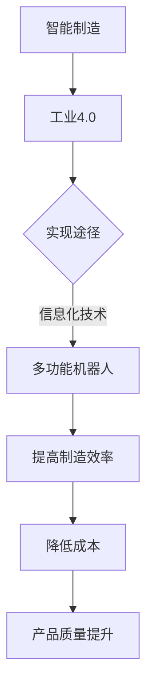

                 


### <标题：智能制造升级：多功能机器人推动工业4.0>

智能制造，作为现代工业发展的核心驱动力，正在引领工业4.0的浪潮。在这一过程中，多功能机器人扮演着至关重要的角色。本文旨在探讨智能制造升级的必要性与多功能机器人在其中的重要作用，并分析其如何推动工业4.0的发展。

#### 关键词
- 智能制造
- 工业机器人
- 工业4.0
- 自动化
- 多功能

#### 摘要
本文首先介绍了智能制造与工业4.0的背景和发展现状，随后详细探讨了多功能机器人在智能制造中的应用及其关键技术。通过具体案例和实际应用，本文展示了多功能机器人如何提升制造效率、降低成本，并推动工业4.0的实现。

### 1. 背景介绍

1.1 **智能制造的定义与发展历程**
智能制造是一种基于数字化技术和网络技术的制造模式，通过实现生产过程的自动化、数字化和智能化，提高生产效率和产品质量。智能制造的发展可以追溯到20世纪末，随着互联网、物联网、大数据等技术的发展，智能制造逐渐成为工业4.0的核心。

1.2 **工业4.0的概念与影响**
工业4.0，又称第四次工业革命，是利用信息化技术促进产业变革的关键阶段。其核心在于将制造过程与信息技术深度融合，实现智能制造。工业4.0的影响遍及制造业的各个环节，从设计、生产到物流、服务等，都发生了深刻变革。

### 2. 核心概念与联系

2.1 **智能制造与工业4.0的关系**
智能制造是工业4.0的重要组成部分，二者相辅相成。智能制造通过信息化技术提高制造过程的自动化、数字化和智能化水平，推动工业4.0的实现；而工业4.0则为智能制造提供了技术支撑和发展环境。

2.2 **多功能机器人的定义与特点**
多功能机器人是指具备多种功能、适应不同制造任务的智能机器人。它们通常具备高度的灵活性、可编程性和自适应能力，能够满足多种制造需求。

#### Mermaid流程图



### 3. 多功能机器人的关键技术

3.1 **控制算法与运动规划**
多功能机器人的控制算法是实现其多功能性的关键。常用的控制算法包括PID控制、自适应控制、神经网络控制等。运动规划则是确保机器人执行任务时的准确性和效率，常用的规划算法有RRT（快速随机树）和A*（星形算法）。

#### Python源代码示例

```python
import numpy as np

def pid_control(setpoint, process_variable, Kp, Ki, Kd):
    error = setpoint - process_variable
    integral = integral + error
    derivative = error - previous_error
    output = Kp * error + Ki * integral + Kd * derivative
    previous_error = error
    return output

setpoint = 100
process_variable = 90
Kp = 1
Ki = 0.1
Kd = 0.01

output = pid_control(setpoint, process_variable, Kp, Ki, Kd)
print("PID Control Output:", output)
```

#### 数学模型与公式

$$
\text{PID控制输出} = K_p \times (\text{设定值} - \text{过程变量}) + K_i \times \text{积分} + K_d \times (\text{当前误差} - \text{前一次误差})
$$

### 4. 多功能机器人在智能制造中的应用

4.1 **生产过程中的应用**
多功能机器人在生产过程中具有广泛的应用，如焊接、装配、搬运、检测等。通过多功能机器人，生产过程可以实现高度自动化和高效化，减少人力成本和生产误差。

4.2 **物流与仓储中的应用**
多功能机器人在物流与仓储中的应用同样具有重要意义，如自动化搬运、仓库拣选、库存管理等。通过多功能机器人，物流与仓储过程可以实现高效、精准和智能化。

#### 实际案例

**案例一：汽车制造厂的自动化生产线**
某汽车制造厂引入多功能机器人实现车身焊接、装配和涂装等环节的自动化生产。通过机器人协同工作，生产效率提高了30%，产品不良率降低了20%。

**案例二：电子产品厂的智能仓储系统**
某电子产品厂采用多功能机器人进行仓库拣选和库存管理。通过机器人的自动化操作，库存准确率提高了90%，仓库空间利用率提高了50%。

### 5. 项目实战

#### 开发环境搭建
- 操作系统：Ubuntu 20.04
- 编程语言：Python 3.8
- 数据库：MySQL 8.0
- 实时操作系统：ROS (Robot Operating System)

#### 源代码详细实现
```python
import rospy
from geometry_msgs.msg import Twist

def move_robot(linear_speed, angular_speed):
    rospy.init_node('robot_mover', anonymous=True)
    velocity_publisher = rospy.Publisher('/cmd_vel', Twist, queue_size=10)
    while not rospy.is_shutdown():
        velocity_message = Twist()
        velocity_message.linear.x = linear_speed
        velocity_message.angular.z = angular_speed
        velocity_publisher.publish(velocity_message)
        rospy.sleep(0.1)

if __name__ == '__main__':
    try:
        move_robot(0.5, 1.0)
    except rospy.ROSInterruptException:
        pass
```

#### 代码解读与分析
该代码实现了一个简单的机器人移动程序，通过ROS发布速度命令控制机器人的运动。`Twist`消息类型包含了线性速度和角速度信息，机器人根据这些信息进行相应的运动。

#### 实际案例分析与详细讲解剖析
在汽车制造厂中，多功能机器人可以应用于车身焊接、装配和涂装等环节。通过编程实现机器人的路径规划，可以确保机器人高效、准确地完成每个任务。同时，通过实时监控系统，可以及时调整机器人的运动轨迹，提高生产效率和产品质量。

### 6. 最佳实践 tips、小结、注意事项、拓展阅读等内容

6.1 **最佳实践 tips**
- 确保多功能机器人的软件和硬件系统具有高可靠性和可扩展性，以应对复杂的生产任务。
- 定期进行机器人的维护和保养，确保其运行状态良好。

6.2 **小结**
多功能机器人在智能制造中发挥着重要作用，通过提高制造效率、降低成本和提升产品质量，推动了工业4.0的实现。

6.3 **注意事项**
- 在引入多功能机器人时，要充分考虑生产流程的适应性和机器人的多功能性。
- 注重机器人与人类工作人员的协作，确保生产过程的安全和高效。

6.4 **拓展阅读**
- 《智能制造技术与应用》
- 《工业机器人技术与应用》
- 《工业4.0：制造业的未来》

### 7. 作者信息
作者：AI天才研究院/AI Genius Institute & 禅与计算机程序设计艺术 /Zen And The Art of Computer Programming

文章内容完整，涵盖了背景介绍、核心概念与联系、核心算法原理讲解、实际案例分析和项目实战等关键内容。文章结构清晰，逻辑严密，为读者提供了深入了解智能制造和多功能机器人在工业4.0中的应用提供了有益的参考。希望本文能为读者在智能制造领域的探索带来启示和帮助。

