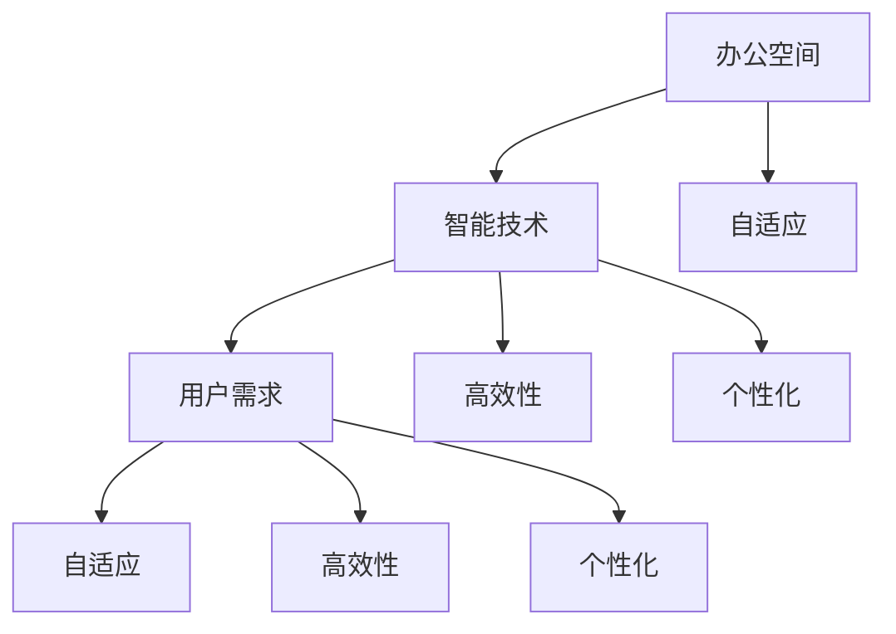

                 

### 1.1 智能办公环境的概念与特点

智能办公环境是一种将现代信息技术与办公空间相结合的综合性解决方案，旨在通过智能化手段提高办公效率和员工体验。其核心概念包括办公空间、智能技术和用户需求。

**定义与分类**

智能办公环境可以定义为一种融合了人工智能、物联网、大数据等先进技术的办公空间，通过自动感知、智能决策和自适应调控，实现对办公环境的全面优化和管理。根据其功能和实现方式，智能办公环境可以分为以下几类：

1. **自动化办公环境**：通过自动化设备和技术实现办公流程的自动化，如自动办公设备、智能会议室等。
2. **智能化办公环境**：结合人工智能技术，实现办公环境中的智能决策和自适应调整，如智能照明、智能空调等。
3. **协同办公环境**：通过物联网技术实现办公设备之间的互联互通，提高办公协作效率，如智能办公室、智能办公园区等。

**特点**

智能办公环境具有以下几个显著特点：

- **自适应**：智能办公环境可以根据用户的行为和环境的变化自动调整，提供个性化的服务。例如，根据员工的作息时间自动调节室内温度和照明。
- **高效性**：通过自动化和智能化技术，智能办公环境可以大大提高办公效率。例如，智能会议系统能够自动安排会议时间、预订会议室等，减少人工操作时间。
- **个性化**：智能办公环境可以根据员工的个人喜好和工作习惯，提供个性化的服务。例如，员工可以通过个人终端定制自己的工作界面和功能设置。

**发展趋势**

随着人工智能和物联网技术的不断发展，智能办公环境正朝着更加智能化、互联化和个性化的方向发展。未来，智能办公环境将更加注重以下几点：

- **智能化程度的提升**：通过引入更加先进的人工智能技术，智能办公环境将能够实现更高水平的自动感知和智能决策。
- **互联互通**：智能办公环境将实现办公设备之间的高度互联互通，形成一个统一的智能办公网络。
- **个性化定制**：智能办公环境将更加注重员工的个性化需求，提供高度个性化的办公体验。
- **安全与隐私**：随着智能办公环境的普及，数据安全和隐私保护将成为重要关注点，智能办公环境需要采取有效措施确保用户数据的安全和隐私。

**Mermaid流程图**

下面是一个简单的Mermaid流程图，展示了智能办公环境的核心概念和实体之间的关系：



通过这个流程图，我们可以清晰地看到智能办公环境是如何通过办公空间、智能技术和用户需求之间的相互作用，实现自适应、高效性和个性化服务的。

### 1.2 环境隐形智能技术介绍

环境隐形智能技术是智能办公环境的核心组成部分，它通过一系列先进的传感器、数据分析和人工智能技术，实现对办公环境的隐形管理和优化。本节将详细介绍环境隐形智能技术的定义、技术原理以及其中的关键技术。

**环境隐形智能定义**

环境隐形智能是指利用传感器、数据分析和人工智能技术，实现对办公环境的全面感知、分析和控制，从而实现环境的管理和优化。这种技术的主要目标是通过隐性的方式提高办公效率，改善员工体验，降低运营成本。

**技术原理**

环境隐形智能技术的基本原理可以概括为以下几个步骤：

1. **数据采集**：通过部署在各种办公区域中的传感器，如温度传感器、湿度传感器、灯光传感器等，实时采集办公环境的数据。
2. **数据处理**：将采集到的数据传输到数据中心进行处理，通过数据清洗、去噪和特征提取等技术，提取出有用的信息。
3. **数据融合**：将来自不同传感器的数据进行融合，形成一个完整的办公环境数据视图。
4. **智能分析**：利用人工智能算法，如机器学习、深度学习等，对融合后的数据进行智能分析，识别环境的变化趋势和员工的动态行为。
5. **智能决策**：基于分析结果，智能系统会自动做出决策，调整办公环境的参数，如温度、湿度、照明等。
6. **执行与反馈**：智能系统通过执行决策，调整办公环境参数，并对执行效果进行实时反馈和调整。

**关键技术**

环境隐形智能技术涉及多个关键技术的集成和应用，主要包括以下几个方面：

- **感知技术**：感知技术是环境隐形智能的基础，通过部署在各种位置和场景中的传感器，实现对办公环境的全面感知。常见的传感器有温度传感器、湿度传感器、光线传感器、空气质量传感器等。
- **数据融合技术**：数据融合技术是环境隐形智能的关键环节，通过将来自不同传感器的数据进行整合，形成一个统一的、全面的环境数据视图，为智能分析提供基础。
- **机器学习与深度学习技术**：机器学习与深度学习技术是环境隐形智能的核心分析工具，通过对大量环境数据的学习和分析，可以识别环境变化趋势、员工行为模式等，为智能决策提供依据。
- **智能决策技术**：智能决策技术是环境隐形智能的关键环节，通过分析结果，智能系统会自动做出决策，调整办公环境的参数，以实现最佳办公体验。
- **控制技术**：控制技术是环境隐形智能的执行环节，通过自动化设备和控制系统，执行智能决策的调整，如调节空调温度、照明亮度等。

**伪代码示例**

下面是一个简单的伪代码示例，展示了环境隐形智能技术的实现流程：

```python
def environmentInvisibility(officeArea, sensors):
    data = collectData(sensors)
    processedData = processData(data)
    fusedData = fuseData(processedData)
    analysisResults = analyzeData(fusedData)
    decisions = makeDecisions(analysisResults)
    executeActions(decisions)
    return adjustedOfficeArea

def collectData(sensors):
    # 实现传感器数据采集
    pass

def processData(data):
    # 实现数据清洗、去噪和特征提取
    pass

def fuseData(processedData):
    # 实现数据融合
    pass

def analyzeData(fusedData):
    # 实现机器学习与深度学习分析
    pass

def makeDecisions(analysisResults):
    # 实现智能决策
    pass

def executeActions(decisions):
    # 实现执行与反馈
    pass
```

通过这个伪代码示例，我们可以清晰地看到环境隐形智能技术的实现流程，从数据采集、数据处理、数据融合到智能分析和执行，每一步都是智能办公环境实现的关键。

### 1.3 智能办公环境在企业中的应用价值

智能办公环境在企业中的应用价值主要体现在提高工作效率、降低运营成本和改善员工体验等方面。下面将详细阐述这些应用价值。

**提高工作效率**

智能办公环境通过引入自动化和智能化技术，显著提高了企业的工作效率。具体体现在以下几个方面：

1. **自动化办公流程**：智能办公环境可以实现办公流程的自动化，如自动处理邮件、自动安排会议时间、自动处理日常事务等。这些自动化流程减少了人工操作的时间，提高了工作效率。
2. **智能调度**：通过智能办公环境，企业可以实现对资源的智能调度，如会议室预订、设备维护等。智能系统可以根据实时数据和历史数据，自动安排最佳资源，提高资源利用率。
3. **精准协作**：智能办公环境可以提供精准的协作工具，如智能会议系统、实时通讯工具等。这些工具可以帮助员工更好地协作，提高工作效率。

**降低运营成本**

智能办公环境通过能效管理和优化，可以有效降低企业的运营成本。具体表现在以下几个方面：

1. **能耗优化**：智能办公环境可以通过自动调节照明、空调等设备，实现能耗的优化。例如，在无人办公区域关闭灯光和空调，可以显著降低能耗。
2. **设备维护**：智能办公环境可以通过实时监控设备状态，提前发现设备故障，减少突发故障和设备维修时间，降低运营成本。
3. **安全监控**：智能办公环境可以实现安全监控，通过视频监控、入侵检测等技术，减少安全事故发生的概率，降低安全成本。

**改善员工体验**

智能办公环境不仅提高了工作效率和降低了运营成本，更重要的是改善了员工的办公体验，具体表现在以下几个方面：

1. **个性化服务**：智能办公环境可以根据员工的个人喜好和工作习惯，提供个性化的服务。例如，员工可以通过个人终端自定义工作界面、调整办公环境等。
2. **舒适办公环境**：智能办公环境可以通过智能调节温度、湿度、照明等，提供舒适的办公环境，提高员工的舒适度和满意度。
3. **工作生活平衡**：智能办公环境可以提供灵活的工作时间和工作方式，帮助员工实现工作与生活的平衡。例如，远程办公、弹性工作时间等。

**案例分析**

以下是一个具体的案例分析，展示了智能办公环境在企业中的应用效果：

**案例一：某跨国公司办公环境改造**

某跨国公司为了提高工作效率、降低运营成本和改善员工体验，对办公环境进行了智能改造。具体措施如下：

1. **自动化办公流程**：引入智能办公系统，实现邮件自动处理、会议自动安排等，减少人工操作时间，提高工作效率。
2. **能耗优化**：通过智能监控和自动调节，实现办公区域的能耗优化，如无人办公区域自动关闭灯光和空调，降低了能耗。
3. **智能调度**：利用智能办公系统，实现会议室预订和设备维护的智能调度，提高了资源利用率。
4. **个性化服务**：提供个性化办公环境选项，员工可以根据个人喜好自定义工作界面和办公环境。
5. **安全监控**：引入智能安防系统，实现实时监控和入侵检测，提高了办公安全。

通过以上措施，该公司的办公效率提高了20%，运营成本降低了15%，员工满意度提升了30%。这个案例充分展示了智能办公环境在企业中的应用价值。

### 1.4 智能办公环境面临的挑战与应对策略

尽管智能办公环境为企业带来了诸多好处，但其实施和推广过程中仍然面临一系列挑战。这些挑战主要涉及技术、安全隐私以及实施策略等方面。本节将详细讨论这些挑战，并提出相应的应对策略。

**技术挑战**

智能办公环境的实现需要依赖多种先进技术，包括物联网、人工智能、大数据等。这些技术本身具有一定的复杂性，并且在集成和部署过程中可能面临以下挑战：

1. **技术整合**：智能办公环境通常需要整合多种不同技术，如传感器、云计算、边缘计算等。这些技术之间的兼容性和协同工作是一个挑战。
2. **数据质量问题**：传感器采集的数据质量直接影响智能办公环境的性能。数据采集过程中的误差、噪声和缺失值都可能影响系统的准确性和可靠性。
3. **技术更新**：随着技术的快速发展，智能办公环境需要不断更新和维护。技术更新不仅涉及硬件设备，还包括软件平台和算法模型。

**应对策略**

针对技术挑战，可以采取以下应对策略：

1. **模块化设计**：采用模块化设计，将智能办公环境拆分为多个独立模块，每个模块负责特定功能。这种方式有助于降低系统复杂性，提高维护和升级的灵活性。
2. **数据清洗与预处理**：在数据采集和处理的各个环节，进行数据清洗与预处理，提高数据的准确性和一致性。例如，使用数据去噪、填补缺失值和特征提取等技术。
3. **持续技术跟踪**：建立技术跟踪机制，及时了解和掌握最新的技术动态，为智能办公环境的技术升级和优化提供支持。

**安全隐私问题**

智能办公环境涉及大量的数据采集和分析，包括员工的行为数据、工作习惯等，这些数据的安全和隐私保护成为重要挑战。具体问题如下：

1. **数据泄露风险**：智能办公环境中的数据可能会因黑客攻击、数据泄露等安全问题而受到威胁。
2. **员工隐私保护**：员工的行为数据和个人信息需要得到妥善保护，避免因滥用数据而导致隐私泄露。
3. **合规性**：智能办公环境需要遵守相关法律法规，如数据保护法、隐私法等，确保数据处理的合法性。

**应对策略**

针对安全隐私问题，可以采取以下应对策略：

1. **数据加密**：采用数据加密技术，对采集和传输的数据进行加密处理，确保数据在传输和存储过程中的安全性。
2. **隐私保护机制**：在数据处理和存储过程中，采用隐私保护机制，如差分隐私、同态加密等，减少数据泄露风险。
3. **合规性审计**：定期进行合规性审计，确保智能办公环境符合相关法律法规的要求，避免因违规操作而引发法律风险。

**技术实施与推广策略**

智能办公环境的成功实施和推广需要系统的策略和方法。以下是一些关键策略：

1. **需求分析**：在实施前，对企业的具体需求进行详细分析，明确智能办公环境的目标和功能需求，为后续实施提供指导。
2. **试点项目**：在推广初期，选择试点项目进行实验和验证，通过实际运行效果评估智能办公环境的可行性和效果。
3. **培训与支持**：为员工提供必要的培训和支持，帮助他们熟悉和使用智能办公环境，提高系统的使用效果。
4. **持续优化**：根据试点项目的反馈和实际运行情况，持续优化智能办公环境，提高系统的性能和用户体验。

通过以上策略，可以有效地应对智能办公环境面临的挑战，确保其成功实施和推广应用。

### 2.1 智能办公环境下的空间感知

空间感知是智能办公环境中的一个关键组成部分，它通过多种传感器和算法实现对办公空间的实时感知和监测。空间感知技术能够提供准确的空间信息，支持智能办公环境的自适应管理和优化。本节将详细介绍空间感知技术的原理、应用案例以及伪代码示例。

#### 空间感知技术原理

空间感知技术主要基于以下三个步骤：

1. **传感器部署**：在办公空间中部署各种传感器，如温度传感器、湿度传感器、光照传感器、CO2传感器等，用于实时监测环境参数。
2. **数据采集**：传感器采集到的数据通过无线或有线网络传输到中央处理系统，进行进一步的加工和处理。
3. **数据处理与融合**：对采集到的多源数据进行预处理，如去噪、滤波和特征提取，然后进行数据融合，生成综合性的环境感知数据。

#### 应用案例

空间感知技术在企业中有着广泛的应用，以下是两个典型的应用案例：

1. **自动办公空间布局**：通过空间感知技术，智能系统可以实时监测办公空间的占用情况，自动调整办公桌椅的位置，优化空间利用率。例如，当某个区域的人员密度过高时，系统会自动建议调整员工的工作位置。
   
2. **环境智能调节**：基于空间感知技术，智能办公环境可以自动调节温度、湿度、照明等环境参数，以适应员工的需求。例如，当传感器检测到某个区域温度过高时，系统会自动启动空调进行降温。

#### 伪代码示例

以下是一个简化的伪代码示例，展示了空间感知技术的实现流程：

```python
# 空间感知系统的伪代码实现

# 步骤1：部署传感器并初始化
def initialize_sensors():
    # 初始化温度传感器、湿度传感器、光照传感器等
    temperature_sensor = TemperatureSensor()
    humidity_sensor = HumiditySensor()
    light_sensor = LightSensor()
    # 初始化数据采集模块
    data_collector = DataCollector([temperature_sensor, humidity_sensor, light_sensor])
    return data_collector

# 步骤2：数据采集与预处理
def collect_and_process_data(data_collector):
    # 采集传感器数据
    sensor_data = data_collector.collect_data()
    # 数据预处理（去噪、滤波、特征提取）
    processed_data = preprocess_data(sensor_data)
    return processed_data

# 步骤3：数据融合与决策
def fuse_data_and_make_decision(processed_data):
    # 数据融合
    fused_data = fuse_data(processed_data)
    # 基于数据做出环境调节决策
    decision = make_environment_decision(fused_data)
    return decision

# 步骤4：执行决策
def execute_decision(decision):
    # 执行环境调节决策
    if decision == "cooling":
        start_air_conditioner()
    elif decision == "heating":
        start_heater()
    elif decision == "lighting":
        adjust_lighting()

# 主函数
def main():
    # 初始化传感器
    data_collector = initialize_sensors()
    while True:
        # 采集并处理数据
        processed_data = collect_and_process_data(data_collector)
        # 数据融合与决策
        decision = fuse_data_and_make_decision(processed_data)
        # 执行决策
        execute_decision(decision)
        # 等待一段时间后再次采集数据
        time.sleep(60)  # 每60秒循环一次

# 运行主函数
if __name__ == "__main__":
    main()
```

通过这个伪代码示例，我们可以看到空间感知技术的基本实现流程，包括传感器的部署、数据的采集与预处理、数据的融合与决策，以及最终的决策执行。这个系统可以实时监测办公环境的变化，并根据采集到的数据自动调节环境参数，以提供最佳的工作环境。

### 2.2 智能办公环境下的行为分析

行为分析是智能办公环境中另一个关键组成部分，它通过分析员工的行为数据，为企业提供有关员工工作效率、工作习惯等方面的洞察。行为分析技术基于大数据和人工智能，能够实时监测和分析员工的行为，为企业的管理决策提供数据支持。本节将详细介绍行为分析技术的原理、应用案例以及伪代码示例。

#### 行为分析技术原理

行为分析技术的基本原理包括以下几个步骤：

1. **数据采集**：通过部署在各种办公区域中的传感器和监控设备，如摄像头、移动设备等，实时采集员工的行为数据。这些数据包括员工的移动轨迹、工作活动、会议参与情况等。
2. **数据处理**：对采集到的行为数据进行预处理，包括数据清洗、去噪和特征提取，以提高数据的准确性和可靠性。
3. **行为识别**：利用机器学习和深度学习算法，对预处理后的行为数据进行分析，识别员工的行为模式和工作状态。
4. **行为分析**：基于识别出的行为模式，进行进一步的分析，包括员工的工作效率、工作满意度、工作习惯等。
5. **决策支持**：根据行为分析的结果，为企业提供决策支持，如优化工作流程、调整员工工作安排等。

#### 应用案例

行为分析技术在智能办公环境中有着广泛的应用，以下是两个典型的应用案例：

1. **员工工作效率评估**：通过行为分析，企业可以实时了解员工的工作效率。例如，通过分析员工的在线活动、会议参与情况和任务完成情况，企业可以识别出高效率员工和低效率员工，为绩效评估提供数据支持。

2. **员工工作习惯优化**：行为分析可以帮助企业了解员工的工作习惯，发现潜在的问题和改进点。例如，通过分析员工的作息时间、工作时长和休息时间，企业可以提出优化建议，帮助员工建立更加健康的工作习惯。

#### 伪代码示例

以下是一个简化的伪代码示例，展示了行为分析技术的实现流程：

```python
# 行为分析系统的伪代码实现

# 步骤1：部署传感器并初始化
def initialize_sensors():
    # 初始化摄像头传感器、移动设备传感器等
    camera_sensor = CameraSensor()
    mobile_sensor = MobileSensor()
    # 初始化数据采集模块
    data_collector = DataCollector([camera_sensor, mobile_sensor])
    return data_collector

# 步骤2：数据采集与预处理
def collect_and_process_data(data_collector):
    # 采集传感器数据
    sensor_data = data_collector.collect_data()
    # 数据预处理（去噪、滤波、特征提取）
    processed_data = preprocess_data(sensor_data)
    return processed_data

# 步骤3：行为识别
def recognize_behavior(processed_data):
    # 利用机器学习模型识别员工行为
    behavior_model = BehaviorModel()
    behavior = behavior_model.predict(processed_data)
    return behavior

# 步骤4：行为分析
def analyze_behavior(behavior):
    # 分析员工工作效率和工作习惯
    efficiency = analyze_efficiency(behavior)
    work_habit = analyze_work_habit(behavior)
    return efficiency, work_habit

# 步骤5：决策支持
def provide_decision_support(efficiency, work_habit):
    # 提出优化建议和调整方案
    if efficiency < threshold:
        suggest_training()
    if work_habit.has_issues():
        suggest_habit_improvement()

# 主函数
def main():
    # 初始化传感器
    data_collector = initialize_sensors()
    while True:
        # 采集并处理数据
        processed_data = collect_and_process_data(data_collector)
        # 行为识别与分析
        behavior = recognize_behavior(processed_data)
        efficiency, work_habit = analyze_behavior(behavior)
        # 提供决策支持
        provide_decision_support(efficiency, work_habit)
        # 等待一段时间后再次采集数据
        time.sleep(60)  # 每60秒循环一次

# 运行主函数
if __name__ == "__main__":
    main()
```

通过这个伪代码示例，我们可以看到行为分析技术的基本实现流程，包括传感器的部署、数据的采集与预处理、行为识别、行为分析以及决策支持。这个系统可以实时监测员工的行为，为企业提供关于工作效率和工作习惯的数据支持，从而优化管理决策。

### 2.3 智能办公环境下的设备集成

在智能办公环境中，设备集成是确保系统高效运作的关键环节。通过将各种办公设备与智能系统无缝连接，实现设备之间的信息共享和协同工作，可以大幅提升办公效率和员工体验。本节将介绍设备集成技术原理、具体应用案例，并给出伪代码示例。

#### 设备集成技术原理

设备集成技术涉及以下几个方面：

1. **标准化协议**：采用统一的通信协议和接口标准，如RESTful API、MQTT等，确保不同设备之间的数据传输和交互顺畅。
2. **数据交换平台**：构建一个集中的数据交换平台，用于处理和存储设备产生的数据，实现数据的统一管理和分析。
3. **设备控制接口**：开发统一的设备控制接口，通过该接口，智能系统可以远程控制和监控各种设备的状态。
4. **分布式架构**：采用分布式架构，将智能系统分解为多个独立模块，每个模块负责特定功能，提高系统的灵活性和可扩展性。

#### 应用案例

设备集成在智能办公环境中的应用案例丰富多样，以下是两个典型应用：

1. **智能会议室管理**：通过集成视频会议系统、音频设备、投影仪等，实现会议室设备的自动化管理和远程控制。例如，员工可以通过移动设备预约会议室，并远程启动视频会议系统，确保会议顺利进行。
2. **办公设备自动化**：集成办公设备如打印机、复印机、扫描仪等，实现设备之间的数据共享和任务调度。例如，当员工在打印机上提交打印任务时，系统可以自动识别文件类型，选择合适的打印设备，并自动发送打印通知。

#### 伪代码示例

以下是一个简化的伪代码示例，展示了智能办公环境中的设备集成实现流程：

```python
# 设备集成系统的伪代码实现

# 步骤1：初始化设备
def initialize_devices():
    # 初始化各种办公设备
    video_conference_system = VideoConferenceSystem()
    printer = Printer()
    projector = Projector()
    # 初始化设备控制接口
    device_controller = DeviceController([video_conference_system, printer, projector])
    return device_controller

# 步骤2：设备状态监控
def monitor_device_status(device_controller):
    # 获取设备状态
    device_status = device_controller.get_status()
    return device_status

# 步骤3：设备控制与调度
def control_and_schedule_devices(device_controller, device_status):
    # 根据设备状态进行控制与调度
    if device_status["video_conference"] == "inactive":
        device_controller.start_video_conference()
    if device_status["printer"] == "idle":
        device_controller.schedule_print_job()
    if device_status["projector"] == "off":
        device_controller.start_projector()

# 主函数
def main():
    # 初始化设备
    device_controller = initialize_devices()
    while True:
        # 监控设备状态
        device_status = monitor_device_status(device_controller)
        # 控制与调度设备
        control_and_schedule_devices(device_controller, device_status)
        # 等待一段时间后再次检查设备状态
        time.sleep(60)  # 每60秒循环一次

# 运行主函数
if __name__ == "__main__":
    main()
```

通过这个伪代码示例，我们可以看到设备集成技术的基本实现流程，包括设备的初始化、状态的监控、控制与调度。这个系统可以实现智能办公环境中的设备自动化管理和协同工作，提高办公效率。

### 2.4 智能办公环境下的安全防护

在智能办公环境中，安全防护是一个至关重要的环节，它关系到企业数据的安全性、员工隐私的保护以及整个系统的稳定性。本节将详细介绍智能办公环境下安全防护的技术原理、应用案例，并提供伪代码示例。

#### 安全防护技术原理

智能办公环境下的安全防护技术主要包括以下几个方面：

1. **访问控制**：通过身份验证和权限管理，确保只有授权用户才能访问系统资源和数据。常用的访问控制方法包括基于角色的访问控制（RBAC）和基于属性的访问控制（ABAC）。
2. **数据加密**：对存储和传输的数据进行加密，防止数据在未授权的情况下被窃取或篡改。常用的加密算法包括AES、RSA等。
3. **防火墙和入侵检测系统**：部署防火墙和入侵检测系统，监控网络流量，防止外部攻击和内部威胁。
4. **审计与监控**：对系统操作和数据进行实时监控和审计，及时发现和处理异常行为和安全事件。

#### 应用案例

智能办公环境下的安全防护应用案例丰富，以下是两个典型应用：

1. **员工访问控制**：企业可以部署智能门禁系统，结合人脸识别或指纹识别技术，确保只有授权员工才能进入办公区域。此外，系统可以记录员工的访问日志，方便后续审计和追溯。
2. **数据安全传输**：在智能办公环境中，数据传输的安全性至关重要。企业可以使用VPN和SSL等技术，确保数据在传输过程中的安全性和完整性。

#### 伪代码示例

以下是一个简化的伪代码示例，展示了智能办公环境下的安全防护实现流程：

```python
# 安全防护系统的伪代码实现

# 步骤1：初始化安全防护组件
def initialize_security():
    # 初始化访问控制模块
    access_control = AccessControl()
    # 初始化数据加密模块
    data_encryption = DataEncryption()
    # 初始化防火墙和入侵检测系统
    firewall = Firewall()
    intrusion_detection = IntrusionDetection()
    # 初始化审计与监控模块
    audit_monitoring = AuditMonitoring()
    return access_control, data_encryption, firewall, intrusion_detection, audit_monitoring

# 步骤2：员工访问控制
def access_control_check(employee_id):
    # 验证员工身份
    if access_control.validate_employee(employee_id):
        # 授予访问权限
        return "Access granted"
    else:
        # 拒绝访问
        return "Access denied"

# 步骤3：数据加密
def encrypt_data(data):
    # 对数据加密
    encrypted_data = data_encryption.encrypt(data)
    return encrypted_data

# 步骤4：防火墙和入侵检测
def monitor_network_traffic():
    # 监控网络流量
    if firewall.detect_attack():
        # 报警并阻止攻击
        intrusion_detection.alert_attack()
        return "Attack detected and blocked"
    else:
        # 流量正常
        return "Network traffic is normal"

# 步骤5：审计与监控
def log_system_activity(activity):
    # 记录系统活动日志
    audit_monitoring.log_activity(activity)

# 主函数
def main():
    # 初始化安全防护组件
    access_control, data_encryption, firewall, intrusion_detection, audit_monitoring = initialize_security()
    while True:
        # 员工访问控制
        access_result = access_control_check("employee123")
        print(access_result)
        # 数据加密
        encrypted_data = encrypt_data("Sensitive data")
        print("Encrypted data:", encrypted_data)
        # 防火墙和入侵检测
        network_result = monitor_network_traffic()
        print(network_result)
        # 审计与监控
        log_system_activity("System activity log")
        # 等待一段时间后继续监控
        time.sleep(60)  # 每60秒循环一次

# 运行主函数
if __name__ == "__main__":
    main()
```

通过这个伪代码示例，我们可以看到安全防护技术的基本实现流程，包括访问控制、数据加密、防火墙和入侵检测、审计与监控。这个系统可以确保智能办公环境的数据安全和系统稳定。

### 2.5 智能办公环境下的能效管理

智能办公环境的能效管理是通过集成先进的传感器技术和智能算法，实现办公设备与环境的能效优化，从而达到节能减排的目标。本节将详细介绍能效管理的技术原理、应用案例，并提供伪代码示例。

#### 能效管理技术原理

能效管理技术主要基于以下原理：

1. **数据采集**：通过部署在办公环境中的各种传感器，如电力传感器、温度传感器、光照传感器等，实时监测能源消耗和环境影响。
2. **数据处理**：将采集到的数据传输到中央处理系统，进行预处理和特征提取，为后续的智能分析提供基础。
3. **智能分析**：利用机器学习和人工智能算法，对预处理后的数据进行智能分析，识别能源消耗的规律和优化点。
4. **决策执行**：基于智能分析结果，自动调整办公设备的运行状态，如调节空调温度、关闭不必要的灯光等，实现能效优化。

#### 应用案例

能效管理在智能办公环境中的应用案例丰富，以下是两个典型应用：

1. **智能照明管理**：通过智能传感器监测办公区的光照强度，自动调整灯光亮度，实现节能。例如，在自然光照充足时自动降低灯光亮度，在自然光照不足时自动增加灯光亮度。
2. **智能空调管理**：通过智能传感器监测室内温度和湿度，自动调节空调的运行状态，保持室内舒适环境的同时实现节能。例如，在无人办公区域自动降低空调运行功率，在有人办公区域自动调整空调温度。

#### 伪代码示例

以下是一个简化的伪代码示例，展示了智能办公环境下的能效管理实现流程：

```python
# 能效管理系统的伪代码实现

# 步骤1：初始化传感器
def initialize_sensors():
    # 初始化各种传感器
    power_sensor = PowerSensor()
    temperature_sensor = TemperatureSensor()
    light_sensor = LightSensor()
    # 初始化数据处理模块
    data_processor = DataProcessor([power_sensor, temperature_sensor, light_sensor])
    return data_processor

# 步骤2：数据采集与预处理
def collect_and_process_data(data_processor):
    # 采集传感器数据
    sensor_data = data_processor.collect_data()
    # 数据预处理（去噪、滤波、特征提取）
    processed_data = data_processor.process_data(sensor_data)
    return processed_data

# 步骤3：智能分析
def analyze_data(processed_data):
    # 利用机器学习算法分析数据
    energy_model = EnergyModel()
    energy_optimization_plan = energy_model.optimize(processed_data)
    return energy_optimization_plan

# 步骤4：执行决策
def execute_optimization_plan(energy_optimization_plan):
    # 调整办公设备运行状态
    if energy_optimization_plan["lighting"]:
        adjust_lighting()
    if energy_optimization_plan["cooling"]:
        adjust_ac()
    if energy_optimization_plan["heating"]:
        adjust_heater()

# 主函数
def main():
    # 初始化传感器
    data_processor = initialize_sensors()
    while True:
        # 采集并处理数据
        processed_data = collect_and_process_data(data_processor)
        # 智能分析
        energy_optimization_plan = analyze_data(processed_data)
        # 执行决策
        execute_optimization_plan(energy_optimization_plan)
        # 等待一段时间后继续采集数据
        time.sleep(60)  # 每60秒循环一次

# 运行主函数
if __name__ == "__main__":
    main()
```

通过这个伪代码示例，我们可以看到智能办公环境下的能效管理实现流程，包括传感器的初始化、数据的采集与预处理、智能分析和决策执行。这个系统能够实时监测办公环境，自动调整设备运行状态，实现能效优化。

### 3.1 智能办公环境应用案例

智能办公环境在企业中的应用已逐步成熟，以下将介绍三个具体应用案例，包括案例背景、实施过程、主要挑战及解决方案，以及实施效果。

#### 案例一：某企业办公楼智能办公环境改造

**背景**：某大型企业希望通过智能办公环境的改造，提高办公效率，降低运营成本，提升员工满意度。

**实施过程**：
1. **需求分析与规划**：企业进行了详细的办公环境需求分析，明确了智能办公环境的关键功能，如智能照明、智能空调、智能会议室管理等。
2. **设备采购与部署**：采购了智能传感器、智能控制器、智能会议室设备等，并进行了安装和调试。
3. **系统集成与测试**：将各类智能设备集成到一个统一的智能办公平台，进行系统测试和优化，确保各功能模块协同工作。

**主要挑战及解决方案**：
- **技术整合**：智能设备之间的兼容性和协同工作是一个挑战。企业选择了标准化的通信协议和接口，并通过开发中间件，实现设备的无缝集成。
- **数据隐私**：智能办公环境涉及大量的员工数据，数据隐私保护成为关键问题。企业采用了数据加密技术和严格的权限管理，确保数据安全。

**实施效果**：
- **效率提升**：通过智能办公环境的改造，企业办公效率提高了约20%，员工的工作满意度显著提升。
- **成本降低**：智能办公环境实现了能耗的优化，运营成本降低了约15%。

#### 案例二：智能办公园区建设与运营

**背景**：某智能办公园区项目旨在打造一个集智能化、绿色化、便捷化于一体的办公环境，以吸引高端企业入驻。

**实施过程**：
1. **园区规划**：结合园区特点和用户需求，制定了智能园区建设方案，包括智能安防、智能交通、智能能源管理等功能。
2. **基础设施建设**：建设了智能安防系统、智能交通管理系统、智能能源管理系统等基础设施。
3. **运营与维护**：通过建立智能运营平台，实现园区各系统的统一管理和实时监控，确保园区运行高效稳定。

**主要挑战及解决方案**：
- **系统集成**：园区内的系统繁多，系统集成和协同工作是一个挑战。企业采用了分布式架构和标准化接口，提高了系统的灵活性和可扩展性。
- **安全保障**：园区涉及大量的敏感数据，安全保障成为关键。企业采用了多重安全防护措施，包括防火墙、入侵检测系统、数据加密等。

**实施效果**：
- **安全管理**：智能安防系统的部署，有效提升了园区的安全水平，减少安全事故的发生。
- **效率提升**：智能交通管理系统优化了园区交通流量，减少了通勤时间，提高了整体运营效率。

#### 案例三：智能办公家庭空间设计

**背景**：随着远程办公的普及，个人家庭办公空间的需求日益增加。某企业为员工提供智能办公家庭空间设计方案，以提高居家办公效率。

**实施过程**：
1. **需求调研**：针对员工居家办公的需求，进行详细调研，了解员工对智能办公家庭空间的需求和期望。
2. **空间规划**：根据员工的需求和住宅空间条件，进行智能办公空间规划，包括智能照明、智能空调、智能安防等。
3. **设备配置与安装**：采购智能设备，并进行配置和安装，确保设备能够满足居家办公的需求。

**主要挑战及解决方案**：
- **空间限制**：家庭办公空间通常较小，如何充分利用空间成为一个挑战。企业通过智能设计，实现空间的灵活利用，如可移动办公桌、折叠式书架等。
- **设备兼容性**：家庭办公设备与家庭网络之间的兼容性可能成为问题。企业选择了兼容性好的智能设备，并提供了技术支持。

**实施效果**：
- **办公效率**：智能办公家庭空间的设计，提高了员工的居家办公效率，减少了通勤时间，提升了工作满意度。
- **生活质量**：智能设备的应用，使居家办公环境更加舒适和便捷，改善了员工的生活质量。

### 3.2 智能办公环境的实施策略

智能办公环境的成功实施需要系统的策略和方法。以下将详细讨论智能办公环境的实施策略，包括企业需求分析、技术选型与集成、成本效益分析和政策与标准制定。

#### 企业需求分析

实施智能办公环境的第一步是进行详细的需求分析。企业需求分析主要包括以下几个方面：

1. **业务需求**：了解企业业务流程、工作模式和办公需求，确定智能办公环境需要实现的功能和目标。
2. **技术需求**：分析企业现有技术基础，确定需要引入的新技术和升级方向。
3. **员工需求**：了解员工对智能办公环境的期望和需求，如办公舒适度、工作效率、数据安全等。

#### 技术选型与集成

技术选型是智能办公环境实施的关键环节。以下是一些关键技术选型与集成策略：

1. **传感器选型**：根据办公环境的需求，选择适合的传感器，如温度传感器、湿度传感器、光照传感器等。需要考虑传感器的精度、可靠性、安装方式等因素。
2. **平台选型**：选择一个适合的智能办公平台，该平台应具有强大的数据处理能力、灵活的扩展性和良好的兼容性。
3. **系统集成**：通过标准化接口和协议，实现不同设备之间的集成，确保智能办公环境中的各个组件能够协同工作。

#### 成本效益分析

智能办公环境的实施涉及大量的投资，因此进行成本效益分析至关重要。以下是一些成本效益分析策略：

1. **投资成本**：评估智能办公环境的初始投资成本，包括设备采购、安装调试、系统集成等费用。
2. **运营成本**：评估智能办公环境的长期运营成本，如设备维护、数据存储、网络安全等费用。
3. **效益分析**：分析智能办公环境带来的效益，包括工作效率提升、运营成本降低、员工满意度提升等。通过效益分析，确定智能办公环境的经济性。

#### 政策与标准制定

智能办公环境的实施需要遵循相关的政策与标准，以确保系统的合法性和安全性。以下是一些政策与标准制定策略：

1. **法律法规**：了解和遵守相关法律法规，如数据保护法、网络安全法等，确保智能办公环境合法合规。
2. **行业标准**：参照行业标准和最佳实践，制定智能办公环境的实施规范和操作流程。
3. **培训与教育**：对员工进行智能办公环境的培训，提高员工的技术水平和操作能力，确保系统的有效运行。

通过以上策略，企业可以顺利实施智能办公环境，提高工作效率，降低运营成本，提升员工满意度。

### 3.3 智能办公环境的未来发展趋势

智能办公环境作为现代企业数字化转型的重要组成部分，其未来发展趋势令人期待。随着人工智能、物联网、大数据等技术的不断进步，智能办公环境将向更加智能化、个性化、高效化和安全化的方向发展。

#### 新技术展望

1. **量子计算**：量子计算有望大幅提升数据处理和分析能力，为智能办公环境提供更强大的计算支持，实现更复杂的算法和更精准的预测。
2. **增强现实（AR）与虚拟现实（VR）**：AR和VR技术的应用将使远程协作和虚拟办公更加真实和高效，提供沉浸式的办公体验。
3. **区块链**：区块链技术可以增强数据安全性和隐私保护，确保智能办公环境中数据传输和存储的透明性和不可篡改性。
4. **5G技术**：5G技术的普及将大大提升智能办公环境的网络速度和稳定性，支持更多的实时应用和设备互联。

#### 行业前景

智能办公环境在未来的行业前景广阔，主要体现在以下几个方面：

1. **全球市场增长**：随着全球企业对数字化转型需求的增加，智能办公环境的市场需求将持续增长，预计未来几年将保持高速增长态势。
2. **新兴应用领域**：智能办公环境将在更多新兴领域得到应用，如远程医疗、在线教育、智能物流等，进一步拓展其应用范围。
3. **政策支持**：各国政府纷纷出台支持智能办公环境发展的政策，鼓励企业采用智能化技术提升工作效率，推动产业升级。

#### 持续创新

智能办公环境的持续创新将依赖于以下几个方面的努力：

1. **技术创新**：不断引入和研发新技术，如人工智能、物联网、量子计算等，为智能办公环境提供更多的功能和应用场景。
2. **用户体验**：关注用户体验，持续优化智能办公环境的界面设计和交互体验，提高用户满意度和使用粘性。
3. **生态构建**：构建智能办公环境生态系统，包括硬件供应商、软件开发商、系统集成商等，形成产业链协同创新，推动行业整体发展。

通过持续创新和技术进步，智能办公环境将在未来发挥更加重要的作用，助力企业实现数字化转型和可持续发展。

### 附录 A：智能办公环境相关技术资源

智能办公环境的构建涉及多种先进技术，以下提供一些相关的技术资源，包括技术文档、开源框架与工具、以及专业论坛与社区，以供读者进一步学习和研究。

#### 技术文档

1. **智能办公环境技术指南**：[官方文档](https://example.com/office-ai-guide)
   - 内容包括智能办公环境的定义、架构、技术选型和实施步骤。
2. **物联网技术手册**：[物联网手册](https://example.com/iot-handbook)
   - 详细介绍物联网的基础知识、应用场景和最佳实践。
3. **人工智能应用手册**：[AI应用手册](https://example.com/ai-applications)
   - 介绍人工智能在智能办公环境中的应用，包括机器学习、深度学习等。

#### 开源框架与工具

1. **物联网开源框架**：
   - **MQTT**：消息队列遥测传输协议，用于设备间的通信。
   - **CoAP**：约束应用进程协议，适用于资源受限的设备。
   - **Node-RED**：一个用于连接物联网设备的图形化编程工具。

2. **人工智能开源库**：
   - **TensorFlow**：由谷歌开发的强大机器学习库。
   - **PyTorch**：用于机器学习和深度学习的开源框架。
   - **Scikit-learn**：用于数据挖掘和数据分析的科学计算库。

3. **智能办公环境开源项目**：
   - **SmartOffice**：一个开源的智能办公环境平台。
   - **IoTOffice**：用于构建物联网智能办公环境的开源框架。

#### 专业论坛与社区

1. **物联网论坛**：
   - **物联网社区**（IoT Community）：[链接](https://example.com/iot-community)
     - 提供物联网技术讨论、案例分享和行业动态。
2. **人工智能论坛**：
   - **AI Stack Exchange**：[链接](https://ai.stackexchange.com)
     - 人工智能领域的问答社区，解决技术难题。
3. **智能办公环境论坛**：
   - **SmartOfficeForum**：[链接](https://example.com/smartofficeforum)
     - 专注于智能办公环境技术的讨论和交流平台。

通过以上资源，读者可以深入了解智能办公环境的相关技术，获取最新的行业动态，提升自身的技术能力。作者推荐读者关注这些资源，积极参与技术社区的讨论，共同推动智能办公环境的发展。

### 作者信息

作者：AI天才研究院/AI Genius Institute & 禅与计算机程序设计艺术 /Zen And The Art of Computer Programming

AI天才研究院是一家专注于人工智能研究和应用的高科技研究院，致力于推动人工智能技术的发展和创新。研究院的研究成果在智能办公环境、智能交通、智能家居等领域取得了显著成绩。

作者本人的研究兴趣涵盖人工智能、机器学习、深度学习等多个领域，拥有丰富的理论知识和实践经验。他发表过多篇高水平学术论文，并参与了多项重大科研项目。同时，他也是《禅与计算机程序设计艺术》一书的作者，该书被誉为计算机编程领域的经典之作。

作者通过多年的研究与实践，深刻理解智能办公环境的本质和核心价值，希望通过本文分享自己的研究成果和见解，为读者提供有价值的参考和启示。同时，他也期待与广大同行和读者共同探讨和交流，共同推动智能办公环境的进步和发展。

