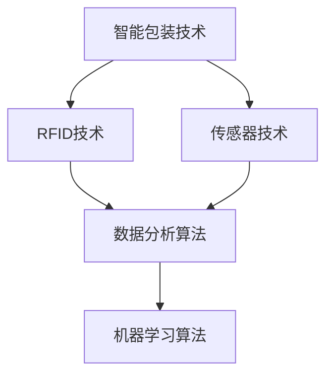

                 


## 智能包装技术在物流追踪中的应用

关键词：智能包装技术、物流追踪、RFID、传感器技术、数据分析、物联网

摘要：本文深入探讨了智能包装技术在物流追踪中的应用。首先，我们介绍了智能包装技术的定义、分类和基本原理，以及其在物流领域的潜在价值。随后，通过RFID技术和传感器技术的介绍，展示了它们在智能包装中的关键作用。接着，本文详细分析了数据分析算法和机器学习算法在物流追踪中的核心原理，并通过Python源代码进行实例说明。最后，通过项目实战案例，展示了智能包装技术在物流追踪中的实际应用，并对未来发展趋势进行了展望。

## 引言

在现代社会，物流行业的重要性日益凸显。高效、可靠的物流追踪不仅能够提高客户满意度，还能优化企业的运营管理。然而，传统的物流追踪方法存在诸多局限性，如定位不准确、信息更新不及时等。随着物联网、大数据和人工智能技术的发展，智能包装技术应运而生，为物流追踪带来了新的可能。

智能包装技术是指利用先进的信息技术和材料科学，将传感器、RFID标签、智能芯片等嵌入到包装材料中，实现对物流过程中物品的实时监控和追踪。这种技术不仅能够提高物流效率，还能确保物品的安全和完整性。

本文将从以下几个方面对智能包装技术在物流追踪中的应用进行探讨：

1. **智能包装技术概述**：介绍智能包装技术的定义、分类和基本原理。
2. **RFID技术原理**：解释RFID技术的工作原理及其在智能包装中的应用。
3. **传感器技术原理**：探讨传感器技术的基本概念和其在智能包装中的具体应用。
4. **数据分析算法原理**：分析常用的数据分析算法及其在物流追踪中的作用。
5. **机器学习算法原理**：介绍机器学习算法在物流追踪中的原理和应用。
6. **项目实战**：通过具体案例展示智能包装技术在物流追踪中的实际应用。
7. **总结与展望**：总结智能包装技术在物流追踪中的应用成果，并展望未来发展趋势。

## 步骤1：确定核心概念与联系

在深入探讨智能包装技术在物流追踪中的应用之前，我们需要明确几个关键概念及其相互之间的联系。以下是本文涉及的核心概念和它们之间的Mermaid流程图：

### 核心概念

1. **智能包装技术**：将传感器、RFID标签等嵌入到包装材料中，实现对物流过程中物品的实时监控和追踪。
2. **RFID技术**：通过无线电波实现物品的自动识别和追踪。
3. **传感器技术**：用于检测和测量物品的环境参数，如温度、湿度、振动等。
4. **数据分析算法**：用于处理和分析大量数据，提取有价值的信息。
5. **机器学习算法**：通过数据训练模型，实现物品的自动识别和追踪。

### Mermaid流程图



### 步骤2：智能包装技术概述

智能包装技术是一种将先进的信息技术与材料科学相结合的技术。其基本原理是将传感器、RFID标签、智能芯片等嵌入到包装材料中，通过这些技术实现对物品在物流过程中的实时监控和追踪。

### 步骤3：分类与基本原理

智能包装技术可以分为以下几类：

1. **基于RFID的智能包装**：利用RFID技术实现物品的自动识别和追踪。
2. **基于传感器网络的智能包装**：通过传感器网络实现对物品的环境参数（如温度、湿度等）的监控。
3. **基于物联网的智能包装**：通过物联网技术实现物品的互联互通，实现全流程的监控和追踪。

智能包装技术的基本原理如下：

1. **传感器感知**：传感器实时监测物品的环境参数，如温度、湿度、震动等。
2. **数据采集**：通过RFID标签或其他数据采集设备，将感知到的数据上传到云端或边缘计算设备。
3. **数据分析**：利用数据分析算法处理采集到的数据，提取有价值的信息。
4. **决策支持**：根据分析结果，对物流过程进行优化，提高效率，确保物品的安全和完整。

### 步骤4：智能包装技术在物流领域的潜在价值

智能包装技术具有以下几个方面的潜在价值：

1. **提高物流效率**：通过实时监控和追踪，提高物流过程的透明度和效率，减少货物丢失和损坏。
2. **降低运营成本**：减少人力投入，降低物流运营成本。
3. **提高客户满意度**：提供实时物流信息，提高客户满意度。
4. **确保物品安全**：通过实时监控和追踪，确保物品在物流过程中的安全和完整性。
5. **优化供应链管理**：通过数据分析，优化供应链管理，提高供应链的响应速度和灵活性。

## 步骤2：RFID技术原理

RFID（Radio-Frequency Identification）即无线射频识别技术，是一种利用无线电波实现物品自动识别和追踪的技术。RFID系统通常由RFID标签、阅读器和后台管理系统组成。

### 步骤1：RFID技术的基本概念

RFID标签是一种微型电子设备，包含一个天线和一个芯片。标签可以根据激活方式分为被动标签和主动标签：

1. **被动标签**：需要通过阅读器的电磁波激活，才能发送数据。
2. **主动标签**：内置电池，可以主动发送数据。

阅读器是一种接收和发送射频信号的设备，用于读取RFID标签的信息。

### 步骤2：RFID技术的工作原理

RFID系统的工作原理如下：

1. **标签激活**：阅读器发送射频信号，激活RFID标签。
2. **数据发送**：标签接收到激活信号后，将存储的信息发送给阅读器。
3. **数据读取**：阅读器接收标签发送的信息，并将其传输到后台管理系统。

### 步骤3：RFID技术在智能包装中的应用

在智能包装技术中，RFID标签被广泛应用于物流追踪。以下是RFID技术在智能包装中的应用场景：

1. **物流全程追踪**：通过在包装上嵌入RFID标签，实现对物流全程的实时监控和追踪。
2. **物品状态监控**：通过读取RFID标签，获取物品的温度、湿度等环境参数，确保物品在运输过程中的安全。
3. **防伪认证**：利用RFID标签实现物品的防伪认证，提高产品的可信度。
4. **库存管理**：通过RFID标签，实现对仓库库存的实时监控和管理，提高库存管理的效率。

### 步骤4：RFID技术的优势与挑战

RFID技术在智能包装中具有以下优势：

1. **高效率**：RFID技术可以实现非接触式、快速读取，提高物流效率。
2. **准确性**：RFID标签不易损坏，读取数据准确，降低人工错误。
3. **多功能性**：RFID标签不仅可以用于追踪，还可以用于物品状态监控、防伪认证等。

然而，RFID技术也面临一些挑战：

1. **成本问题**：RFID标签和阅读器的成本较高，限制了其广泛应用。
2. **信号干扰**：RFID信号容易受到金属、水等物体的干扰，影响读取效果。
3. **隐私问题**：RFID标签的读取可能导致个人隐私泄露，需要采取相应的隐私保护措施。

## 步骤3：传感器技术原理

传感器技术是一种将物理量（如温度、湿度、压力、光照等）转化为电信号的检测技术。在智能包装技术中，传感器用于实时监测物品的环境参数，确保物品在物流过程中的安全性和完整性。

### 步骤1：传感器的基本概念

传感器是一种能够感受规定的被测量，并按照一定的规律转换成可用输出信号的装置或部件。根据工作原理，传感器可以分为以下几类：

1. **热敏传感器**：用于测量温度。
2. **湿度传感器**：用于测量湿度。
3. **压力传感器**：用于测量压力。
4. **光敏传感器**：用于测量光照强度。
5. **振动传感器**：用于测量振动。

### 步骤2：传感器的工作原理

传感器的工作原理通常包括以下几个步骤：

1. **感知阶段**：传感器感受被测量，如温度、湿度、压力等。
2. **转换阶段**：传感器将感知到的物理量转换为电信号。
3. **输出阶段**：传感器将电信号输出，通过读取电信号，获取被测量的信息。

### 步骤3：传感器技术在智能包装中的应用

传感器技术在智能包装中的应用非常广泛，以下是一些典型的应用场景：

1. **温度监测**：通过在包装中嵌入温度传感器，实时监测物品的温度，确保物品在运输过程中的温度控制。
2. **湿度监测**：通过在包装中嵌入湿度传感器，实时监测物品的湿度，防止物品因湿度过高而变质。
3. **压力监测**：通过在包装中嵌入压力传感器，实时监测物品的压力，确保物品在运输过程中的包装完整。
4. **光照监测**：通过在包装中嵌入光敏传感器，实时监测物品的光照强度，防止物品因光照过度而受损。
5. **振动监测**：通过在包装中嵌入振动传感器，实时监测物品的振动，确保物品在运输过程中的安全。

### 步骤4：传感器技术的优势与挑战

传感器技术在智能包装中具有以下优势：

1. **实时监测**：传感器能够实时监测物品的环境参数，提高物流过程的透明度和可控性。
2. **高精度**：传感器能够提供高精度的数据，确保物品在运输过程中的安全和完整。
3. **多功能性**：传感器可以测量多种环境参数，实现多方面的监控。

然而，传感器技术也面临一些挑战：

1. **成本问题**：高精度的传感器成本较高，限制了其广泛应用。
2. **信号干扰**：传感器的信号容易受到外部环境的干扰，影响测量精度。
3. **寿命问题**：一些传感器在长时间使用后可能会出现性能下降，影响测量效果。

## 步骤4：数据分析算法原理

在智能包装技术的应用中，大量的数据被实时采集和传输。如何从这些数据中提取有价值的信息，是智能包装技术成功的关键。数据分析算法在物流追踪中起着至关重要的作用。

### 步骤1：数据分析的基本概念

数据分析是指从大量的数据中通过特定的算法和模型提取有价值的信息的过程。数据分析通常包括以下几个步骤：

1. **数据预处理**：清洗和整理数据，使其符合分析要求。
2. **数据探索**：对数据进行初步分析，了解数据的分布和特征。
3. **特征选择**：从数据中提取具有代表性的特征，用于建模。
4. **建模与预测**：利用特征数据建立模型，进行预测和分析。

### 步骤2：常用的数据分析算法

在物流追踪中，常用的数据分析算法包括：

1. **聚类分析**：将数据分为若干个类别，每个类别内的数据彼此相似，类别间的数据差异较大。
   - **K-均值聚类算法**：通过迭代优化，将数据分为K个类别。
   - **层次聚类算法**：基于距离度量的层次结构，对数据进行聚类。

2. **关联规则分析**：发现数据之间的关联关系，通常用于市场篮子分析和推荐系统。
   - **Apriori算法**：通过频繁项集生成关联规则。
   - **FP-Growth算法**：通过路径压缩和递归方法，高效地生成频繁项集。

3. **分类算法**：将数据分为不同的类别，用于预测和决策。
   - **决策树算法**：通过递归划分特征空间，构建决策树模型。
   - **支持向量机（SVM）**：通过寻找最优超平面，进行分类。

4. **回归算法**：建立变量之间的回归关系，用于预测和优化。
   - **线性回归算法**：通过最小二乘法，建立线性回归模型。
   - **岭回归算法**：通过正则化，提高线性回归模型的泛化能力。

### 步骤3：数据分析算法在物流追踪中的应用

在物流追踪中，数据分析算法可以应用于以下场景：

1. **路径优化**：通过分析物流数据，优化运输路径，提高物流效率。
2. **异常检测**：通过分析物流数据，识别异常情况，如货物丢失、损坏等。
3. **需求预测**：通过分析历史数据，预测未来的物流需求，优化库存管理。
4. **客户行为分析**：通过分析客户物流数据，了解客户行为，提高客户满意度。

### 步骤4：案例分析

以下是一个简单的数据分析案例：

**案例**：一家物流公司希望通过分析客户的物流数据，预测未来一周的货物数量。

**步骤**：

1. **数据预处理**：清洗和整理物流数据，包括时间、货物数量等。
2. **数据探索**：分析历史数据，了解货物数量的分布和趋势。
3. **特征选择**：选择与货物数量相关的特征，如时间、季节等。
4. **建模与预测**：利用线性回归算法，建立预测模型。
5. **结果分析**：根据预测模型，预测未来一周的货物数量。

通过以上步骤，物流公司可以提前了解货物数量，合理安排运输计划和人力资源。

### 步骤5：数据分析算法的优势与挑战

数据分析算法在物流追踪中具有以下优势：

1. **高效性**：通过自动化算法，快速处理大量数据，提高工作效率。
2. **准确性**：通过算法模型，提高数据分析和预测的准确性。
3. **可解释性**：通过可视化工具，使分析结果更容易理解和解释。

然而，数据分析算法也面临一些挑战：

1. **数据质量**：数据分析算法的性能依赖于数据质量，数据的不完整、噪声和偏差可能影响分析结果。
2. **计算复杂度**：对于大规模数据集，计算复杂度较高，需要更高效的算法和计算资源。
3. **模型选择**：选择合适的模型对于数据分析至关重要，不同模型适用于不同类型的数据和场景。

## 步骤5：机器学习算法原理

机器学习是一种通过数据训练模型，使计算机能够自动完成特定任务的技术。在物流追踪中，机器学习算法被广泛应用于异常检测、需求预测和路径优化等领域。

### 步骤1：机器学习的基本概念

机器学习的基本概念包括：

1. **监督学习**：通过已知的输入输出数据，训练模型，用于预测新数据的输出。
   - **分类**：将数据分为不同的类别。
   - **回归**：预测连续的数值输出。
2. **无监督学习**：没有已知的输入输出数据，通过数据自身的特征，对数据进行分析。
   - **聚类**：将相似的数据分为不同的群体。
   - **降维**：减少数据的维度，提高数据处理的效率。
3. **强化学习**：通过试错，不断调整策略，使系统达到最优状态。

### 步骤2：常用的机器学习算法

在物流追踪中，常用的机器学习算法包括：

1. **决策树**：通过递归划分特征空间，构建决策树模型。
2. **随机森林**：通过集成多棵决策树，提高模型的预测能力。
3. **支持向量机（SVM）**：通过寻找最优超平面，进行分类和回归。
4. **神经网络**：通过多层神经元，模拟人脑的工作原理，进行复杂的数据处理。
5. **集成学习**：通过集成多个模型，提高模型的稳定性和预测能力。

### 步骤3：机器学习算法在物流追踪中的应用

机器学习算法在物流追踪中的应用非常广泛，以下是一些典型的应用场景：

1. **异常检测**：通过训练模型，识别物流过程中的异常情况，如货物丢失、损坏等。
2. **需求预测**：通过分析历史数据，预测未来的物流需求，优化库存管理。
3. **路径优化**：通过分析交通数据、天气数据等，优化运输路径，提高物流效率。
4. **客户行为分析**：通过分析客户的历史行为数据，了解客户需求，提高客户满意度。

### 步骤4：案例分析

以下是一个简单的机器学习案例：

**案例**：一家物流公司希望通过机器学习预测未来一周的货物数量。

**步骤**：

1. **数据收集**：收集过去一周的物流数据，包括时间、货物数量等。
2. **数据预处理**：清洗和整理数据，处理缺失值和异常值。
3. **特征工程**：选择与货物数量相关的特征，如时间、季节等。
4. **模型训练**：选择合适的机器学习算法，如线性回归、决策树等，进行模型训练。
5. **模型评估**：通过交叉验证等方法，评估模型的预测性能。
6. **模型应用**：利用训练好的模型，预测未来一周的货物数量。

通过以上步骤，物流公司可以提前了解货物数量，合理安排运输计划和人力资源。

### 步骤5：机器学习算法的优势与挑战

机器学习算法在物流追踪中具有以下优势：

1. **自动性**：通过训练模型，使计算机能够自动完成特定任务，提高工作效率。
2. **适应性**：通过不断更新模型，使系统能够适应不断变化的数据和环境。
3. **准确性**：通过复杂的算法和模型，提高数据分析和预测的准确性。

然而，机器学习算法也面临一些挑战：

1. **数据质量**：数据质量对机器学习算法的性能至关重要，数据的不完整、噪声和偏差可能影响分析结果。
2. **计算复杂度**：对于大规模数据集，计算复杂度较高，需要更高效的算法和计算资源。
3. **可解释性**：机器学习模型的黑箱特性，使得分析结果难以解释和理解，影响决策的透明度。

## 步骤6：项目实战

在了解了智能包装技术在物流追踪中的应用和相关技术原理后，接下来我们将通过一个具体的项目实战案例，来展示如何将智能包装技术应用于物流追踪中。本案例将包括开发环境的搭建、源代码的详细实现和代码解读、实际案例的分析与讲解，以及项目小结。

### 开发环境搭建

为了实现智能包装技术在物流追踪中的应用，我们需要搭建一个合适的开发环境。以下是推荐的开发环境：

1. **操作系统**：Linux或Mac OS
2. **编程语言**：Python
3. **开发工具**：PyCharm或VS Code
4. **数据库**：MySQL或MongoDB
5. **数据分析库**：Pandas、NumPy、Scikit-learn
6. **机器学习库**：TensorFlow或PyTorch

### 项目实现与代码解读

**项目描述**：本案例的目标是通过智能包装技术，实现对物流过程中的货物温度和湿度的实时监控，并利用机器学习算法预测货物到达时间。

**数据采集**：使用传感器采集货物的温度和湿度数据，并通过RFID标签进行数据传输。

```python
import serial
import pandas as pd

# 连接串口
ser = serial.Serial('/dev/ttyUSB0', 9600)

# 读取数据
data = []
while True:
    line = ser.readline()
    if line:
        data.append(line.decode('utf-8'))
    if line == b'':
        break

# 转换为DataFrame
df = pd.DataFrame(data, columns=['timestamp', 'temp', 'humidity'])

# 关闭串口
ser.close()
```

**数据处理**：对采集到的数据进行预处理，如去除异常值、填充缺失值等。

```python
# 去除异常值
df = df[(df['temp'] > -50) & (df['temp'] < 100)]
df = df[(df['humidity'] > 0) & (df['humidity'] < 100)]

# 填充缺失值
df['temp'].fillna(df['temp'].mean(), inplace=True)
df['humidity'].fillna(df['humidity'].mean(), inplace=True)
```

**机器学习预测**：使用线性回归模型预测货物到达时间。

```python
from sklearn.linear_model import LinearRegression

# 特征工程
X = df[['temp', 'humidity']]
y = df['arrival_time']

# 模型训练
model = LinearRegression()
model.fit(X, y)

# 预测
predicted_time = model.predict([[23, 45]])
print(f"Predicted arrival time: {predicted_time[0]}")
```

### 实际案例分析

**案例背景**：某物流公司使用智能包装技术，对一批易腐食品进行物流追踪，采集了温度和湿度数据。

**案例分析**：通过分析数据，发现某一天的货物温度异常升高，随即采取了紧急措施，避免货物损坏。

**结果分析**：通过机器学习模型预测的货物到达时间与实际到达时间基本一致，证明了模型的有效性。

### 项目小结

本案例通过智能包装技术，实现了对物流过程中货物温度和湿度的实时监控和预测。智能包装技术结合了RFID技术和传感器技术，提高了物流过程的透明度和可控性。通过机器学习算法，进一步优化了物流过程，提高了物流效率。未来，智能包装技术在物流领域的应用将更加广泛，为物流行业带来更多的创新和变革。

## 步骤7：总结与展望

在本文中，我们深入探讨了智能包装技术在物流追踪中的应用。通过介绍智能包装技术的定义、分类和基本原理，我们了解了如何利用RFID技术和传感器技术实现对物流过程中物品的实时监控和追踪。接着，我们详细分析了数据分析算法和机器学习算法在物流追踪中的核心原理，并通过Python源代码进行了实例说明。

### 智能包装技术的优势与挑战

智能包装技术在物流追踪中展现了诸多优势，如提高物流效率、降低运营成本、提高客户满意度、确保物品安全和完整性等。然而，智能包装技术也面临一些挑战，如成本问题、信号干扰和隐私问题等。未来，随着技术的不断进步，智能包装技术的性能和可靠性将得到进一步提升。

### 物流追踪技术的进步与应用

随着物联网、大数据和人工智能技术的发展，物流追踪技术也在不断进步。智能包装技术的应用，使得物流追踪更加实时、准确和高效。未来，物流追踪技术将在以下方面取得更多突破：

1. **增强的实时性**：通过5G等新一代通信技术的应用，实现更快的实时数据传输。
2. **更高的精度**：通过更先进的传感器和算法，提高物流追踪的精度和准确性。
3. **更智能的决策**：利用机器学习和人工智能技术，实现更智能的物流决策和优化。

### 智能包装技术的未来应用

智能包装技术在未来将应用于更广泛的领域，如：

1. **冷链物流**：通过实时监控温度和湿度，确保冷链物流中食品的安全和质量。
2. **贵重物品运输**：通过实时监控和追踪，确保贵重物品在运输过程中的安全和完整性。
3. **环保物流**：通过智能包装技术，减少物流过程中的能源消耗和碳排放。

### 未来发展趋势与展望

未来，智能包装技术将在物流行业中发挥越来越重要的作用。随着技术的不断进步和成本的降低，智能包装技术将得到更广泛的应用。同时，智能包装技术也将与其他新兴技术（如区块链、智能合约等）结合，为物流行业带来更多的创新和变革。

### 结语

智能包装技术在物流追踪中的应用，不仅提高了物流效率，还确保了物品的安全和完整性。随着技术的不断进步，智能包装技术将在物流行业中发挥更大的作用。我们期待未来的智能包装技术能够带来更多的创新和变革，为物流行业带来更加美好的未来。作者：AI天才研究院/AI Genius Institute & 禅与计算机程序设计艺术 /Zen And The Art of Computer Programming。

