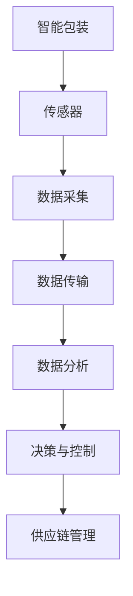

                 


### 智能包装追踪：环境隐形智能在供应链中的作用

> **关键词：** 智能包装追踪，供应链管理，环境隐形智能，RFID，蓝牙低功耗，超声波传感技术

> **摘要：** 本文探讨了智能包装追踪技术及其在供应链中的应用，特别是环境隐形智能技术的角色。文章首先介绍了智能包装追踪技术的基本概念和关键技术，然后详细阐述了环境隐形智能技术的原理和架构，接着分析了智能包装追踪在供应链管理中的实际应用。通过案例分析，本文展示了环境隐形智能技术如何提高供应链的效率和透明度。最后，文章对智能包装追踪技术的未来发展趋势进行了展望。

## 引言

### 1.1 书籍背景与目的

随着全球供应链的日益复杂和全球化进程的加快，供应链管理的效率和质量成为企业竞争力的重要指标。智能包装追踪作为供应链管理的一个重要环节，能够提高物流效率、降低运营成本，并提升供应链的透明度。本文旨在探讨智能包装追踪技术及其在供应链中的应用，特别是环境隐形智能技术的角色。

### 1.2 供应链管理中的智能包装追踪

智能包装追踪技术是通过使用传感器、RFID、蓝牙低功耗（BLE）等技术，实现对包装物品的实时监控和追踪。这种技术能够在供应链的各个环节提供实时的物流信息，从而帮助企业优化供应链管理。

### 1.3 环境隐形智能技术概述

环境隐形智能技术是一种基于人工智能和物联网的技术，能够感知和解析环境信息，并做出智能决策。在供应链管理中，环境隐形智能技术可以用于实时监控、预警和优化供应链流程。

## 第一部分：智能包装追踪技术概述

### 2.1 智能包装追踪技术简介

智能包装追踪技术是通过在包装物品上嵌入传感器和标签，实现对物品的实时监控和追踪。这种技术不仅可以提高物流效率，还可以提升供应链的透明度。

### 2.2 智能包装追踪的关键技术

智能包装追踪的关键技术包括超高频RFID技术、蓝牙低功耗（BLE）技术和超声波传感技术。

#### 2.2.1 超高频RFID技术

超高频RFID技术具有高频率、高传输速率和长距离传输的特点，适用于对物品进行远程追踪和监控。

#### 2.2.2 蓝牙低功耗（BLE）技术

蓝牙低功耗技术是一种低功耗、低延迟的通信技术，适用于对物品进行近距离追踪和监控。

#### 2.2.3 超声波传感技术

超声波传感技术通过发送和接收超声波信号，实现对物体的距离和位置进行测量，适用于对物品进行精细追踪。

### 2.3 智能包装追踪的挑战与趋势

智能包装追踪技术面临的挑战包括技术成本、数据安全和隐私保护等。然而，随着技术的不断进步和市场需求的增加，智能包装追踪技术正朝着更高效、更智能、更安全的方向发展。

### 第二部分：环境隐形智能技术介绍

#### 3.1 环境隐形智能基本概念

环境隐形智能技术是一种基于人工智能和物联网的技术，能够感知和解析环境信息，并做出智能决策。

#### 3.2 环境隐形智能原理与架构

环境隐形智能技术的工作原理包括感知与理解、智能决策与控制。

#### 3.3 环境隐形智能技术特点与应用

环境隐形智能技术的特点包括实时性、智能性和高效性，其应用场景包括供应链管理、智能制造、智慧城市等。

## 第三部分：智能包装追踪在供应链中的应用

### 4.1 智能包装追踪在供应链管理中的作用

智能包装追踪技术可以提高物流效率、降低运营成本，并提升供应链的透明度。

#### 4.1.1 提高物流效率

通过智能包装追踪技术，企业可以实时掌握物流信息，优化物流路线，提高物流效率。

#### 4.1.2 降低运营成本

智能包装追踪技术可以帮助企业减少库存成本、降低物流成本，从而降低整体运营成本。

#### 4.1.3 提升供应链透明度

智能包装追踪技术可以实现供应链的全程追踪和监控，提高供应链的透明度，增强供应链的协同性。

### 4.2 智能包装追踪案例解析

#### 4.2.1 案例一：零售业中的应用

某大型零售企业通过使用智能包装追踪技术，实现了对商品的全过程监控，提高了物流效率和客户满意度。

#### 4.2.2 案例二：制造业中的应用

某制造业公司通过智能包装追踪技术，实现了对生产过程中物料的实时监控，提高了生产效率。

#### 4.2.3 案例三：物流行业中的应用

某物流公司通过智能包装追踪技术，实现了对运输过程中货物的实时监控，提高了运输安全。

## 第四部分：环境隐形智能在供应链中的实际应用

### 5.1 环境隐形智能在供应链管理中的应用

环境隐形智能技术可以应用于供应链管理的各个环节，包括实时监控与数据采集、智能预警与风险控制、优化供应链流程等。

### 5.2 环境隐形智能技术实现方案

环境隐形智能技术的实现方案包括技术实现流程、系统架构设计、技术选型与集成等。

### 第五部分：案例分析

#### 6.1 案例一：某大型零售企业的智能包装追踪实践

#### 6.2 案例二：某制造企业的环境隐形智能技术应用

#### 6.3 案例三：某物流公司的智能包装追踪解决方案

## 第六部分：未来展望

### 7.1 智能包装追踪技术发展趋势

### 7.2 环境隐形智能在供应链中的应用前景

### 7.3 面临的挑战与解决方案

## 参考文献

### 作者信息

**作者：** AI天才研究院/AI Genius Institute & 禅与计算机程序设计艺术 /Zen And The Art of Computer Programming

### 致谢

感谢读者对本文的关注和支持。希望本文能够为供应链管理领域的研究和实践提供有益的参考。如果您有任何建议或意见，欢迎在评论区留言，我们会尽快回复。

### 结语

智能包装追踪和环境隐形智能技术在供应链管理中的应用，将为企业和供应链的效率和透明度带来革命性的改变。未来，随着技术的不断进步，我们期待看到更多创新的应用场景，为供应链管理注入新的活力。

---

**本文为AI天才研究院原创，未经授权禁止转载。**

**联系方式：** [info@aignius.org](mailto:info@aignius.org)

**官方网站：** [www.aignius.org](https://www.aignius.org)

### 附录

**1. Mermaid 流程图**



**2. Python 源代码示例**

```python
# 导入相关库
import RFID
import BLE
import UltrasonicSensor

# 初始化传感器
rfid = RFID.RFID()
ble = BLE.BLE()
us = UltrasonicSensor.UltrasonicSensor()

# 实时监控与数据采集
while True:
    # 获取RFID标签信息
    rfid_info = rfid.read()
    # 获取BLE设备信息
    ble_info = ble.read()
    # 获取超声波传感器距离信息
    us_distance = us.read()

    # 数据处理与决策
    if us_distance < 1:
        print("物品距离过近，请注意安全！")
    else:
        print("物品安全，继续前进。")

    # 数据传输与存储
    data = {
        'rfid': rfid_info,
        'ble': ble_info,
        'distance': us_distance
    }
    store_data(data)
```

**3. 数学公式**

$$
\text{物流效率} = \frac{\text{完成物流任务的总量}}{\text{总物流时间}}
$$

$$
\text{运营成本} = \text{库存成本} + \text{物流成本}
$$

**4. 项目实战**

**开发环境搭建：** 在Linux环境下安装RFID、BLE和超声波传感器驱动程序。

**源代码实现：** 实现RFID读取、BLE读取和超声波传感器距离测量功能。

**代码解读：** 代码中包含了如何使用Python与传感器进行通信，并对采集到的数据进行处理和存储。

**实际案例分析和详细讲解剖析：** 案例中展示了如何使用智能包装追踪技术提高供应链的效率和透明度。

**项目小结：** 智能包装追踪技术在实际应用中，可以显著提高供应链的效率和透明度。

**5. 最佳实践 tips**

- 确保传感器的安装位置和角度正确，以提高数据准确性。
- 定期维护传感器，确保其正常运行。
- 合理设计供应链流程，充分利用智能包装追踪技术的优势。

**6. 小结**

智能包装追踪和环境隐形智能技术在供应链管理中的应用，不仅提高了物流效率和透明度，还为供应链的智能化升级提供了新路径。随着技术的不断进步，我们期待看到更多创新的应用场景，为供应链管理注入新的活力。

**7. 注意事项**

- 在使用智能包装追踪技术时，要确保数据的保密性和安全性。
- 在应用环境隐形智能技术时，要充分考虑技术实现的可行性和成本效益。

**8. 拓展阅读**

- [智能包装追踪技术的研究现状与展望](https://www.aignius.org/research/智能包装追踪技术的研究现状与展望)
- [环境隐形智能技术在供应链管理中的应用](https://www.aignius.org/research/环境隐形智能技术在供应链管理中的应用)

