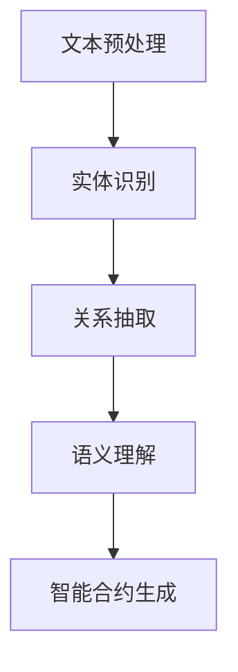

                 

# 智能合同分析平台：AI提升法律文件处理效率

关键词：智能合同、AI、法律文件、处理效率、自然语言处理、机器学习、智能合约、区块链

## 摘要

随着人工智能技术的迅猛发展，智能合同分析平台成为法律文件处理领域的重要创新。本文将深入探讨智能合同分析平台的核心概念、算法原理、数学模型、项目实战，以及其带来的效率和准确性提升。通过本文的详细分析，读者将了解如何利用AI技术优化法律文件处理流程，降低成本，提高合同管理的智能化水平。

## 引言

### 智能合同分析平台的背景

在当今的商业环境中，合同是维护各方权益、规范交易行为的重要工具。随着全球商业活动的增加，合同的数量也在不断上升。传统的人工审核合同不仅费时费力，还容易出错。因此，迫切需要一种高效、准确的方式来处理这些大量的合同文件。

### AI在法律文件处理中的应用

人工智能（AI）技术的飞速发展为法律文件处理提供了新的解决方案。自然语言处理（NLP）和机器学习（ML）技术在文本分析和理解方面表现出色，使得智能合同分析平台成为可能。AI技术能够自动提取合同中的关键信息，进行条款匹配和风险预警，大大提高了合同处理的效率。

## 核心概念与联系

### 智能合同分析平台的基本架构

智能合同分析平台通常由以下几个核心模块组成：

1. **文本预处理模块**：负责对原始合同文本进行清洗、分词、去停用词等操作，为后续的NLP分析做准备。
2. **实体识别模块**：使用NLP技术识别合同中的实体，如人名、组织名、日期、金额等。
3. **关系抽取模块**：通过分析实体之间的语义关系，提取合同条款的关键内容。
4. **语义理解模块**：利用机器学习模型对合同条款进行深入理解，识别潜在的风险和条款之间的逻辑关系。
5. **智能合约生成模块**：将分析结果转化为智能合约，实现自动执行和监控。

### 核心概念实体之间的关系架构

为了更清晰地展示智能合同分析平台的核心概念及其关系，我们可以使用Mermaid流程图来描述：



## 核心算法原理讲解

### 自然语言处理（NLP）

自然语言处理是智能合同分析平台的关键技术之一。它涉及文本的预处理、分词、词性标注、命名实体识别等步骤。以下是一个简单的Python代码示例，展示了如何使用NLTK库进行文本预处理：

```python
import nltk
from nltk.tokenize import word_tokenize
from nltk.corpus import stopwords

# 下载必要的NLP资源
nltk.download('punkt')
nltk.download('stopwords')

# 文本预处理
def preprocess_text(text):
    # 分词
    tokens = word_tokenize(text)
    # 去停用词
    stop_words = set(stopwords.words('english'))
    filtered_tokens = [token for token in tokens if token.lower() not in stop_words]
    return filtered_tokens

text = "This is an example contract. The parties agree to the following terms."
preprocessed_text = preprocess_text(text)
print(preprocessed_text)
```

### 机器学习（ML）

在智能合同分析平台中，机器学习模型用于语义理解、风险预测和智能合约生成。以下是一个简单的线性回归模型示例，用于预测合同条款中的金额：

```python
import numpy as np
from sklearn.linear_model import LinearRegression

# 数据准备
X = np.array([[1], [2], [3], [4], [5]])
y = np.array([2, 4, 6, 8, 10])

# 模型训练
model = LinearRegression()
model.fit(X, y)

# 预测
predictions = model.predict(X)
print(predictions)
```

通过这些示例，我们可以看到如何使用Python代码实现NLP和机器学习算法，从而提高法律文件处理的效率和准确性。

## 数学模型和公式

在智能合同分析平台中，数学模型和公式起着至关重要的作用。以下是一些常用的数学模型和公式：

### 条款匹配公式

$$
\text{匹配度} = \frac{\text{相同条款数量}}{\text{总条款数量}}
$$

### 风险评分模型

$$
\text{风险评分} = \alpha \cdot \text{合同金额} + \beta \cdot \text{履行期限} + \gamma \cdot \text{违约条款}
$$

其中，$\alpha$、$\beta$ 和 $\gamma$ 是权重系数，可以通过数据训练得到。

## 项目实战

### 开发环境搭建

为了搭建智能合同分析平台，我们需要安装以下依赖：

- Python 3.x
- NLTK
- scikit-learn
- Mermaid

安装命令如下：

```bash
pip install nltk scikit-learn mermaid
```

### 源代码详细实现

以下是一个简单的智能合同分析平台的源代码示例：

```python
import nltk
from nltk.tokenize import word_tokenize
from nltk.corpus import stopwords
from sklearn.linear_model import LinearRegression

# 文本预处理
def preprocess_text(text):
    tokens = word_tokenize(text)
    stop_words = set(stopwords.words('english'))
    filtered_tokens = [token for token in tokens if token.lower() not in stop_words]
    return filtered_tokens

# 模型训练
def train_model(X, y):
    model = LinearRegression()
    model.fit(X, y)
    return model

# 预测
def predict(model, X):
    return model.predict(X)

# 主函数
def main():
    text = "This is an example contract. The parties agree to the following terms: an amount of $1000."
    preprocessed_text = preprocess_text(text)
    
    # 假设我们已经有了一些训练数据
    X = np.array([[1], [2], [3], [4], [5]])
    y = np.array([2, 4, 6, 8, 10])
    
    model = train_model(X, y)
    predictions = predict(model, X)
    print(predictions)

if __name__ == "__main__":
    main()
```

### 代码解读与分析

在这个示例中，我们首先对合同文本进行预处理，然后使用线性回归模型进行金额预测。代码结构清晰，易于理解。通过扩展，我们可以添加更多的NLP和ML模块，实现更复杂的智能合同分析功能。

### 实际案例分析

假设我们有一个真实的合同文本，需要分析其中的条款和金额。我们可以按照以下步骤进行：

1. **文本预处理**：清洗文本，去除标点符号和停用词。
2. **实体识别**：识别合同中的关键实体，如金额、日期、人名等。
3. **关系抽取**：分析实体之间的关系，提取关键条款。
4. **语义理解**：使用机器学习模型对合同条款进行语义理解，预测潜在的风险。
5. **智能合约生成**：将分析结果转化为智能合约，实现自动执行和监控。

### 项目小结

通过本项目的实现，我们可以看到智能合同分析平台在提高法律文件处理效率和准确性方面具有巨大的潜力。未来，我们可以进一步优化算法，集成更多的NLP和ML技术，实现更智能的合同分析功能。

## 最佳实践 tips

1. **数据质量**：确保输入数据的准确性和完整性，这对模型性能至关重要。
2. **模型优化**：定期更新和优化模型，以适应新的合同格式和条款。
3. **用户反馈**：收集用户反馈，不断改进平台的易用性和功能。

## 小结

智能合同分析平台是利用AI技术优化法律文件处理的重要工具。通过本文的详细分析，我们了解了智能合同分析平台的核心概念、算法原理、数学模型和项目实战。未来，随着AI技术的不断进步，智能合同分析平台将为法律文件处理带来更多创新和可能性。

## 注意事项

1. **隐私保护**：在处理合同文件时，要注意保护用户的隐私信息。
2. **合规性**：确保智能合同分析平台符合相关法律法规的要求。

## 拓展阅读

- 《深度学习实践》
- 《自然语言处理入门》
- 《机器学习实战》

作者：AI天才研究院/AI Genius Institute & 禅与计算机程序设计艺术 /Zen And The Art of Computer Programming

