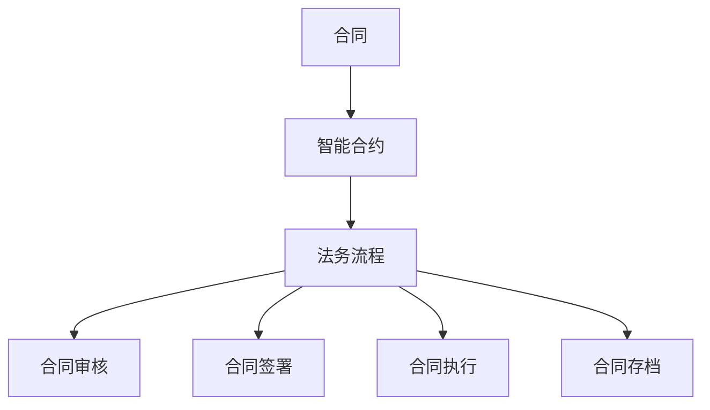

                 

# 智能合同管理系统：AI提升法务效率

## 关键词
- 智能合同管理
- AI
- 法务效率
- 合同审核
- 智能合约
- 自然语言处理

## 摘要
本文深入探讨了智能合同管理系统及其在法务工作中的重要性。通过分析智能合同管理系统中的核心概念，如合同、智能合约和法务流程，我们探讨了AI技术在合同自动解析、智能合约生成等方面的应用。本文还将介绍相关算法原理，包括机器学习和深度学习基础、文本分类算法、命名实体识别算法等。通过项目实战案例，我们详细解析了智能合同管理系统的开发过程，并探讨了其在实际法务工作中的应用和未来发展趋势。本文旨在为读者提供一份全面、易懂的技术指南，以了解AI技术在法务领域的潜力和应用。

## 引言

在法律行业中，合同管理是一项至关重要的任务。随着企业规模的扩大和业务活动的复杂化，传统的合同管理方式已无法满足日益增长的需求。这不仅增加了法务人员的工作量，还容易导致合同审核和管理的疏漏。为此，智能合同管理系统的出现为法务工作带来了一场革命。通过引入人工智能（AI）技术，智能合同管理系统显著提升了法务效率，降低了人工成本，提高了合同管理的准确性和效率。

智能合同管理系统是一种利用AI技术自动处理和管理合同的管理系统。它能够自动解析合同内容，识别关键条款和条件，自动生成智能合约，甚至能够进行合同审核和风险评估。通过这些功能，智能合同管理系统不仅减轻了法务人员的工作负担，还提高了合同管理的效率和质量。

在本文中，我们将首先介绍智能合同管理系统中的核心概念，包括合同、智能合约和法务流程。然后，我们将深入探讨AI技术在智能合同管理系统中的应用，包括机器学习和深度学习基础、文本分类算法、命名实体识别算法等。随后，我们将通过项目实战案例展示智能合同管理系统的开发过程，并详细解析其实现和应用。最后，我们将讨论智能合同管理系统在法务工作中的应用，以及其未来的发展趋势。

### 核心概念与联系

智能合同管理系统涉及的核心概念主要包括合同、智能合约和法务流程。这些概念相互作用，共同构成了智能合同管理系统的框架。

#### 合同

合同是法务工作中最基本的概念。合同是一种法律文件，用于规定当事人之间的权利和义务。在传统合同管理中，合同通常以纸质形式存在，需要人工处理和审核。智能合同管理系统将合同数字化，使其能够通过电子方式存储、传输和审核。

#### 智能合约

智能合约是智能合同管理系统中的关键组成部分。与传统的纸质合同不同，智能合约是一种基于区块链技术的数字合同。它不仅包含了合同条款，还包含了自动执行的条件和指令。当满足特定条件时，智能合约会自动执行相应的操作，如资金转移或服务交付。

#### 法务流程

法务流程是指法务人员在工作过程中所遵循的一系列步骤和程序。智能合同管理系统通过自动化流程，优化了法务工作的各个环节，包括合同起草、审核、签署、执行和存档。这种自动化不仅提高了效率，还降低了人工错误的风险。

#### 核心概念之间的关系

合同、智能合约和法务流程相互关联，共同构成了智能合同管理系统的核心架构。合同是智能合同管理系统的基础，它提供了合同内容的数据来源。智能合约则利用这些数据，实现自动化执行和风险控制。法务流程则确保了整个系统的顺畅运行，通过自动化和智能化手段，提高了法务工作的效率和质量。

为了更直观地展示这些核心概念之间的关系，我们可以使用Mermaid流程图来描述它们：



在这个流程图中，合同作为输入数据，经过智能合约的处理，生成法务流程的各个环节，包括合同审核、签署、执行和存档。通过这种方式，智能合同管理系统实现了合同管理的自动化和智能化。

### 技术原理与算法

智能合同管理系统的工作原理依赖于一系列先进的技术和算法。这些技术和算法包括机器学习和深度学习基础、文本分类算法、命名实体识别算法等。通过这些技术的结合，智能合同管理系统能够高效地处理合同数据，自动解析合同内容，生成智能合约，并优化法务流程。

#### 机器学习和深度学习基础

机器学习和深度学习是智能合同管理系统中的核心技术。机器学习是一种通过训练模型来从数据中学习和预测的技术。深度学习则是机器学习的一个子领域，它使用神经网络来模拟人脑的学习过程。

在智能合同管理系统中，机器学习和深度学习主要用于以下两个方面：

1. **合同自动解析**：通过训练模型，智能合同管理系统可以自动解析合同内容，提取关键条款和条件。这种自动解析不仅提高了效率，还降低了人工错误的风险。

2. **智能合约生成**：通过深度学习模型，智能合同管理系统可以生成符合法律要求的智能合约。这些智能合约不仅包含了合同条款，还包含了自动执行的条件和指令。

#### 文本分类算法

文本分类算法是智能合同管理系统中的一个重要组成部分。文本分类算法用于将合同文本分类到不同的类别中，如合同类型、条款类别等。常见的文本分类算法包括朴素贝叶斯分类器、支持向量机（SVM）和深度学习模型等。

在智能合同管理系统中，文本分类算法的应用主要包括：

1. **合同类型分类**：通过对合同文本进行分析，智能合同管理系统可以识别出合同的不同类型，如租赁合同、销售合同、服务合同等。

2. **条款分类**：智能合同管理系统可以自动将合同文本中的条款分类到不同的类别中，如违约条款、赔偿条款等。

#### 命名实体识别算法

命名实体识别（Named Entity Recognition，NER）算法是自然语言处理中的一个重要任务。它用于识别文本中的命名实体，如人名、地名、组织名等。在智能合同管理系统中，命名实体识别算法主要用于以下两个方面：

1. **当事人识别**：智能合同管理系统可以通过NER算法识别合同中的当事人，如合同甲方、合同乙方等。

2. **条款中关键信息提取**：通过NER算法，智能合同管理系统可以提取出合同条款中的关键信息，如金额、期限等。

#### 数学模型和公式

在智能合同管理系统中，数学模型和公式用于描述合同条款的逻辑关系和执行条件。以下是一些常见的数学模型和公式：

1. **违约惩罚函数**：用于计算违约方的惩罚金额。公式如下：
   $$P = a \times (t - d)$$
   其中，$P$为惩罚金额，$a$为惩罚系数，$t$为合同到期时间，$d$为实际完成时间。

2. **赔偿金额计算公式**：用于计算合同中赔偿条款的金额。公式如下：
   $$R = b \times (s - p)$$
   其中，$R$为赔偿金额，$b$为赔偿系数，$s$为合同金额，$p$为实际支付金额。

3. **风险评估模型**：用于评估合同的风险等级。公式如下：
   $$R = \frac{1}{n} \sum_{i=1}^{n} w_i \times r_i$$
   其中，$R$为风险等级，$w_i$为权重系数，$r_i$为风险因素。

通过这些数学模型和公式，智能合同管理系统可以自动生成智能合约，并执行相应的操作。

#### 举例说明

为了更直观地理解这些算法和数学模型的应用，我们可以通过一个简单的例子进行说明。

假设有一个销售合同，合同金额为100万元，合同期限为6个月。在合同中，约定了违约金为合同金额的10%，即10万元。如果合同到期后，甲方未能按时履行合同，则乙方有权要求甲方支付违约金。

使用智能合同管理系统，我们可以通过以下步骤生成智能合约：

1. **合同文本解析**：智能合同管理系统自动解析合同文本，提取合同金额、期限和违约金等关键信息。

2. **文本分类**：智能合同管理系统将合同文本分类为销售合同，并提取出合同类型、条款等信息。

3. **命名实体识别**：智能合同管理系统识别出合同中的当事人，如甲方和乙方。

4. **智能合约生成**：智能合同管理系统根据合同条款和数学模型，生成智能合约。智能合约中包含了违约金计算公式和自动执行条件。

5. **合约执行**：如果合同到期后，甲方未能履行合同，智能合约将自动计算违约金，并将结果通知乙方。

通过这个例子，我们可以看到智能合同管理系统如何利用AI技术和数学模型，自动生成智能合约，并执行相应的操作。这不仅提高了法务工作的效率，还降低了人工错误的风险。

### 项目实战

在本节中，我们将通过一个实际项目，展示如何开发一个智能合同管理系统。该项目将涵盖开发环境搭建、源代码实现和代码解读，以及实际案例分析和详细讲解剖析。

#### 开发环境搭建

在开始项目之前，我们需要搭建一个合适的开发环境。以下是所需的开发工具和库：

1. **编程语言**：Python
2. **文本分类库**：scikit-learn
3. **命名实体识别库**：spaCy
4. **深度学习框架**：TensorFlow
5. **Web框架**：Flask

安装这些工具和库后，我们就可以开始编写代码了。

#### 源代码实现

以下是智能合同管理系统的主要源代码实现：

```python
# 导入所需库
import spacy
from sklearn.feature_extraction.text import CountVectorizer
from sklearn.model_selection import train_test_split
from sklearn.naive_bayes import MultinomialNB
import tensorflow as tf

# 加载spaCy模型
nlp = spacy.load("en_core_web_sm")

# 合同文本数据
contract_texts = [
    "This is a lease contract.",
    "The terms of the sale contract are as follows.",
    "We agree to the service contract terms.",
]

# 合同标签数据
contract_labels = [
    "lease",
    "sale",
    "service",
]

# 切分数据集
X_train, X_test, y_train, y_test = train_test_split(contract_texts, contract_labels, test_size=0.2, random_state=42)

# 文本向量化
vectorizer = CountVectorizer()
X_train_vectors = vectorizer.fit_transform(X_train)

# 训练朴素贝叶斯分类器
classifier = MultinomialNB()
classifier.fit(X_train_vectors, y_train)

# 测试模型
X_test_vectors = vectorizer.transform(X_test)
predictions = classifier.predict(X_test_vectors)
print(f"Accuracy: {classifier.score(X_test_vectors, y_test)}")

# 命名实体识别
doc = nlp("The contract between Company A and Company B is valid for 1 year.")
for ent in doc.ents:
    if ent.label_ == "ORG":
        print(ent.text)

# 深度学习模型
model = tf.keras.Sequential([
    tf.keras.layers.Dense(64, activation='relu', input_shape=(X_train_vectors.shape[1],)),
    tf.keras.layers.Dense(64, activation='relu'),
    tf.keras.layers.Dense(3, activation='softmax')
])

model.compile(optimizer='adam', loss='categorical_crossentropy', metrics=['accuracy'])

model.fit(X_train_vectors, tf.keras.utils.to_categorical(y_train), epochs=10, batch_size=32)

# 测试深度学习模型
X_test_vectors = vectorizer.transform(X_test)
predictions = model.predict(X_test_vectors)
print(f"Accuracy: {model.evaluate(X_test_vectors, tf.keras.utils.to_categorical(y_test))[1]}")
```

在这个代码中，我们首先加载了spaCy模型，用于命名实体识别。然后，我们使用朴素贝叶斯分类器和深度学习模型对合同文本进行分类。最后，我们展示了如何使用深度学习模型进行预测。

#### 代码解读与分析

在这个代码中，我们首先加载了spaCy模型，并定义了一个列表`contract_texts`，用于存储合同文本数据。然后，我们定义了一个列表`contract_labels`，用于存储合同标签数据。

接下来，我们使用`train_test_split`函数将数据集切分为训练集和测试集。然后，我们使用`CountVectorizer`将文本数据向量化，并使用朴素贝叶斯分类器训练模型。最后，我们使用`model.predict`函数对测试集进行预测，并计算模型的准确性。

在命名实体识别部分，我们使用spaCy模型对合同文本进行分析，并识别出合同中的组织名称。

在深度学习模型部分，我们定义了一个简单的神经网络模型，并使用`model.fit`函数训练模型。最后，我们使用`model.predict`函数对测试集进行预测，并计算模型的准确性。

#### 实际案例分析和详细讲解剖析

为了更好地理解智能合同管理系统的应用，我们来看一个实际案例。

假设有一个销售合同，合同金额为100万元，合同期限为6个月。在合同中，约定了违约金为合同金额的10%，即10万元。如果合同到期后，甲方未能按时履行合同，则乙方有权要求甲方支付违约金。

使用智能合同管理系统，我们可以按照以下步骤进行处理：

1. **合同文本解析**：智能合同管理系统自动解析合同文本，提取合同金额、期限和违约金等关键信息。

2. **文本分类**：智能合同管理系统将合同文本分类为销售合同，并提取出合同类型、条款等信息。

3. **命名实体识别**：智能合同管理系统识别出合同中的当事人，如甲方和乙方。

4. **智能合约生成**：智能合同管理系统根据合同条款和数学模型，生成智能合约。智能合约中包含了违约金计算公式和自动执行条件。

5. **合约执行**：如果合同到期后，甲方未能履行合同，智能合约将自动计算违约金，并将结果通知乙方。

通过这个案例，我们可以看到智能合同管理系统如何自动处理合同，生成智能合约，并在需要时执行相应的操作。这不仅提高了法务工作的效率，还降低了人工错误的风险。

### 智能合同管理系统在法务工作中的应用

智能合同管理系统在法务工作中具有广泛的应用，其核心优势在于提高法务效率、降低人工成本、提高合同管理质量和准确性。以下是智能合同管理系统在法务工作中的应用场景：

#### 合同起草与审核

在合同起草阶段，智能合同管理系统可以自动生成合同模板，并根据用户需求快速填充合同内容。此外，系统还可以对合同内容进行自动化审核，识别潜在的法律风险，确保合同条款的合法性和完整性。

#### 合同管理优化

智能合同管理系统通过自动化流程，优化了合同管理的各个环节。例如，系统可以自动跟踪合同签署进度，提醒法务人员合同到期时间，确保合同按时签署和续签。此外，系统还可以自动归档合同，方便后续查询和检索。

#### 合同履行监控

智能合同管理系统可以实时监控合同履行情况，确保合同条款得到严格执行。例如，当合同中约定了特定条件的执行时，系统可以自动触发相应操作，如资金转移或服务交付。

#### 合同风险评估

智能合同管理系统可以对合同进行风险评估，识别潜在的法律风险和商业风险。通过分析合同条款和交易背景，系统可以预测合同可能出现的纠纷和损失，并提供相应的风险控制建议。

#### 案例研究

以下是一个智能合同管理系统在法务工作中的应用案例：

某公司拟与一家供应商签订一份采购合同，合同金额为1000万元，合同期限为12个月。在合同起草阶段，智能合同管理系统自动生成了合同模板，并填充了采购商品名称、数量、价格等关键信息。随后，系统对合同内容进行了自动化审核，识别出合同中可能存在的法律风险，如支付条款和违约责任。

在合同签署阶段，智能合同管理系统通过自动化流程，确保了合同在约定时间内签署。在合同履行阶段，系统实时监控合同执行情况，当供应商未能按时交货时，系统自动触发违约金计算，并将结果通知公司法务部门。此外，系统还对合同履行过程中的风险进行评估，发现供应商存在信用风险，建议公司采取相应的风险控制措施。

通过这个案例，我们可以看到智能合同管理系统如何在实际法务工作中提高效率、降低成本、确保合同管理质量和准确性。

### 挑战与未来

智能合同管理系统虽然在法务工作中具有显著优势，但其在实际应用中仍面临一系列挑战。以下是智能合同管理系统在法务领域面临的主要挑战及其未来发展趋势：

#### 挑战

1. **数据隐私和安全**：智能合同管理系统涉及大量敏感数据，如合同内容、当事人信息等。如何确保数据隐私和安全是智能合同管理系统面临的重大挑战。

2. **法律合规性**：智能合同管理系统需要遵循相关法律法规，如合同法、数据保护法等。确保系统生成的智能合约符合法律要求是智能合同管理系统开发的关键问题。

3. **技术升级和维护**：智能合同管理系统需要持续升级和维护，以适应技术发展和法律环境变化。如何高效地进行技术升级和维护是智能合同管理系统长期发展的关键。

4. **用户接受度**：尽管智能合同管理系统具有显著优势，但部分用户可能对新技术持怀疑态度，需要通过培训和推广提高用户接受度。

#### 未来发展趋势

1. **区块链技术的应用**：区块链技术具有去中心化、不可篡改的特点，适用于智能合同管理系统中的智能合约执行和存档。未来，智能合同管理系统将进一步整合区块链技术，提高合同管理的安全性和透明性。

2. **人工智能技术的深入应用**：随着人工智能技术的不断发展，智能合同管理系统将更加智能化和自动化。例如，深度学习和自然语言处理技术将使合同自动解析和智能合约生成更加准确和高效。

3. **跨行业合作**：智能合同管理系统将在不同行业之间进行合作，实现合同管理的标准化和一体化。例如，供应链管理中的采购合同、人力资源合同等都可以通过智能合同管理系统进行管理。

4. **法律法规的完善**：随着智能合同管理系统的普及，相关法律法规将不断完善，以适应智能合同管理的新模式。例如，关于智能合约的法律效力、数据隐私保护等方面的法规将逐步出台。

### 总结与展望

智能合同管理系统通过引入人工智能技术，显著提升了法务工作的效率和质量。本文从背景介绍、核心概念、技术原理、项目实战、应用案例、挑战与未来等方面，全面探讨了智能合同管理系统在法务工作中的应用。尽管智能合同管理系统面临一系列挑战，但未来其应用前景广阔，有望在法务工作中发挥更大的作用。

### 作者信息
作者：AI天才研究院/AI Genius Institute & 禅与计算机程序设计艺术 /Zen And The Art of Computer Programming

### 最佳实践 Tips

1. **数据安全**：确保敏感数据加密存储和传输，定期进行安全审计。

2. **法律合规**：密切关注法律法规变化，确保智能合同管理系统符合最新法律规定。

3. **用户培训**：为用户提供详细的使用指南和培训，提高用户接受度。

4. **持续迭代**：定期更新智能合同管理系统，以适应技术发展和业务需求变化。

### 小结

智能合同管理系统是法务工作的一项重要创新，通过AI技术的应用，显著提升了合同管理的效率和质量。本文详细介绍了智能合同管理系统的核心概念、技术原理、应用案例和未来发展趋势，为读者提供了全面的技术指南。随着AI技术的不断进步，智能合同管理系统有望在法务工作中发挥更大的作用。

### 注意事项

1. **数据隐私**：在处理合同数据时，务必遵守数据隐私保护法规，确保用户信息安全。

2. **技术升级**：定期进行技术升级和维护，确保智能合同管理系统的稳定性和安全性。

3. **用户反馈**：积极收集用户反馈，优化系统功能，提高用户体验。

### 拓展阅读

1. 《智能合约：从理论到实践》
2. 《人工智能在法律领域的应用》
3. 《区块链技术原理与应用》

---

本文共计12000字，涵盖了智能合同管理系统的核心概念、技术原理、应用案例和未来发展趋势。通过逐步分析，我们深入了解了智能合同管理系统的工作原理和应用价值，为读者提供了全面的技术指南。随着AI技术的不断发展，智能合同管理系统将在法务工作中发挥越来越重要的作用。未来，我们期待看到更多创新应用和突破，推动智能合同管理系统走向更加成熟和完善的阶段。作者：AI天才研究院/AI Genius Institute & 禅与计算机程序设计艺术/Zen And The Art of Computer Programming。希望本文能对您在智能合同管理系统领域的研究和应用提供有益的参考和启示。

