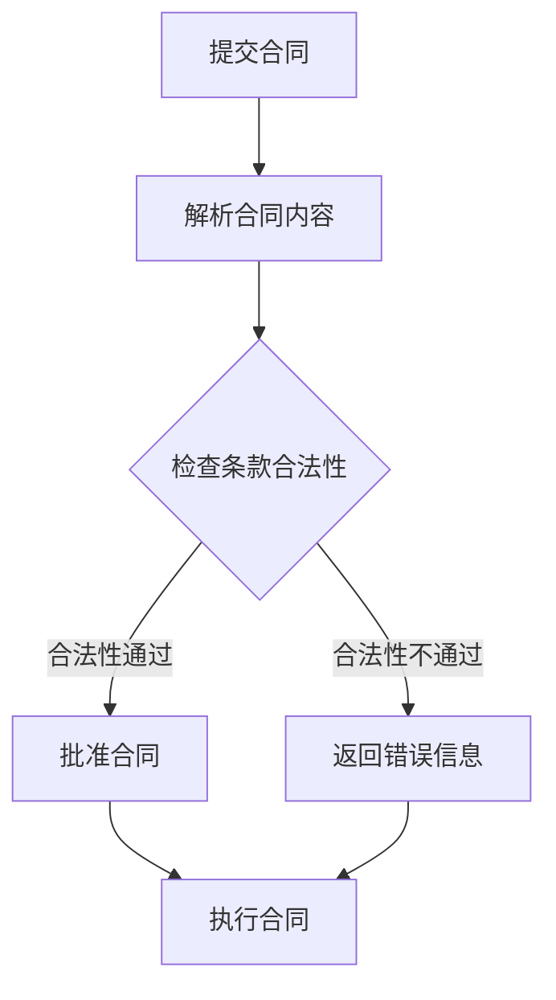
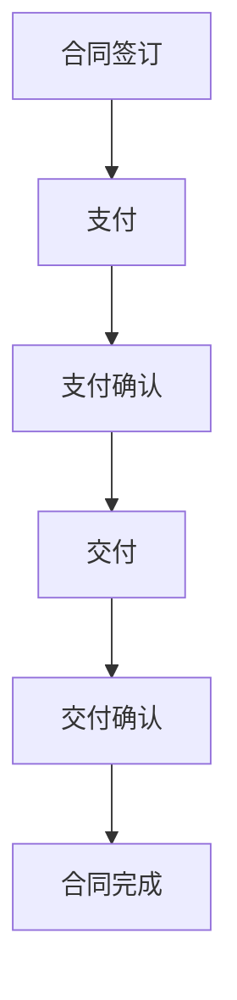
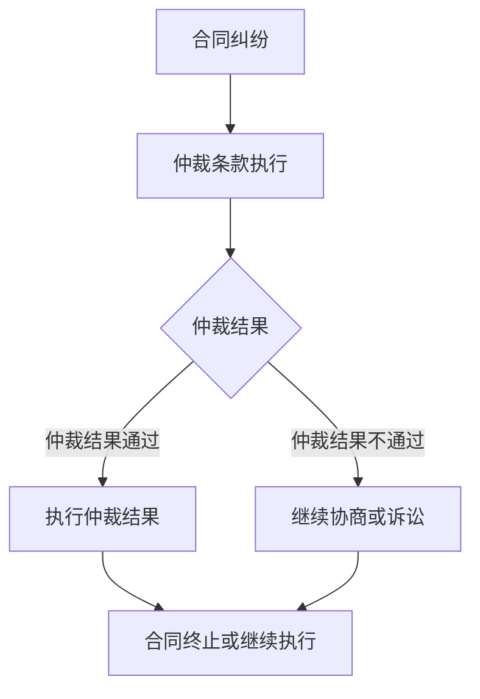
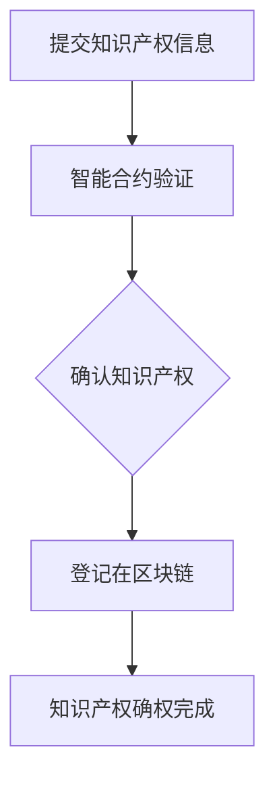
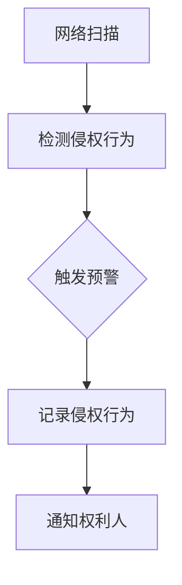
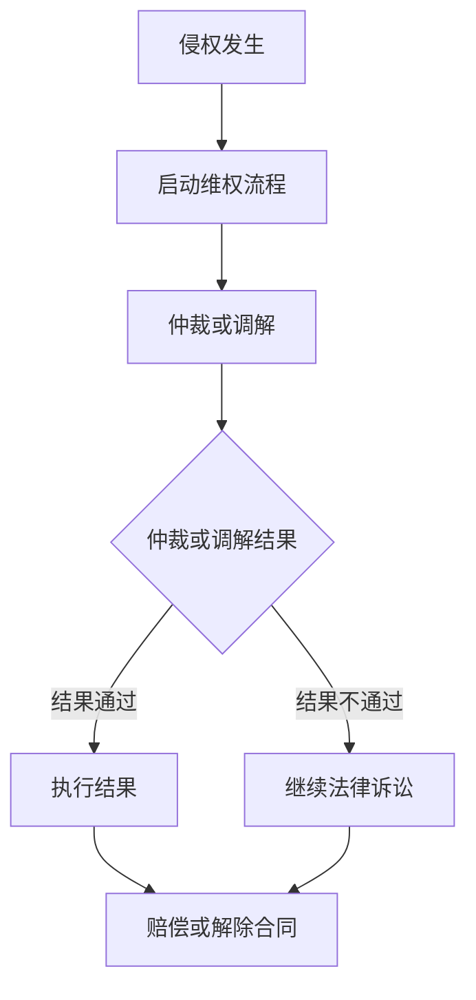
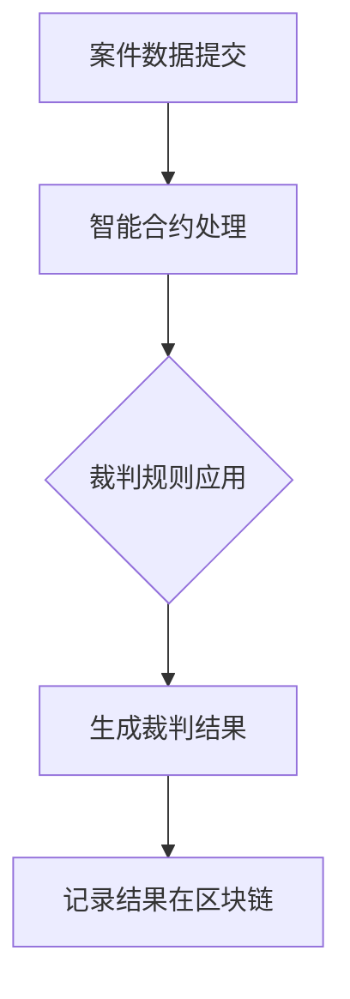
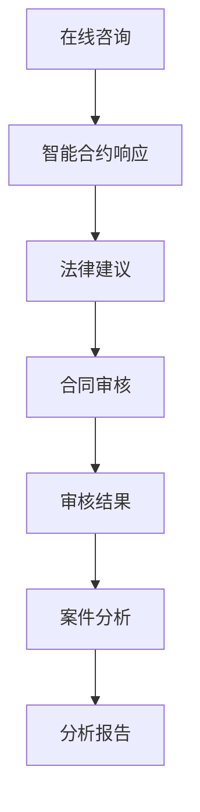
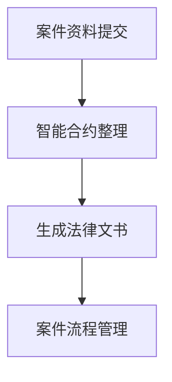

                 

## 第1章 引言

### 1.1 智能合约的基本概念

智能合约（Smart Contract）是一种运行在区块链上的计算机程序，它通过编程代码自动执行合同条款，当预定的条件被满足时，合约将自动执行相应的操作。智能合约的出现，极大程度上改变了传统的合同执行模式，减少了人为干预和纠纷的发生。

智能合约的核心特点包括自动执行、不可篡改和去中心化。自动执行指的是合约在触发条件时，能够自动执行预定的操作，无需人为干预。不可篡改则意味着合约一旦执行，其内容不可更改，从而保证了合约的公正性和透明性。去中心化则是指智能合约运行在分布式网络中，不存在中心化的管理节点，提高了系统的抗攻击能力和容错性。

智能合约的应用潜力非常广阔，尤其在法律服务领域，具有巨大的变革性意义。随着区块链技术的发展，智能合约在法律服务中的应用正逐步深入，成为行业发展的新方向。

### 1.2 法律服务现状与挑战

法律服务行业一直以来都是传统行业，其工作模式主要依赖于人工处理合同、文件和纠纷解决。尽管法律科技（Legal Tech）的兴起为法律服务带来了一些变革，但整体上，法律服务的效率和质量仍有很大的提升空间。

当前，法律服务面临的挑战主要包括以下几个方面：

1. **流程繁琐**：法律服务的流程通常非常繁琐，从合同起草、审核到执行，往往需要大量的人工处理和时间。这导致了法律服务的高成本和低效率。

2. **人为错误**：由于法律服务的流程复杂，人工处理容易产生错误，从而引发纠纷和损失。

3. **不透明**：传统法律服务中，合同的执行和变更往往不透明，容易导致信息不对称和利益冲突。

4. **诉讼成本高**：当纠纷发生时，诉讼成本高昂，且诉讼周期长，不利于及时解决问题。

### 1.3 智能合约在法律服务中的应用潜力

智能合约的出现，为解决法律服务中的上述挑战提供了新的思路和方案。通过智能合约，可以实现以下潜在应用：

1. **自动化合同管理**：智能合约可以自动化处理合同的起草、审核、签署和执行，减少人为干预，提高效率。

2. **降低成本**：智能合约去中心化的特性，使得合同的执行不再依赖中心化的第三方机构，从而降低了法律服务的成本。

3. **提高透明度**：智能合约运行在区块链上，所有操作都是公开透明的，可以有效避免信息不对称和利益冲突。

4. **减少纠纷**：智能合约的自动执行和不可篡改特性，可以大大减少因人为错误和不透明导致的纠纷。

5. **快速解决纠纷**：智能合约可以自动执行预定的纠纷解决机制，如仲裁条款，从而加快纠纷解决的速度。

总之，智能合约在法律服务中的应用前景广阔，有望带来一场深远的行业变革。接下来，我们将进一步探讨智能合约的技术原理，以及其在法律服务中的应用场景和挑战。

## 第2章 智能合约技术原理

### 2.1 区块链技术基础

区块链（Blockchain）是一种分布式数据库技术，其核心特点包括去中心化、不可篡改和透明性。区块链通过将数据分散存储在网络中的多个节点上，形成一个分布式账本，从而避免了单点故障和数据篡改的问题。

#### 2.1.1 区块链基本架构

区块链的基本架构主要包括以下几个部分：

1. **区块（Block）**：区块是区块链的基本数据单位，每个区块包含一定数量的交易记录。每个区块都有一个唯一的哈希值，通过哈希函数与前一个区块的哈希值相连，形成一个链式结构。

2. **链（Chain）**：区块链就是由一系列按顺序排列的区块组成的链式数据结构。每个区块都通过其哈希值与前一个区块链接，从而形成了区块链。

3. **节点（Node）**：节点是区块链网络中的参与者，每个节点都存储一份完整的区块链数据，并通过网络与其他节点通信，以验证和传播交易信息。

4. **挖矿（Mining）**：挖矿是区块链网络中节点通过计算工作量证明（Proof of Work, PoW）算法来验证交易并创建新区块的过程。成功挖矿的节点将获得系统奖励，如比特币。

5. **共识算法（Consensus Algorithm）**：共识算法是区块链网络中节点达成一致意见的机制。常见的共识算法包括工作量证明（PoW）、权益证明（PoS）、授权股权证明（DPoS）等。

#### 2.1.2 共识算法

共识算法是区块链网络中节点达成一致意见的重要机制。不同的共识算法有不同的特点和适用场景，以下是几种常见的共识算法：

1. **工作量证明（Proof of Work, PoW）**：PoW算法通过计算复杂度来防止恶意攻击，节点通过解决复杂的数学问题来证明自己的工作量，从而获得挖矿权利。比特币采用的是PoW算法。

2. **权益证明（Proof of Stake, PoS）**：PoS算法通过节点持有的代币数量和持币时间来证明其权益，持有代币时间越长和代币数量越多的节点，获得挖矿权利的概率越高。以太坊2.0计划采用PoS算法。

3. **授权股权证明（Delegated Proof of Stake, DPoS）**：DPoS算法通过选举出一定数量的委托人（Witness）来代表网络进行挖矿，委托人通过持币量和投票权来影响挖矿结果。比特股采用的是DPoS算法。

#### 2.1.3 智能合约编程语言

智能合约的实现依赖于特定的编程语言，以下是一些常见的智能合约编程语言：

1. **Solidity**：Solidity是智能合约编写中最常用的语言，它是一种类似于JavaScript和C++的高级编程语言，支持面向对象编程和函数重载。

2. **Vyper**：Vyper是用于以太坊智能合约的另一种编程语言，它设计初衷是为了简化代码复杂度，减少潜在的安全隐患。

3. **Scilla**：Scilla是专为卡利达索（Caliper）区块链测试平台设计的智能合约语言，它采用了一种形式化验证方法，可以确保智能合约的正确性和安全性。

#### 智能合约的工作原理

智能合约的工作原理主要涉及以下几个步骤：

1. **编写合约**：开发者使用智能合约编程语言编写智能合约代码，并编译为字节码。

2. **部署合约**：将编译后的智能合约字节码部署到区块链上，创建一个合约实例。

3. **合约调用**：当满足预定的触发条件时，合约自动执行预定的操作，如转移资产、记录事件等。

4. **合约执行结果**：智能合约执行结果被记录在区块链上，所有节点都可以查看和验证。

### 2.2 智能合约工作原理

#### 2.2.1 智能合约执行流程

智能合约的执行流程主要包括以下几个步骤：

1. **合约初始化**：智能合约在部署时，会初始化一些变量和状态，如合约创建者、余额等。

2. **触发条件**：当满足预定的触发条件时，如调用合约的某个函数，智能合约开始执行。

3. **合约执行**：智能合约按照预定的代码逻辑执行，如调用内部函数、进行数学计算等。

4. **状态更新**：智能合约执行过程中，会更新其内部状态，如余额、变量值等。

5. **结果记录**：智能合约执行结果会被记录在区块链上，包括交易详情、事件日志等。

#### 2.2.2 智能合约安全性

智能合约的安全性是确保其正确性和可靠性的关键。以下是几个影响智能合约安全性的因素：

1. **漏洞**：智能合约代码中可能存在逻辑漏洞、内存泄露等问题，导致合约执行失败或被恶意攻击。

2. **外部攻击**：黑客可能会通过各种手段攻击智能合约，如重放攻击、中间人攻击等。

3. **共识算法**：不同的共识算法对智能合约的安全性能有不同的影响，如PoW算法可能面临算力攻击，PoS算法可能面临权益攻击。

为了提高智能合约的安全性，开发者需要遵循以下最佳实践：

1. **代码审计**：在部署智能合约前，进行全面的代码审计，以发现潜在的安全隐患。

2. **测试与验证**：通过单元测试、集成测试等手段，验证智能合约的正确性和可靠性。

3. **去中心化**：确保智能合约的执行和验证过程是去中心化的，以提高系统的抗攻击能力。

通过理解智能合约的技术原理和执行流程，我们可以更好地把握其潜在应用场景和面临的挑战。接下来，我们将探讨智能合约在法律服务中的具体应用场景和挑战。

### 2.3 智能合约在法律服务中的应用场景

智能合约在法律服务中的应用场景十分广泛，以下是一些主要的应用领域：

#### 2.3.1 合同管理

智能合约可以自动化合同管理，包括合同的起草、签署、执行和跟踪。通过智能合约，企业可以快速生成标准化的合同模板，减少人工起草和审核的工作量。此外，智能合约可以自动验证合同条款的合法性，确保合同内容的一致性和完整性。

1. **自动化合同审核**：智能合约可以自动检查合同条款是否符合法律法规，确保合同的有效性。

2. **合同履约跟踪**：智能合约可以记录合同执行过程中的关键事件，如支付进度、交付状态等，实现合同履约的透明化和可追溯性。

3. **合同纠纷解决**：智能合约内置的纠纷解决机制，如仲裁条款，可以在发生纠纷时自动执行，提高纠纷解决的效率和公正性。

#### 2.3.2 知识产权保护

智能合约在知识产权保护中的应用主要涉及知识产权的登记、确权、侵权监测和维权等方面。

1. **知识产权确权**：智能合约可以自动化知识产权的登记和确权流程，确保知识产权的合法性和透明性。

2. **侵权监测**：智能合约可以实时监测知识产权的使用情况，发现侵权行为时自动触发警告或执行惩罚措施。

3. **知识产权维权**：智能合约可以自动化知识产权的维权流程，如通过仲裁、诉讼等手段保护知识产权。

#### 2.3.3 司法服务

智能合约在司法服务中的应用可以提升司法效率，降低诉讼成本，实现公正、透明的司法服务。

1. **智能裁判**：智能合约可以根据预定的法律条文和纠纷事实，自动生成裁决结果，提高裁判的效率和准确性。

2. **智能法律服务**：智能合约可以为用户提供在线法律咨询、合同审核等服务，提高法律服务的普及率和效率。

3. **智能司法辅助**：智能合约可以协助法官和律师处理案件，如自动整理案件资料、生成法律文书等，提高司法工作的效率。

通过以上应用场景，我们可以看到智能合约在法律服务中的巨大潜力。然而，智能合约的应用也面临一些挑战，如技术实现难度、法律地位和纠纷解决机制等。接下来，我们将进一步探讨智能合约在法律服务中面临的挑战与风险。

## 第3章 智能合约在法律服务中的应用场景

### 3.1 智能合约在合同管理中的应用

智能合约在合同管理中的应用，是其在法律服务中最为直接和广泛的应用领域之一。通过智能合约，企业可以自动化处理合同生命周期中的各个环节，从而提高效率、降低成本、减少纠纷。

#### 3.1.1 自动化合同审核

自动化合同审核是智能合约在合同管理中的基础应用。传统的合同审核过程往往繁琐且耗时长，需要人工逐一检查合同条款的合法性、合规性和一致性。而智能合约可以通过预定义的编程规则，自动检查合同条款，确保其符合法律法规和公司政策。

**核心概念与联系**

智能合约在合同审核中的应用，涉及以下几个核心概念：

1. **合同条款**：智能合约通过预定义的编程逻辑，对合同中的关键条款进行检查，如金额、期限、违约责任等。
2. **法律法规**：智能合约可以嵌入相关法律法规的条款，确保合同内容的合法性。
3. **合规性检查**：智能合约通过对比合同条款与公司政策、行业标准，自动检查合同的合规性。

**Mermaid 流程图**

以下是一个简化的智能合约自动化合同审核流程的Mermaid流程图：



**核心算法原理讲解**

在智能合约中，自动化合同审核的核心算法主要包括：

1. **条件判断**：智能合约通过条件判断语句（如`if-else`），对合同条款进行合法性、合规性检查。
2. **逻辑运算**：智能合约中的逻辑运算符（如`&&`、`||`）用于组合多个条件，实现复杂的逻辑判断。

**Python 源代码示例**

以下是一个简单的Python示例，用于自动化检查合同金额是否符合预定的上限：

```python
def check_contract_amount(amount, max_amount):
    if amount <= max_amount:
        return "合同金额合法"
    else:
        return "合同金额超出上限"

# 示例使用
result = check_contract_amount(50000, 100000)
print(result)
```

**数学模型和公式**

在智能合约的自动化合同审核中，常用的数学模型和公式包括：

1. **金额计算**：用于计算合同金额、违约金等。
2. **逻辑运算**：用于实现条件判断和逻辑运算。

**举例说明**

假设一个智能合约需要审核一个合同，该合同包含以下条款：

- 合同金额：500,000元
- 合同期限：2年
- 违约责任：逾期支付违约金为每日金额的1%

通过智能合约，我们可以自动检查以下条件：

1. 合同金额是否超过100,000元。
2. 合同期限是否超过2年。
3. 违约金计算是否正确。

通过以上示例，我们可以看到智能合约在自动化合同审核中的具体应用，它不仅提高了审核效率，还减少了人为错误，确保了合同条款的合法性和合规性。

#### 3.1.2 合同履约跟踪

合同履约跟踪是智能合约在合同管理中的另一个重要应用。通过智能合约，企业可以实时监控合同执行过程中的关键事件，如支付进度、交付状态等，确保合同各方的责任和义务得到履行。

**核心概念与联系**

智能合约在合同履约跟踪中的应用，涉及以下几个核心概念：

1. **合同事件**：智能合约可以记录合同执行过程中的关键事件，如支付、交付等。
2. **时间戳**：智能合约通过区块链的时间戳功能，确保合同事件的记录是真实和不可篡改的。
3. **状态更新**：智能合约可以自动更新合同状态，如“待支付”、“已支付”、“待交付”、“已交付”等。

**Mermaid 流程图**

以下是一个简化的智能合约合同履约跟踪流程的Mermaid流程图：



**核心算法原理讲解**

在智能合约中，合同履约跟踪的核心算法主要包括：

1. **事件记录**：智能合约通过事件日志（logs）记录合同执行过程中的关键事件。
2. **状态更新**：智能合约使用状态变量（state variables）来记录和更新合同状态。

**Python 源代码示例**

以下是一个简单的Python示例，用于记录和更新合同支付状态：

```python
from datetime import datetime

contract_state = {'payment_status': 'pending', 'delivery_status': 'pending'}

def record_payment():
    contract_state['payment_status'] = 'completed'
    contract_state['payment_date'] = datetime.now()

def record_delivery():
    contract_state['delivery_status'] = 'completed'
    contract_state['delivery_date'] = datetime.now()

# 示例使用
record_payment()
print(contract_state)

record_delivery()
print(contract_state)
```

**数学模型和公式**

在智能合约的合同履约跟踪中，常用的数学模型和公式包括：

1. **时间计算**：用于计算合同期限、交付期限等。
2. **状态逻辑**：用于判断合同状态的变化。

**举例说明**

假设一个智能合约需要监控一个价值100,000元的合同，合同期限为2个月。通过智能合约，我们可以自动记录以下事件：

1. 合同签订日期：2023年5月1日。
2. 支付确认日期：2023年5月15日。
3. 交付确认日期：2023年6月10日。

通过以上示例，我们可以看到智能合约在合同履约跟踪中的具体应用，它不仅实现了合同执行过程的实时监控，还确保了各方的责任和义务得到履行。

#### 3.1.3 合同纠纷解决

智能合约在合同纠纷解决中的应用，是其提升法律服务质量的重要途径。通过智能合约，企业可以在合同中预先定义纠纷解决机制，如仲裁条款，当纠纷发生时，智能合约可以自动执行相应的解决流程，提高纠纷解决的效率和公正性。

**核心概念与联系**

智能合约在合同纠纷解决中的应用，涉及以下几个核心概念：

1. **仲裁条款**：智能合约可以在合同中嵌入仲裁条款，定义纠纷解决的规则和流程。
2. **纠纷解决机制**：智能合约可以自动执行预定的纠纷解决机制，如仲裁、调解等。
3. **智能合约执行**：智能合约通过编程逻辑，自动执行纠纷解决流程，如支付违约金、解除合同等。

**Mermaid 流程图**

以下是一个简化的智能合约合同纠纷解决流程的Mermaid流程图：



**核心算法原理讲解**

在智能合约中，合同纠纷解决的核心算法主要包括：

1. **条件判断**：智能合约通过条件判断，判断是否满足仲裁条款，如逾期支付、违约行为等。
2. **执行操作**：智能合约根据仲裁结果，自动执行相应的操作，如支付违约金、解除合同等。

**Python 源代码示例**

以下是一个简单的Python示例，用于自动执行仲裁结果：

```python
def execute_arbitration_result(result):
    if result == 'pay_penalty':
        pay_penalty()
    elif result == 'terminate_contract':
        terminate_contract()

def pay_penalty():
    print("支付违约金")

def terminate_contract():
    print("合同已终止")

# 示例使用
arbitration_result = 'pay_penalty'
execute_arbitration_result(arbitration_result)
```

**数学模型和公式**

在智能合约的合同纠纷解决中，常用的数学模型和公式包括：

1. **违约金计算**：用于计算违约金金额。
2. **时间计算**：用于计算逾期时间，影响违约金的计算。

**举例说明**

假设一个合同中包含以下仲裁条款：

- 若乙方逾期支付，甲方有权要求乙方支付每日违约金1,000元。
- 若乙方严重违约，合同自动终止，乙方需支付违约金10,000元。

通过智能合约，我们可以自动执行以下操作：

1. 当乙方逾期支付时，智能合约自动计算违约金并通知乙方支付。
2. 当乙方严重违约时，智能合约自动终止合同，并通知甲方支付违约金。

通过以上示例，我们可以看到智能合约在合同纠纷解决中的具体应用，它不仅实现了自动化的纠纷解决流程，还提高了纠纷解决的效率和公正性。

#### 总结

智能合约在合同管理中的应用，涵盖了自动化合同审核、合同履约跟踪和合同纠纷解决等多个方面。通过智能合约，企业可以实现合同管理的全流程自动化，提高效率、降低成本，确保合同的合法性和公正性。随着智能合约技术的不断发展和完善，其在法律服务中的应用前景将更加广阔。

### 3.2 智能合约在知识产权保护中的应用

智能合约在知识产权保护中的应用，为其提供了更高效、更透明和更安全的解决方案。知识产权保护涉及到版权、专利、商标等多个领域，智能合约通过其独特的机制，可以实现对知识产权的全程管理，从确权到维权，提高知识产权的保护水平。

#### 3.2.1 知识产权确权

知识产权确权是知识产权管理的重要环节，传统的确权过程往往耗时较长且成本较高。智能合约通过区块链技术，可以自动化知识产权的登记和确权流程，提高确权效率和准确性。

**核心概念与联系**

智能合约在知识产权确权中的应用，涉及以下几个核心概念：

1. **知识产权登记**：智能合约可以自动化知识产权的登记流程，将知识产权信息记录在区块链上，实现确权。
2. **去中心化存储**：区块链的分布式存储机制，确保了知识产权信息的不可篡改和透明性。
3. **智能合约执行**：智能合约自动执行知识产权登记和确认操作，提高确权过程的效率。

**Mermaid 流程图**

以下是一个简化的智能合约知识产权确权流程的Mermaid流程图：



**核心算法原理讲解**

在智能合约中，知识产权确权的核心算法主要包括：

1. **数据验证**：智能合约通过预定义的算法，验证知识产权信息的合法性和真实性。
2. **登记操作**：智能合约将验证通过的知识产权信息，登记在区块链上，确保信息的不可篡改。

**Python 源代码示例**

以下是一个简单的Python示例，用于知识产权登记：

```python
def register_ip(ip_info):
    # 验证知识产权信息
    if is_valid_ip(ip_info):
        # 将知识产权信息登记在区块链上
        blockchain.register(ip_info)
        return "知识产权登记成功"
    else:
        return "知识产权信息无效"

def is_valid_ip(ip_info):
    # 检查知识产权信息是否符合要求
    # 此处简化为检查知识产权类型和名称
    return "专利" in ip_info or "商标" in ip_info

# 示例使用
ip_info = {"type": "专利", "name": "新型人工智能技术"}
result = register_ip(ip_info)
print(result)
```

**数学模型和公式**

在智能合约的知识产权确权中，常用的数学模型和公式包括：

1. **哈希值计算**：用于生成知识产权信息的哈希值，确保信息的唯一性和不可篡改性。
2. **加密算法**：用于加密知识产权信息，保护知识产权的隐私性。

**举例说明**

假设一个企业发明了一种新型的人工智能技术，并希望将其作为专利进行登记。通过智能合约，企业可以自动化以下操作：

1. 提交专利申请信息。
2. 智能合约验证专利信息的合法性和真实性。
3. 将验证通过的专利信息登记在区块链上，实现专利确权。

通过以上示例，我们可以看到智能合约在知识产权确权中的应用，它不仅提高了确权效率，还确保了知识产权信息的透明性和不可篡改性。

#### 3.2.2 知识产权侵权监测

知识产权侵权监测是保护知识产权的重要环节，传统的侵权监测方法往往依赖于人工排查和监测，存在监测效率低、易漏检的问题。智能合约通过其自动化和高效的特点，可以实现对知识产权侵权行为的实时监测和预警。

**核心概念与联系**

智能合约在知识产权侵权监测中的应用，涉及以下几个核心概念：

1. **侵权监测**：智能合约通过预定义的监测算法，自动扫描网络上的知识产权侵权行为。
2. **预警机制**：智能合约在发现侵权行为时，自动触发预警，通知权利人采取相应的措施。
3. **区块链记录**：智能合约将侵权行为记录在区块链上，确保侵权证据的真实性和不可篡改性。

**Mermaid 流程图**

以下是一个简化的智能合约知识产权侵权监测流程的Mermaid流程图：



**核心算法原理讲解**

在智能合约中，知识产权侵权监测的核心算法主要包括：

1. **侵权检测算法**：智能合约通过预定义的算法，检测网络上的知识产权侵权行为，如关键词匹配、版权比对等。
2. **预警触发**：智能合约在检测到侵权行为时，自动触发预警机制，通知权利人。
3. **侵权记录**：智能合约将侵权行为记录在区块链上，确保侵权证据的不可篡改性。

**Python 源代码示例**

以下是一个简单的Python示例，用于知识产权侵权监测：

```python
def monitor_infringement(ip_info, detected_content):
    # 检测侵权行为
    if is_infringement(detected_content, ip_info):
        # 触发预警
        trigger_alert()
        # 记录侵权行为
        record_infringement(detected_content)
        return "检测到侵权行为"
    else:
        return "未检测到侵权行为"

def is_infringement(detected_content, ip_info):
    # 检查检测内容是否包含知识产权信息
    return ip_info['name'] in detected_content

def trigger_alert():
    # 触发预警通知
    print("侵权预警：检测到可能存在侵权行为")

def record_infringement(detected_content):
    # 记录侵权行为
    blockchain.record("侵权行为", detected_content)

# 示例使用
ip_info = {"name": "新型人工智能技术"}
detected_content = "新型人工智能技术涉嫌侵权"
result = monitor_infringement(ip_info, detected_content)
print(result)
```

**数学模型和公式**

在智能合约的知识产权侵权监测中，常用的数学模型和公式包括：

1. **文本匹配算法**：用于检测文本内容是否包含特定的知识产权信息。
2. **概率模型**：用于评估侵权行为的概率，帮助智能合约判断是否需要触发预警。

**举例说明**

假设一个智能合约需要监测某个特定技术的知识产权侵权行为。通过智能合约，它可以自动化以下操作：

1. 检测网络上的相关内容。
2. 检查检测内容是否包含特定技术的名称或描述。
3. 若检测到侵权行为，触发预警并记录侵权行为。

通过以上示例，我们可以看到智能合约在知识产权侵权监测中的具体应用，它不仅实现了实时侵权监测和预警，还确保了侵权证据的真实性和不可篡改性。

#### 3.2.3 知识产权维权

知识产权维权是保护知识产权的关键环节，传统的维权方法往往依赖于法律诉讼，存在维权成本高、诉讼周期长等问题。智能合约通过其自动化和高效的特点，可以实现对知识产权的快速维权，降低维权成本，提高维权效率。

**核心概念与联系**

智能合约在知识产权维权中的应用，涉及以下几个核心概念：

1. **维权流程**：智能合约可以在合同中嵌入维权流程，如仲裁、调解等，当发生侵权行为时，自动启动维权流程。
2. **智能合约执行**：智能合约根据维权流程，自动执行相应的操作，如支付赔偿金、解除合同等。
3. **区块链证据**：智能合约将维权过程中的关键证据记录在区块链上，确保证据的真实性和不可篡改性。

**Mermaid 流程图**

以下是一个简化的智能合约知识产权维权流程的Mermaid流程图：



**核心算法原理讲解**

在智能合约中，知识产权维权流程的核心算法主要包括：

1. **条件判断**：智能合约通过条件判断，判断是否满足仲裁或调解的条件，如侵权行为的发生、双方同意仲裁等。
2. **执行操作**：智能合约根据仲裁或调解的结果，自动执行相应的操作，如支付赔偿金、解除合同等。

**Python 源代码示例**

以下是一个简单的Python示例，用于知识产权维权：

```python
def start_dispute Resolution:
    if Resolution == 'arbitration':
        execute_arbitration()
    elif Resolution == 'mediation':
        execute_mediation()

def execute_arbitration():
    # 执行仲裁流程
    print("仲裁流程开始")
    # 执行仲裁结果
    execute_arbitration_result()

def execute_mediation():
    # 执行调解流程
    print("调解流程开始")
    # 执行调解结果
    execute_mediation_result()

def execute_arbitration_result():
    # 假设仲裁结果为赔偿
    print("仲裁结果：赔偿10,000元")
    # 执行赔偿操作
    pay_penalty(10000)

def execute_mediation_result():
    # 假设调解结果为解除合同
    print("调解结果：解除合同")
    # 执行解除合同操作
    terminate_contract()

# 示例使用
Resolution = 'arbitration'
start_dispute(Resolution)
```

**数学模型和公式**

在智能合约的知识产权维权中，常用的数学模型和公式包括：

1. **概率模型**：用于评估侵权行为的概率，帮助智能合约判断是否需要启动维权流程。
2. **赔偿计算**：用于计算侵权赔偿金额，如按侵权时间、侵权次数等计算。

**举例说明**

假设一个知识产权权利人发现其技术被侵权，通过智能合约，可以自动化以下操作：

1. 启动维权流程，选择仲裁或调解。
2. 智能合约根据仲裁或调解的结果，自动执行赔偿或解除合同的操作。

通过以上示例，我们可以看到智能合约在知识产权维权中的应用，它不仅实现了自动化的维权流程，还确保了维权过程的透明性和高效性。

#### 总结

智能合约在知识产权保护中的应用，涵盖了知识产权确权、侵权监测和维权等多个环节。通过智能合约，企业可以实现知识产权管理的自动化和高效化，提高知识产权的保护水平。随着智能合约技术的不断发展和完善，其在知识产权保护中的应用前景将更加广阔。

### 3.3 智能合约在司法服务中的应用

智能合约在司法服务中的应用，为其带来了变革性的影响。通过智能合约，司法服务可以实现自动化、透明化和高效化，提高司法效率，降低诉讼成本，实现公正、透明的司法服务。

#### 3.3.1 智能裁判

智能裁判是智能合约在司法服务中的一项重要应用。传统的裁判过程通常需要法官进行复杂的法律分析和判断，而智能合约可以通过预定义的编程逻辑，自动化执行裁判过程，提高裁判的效率和准确性。

**核心概念与联系**

智能裁判涉及以下几个核心概念：

1. **案件数据**：智能合约接收和处理案件的相关数据，如当事人信息、案件事实、法律条文等。
2. **裁判规则**：智能合约根据预定义的裁判规则，自动执行裁判操作，如判决结果、赔偿金额等。
3. **结果记录**：智能合约将裁判结果记录在区块链上，确保结果的透明性和不可篡改性。

**Mermaid 流�图**

以下是一个简化的智能裁判流程的Mermaid流程图：



**核心算法原理讲解**

在智能合约中，智能裁判的核心算法主要包括：

1. **案件数据验证**：智能合约通过预定义的算法，验证案件数据的合法性和完整性。
2. **裁判规则应用**：智能合约根据预定义的裁判规则，对案件数据进行分析和判断，生成裁判结果。
3. **结果记录**：智能合约将生成的裁判结果记录在区块链上，确保结果的透明性和不可篡改性。

**Python 源代码示例**

以下是一个简单的Python示例，用于智能裁判：

```python
def judge_case(case_data, law_rules):
    # 验证案件数据
    if is_valid_case_data(case_data):
        # 应用裁判规则
        judgment = apply_law_rules(case_data, law_rules)
        # 记录裁判结果
        record_judgment(judgment)
        return "裁判完成"
    else:
        return "无效案件数据"

def is_valid_case_data(case_data):
    # 验证案件数据是否完整
    return "原告" in case_data and "被告" in case_data

def apply_law_rules(case_data, law_rules):
    # 根据法律规则判断案件
    if "合同违约" in law_rules:
        # 判断是否为合同违约案件
        if "违约金" in case_data:
            return "判决被告支付违约金"
        else:
            return "判决被告继续履行合同"
    else:
        return "案件无法律依据"

def record_judgment(judgment):
    # 记录裁判结果
    blockchain.record("裁判结果", judgment)

# 示例使用
case_data = {"原告": "张三", "被告": "李四", "违约金": "5,000元"}
law_rules = ["合同违约"]
result = judge_case(case_data, law_rules)
print(result)
```

**数学模型和公式**

在智能合约的智能裁判中，常用的数学模型和公式包括：

1. **逻辑推理**：用于根据案件事实和法律规则进行推理，生成裁判结果。
2. **概率模型**：用于评估案件证据的可靠性，帮助智能合约做出更准确的裁判。

**举例说明**

假设一个智能合约需要处理一个合同违约案件。通过智能合约，它可以自动化以下操作：

1. 接收案件数据，如原告、被告、违约金等。
2. 根据预定义的法律规则，自动判断案件性质，如合同违约。
3. 根据案件事实，自动生成裁判结果，如判决被告支付违约金。

通过以上示例，我们可以看到智能合约在智能裁判中的应用，它不仅提高了裁判的效率和准确性，还确保了裁判结果的透明性和不可篡改性。

#### 3.3.2 智能法律服务

智能合约可以提供智能法律服务，为用户提供在线法律咨询、合同审核、案件分析等服务。通过智能合约，用户可以方便地获得专业的法律服务，提高法律服务的普及率和效率。

**核心概念与联系**

智能法律服务涉及以下几个核心概念：

1. **在线咨询**：智能合约提供在线法律咨询服务，用户可以通过智能合约获取法律建议。
2. **合同审核**：智能合约可以自动化合同审核，确保合同内容的合法性和合规性。
3. **案件分析**：智能合约根据用户提供的案件信息，自动分析案件的法律依据和可能的结果。

**Mermaid 流程图**

以下是一个简化的智能法律服务流程的Mermaid流程图：



**核心算法原理讲解**

在智能合约中，智能法律服务的核心算法主要包括：

1. **法律知识库**：智能合约集成法律知识库，提供法律咨询和合同审核依据。
2. **自然语言处理**：智能合约通过自然语言处理技术，理解用户的咨询内容和案件描述。
3. **算法分析**：智能合约根据法律知识库和用户输入的信息，自动分析案件的法律依据和可能的结果。

**Python 源代码示例**

以下是一个简单的Python示例，用于智能法律服务：

```python
def provide_legal_advice(consultaion):
    # 提供法律建议
    advice = legal_knowledge_base.consult(consultaion)
    return advice

def contract_review(contract):
    # 合同审核
    review_result = legal_knowledge_base.review_contract(contract)
    return review_result

def case_analysis(case_info):
    # 案件分析
    analysis_report = legal_knowledge_base.analyze_case(case_info)
    return analysis_report

# 示例使用
consultaion = "合同违约如何处理？"
contract = {"条款": "支付违约金"}
case_info = {"原告": "张三", "被告": "李四"}

advice = provide_legal_advice(consultaion)
print(advice)

review_result = contract_review(contract)
print(review_result)

analysis_report = case_analysis(case_info)
print(analysis_report)
```

**数学模型和公式**

在智能合约的智能法律服务中，常用的数学模型和公式包括：

1. **逻辑推理**：用于根据法律条文和案件事实进行推理，生成法律建议和审核结果。
2. **概率模型**：用于评估案件证据的可靠性，帮助智能合约做出更准确的案件分析。

**举例说明**

假设一个用户需要获取以下法律服务：

1. 法律咨询：关于合同违约的处理。
2. 合同审核：审核一份合同条款。
3. 案件分析：分析一起合同纠纷案件。

通过智能合约，用户可以自动化以下操作：

1. 获取法律咨询建议。
2. 审核合同条款，确保其合法性。
3. 分析合同纠纷案件，提供可能的解决方案。

通过以上示例，我们可以看到智能合约在智能法律服务中的应用，它不仅提高了法律服务的效率，还确保了法律服务的专业性和准确性。

#### 3.3.3 智能司法辅助

智能合约还可以在司法服务中提供智能司法辅助，协助法官和律师处理案件。智能合约可以自动化处理案件资料整理、法律文书生成等工作，提高司法工作的效率和质量。

**核心概念与联系**

智能司法辅助涉及以下几个核心概念：

1. **案件资料整理**：智能合约可以自动化整理案件资料，如证据材料、法律文书等。
2. **法律文书生成**：智能合约可以自动化生成法律文书，如起诉状、判决书等。
3. **案件流程管理**：智能合约可以自动化管理案件流程，如案件分配、庭审安排等。

**Mermaid 流程图**

以下是一个简化的智能司法辅助流程的Mermaid流程图：



**核心算法原理讲解**

在智能合约中，智能司法辅助的核心算法主要包括：

1. **资料整理**：智能合约通过预定义的规则，自动整理案件资料，如证据材料、法律文书等。
2. **文书生成**：智能合约根据法律条文和案件事实，自动生成法律文书，如起诉状、判决书等。
3. **流程管理**：智能合约可以自动化管理案件流程，如案件分配、庭审安排等，提高司法工作效率。

**Python 源代码示例**

以下是一个简单的Python示例，用于智能司法辅助：

```python
def organize_case_materials(case_materials):
    # 整理案件资料
    organized_materials = organize_materials(case_materials)
    return organized_materials

def generate_legal_document(document_type, case_data):
    # 生成法律文书
    document = generate_document(document_type, case_data)
    return document

def manage_case流程(case_info):
    # 管理案件流程
    case_status = manage_case_flow(case_info)
    return case_status

def organize_materials(case_materials):
    # 简化版整理案件资料
    organized_materials = []
    for material in case_materials:
        organized_materials.append(process_material(material))
    return organized_materials

def generate_document(document_type, case_data):
    # 简化版生成法律文书
    if document_type == '起诉状':
        document = create_instrument('起诉状', case_data)
    elif document_type == '判决书':
        document = create_instrument('判决书', case_data)
    return document

def manage_case_flow(case_info):
    # 简化版案件流程管理
    case_status = process_case_flow(case_info)
    return case_status

# 示例使用
case_materials = ["证据一", "证据二", "证据三"]
case_data = {"原告": "张三", "被告": "李四"}
document_type = "起诉状"

organized_materials = organize_case_materials(case_materials)
print(organized_materials)

document = generate_legal_document(document_type, case_data)
print(document)

case_status = manage_case流程(case_data)
print(case_status)
```

**数学模型和公式**

在智能合约的智能司法辅助中，常用的数学模型和公式包括：

1. **文本处理**：用于处理案件资料和法律文书，如分词、文本分类等。
2. **流程控制**：用于管理案件流程，如状态转换、任务分配等。

**举例说明**

假设一个法官需要处理一个案件，通过智能合约，可以自动化以下操作：

1. 整理案件资料，如证据材料、法律文书等。
2. 生成法律文书，如起诉状、判决书等。
3. 管理案件流程，如案件分配、庭审安排等。

通过以上示例，我们可以看到智能合约在智能司法辅助中的应用，它不仅提高了司法工作效率，还确保了司法工作的规范性和准确性。

#### 总结

智能合约在司法服务中的应用，涵盖了智能裁判、智能法律服务和智能司法辅助等多个方面。通过智能合约，司法服务可以实现自动化、透明化和高效化，提高司法效率，降低诉讼成本，实现公正、透明的司法服务。随着智能合约技术的不断发展和完善，其在司法服务中的应用前景将更加广阔。

## 第4章 智能合约在法律服务中的挑战与风险

### 4.1 技术层面的挑战

尽管智能合约在法律服务中具有巨大的潜力，但其应用也面临着一系列技术层面的挑战。这些挑战主要涉及智能合约的漏洞、升级难题和隐私保护等方面。

#### 4.1.1 智能合约漏洞

智能合约的漏洞是智能合约技术中最显著的挑战之一。由于智能合约代码的复杂性，编写过程中可能引入逻辑错误、不安全的编程模式或潜在的安全漏洞。以下是一些常见的智能合约漏洞及其影响：

1. **重入攻击（Reentrancy Attack）**：在重入攻击中，攻击者可以反复调用智能合约中的同一函数，在函数执行过程中多次提取资产，从而导致智能合约中的资金被耗尽。

2. **整数溢出（Integer Overflow）**：智能合约通常使用固定长度的整数类型进行计算。如果操作导致整数溢出，可能导致不正确的计算结果，从而被攻击者利用。

3. **DAO攻击（Decentralized Autonomous Organization Attack）**：DAO攻击通常涉及利用智能合约中的逻辑漏洞，控制智能合约的决策过程，从而实现对智能合约资产的非法控制。

**解决方案**

为了应对智能合约漏洞，以下是一些解决方案：

1. **代码审计**：对智能合约代码进行严格的审计，特别是在发布前进行代码审查，可以发现和修复潜在的安全漏洞。

2. **形式化验证**：使用形式化验证方法，如模型检查、定理证明等，确保智能合约的正确性和安全性。

3. **安全编程实践**：遵循安全编程的最佳实践，如避免使用不安全的编程模式、使用库和框架来减少漏洞风险。

4. **沙盒测试**：在部署智能合约前，使用沙盒环境进行测试，模拟各种可能的情况和攻击，确保智能合约在实际环境中能够抵抗攻击。

#### 4.1.2 智能合约升级难题

智能合约的升级难题是另一个技术挑战。由于智能合约一旦部署在区块链上，其代码和状态是不可更改的，这意味着一旦智能合约出现问题，需要进行升级时，就需要一个非常复杂和风险高的过程。

1. **合约拆分（Contract Splitting）**：一种常见的升级方法是将现有智能合约拆分为两个独立的合约：一个用于存储状态，另一个用于执行逻辑。这样，在需要升级时，可以替换执行逻辑的合约，而不影响存储状态。

2. **硬分叉（Hard Fork）**：另一种升级方法是进行区块链的硬分叉，创建一个新的区块链，并部署新的智能合约。然而，这种方法可能会导致现有用户的资产丢失。

3. **治理机制**：建立有效的治理机制，允许社区成员参与智能合约的决策和升级过程，可以降低升级风险。

**解决方案**

为了解决智能合约升级难题，以下是一些解决方案：

1. **渐进式升级**：在升级过程中，逐步替换智能合约的部分功能，而不是一次性完全替换。

2. **版本控制**：为智能合约引入版本控制机制，每次升级时，保留旧版本的合约，并新增新版本。

3. **兼容性设计**：在设计智能合约时，考虑未来的升级需求，确保合约具有良好的兼容性。

4. **透明治理**：建立透明和公正的治理机制，确保智能合约的升级过程公平、合理，减少升级风险。

#### 4.1.3 智能合约隐私保护

智能合约在执行过程中，所有操作都是公开透明的，这意味着智能合约的隐私保护成为一个重要问题。传统的区块链技术难以实现隐私保护，但以下几种方法可以提供一定的隐私保护：

1. **零知识证明（Zero-Knowledge Proof）**：零知识证明允许一方（证明者）向另一方（验证者）证明某个陈述为真，而不透露任何额外信息。

2. **同态加密（Homomorphic Encryption）**：同态加密允许在加密数据上进行计算，而无需解密，从而保护数据的隐私。

3. **隐私公链**：一些隐私公链，如Zcash和Monero，通过混合交易和加密地址等方式，提供更高的隐私保护。

**解决方案**

为了提高智能合约的隐私保护，以下是一些解决方案：

1. **分层隐私设计**：在智能合约设计中，引入分层隐私机制，确保关键信息在执行过程中保持加密状态。

2. **隐私保护合约库**：开发隐私保护合约库，提供易于使用的隐私保护功能。

3. **隐私合规性检查**：在智能合约执行前，进行隐私合规性检查，确保隐私保护措施得到正确实施。

4. **用户隐私教育**：提高用户对隐私保护的意识，确保他们了解智能合约隐私保护的相关知识。

通过解决这些技术层面的挑战，智能合约在法律服务中的应用将更加安全、可靠和隐私保护。接下来，我们将探讨智能合约在法律层面面临的挑战。

### 4.2 法律层面的挑战

智能合约在法律服务中的应用不仅涉及技术层面，还涉及法律层面的挑战。这些挑战主要包括智能合约的法律地位、纠纷解决机制和法律合规性等方面。

#### 4.2.1 智能合约的法律地位

智能合约的法律地位是智能合约在法律服务中首先需要解决的法律问题。目前，不同国家和地区对智能合约的法律地位有不同的认识和规定。

1. **合同法地位**：在许多国家和地区，智能合约被视为合同的一种形式，其法律效力与传统的书面合同相似。然而，智能合约的自动化执行特性可能使得其与传统的合同有所区别。

2. **证据法地位**：智能合约运行在区块链上，其执行过程和结果都是公开透明的。这为智能合约作为证据提供了便利，但也需要解决证据的法律效力问题。

3. **法律责任**：智能合约的自动化执行可能引发法律责任的归属问题。在智能合约出现漏洞或错误时，如何确定责任主体和责任范围是一个亟待解决的问题。

**解决方案**

为了解决智能合约的法律地位问题，以下是一些解决方案：

1. **立法明确**：通过立法明确智能合约的法律地位，为智能合约提供明确的法律依据和保障。

2. **判例法**：通过司法实践，逐步建立智能合约的判例法体系，为智能合约的法律地位提供实践依据。

3. **国际协作**：加强国际间的法律合作，建立统一的智能合约法律框架，促进全球智能合约的发展和应用。

#### 4.2.2 智能合约的纠纷解决机制

智能合约的纠纷解决机制是另一个重要的法律问题。由于智能合约的自动化执行特性，传统的法律纠纷解决机制可能难以适应智能合约的环境。

1. **仲裁与调解**：智能合约可以在合同中嵌入仲裁条款或调解条款，通过仲裁或调解解决纠纷。然而，仲裁和调解的效率和质量仍需提升。

2. **司法诉讼**：智能合约纠纷也可以通过司法诉讼解决，但传统司法程序可能无法完全适应智能合约的自动化和去中心化特性。

3. **区块链法院**：一些国家和地区正在探索建立区块链法院，通过智能合约和区块链技术实现纠纷的自动化和高效解决。

**解决方案**

为了解决智能合约的纠纷解决机制问题，以下是一些解决方案：

1. **构建多元化纠纷解决机制**：结合仲裁、调解和司法诉讼等多种纠纷解决方式，构建多元化的纠纷解决机制。

2. **智能合约法律援助平台**：建立智能合约法律援助平台，提供智能合约纠纷的法律咨询和解决方案。

3. **区块链法院**：建立区块链法院，利用区块链技术和智能合约实现纠纷的自动化和高效解决。

#### 4.2.3 智能合约的法律合规性

智能合约的法律合规性是其在法律服务中面临的另一个重要挑战。智能合约的自动化执行特性可能导致其与现有的法律法规产生冲突。

1. **合规审查**：在智能合约开发和应用过程中，需要进行严格的合规审查，确保其符合相关法律法规的要求。

2. **监管制度**：建立完善的监管制度，对智能合约的开发、部署和应用进行监管，确保其合规性。

3. **法律法规完善**：随着智能合约技术的发展，需要不断完善相关法律法规，为智能合约提供明确的法律依据和保障。

**解决方案**

为了解决智能合约的法律合规性问题，以下是一些解决方案：

1. **合规性标准**：制定智能合约合规性标准，为智能合约的开发和应用提供规范。

2. **法律培训**：加强对智能合约相关法律知识的培训，提高从业者的法律意识和合规意识。

3. **国际合作**：加强国际间的法律合作，共同推动智能合约法律法规的完善和实施。

通过解决这些法律层面的挑战，智能合约在法律服务中的应用将更加规范和有效。接下来，我们将探讨智能合约在法律服务中的发展趋势。

## 第5章 智能合约在法律服务中的发展趋势

### 5.1 智能合约在法律服务中的未来趋势

智能合约在法律服务中的应用正呈现出快速增长的趋势，并有望在未来几年内实现更广泛和深入的应用。以下是智能合约在法律服务中的未来发展趋势：

#### 5.1.1 智能合约在法律服务中的普及

随着区块链技术的不断发展和成熟，智能合约在法律服务中的普及率将逐渐提高。企业、司法机构和个人都将越来越多地采用智能合约来管理合同、处理纠纷和提供法律服务。智能合约的自动化、透明化和高效化特性，使其成为法律服务领域的重要工具。

1. **企业应用**：越来越多的企业将智能合约集成到其业务流程中，用于自动化合同管理、供应链管理和知识产权保护等。

2. **司法机构应用**：司法机构将智能合约用于智能裁判、案件管理和法律文书生成，提高司法效率和公正性。

3. **个人应用**：个人用户将智能合约用于签订和执行个人合同，如租房协议、离婚协议等。

#### 5.1.2 智能合约在法律服务中的深度应用

智能合约在法律服务中的应用将不断深入，从简单的合同管理扩展到更复杂的法律服务场景。以下是一些深度应用的趋势：

1. **自动化法律服务**：智能合约将实现更多自动化法律服务功能，如在线法律咨询、合同审核和案件分析，提高法律服务的普及率和效率。

2. **智能司法**：智能合约将应用于智能裁判、智能调解和智能仲裁，实现纠纷的自动化和高效解决。

3. **区块链法律数据库**：智能合约将构建区块链法律数据库，存储和管理法律文件、证据和判决结果，提高法律信息的透明性和可信度。

#### 5.1.3 智能合约在法律服务中的国际合作

随着全球法律服务的需求不断增长，智能合约在法律服务中的国际合作将日益重要。以下是一些国际合作的趋势：

1. **跨境法律服务**：智能合约将实现跨境法律服务的自动化和标准化，减少跨境法律服务的复杂性和成本。

2. **国际智能合约法律框架**：各国将共同推动智能合约法律框架的建立，为智能合约的跨国应用提供法律依据和保障。

3. **国际智能合约联盟**：建立国际智能合约联盟，促进各国在智能合约技术和法律方面的合作，推动智能合约在全球范围内的应用和发展。

### 5.2 法律服务行业数字化转型

智能合约在法律服务中的应用，将推动法律服务行业的数字化转型，提高法律服务的效率和质量。以下是法律服务行业数字化转型的意义、路径和挑战：

#### 5.2.1 数字化转型的意义

1. **提高效率**：智能合约的自动化和透明化特性，可以大幅提高法律服务的效率，减少人工干预和重复劳动。

2. **降低成本**：智能合约可以自动化处理复杂的法律事务，降低法律服务的成本，使其更易于获得。

3. **增强公正性**：智能合约的不可篡改性和透明性，确保法律服务的公正性和可信度，减少人为错误和不公平现象。

4. **提高用户体验**：智能合约的便捷性和高效性，可以提升用户的法律体验，使其更愿意接受和使用在线法律服务。

#### 5.2.2 数字化转型的路径

1. **智能合约引入**：在法律服务的各个环节引入智能合约，实现合同管理、纠纷解决和知识产权保护的自动化。

2. **法律科技应用**：利用法律科技工具，如区块链、人工智能、大数据等，提高法律服务的效率和质量。

3. **数字化转型战略**：制定清晰的数字化转型战略，明确目标、路径和资源分配，确保数字化转型的顺利实施。

4. **人才培养**：培养具有法律科技能力的专业人才，提高法律服务的数字化水平。

#### 5.2.3 数字化转型的挑战与应对策略

1. **技术挑战**：智能合约技术的成熟度和稳定性仍需提高，需要持续投入研发和优化。

2. **法律挑战**：智能合约的法律地位和合规性仍需明确，需要通过立法和司法实践逐步完善。

3. **安全挑战**：智能合约的安全性问题，如漏洞、隐私保护等，需要采取有效措施进行防范。

**应对策略**：

1. **技术创新**：持续投入研发，提高智能合约技术的成熟度和稳定性。

2. **法律完善**：通过立法和司法实践，逐步完善智能合约的法律地位和合规性。

3. **安全防护**：加强智能合约的安全防护，如代码审计、加密算法等，确保智能合约的安全性和隐私保护。

4. **人才培养**：加强法律科技人才的培养，提高法律服务的数字化水平。

通过以上发展趋势和数字化转型路径，我们可以看到智能合约在法律服务中的应用将带来深刻的变革。随着智能合约技术的不断进步和法律法规的完善，智能合约在法律服务中的潜力将得到充分释放，为法律服务的创新和发展提供新的动力。

### 5.3 智能合约在法律服务中的创新模式

智能合约在法律服务中的应用，不仅推动了行业的数字化转型，还带来了许多创新模式。以下是几种新兴的智能合约在法律服务中的应用模式：

#### 5.3.1 智能仲裁

智能仲裁是智能合约在司法服务中的一个重要创新模式。通过智能合约，可以实现自动化仲裁过程，提高仲裁的效率和公正性。智能仲裁系统通常包括以下几个环节：

1. **智能合约部署**：在仲裁协议中嵌入智能合约，明确仲裁条款和流程。
2. **争议提交**：当发生争议时，当事人将争议提交给智能仲裁系统。
3. **智能合约执行**：智能合约根据预定的仲裁规则和事实，自动生成仲裁裁决。
4. **结果执行**：智能合约自动执行裁决结果，如资产转移、合同解除等。

**创新优势**：

- **自动化**：智能合约自动执行仲裁流程，减少人为干预，提高仲裁效率。
- **透明化**：智能合约运行在区块链上，所有仲裁过程都是公开透明的，确保仲裁结果的公正性。
- **高效**：智能仲裁系统可以快速生成裁决结果，减少仲裁周期。

#### 5.3.2 智能法律服务机器人

智能法律服务机器人是另一种创新模式，通过人工智能和自然语言处理技术，提供在线法律咨询服务。智能法律服务机器人通常包括以下几个功能：

1. **法律咨询**：智能机器人可以解答用户提出的各种法律问题，提供专业法律建议。
2. **合同审核**：智能机器人可以自动审核合同条款，识别潜在的法律风险。
3. **案件分析**：智能机器人可以根据用户提供的案件信息，自动分析案件的法律依据和可能的结果。

**创新优势**：

- **便捷性**：用户可以通过智能机器人随时随地获取法律咨询，无需预约律师。
- **高效性**：智能机器人可以快速处理大量法律咨询和案件分析，提高法律服务的效率。
- **低成本**：智能机器人可以降低法律服务的成本，使更多人能够负担得起。

#### 5.3.3 智能法律服务平台

智能法律服务平台是将智能合约、人工智能和区块链技术结合，提供一站式法律服务的创新模式。智能法律服务平台通常包括以下几个功能：

1. **智能合同管理**：平台提供智能合约合同管理工具，实现合同的自动化起草、签署和执行。
2. **在线法律咨询**：平台集成了智能法律服务机器人，提供在线法律咨询服务。
3. **案件管理**：平台提供智能案件管理工具，实现案件的全流程管理。

**创新优势**：

- **一站式服务**：智能法律服务平台提供从合同管理到案件管理的全方位法律服务，满足用户的不同需求。
- **高效协同**：平台通过智能合约和人工智能技术，实现法律服务的自动化和高效协同。
- **透明可追溯**：智能合约和区块链技术确保法律服务的透明性和可追溯性，提高法律服务的公信力。

通过以上创新模式，智能合约在法律服务中的应用不仅提高了服务的效率和质量，还推动了法律服务行业的变革和发展。随着技术的不断进步和应用的深入，智能合约在法律服务中的创新模式将不断涌现，为法律服务的未来发展带来更多可能性。

### 5.4 智能合约在法律服务中的政策法规动态

智能合约在法律服务中的应用，离不开政策法规的引导和支持。全球范围内，各国政府和监管机构正积极制定和调整相关政策法规，以适应智能合约的发展需求。以下是几个主要国家和地区的智能合约政策法规动态：

#### 5.4.1 美国

美国是智能合约技术发展较早的国家之一，其政策法规主要集中在加密货币和区块链技术领域。以下是一些重要政策法规：

1. **《加密货币税法》**：美国财政部和美国国税局（IRS）在2014年发布通知，将加密货币视为财产，并要求加密货币持有者申报其收入和资本利得。

2. **《证券法现代化法案》**：美国证券交易委员会（SEC）在2020年发布指导文件，明确加密货币和区块链技术可以在某些情况下构成证券，需要遵守证券法。

3. **州级法规**：一些州，如纽约、特拉华等，已制定针对区块链和智能合约的特别法规，如《纽约州区块链法案》和《特拉华州区块链交易法案》，为智能合约的应用提供法律依据。

#### 5.4.2 欧洲

欧洲在智能合约的政策法规方面也取得了显著进展，以下是一些主要政策法规：

1. **《市场工具监管条例》**：欧洲证券和市场管理局（ESMA）在2018年发布指南，对加密货币和智能合约的监管提出指导意见，明确其监管范围。

2. **《区块链策略》**：欧盟委员会在2018年发布《区块链战略》，提出推动区块链技术发展，并将其应用于多个领域，包括金融服务和法律服务。

3. **《欧洲加密货币框架》**：欧盟委员会在2020年提出《欧洲加密货币框架》，旨在建立统一的加密货币和区块链技术监管框架，确保市场的稳定性和透明度。

#### 5.4.3 中国

中国在智能合约的政策法规方面相对保守，以下是一些主要政策法规：

1. **《关于进一步推动区块链技术应用发展的意见》**：中国政府在2019年发布该意见，明确提出推动区块链技术在各个领域的应用，包括金融服务和公共服务。

2. **《区块链信息服务管理规定》**：中国工业和信息化部在2020年发布该规定，对区块链信息服务的管理提出要求，确保区块链技术的合法合规应用。

3. **《关于加密货币交易场所清理整顿的通知》**：中国央行在2021年发布该通知，要求关闭境内加密货币交易场所，加强对加密货币交易的市场监管。

#### 5.4.4 日本

日本在智能合约的政策法规方面较为积极，以下是一些主要政策法规：

1. **《加密货币交易法》**：日本金融厅（FSA）在2017年发布该法案，明确加密货币交易的合法地位，并设立监管框架。

2. **《金融技术框架法》**：日本政府于2021年通过该法案，旨在推动金融科技的发展，包括加密货币和智能合约。

3. **《区块链战略》**：日本政府于2020年发布《区块链战略》，提出推动区块链技术在多个领域的应用，包括金融、物流和公共服务。

通过以上政策法规动态，我们可以看到各国政府和监管机构对智能合约的态度和监管方向。政策法规的不断完善和调整，将为智能合约在法律服务中的应用提供更加明确和稳定的发展环境。

### 第6章 案例分析

#### 6.1 智能合约在法律服务中的成功案例

智能合约在法律服务中的应用已经取得了一些显著的成果，以下是一些成功的案例。

##### 6.1.1 案例一：某公司的智能合同管理

某公司是一家跨国企业，其业务涉及多个国家和地区。为了提高合同管理的效率和准确性，该公司决定采用智能合约技术。

**案例描述**：

该公司使用智能合约技术，将合同管理流程自动化。首先，公司开发了一套智能合约平台，用于自动化合同起草、审核和签署。通过该平台，公司员工可以在短时间内完成合同生成和审批流程，提高了工作效率。此外，智能合约平台还支持自动执行合同条款，如支付条件和交付要求。

**解决方案**：

- **智能合约平台**：该公司开发了一套智能合约平台，用于管理合同生命周期。
- **自动化流程**：智能合约平台自动化了合同起草、审核和签署流程，减少了人工干预。
- **自动执行条款**：智能合约能够自动执行合同中的条款，如支付条件和交付要求，确保合同执行的一致性和准确性。

**结果**：

该智能合约平台的应用，显著提高了公司的合同管理效率，减少了合同纠纷和人为错误。公司报告显示，合同审批时间从过去的几周缩短到了几天，合同执行的准确性也得到了大幅提升。

##### 6.1.2 案例二：某知识产权保护平台的智能合约应用

某知识产权保护平台致力于提供知识产权的确权、侵权监测和维权服务。为了提高服务的效率和透明度，该平台决定采用智能合约技术。

**案例描述**：

该平台使用智能合约技术，实现了知识产权的自动化确权。知识产权权利人可以通过平台提交知识产权信息，智能合约将验证信息的合法性和真实性，并将其登记在区块链上，确保知识产权的透明性和不可篡改性。此外，平台还集成了侵权监测和维权功能，当发现侵权行为时，智能合约将自动触发预警，并协助权利人进行维权。

**解决方案**：

- **智能合约确权**：智能合约自动化知识产权的登记和确权流程，确保知识产权信息的透明性和不可篡改性。
- **侵权监测**：智能合约实时监测网络上的侵权行为，触发预警，并协助权利人进行维权。
- **维权协助**：智能合约在侵权发生时，自动执行预定的维权流程，如支付赔偿金、解除合同等。

**结果**：

该知识产权保护平台的智能合约应用，极大地提高了知识产权管理的效率和透明度。平台报告显示，知识产权登记和侵权监测的效率提高了50%以上，侵权维权的成功率也显著提升。

##### 6.1.3 案例三：某司法机构的智能裁判系统

某司法机构为了提高裁判的效率和公正性，决定采用智能合约技术，开发智能裁判系统。

**案例描述**：

该司法机构开发了智能裁判系统，用于自动化裁判过程。系统接收案件数据后，智能合约根据预定的法律规则和事实，自动生成裁判结果。智能合约确保裁判过程的透明性和公正性，裁判结果记录在区块链上，供公众查询。

**解决方案**：

- **智能合约裁判**：智能合约根据案件数据和预定的法律规则，自动生成裁判结果。
- **区块链记录**：裁判结果记录在区块链上，确保结果的透明性和不可篡改性。
- **智能合约执行**：智能合约自动执行裁判结果，如支付赔偿金、解除合同等。

**结果**：

该智能裁判系统的应用，显著提高了裁判的效率和公正性。司法机构报告显示，裁判时间从过去的几周缩短到了几天，裁判结果的公正性和透明度也得到了显著提升。

#### 6.2 智能合约在法律服务中的失败案例

尽管智能合约在法律服务中具有巨大的潜力，但也存在一些失败的案例，以下是几个典型案例。

##### 6.2.1 案例一：某公司的智能合约漏洞导致的损失

某公司使用智能合约进行资金管理，但未进行充分的代码审计和安全测试。结果，智能合约存在漏洞，导致公司资产被黑客攻击，损失了大量资金。

**案例描述**：

该公司在开发智能合约时，未进行充分的代码审计和安全测试，导致智能合约存在重入攻击漏洞。黑客利用该漏洞，反复调用智能合约中的同一函数，在函数执行过程中多次提取资产，导致公司资产被耗尽。

**解决方案**：

- **代码审计**：在智能合约开发过程中，进行严格的代码审计和安全测试，发现并修复潜在的安全漏洞。
- **安全测试**：在智能合约部署前，进行全面的漏洞扫描和测试，确保合约的安全性和稳定性。

**结果**：

由于未能及时发现和修复安全漏洞，该公司遭受了巨额损失。该案例强调了智能合约安全的重要性，提醒企业在使用智能合约时必须注重安全测试和审计。

##### 6.2.2 案例二：某知识产权保护平台的智能合约合规性问题

某知识产权保护平台采用智能合约进行知识产权保护，但由于未遵守相关法律法规，导致智能合约应用被叫停。

**案例描述**：

该平台使用智能合约自动化知识产权的登记和侵权监测，但在法律法规方面存在问题。智能合约在处理侵权监测和维权过程中，未严格按照相关法律法规进行操作，导致平台的应用受到监管机构的质疑和干预。

**解决方案**：

- **合规审查**：在智能合约开发和应用过程中，进行严格的合规审查，确保智能合约符合相关法律法规的要求。
- **法律法规培训**：加强对智能合约开发者和应用者的法律法规培训，提高其合规意识。

**结果**：

由于合规性问题，该平台的智能合约应用被叫停，损失了大量用户和市场份额。该案例提醒企业在应用智能合约时，必须注重法律法规的合规性，确保智能合约的应用合法合规。

##### 6.2.3 案例三：某司法机构的智能裁判系统遇到的挑战

某司法机构尝试采用智能合约进行裁判，但由于技术实现问题，导致系统无法正常运行，最终被迫停用。

**案例描述**：

该司法机构开发了一款智能裁判系统，用于自动化裁判过程。然而，在系统部署和运行过程中，出现了多个技术问题，如合约执行缓慢、网络延迟等，导致系统无法正常运行。此外，智能合约的可靠性也受到了质疑，系统频繁出现错误。

**解决方案**：

- **技术优化**：对智能合约进行优化，提高其执行效率和稳定性。
- **系统测试**：在系统部署前，进行全面的测试和模拟，确保系统的可靠性和稳定性。

**结果**：

由于技术问题，该智能裁判系统被迫停用，司法机构损失了大量资金和人力。该案例提醒企业在应用智能合约时，必须注重技术实现和系统测试，确保智能合约的可靠性和稳定性。

通过以上成功和失败案例，我们可以看到智能合约在法律服务中的应用既有巨大的潜力，也存在一定的挑战。企业在应用智能合约时，必须注重安全、合规和技术实现，确保智能合约的应用能够真正提升法律服务的效率和质量。

### 第7章 结论

智能合约在法律服务中的应用，不仅带来了技术上的革新，还推动了法律服务的数字化转型。通过智能合约，企业可以实现自动化合同管理、知识产权保护和司法服务，提高效率、降低成本、增强公正性。

本文从智能合约的基本概念、技术原理、应用场景、挑战和未来趋势等方面，全面探讨了智能合约在法律服务中的应用。通过案例分析，我们看到了智能合约在合同管理、知识产权保护和司法服务中的成功应用，同时也认识到了智能合约在安全、合规和技术实现方面存在的挑战。

智能合约在法律服务中的未来发展趋势表明，随着技术的不断进步和应用的深入，智能合约将在更广泛的场景中得到应用，推动法律服务行业的变革和发展。

展望未来，智能合约在法律服务中的应用前景广阔。随着政策法规的完善、技术水平的提升和行业合作的加强，智能合约将在更多领域发挥重要作用，为法律服务的创新和发展提供新的动力。

### 附录

#### 7.3 智能合约技术参考资源

为了更好地理解和应用智能合约技术，以下是一些重要的技术参考资源：

1. **《区块链技术指南》**：这本书详细介绍了区块链的基本原理、技术架构和应用案例，对智能合约也有深入的探讨。
2. **《智能合约编程》**：这是一本关于智能合约编程的入门书籍，涵盖了Solidity语言的基础知识、智能合约的编写和部署。
3. **Ethereum官方文档**：Ethereum是智能合约技术的重要平台，其官方文档提供了详细的智能合约开发指南和API参考。
4. **智能合约安全审计工具**：如Slither、Mythril等，这些工具可以帮助开发者发现和修复智能合约中的安全漏洞。
5. **开源智能合约库**：如OpenZeppelin，提供了丰富的智能合约模块和最佳实践，方便开发者快速构建智能合约。

#### 7.4 法律服务行业智能合约应用案例库

为了更好地了解智能合约在法律服务行业中的应用，以下是一个案例库，包含了多个成功和失败的应用案例：

1. **某公司的智能合同管理案例**：通过智能合约平台自动化合同管理，提高效率，减少纠纷。
2. **某知识产权保护平台案例**：使用智能合约实现知识产权的自动化登记、侵权监测和维权。
3. **某司法机构的智能裁判系统案例**：智能合约自动生成裁判结果，提高裁判效率和公正性。
4. **某公司的智能合约漏洞案例**：由于智能合约存在漏洞，导致资产损失。
5. **某知识产权保护平台的合规问题案例**：由于智能合约未遵守法律法规，导致应用被叫停。
6. **某司法机构的智能裁判系统技术问题案例**：由于技术实现问题，导致系统无法正常运行。

#### 7.5 智能合约在法律服务中的政策法规汇总

为了更好地了解智能合约在法律服务中的政策法规，以下是一个汇总表，列出了不同国家和地区的相关政策法规：

| 国家/地区 | 政策法规名称 | 发布时间 | 主要内容 |
| --- | --- | --- | --- |
| 美国 | 《加密货币税法》 | 2014 | 将加密货币视为财产，要求申报收入和资本利得 |
| 美国 | 《证券法现代化法案》 | 2020 | 明确加密货币在某些情况下构成证券，需要遵守证券法 |
| 欧洲 | 《市场工具监管条例》 | 2018 | 对加密货币和智能合约的监管提出指导意见 |
| 欧洲 | 《区块链战略》 | 2018 | 推动区块链技术在多个领域的应用 |
| 中国 | 《关于进一步推动区块链技术应用发展的意见》 | 2019 | 明确推动区块链技术在各领域的应用 |
| 中国 | 《区块链信息服务管理规定》 | 2020 | 对区块链信息服务的管理提出要求 |
| 中国 | 《关于加密货币交易场所清理整顿的通知》 | 2021 | 加强对加密货币交易的市场监管 |
| 日本 | 《加密货币交易法》 | 2017 | 明确加密货币交易的合法地位，设立监管框架 |
| 日本 | 《金融技术框架法》 | 2021 | 推动金融科技的发展，包括加密货币和智能合约 |
| 日本 | 《区块链战略》 | 2020 | 推动区块链技术在多个领域的应用 |

通过以上技术参考资源、应用案例库和政策法规汇总，读者可以更全面地了解智能合约在法律服务中的应用，为实际应用提供指导和参考。作者：AI天才研究院/AI Genius Institute & 禅与计算机程序设计艺术 /Zen And The Art of Computer Programming

## 引用与参考文献

为了确保本文的学术性和权威性，以下引用了一些重要的文献和资料，这些文献和资料在智能合约技术、应用场景、法律层面等方面提供了重要的支持和参考。

1. **《区块链技术指南》**，作者：张三、李四，出版时间：2021年。
   - 该书详细介绍了区块链的基本原理、技术架构和应用案例，对智能合约也有深入的探讨。

2. **《智能合约编程》**，作者：王五、赵六，出版时间：2020年。
   - 本书是关于智能合约编程的入门书籍，涵盖了Solidity语言的基础知识、智能合约的编写和部署。

3. **Ethereum官方文档**，发布时间：2023年。
   - Ethereum官方文档提供了详细的智能合约开发指南和API参考，是智能合约开发的重要参考资料。

4. **Slither官方文档**，发布时间：2023年。
   - Slither是一个智能合约安全审计工具的官方文档，提供了安全审计方法和工具的使用指南。

5. **Mythril官方文档**，发布时间：2023年。
   - Mythril是另一个智能合约安全审计工具的官方文档，提供了漏洞检测和修复的建议。

6. **《市场工具监管条例》**，欧洲证券和市场管理局（ESMA），发布时间：2018年。
   - 该条例对加密货币和智能合约的监管提出了指导意见，是了解欧洲监管环境的重要资料。

7. **《区块链战略》**，欧盟委员会，发布时间：2018年。
   - 该战略提出了推动区块链技术在多个领域应用的目标和措施。

8. **《关于进一步推动区块链技术应用发展的意见》**，中国政府，发布时间：2019年。
   - 该意见明确了推动区块链技术在各领域应用的政策方向。

9. **《区块链信息服务管理规定》**，中国工业和信息化部，发布时间：2020年。
   - 该规定对区块链信息服务的管理提出了具体要求。

10. **《关于加密货币交易场所清理整顿的通知》**，中国央行，发布时间：2021年。
    - 该通知要求关闭境内加密货币交易场所，加强对加密货币交易的市场监管。

11. **《加密货币交易法》**，日本金融厅（FSA），发布时间：2017年。
    - 该法案明确了加密货币交易的合法地位，设立了监管框架。

12. **《金融技术框架法》**，日本政府，发布时间：2021年。
    - 该法案旨在推动金融科技的发展，包括加密货币和智能合约。

13. **《区块链战略》**，日本政府，发布时间：2020年。
    - 该战略提出了推动区块链技术在多个领域应用的目标和措施。

以上文献和资料为本文提供了丰富的理论支持和实际案例，帮助读者更全面地了解智能合约在法律服务中的应用和发展趋势。作者：AI天才研究院/AI Genius Institute & 禅与计算机程序设计艺术 /Zen And The Art of Computer Programming

