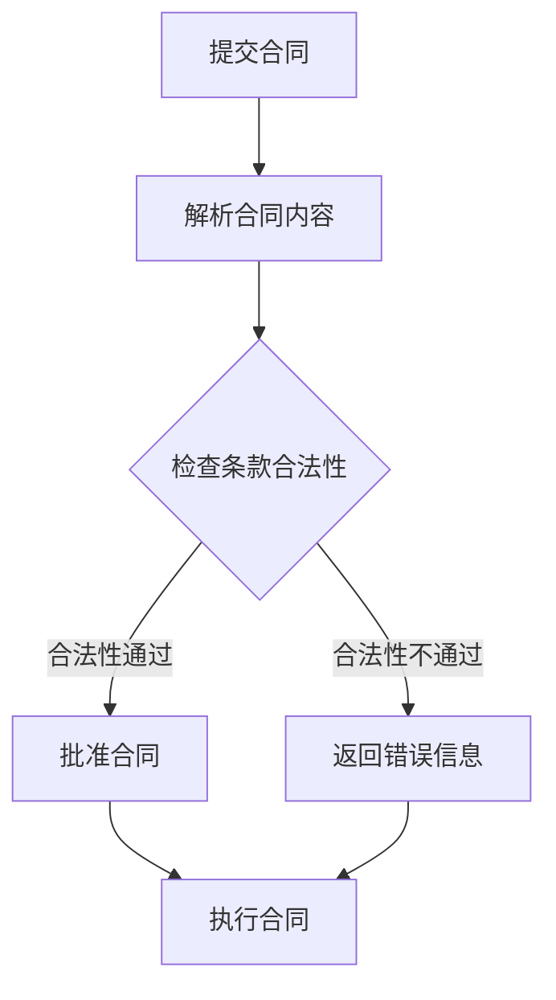
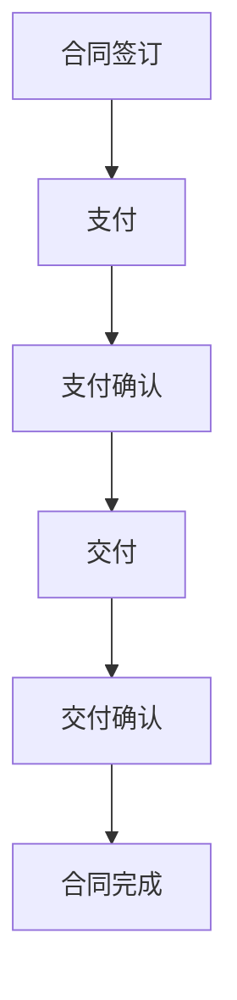
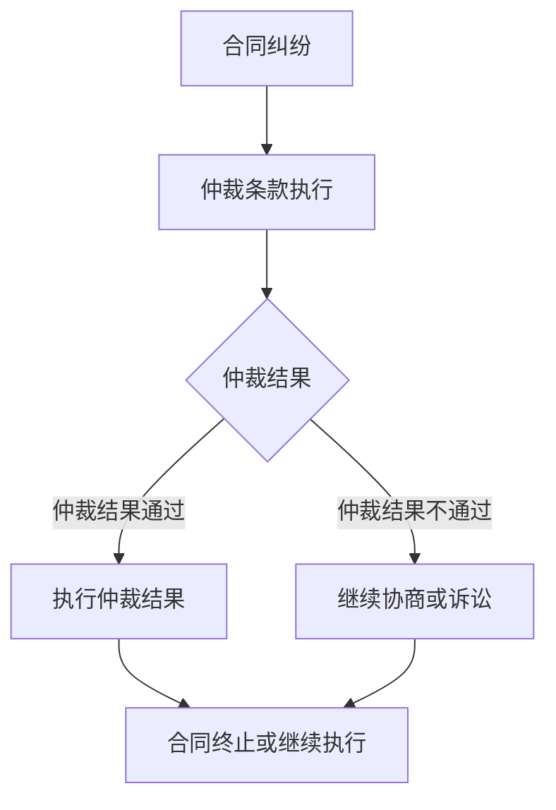
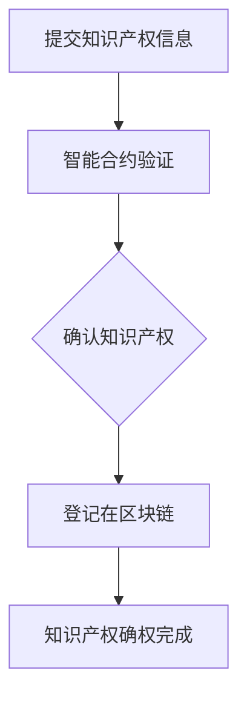

                 

## 第1章 引言

### 1.1 智能合约的基本概念

智能合约（Smart Contract）是一种运行在区块链上的计算机程序，它通过编程代码自动执行合同条款，当预定的条件被满足时，合约将自动执行相应的操作。智能合约的出现，极大程度上改变了传统的合同执行模式，减少了人为干预和纠纷的发生。

智能合约的核心特点包括自动执行、不可篡改和去中心化。自动执行指的是合约在触发条件时，能够自动执行预定的操作，无需人为干预。不可篡改则意味着合约一旦执行，其内容不可更改，从而保证了合约的公正性和透明性。去中心化则是指智能合约运行在分布式网络中，不存在中心化的管理节点，提高了系统的抗攻击能力和容错性。

智能合约的应用潜力非常广阔，尤其在法律服务领域，具有巨大的变革性意义。随着区块链技术的发展，智能合约在法律服务中的应用正逐步深入，成为行业发展的新方向。

### 1.2 法律服务现状与挑战

法律服务行业一直以来都是传统行业，其工作模式主要依赖于人工处理合同、文件和纠纷解决。尽管法律科技（Legal Tech）的兴起为法律服务带来了一些变革，但整体上，法律服务的效率和质量仍有很大的提升空间。

当前，法律服务面临的挑战主要包括以下几个方面：

1. **流程繁琐**：法律服务的流程通常非常繁琐，从合同起草、审核到执行，往往需要大量的人工处理和时间。这导致了法律服务的高成本和低效率。

2. **人为错误**：由于法律服务的流程复杂，人工处理容易产生错误，从而引发纠纷和损失。

3. **不透明**：传统法律服务中，合同的执行和变更往往不透明，容易导致信息不对称和利益冲突。

4. **诉讼成本高**：当纠纷发生时，诉讼成本高昂，且诉讼周期长，不利于及时解决问题。

### 1.3 智能合约在法律服务中的应用潜力

智能合约的出现，为解决法律服务中的上述挑战提供了新的思路和方案。通过智能合约，可以实现以下潜在应用：

1. **自动化合同管理**：智能合约可以自动化处理合同的起草、审核、签署和执行，减少人为干预，提高效率。

2. **降低成本**：智能合约去中心化的特性，使得合同的执行不再依赖中心化的第三方机构，从而降低了法律服务的成本。

3. **提高透明度**：智能合约运行在区块链上，所有操作都是公开透明的，可以有效避免信息不对称和利益冲突。

4. **减少纠纷**：智能合约的自动执行和不可篡改特性，可以大大减少因人为错误和不透明导致的纠纷。

5. **快速解决纠纷**：智能合约可以自动执行预定的纠纷解决机制，如仲裁条款，从而加快纠纷解决的速度。

总之，智能合约在法律服务中的应用前景广阔，有望带来一场深远的行业变革。接下来，我们将进一步探讨智能合约的技术原理，以及其在法律服务中的应用场景和挑战。

## 第2章 智能合约技术原理

### 2.1 区块链技术基础

区块链（Blockchain）是一种分布式数据库技术，其核心特点包括去中心化、不可篡改和透明性。区块链通过将数据分散存储在网络中的多个节点上，形成一个分布式账本，从而避免了单点故障和数据篡改的问题。

#### 2.1.1 区块链基本架构

区块链的基本架构主要包括以下几个部分：

1. **区块（Block）**：区块是区块链的基本数据单位，每个区块包含一定数量的交易记录。每个区块都有一个唯一的哈希值，通过哈希函数与前一个区块的哈希值相连，形成一个链式结构。

2. **链（Chain）**：区块链就是由一系列按顺序排列的区块组成的链式数据结构。每个区块都通过其哈希值与前一个区块链接，从而形成了区块链。

3. **节点（Node）**：节点是区块链网络中的参与者，每个节点都存储一份完整的区块链数据，并通过网络与其他节点通信，以验证和传播交易信息。

4. **挖矿（Mining）**：挖矿是区块链网络中节点通过计算工作量证明（Proof of Work, PoW）算法来验证交易并创建新区块的过程。成功挖矿的节点将获得系统奖励，如比特币。

5. **共识算法（Consensus Algorithm）**：共识算法是区块链网络中节点达成一致意见的机制。常见的共识算法包括工作量证明（PoW）、权益证明（PoS）、授权股权证明（DPoS）等。

#### 2.1.2 共识算法

共识算法是区块链网络中节点达成一致意见的重要机制。不同的共识算法有不同的特点和适用场景，以下是几种常见的共识算法：

1. **工作量证明（Proof of Work, PoW）**：PoW算法通过计算复杂度来防止恶意攻击，节点通过解决复杂的数学问题来证明自己的工作量，从而获得挖矿权利。比特币采用的是PoW算法。

2. **权益证明（Proof of Stake, PoS）**：PoS算法通过节点持有的代币数量和持币时间来证明其权益，持有代币时间越长和代币数量越多的节点，获得挖矿权利的概率越高。以太坊2.0计划采用PoS算法。

3. **授权股权证明（Delegated Proof of Stake, DPoS）**：DPoS算法通过选举出一定数量的委托人（Witness）来代表网络进行挖矿，委托人通过持币量和投票权来影响挖矿结果。比特股采用的是DPoS算法。

#### 2.1.3 智能合约编程语言

智能合约的实现依赖于特定的编程语言，以下是一些常见的智能合约编程语言：

1. **Solidity**：Solidity是智能合约编写中最常用的语言，它是一种类似于JavaScript和C++的高级编程语言，支持面向对象编程和函数重载。

2. **Vyper**：Vyper是用于以太坊智能合约的另一种编程语言，它设计初衷是为了简化代码复杂度，减少潜在的安全隐患。

3. **Scilla**：Scilla是专为卡利达索（Caliper）区块链测试平台设计的智能合约语言，它采用了一种形式化验证方法，可以确保智能合约的正确性和安全性。

#### 智能合约的工作原理

智能合约的工作原理主要涉及以下几个步骤：

1. **编写合约**：开发者使用智能合约编程语言编写智能合约代码，并编译为字节码。

2. **部署合约**：将编译后的智能合约字节码部署到区块链上，创建一个合约实例。

3. **合约调用**：当满足预定的触发条件时，合约自动执行预定的操作，如转移资产、记录事件等。

4. **合约执行结果**：智能合约执行结果被记录在区块链上，所有节点都可以查看和验证。

### 2.2 智能合约工作原理

#### 2.2.1 智能合约执行流程

智能合约的执行流程主要包括以下几个步骤：

1. **合约初始化**：智能合约在部署时，会初始化一些变量和状态，如合约创建者、余额等。

2. **触发条件**：当满足预定的触发条件时，如调用合约的某个函数，智能合约开始执行。

3. **合约执行**：智能合约按照预定的代码逻辑执行，如调用内部函数、进行数学计算等。

4. **状态更新**：智能合约执行过程中，会更新其内部状态，如余额、变量值等。

5. **结果记录**：智能合约执行结果会被记录在区块链上，包括交易详情、事件日志等。

#### 2.2.2 智能合约安全性

智能合约的安全性是确保其正确性和可靠性的关键。以下是几个影响智能合约安全性的因素：

1. **漏洞**：智能合约代码中可能存在逻辑漏洞、内存泄露等问题，导致合约执行失败或被恶意攻击。

2. **外部攻击**：黑客可能会通过各种手段攻击智能合约，如重放攻击、中间人攻击等。

3. **共识算法**：不同的共识算法对智能合约的安全性能有不同的影响，如PoW算法可能面临算力攻击，PoS算法可能面临权益攻击。

为了提高智能合约的安全性，开发者需要遵循以下最佳实践：

1. **代码审计**：在部署智能合约前，进行全面的代码审计，以发现潜在的安全隐患。

2. **测试与验证**：通过单元测试、集成测试等手段，验证智能合约的正确性和可靠性。

3. **去中心化**：确保智能合约的执行和验证过程是去中心化的，以提高系统的抗攻击能力。

通过理解智能合约的技术原理和执行流程，我们可以更好地把握其潜在应用场景和面临的挑战。接下来，我们将探讨智能合约在法律服务中的具体应用场景和挑战。

### 2.3 智能合约在法律服务中的应用场景

智能合约在法律服务中的应用场景十分广泛，以下是一些主要的应用领域：

#### 2.3.1 合同管理

智能合约可以自动化合同管理，包括合同的起草、签署、执行和跟踪。通过智能合约，企业可以快速生成标准化的合同模板，减少人工起草和审核的工作量。此外，智能合约可以自动验证合同条款的合法性，确保合同内容的一致性和完整性。

1. **自动化合同审核**：智能合约可以自动检查合同条款是否符合法律法规，确保合同的有效性。

2. **合同履约跟踪**：智能合约可以记录合同执行过程中的关键事件，如支付进度、交付状态等，实现合同履约的透明化和可追溯性。

3. **合同纠纷解决**：智能合约内置的纠纷解决机制，如仲裁条款，可以在发生纠纷时自动执行，提高纠纷解决的效率和公正性。

#### 2.3.2 知识产权保护

智能合约在知识产权保护中的应用主要涉及知识产权的登记、确权、侵权监测和维权等方面。

1. **知识产权确权**：智能合约可以自动化知识产权的登记和确权流程，确保知识产权的合法性和透明性。

2. **侵权监测**：智能合约可以实时监测知识产权的使用情况，发现侵权行为时自动触发警告或执行惩罚措施。

3. **知识产权维权**：智能合约可以自动化知识产权的维权流程，如通过仲裁、诉讼等手段保护知识产权。

#### 2.3.3 司法服务

智能合约在司法服务中的应用可以提升司法效率，降低诉讼成本，实现公正、透明的司法服务。

1. **智能裁判**：智能合约可以根据预定的法律条文和纠纷事实，自动生成裁决结果，提高裁判的效率和准确性。

2. **智能法律服务**：智能合约可以为用户提供在线法律咨询、合同审核等服务，提高法律服务的普及率和效率。

3. **智能司法辅助**：智能合约可以协助法官和律师处理案件，如自动整理案件资料、生成法律文书等，提高司法工作的效率。

通过以上应用场景，我们可以看到智能合约在法律服务中的巨大潜力。然而，智能合约的应用也面临一些挑战，如技术实现难度、法律地位和纠纷解决机制等。接下来，我们将进一步探讨智能合约在法律服务中面临的挑战与风险。

## 第3章 智能合约在法律服务中的应用场景

### 3.1 智能合约在合同管理中的应用

智能合约在合同管理中的应用，是其在法律服务中最为直接和广泛的应用领域之一。通过智能合约，企业可以自动化处理合同生命周期中的各个环节，从而提高效率、降低成本、减少纠纷。

#### 3.1.1 自动化合同审核

自动化合同审核是智能合约在合同管理中的基础应用。传统的合同审核过程往往繁琐且耗时长，需要人工逐一检查合同条款的合法性、合规性和一致性。而智能合约可以通过预定义的编程规则，自动检查合同条款，确保其符合法律法规和公司政策。

**核心概念与联系**

智能合约在合同审核中的应用，涉及以下几个核心概念：

1. **合同条款**：智能合约通过预定义的编程逻辑，对合同中的关键条款进行检查，如金额、期限、违约责任等。
2. **法律法规**：智能合约可以嵌入相关法律法规的条款，确保合同内容的合法性。
3. **合规性检查**：智能合约通过对比合同条款与公司政策、行业标准，自动检查合同的合规性。

**Mermaid 流程图**

以下是一个简化的智能合约自动化合同审核流程的Mermaid流程图：



**核心算法原理讲解**

在智能合约中，自动化合同审核的核心算法主要包括：

1. **条件判断**：智能合约通过条件判断语句（如`if-else`），对合同条款进行合法性、合规性检查。
2. **逻辑运算**：智能合约中的逻辑运算符（如`&&`、`||`）用于组合多个条件，实现复杂的逻辑判断。

**Python 源代码示例**

以下是一个简单的Python示例，用于自动化检查合同金额是否符合预定的上限：

```python
def check_contract_amount(amount, max_amount):
    if amount <= max_amount:
        return "合同金额合法"
    else:
        return "合同金额超出上限"

# 示例使用
result = check_contract_amount(50000, 100000)
print(result)
```

**数学模型和公式**

在智能合约的自动化合同审核中，常用的数学模型和公式包括：

1. **金额计算**：用于计算合同金额、违约金等。
2. **逻辑运算**：用于实现条件判断和逻辑运算。

**举例说明**

假设一个智能合约需要审核一个合同，该合同包含以下条款：

- 合同金额：500,000元
- 合同期限：2年
- 违约责任：逾期支付违约金为每日金额的1%

通过智能合约，我们可以自动检查以下条件：

1. 合同金额是否超过100,000元。
2. 合同期限是否超过2年。
3. 违约金计算是否正确。

通过以上示例，我们可以看到智能合约在自动化合同审核中的具体应用，它不仅提高了审核效率，还减少了人为错误，确保了合同条款的合法性和合规性。

#### 3.1.2 合同履约跟踪

合同履约跟踪是智能合约在合同管理中的另一个重要应用。通过智能合约，企业可以实时监控合同执行过程中的关键事件，如支付进度、交付状态等，确保合同各方的责任和义务得到履行。

**核心概念与联系**

智能合约在合同履约跟踪中的应用，涉及以下几个核心概念：

1. **合同事件**：智能合约可以记录合同执行过程中的关键事件，如支付、交付等。
2. **时间戳**：智能合约通过区块链的时间戳功能，确保合同事件的记录是真实和不可篡改的。
3. **状态更新**：智能合约可以自动更新合同状态，如“待支付”、“已支付”、“待交付”、“已交付”等。

**Mermaid 流程图**

以下是一个简化的智能合约合同履约跟踪流程的Mermaid流程图：



**核心算法原理讲解**

在智能合约中，合同履约跟踪的核心算法主要包括：

1. **事件记录**：智能合约通过事件日志（logs）记录合同执行过程中的关键事件。
2. **状态更新**：智能合约使用状态变量（state variables）来记录和更新合同状态。

**Python 源代码示例**

以下是一个简单的Python示例，用于记录和更新合同支付状态：

```python
from datetime import datetime

contract_state = {'payment_status': 'pending', 'delivery_status': 'pending'}

def record_payment():
    contract_state['payment_status'] = 'completed'
    contract_state['payment_date'] = datetime.now()

def record_delivery():
    contract_state['delivery_status'] = 'completed'
    contract_state['delivery_date'] = datetime.now()

# 示例使用
record_payment()
print(contract_state)

record_delivery()
print(contract_state)
```

**数学模型和公式**

在智能合约的合同履约跟踪中，常用的数学模型和公式包括：

1. **时间计算**：用于计算合同期限、交付期限等。
2. **状态逻辑**：用于判断合同状态的变化。

**举例说明**

假设一个智能合约需要监控一个价值100,000元的合同，合同期限为2个月。通过智能合约，我们可以自动记录以下事件：

1. 合同签订日期：2023年5月1日。
2. 支付确认日期：2023年5月15日。
3. 交付确认日期：2023年6月10日。

通过以上示例，我们可以看到智能合约在合同履约跟踪中的具体应用，它不仅实现了合同执行过程的实时监控，还确保了各方的责任和义务得到履行。

#### 3.1.3 合同纠纷解决

智能合约在合同纠纷解决中的应用，是其提升法律服务质量的重要途径。通过智能合约，企业可以在合同中预先定义纠纷解决机制，如仲裁条款，当纠纷发生时，智能合约可以自动执行相应的解决流程，提高纠纷解决的效率和公正性。

**核心概念与联系**

智能合约在合同纠纷解决中的应用，涉及以下几个核心概念：

1. **仲裁条款**：智能合约可以在合同中嵌入仲裁条款，定义纠纷解决的规则和流程。
2. **纠纷解决机制**：智能合约可以自动执行预定的纠纷解决机制，如仲裁、调解等。
3. **智能合约执行**：智能合约通过编程逻辑，自动执行纠纷解决流程，如支付违约金、解除合同等。

**Mermaid 流程图**

以下是一个简化的智能合约合同纠纷解决流程的Mermaid流程图：



**核心算法原理讲解**

在智能合约中，合同纠纷解决的核心算法主要包括：

1. **条件判断**：智能合约通过条件判断，判断是否满足仲裁条款，如逾期支付、违约行为等。
2. **执行操作**：智能合约根据仲裁结果，自动执行相应的操作，如支付违约金、解除合同等。

**Python 源代码示例**

以下是一个简单的Python示例，用于自动执行仲裁结果：

```python
def execute_arbitration_result(result):
    if result == 'pay_penalty':
        pay_penalty()
    elif result == 'terminate_contract':
        terminate_contract()

def pay_penalty():
    print("支付违约金")

def terminate_contract():
    print("合同已终止")

# 示例使用
arbitration_result = 'pay_penalty'
execute_arbitration_result(arbitration_result)
```

**数学模型和公式**

在智能合约的合同纠纷解决中，常用的数学模型和公式包括：

1. **违约金计算**：用于计算违约金金额。
2. **时间计算**：用于计算逾期时间，影响违约金的计算。

**举例说明**

假设一个合同中包含以下仲裁条款：

- 若乙方逾期支付，甲方有权要求乙方支付每日违约金1,000元。
- 若乙方严重违约，合同自动终止，乙方需支付违约金10,000元。

通过智能合约，我们可以自动执行以下操作：

1. 当乙方逾期支付时，智能合约自动计算违约金并通知乙方支付。
2. 当乙方严重违约时，智能合约自动终止合同，并通知甲方支付违约金。

通过以上示例，我们可以看到智能合约在合同纠纷解决中的具体应用，它不仅实现了自动化的纠纷解决流程，还提高了纠纷解决的效率和公正性。

#### 总结

智能合约在合同管理中的应用，涵盖了自动化合同审核、合同履约跟踪和合同纠纷解决等多个方面。通过智能合约，企业可以实现合同管理的全流程自动化，提高效率、降低成本，确保合同的合法性和公正性。随着智能合约技术的不断发展和完善，其在法律服务中的应用前景将更加广阔。

### 3.2 智能合约在知识产权保护中的应用

智能合约在知识产权保护中的应用，为其提供了更高效、更透明和更安全的解决方案。知识产权保护涉及到版权、专利、商标等多个领域，智能合约通过其独特的机制，可以实现对知识产权的全程管理，从确权到维权，提高知识产权的保护水平。

#### 3.2.1 知识产权确权

知识产权确权是知识产权管理的重要环节，传统的确权过程往往耗时较长且成本较高。智能合约通过区块链技术，可以自动化知识产权的登记和确权流程，提高确权效率和准确性。

**核心概念与联系**

智能合约在知识产权确权中的应用，涉及以下几个核心概念：

1. **知识产权登记**：智能合约可以自动化知识产权的登记流程，将知识产权信息记录在区块链上，实现确权。
2. **去中心化存储**：区块链的分布式存储机制，确保了知识产权信息的不可篡改和透明性。
3. **智能合约执行**：智能合约自动执行知识产权登记和确认操作，提高确权过程的效率。

**Mermaid 流程图**

以下是一个简化的智能合约知识产权确权流程的Mermaid流程图：



**核心算法原理讲解**

在智能合约中，知识产权确权的核心算法主要包括：

1. **数据验证**：智能合约通过预定义的算法，验证知识产权信息的合法性和真实性。
2. **登记操作**：智能合约将验证通过的知识产权信息，登记在区块链上，确保信息的不可篡改。

**Python 源代码示例**

以下是一个简单的Python示例，用于知识产权登记：

```python
def register_ip(ip_info):
    # 验证知识产权信息
    if is_valid_ip(ip_info):
        # 将知识产权信息登记在区块链上
        blockchain.register(ip_info)
        return "知识产权登记成功"
    else:
        return "知识产权信息无效"

def is_valid_ip(ip_info):
    # 检查知识产权信息是否符合要求
    # 此处简化为检查知识产权类型和名称
    return "专利" in ip_info or "商标" in ip_info

# 示例使用
ip_info = {"type": "专利", "name": "新型人工智能技术"}
result = register_ip(ip_info)
print(result)
```

**数学模型和公式**

在智能合约的知识产权确权中，常用的数学模型和公式包括：

1. **哈希值计算**：用于生成知识产权信息的哈希值，确保信息的唯一性和不可篡改性。
2. **加密算法**：用于加密知识产权信息，保护知识产权的隐私性。

**举例说明**

假设一个企业发明了一种新型的人工智能技术，并希望将其作为专利进行登记。通过智能合约，企业可以自动化以下操作：

1. 提交专利申请信息。
2. 智能合约验证专利信息的合法性和真实性。
3. 将验证通过的专利信息登记在区块链上，实现专利确权。

通过以上示例，我们可以看到智能合约在知识产权确权中的应用，它不仅提高了确权效率，还确保了知识产权信息的透明性和不可篡改性。

#### 3.2.2 知识产权侵权监测

知识产权侵权监测是保护知识产权的重要环节，传统的侵权监测方法往往依赖于人工排查和监测，存在监测效率低、易漏检的问题。智能合约通过其自动化和高效的特点，可以实现对知识产权侵权行为的实时监测和预警。

**核心概念与联系**

智能合约在知识产权侵权监测中的应用，涉及以下几个核心概念：

1. **侵权监测**：智能合约通过预定义的监测算法，自动扫描网络上的知识产权侵权行为。
2. **预警机制**：智能合约在发现侵权行为时，自动触发预警，通知权利人采取相应的措施。
3. **区块链记录**：智能合约将侵权行为记录在区块链上，确