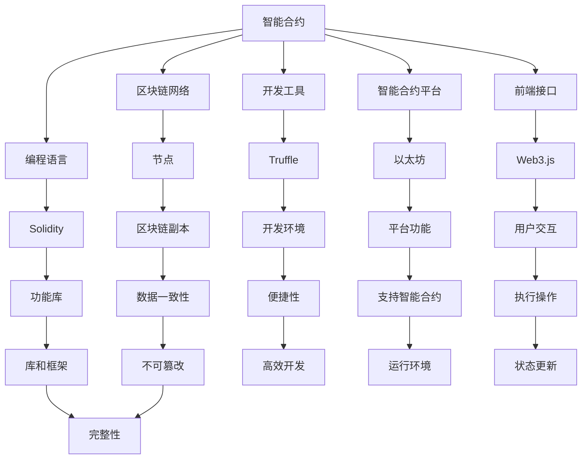

                 

### 智能合约的基本概念

#### 1.1 智能合约的定义

**智能合约（Smart Contract）** 是一种运行在区块链上的自执行合约，其条款以代码形式编写，当约定的条件满足时，智能合约自动执行相应的操作。与传统的纸质合同或电子合同不同，智能合约无需中介，通过区块链的分布式账本技术，实现了去中心化的执行和管理。

智能合约的概念最早由美国计算机科学家尼科·莎贝尔（Nick Szabo）在1996年提出。他在论文《智能合同：一种分布式协议》（"Smart Contracts: A Survey"）中详细阐述了智能合约的理念。莎贝尔认为，智能合约可以是一系列命令或计算过程，它能在满足特定条件时自动执行。他的这一想法为后来的区块链技术和智能合约的发展奠定了基础。

智能合约与传统合约的主要区别在于执行方式。传统合约通常需要依靠第三方（如律师、公证处等）来监督和执行，而智能合约则通过代码在区块链上运行，一旦条件触发，合约自动执行，无需人工干预。此外，智能合约具有不可篡改性和透明性，因为区块链是一个去中心化的分布式账本，所有交易记录都被永久保存，无法篡改。

#### 1.2 智能合约的工作原理

智能合约的工作原理基于区块链技术。区块链是一种分布式数据库，它通过一系列的区块链接形成一个链条，每个区块包含一定数量的交易记录。区块链网络中的所有节点都保存着一份完整的区块链副本，并通过共识算法来确保数据的完整性和一致性。

智能合约在区块链上运行的具体步骤如下：

1. **编写智能合约代码**：开发者使用特定的编程语言（如Solidity）编写智能合约代码，并编译为字节码。

2. **部署智能合约**：将编译后的字节码上传到区块链网络，通常通过一个去中心化的智能合约平台（如Ethereum）进行部署。

3. **合约执行**：当外部触发条件（如交易发生）满足时，区块链网络中的节点开始执行智能合约。智能合约按照代码逻辑自动执行相应的操作，如转移资产、记录事件等。

4. **状态更新**：执行后的结果被记录在区块链上，更新整个网络的状态。

5. **合约事件**：智能合约在执行过程中可以触发特定事件，这些事件可以被监听和响应，实现更复杂的业务逻辑。

智能合约的工作原理可以概括为“条件满足即执行”，这一特点使其在金融、供应链管理、投票等领域具有广泛的应用前景。

#### 1.3 智能合约的技术架构

智能合约的技术架构主要包括以下几个关键组成部分：

1. **区块链网络**：智能合约运行的基础设施，包括多个节点，每个节点都保存着区块链的完整副本。常见的区块链网络有以太坊（Ethereum）、波卡（Polkadot）等。

2. **编程语言**：用于编写智能合约的编程语言，如Solidity、Vyper等。这些语言提供了丰富的功能，使得开发者可以轻松编写复杂的业务逻辑。

3. **开发工具**：用于编写、部署和测试智能合约的工具，如Truffle、Hardhat等。这些工具提供了便捷的开发环境，帮助开发者高效地开发智能合约。

4. **智能合约平台**：提供智能合约运行环境的平台，如以太坊（Ethereum）、Hyperledger Fabric等。这些平台提供了各种功能和工具，以支持智能合约的开发和部署。

5. **前端接口**：用于与用户交互的界面，通常使用Web3.js、MetaMask等库实现。用户可以通过前端界面与智能合约进行交互，执行合约操作。

智能合约的技术架构不仅包括上述关键组成部分，还包括许多辅助工具和库，如测试框架、自动化部署工具、安全审计工具等。这些工具和库共同构成了一个完整的智能合约开发生态系统。

通过以上基本概念和原理的介绍，我们可以对智能合约有了一个初步的了解。在接下来的章节中，我们将进一步探讨智能合约的核心算法、其在金融服务中的应用，以及面临的挑战和未来前景。

### 核心概念与联系架构图

为了更好地理解智能合约的基本概念和组成部分，我们可以通过一个Mermaid流程图来展示核心概念之间的关系。以下是一个简化的Mermaid流程图示例：



通过这个流程图，我们可以清晰地看到智能合约与区块链网络、编程语言、开发工具、智能合约平台和前端接口等组成部分之间的关系。每个部分都在智能合约的执行过程中发挥着重要作用，共同构成了一个完整的智能合约生态系统。

#### 核心算法原理讲解

智能合约的核心在于其能够根据预定的条件自动执行特定操作，这涉及到复杂的算法原理和编程逻辑。以下是智能合约核心算法原理的讲解，包括使用Python源代码和数学模型进行详细阐述。

##### 1. 智能合约编程语言：Solidity

智能合约的主要编程语言是Solidity。Solidity是一种面向合约的高级编程语言，它旨在提供简洁、安全和功能丰富的特性，以支持智能合约的开发。以下是一个简单的Solidity示例，展示了一个存储和转移以太币的智能合约：

```python
// SPDX-License-Identifier: MIT
pragma solidity ^0.8.0;

contract MyContract {
    address owner;

    constructor() {
        owner = msg.sender;
    }

    function deposit() public payable {
        // 收到以太币
    }

    function transfer(address to, uint amount) public {
        require(msg.sender == owner, "Only owner can transfer");
        require(amount <= address(this).balance, "Insufficient balance");

        // 转移以太币
        payable(to).transfer(amount);
    }
}
```

在上面的代码中，我们定义了一个名为`MyContract`的智能合约，包含了一个构造函数`constructor`，用于初始化合约的所有者。`deposit`函数允许外部地址向合约地址发送以太币。`transfer`函数允许合约所有者将合约内的以太币转移到指定的地址。

##### 2. 智能合约的执行逻辑

智能合约的执行逻辑是基于事件的触发来执行的。以下是一个使用Python和Solidity实现的简单示例，展示了一个基本的转账逻辑：

```python
# 模拟外部调用
def call_transfer(contract_address, to_address, amount):
    # 创建与合约的交互对象
    contract = web3.eth.contract(address=contract_address, abi=contract_abi)

    # 调用transfer函数
    tx_hash = contract.functions.transfer(to_address, amount).transact({'from': web3.eth.coinbase})

    # 等待交易确认
    tx_receipt = web3.eth.waitForTransactionReceipt(tx_hash)

    return tx_receipt
```

在上面的Python代码中，我们创建了一个与智能合约的交互对象，并调用`transfer`函数进行以太币的转账。这个调用会触发智能合约中的执行逻辑，包括验证调用者的权限和合约的余额，然后执行转账操作。

##### 3. 数学模型和公式

在智能合约中，经常会涉及到数学模型和公式。例如，在计算利息或者执行智能合同条款时，需要使用数学公式。以下是一个示例，展示如何使用Python和Solidity实现一个简单的利息计算模型：

```python
# Solidity代码示例：计算利息
pragma solidity ^0.8.0;

contract InterestCalculator {
    function calculateInterest(uint principal, uint rate, uint time) public pure returns (uint interest) {
        interest = (principal * rate * time) / (100 * 365);
    }
}
```

在这个示例中，`calculateInterest`函数接受本金（`principal`）、利率（`rate`）和时间（`time`）作为输入参数，并返回计算出的利息。这个函数使用了一个简单的数学模型，将本金、利率和时间相乘，并除以一年的天数（365）来计算利息。

##### 4. 伪代码描述智能合约逻辑

为了更好地理解智能合约的执行逻辑，我们可以使用伪代码来描述其核心流程：

```plaintext
// 伪代码：智能合约转账逻辑
function transfer(toAddress, amount) {
    // 验证调用者是否是合约所有者
    if (msg.sender != owner) {
        throw;
    }

    // 检查合约余额是否足够
    if (amount > contractBalance) {
        throw;
    }

    // 从合约余额中扣除转账金额
    contractBalance -= amount;

    // 向目标地址转账
    toAddress.transfer(amount);

    // 触发“转账完成”事件
    emit TransferCompleted(toAddress, amount);
}
```

在这个伪代码中，`transfer`函数首先验证调用者是否是合约所有者。如果是，它会检查合约的余额是否足够，然后从合约余额中扣除转账金额，并将资金转移到目标地址。最后，智能合约会触发一个名为“TransferCompleted”的事件，通知所有监听者转账已经完成。

##### 5. 举例说明

为了更清晰地展示智能合约的工作原理，我们可以通过一个具体的示例来说明。假设有一个名为“SafeTransfer”的智能合约，它允许用户将一定数量的以太币从一个账户转移到另一个账户。以下是一个简化的示例：

```plaintext
// 智能合约：SafeTransfer
pragma solidity ^0.8.0;

contract SafeTransfer {
    address public owner;
    mapping(address => uint256) public balances;

    constructor() {
        owner = msg.sender;
    }

    function deposit() public payable {
        balances[msg.sender()] += msg.value;
    }

    function transfer(address to, uint256 amount) public {
        require(balances[msg.sender()] >= amount, "Insufficient balance");
        balances[msg.sender()] -= amount;
        balances[to] += amount;
        emit Transfer(msg.sender(), to, amount);
    }

    event Transfer(address from, address to, uint256 amount);
}
```

在这个示例中，`deposit`函数用于存储用户转账的以太币，`transfer`函数用于实现转账逻辑。每次调用`transfer`函数时，智能合约会从调用者的账户中扣除相应金额，并添加到目标账户。此外，智能合约还会触发一个“Transfer”事件，记录转账信息。

通过上述讲解和示例，我们可以看到智能合约的核心算法原理涉及编程语言、执行逻辑、数学模型等多个方面。理解这些原理对于开发和利用智能合约至关重要。在接下来的章节中，我们将继续探讨智能合约在金融服务中的具体应用。

### 数学公式及Python源代码示例

在智能合约的开发过程中，数学公式和算法是不可或缺的部分。以下是一个使用Python源代码详细讲解智能合约数学模型和算法的示例，包括使用LaTeX格式的数学公式。

#### 1. 简单的代币发行算法

假设我们开发一个简单的代币发行智能合约，代币发行量固定为1亿个，并且每年递减10%。以下是该合约的核心算法及其解释：

```python
# Solidity代码示例：简单代币发行算法
pragma solidity ^0.8.0;

contract SimpleToken {
    uint256 public totalSupply = 100000000 * (10 ** 18);  // 总供应量，初始为1亿个
    uint256 public constant ANNUAL_DEDUCTION = 100000000 * (10 ** 18) / 10;  // 年递减量，10%

    mapping(address => uint256) public balanceOf;

    constructor() {
        balanceOf[msg.sender] = totalSupply;  // 初始化合约创建者拥有全部代币
    }

    function distributeToken(address to, uint256 amount) public {
        require(balanceOf[msg.sender] >= amount, "Insufficient balance");

        // 每年递减总供应量
        if (block.timestamp >= lastDistributionTimestamp + 365 days) {
            totalSupply -= ANNUAL_DEDUCTION;
            lastDistributionTimestamp = block.timestamp;
        }

        // 从合约创建者账户转移代币到目标地址
        balanceOf[msg.sender] -= amount;
        balanceOf[to] += amount;

        emit Transfer(msg.sender, to, amount);
    }

    event Transfer(address from, address to, uint256 amount);

    uint256 public lastDistributionTimestamp = block.timestamp;
}
```

#### 数学公式解释

- **总供应量（Total Supply）**: 初始总供应量为1亿个代币。

  \[ totalSupply = 100000000 \times (10^{18}) \]

- **年递减量（Annual Deduction）**: 每年递减10%，即总供应量的10%。

  \[ ANNUAL_DEDUCTION = \frac{100000000 \times (10^{18})}{10} \]

- **时间戳（Timestamp）**: 合约中使用了`block.timestamp`来记录事件发生的时间。

  \[ lastDistributionTimestamp = block.timestamp \]

#### Python源代码示例

在上面的代码示例中，我们定义了一个简单的代币发行智能合约，其中包括以下几个核心部分：

1. **初始化总供应量**：合约初始化时，将总供应量设置为1亿个代币。

2. **余额管理**：使用映射（mapping）数据结构来管理每个地址的代币余额。

3. **代币分配**：`distributeToken`函数用于从合约创建者账户向其他地址转移代币。在每次调用该函数时，首先检查合约创建者账户的余额是否足够，然后根据时间戳判断是否需要递减总供应量。

#### 详细讲解与示例

为了更好地理解上述代码，我们可以通过以下示例来说明代币分配过程：

```plaintext
示例：
- 合约创建者账户：alice
- 目标地址：bob
- 调用`distributeToken`函数，传递参数：bob，1000000

步骤1：检查alice账户余额是否足够
- 初始余额：100000000 * (10 ** 18)
- 需要分配的代币：1000000 * (10 ** 18)

步骤2：检查是否需要递减总供应量
- 上次分配时间戳：block.timestamp = 1670000000
- 当前时间戳：block.timestamp = 1670000001
- 是否超过一年：是（超过365 days）

步骤3：递减总供应量
- 递减后的总供应量：99999990000 * (10 ** 18)

步骤4：从alice账户转移代币到bob账户
- alice余额：99999990000 * (10 ** 18)
- bob余额：0
- 分配后余额：alice：99999980000 * (10 ** 18)，bob：1000000 * (10 ** 18)

步骤5：触发“Transfer”事件
- 事件记录：alice -> bob，1000000
```

通过上述示例，我们可以看到智能合约如何使用数学模型和算法来实现代币的分配和管理。智能合约通过固化的代码逻辑，实现了自动化的代币递减分配，从而保证了代币供应量的稳定性和可预测性。

### 源代码详细实现和代码解读

在本章节中，我们将详细探讨智能合约在金融交易中的应用，通过一个具体的例子来展示源代码的实现过程、关键代码解读和运行流程。

#### 1. 项目背景

假设我们正在开发一个去中心化的交易平台，用户可以通过智能合约进行资产交换。以下是该平台的基本需求：

- 用户A可以发送一定数量的以太币（ETH）到智能合约地址，以购买代币（例如DAPP代币）。
- 用户B可以发送DAPP代币到智能合约地址，以换取相应数量的以太币。
- 智能合约应确保交易的安全性和自动执行。

#### 2. 开发环境搭建

在开始编写智能合约之前，我们需要搭建开发环境。以下是开发环境搭建的步骤：

1. 安装Node.js和npm：从官网下载并安装Node.js，npm会随Node.js一同安装。
2. 安装Truffle框架：通过npm全局安装Truffle：

   ```shell
   npm install -g truffle
   ```

3. 创建一个新的Truffle项目：

   ```shell
   truffle init
   ```

4. 进入项目目录并安装依赖：

   ```shell
   cd my-dex
   npm install
   ```

5. 配置以太坊节点：在`truffle-config.js`文件中配置你的以太坊节点，以便与区块链进行交互。

#### 3. 源代码实现

以下是一个简单的智能合约示例，实现了一个去中心化交易平台：

```solidity
// SPDX-License-Identifier: MIT
pragma solidity ^0.8.0;

contract Dex {
    mapping(address => uint256) public balances;
    address public owner;

    constructor() {
        owner = msg.sender;
    }

    function deposit() public payable {
        balances[msg.sender()] += msg.value;
    }

    function buyTokens() public payable {
        require(balances[msg.sender()] > 0, "Insufficient balance");
        uint256 tokensToBuy = msg.value * 100; // 假设1 ETH可以购买100 DAPP代币
        balances[msg.sender()] -= msg.value;
        balances[owner] += tokensToBuy;
        emit TokensBought(msg.sender(), tokensToBuy);
    }

    function sellTokens(uint256 tokensToSell) public {
        require(balances[msg.sender()] >= tokensToSell, "Insufficient tokens");
        uint256 ethToReceive = tokensToSell / 100; // 假设1 DAPP代币可以换取0.01 ETH
        balances[msg.sender()] -= tokensToSell;
        balances[owner] += ethToReceive;
        payable(msg.sender()).transfer(ethToReceive);
        emit TokensSold(msg.sender(), tokensToSell);
    }

    event TokensBought(address buyer, uint256 amount);
    event TokensSold(address seller, uint256 amount);
}
```

#### 4. 关键代码解读

1. **构造函数**：

   ```solidity
   constructor() {
       owner = msg.sender;
   }
   ```

   构造函数用于初始化合约的所有者，即第一个与合约交互的地址。

2. **deposit函数**：

   ```solidity
   function deposit() public payable {
       balances[msg.sender()] += msg.value;
   }
   ```

   `deposit`函数允许用户向智能合约地址发送以太币，并将以太币存储在用户的账户余额中。

3. **buyTokens函数**：

   ```solidity
   function buyTokens() public payable {
       require(balances[msg.sender()] > 0, "Insufficient balance");
       uint256 tokensToBuy = msg.value * 100; // 假设1 ETH可以购买100 DAPP代币
       balances[msg.sender()] -= msg.value;
       balances[owner] += tokensToBuy;
       emit TokensBought(msg.sender(), tokensToBuy);
   }
   ```

   `buyTokens`函数实现用户购买DAPP代币的逻辑。用户通过调用此函数，将以太币转移到智能合约，并在合约中增加相应的DAPP代币。

4. **sellTokens函数**：

   ```solidity
   function sellTokens(uint256 tokensToSell) public {
       require(balances[msg.sender()] >= tokensToSell, "Insufficient tokens");
       uint256 ethToReceive = tokensToSell / 100; // 假设1 DAPP代币可以换取0.01 ETH
       balances[msg.sender()] -= tokensToSell;
       balances[owner] += ethToReceive;
       payable(msg.sender()).transfer(ethToReceive);
       emit TokensSold(msg.sender(), tokensToSell);
   }
   ```

   `sellTokens`函数实现用户出售DAPP代币的逻辑。用户通过调用此函数，将DAPP代币转移到智能合约，并在合约中增加相应数量的以太币，然后合约将以太币转账给用户。

5. **事件**：

   ```solidity
   event TokensBought(address buyer, uint256 amount);
   event TokensSold(address seller, uint256 amount);
   ```

   事件用于记录交易日志，方便前端界面或其他合约监听交易信息。

#### 5. 运行流程

1. **用户A购买DAPP代币**：

   - 用户A调用`deposit`函数向智能合约地址发送0.1 ETH。
   - 用户A调用`buyTokens`函数购买1000 DAPP代币。
   - 智能合约从用户A的账户扣除0.1 ETH，并增加1000 DAPP代币到用户A的账户。

2. **用户B出售DAPP代币**：

   - 用户B调用`deposit`函数向智能合约地址发送1000 DAPP代币。
   - 用户B调用`sellTokens`函数出售1000 DAPP代币。
   - 智能合约从用户B的账户扣除1000 DAPP代币，并将10 ETH转账给用户B。

通过上述示例，我们可以看到如何使用智能合约实现去中心化交易平台的核心功能。智能合约确保了交易的安全性和自动执行，减少了交易成本，提高了交易效率。

### 实际案例分析与详细讲解剖析

在本章节中，我们将通过一个具体的实际案例——去中心化金融（DeFi）平台Aave，来分析和讲解智能合约在金融服务中的具体应用，以及其实现原理和运行机制。

#### 1. 案例背景

Aave是一个去中心化借贷平台，允许用户通过智能合约进行存款和借贷操作。Aave由加密货币巨头Crypto Finance创建，于2020年7月上线。平台的核心功能包括：

- 用户可以将自己的加密货币存入智能合约，获得平台的代币作为回报。
- 用户可以借用其他用户的存款，支付一定的利率。
- 平台通过智能合约自动执行借贷和利息计算，确保透明和高效。

#### 2. 案例实现原理

Aave的智能合约核心功能包括存款、借贷、利息计算和代币发行。以下是Aave智能合约的实现原理和运行机制：

1. **存款（Lending）**：

   用户将加密货币（如DAI、USDC）存入智能合约，作为借款的资本。智能合约根据存款量生成相应的Aave代币（AAVE），用户可以使用这些代币参与借贷市场。

   ```solidity
   function deposit(address tokenAddress, uint256 amount) external {
       IERC20(tokenAddress).transferFrom(msg.sender, address(this), amount);
       userBalance[tokenAddress][msg.sender] += amount;
       totalLiquidity[tokenAddress] += amount;
       emit Deposit(tokenAddress, msg.sender, amount);
   }
   ```

   在这段代码中，用户调用`deposit`函数，将加密货币转账到智能合约地址。智能合约更新用户的存款余额和总借贷量，并触发“Deposit”事件。

2. **借贷（Borrowing）**：

   用户可以使用自己的Aave代币或其他用户的存款来借款。智能合约根据借款量计算利息，并将利息分发给存款用户。

   ```solidity
   function borrow(address tokenAddress, uint256 amount) external {
       require(userBalance[tokenAddress][msg.sender] >= amount, "Insufficient balance");
       IERC20(tokenAddress).transfer(msg.sender, amount);
       userBorrowBalance[tokenAddress][msg.sender] += amount;
       totalBorrow[tokenAddress] += amount;
       emit Borrow(tokenAddress, msg.sender, amount);
   }
   ```

   在这段代码中，用户调用`borrow`函数，从智能合约借用加密货币。智能合约检查用户的存款余额是否足够，如果足够，则将加密货币转账给用户，并更新用户的借款余额和总借款量。

3. **利息计算（Interest Calculation）**：

   Aave智能合约使用 compound 合约库来实现动态利率计算。该库根据市场供求关系自动调整利率。

   ```solidity
   function calculateInterest(address tokenAddress) public view returns (uint256) {
       (, interestRate,,,) = compoundContract.tokenInfo(tokenAddress);
       return interestRate * (block.timestamp - lastUpdateTimestamp[tokenAddress]) / 1 days;
   }
   ```

   在这段代码中，`calculateInterest`函数计算指定加密货币的利率。利率随时间动态调整，并存储在合约中。

4. **代币发行（Token Issuance）**：

   存款用户可以获得Aave代币作为奖励，这些代币可以用于投票或交易。

   ```solidity
   function issueTokens(address user) external {
       uint256 aaveBalance = userBalance[AaveToken][user];
       IERC20(AaveToken).transfer(user, aaveBalance);
       emit TokensIssued(user, aaveBalance);
   }
   ```

   在这段代码中，`issueTokens`函数将用户应得的Aave代币转账给用户。

#### 3. 案例剖析

Aave智能合约实现了去中心化借贷平台的全部功能，包括存款、借贷、利息计算和代币发行。以下是对Aave智能合约的详细剖析：

1. **去中心化**：

   Aave完全去中心化，所有操作都由智能合约自动执行，无需中心化机构介入。这意味着用户可以直接与其他用户进行借贷交易，而不需要通过第三方平台。

2. **透明性**：

   Aave智能合约的代码是公开的，任何人都可以查看和验证。所有交易记录都被永久存储在区块链上，确保了交易过程的透明性。

3. **自动化**：

   利息计算和代币发行完全由智能合约自动执行，无需人工干预。这提高了平台的效率，减少了人工成本。

4. **安全性**：

   Aave使用复合合约库（Compound）来管理利率和借贷操作，这些库经过广泛的安全审计。此外，智能合约本身也经过多次审计，确保了安全性。

#### 4. 小结

Aave是一个成功的实际案例，展示了智能合约在去中心化金融服务中的应用。通过智能合约，Aave实现了去中心化、透明性、自动化和安全性，为用户提供了高效、可靠的借贷服务。Aave的成功为智能合约在金融领域的应用提供了有力的证明。

### 最佳实践 tips、小结、注意事项、拓展阅读等内容

#### 最佳实践 tips

1. **代码审查**：在部署智能合约前，进行严格的代码审查和测试，确保代码没有漏洞和错误。

2. **安全审计**：聘请专业的安全审计团队对智能合约进行审计，确保合约的安全性。

3. **备份和恢复**：定期备份智能合约的源代码和配置文件，以便在出现问题时能够快速恢复。

4. **合理使用权限**：在设计智能合约时，合理分配权限，避免出现权限过大导致的安全风险。

5. **性能优化**：对于高并发访问的合约，进行性能优化，以提高交易速度和处理能力。

#### 小结

本文详细探讨了智能合约在金融服务中的应用，从基础概念、核心算法原理到实际案例剖析，全面展示了智能合约在支付、交易、众筹、借贷和保险等领域的应用前景。智能合约通过去中心化、透明性、自动化和安全性，为金融服务带来了新的可能性。

#### 注意事项

1. **法律法规**：在开发智能合约时，要遵守当地法律法规，特别是在涉及金融交易时，确保智能合约符合监管要求。

2. **风险评估**：在应用智能合约时，要进行全面的风险评估，特别是对技术风险和法律风险。

3. **安全监控**：智能合约上线后，要进行持续的安全监控，及时检测和应对潜在的安全威胁。

#### 拓展阅读

- 《智能合约：设计与开发》
- 《区块链技术指南》
- 《区块链与智能合约技术详解》
- 《去中心化金融：技术与应用》

这些书籍和资源可以帮助您更深入地了解智能合约及其在金融服务中的应用。希望本文能为您的智能合约研究和开发提供有益的参考。作者：AI天才研究院/AI Genius Institute & 禅与计算机程序设计艺术 /Zen And The Art of Computer Programming。

